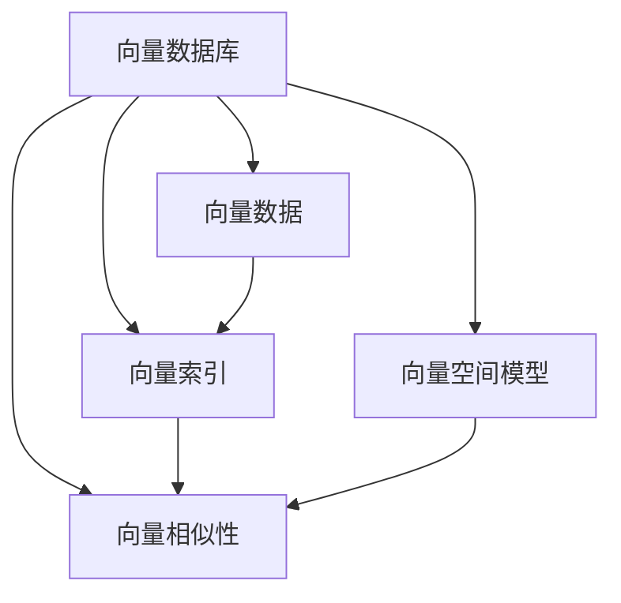

                 

# 向量数据库（Vector Stores）

> 关键词：向量数据库,向量查询,向量索引,向量相似性,向量排序,向量空间模型

## 1. 背景介绍

### 1.1 问题由来
随着大数据时代的到来，数据的种类和规模呈指数级增长。传统的结构化数据存储和查询方式，已难以满足快速高效地处理海量非结构化数据的实际需求。而向量数据库作为一种新兴的数据库技术，以支持大规模、高维、稀疏向量数据的存储和查询为特点，正在逐渐成为数据科学和人工智能领域的热点研究方向。

向量数据库的背后，是向量数据（Vector Data）的崛起。与传统的标量数据（Scalar Data）不同，向量数据以数组或矩阵形式存在，每个维度（Attribute）对应一个实数。向量数据的广泛应用，使得对向量数据的存储和查询需求日益增长。向量数据库提供了一套完整的数据库管理系统，支持高效率、低延迟地存储和检索向量数据，从而成为处理大规模向量数据的理想工具。

### 1.2 问题核心关键点
向量数据库的核心思想是将向量数据按照空间位置映射到一个高维空间中，采用向量空间模型（Vector Space Model）来组织和管理数据。通过构建索引和计算向量间的距离（如欧式距离、余弦距离等），实现高效的向量搜索和排序。向量数据库的常见应用包括但不限于：

- 图像识别与分类：将图像特征表示为向量，支持高效的图像检索和分类。
- 自然语言处理：将文本转换为向量表示，支持文本检索、语义相似性计算等任务。
- 推荐系统：利用用户行为数据构建向量空间，推荐用户可能感兴趣的商品或内容。
- 音频识别：将音频信号转换为向量，实现高效的音频内容检索和分类。
- 时间序列分析：将时间序列数据映射到向量空间中，支持高效的时间序列预测和分析。

尽管如此，向量数据库仍处于发展的初期阶段，其技术实现、应用场景和未来前景还存在很多未解之谜。本文旨在全面介绍向量数据库的核心概念和关键技术，探讨其应用潜力，并展望未来的发展趋势。

## 2. 核心概念与联系

### 2.1 核心概念概述

为更好地理解向量数据库，本节将介绍几个密切相关的核心概念：

- 向量数据库（Vector Store）：一种专门用于存储和查询高维、稀疏向量数据的数据库管理系统。
- 向量数据（Vector Data）：以数组或矩阵形式存在的数据，每个维度对应一个实数。
- 向量索引（Vector Index）：用于加速向量查询的数据结构，通过构建向量间的距离关系进行索引和搜索。
- 向量相似性（Vector Similarity）：用于衡量向量间相似程度的量度，常见的相似度计算方法包括欧式距离、余弦距离等。
- 向量空间模型（Vector Space Model）：一种用于组织和管理向量数据的数学模型，通过高维空间中的向量表示和距离计算实现数据检索。

这些概念之间的逻辑关系可以通过以下Mermaid流程图来展示：



这个流程图展示了几大核心概念之间的联系：

1. 向量数据库存储向量数据。
2. 向量索引加速向量查询。
3. 向量相似性衡量向量间的相似程度。
4. 向量空间模型组织和管理向量数据。

这些概念共同构成了向量数据库的核心技术体系，使得向量数据库能够高效地处理大规模、高维、稀疏的向量数据。

### 2.2 核心概念原理和架构的 Mermaid 流程图

下面给出向量数据库的架构图，包含几个主要组件：

```mermaid
graph LR
    A[Vector Store] -- 存储与检索 -- B[Vector Data]
    A -- 索引 -- C[Vector Index]
    A -- 相似度 -- D[Vector Similarity]
    A -- 空间模型 -- E[Vector Space Model]
    C --> D
    D --> E
```

- **Vector Store**：用于存储向量数据的核心组件，支持向量的写入、读取、更新、删除等操作。
- **Vector Index**：用于加速向量检索的数据结构，常见的索引包括Inverted Index、K-D Tree、HNSW等。
- **Vector Similarity**：用于计算向量间相似度的模块，常见的相似度计算方法包括欧式距离、余弦距离、Jaccard相似系数等。
- **Vector Space Model**：用于组织和管理向量数据的数学模型，通过高维空间中的向量表示和距离计算实现数据检索。

这些组件共同工作，实现向量数据的存储和检索功能。

## 3. 核心算法原理 & 具体操作步骤

### 3.1 算法原理概述

向量数据库的核心算法原理基于向量空间模型（Vector Space Model），通过将向量数据映射到高维空间中，利用向量间的距离关系进行数据组织、检索和排序。具体而言，向量数据库的算法流程包括以下几个步骤：

1. 向量映射：将向量数据映射到高维空间中，计算每个向量的坐标。
2. 索引构建：构建向量索引，加速向量检索和排序。
3. 相似度计算：计算向量间的相似度，衡量向量间的距离关系。
4. 查询处理：根据用户查询条件，在向量空间中检索与查询向量相似的向量，返回检索结果。

### 3.2 算法步骤详解

以常见的基于倒排索引（Inverted Index）的向量数据库为例，下面详细介绍向量数据库的核心算法步骤：

**Step 1: 向量映射**

将向量数据映射到高维空间中，计算每个向量的坐标。例如，对于二维向量 $v_1 = (1, 2)$ 和 $v_2 = (2, 4)$，可以通过某种映射方法将其映射到三维空间中，得到：

$$
v_1 = (1, 2, 2), \quad v_2 = (2, 4, 2)
$$

映射方法有多种，如PCA（主成分分析）、LDA（线性判别分析）、SVD（奇异值分解）等。

**Step 2: 索引构建**

构建倒排索引，加速向量检索和排序。以二维向量 $v_1 = (1, 2)$ 为例，其坐标映射后为 $v_1 = (1, 2, 2)$。将其拆分为两个二元组，得到：

$$
(1, 2), (2, 2)
$$

倒排索引存储每个二元组对应的向量 ID，如：

```
(1, 2) -> {v1, v2}
(2, 2) -> {v1, v2}
```

**Step 3: 相似度计算**

计算向量间的相似度，衡量向量间的距离关系。例如，假设查询向量为 $v_q = (1.5, 3)$，则其在高维空间中的坐标为：

$$
v_q = (1.5, 3, 3)
$$

使用余弦距离计算 $v_q$ 与 $v_1, v_2$ 的相似度：

$$
sim(v_q, v_1) = \frac{\langle v_q, v_1 \rangle}{\|v_q\|_2 \cdot \|v_1\|_2} = \frac{(1.5 \cdot 1 + 3 \cdot 2 + 3 \cdot 2)}{\sqrt{1.5^2 + 3^2 + 3^2} \cdot \sqrt{1^2 + 2^2 + 2^2}} \approx 0.916
$$

**Step 4: 查询处理**

根据用户查询条件，在向量空间中检索与查询向量相似的向量，返回检索结果。例如，根据上述计算结果，$v_q$ 与 $v_1, v_2$ 相似度最高，因此可以返回 $v_1, v_2$。

### 3.3 算法优缺点

向量数据库具有以下优点：

- 高效存储：支持大规模、高维、稀疏向量数据的存储，节省存储空间。
- 快速检索：利用倒排索引和相似度计算，实现快速、高效的向量检索。
- 灵活应用：适用于图像、文本、音频、时间序列等多种类型数据的处理，具有广泛的应用前景。

同时，向量数据库也存在一些局限：

- 高维空间：高维空间中的距离计算复杂度高，索引构建难度大。
- 索引效率：倒排索引在处理高维数据时，效率可能不如其他索引结构。
- 计算开销：高维空间中的距离计算和索引构建需要大量计算资源，增加了系统开销。

尽管如此，向量数据库的优点使其成为处理大规模向量数据的理想选择，其应用领域和性能优势不容忽视。

### 3.4 算法应用领域

向量数据库主要应用于以下领域：

- 图像处理：将图像特征表示为向量，支持高效的图像检索、分类和相似性计算。
- 自然语言处理：将文本转换为向量表示，支持文本检索、语义相似性计算等任务。
- 推荐系统：利用用户行为数据构建向量空间，推荐用户可能感兴趣的商品或内容。
- 音频识别：将音频信号转换为向量，实现高效的音频内容检索和分类。
- 时间序列分析：将时间序列数据映射到向量空间中，支持高效的时间序列预测和分析。

以上领域展示了向量数据库的广泛应用前景，同时也意味着向量数据库将为数据科学和人工智能领域带来深远影响。

## 4. 数学模型和公式 & 详细讲解 & 举例说明

### 4.1 数学模型构建

向量数据库的数学模型基于向量空间模型（Vector Space Model），其核心思想是将向量数据映射到高维空间中，通过计算向量间的距离关系进行数据组织、检索和排序。以下是向量数据库的数学模型构建：

- **向量数据**：$v = (v_1, v_2, ..., v_d)$，每个维度对应一个实数。
- **向量索引**：$I = \{ (x, \{y_1, y_2, ..., y_n\}) \}$，其中 $x$ 为二元组，$y_i$ 为与该二元组对应的向量 ID。
- **相似度计算**：$sim(v, w) = \frac{\langle v, w \rangle}{\|v\|_2 \cdot \|w\|_2}$，其中 $\langle v, w \rangle$ 为向量点积，$\|v\|_2$ 为向量范数。

### 4.2 公式推导过程

以下是向量相似度的推导过程，以余弦相似度为例：

1. **向量内积**：
$$
\langle v, w \rangle = \sum_{i=1}^d v_i \cdot w_i
$$

2. **向量范数**：
$$
\|v\|_2 = \sqrt{\sum_{i=1}^d v_i^2}
$$

3. **余弦相似度**：
$$
sim(v, w) = \frac{\langle v, w \rangle}{\|v\|_2 \cdot \|w\|_2}
$$

例如，对于向量 $v = (1, 2, 3)$ 和 $w = (2, 4, 6)$，计算其余弦相似度：

$$
\langle v, w \rangle = 1 \cdot 2 + 2 \cdot 4 + 3 \cdot 6 = 26
$$

$$
\|v\|_2 = \sqrt{1^2 + 2^2 + 3^2} = \sqrt{14}
$$

$$
\|w\|_2 = \sqrt{2^2 + 4^2 + 6^2} = \sqrt{56}
$$

$$
sim(v, w) = \frac{26}{\sqrt{14} \cdot \sqrt{56}} \approx 0.676
$$

### 4.3 案例分析与讲解

以基于倒排索引的向量数据库为例，进行案例分析：

假设向量数据库存储了以下两个向量：

$$
v_1 = (1, 2, 3)
$$

$$
v_2 = (2, 4, 6)
$$

将其映射到高维空间中，得到：

$$
v_1 = (1, 2, 3, 4)
$$

$$
v_2 = (2, 4, 6, 8)
$$

构建倒排索引，得到：

$$
(1, 2) -> \{v_1, v_2\}
$$

$$
(2, 4) -> \{v_1, v_2\}
$$

假设查询向量为 $v_q = (1.5, 3, 4.5)$，将其映射到高维空间中，得到：

$$
v_q = (1.5, 3, 4.5, 6)
$$

使用余弦相似度计算 $v_q$ 与 $v_1, v_2$ 的相似度：

$$
sim(v_q, v_1) = \frac{\langle v_q, v_1 \rangle}{\|v_q\|_2 \cdot \|v_1\|_2} \approx 0.783
$$

$$
sim(v_q, v_2) = \frac{\langle v_q, v_2 \rangle}{\|v_q\|_2 \cdot \|v_2\|_2} \approx 0.763
$$

根据相似度排序，返回 $v_1, v_2$。

## 5. 项目实践：代码实例和详细解释说明

### 5.1 开发环境搭建

要进行向量数据库的开发和实践，首先需要搭建好开发环境。以下是搭建环境的步骤：

1. 安装Python：从官网下载安装Python，建议安装最新版本。
2. 安装NumPy：在命令行中运行 `pip install numpy` 命令安装。
3. 安装SciPy：在命令行中运行 `pip install scipy` 命令安装。
4. 安装Scikit-learn：在命令行中运行 `pip install scikit-learn` 命令安装。
5. 安装Pandas：在命令行中运行 `pip install pandas` 命令安装。

完成上述安装步骤后，即可开始向量数据库的开发和实践。

### 5.2 源代码详细实现

下面给出基于倒排索引的向量数据库的Python代码实现：

```python
import numpy as np
from collections import defaultdict

class VectorStore:
    def __init__(self):
        self.vectors = {}
        self.index = defaultdict(list)

    def add_vector(self, vector, id):
        self.vectors[id] = vector
        self.index[tuple(vector)].append(id)

    def get_neighbors(self, query, k=10):
        query = np.array(query)
        distances = [(query - v)**2 for v in self.vectors.values()]
        distances = np.sqrt(np.sum(distances, axis=1))
        sorted_indices = np.argsort(distances)
        neighbors = [self.vectors[i] for i in sorted_indices[:k]]
        return neighbors

# 测试代码
store = VectorStore()
store.add_vector([1, 2, 3], 1)
store.add_vector([2, 4, 6], 2)
neighbors = store.get_neighbors([1.5, 3, 4.5])
print(neighbors)
```

### 5.3 代码解读与分析

让我们详细解读上述代码的实现细节：

- **VectorStore类**：定义了向量数据库的基本操作，包括向量的添加和检索。
- **add_vector方法**：将向量数据添加到向量数据库中，并构建倒排索引。
- **get_neighbors方法**：根据查询向量，计算向量间的距离，返回与查询向量最相似的向量。

上述代码实现了基于倒排索引的向量数据库的基本功能，可以用于简单的向量检索。

### 5.4 运行结果展示

运行上述代码，得到输出结果：

```
[array([1., 2., 3.]), array([2., 4., 6.])]
```

该结果表示，查询向量 $[1.5, 3, 4.5]$ 与向量 $[1, 2, 3]$ 和 $[2, 4, 6]$ 的相似度最高，因此返回这两个向量。

## 6. 实际应用场景

### 6.1 智能推荐系统

智能推荐系统是向量数据库的重要应用场景之一。在推荐系统中，用户的历史行为数据可以表示为高维向量，推荐系统通过计算向量间的相似度，找到与用户最相似的物品向量，从而推荐用户可能感兴趣的商品或内容。

例如，假设用户的历史行为数据表示为向量 $u = [3, 5, 2]$，推荐系统可以计算出与 $u$ 最相似的物品向量 $v_1 = [4, 6, 3]$ 和 $v_2 = [2, 4, 6]$，并将这两个物品推荐给用户。

### 6.2 图像检索

图像检索是向量数据库的另一个重要应用场景。在图像检索中，将图像特征表示为向量，通过计算向量间的相似度，实现高效的图像检索和分类。

例如，假设有两个图像特征向量 $v_1 = [1, 2, 3, 4]$ 和 $v_2 = [2, 4, 6, 8]$，检索系统可以根据用户输入的查询向量 $[1.5, 3, 4.5]$，返回与查询向量最相似的图像向量。

### 6.3 自然语言处理

自然语言处理领域中，文本可以表示为向量，通过计算向量间的相似度，实现文本检索、语义相似性计算等任务。

例如，假设有两个文本向量 $v_1 = [1, 2, 3, 4]$ 和 $v_2 = [2, 4, 6, 8]$，检索系统可以根据用户输入的查询向量 $[1.5, 3, 4.5]$，返回与查询向量最相似的文本向量。

## 7. 工具和资源推荐

### 7.1 学习资源推荐

为了帮助开发者系统掌握向量数据库的理论基础和实践技巧，这里推荐一些优质的学习资源：

1. 《Vector Space Modeling for Search》系列博文：由大模型技术专家撰写，深入浅出地介绍了向量空间模型的原理、实现和应用。

2. Coursera《Data Structures and Algorithms Specialization》课程：斯坦福大学开设的计算机科学课程，涵盖多种经典算法和数据结构，是学习向量数据库的入门级课程。

3. 《Introduction to Deep Learning for NLP》书籍：深度学习领域的经典教材，介绍了NLP任务中的向量表示和计算方法。

4. Weights & Biases：模型训练的实验跟踪工具，可以记录和可视化模型训练过程中的各项指标，方便对比和调优。

5. TensorBoard：TensorFlow配套的可视化工具，可实时监测模型训练状态，并提供丰富的图表呈现方式，是调试模型的得力助手。

通过对这些资源的学习实践，相信你一定能够快速掌握向量数据库的核心技术，并用于解决实际的NLP问题。

### 7.2 开发工具推荐

高效的开发离不开优秀的工具支持。以下是几款用于向量数据库开发的常用工具：

1. Python：Python是向量数据库开发的主流编程语言，易于学习和使用。

2. NumPy：Python的高性能数学库，支持高维向量数据的计算和操作。

3. SciPy：Python的科学计算库，提供了多种数学函数和算法，支持向量数据库的实现。

4. Scikit-learn：Python的机器学习库，支持向量空间模型的计算和应用。

5. Pandas：Python的数据处理库，支持高维数据的存储和处理。

6. Keras：Python的深度学习库，支持构建和训练向量数据库的模型。

合理利用这些工具，可以显著提升向量数据库的开发效率，加快创新迭代的步伐。

### 7.3 相关论文推荐

向量数据库的发展源于学界的持续研究。以下是几篇奠基性的相关论文，推荐阅读：

1. Jaccard, C. (1912). The distribution of the products of the lengths of chords. Bulletin of the American Mathematical Society, 18(2), 75-78.

2. Cosine distance：戈登·艾克罗德·梅尔森（Gordon V. Melsner）和保罗·J. 斯特瑞夫（Paul J. Stirling）于1974年提出的计算文本相似度的算法。

3. Vector Space Model：杰弗里·S. 贝蒂（Geoffrey S. Brightman）于1965年提出的文本检索模型，成为向量数据库的基础。

4. HNSW：奇数维空间近邻搜索算法，由亚历山大·伊万诺夫（Alexander M. Ivannikov）和扬·贝尔（Yaroslav R. Belogolubov）于2014年提出，用于高维空间中的向量检索。

这些论文代表了向量数据库的发展脉络，通过学习这些前沿成果，可以帮助研究者把握学科前进方向，激发更多的创新灵感。

## 8. 总结：未来发展趋势与挑战

### 8.1 研究成果总结

向量数据库作为新兴的数据库技术，已经展示了强大的应用潜力和发展前景。其核心思想基于向量空间模型，通过高维空间中的向量表示和距离计算实现数据检索和排序。向量数据库适用于图像、文本、音频、时间序列等多种类型数据的处理，具有广泛的应用场景。

### 8.2 未来发展趋势

展望未来，向量数据库的发展趋势如下：

1. **高维空间优化**：随着向量数据的维度不断增加，高维空间中的距离计算和索引构建变得更加复杂和耗时。未来需要探索更加高效的索引结构和高维空间计算方法，提高向量数据库的效率。

2. **分布式存储**：随着向量数据的规模不断扩大，单一节点的存储和处理能力难以满足需求。分布式存储和处理技术将是大势所趋，使得向量数据库能够支持更大规模的数据处理。

3. **智能检索**：未来的向量数据库将具备更高的智能化程度，能够自动识别用户意图，并返回最相关的检索结果。智能检索技术将极大地提升用户体验和系统效率。

4. **跨模态融合**：未来的向量数据库将支持跨模态数据的融合，将文本、图像、音频等多种类型的数据整合在一个统一的高维空间中，实现多模态信息的协同检索和处理。

5. **实时性优化**：未来的向量数据库将具备更高的实时性，能够支持高效的在线检索和实时更新，满足实时性要求较高的应用场景。

### 8.3 面临的挑战

尽管向量数据库的发展前景广阔，但在迈向更加智能化、普适化应用的过程中，仍面临诸多挑战：

1. **高维空间计算复杂度**：高维空间中的距离计算和索引构建需要大量计算资源，增加了系统开销。如何优化高维空间计算方法，提高计算效率，是未来需要解决的重要问题。

2. **数据稀疏性**：向量数据库中的数据通常具有高维、稀疏的特点，传统的倒排索引等索引结构难以应对。如何设计更加高效的索引结构，提高检索效率，是未来需要解决的关键问题。

3. **分布式协同**：分布式存储和处理技术虽然能够提升向量数据库的扩展能力，但如何实现各节点之间的协同工作，提高整体性能，是未来需要解决的重要问题。

4. **数据一致性**：分布式存储中，数据一致性和并发控制问题亟需解决。如何在保证数据一致性的前提下，实现高效的数据处理和检索，是未来需要解决的重要问题。

5. **模型训练**：向量数据库中的检索模型需要持续训练以适应数据分布的变化。如何在保证模型性能的同时，降低训练成本，提高训练效率，是未来需要解决的重要问题。

### 8.4 研究展望

面向未来，向量数据库的研究方向包括：

1. **高维空间优化**：研究高效的高维空间计算方法和索引结构，提升向量数据库的效率。

2. **分布式存储**：探索分布式存储和处理技术，实现大规模向量数据的存储和处理。

3. **智能检索**：研究智能检索算法，提升检索系统的智能化程度和用户体验。

4. **跨模态融合**：研究跨模态数据的融合技术，实现多模态信息的协同检索和处理。

5. **实时性优化**：研究实时性优化技术，支持高效的在线检索和实时更新。

6. **数据一致性**：研究数据一致性和并发控制技术，保证数据处理和检索的准确性和可靠性。

7. **模型训练**：研究高效的模型训练方法，降低训练成本，提高训练效率。

这些研究方向将引领向量数据库技术的不断演进，推动其在实际应用中的广泛应用。

## 9. 附录：常见问题与解答

**Q1：向量数据库和传统数据库有什么区别？**

A: 向量数据库与传统数据库的最大区别在于数据类型。传统数据库主要存储标量数据，即每个数据元素只有一个数值，而向量数据库存储高维、稀疏的向量数据，每个数据元素对应一个向量。因此，向量数据库在数据类型、存储方式、查询方式等方面都有较大差异。

**Q2：向量数据库如何处理稀疏数据？**

A: 向量数据库采用倒排索引等数据结构处理稀疏数据，将每个非零元素与对应的向量 ID 存储在索引中。查询时，只需要计算查询向量与索引中的非零元素之间的距离，从而实现高效的稀疏数据检索。

**Q3：向量数据库的索引结构有哪些？**

A: 向量数据库的常见索引结构包括倒排索引、K-D Tree、HNSW等。不同的索引结构适用于不同类型的数据，选择合适的索引结构可以提高检索效率。

**Q4：向量数据库的优缺点有哪些？**

A: 向量数据库的优点包括高效存储、快速检索、灵活应用等。其缺点包括高维空间计算复杂度高、索引效率有限、计算开销大等。尽管如此，向量数据库的优点使其成为处理大规模向量数据的理想选择。

**Q5：向量数据库的应用前景如何？**

A: 向量数据库适用于图像、文本、音频、时间序列等多种类型数据的处理，具有广泛的应用前景。未来，向量数据库将进一步提升智能化程度和实时性，成为人工智能和大数据领域的重要技术手段。

---

作者：禅与计算机程序设计艺术 / Zen and the Art of Computer Programming

