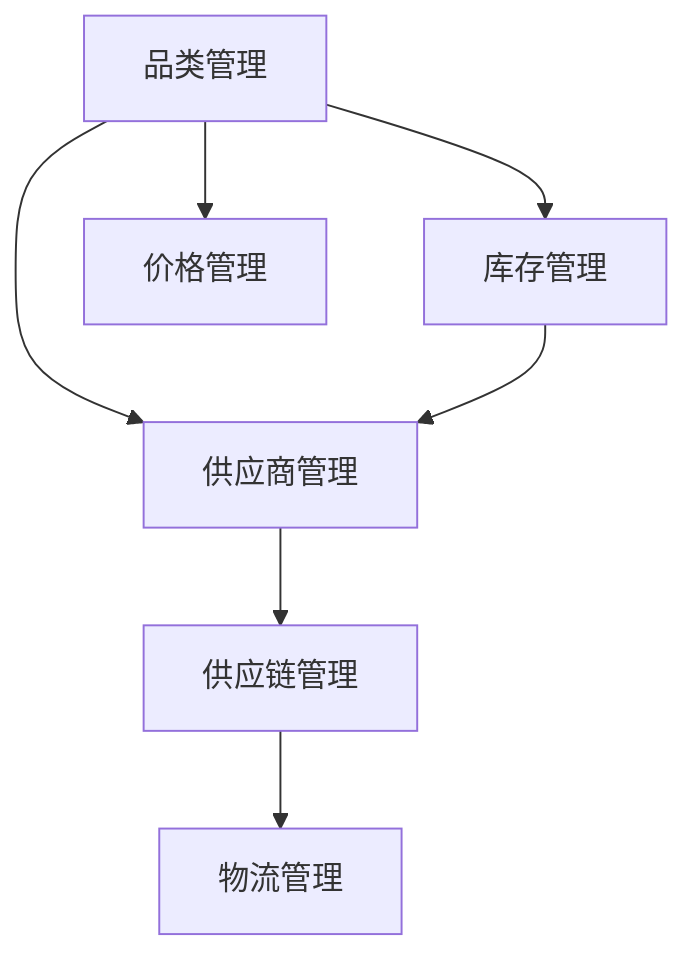

                 

## 1. 背景介绍

在全球化、数字化趋势下，品类运营和供应商合作已成为企业竞争力的关键。品类运营通过精细化管理商品种类、价格、促销等，提升消费者满意度，增强企业市场竞争力。而供应商合作则涉及原材料采购、物流、质量控制等关键环节，直接影响到企业的成本控制和产品竞争力。两者相互依赖、相互促进，共同驱动企业发展。

### 1.1 品类运营的挑战

随着市场竞争的加剧，品类运营面临着诸多挑战：

- **市场细分**：不同市场和消费者需求差异大，品类管理难度高。
- **库存管理**：库存周转率低，库存成本高，影响企业现金流。
- **价格竞争**：价格战频发，利润空间压缩，企业需精准定价。
- **商品多样性**：市场变化快，需快速响应，商品种类繁多，管理难度大。

### 1.2 供应商合作的难点

供应商合作同样面临诸多挑战：

- **供应链风险**：供应链中断、供应商破产等风险高。
- **质量控制**：供应商质量不稳定，影响产品质量和品牌声誉。
- **成本控制**：原材料成本波动大，需精细化成本管理。
- **供应链透明度**：信息不对称，难以全面监控供应商表现。

## 2. 核心概念与联系

### 2.1 核心概念概述

为更好地理解品类运营与供应商合作策略，本节将介绍几个密切相关的核心概念：

- **品类管理(Categorization Management)**：通过科学管理商品种类、价格、促销等，优化商品结构，提升消费者满意度。
- **供应商管理(Supplier Management)**：对供应商的选择、评估、合作、管理等全过程进行系统规划，确保供应商提供的原材料或服务符合企业标准。
- **库存管理(Inventory Management)**：通过合理的库存控制策略，实现库存优化，降低成本，提升运营效率。
- **供应链管理(Supply Chain Management)**：协调物流、库存、供应商等环节，优化资源配置，提高供应链效率。
- **价格管理(Pricing Management)**：根据市场需求和竞争情况，制定合理的价格策略，平衡收益和市场占有率。

这些核心概念之间的逻辑关系可以通过以下Mermaid流程图来展示：



这个流程图展示了几大管理模块之间的联系：

1. **品类管理**通过合理规划商品种类，支持供应商选择和库存管理。
2. **供应商管理**根据供应商的表现和品类需求，优化供应链和库存管理。
3. **库存管理**通过科学的库存控制，支撑品类管理和供应商管理。
4. **价格管理**根据市场需求，调整商品定价，影响品类管理。
5. **供应链管理**协调品类管理、库存管理和供应商管理，提升整体运营效率。

这些模块相互支持、相互制约，共同构成品类运营和供应商合作的核心框架。

### 2.2 核心概念原理和架构

#### 2.2.1 品类管理原理

品类管理涉及商品种类、价格、促销等多维度的管理，其核心是商品组合优化和库存管理。商品组合优化通过市场细分和需求分析，确定合理的商品结构；库存管理通过需求预测和订单管理，优化库存水平，降低成本。

#### 2.2.2 供应商管理原理

供应商管理包括供应商选择、评估、合作、管理等环节。供应商选择通过严格的质量和信誉评估，确定优质供应商；供应商评估通过定期检查和反馈，确保供应商表现；供应商合作通过签订合同和价格谈判，确保利益最大化；供应商管理通过信息共享和透明化，提升供应链效率。

#### 2.2.3 库存管理原理

库存管理涉及库存水平的控制和优化。通过需求预测、安全库存设置、订单管理和库存盘点，确保库存水平合理，避免缺货或积压。

#### 2.2.4 供应链管理原理

供应链管理协调物流、库存、供应商等环节，提升供应链效率。通过物流优化、库存优化和供应商管理，确保供应链顺畅运行，提升整体运营效率。

#### 2.2.5 价格管理原理

价格管理涉及定价策略、促销策略等。通过市场调研和竞争分析，确定合理价格；通过促销活动，提升销量和品牌影响力。

## 3. 核心算法原理 & 具体操作步骤

### 3.1 算法原理概述

品类运营与供应商合作策略的核心在于优化品类结构和供应链效率，通过科学管理实现成本控制和效益提升。其算法原理可概括为：

1. **品类结构优化**：通过市场细分和需求分析，确定合理的商品结构。
2. **供应商选择与评估**：通过多维度评估，选择优质供应商，并定期评估其表现。
3. **库存水平控制**：通过需求预测和库存管理，优化库存水平。
4. **供应链协调**：通过物流优化和供应商管理，提升供应链效率。
5. **价格策略制定**：通过市场调研和竞争分析，确定合理价格，实施促销策略。

### 3.2 算法步骤详解

品类运营与供应商合作的策略实施，一般包括以下几个关键步骤：

**Step 1: 市场细分与需求分析**

- 收集市场数据，进行细分分析，确定目标客户群体。
- 分析目标客户的需求特点，制定商品策略。

**Step 2: 商品组合优化**

- 确定商品种类，评估商品的市场潜力。
- 通过ABC分类法、堆叠法等策略，优化商品组合。

**Step 3: 供应商选择与评估**

- 评估供应商的质量、信誉、交货期等，确定优质供应商。
- 定期对供应商进行绩效评估，确保其表现符合标准。

**Step 4: 库存水平控制**

- 进行需求预测，设定安全库存和订货点。
- 实时监控库存水平，避免缺货和积压。

**Step 5: 供应链协调**

- 优化物流路径，降低运输成本。
- 与供应商建立合作关系，提升供应链透明度。

**Step 6: 价格策略制定**

- 进行市场调研，了解竞争价格。
- 根据需求和市场情况，制定合理价格，实施促销活动。

### 3.3 算法优缺点

品类运营与供应商合作的策略具有以下优点：

1. **提升效率**：通过优化品类结构和供应链，提升运营效率，降低成本。
2. **增强竞争力**：通过精准的商品组合和价格管理，提升市场竞争力。
3. **降低风险**：通过供应商评估和供应链透明度，降低供应链风险。

同时，该策略也存在一些局限性：

1. **复杂度高**：涉及市场细分、商品组合、库存管理等多个环节，复杂度较高。
2. **数据需求大**：需大量市场数据和内部数据支持，数据获取和处理成本高。
3. **执行难度大**：需跨部门协作，协调难度大，执行过程中可能出现偏差。

### 3.4 算法应用领域

品类运营与供应商合作策略已在零售、制造、物流等多个领域得到广泛应用，成为企业提升竞争力、降低成本的重要手段：

- **零售行业**：优化商品组合，提升顾客体验，增强市场竞争力。
- **制造业**：通过优化供应链，提高生产效率，降低成本。
- **物流行业**：优化物流路径，提升配送效率，降低运输成本。

此外，该策略还被创新性地应用到供应链金融、智能仓储等领域，为不同行业的企业提供了新的业务发展方向。

## 4. 数学模型和公式 & 详细讲解 & 举例说明

### 4.1 数学模型构建

品类运营与供应商合作的数学模型可概括为以下几个部分：

- **市场需求预测**：
$$
P_t = \alpha + \beta X_t + \epsilon_t
$$
其中，$P_t$为商品需求量，$X_t$为市场特征变量（如季节性、促销等），$\alpha, \beta$为回归系数，$\epsilon_t$为随机误差。

- **供应商绩效评估**：
$$
E = \frac{Q}{S} \times \eta
$$
其中，$E$为供应商绩效，$Q$为供应商提供商品的数量，$S$为供应商交货时间，$\eta$为惩罚系数（如交货延迟等）。

- **库存水平控制**：
$$
I_t = L + \delta \times (D_t - P_t)
$$
其中，$I_t$为库存水平，$L$为初始库存水平，$\delta$为调整系数，$D_t$为预测需求量，$P_t$为实际需求量。

### 4.2 公式推导过程

- **市场需求预测公式**：
$$
\begin{aligned}
& \min \quad ||P_t - (\alpha + \beta X_t + \epsilon_t)||^2 \\
& \text{subject to} \quad P_t \geq 0
\end{aligned}
$$
通过对回归系数$\alpha, \beta$进行最小二乘估计，得到预测模型$P_t$。

- **供应商绩效评估公式**：
$$
E = \sum_{i=1}^N (\frac{Q_i}{S_i} \times \eta_i)
$$
对每个供应商的绩效$E$进行加权求和，得到综合绩效评估指标。

- **库存水平控制公式**：
$$
\begin{aligned}
& \min \quad ||I_t - (L + \delta \times (D_t - P_t))||^2 \\
& \text{subject to} \quad I_t \geq 0
\end{aligned}
$$
通过对库存水平$I_t$进行调整，实现库存优化。

### 4.3 案例分析与讲解

**案例：某电商平台商品品类管理**

- **市场需求预测**：
  - 收集过去一年的销售数据，包括日期、销量、季节性变量等。
  - 采用时间序列回归模型，如ARIMA模型，进行需求预测。
  
- **供应商绩效评估**：
  - 收集过去一年的供应商交货数据，包括日期、供应商编号、交货时间等。
  - 使用加权平均法，结合交货延迟、缺货率等指标，评估供应商绩效。

- **库存水平控制**：
  - 根据需求预测结果，设定初始库存水平。
  - 实时监控库存水平，通过调整订货量，确保库存水平合理。

## 5. 项目实践：代码实例和详细解释说明

### 5.1 开发环境搭建

在进行品类运营与供应商合作的策略实践前，我们需要准备好开发环境。以下是使用Python进行开发的Python环境配置流程：

1. 安装Anaconda：从官网下载并安装Anaconda，用于创建独立的Python环境。

2. 创建并激活虚拟环境：
```bash
conda create -n pyenv python=3.8 
conda activate pyenv
```

3. 安装相关依赖：
```bash
pip install numpy pandas scikit-learn matplotlib
```

4. 安装优化算法库：
```bash
pip install scikit-learn[optimization]
```

完成上述步骤后，即可在`pyenv`环境中开始策略实践。

### 5.2 源代码详细实现

下面以某电商平台商品品类管理为例，给出使用Python进行品类管理策略开发的完整代码实现。

```python
import numpy as np
from sklearn.linear_model import LinearRegression
from sklearn.metrics import mean_squared_error

# 假设市场需求预测数据
dates = ['2022-01-01', '2022-01-02', ..., '2022-12-31']
sales = [10, 20, ..., 40]
seasonal_dummies = [[0, 0, 1, 0, ..., 1], ..., [1, 1, 0, 0, ..., 0]]

# 构建线性回归模型
model = LinearRegression()

# 训练模型
X = np.array(seasonal_dummies)
y = np.array(sales)
model.fit(X, y)

# 预测2023年需求
future_dates = ['2023-01-01', '2023-01-02', ..., '2023-12-31']
future_sales = model.predict(np.array(future_dates))

# 供应商绩效评估
supplier_data = {
    1: {'Q': 1000, 'S': 5},
    2: {'Q': 2000, 'S': 7},
    ...
    N: {'Q': 3000, 'S': 9}
}

# 计算供应商绩效
weighted_avg = sum((q/s + 0.1) for q, s in supplier_data.values()) / sum(s + 0.1 for s in supplier_data.values())

# 库存水平控制
initial_inventory = 500
demand_prediction = [10, 20, ..., 40]
inventory_level = initial_inventory + 0.5 * (demand - prediction)

# 输出结果
print(f'2023年需求预测：{future_sales}')
print(f'供应商绩效评估：{weighted_avg}')
print(f'库存水平控制：{inventory_level}')
```

### 5.3 代码解读与分析

让我们再详细解读一下关键代码的实现细节：

**线性回归模型**：
- 使用`sklearn.linear_model.LinearRegression`，通过市场需求数据和季节性特征数据，拟合线性回归模型。
- `X`为特征矩阵，`y`为目标变量。
- 使用`fit`方法训练模型，`predict`方法预测未来需求。

**供应商绩效评估**：
- 使用`weighted_avg`计算加权平均绩效，`0.1`为惩罚系数，考虑交货延迟等因素。
- `supplier_data`为供应商数据，每个供应商提供商品数量和交货时间。

**库存水平控制**：
- 根据需求预测，设定初始库存水平`initial_inventory`。
- `demand`为实际需求，`prediction`为预测需求。
- `inventory_level`为调整后的库存水平。

### 5.4 运行结果展示

在上述代码中，我们通过线性回归模型预测了2023年的需求，并计算了供应商绩效和库存水平控制结果。

## 6. 实际应用场景

### 6.1 零售行业

在零售行业中，品类运营与供应商合作策略被广泛应用于商品管理、库存优化和供应链协调。通过优化商品组合，提升顾客体验，增强市场竞争力。例如，电商平台通过品类管理，根据用户行为和市场趋势，优化商品结构，提升用户满意度和销售额。

### 6.2 制造业

在制造业中，品类运营与供应商合作策略通过优化供应链，提高生产效率，降低成本。例如，汽车制造企业通过品类管理，优化零部件采购和库存管理，降低供应链成本，提升产品质量。

### 6.3 物流行业

在物流行业中，品类运营与供应商合作策略通过优化物流路径，提升配送效率，降低运输成本。例如，快递公司通过品类管理，优化配送路线，减少运输时间，提高服务质量。

### 6.4 未来应用展望

随着大数据、人工智能等技术的发展，品类运营与供应商合作策略将在更多领域得到应用，为各行各业带来新的机遇和挑战。

- **智能仓储**：通过物联网和大数据技术，实时监控库存水平，优化供应链管理。
- **供应链金融**：结合区块链和人工智能技术，提升供应链透明度，降低融资成本。
- **无人零售**：通过机器人技术，实现智能化货架管理，提升运营效率。

## 7. 工具和资源推荐

### 7.1 学习资源推荐

为了帮助开发者系统掌握品类运营与供应商合作的理论基础和实践技巧，这里推荐一些优质的学习资源：

1. 《品类管理手册》系列博文：由品类管理专家撰写，深入浅出地介绍了品类管理的核心概念和经典案例。
2. 《供应链管理》课程：知名大学开设的供应链管理课程，涵盖采购、库存、物流等多个环节，理论结合实践。
3. 《供应链金融》书籍：系统介绍供应链金融的概念、模式和应用，提供大量案例分析。
4. 《智能仓储与物流》书籍：介绍智能仓储和物流的前沿技术和管理实践，涵盖物联网、自动化等技术。

通过对这些资源的学习实践，相信你一定能够快速掌握品类运营与供应商合作的精髓，并用于解决实际的业务问题。

### 7.2 开发工具推荐

高效的开发离不开优秀的工具支持。以下是几款用于品类运营与供应商合作开发的常用工具：

1. Python：功能强大的编程语言，支持多种数据处理和机器学习库，广泛用于品类管理和大数据分析。
2. R语言：统计分析工具，提供丰富的数据可视化功能，适合做市场需求预测和供应商评估。
3. Tableau：数据可视化工具，支持多维度数据分析和报表展示，适合做库存水平控制和供应链协调。
4. Microsoft Power BI：商业智能工具，支持数据整合、报表设计和数据共享，适合做供应商绩效评估和库存管理。

合理利用这些工具，可以显著提升品类运营与供应商合作的开发效率，加快创新迭代的步伐。

### 7.3 相关论文推荐

品类运营与供应商合作的研究源于学界的持续研究。以下是几篇奠基性的相关论文，推荐阅读：

1. "The Role of Category Management in Retailing"：分析品类管理在零售中的重要性。
2. "Supply Chain Management: Practices and Challenges"：介绍供应链管理的实践和挑战。
3. "Inventory Control in Manufacturing"：讨论制造业库存控制的方法和策略。
4. "A Survey on Pricing and Inventory Management"：综述定价和库存管理的理论和应用。

这些论文代表了大语言模型微调技术的发展脉络。通过学习这些前沿成果，可以帮助研究者把握学科前进方向，激发更多的创新灵感。

## 8. 总结：未来发展趋势与挑战

### 8.1 研究成果总结

品类运营与供应商合作策略在大数据和人工智能技术的支持下，已经取得了显著的成果。其在零售、制造、物流等领域的广泛应用，显著提升了企业的运营效率和市场竞争力。未来，随着技术的进一步发展，品类运营与供应商合作策略将继续发挥其重要作用。

### 8.2 未来发展趋势

品类运营与供应商合作策略的未来发展趋势包括：

1. **智能化**：结合人工智能和大数据技术，实现自动化决策和智能推荐，提升运营效率。
2. **实时化**：通过物联网和实时数据采集，实现实时监控和调整，优化供应链管理。
3. **集成化**：将品类管理、供应商管理和库存管理等模块集成，实现全流程管理，提升整体运营效率。
4. **灵活化**：根据市场变化和消费者需求，灵活调整商品组合和供应商策略，适应市场变化。

### 8.3 面临的挑战

尽管品类运营与供应商合作策略已经取得了显著成果，但在迈向更加智能化、实时化应用的过程中，仍面临诸多挑战：

1. **数据质量问题**：市场需求和供应商数据质量参差不齐，影响决策准确性。
2. **技术复杂性**：需要多学科技术支持，实现多模块集成和优化。
3. **执行难度大**：涉及跨部门协作，协调难度大，执行过程中可能出现偏差。
4. **成本高**：技术实施和系统维护成本高，对企业资源要求高。

### 8.4 研究展望

面对品类运营与供应商合作策略面临的挑战，未来的研究需要在以下几个方面寻求新的突破：

1. **数据治理**：建立统一的数据标准和治理机制，确保数据质量。
2. **技术融合**：结合物联网、区块链等前沿技术，实现智能化和实时化。
3. **跨部门协作**：建立跨部门协作机制，确保策略执行效果。
4. **成本控制**：优化技术实施和系统维护方案，降低成本。

这些研究方向的探索，将引领品类运营与供应商合作策略迈向更高的台阶，为构建安全、可靠、可解释、可控的智能系统铺平道路。面向未来，品类运营与供应商合作策略还需要与其他人工智能技术进行更深入的融合，如知识表示、因果推理、强化学习等，多路径协同发力，共同推动自然语言理解和智能交互系统的进步。只有勇于创新、敢于突破，才能不断拓展品类管理的边界，让智能技术更好地造福人类社会。

## 9. 附录：常见问题与解答

**Q1：品类管理对企业有哪些具体影响？**

A: 品类管理通过优化商品组合、控制库存和优化价格，对企业有以下具体影响：
1. **提升销售额**：通过精准的商品组合和促销策略，提升销售额和市场占有率。
2. **降低成本**：通过科学库存管理，降低库存成本和物流成本。
3. **增强竞争力**：通过优化供应链，提升运营效率和市场竞争力。

**Q2：供应商选择与评估的核心指标是什么？**

A: 供应商选择与评估的核心指标包括：
1. **质量指标**：产品质量、检测报告等。
2. **交货指标**：交货时间、准时率等。
3. **成本指标**：采购成本、物流成本等。
4. **服务指标**：售后服务、技术支持等。

**Q3：库存水平控制的关键在于什么？**

A: 库存水平控制的关键在于：
1. **需求预测准确性**：通过科学的市场调研和历史数据分析，提升需求预测的准确性。
2. **安全库存设置**：根据需求预测结果，合理设置安全库存水平。
3. **实时监控与调整**：通过实时数据监控，动态调整库存水平，避免缺货和积压。

**Q4：品类运营与供应商合作策略在实际应用中需要注意哪些问题？**

A: 品类运营与供应商合作策略在实际应用中需要注意：
1. **数据质量**：确保数据的准确性和完整性，避免因数据问题影响决策。
2. **跨部门协作**：建立跨部门协作机制，确保策略执行效果。
3. **成本控制**：优化技术实施和系统维护方案，降低成本。
4. **风险管理**：建立风险管理机制，规避供应链风险。

**Q5：品类运营与供应商合作策略的实施难点是什么？**

A: 品类运营与供应商合作策略的实施难点在于：
1. **数据治理**：数据质量参差不齐，需建立统一的数据标准和治理机制。
2. **技术复杂性**：需结合多学科技术，实现多模块集成和优化。
3. **执行难度大**：涉及跨部门协作，协调难度大。

这些挑战需要通过技术创新和跨部门协作来克服，以确保品类运营与供应商合作策略的顺利实施和长期成功。

---

作者：禅与计算机程序设计艺术 / Zen and the Art of Computer Programming

