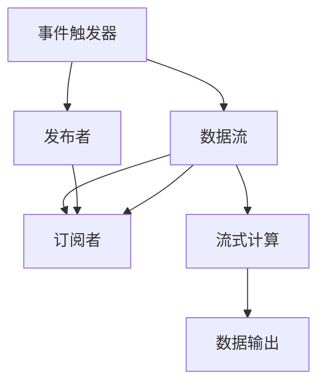

                 

## 1. 背景介绍

### 1.1 问题由来
在现代软件开发中，异步数据流处理已变得越来越重要。随着用户对实时性、响应速度的要求日益提高，以及数据量的不断增长，传统的同步数据流处理方式已经难以适应。以Web应用为例，动态页面加载、无限滚动列表、实时消息推送等场景，都需要及时、可靠地处理大量异步数据，并更新UI。

传统的同步数据流处理方式，通常依赖于阻塞式I/O、回调、轮询等机制，存在许多效率低、易出错的问题。例如，阻塞式I/O会导致应用响应时间过长，影响用户体验；回调函数嵌套过多，造成代码难以维护；轮询机制增加系统负载，浪费计算资源。这些问题都限制了异步数据流处理的能力。

响应式编程（Reactive Programming）作为一种专门处理异步数据流的技术，通过对数据流的发布-订阅机制进行抽象和封装，提供了更为简洁、高效、可靠的数据流处理方式。本文将从基础概念、算法原理、应用实践等多个维度，详细介绍响应式编程的技术体系。

## 2. 核心概念与联系

### 2.1 核心概念概述
为更好地理解响应式编程的原理，下面先介绍几个关键概念：

- **事件驱动**：基于事件驱动的编程模型，程序响应特定的外部事件或内部状态变化进行执行。
- **发布-订阅**：事件驱动的核心机制，发布者（Publisher）向订阅者（Subscriber）发布数据变化通知，订阅者收到通知后进行处理。
- **数据流**：数据流模型，将数据视为一种可以流动、转换、聚合的实体，支持高效的数据传输和处理。
- **流式计算**：基于数据流的计算模型，支持对数据的实时、连续、分布式计算，适用于大规模数据处理。
- **响应式编程**：一种编程范式，通过事件驱动、发布-订阅、流式计算等机制，实现异步数据流的高效处理和响应式UI更新。

这些概念之间存在着紧密的联系，构成响应式编程的基本框架：


事件驱动是响应式编程的基础，通过事件机制，程序对外部或内部数据的变化进行响应。发布-订阅机制则是事件驱动的核心实现方式，允许程序以松耦合的方式管理和处理事件。数据流模型提供了对数据处理的抽象，使得程序可以高效地处理异步数据。流式计算模型则在此基础上，进一步支持数据的高效、连续计算，满足大规模数据处理的需要。响应式编程则是对这些核心机制的综合应用，提供了高效、可靠、可维护的异步数据流处理方案。

### 2.2 核心概念原理和架构的 Mermaid 流程图


这个流程图展示了响应式编程的核心架构：
1. 事件触发器(A)负责检测外部或内部数据变化。
2. 发布者(C)根据数据变化，向数据流(B)发布事件。
3. 订阅者(D)根据自身需求，订阅数据流中的特定事件。
4. 流式计算(E)对数据流中的数据进行实时处理和计算。
5. 最终的数据输出(F)根据订阅者的需求进行相应的数据展示。

这个架构清晰地体现了响应式编程的基本设计思路，即通过事件驱动、发布-订阅、数据流和流式计算等机制，实现对异步数据流的有效管理和处理。

## 3. 核心算法原理 & 具体操作步骤

### 3.1 算法原理概述
响应式编程的核心算法原理，可以概括为事件驱动、发布-订阅、数据流和流式计算四个方面。

**事件驱动**：程序根据外部或内部事件的发生，触发特定的处理逻辑。例如，用户在界面上的点击、滚动等操作，触发数据加载、页面渲染等操作。

**发布-订阅**：数据流中的数据变化由发布者发布，订阅者订阅后进行相应的处理。发布者负责将数据变化通知给所有订阅者，确保数据的同步和一致性。

**数据流**：数据流模型将数据视为可以流动、转换、聚合的实体，支持高效的数据传输和处理。通过数据流的发布-订阅机制，实现数据的实时、异步传输。

**流式计算**：流式计算模型对数据流进行连续、实时处理，支持分布式计算和容错处理。例如，对数据流进行聚合、过滤、变换等操作，得到计算结果。

### 3.2 算法步骤详解
下面详细介绍响应式编程的基本操作步骤：

**Step 1: 创建事件触发器**
- 定义一个事件触发器，用于检测外部或内部数据变化。
- 例如，在Web应用中，可以使用HTML5的事件触发器，如onScroll、onResize等。

**Step 2: 定义发布者和订阅者**
- 定义一个或多个发布者，用于发布数据变化事件。
- 定义一个或多个订阅者，用于订阅数据流中的事件。
- 例如，在Web应用中，可以将页面内容加载、数据获取等操作定义为发布者，将UI渲染、数据展示等操作定义为订阅者。

**Step 3: 实现数据流的发布-订阅**
- 实现数据流的发布-订阅机制，确保发布者能够将数据变化通知给所有订阅者。
- 例如，在Web应用中，可以使用WebSocket、Server-Sent Events等技术，实现数据的实时推送。

**Step 4: 进行流式计算**
- 对数据流进行连续、实时计算，支持分布式计算和容错处理。
- 例如，在Web应用中，可以使用Spark Streaming、Flink等流式计算框架，对数据流进行实时处理和计算。

**Step 5: 数据输出**
- 根据订阅者的需求，对数据进行展示和渲染。
- 例如，在Web应用中，将计算结果渲染到页面上，更新UI。

### 3.3 算法优缺点
响应式编程具有以下优点：
1. 高效性：通过数据流和流式计算机制，能够高效地处理大量异步数据。
2. 可靠性：通过发布-订阅机制，保证数据的一致性和同步性。
3. 可维护性：通过事件驱动机制，代码更加清晰、可维护。
4. 易扩展性：通过模块化的设计，易于扩展和复用。

同时，响应式编程也存在一些缺点：
1. 学习成本：响应式编程涉及多个概念和机制，学习成本较高。
2. 复杂性：在复杂的异步数据流处理场景下，代码容易变得复杂。
3. 性能问题：在处理大量数据时，可能需要更高的计算资源。

### 3.4 算法应用领域
响应式编程在多个领域得到了广泛应用，例如：

- **Web应用**：动态页面加载、无限滚动列表、实时消息推送等。
- **移动应用**：交互式图表、动画效果、即时通知等。
- **数据处理**：实时数据流处理、分布式计算、大数据分析等。
- **智能家居**：设备之间的实时通信、控制命令的响应等。
- **物联网**：设备之间的数据传输、事件处理等。

这些领域都需要高效、可靠地处理大量的异步数据流，响应式编程提供了有效的解决方案。

## 4. 数学模型和公式 & 详细讲解 & 举例说明

### 4.1 数学模型构建

响应式编程的数学模型，主要涉及事件驱动、发布-订阅、数据流和流式计算等概念。

**事件驱动**：事件驱动模型可以简单表示为：
$$
E = \{e_1, e_2, \ldots, e_n\}
$$
其中 $e_i$ 表示事件。

**发布-订阅**：发布-订阅模型可以表示为：
$$
\mathcal{P} \rightarrow \mathcal{S}
$$
其中 $\mathcal{P}$ 表示发布者集合，$\mathcal{S}$ 表示订阅者集合。发布者将数据变化 $d_i$ 发布给订阅者集合 $\mathcal{S}$，订阅者对数据变化 $d_i$ 进行处理。

**数据流**：数据流模型可以表示为：
$$
\mathcal{D} = \{d_1, d_2, \ldots, d_n\}
$$
其中 $d_i$ 表示数据流中的数据。

**流式计算**：流式计算模型可以表示为：
$$
\mathcal{D} \rightarrow \mathcal{R}
$$
其中 $\mathcal{R}$ 表示计算结果。

### 4.2 公式推导过程

下面以一个简单的Web应用为例，推导响应式编程的基本算法流程：

假设用户点击了页面中的一个按钮，触发了一个事件 $e$，然后程序通过事件触发器触发了数据流 $\mathcal{D}$，发布者发布了一个数据变化 $d$，订阅者订阅了数据流 $\mathcal{D}$，进行了相应的处理并得到了计算结果 $\mathcal{R}$。整个流程可以表示为：


具体推导如下：
1. 用户点击按钮，触发事件 $e$。
2. 事件触发器检测到事件 $e$，触发数据流 $\mathcal{D}$。
3. 发布者发布数据变化 $d$，将数据变化通知给订阅者集合 $\mathcal{S}$。
4. 订阅者订阅数据流 $\mathcal{D}$，并根据数据变化 $d$ 进行相应的处理，得到计算结果 $\mathcal{R}$。
5. 数据输出模块将计算结果 $\mathcal{R}$ 展示在界面上，更新UI。

### 4.3 案例分析与讲解

以一个简单的Web应用为例，介绍响应式编程的实现过程：

1. 事件触发器：在页面中添加一个按钮，监听用户点击事件。

2. 发布者：当用户点击按钮时，触发一个数据变化，发布者将该数据变化通知给订阅者。

3. 订阅者：订阅者订阅数据流，根据数据变化进行相应的处理，例如将数据展示在界面上。

4. 数据流：数据流模型将数据视为可以流动、转换、聚合的实体。例如，在Web应用中，可以使用WebSocket、Server-Sent Events等技术，实现数据的实时推送。

5. 流式计算：对数据流进行连续、实时计算，支持分布式计算和容错处理。例如，在Web应用中，可以使用Spark Streaming、Flink等流式计算框架，对数据流进行实时处理和计算。

6. 数据输出：根据订阅者的需求，对数据进行展示和渲染。例如，在Web应用中，将计算结果渲染到页面上，更新UI。

## 5. 项目实践：代码实例和详细解释说明

### 5.1 开发环境搭建

在进行响应式编程实践前，我们需要准备好开发环境。以下是使用React框架进行Web应用的开发环境配置流程：

1. 安装Node.js：从官网下载并安装Node.js，获取JavaScript运行环境。
2. 创建React项目：使用Create React App工具创建新的React项目。
3. 安装依赖：在项目中安装必要的依赖，例如React Router、Redux、WebSocket等。

### 5.2 源代码详细实现

这里我们以一个简单的Web应用为例，介绍如何使用React实现响应式编程：

1. 事件触发器：使用React Router和Redux等工具，实现页面路由和事件触发器。

```javascript
import { useHistory } from 'react-router-dom';
import { useState } from 'react';

function ButtonClicker() {
  const history = useHistory();
  
  const [count, setCount] = useState(0);
  const handleClick = () => {
    setCount(count + 1);
    history.push('/count');
  };
  
  return (
    <div>
      <h1>Button Click Count: {count}</h1>
      <button onClick={handleClick}>Click Me!</button>
    </div>
  );
}
```

2. 发布者：当用户点击按钮时，发布一个数据变化，将数据变化通知给订阅者。

```javascript
import { createContext, useEffect } from 'react';

export const CounterContext = React.createContext();

function CounterProvider({ children }) {
  const [count, setCount] = useState(0);
  
  useEffect(() => {
    const handleClick = () => {
      setCount(count + 1);
    };
    
    document.addEventListener('click', handleClick);
    return () => {
      document.removeEventListener('click', handleClick);
    };
  }, [count]);
  
  return (
    <CounterContext.Provider value={{ count, setCount }}>
      {children}
    </CounterContext.Provider>
  );
}
```

3. 订阅者：订阅数据流，根据数据变化进行相应的处理，例如将数据展示在界面上。

```javascript
import { useContext } from 'react';

function CounterDisplay() {
  const { count } = useContext(CounterContext);
  
  return (
    <div>
      <h1>Count: {count}</h1>
    </div>
  );
}
```

4. 数据流：使用WebSocket技术，实现数据的实时推送。

```javascript
import { createContext, useEffect, useState } from 'react';
import { io } from 'socket.io-client';

export const WebSocketContext = React.createContext();

function WebSocketProvider({ children }) {
  const [webSocket, setWebSocket] = useState(null);
  
  useEffect(() => {
    const socket = io('http://localhost:3000');
    socket.on('count', (count) => {
      setWebSocket({ count });
    });
    socket.on('disconnect', () => {
      setWebSocket(null);
    });
    return () => {
      socket.close();
    };
  }, []);
  
  return (
    <WebSocketContext.Provider value={webSocket}>
      {children}
    </WebSocketContext.Provider>
  );
}
```

5. 流式计算：使用Spark Streaming技术，对数据流进行实时处理和计算。

```javascript
import { createContext, useEffect } from 'react';
import { SparkStreaming } from 'spark-streaming';
import { io } from 'socket.io-client';

export const StreamContext = React.createContext();

function StreamProvider({ children }) {
  const [sparkStreaming, setSparkStreaming] = useState(null);
  
  useEffect(() => {
    const socket = io('http://localhost:3000');
    socket.on('sparkStreaming', (sparkStreaming) => {
      setSparkStreaming(sparkStreaming);
    });
    socket.on('disconnect', () => {
      setSparkStreaming(null);
    });
    return () => {
      socket.close();
    };
  }, []);
  
  return (
    <StreamContext.Provider value={sparkStreaming}>
      {children}
    </StreamContext.Provider>
  );
}
```

6. 数据输出：根据订阅者的需求，对数据进行展示和渲染。

```javascript
import { useContext } from 'react';

function StreamDisplay() {
  const { count } = useContext(StreamContext);
  
  return (
    <div>
      <h1>Stream Count: {count}</h1>
    </div>
  );
}
```

### 5.3 代码解读与分析

让我们再详细解读一下关键代码的实现细节：

**ButtonClicker组件**：
- 使用React Router的useHistory钩子获取路由对象，监听用户点击事件。
- 使用useState钩子管理计数器的状态，当用户点击按钮时，更新计数器的值，并使用React Router跳转到新的路由页面。

**CounterProvider组件**：
- 使用React的useEffect钩子监听点击事件，更新计数器的值。
- 使用React的createContext函数创建CounterContext，并订阅数据流。

**CounterDisplay组件**：
- 使用React的useContext钩子获取计数器的值，并将其展示在界面上。

**WebSocketProvider组件**：
- 使用WebSocket技术订阅数据流，当收到数据变化时，更新WebSocketContext的值。

**StreamProvider组件**：
- 使用Spark Streaming技术订阅数据流，当收到数据变化时，更新StreamContext的值。

**StreamDisplay组件**：
- 使用React的useContext钩子获取计数器的值，并将其展示在界面上。

## 6. 实际应用场景

### 6.1 实时数据监控
在实时数据监控场景中，响应式编程可以高效地处理大量的数据流，进行实时的数据展示和分析。例如，在一个大型企业中，需要实时监控设备状态、生产流水线等数据，使用响应式编程可以将数据流传输到前端界面，实时展示监控结果。

### 6.2 分布式计算
在分布式计算场景中，响应式编程可以实现数据的分布式处理和计算，提高计算效率和可靠性。例如，在数据中心中，需要对海量数据进行分析和处理，使用响应式编程可以将数据流分配到多个节点上进行计算，提高计算效率。

### 6.3 交互式图表
在交互式图表场景中，响应式编程可以实现数据的实时更新和展示，支持用户与图表的互动。例如，在金融市场中，需要实时展示股票价格变化、交易量等数据，使用响应式编程可以将数据流传输到图表中，实时更新和展示图表结果。

## 7. 工具和资源推荐

### 7.1 学习资源推荐

为了帮助开发者系统掌握响应式编程的理论基础和实践技巧，这里推荐一些优质的学习资源：

1. 《Reactive Programming with Redux》：这是一本详细介绍响应式编程与Redux结合的书籍，通过丰富的实例和代码，帮助读者理解响应式编程的基本原理和实践技巧。

2. 《RxJS: The Complete Guide》：这是一本详细介绍RxJS库的书籍，通过丰富的实例和代码，帮助读者理解响应式编程的核心思想和实现方式。

3. 《JavaScript Design Patterns》：这是一本详细介绍JavaScript设计模式的书籍，其中包含大量响应式编程的相关模式和实践，帮助读者理解响应式编程的实现方式。

4. 《Reactive Programming at Scale》：这是一本详细介绍响应式编程在大规模应用中的实现方式的书籍，通过丰富的实例和案例，帮助读者理解响应式编程的实践技巧和挑战。

5. 《Reactive Extensions》：这是一本详细介绍RxJS库的官方文档，通过详细的API文档和示例代码，帮助读者理解响应式编程的核心思想和实现方式。

### 7.2 开发工具推荐

响应式编程在多个领域得到了广泛应用，例如Web应用、移动应用、数据处理等。以下是几款常用的响应式编程工具：

1. React：这是一个流行的前端框架，支持事件驱动、数据流、流式计算等响应式编程特性。

2. Angular：这是一个流行的前端框架，支持响应式编程、事件驱动、流式计算等特性。

3. RxJS：这是一个流行的响应式编程库，支持数据流的发布-订阅机制，支持多种数据源和操作符。

4. Redux：这是一个流行的状态管理库，支持单向数据流和事件驱动机制，适用于响应式编程。

5. WebSocket：这是一个流行的实时通信协议，支持数据的实时推送和订阅，适用于响应式编程。

6. Spark Streaming：这是一个流行的流式计算框架，支持数据的分布式处理和计算，适用于响应式编程。

### 7.3 相关论文推荐

响应式编程在学术界和工业界得到了广泛的研究和应用。以下是几篇奠基性的相关论文，推荐阅读：

1. "React: A View Framework for Building User Interfaces"：这篇论文详细介绍了React框架的设计思想和实现方式，帮助读者理解响应式编程的实现方式。

2. "RxJS: Reactive Extensions for JavaScript"：这篇论文详细介绍了RxJS库的设计思想和实现方式，帮助读者理解响应式编程的核心思想和实现方式。

3. "Reactive Programming with Redux"：这篇论文详细介绍了响应式编程与Redux结合的实现方式，帮助读者理解响应式编程的实现方式。

4. "The Reactive Manual"：这是一本详细介绍响应式编程的书籍，通过丰富的实例和代码，帮助读者理解响应式编程的核心思想和实现方式。

## 8. 总结：未来发展趋势与挑战

### 8.1 总结

本文对响应式编程的原理、算法、操作步骤进行了系统介绍。首先介绍了响应式编程的基本概念和核心机制，然后详细讲解了响应式编程的数学模型和公式推导过程，最后通过代码实例展示了响应式编程的实现方法。通过本文的介绍，读者可以系统掌握响应式编程的基本思想和实现方式。

## 8.2 未来发展趋势

展望未来，响应式编程将呈现以下几个发展趋势：

1. 更加高效：随着技术的进步，响应式编程将变得更加高效，能够处理更大规模的数据流和计算任务。

2. 更加灵活：响应式编程将更加灵活，能够支持更多的数据源和计算模型，满足更多的应用场景需求。

3. 更加可维护：响应式编程将更加可维护，代码结构更加清晰，易于理解和调试。

4. 更加安全：响应式编程将更加安全，避免数据泄露和系统漏洞，提高系统的可靠性。

5. 更加易用：响应式编程将更加易用，减少开发者的学习成本和使用门槛，降低开发难度。

## 8.3 面临的挑战

尽管响应式编程已经取得了显著的进展，但在发展过程中仍然面临着诸多挑战：

1. 学习成本：响应式编程涉及多个概念和机制，学习成本较高。

2. 性能问题：在处理大量数据时，可能需要更高的计算资源。

3. 数据一致性：在分布式环境中，数据的一致性和同步性问题仍然需要进一步解决。

4. 数据安全：在实时数据传输和处理过程中，数据的安全性和隐私保护问题需要进一步加强。

5. 系统稳定性：在复杂的异步数据流处理场景下，系统的稳定性和容错性仍然需要进一步提高。

## 8.4 研究展望

面对响应式编程所面临的挑战，未来的研究需要在以下几个方面寻求新的突破：

1. 开发更加高效、灵活的响应式编程框架和库。

2. 优化数据流和流式计算模型的性能，支持更大规模的数据处理和计算任务。

3. 研究数据一致性和同步性问题的解决方案，提高系统的可靠性和稳定性。

4. 开发数据安全和密码保护技术，确保数据传输和处理的安全性。

5. 研究系统的容错性和鲁棒性，提高系统的稳定性和可用性。

## 9. 附录：常见问题与解答

**Q1: 什么是响应式编程？**

A: 响应式编程是一种编程范式，通过事件驱动、发布-订阅、数据流和流式计算等机制，实现异步数据流的高效处理和响应式UI更新。

**Q2: 响应式编程的优势是什么？**

A: 响应式编程具有高效性、可靠性、可维护性和易扩展性等优势，能够高效地处理异步数据流，支持数据的一致性和同步性，提高代码的可维护性和易用性。

**Q3: 响应式编程的主要实现方式有哪些？**

A: 响应式编程的主要实现方式包括事件驱动、发布-订阅、数据流和流式计算等。其中，事件驱动是响应式编程的基础，发布-订阅是事件驱动的核心实现方式，数据流模型提供了对数据处理的抽象，流式计算模型对数据流进行连续、实时计算，支持分布式计算和容错处理。

**Q4: 如何使用响应式编程处理异步数据流？**

A: 使用响应式编程处理异步数据流，需要创建事件触发器、定义发布者和订阅者、实现数据流的发布-订阅、进行流式计算，并根据订阅者的需求进行数据输出和渲染。

**Q5: 响应式编程有哪些应用场景？**

A: 响应式编程在多个领域得到了广泛应用，例如Web应用、移动应用、数据处理、智能家居、物联网等。这些领域都需要高效、可靠地处理大量的异步数据流，响应式编程提供了有效的解决方案。

---

作者：禅与计算机程序设计艺术 / Zen and the Art of Computer Programming

