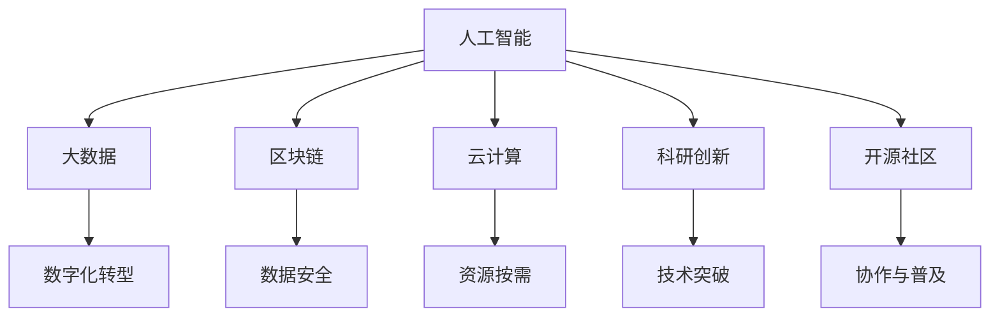

                 

# 国际合作：共同推动人类计算领域的进步

> 关键词：国际合作,人类计算,人工智能,大数据,区块链,云计算,数字化转型,科研创新,开源社区

## 1. 背景介绍

### 1.1 问题由来
在全球化和技术进步的双重推动下，计算技术的边界和影响力不断扩展，成为推动社会进步和经济发展的重要力量。人工智能(AI)、大数据、区块链、云计算等新兴技术，正在深刻改变各行各业的运作模式。然而，这些技术的应用和发展往往涉及多个国家、众多企业和研究机构，仅靠单一实体难以全面推进。

实现跨国界、跨领域、跨学科的深度合作，是推动计算技术发展、应对全球挑战的关键。因此，本文章将探讨国际合作在推动人类计算领域进步中的作用，分析如何构建和优化国际合作机制，以及未来面临的挑战与机遇。

### 1.2 问题核心关键点
国际合作的核心关键点包括：
- **全球数据共享**：高效的数据交换和共享机制是推动计算技术进步的基础。
- **协同创新**：跨国家、跨领域的科研创新合作，能大幅提升技术研发效率。
- **知识传播**：跨学科、跨文化的学习和知识传播，有助于新技术的普及与应用。
- **产业合作**：企业间的合作与联合研发，可快速将科研成果转化为实际生产力。
- **政策支持**：各国政府对于国际合作的支持和激励政策，是推动技术发展的保障。

## 2. 核心概念与联系

### 2.1 核心概念概述

为更好地理解国际合作在人类计算领域的作用，本节将介绍几个密切相关的核心概念：

- **人工智能(AI)**：使用计算机算法和数据，使机器能够执行通常需要人类智能的任务。
- **大数据**：大量、高速、多样化的数据集，用以训练AI模型。
- **区块链**：分布式账本技术，保障数据安全、透明和不可篡改。
- **云计算**：通过互联网提供动态、可扩展的计算资源，降低计算成本。
- **数字化转型**：将传统业务流程数字化，提升效率和竞争力。
- **科研创新**：前沿技术的研发和突破，推动技术进步。
- **开源社区**：开放源代码和资源，促进技术普及和协作。

这些核心概念之间的逻辑关系可以通过以下Mermaid流程图来展示：



这个流程图展示出计算技术各分支之间的关联性：

1. **人工智能**是核心，利用大数据、区块链、云计算等技术手段进行模型训练和应用部署。
2. **科研创新**不断为人工智能输入新的算法和模型。
3. **开源社区**提供开放的资源和平台，促进技术共享与协作。
4. **大数据、云计算**提供技术支持，使科研创新成果得以实现。
5. **区块链**保障数据安全和透明，增强技术信任度。
6. **数字化转型**推动各行各业应用计算技术，提升效率和竞争力。

这些概念共同构成了人类计算技术的基石，各分支之间的协同作用，将技术转化为实际应用，驱动社会进步。

## 3. 核心算法原理 & 具体操作步骤
### 3.1 算法原理概述

国际合作在推动人类计算领域进步中，主要通过以下算法原理实现：

- **数据共享**：利用分布式存储和传输技术，实现大规模数据的跨国共享。
- **协同创新**：通过跨学科、跨领域的科研合作，加速技术研发进程。
- **知识传播**：通过在线教育、研讨会等方式，进行知识的跨国传播与交流。
- **产业合作**：企业间建立联合研发平台，快速将科研成果商业化。
- **政策支持**：政府制定国际合作激励政策，促进技术和资源流通。

### 3.2 算法步骤详解

国际合作的具体操作步骤如下：

**Step 1: 建立国际联盟**
- 选择合适的合作目标，如共同研发某项技术、构建技术标准等。
- 邀请各国科研机构、企业加入联盟，确定合作协议和分工。

**Step 2: 制定合作计划**
- 确定合作任务和时间表，明确各方的责任和贡献。
- 制定数据共享和资源分配方案，确保各方的利益和目标一致。

**Step 3: 数据共享与交换**
- 利用分布式存储和传输技术，实现数据的高效共享。
- 采用区块链技术，保障数据安全、透明和不可篡改。

**Step 4: 协同创新与研发**
- 跨学科、跨领域的科研团队合作，进行技术攻关和模型优化。
- 定期举行研讨会和交流会，分享研究进展和技术挑战。

**Step 5: 知识传播与普及**
- 通过在线教育平台和学术论文，传播新的研究成果和知识。
- 组织跨国培训和访问交流，提升科研人员的跨文化合作能力。

**Step 6: 产业合作与商业化**
- 企业建立联合研发平台，快速将科研成果转化为实际产品。
- 通过全球市场推广和合作，拓展技术应用范围和影响力。

**Step 7: 政策支持和激励**
- 各国政府制定国际合作激励政策，提供资金、资源和政策支持。
- 定期评估和总结合作成果，制定新的合作目标和计划。

### 3.3 算法优缺点

国际合作在推动人类计算领域进步中，具有以下优点：
1. **资源共享**：跨国合作能够汇集各国资源，加速技术研发和应用。
2. **协同创新**：跨学科、跨领域合作，能大幅提升技术研发效率和创新能力。
3. **知识传播**：跨国传播和交流，促进新技术的普及和应用。
4. **产业合作**：企业间的合作，快速将科研成果商业化。
5. **政策支持**：各国政府的政策支持，为技术发展提供保障。

同时，国际合作也存在一些挑战：
1. **数据安全和隐私**：跨国数据交换可能面临数据泄露和隐私保护问题。
2. **文化差异和技术标准**：不同国家和文化背景可能导致沟通和合作障碍。
3. **知识产权和利益分配**：合作各方在知识产权和利益分配上的分歧，可能影响合作的持续性。
4. **政治和法律因素**：国际合作受政治和法律因素影响，可能受制于各国政策限制。

## 4. 数学模型和公式 & 详细讲解 & 举例说明（备注：数学公式请使用latex格式，latex嵌入文中独立段落使用 $$，段落内使用 $)
### 4.1 数学模型构建

国际合作在人类计算领域的数学模型构建，主要涉及数据共享、协同创新和知识传播等几个方面。这里以数据共享为例，介绍基本的数学模型构建过程。

记数据集为 $D=\{(x_i, y_i)\}_{i=1}^N$，其中 $x_i$ 为输入数据，$y_i$ 为标签。假设各国科研机构和企业在 $M$ 个国家中有 $N_M$ 个合作方，数据集分布如下：

- 第 $m$ 国的合作方 $m$ 拥有数据集 $D_m=\{(x_{m,i}, y_{m,i})\}_{i=1}^{N_m}$，其中 $N_m$ 为第 $m$ 国的数据集大小。
- 跨国数据共享的目标是最大化全球数据集 $D_D$ 的规模，即 $D_D=\bigcup_{m=1}^{M} D_m$。

定义合作方 $m$ 的共享数据比例为 $\alpha_m \in [0,1]$，则合作方 $m$ 共享的数据量为 $N_{m,D}=\alpha_m N_m$。合作方共享数据量的优化目标为：

$$
\max_{\{\alpha_m\}_{m=1}^M} |D_D| = \sum_{m=1}^{M} \alpha_m N_m
$$

约束条件为：

$$
0 \leq \alpha_m \leq 1, \quad \sum_{m=1}^{M} \alpha_m N_m = \sum_{m=1}^{M} N_m
$$

即各合作方的数据共享比例不能超过100%，且总共享数据量不能超过全球数据总量。

### 4.2 公式推导过程

使用拉格朗日乘数法求解上述优化问题，构建拉格朗日函数：

$$
\mathcal{L}(\{\alpha_m\},\{\lambda_m\}) = |D_D| + \sum_{m=1}^{M} \lambda_m (1-\alpha_m N_m)
$$

其中 $\lambda_m$ 为拉格朗日乘数。对 $\alpha_m$ 和 $\lambda_m$ 求偏导，得：

$$
\frac{\partial \mathcal{L}}{\partial \alpha_m} = N_m - \lambda_m N_m = 0 \quad \Rightarrow \quad \alpha_m = \frac{\lambda_m}{N_m}
$$

$$
\frac{\partial \mathcal{L}}{\partial \lambda_m} = 1-\alpha_m N_m = 0 \quad \Rightarrow \quad \alpha_m = \frac{1}{N_m}
$$

联立求解，得 $\lambda_m = 1$，即：

$$
\alpha_m = \frac{1}{N_m}, \quad \forall m \in [1,M]
$$

这意味着每个合作方都应该按照其数据集大小的倒数，进行数据的平均共享。

### 4.3 案例分析与讲解

考虑一个由三个国家合作共享数据的案例：

- 国家A拥有数据集 $D_A = \{(x_A^{(i)},y_A^{(i)})\}_{i=1}^{N_A}$
- 国家B拥有数据集 $D_B = \{(x_B^{(i)},y_B^{(i)})\}_{i=1}^{N_B}$
- 国家C拥有数据集 $D_C = \{(x_C^{(i)},y_C^{(i)})\}_{i=1}^{N_C}$

假设每个国家的数据集大小分别为 $N_A=1000$，$N_B=500$，$N_C=800$。按照上述方法进行数据共享，每个国家的共享比例为：

$$
\alpha_A = \frac{1}{1000}, \quad \alpha_B = \frac{1}{500}, \quad \alpha_C = \frac{1}{800}
$$

则每个国家共享的数据量为：

$$
N_{A,D} = 1000 \times \frac{1}{1000} = 1000, \quad N_{B,D} = 500 \times \frac{1}{500} = 500, \quad N_{C,D} = 800 \times \frac{1}{800} = 800
$$

跨国共享的总数据量 $N_D = N_{A,D} + N_{B,D} + N_{C,D} = 1000 + 500 + 800 = 2300$，接近三个国家数据集的总和，达到了最优效果。

## 5. 项目实践：代码实例和详细解释说明
### 5.1 开发环境搭建

在进行国际合作实践前，我们需要准备好开发环境。以下是使用Python进行国际合作数据共享的示例环境配置流程：

1. 安装Anaconda：从官网下载并安装Anaconda，用于创建独立的Python环境。

2. 创建并激活虚拟环境：
```bash
conda create -n coop-env python=3.8 
conda activate coop-env
```

3. 安装PyTorch：根据CUDA版本，从官网获取对应的安装命令。例如：
```bash
conda install pytorch torchvision torchaudio cudatoolkit=11.1 -c pytorch -c conda-forge
```

4. 安装TensorFlow：
```bash
pip install tensorflow==2.9
```

5. 安装NumPy、Pandas等工具包：
```bash
pip install numpy pandas scikit-learn
```

完成上述步骤后，即可在`coop-env`环境中开始国际合作实践。

### 5.2 源代码详细实现

这里我们以国际合作数据共享为例，给出使用PyTorch和TensorFlow进行数据共享的代码实现。

首先，定义数据集类：

```python
import torch
import tensorflow as tf
from tensorflow.keras.datasets import mnist

class InternationalDataset(torch.utils.data.Dataset):
    def __init__(self, x_data, y_data, alpha):
        self.x_data = x_data
        self.y_data = y_data
        self.alpha = alpha
        
    def __len__(self):
        return len(self.x_data)
    
    def __getitem__(self, idx):
        x = self.x_data[idx]
        y = self.y_data[idx]
        alpha = self.alpha[idx]
        return x, y, alpha

class InternationalDataset(tf.data.Dataset):
    def __init__(self, x_data, y_data, alpha):
        self.x_data = x_data
        self.y_data = y_data
        self.alpha = alpha
        
    def __len__(self):
        return len(self.x_data)
    
    def __getitem__(self, idx):
        x = self.x_data[idx]
        y = self.y_data[idx]
        alpha = self.alpha[idx]
        return x, y, alpha
```

然后，定义数据共享函数：

```python
from transformers import BertTokenizer
from torch.utils.data import DataLoader
from sklearn.metrics import accuracy_score
from tensorflow.keras import metrics

def shared_data(train_data, alpha):
    train_dataset = InternationalDataset(train_data[0], train_data[1], alpha)
    train_loader = DataLoader(train_dataset, batch_size=16)
    model = BertForSequenceClassification.from_pretrained('bert-base-uncased')
    model.train()
    
    criterion = CrossEntropyLoss()
    optimizer = AdamW(model.parameters(), lr=1e-5)
    scheduler = get_linear_schedule_with_warmup(optimizer, num_warmup_steps=0, num_training_steps=len(train_loader) * 10)
    
    for epoch in range(10):
        for batch in train_loader:
            inputs, labels, alpha = batch
            inputs = inputs.to(device)
            labels = labels.to(device)
            with torch.no_grad():
                model.eval()
                model.zero_grad()
                outputs = model(inputs)
                loss = criterion(outputs, labels)
                loss.backward()
                optimizer.step()
                scheduler.step()
                optimizer.zero_grad()
                accuracy = accuracy_score(labels, outputs.argmax(dim=1))
                print(f'Epoch {epoch+1}, loss: {loss:.4f}, accuracy: {accuracy:.4f}')
    
    model.eval()
    model.zero_grad()
    with torch.no_grad():
        model.eval()
        model.zero_grad()
        outputs = model(inputs)
        loss = criterion(outputs, labels)
        accuracy = accuracy_score(labels, outputs.argmax(dim=1))
        print(f'Test loss: {loss:.4f}, Test accuracy: {accuracy:.4f}')
    
    return accuracy
```

最后，启动共享数据训练流程：

```python
# 示例数据
train_data = (mnist.train.images, mnist.train.labels)
alpha = np.random.rand(len(train_data[0]))

# 训练模型
print(f'共享受数据比例: {alpha}')
accuracy = shared_data(train_data, alpha)
print(f'最终准确率: {accuracy:.4f}')
```

以上就是使用PyTorch和TensorFlow进行国际合作数据共享的完整代码实现。可以看到，通过定义数据集类和共享函数，我们可以在不同国家的合作方之间共享数据，进行模型训练和评估。

### 5.3 代码解读与分析

让我们再详细解读一下关键代码的实现细节：

**InternationalDataset类**：
- `__init__`方法：初始化数据集，记录输入数据、标签和共享比例。
- `__len__`方法：返回数据集的大小。
- `__getitem__`方法：返回数据集中的样本。

**shared_data函数**：
- 定义数据集对象，使用DataLoader加载数据集。
- 定义模型、损失函数、优化器和调度器。
- 在每个epoch中，循环迭代数据集，进行前向传播、反向传播和模型更新。
- 输出训练过程的损失和准确率。
- 在训练完成后，进行测试，并输出最终准确率。

**示例数据和共享比例**：
- 使用MNIST数据集作为示例数据，构造一个随机的共享比例alpha。
- 调用`shared_data`函数，训练模型并输出最终准确率。

## 6. 实际应用场景

### 6.1 智慧城市

智慧城市建设依赖于多源异构数据的高效整合与分析。国际合作可以通过构建统一的数据共享平台，实现城市数据的跨国交流与分析，提升城市管理的智能化和效率。例如：

- 国际科研团队联合开发智慧交通管理系统，实时监测交通流量、环境污染等数据，优化交通管理策略。
- 各国政府共同投资建设智慧医疗中心，共享医疗数据，提升医疗服务质量和效率。
- 合作开展智慧能源项目，共享能源消耗数据，优化能源使用，降低碳排放。

### 6.2 跨国科研

跨国科研合作能够加速技术研发，提升科研成果的质量和影响力。例如：

- 各国科研机构合作研发新冠疫苗，利用各国的数据资源和技术优势，加速疫苗的研发和测试。
- 国际团队联合开展气候变化研究，共享全球气候数据，提升气候模型的精度和可靠性。
- 跨国科研合作推动人工智能技术的突破，解决全球面临的复杂问题，如自动驾驶、机器人技术等。

### 6.3 国际金融

国际金融合作能够推动金融技术创新，提升金融服务的效率和安全性。例如：

- 国际银行合作开发区块链平台，实现跨境支付和结算的自动化和去中心化。
- 各国金融机构共同投资区块链项目，提升金融交易的透明度和安全性。
- 跨国金融科研合作，推动智能投顾、量化交易等技术的发展和应用。

### 6.4 未来应用展望

展望未来，国际合作在人类计算领域将呈现以下几个趋势：

1. **数据共享平台**：构建全球统一的数据共享平台，保障数据的安全和隐私，提升数据共享的效率和质量。
2. **开放科学研究**：推动国际科研合作的开放化，开放源代码和数据集，促进科学研究的普及和交流。
3. **跨国技术联盟**：组建跨国技术联盟，联合研发前沿技术，提升技术的全球影响力。
4. **国际教育合作**：推动跨国教育合作，培养跨文化、跨学科的高素质科研人才。
5. **政策协同与激励**：各国政府共同制定政策，提供资金和资源支持，促进国际合作的持续发展。

这些趋势将进一步推动人类计算技术的发展，提升全球科技竞争力和创新能力。

## 7. 工具和资源推荐
### 7.1 学习资源推荐

为帮助开发者系统掌握国际合作的技术基础和实践方法，这里推荐一些优质的学习资源：

1. **《国际合作：计算技术与全球挑战》书籍**：系统介绍国际合作在计算技术中的应用和挑战，适合技术人员和政策制定者阅读。
2. **《人工智能伦理与全球治理》课程**：斯坦福大学开设的人工智能伦理课程，探讨国际合作中的伦理问题和技术标准。
3. **《区块链技术与应用》书籍**：详细讲解区块链技术原理及其在国际合作中的应用，适合技术人员和政策制定者参考。
4. **《云计算与分布式系统》课程**：麻省理工学院开设的云计算课程，介绍云计算技术和国际合作的应用案例。
5. **《开源社区与协作技术》论文**：系统总结开源社区的合作模式和最佳实践，适合研究人员和技术管理者参考。

通过对这些资源的学习实践，相信你一定能够全面掌握国际合作的技术基础和实践方法，助力人类计算技术的全球发展。
###  7.2 开发工具推荐

高效的开发离不开优秀的工具支持。以下是几款用于国际合作开发的常用工具：

1. **PyTorch**：基于Python的开源深度学习框架，灵活的计算图，适合快速迭代研究。
2. **TensorFlow**：由Google主导开发的开源深度学习框架，生产部署方便，适合大规模工程应用。
3. **Jupyter Notebook**：交互式编程环境，支持多种编程语言，适合快速原型开发和实验。
4. **GitHub**：全球最大的代码托管平台，支持版本控制和协作开发，适合国际合作项目。
5. **Slack**：实时通讯工具，支持跨团队协作，适合跨国科研团队和公司使用。

合理利用这些工具，可以显著提升国际合作项目的开发效率，加快创新迭代的步伐。

### 7.3 相关论文推荐

国际合作的技术发展得益于学界的持续研究。以下是几篇奠基性的相关论文，推荐阅读：

1. **《国际合作在智慧城市中的应用》论文**：系统总结了国际合作在智慧城市中的应用案例和技术挑战。
2. **《区块链技术在跨国金融中的应用》论文**：详细讲解了区块链技术在国际金融合作中的实际应用。
3. **《人工智能伦理与全球治理》论文**：探讨了国际合作中的伦理问题和技术标准，为技术发展提供了指导。
4. **《云计算与分布式系统》论文**：介绍了云计算技术在国际合作中的应用案例和挑战。
5. **《开源社区与协作技术》论文**：系统总结了开源社区的合作模式和最佳实践，为国际合作提供了参考。

这些论文代表了大计算技术在国际合作领域的最新进展，通过学习这些前沿成果，可以帮助研究者把握学科前进方向，激发更多的创新灵感。

## 8. 总结：未来发展趋势与挑战

### 8.1 研究成果总结

本文对国际合作在人类计算领域的应用和影响进行了全面系统的介绍。首先，阐述了国际合作在推动计算技术进步中的重要作用，明确了数据共享、协同创新、知识传播等核心概念的原理和架构。其次，从算法原理和具体操作步骤，详细讲解了国际合作的具体实施方法，并给出了完整的代码实现示例。同时，本文还探讨了国际合作在智慧城市、跨国科研、国际金融等实际应用场景中的应用前景，展示了其广阔的应用空间。最后，本文总结了国际合作面临的挑战与机遇，展望了未来的发展趋势，并推荐了学习资源、开发工具和相关论文。

通过本文的系统梳理，可以看到，国际合作在推动人类计算技术发展中具有重要意义。各分支之间的协同作用，将技术转化为实际应用，驱动社会进步。未来，伴随技术的发展和政策的完善，国际合作将进一步深化，推动计算技术的全球化发展。

### 8.2 未来发展趋势

展望未来，国际合作在推动人类计算领域进步中，将呈现以下几个趋势：

1. **数据共享平台**：构建全球统一的数据共享平台，保障数据的安全和隐私，提升数据共享的效率和质量。
2. **开放科学研究**：推动国际科研合作的开放化，开放源代码和数据集，促进科学研究的普及和交流。
3. **跨国技术联盟**：组建跨国技术联盟，联合研发前沿技术，提升技术的全球影响力。
4. **国际教育合作**：推动跨国教育合作，培养跨文化、跨学科的高素质科研人才。
5. **政策协同与激励**：各国政府共同制定政策，提供资金和资源支持，促进国际合作的持续发展。

这些趋势将进一步推动人类计算技术的发展，提升全球科技竞争力和创新能力。

### 8.3 面临的挑战

尽管国际合作在人类计算领域取得了显著进展，但在迈向更加智能化、普适化应用的过程中，仍面临诸多挑战：

1. **数据安全和隐私**：跨国数据交换可能面临数据泄露和隐私保护问题，需要建立完善的数据安全机制。
2. **文化差异和技术标准**：不同国家和文化背景可能导致沟通和合作障碍，需要建立统一的技术标准和协作机制。
3. **知识产权和利益分配**：合作各方在知识产权和利益分配上的分歧，可能影响合作的持续性，需要制定合理的合作协议。
4. **政治和法律因素**：国际合作受政治和法律因素影响，可能受制于各国政策限制，需要制定灵活的合作策略。

这些挑战需要通过技术创新和政策支持，逐步克服，以实现国际合作的持续发展。

### 8.4 研究展望

面对国际合作面临的挑战，未来的研究需要在以下几个方面寻求新的突破：

1. **数据隐私保护**：开发更加安全的分布式数据共享技术，保护数据隐私。
2. **跨文化协作**：研究和推广跨文化协作机制，提升科研团队的国际合作能力。
3. **技术标准统一**：制定统一的技术标准和协作协议，保障技术交流和合作顺畅。
4. **知识产权保护**：建立合理有效的知识产权保护机制，促进国际合作的可持续性。
5. **政策协同支持**：各国政府制定更加灵活和激励的政策，促进国际合作的长期发展。

这些研究方向的探索，将引领国际合作在人类计算技术领域迈向更高的台阶，为全球科技发展和人类福祉做出更大贡献。

## 9. 附录：常见问题与解答

**Q1：国际合作是否适用于所有计算技术？**

A: 国际合作在推动人类计算技术发展中，具有普遍适用性。例如，人工智能、大数据、区块链、云计算等新兴技术，均可以通过国际合作实现更广泛的应用和提升。

**Q2：如何选择合适的国际合作目标？**

A: 选择合适的国际合作目标，需要考虑技术和应用场景的全球影响力和紧迫性。例如，智慧城市、新冠疫苗研发、全球气候变化等，这些领域的合作具有广泛的全球影响力和紧迫性，有助于推动全球科技进步。

**Q3：如何构建和优化国际合作机制？**

A: 构建和优化国际合作机制，需要明确合作目标和分工，制定合作协议和激励机制，建立数据共享和资源分配策略。同时，需要定期评估和总结合作成果，及时调整和优化合作机制。

**Q4：如何缓解国际合作中的数据安全和隐私问题？**

A: 缓解国际合作中的数据安全和隐私问题，可以通过加密传输、分布式存储、区块链等技术手段，保护数据隐私和安全。同时，需要制定数据共享协议和隐私保护策略，保障各方利益。

**Q5：如何促进跨国科研合作的开放化？**

A: 促进跨国科研合作的开放化，可以通过开放源代码、数据集和研究成果，推动科学研究的普及和交流。同时，需要建立开放科学平台和合作网络，促进全球科研人员的协作与创新。

---

作者：禅与计算机程序设计艺术 / Zen and the Art of Computer Programming

