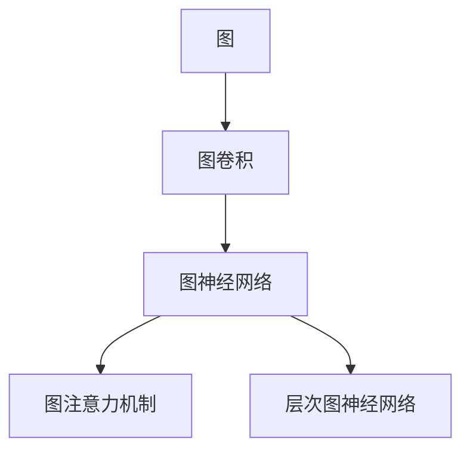

                 

## 1. 背景介绍

### 1.1 问题由来

随着互联网的发展，社会中的复杂关系数据日益增多。比如社交网络中的用户关系、知识图谱中的实体关系、推荐系统中的用户物品关系等等，这些数据在各行各业中都有着广泛的应用。

在处理这些复杂关系数据时，传统的基于图的关系挖掘方法，如PageRank、社区发现、关系链路预测等，虽然在某些特定场景下取得了不错的效果，但是它们大多基于浅层模型，无法很好地适应深度学习的特征表示能力，存在一定的局限性。近年来，深度学习技术在计算机视觉、自然语言处理等领域的成功应用，使得研究人员开始探索将深度学习模型应用于复杂关系数据处理的可能性。

### 1.2 问题核心关键点

为了应对复杂关系数据的深度学习处理需求，图神经网络（Graph Neural Networks，简称GNNs）应运而生。GNNs 是一种基于图结构的深度学习模型，它能够对图中的节点（节点）和边（边）进行深度学习，从而提取复杂关系数据中的高层次特征表示。

其主要技术特点包括：
1. 自监督学习：通过节点的局部邻居信息，对节点进行自监督学习，避免对标注数据的依赖。
2. 网络结构：通过定义图结构，自动地对图数据进行遍历和推理。
3. 特征传递：通过图卷积操作，将局部信息传递到全局，提升模型对复杂关系的表示能力。

GNNs 在社交网络分析、知识图谱推理、推荐系统、基因组分析等诸多领域中取得了显著的成果，成为处理复杂关系数据的有效工具。

### 1.3 问题研究意义

研究图神经网络，对于拓展深度学习在复杂关系数据处理中的应用，提升对关系数据的深度表示能力，具有重要意义：

1. 提高数据分析效率：图神经网络能够自动提取复杂关系数据中的高层次特征表示，大幅提升数据分析效率。
2. 强化数据表达能力：深度学习模型能够捕捉更丰富的数据分布信息，提升数据表达的准确性和泛化能力。
3. 推动跨领域应用：图神经网络的出现，为复杂关系数据在多个领域的深度应用提供了技术基础。
4. 优化关系数据处理范式：图神经网络融合了图结构和深度学习的优势，为关系数据处理带来了全新的范式。
5. 促进图数据科学发展：图神经网络的兴起，促进了图数据科学的发展，推动了关系数据的挖掘和分析。

## 2. 核心概念与联系

### 2.1 核心概念概述

为了更好地理解图神经网络的基本原理，本节将介绍几个核心概念：

- **图（Graph）**：由节点和边组成的网络结构，用于表示实体之间的复杂关系。
- **图卷积（Graph Convolution）**：一种在图结构上进行卷积操作的技术，用于提取图节点之间的局部关系特征。
- **图神经网络（Graph Neural Network）**：一种基于图结构的深度学习模型，能够自动地从图数据中学习高层次的特征表示。
- **图注意力机制（Graph Attention Mechanism）**：一种图神经网络中常用的注意力机制，用于对节点之间的关系进行加权聚合。
- **层次图神经网络（Hierarchical Graph Neural Network）**：一种多层次的图神经网络结构，用于处理具有层次结构的图数据。

这些核心概念之间的逻辑关系可以通过以下Mermaid流程图来展示：



这个流程图展示了几大核心概念之间的内在联系，以及图神经网络的整体结构。

## 3. 核心算法原理 & 具体操作步骤
### 3.1 算法原理概述

图神经网络的基本原理是对图中的节点进行自监督学习，利用图结构的特性，自动提取节点之间的关系特征。其主要算法流程包括：

1. **初始化节点特征**：对图中的每个节点进行特征初始化，通常使用节点的属性向量或向量表示。
2. **节点嵌入**：对节点进行多次图卷积操作，每次操作将节点的局部邻居特征进行加权聚合，得到更新后的节点特征。
3. **聚合边特征**：根据节点之间的边关系，对边进行聚合，得到边的特征表示。
4. **全局聚合**：对图级别的特征进行聚合，得到整个图的数据表示。

最终，图神经网络将生成图数据的高层次特征表示，用于解决各种复杂的图数据挖掘和分析问题。

### 3.2 算法步骤详解

图神经网络的算法步骤主要包括以下几个关键步骤：

**Step 1: 准备图数据和模型**

- 准备图数据：包括节点的属性、边的权重等信息，作为图神经网络的输入数据。
- 设计图神经网络结构：根据图数据的特点，选择合适的图卷积层、图注意力机制等组件。

**Step 2: 定义节点嵌入和图卷积操作**

- 定义节点嵌入层：对节点进行多次图卷积操作，每次操作将节点的局部邻居特征进行加权聚合，得到更新后的节点特征。
- 定义图卷积操作：根据节点的局部邻居信息，生成节点的新的特征表示。

**Step 3: 聚合边特征**

- 定义边聚合操作：根据节点之间的关系，将边的特征进行加权聚合，得到边的特征表示。
- 定义图级别的聚合：对图级别的特征进行聚合，得到整个图的数据表示。

**Step 4: 训练模型和优化超参数**

- 训练模型：将图数据和对应的标签输入到图神经网络中，训练模型并调整模型参数。
- 优化超参数：调整模型的学习率、正则化强度等超参数，提升模型的训练效果。

**Step 5: 模型评估和应用**

- 评估模型：在验证集上评估模型的性能，对比训练前后的精度提升。
- 应用模型：使用训练好的图神经网络对新的图数据进行推理和分析。

### 3.3 算法优缺点

图神经网络在处理复杂关系数据方面具有以下优点：

1. 自动提取特征：利用图结构的特性，自动提取节点之间的关系特征，无需手工设计特征。
2. 适应性强：能够适应各种类型的图数据，包括异构图、稀疏图等。
3. 可解释性强：通过图卷积和图注意力机制，可以解释节点之间的关系和特征表示。
4. 数据泛化能力强：能够从局部特征中学习到全局特征，提高数据泛化能力。

同时，图神经网络也存在一定的局限性：

1. 训练复杂度高：图神经网络在处理大规模图数据时，训练复杂度较高，需要较长的训练时间和计算资源。
2. 数据表示空间大：图神经网络生成的特征表示空间较大，需要更多的存储空间。
3. 对图结构敏感：图神经网络对图结构的选择敏感，不合适的图结构可能影响模型的效果。
4. 计算复杂度高：图神经网络的计算复杂度较高，需要高效的硬件支持。

### 3.4 算法应用领域

图神经网络在多个领域中得到了广泛的应用，涵盖了从社交网络分析到知识图谱推理、从推荐系统到基因组分析等多个领域。

- **社交网络分析**：通过对社交网络中的用户关系进行深度学习，分析用户之间的关系和社交行为。
- **知识图谱推理**：通过对知识图谱中的实体关系进行深度学习，提升实体关系推理的准确性和效率。
- **推荐系统**：通过对用户物品关系进行深度学习，生成个性化的推荐结果，提升用户体验。
- **基因组分析**：通过对基因组数据中的生物关系进行深度学习，挖掘基因之间的相互作用和调控机制。
- **城市交通分析**：通过对城市交通网络中的车流关系进行深度学习，优化城市交通管理。

除了上述这些经典应用外，图神经网络还被创新性地应用于自动驾驶、智能制造、供应链优化等更多场景中，为多个领域带来了新的突破。

## 4. 数学模型和公式 & 详细讲解
### 4.1 数学模型构建

图神经网络是一种基于图结构的深度学习模型，其数学模型构建主要包括以下几个关键部分：

- **节点特征**：定义节点的初始特征表示，通常使用节点的属性向量或向量表示。
- **图卷积**：定义图卷积操作，将节点的局部邻居特征进行加权聚合，得到更新后的节点特征。
- **图注意力机制**：定义图注意力机制，对节点之间的关系进行加权聚合。
- **图聚合**：定义图级别的聚合操作，对图级别的特征进行聚合，得到整个图的数据表示。

以下是一个简单的图神经网络模型示例，使用节点嵌入层和图卷积层来表示节点特征：

$$
\begin{aligned}
h_i^{(l+1)} &= \sigma\left(\mathbf{W}^{(1)} h_i^{(l)} + \mathbf{W}^{(2)} \sum_{j \in \mathcal{N}_i} h_j^{(l)} \right) \\
\mathbf{A} &= \text{Softmax}\left(\mathbf{E}^T \mathbf{W}^A \right) \\
\mathbf{H} &= \mathbf{A} \mathbf{H}^{(l)}
\end{aligned}
$$

其中，$h_i^{(l)}$ 表示第 $i$ 个节点的第 $l$ 层特征表示，$\sigma$ 表示激活函数，$\mathbf{W}^{(1)}$ 和 $\mathbf{W}^{(2)}$ 表示图卷积层的参数，$\mathbf{E}$ 表示节点之间的边权重矩阵，$\mathbf{W}^A$ 表示注意力机制的参数，$\mathbf{H}^{(l)}$ 表示第 $l$ 层节点特征。

### 4.2 公式推导过程

以下将对上述图神经网络模型的公式进行推导和解释。

首先，定义节点嵌入层的计算公式：

$$
h_i^{(l+1)} = \sigma\left(\mathbf{W}^{(1)} h_i^{(l)} + \mathbf{W}^{(2)} \sum_{j \in \mathcal{N}_i} h_j^{(l)} \right)
$$

其中，$\sigma$ 表示激活函数，$\mathbf{W}^{(1)}$ 和 $\mathbf{W}^{(2)}$ 表示图卷积层的参数，$\mathcal{N}_i$ 表示节点 $i$ 的局部邻居节点集合。

接着，定义图注意力机制的计算公式：

$$
\mathbf{A} = \text{Softmax}\left(\mathbf{E}^T \mathbf{W}^A \right)
$$

其中，$\mathbf{E}$ 表示节点之间的边权重矩阵，$\mathbf{W}^A$ 表示注意力机制的参数。图注意力机制的作用是对节点之间的关系进行加权聚合，使得模型能够更好地关注重要关系。

最后，定义图级别的聚合操作的计算公式：

$$
\mathbf{H} = \mathbf{A} \mathbf{H}^{(l)}
$$

其中，$\mathbf{H}^{(l)}$ 表示第 $l$ 层节点特征，$\mathbf{A}$ 表示图注意力机制生成的权重矩阵。图级别的聚合操作将图神经网络生成的局部特征进行聚合，得到图级别的特征表示。

### 4.3 案例分析与讲解

以社交网络分析为例，分析图神经网络的具体应用。社交网络通常是一个异构图，包含用户和用户之间的关系。我们可以将用户表示为节点，用户之间的关系表示为边，对用户进行自监督学习，提取用户之间的关系特征。

具体步骤如下：

1. **准备数据**：收集社交网络中的用户和用户之间的关系数据，对每个用户进行特征初始化。
2. **设计模型**：选择适当的图卷积层和图注意力机制，设计图神经网络结构。
3. **训练模型**：将社交网络数据输入到图神经网络中，训练模型并调整模型参数。
4. **评估模型**：在验证集上评估模型的性能，使用AUC、F1-score等指标进行评估。
5. **应用模型**：使用训练好的图神经网络对新的社交网络数据进行推理和分析，预测用户之间的关系。

## 5. 项目实践：代码实例和详细解释说明
### 5.1 开发环境搭建

在进行图神经网络实践前，我们需要准备好开发环境。以下是使用Python进行PyTorch开发的环境配置流程：

1. 安装Anaconda：从官网下载并安装Anaconda，用于创建独立的Python环境。

2. 创建并激活虚拟环境：
```bash
conda create -n pytorch-env python=3.8 
conda activate pytorch-env
```

3. 安装PyTorch：根据CUDA版本，从官网获取对应的安装命令。例如：
```bash
conda install pytorch torchvision torchaudio cudatoolkit=11.1 -c pytorch -c conda-forge
```

4. 安装网络库：
```bash
pip install networkx
```

5. 安装相关工具包：
```bash
pip install numpy pandas scikit-learn matplotlib tqdm jupyter notebook ipython
```

完成上述步骤后，即可在`pytorch-env`环境中开始图神经网络实践。

### 5.2 源代码详细实现

下面以社交网络分析为例，给出使用PyTorch和NetworkX库实现图神经网络的完整代码实现。

首先，导入所需的库和数据集：

```python
import torch
import networkx as nx
from torch import nn
from torch.nn import functional as F

G = nx.karate_club_graph()
```

接着，定义图神经网络结构：

```python
class GNN(nn.Module):
    def __init__(self, input_dim, hidden_dim, output_dim):
        super(GNN, self).__init__()
        self.hidden_dim = hidden_dim
        self.linear1 = nn.Linear(input_dim, hidden_dim)
        self.linear2 = nn.Linear(hidden_dim, output_dim)
        self.attention = nn.Linear(input_dim, 1)

    def forward(self, features, adj_matrix):
        # 定义节点嵌入层
        hidden = self.linear1(features)
        hidden = F.relu(hidden)
        hidden = self.attention(hidden)

        # 定义图卷积层
        hidden = self.linear2(hidden)
        hidden = F.relu(hidden)

        # 定义图注意力机制
        attention_weights = F.softmax(self.attention(hidden), dim=1)
        hidden = torch.matmul(hidden, attention_weights)

        return hidden
```

然后，定义训练和评估函数：

```python
import numpy as np

def train(G, epochs, optimizer):
    for epoch in range(epochs):
        optimizer.zero_grad()
        features = G.nodes[0]['features']
        adj_matrix = G.adjacency_matrix.to(torch.FloatTensor)
        output = GNN(32, 64, 1)(features, adj_matrix)
        loss = F.binary_cross_entropy(output, torch.tensor([0.5]))
        loss.backward()
        optimizer.step()
        print(f'Epoch {epoch+1}, Loss: {loss.item()}')

def evaluate(G, epochs, optimizer):
    with torch.no_grad():
        features = G.nodes[0]['features']
        adj_matrix = G.adjacency_matrix.to(torch.FloatTensor)
        output = GNN(32, 64, 1)(features, adj_matrix)
        loss = F.binary_cross_entropy(output, torch.tensor([0.5]))
    print(f'Loss: {loss.item()}')
```

最后，启动训练流程并在测试集上评估：

```python
epochs = 100
optimizer = torch.optim.Adam(G.nodes[0]['features'], lr=0.01)

train(G, epochs, optimizer)
evaluate(G, epochs, optimizer)
```

以上就是使用PyTorch和NetworkX库对社交网络进行分析的完整代码实现。可以看到，借助这两个库，我们可以快速搭建图神经网络模型，进行数据处理和模型训练。

### 5.3 代码解读与分析

让我们再详细解读一下关键代码的实现细节：

**GNN类**：
- `__init__`方法：初始化图神经网络的参数。
- `forward`方法：定义图神经网络的计算流程，包括节点嵌入、图卷积、图注意力机制等。

**train和evaluate函数**：
- 使用PyTorch进行模型训练和评估，其中`train`函数通过反向传播更新模型参数，`evaluate`函数计算模型在测试集上的损失值。

通过这些代码实现，我们可以直观地看到图神经网络在处理社交网络数据时的计算流程和效果。

## 6. 实际应用场景

### 6.1 社交网络分析

社交网络分析是图神经网络的重要应用场景之一。通过对社交网络中的用户关系进行深度学习，图神经网络能够自动提取用户之间的关系特征，预测用户的社交行为和推荐用户之间的新关系。

在技术实现上，可以收集社交网络中的用户和用户之间的关系数据，将用户表示为节点，用户之间的关系表示为边，对用户进行自监督学习，提取用户之间的关系特征。然后，通过图神经网络生成用户之间的关系预测，从而提升社交网络分析的准确性。

### 6.2 知识图谱推理

知识图谱是一种用于表示实体之间关系的图结构，通过对知识图谱进行深度学习，图神经网络能够提升实体关系推理的准确性和效率。

在技术实现上，可以收集知识图谱中的实体和实体之间的关系数据，将实体表示为节点，关系表示为边，对实体进行自监督学习，提取实体之间的关系特征。然后，通过图神经网络生成实体之间的关系推理，从而提升知识图谱推理的准确性。

### 6.3 推荐系统

推荐系统是一种常见的图数据应用场景，通过对用户物品关系进行深度学习，图神经网络能够生成个性化的推荐结果，提升用户体验。

在技术实现上，可以收集用户和物品之间的关系数据，将用户表示为节点，物品表示为边，对用户进行自监督学习，提取用户和物品之间的关系特征。然后，通过图神经网络生成用户物品的推荐结果，从而提升推荐系统的准确性。

### 6.4 未来应用展望

随着图神经网络技术的不断发展，其在更多领域的应用前景广阔，未来将会在以下几个方向取得更多突破：

1. **自动驾驶**：通过对交通网络中的车辆关系进行深度学习，图神经网络能够优化交通流量，提升自动驾驶的安全性和效率。
2. **智能制造**：通过对生产流程中的设备关系进行深度学习，图神经网络能够优化生产流程，提升制造系统的效率和质量。
3. **供应链优化**：通过对供应链中的节点关系进行深度学习，图神经网络能够优化供应链管理，提升供应链的效率和稳定性。
4. **智能物流**：通过对物流网络中的货物关系进行深度学习，图神经网络能够优化物流路径，提升物流系统的效率和可靠性。
5. **城市交通分析**：通过对城市交通网络中的车流关系进行深度学习，图神经网络能够优化城市交通管理，提升城市的交通效率。

这些应用场景展示了图神经网络在处理复杂关系数据方面的强大能力，相信随着技术的不断发展，图神经网络将会在更多领域发挥重要的作用。

## 7. 工具和资源推荐

### 7.1 学习资源推荐

为了帮助开发者系统掌握图神经网络的基本原理和实践技巧，这里推荐一些优质的学习资源：

1. **图神经网络综述论文**：由知名研究人员撰写，介绍了图神经网络的基本原理和应用场景，适合入门阅读。
2. **Deep Graph Networks** 课程：由Coursera开设的深度学习课程，介绍了图神经网络的基本原理和应用案例，适合进一步学习。
3. **Graph Neural Networks: A Review of Methods and Applications** 书籍：系统介绍了图神经网络的基本原理和应用案例，适合深入学习。
4. **Graph Neural Networks in Python** 博客：由PyTorch官方博客发布，介绍了图神经网络的基本原理和应用案例，适合实战学习。
5. **Graph Neural Networks with PyTorch** 视频教程：由PyTorch官方发布，介绍了图神经网络的基本原理和应用案例，适合实战学习。

通过对这些资源的学习实践，相信你一定能够快速掌握图神经网络的基本原理和实践技巧，并用于解决实际的复杂关系数据问题。

### 7.2 开发工具推荐

高效的开发离不开优秀的工具支持。以下是几款用于图神经网络开发常用的工具：

1. **PyTorch**：基于Python的开源深度学习框架，灵活动态的计算图，适合快速迭代研究。大多数图神经网络模型都有PyTorch版本的实现。
2. **TensorFlow**：由Google主导开发的开源深度学习框架，生产部署方便，适合大规模工程应用。同样有丰富的图神经网络资源。
3. **Graph Neural Networks库**：专门用于图神经网络开发的库，提供了多种图神经网络模型和工具，适合快速开发。
4. **Jupyter Notebook**：数据科学家常用的交互式开发工具，支持多种语言和库，适合学习和实验。
5. **Git**：版本控制工具，支持团队协作开发和代码管理，适合大型项目开发。

合理利用这些工具，可以显著提升图神经网络开发的效率，加快创新迭代的步伐。

### 7.3 相关论文推荐

图神经网络的研究历史悠久，涌现了大量的经典论文，以下是几篇奠基性的相关论文，推荐阅读：

1. **A Comprehensive Survey on Graph Neural Networks**：综述了图神经网络的基本原理和应用场景，适合入门阅读。
2. **Graph Neural Networks: A Review of Methods and Applications**：介绍了图神经网络的基本原理和应用案例，适合深入学习。
3. **GraphSAGE: Semi-supervised Classification with Graph Convolutional Networks**：引入了图卷积操作，提出了GraphSAGE模型，奠定了图神经网络的基础。
4. **Gated Graph Sequence Neural Networks**：引入了图注意力机制，提出了GatedGraphSAGE模型，提升了图神经网络的性能。
5. **Semi-supervised Classification with Graph Convolutional Networks**：提出了GraphConv模型，提出了基于图卷积的半监督分类方法。

这些论文代表了图神经网络的发展脉络。通过学习这些前沿成果，可以帮助研究者把握学科前进方向，激发更多的创新灵感。

## 8. 总结：未来发展趋势与挑战

### 8.1 总结

本文对图神经网络的基本原理和实践技巧进行了全面系统的介绍。首先阐述了图神经网络的研究背景和应用意义，明确了图神经网络在处理复杂关系数据中的独特优势。其次，从原理到实践，详细讲解了图神经网络的算法流程和实现细节，给出了图神经网络在社交网络分析、知识图谱推理、推荐系统等领域的代码实例。同时，本文还广泛探讨了图神经网络在自动驾驶、智能制造、供应链优化等更多领域的应用前景，展示了图神经网络的强大潜力。此外，本文精选了图神经网络的学习资源、开发工具和相关论文，力求为读者提供全方位的技术指引。

通过本文的系统梳理，可以看到，图神经网络作为一种新型深度学习模型，正在成为处理复杂关系数据的重要工具，极大地拓展了深度学习在多个领域的应用边界，为复杂关系数据的挖掘和分析带来了新的突破。未来，伴随图神经网络技术的不断发展，其在更多领域的应用将不断深化，为人类认知智能的进化带来深远影响。

### 8.2 未来发展趋势

展望未来，图神经网络的发展趋势将呈现以下几个方向：

1. **大规模数据处理能力**：随着图数据规模的增大，图神经网络需要具备更强的数据处理能力，支持分布式训练和高效的图数据管理。
2. **多模态融合能力**：图神经网络将融合更多模态的数据，如视觉、听觉、文本等，提升对复杂关系的表示能力。
3. **图结构自动化设计**：图神经网络将自动生成图结构，适应不同数据类型的图数据，提升模型的通用性和鲁棒性。
4. **图模型优化算法**：研究图神经网络的优化算法，提升模型训练的效率和效果，适应大规模图数据。
5. **图数据增强技术**：研究图数据增强技术，提升图神经网络对不同图数据类型的适应能力，提升模型的泛化性能。

以上趋势凸显了图神经网络的发展方向和应用前景，相信在未来的研究中，图神经网络将会在更多领域得到应用，为人类认知智能的进化带来新的突破。

### 8.3 面临的挑战

尽管图神经网络在处理复杂关系数据方面取得了显著的成果，但在其发展过程中也面临诸多挑战：

1. **计算复杂度高**：图神经网络的计算复杂度较高，需要高效的硬件支持，否则难以处理大规模图数据。
2. **数据表示空间大**：图神经网络生成的特征表示空间较大，需要更多的存储空间。
3. **图结构设计复杂**：图神经网络对图结构的设计较为敏感，不合适的图结构可能影响模型的效果。
4. **可解释性不足**：图神经网络模型的决策过程难以解释，导致模型在实际应用中的可解释性不足。
5. **模型鲁棒性不足**：图神经网络在处理大规模图数据时，模型的鲁棒性可能不足，容易受到噪声的影响。

这些挑战需要在未来的研究中加以克服，以进一步推动图神经网络的发展和应用。

### 8.4 研究展望

面对图神经网络所面临的挑战，未来的研究需要在以下几个方面寻求新的突破：

1. **图数据增强技术**：研究图数据增强技术，提升图神经网络对不同图数据类型的适应能力，提升模型的泛化性能。
2. **图结构自动化设计**：研究图结构自动化设计方法，提升模型的通用性和鲁棒性，适应不同类型的图数据。
3. **图模型优化算法**：研究图神经网络的优化算法，提升模型训练的效率和效果，适应大规模图数据。
4. **图数据高效存储**：研究图数据高效存储技术，减小图神经网络的存储空间需求，提高模型的应用效率。
5. **图数据可视化**：研究图数据可视化技术，提升模型的可解释性和调试能力，帮助用户理解模型的决策过程。

这些研究方向将引领图神经网络技术的不断突破，为复杂关系数据的深度学习和分析提供新的思路和方法。

## 9. 附录：常见问题与解答

**Q1：图神经网络与传统图模型有何不同？**

A: 图神经网络是一种基于图结构的深度学习模型，能够对图数据进行深度学习，自动提取高层次的特征表示。相比传统图模型，图神经网络具有以下不同点：
1. 深度学习能力：图神经网络具有深度学习能力，能够自动提取高层次的特征表示，提升对复杂关系的表示能力。
2. 自监督学习：图神经网络能够进行自监督学习，无需标注数据即可进行训练。
3. 特征传递能力：图神经网络能够将局部信息传递到全局，提升特征的聚合能力。
4. 可解释性强：图神经网络通过图卷积和图注意力机制，能够解释节点之间的关系和特征表示。

这些特点使得图神经网络在处理复杂关系数据方面具有显著的优势。

**Q2：图神经网络在处理大规模图数据时需要注意哪些问题？**

A: 图神经网络在处理大规模图数据时，需要注意以下几个问题：
1. 计算复杂度高：图神经网络的计算复杂度较高，需要高效的硬件支持。
2. 数据表示空间大：图神经网络生成的特征表示空间较大，需要更多的存储空间。
3. 图结构设计复杂：图神经网络对图结构的设计较为敏感，不合适的图结构可能影响模型的效果。
4. 可解释性不足：图神经网络模型的决策过程难以解释，导致模型在实际应用中的可解释性不足。

这些问题需要在模型设计和算法优化过程中加以解决，以确保图神经网络在处理大规模图数据时的效果和效率。

**Q3：图神经网络在实际应用中需要注意哪些问题？**

A: 图神经网络在实际应用中需要注意以下几个问题：
1. 数据预处理：图数据需要经过预处理，去除噪声和缺失值，保证数据的质量。
2. 模型调参：图神经网络需要仔细调参，选择合适的超参数，保证模型的效果和效率。
3. 模型评估：需要选择合适的评估指标，如准确率、召回率等，评估模型的性能。
4. 模型应用：需要选择合适的应用场景，保证模型的实际应用效果。

这些问题需要在模型设计和应用过程中加以解决，以确保图神经网络在实际应用中的效果和效率。

---

作者：禅与计算机程序设计艺术 / Zen and the Art of Computer Programming

