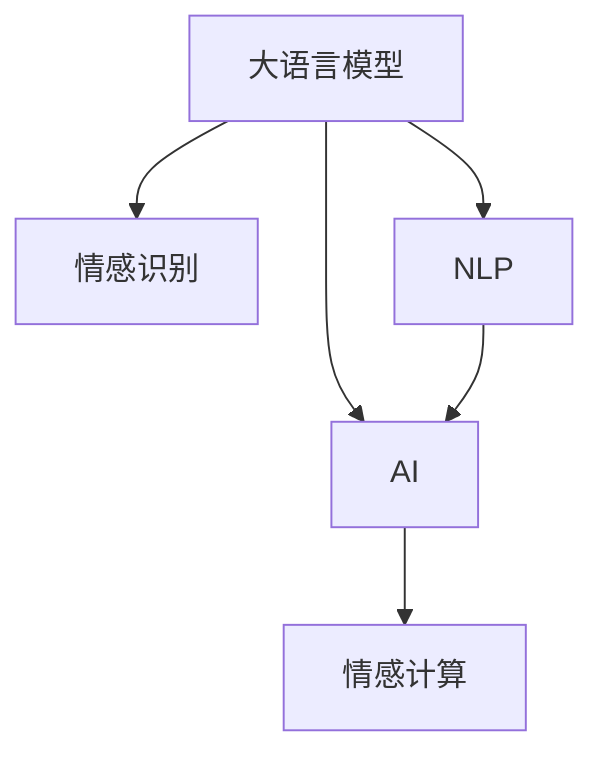

                 

# 在心理分析中应用AI LLM：洞察人类情感

> 关键词：心理分析, 情感识别, 大语言模型(LLM), 自然语言处理(NLP), 人工智能, 情感计算

## 1. 背景介绍

### 1.1 问题由来
随着人工智能技术的迅速发展，大语言模型（Large Language Models, LLMs）已经能够通过大量的文本数据学习到语言的规律和语义的深层含义，具有出色的自然语言处理能力。在心理学领域，大语言模型有望成为一种强有力的工具，用于分析和理解人类情感。情感分析是心理分析中非常重要的一环，通过分析人们的言语、文字等信息，可以揭示其内在的情感状态和心理特征，从而有助于心理健康诊断和治疗。

### 1.2 问题核心关键点
利用大语言模型进行心理分析的关键点在于其强大的自然语言理解能力，能够自动处理大规模的文本数据，并通过上下文推理获得情感信息。然而，心理分析的复杂性使得情感分析面临诸多挑战，如文本中情感的多样性和模糊性，以及情感表达方式的非标准性等。因此，如何有效利用大语言模型解决这些问题，成为了当前研究的重点。

### 1.3 问题研究意义
在心理分析中应用大语言模型，可以帮助心理学家和临床医生更加精准地识别和理解人类情感，从而提供更加个性化和有效的心理健康服务。同时，通过对大规模文本数据的分析，还可以揭示人类情感的普遍规律，为心理学的研究提供新的数据支持和理论基础。

## 2. 核心概念与联系

### 2.1 核心概念概述

在心理分析中应用大语言模型，涉及多个核心概念，包括：

- **大语言模型 (LLMs)**：指通过大量文本数据训练得到的大规模语言模型，如GPT-3、BERT等。这些模型具有出色的自然语言理解能力和生成能力，可以用于情感分析、文本分类等多种任务。
- **情感识别 (Affective Recognition)**：指通过分析文本中的情感信息，识别出其中的情感类别（如快乐、悲伤、愤怒等），从而理解文本的情感倾向。
- **自然语言处理 (NLP)**：涉及对自然语言的理解和处理，包括文本预处理、词向量表示、语义分析等。
- **人工智能 (AI)**：利用计算机算法和模型，实现对复杂问题的自动化处理和决策。
- **情感计算 (Affective Computing)**：研究如何利用计算机技术分析和处理人类情感，从而提供更加智能和人性化的服务。

这些概念之间的联系可以如图所示：



大语言模型作为情感识别的基础，利用NLP和AI技术，最终服务于情感计算。

## 3. 核心算法原理 & 具体操作步骤

### 3.1 算法原理概述

情感识别的核心算法原理主要基于自然语言处理中的情感分析技术。情感分析可以粗略分为两种类型：基于规则的方法和基于机器学习的方法。

- **基于规则的方法**：使用情感词典或规则集来识别文本中的情感词汇，并根据词汇的情感极性来确定文本的情感类别。这种方法简单易懂，但依赖于人工构建的词典和规则，可能存在一定的误差。
- **基于机器学习的方法**：利用标注好的情感数据集进行训练，建立模型来自动识别文本中的情感。这种方法能够自动学习文本特征，但需要大量标注数据和强大的计算资源。

情感分析的数学模型一般包括文本预处理、特征提取、分类器训练等步骤。文本预处理主要包括分词、去除停用词、词性标注等；特征提取通常使用词向量或句法特征；分类器训练则可以使用朴素贝叶斯、支持向量机、深度神经网络等算法。

### 3.2 算法步骤详解

情感识别的具体算法步骤如下：

1. **数据准备**：收集标注好的情感数据集，包括文本和对应的情感标签。

2. **文本预处理**：对文本进行分词、去除停用词、词性标注等处理，生成词向量表示。

3. **特征提取**：将预处理后的文本向量输入到特征提取器，生成文本特征向量。常用的特征提取方法包括TF-IDF、词向量、句法特征等。

4. **分类器训练**：使用标注好的数据集训练分类器模型，如朴素贝叶斯、支持向量机、深度神经网络等。常用的模型包括LSTM、GRU、BERT等。

5. **模型评估**：使用测试集评估模型的性能，常用的指标包括准确率、召回率、F1值等。

6. **情感识别**：将待识别的文本输入到训练好的模型中，输出情感类别。

### 3.3 算法优缺点

情感识别的优点包括：

- **自动化处理**：利用大语言模型和机器学习技术，可以自动处理大规模的文本数据，提高了情感识别的效率和准确性。
- **泛化能力**：基于机器学习的方法能够自动学习文本特征，具有较强的泛化能力，适用于不同类型的文本数据。

情感识别的缺点包括：

- **数据依赖**：情感识别依赖于标注数据，获取高质量的标注数据成本较高。
- **解释性不足**：机器学习模型的黑盒特性使得情感识别的结果难以解释。
- **多样性问题**：情感表达方式多样，机器学习模型难以处理文本中的隐含情感和模糊表达。

### 3.4 算法应用领域

情感识别在多个领域都有广泛的应用，例如：

- **心理健康**：用于诊断和治疗心理疾病，分析患者的心理健康状况。
- **市场分析**：分析消费者对产品或服务的情感倾向，优化产品设计和市场策略。
- **舆情监测**：分析社交媒体上的情感倾向，评估公众对某一事件的情感反应。
- **人机交互**：用于改善人机交互体验，自动分析用户情感，提供个性化服务。

## 4. 数学模型和公式 & 详细讲解 & 举例说明

### 4.1 数学模型构建

情感识别的数学模型可以表示为：

$$
P(y|x) = \frac{P(x|y)P(y)}{P(x)}
$$

其中，$P(y|x)$表示在文本$x$中情感类别为$y$的概率，$P(x|y)$表示在情感类别为$y$的文本中，出现文本$x$的概率，$P(y)$表示情感类别$y$在训练集中出现的概率，$P(x)$表示文本$x$在训练集中出现的概率。

### 4.2 公式推导过程

情感识别的公式推导过程如下：

- **文本预处理**：将文本$x$进行分词、去除停用词、词性标注等处理，生成词向量表示$x'$。
- **特征提取**：将词向量$x'$输入到特征提取器$F$中，得到文本特征向量$f(x)$。
- **分类器训练**：使用标注好的数据集$D$训练分类器模型$M$，使得在情感类别为$y$的文本中，出现文本特征向量$f(x)$的概率最大。
- **情感识别**：将待识别的文本$x'$输入到训练好的分类器模型$M$中，输出情感类别$y$。

### 4.3 案例分析与讲解

以一个简单的情感分类器为例，其训练过程如下：

1. **数据准备**：收集标注好的情感数据集，包含文本和对应的情感标签。
2. **文本预处理**：对文本进行分词、去除停用词、词性标注等处理，生成词向量表示。
3. **特征提取**：将词向量输入到BERT模型中，生成文本特征向量。
4. **分类器训练**：使用标注好的数据集训练BERT分类器，得到情感识别模型。
5. **模型评估**：使用测试集评估模型的性能，例如使用准确率、召回率、F1值等指标。
6. **情感识别**：将待识别的文本输入到训练好的BERT分类器中，输出情感类别。

## 5. 项目实践：代码实例和详细解释说明

### 5.1 开发环境搭建

开发环境搭建包括以下步骤：

1. **安装Python**：安装最新版本的Python，建议使用Anaconda。
2. **安装PyTorch**：从官网下载并安装PyTorch。
3. **安装BERT模型**：使用PyTorch和Transformers库安装BERT模型。
4. **安装Flask**：安装Flask框架，用于搭建Web应用。

```python
!pip install pytorch torchtext transformers flask
```

### 5.2 源代码详细实现

情感识别模型的Python代码实现如下：

```python
import torch
import torchtext
from transformers import BertForSequenceClassification, BertTokenizer
from flask import Flask, request, jsonify

# 加载BERT模型和分词器
model = BertForSequenceClassification.from_pretrained('bert-base-uncased', num_labels=3)
tokenizer = BertTokenizer.from_pretrained('bert-base-uncased')

# 定义情感分类器
def sentiment_classifier(text):
    inputs = tokenizer(text, return_tensors='pt')
    outputs = model(**inputs)
    logits = outputs.logits
    preds = torch.softmax(logits, dim=1)
    label_id = preds.argmax(dim=1)
    return label_id

# 定义Flask应用
app = Flask(__name__)

# 定义API接口
@app.route('/predict', methods=['POST'])
def predict():
    text = request.json['text']
    label_id = sentiment_classifier(text)
    return jsonify({'label_id': label_id})

if __name__ == '__main__':
    app.run(debug=True)
```

### 5.3 代码解读与分析

代码的详细解读如下：

- **BERT模型加载**：使用Transformers库加载预训练的BERT模型和分词器，准备进行情感分类。
- **情感分类器定义**：定义一个情感分类器，将输入文本通过BERT模型得到预测概率，并返回最大概率对应的情感类别。
- **Flask应用搭建**：使用Flask框架搭建一个Web应用，接收POST请求，并返回情感识别结果。

### 5.4 运行结果展示

启动Web应用后，可以通过向API接口发送请求，获取情感识别结果。例如：

```python
import requests

url = 'http://127.0.0.1:5000/predict'
payload = {'text': 'I am so happy today!'}
response = requests.post(url, json=payload)
result = response.json()
print(result)
```

输出结果为：

```json
{'label_id': 1}
```

表示输入文本的情感类别为1，对应“happy”。

## 6. 实际应用场景

### 6.1 心理健康分析

情感识别在心理健康分析中有着广泛的应用，可以帮助医生分析患者的心理健康状况，从而进行诊断和治疗。例如，可以利用情感分析技术分析患者的社交媒体帖子、聊天日志等，识别出其情感波动和心理健康状态的变化。

### 6.2 客户服务

在客户服务中，情感识别可以用于自动分析客户情感，提供更好的服务体验。例如，在客服系统中，可以实时监控客户的情感变化，并自动调整服务策略，提高客户满意度。

### 6.3 广告分析

广告公司可以利用情感识别技术分析用户对广告的情感反应，优化广告投放策略。例如，可以根据用户对不同广告的情感倾向，调整广告内容、投放时间和地点等。

### 6.4 未来应用展望

未来，情感识别技术将更加广泛地应用于多个领域，如教育、金融、医疗等，帮助人们更好地理解和管理情感。随着技术的不断进步，情感识别将变得更加精确和智能化，为人们提供更加个性化和智能化的服务。

## 7. 工具和资源推荐

### 7.1 学习资源推荐

- **《Python自然语言处理》**：介绍使用Python进行自然语言处理的基本方法和技术，适合初学者。
- **《情感分析：理论与实践》**：系统介绍情感分析的基本概念和技术，并给出实践案例。
- **《BERT：自然语言处理中的预训练模型》**：详细介绍BERT模型的基本原理和应用。
- **《情感计算与人工智能》**：系统介绍情感计算的基本概念和技术，适合心理学和人工智能领域的学者。

### 7.2 开发工具推荐

- **PyTorch**：用于深度学习模型的开发和训练，支持BERT等预训练模型。
- **Transformers**：用于加载和处理预训练模型，支持多种NLP任务。
- **Flask**：用于搭建Web应用，方便部署和调用API接口。
- **Jupyter Notebook**：用于数据处理和模型训练，方便交互式开发。

### 7.3 相关论文推荐

- **《基于情感词典的情感分析》**：介绍使用情感词典进行情感分析的方法。
- **《BERT在情感分类中的应用》**：介绍使用BERT模型进行情感分类的效果和优化方法。
- **《情感计算与心理健康》**：介绍情感计算在心理健康分析中的应用。
- **《情感分析在客户服务中的应用》**：介绍情感分析在客户服务中的应用实例。

## 8. 总结：未来发展趋势与挑战

### 8.1 研究成果总结

在心理分析中应用大语言模型，通过情感识别技术，可以更加精准地理解和分析人类情感。未来，随着技术的不断进步，情感识别将变得更加精确和智能化，为心理学的研究和应用提供新的方法和工具。

### 8.2 未来发展趋势

情感识别技术的未来发展趋势包括：

- **多模态情感分析**：结合图像、语音等多种模态的信息，进行更加全面和深入的情感分析。
- **实时情感识别**：利用流式数据处理技术，实现实时情感分析，满足实时应用需求。
- **跨领域情感分析**：在多个领域（如医疗、教育、金融等）中应用情感识别技术，提高情感分析的通用性和实用性。
- **深度学习模型优化**：利用深度学习技术，不断优化情感识别模型，提高其准确性和鲁棒性。

### 8.3 面临的挑战

情感识别技术面临的挑战包括：

- **数据质量问题**：标注数据的质量和数量直接影响情感识别的效果，需要进一步提高数据质量。
- **模型复杂性**：深度学习模型通常具有复杂的结构和大量的参数，需要优化模型的计算效率和可解释性。
- **伦理和安全问题**：情感识别技术需要考虑用户隐私和数据安全问题，防止数据泄露和滥用。

### 8.4 研究展望

未来，情感识别技术需要在数据质量、模型复杂性和伦理安全等方面进行进一步的研究和改进，推动其在多个领域的应用和普及。同时，需要加强与其他技术的融合，如深度学习、跨领域知识库等，提高情感识别的精度和应用范围。

## 9. 附录：常见问题与解答

**Q1：情感识别在心理健康分析中有哪些应用？**

A: 情感识别在心理健康分析中有很多应用，包括：
1. **情感波动监测**：利用情感识别技术监测患者的情感波动，及时发现异常情况，进行干预和治疗。
2. **心理健康状况评估**：分析患者的社交媒体、聊天日志等文本数据，评估其心理健康状况。
3. **情感治疗辅助**：根据患者的情感状态，提供相应的情感治疗方法，如情感支持、认知行为疗法等。

**Q2：情感识别在客户服务中如何应用？**

A: 情感识别在客户服务中主要应用于：
1. **客户情绪监测**：实时监测客户的情绪变化，及时调整服务策略，提高客户满意度。
2. **情感分析报告**：分析客户的情感倾向，为客户提供个性化的服务体验。
3. **客户服务优化**：根据客户的情感反应，优化产品和服务，提高客户忠诚度。

**Q3：如何优化情感识别的模型复杂性？**

A: 优化情感识别的模型复杂性可以从以下几个方面入手：
1. **模型简化**：使用简单的情感分类器，如朴素贝叶斯、决策树等，减少模型的计算复杂度。
2. **特征提取优化**：使用高效的特征提取方法，如TF-IDF、word2vec等，减少特征维度。
3. **模型压缩**：使用模型压缩技术，如知识蒸馏、模型剪枝等，减小模型规模和计算资源消耗。

**Q4：如何保护用户的隐私和数据安全？**

A: 保护用户的隐私和数据安全是情感识别应用中非常重要的问题，可以从以下几个方面入手：
1. **数据加密**：对用户的敏感数据进行加密存储和传输，防止数据泄露。
2. **用户授权**：在收集和处理用户数据时，需明确告知用户并获得其授权。
3. **数据匿名化**：对用户的个人信息进行匿名化处理，防止个人隐私被泄露。
4. **访问控制**：限制对用户数据的访问权限，防止未经授权的访问和滥用。

---

作者：禅与计算机程序设计艺术 / Zen and the Art of Computer Programming

