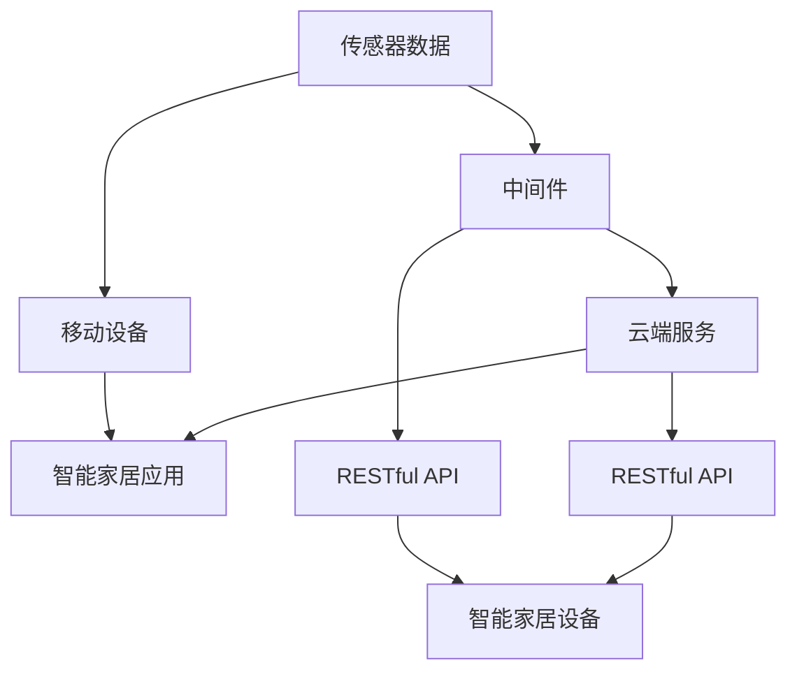

                 

# 基于Java的智能家居设计：基于RESTful的智能家居控制API设计

## 1. 背景介绍

随着物联网(IoT)技术的发展，智能家居系统逐渐成为家居生活的重要组成部分。基于互联网和无线通信技术，智能家居系统能够实现对家中各种设备的远程监控和控制，提升居住者的便利性和舒适性。然而，现有的智能家居系统在安全性、可扩展性和用户体验方面仍存在诸多不足。

为了解决这些问题，本文将探讨基于Java的智能家居设计，并着重介绍使用RESTful架构设计的智能家居控制API。RESTful是一种轻量级的架构风格，通过HTTP协议实现对资源的统一管理和访问，具备易于扩展、易于维护、可缓存等优点。本文将详细阐述RESTful架构的设计原理和实施步骤，并通过具体案例展示如何使用Java实现一个智能家居控制系统。

## 2. 核心概念与联系

### 2.1 核心概念概述

在设计智能家居控制API时，需要理解以下关键概念：

- **智能家居系统**：由传感器、控制器和移动设备等组成的智能家居系统，可以实现对家中各种设备的远程监控和控制。

- **RESTful架构**：基于HTTP协议设计的轻量级架构风格，以资源为中心，通过HTTP方法对资源进行CRUD操作，支持多种数据格式和传输方式。

- **物联网(IoT)**：将各种日常物品通过互联网连接起来，实现远程监控和控制，包括传感器、智能家电、安全监控等。

- **中间件**：作为智能家居系统和云端服务之间的桥梁，中间件负责数据的收集、处理和分发。

- **API设计**：API是软件接口的抽象，通过API，智能家居系统中的不同组件可以进行数据的交换和共享。

### 2.2 核心概念原理和架构的 Mermaid 流程图



该流程图展示了智能家居系统的核心架构：传感器数据经过中间件处理后，发送到云端服务，最终通过RESTful API传递到智能家居设备。智能家居应用和移动设备也可以通过RESTful API获取和控制智能家居设备的各项参数。

## 3. 核心算法原理 & 具体操作步骤

### 3.1 算法原理概述

RESTful架构的核心思想是以资源为中心，通过HTTP方法对资源进行CRUD操作。在智能家居控制API的设计中，每个智能家居设备都可以看作是一个资源，其状态和属性可以通过HTTP请求进行更新和查询。

API设计需要遵循RESTful的六项约束：

1. **统一接口**：API应以统一的接口对外提供服务。
2. **无状态**：每个请求应独立于之前的请求，避免状态耦合。
3. **缓存机制**：应支持缓存，以减少服务器负担。
4. **分层系统**：系统应支持多层结构，增加系统扩展性。
5. **代码复用性**：应避免代码重复，增加系统的可维护性。
6. **按需编码**：应支持多种编码方式，提高API的灵活性。

### 3.2 算法步骤详解

以下是基于RESTful架构设计智能家居控制API的具体步骤：

**Step 1: 资源定义**

首先，需要定义智能家居系统中的资源。例如，一个智能插座可以被定义为资源`/sockets/{id}`，其中`{id}`表示智能插座的唯一标识符。

**Step 2: 方法设计**

其次，需要设计RESTful方法，包括GET、POST、PUT、DELETE等，用于对资源进行操作。例如，获取智能插座的状态可以设计GET方法`GET /sockets/{id}`，更新智能插座的状态可以设计PUT方法`PUT /sockets/{id}`。

**Step 3: 参数传递**

然后，需要设计参数传递方式。例如，获取智能插座的状态需要传递插座的唯一标识符`id`，更新智能插座的状态需要传递新的状态值。

**Step 4: 数据编码**

接下来，需要设计数据编码格式。例如，智能家居系统中的数据可以是JSON格式，可以通过HTTP请求体传递。

**Step 5: 错误处理**

最后，需要设计错误处理机制。例如，当请求的资源不存在时，应返回404错误。

### 3.3 算法优缺点

RESTful架构具备以下优点：

- **易于扩展**：支持分层结构，易于扩展。
- **易于维护**：无状态，易于维护。
- **可缓存**：支持缓存机制，减轻服务器负担。

但同时，RESTful架构也存在以下缺点：

- **性能开销**：每个请求需要建立新的HTTP连接，性能开销较大。
- **安全问题**：HTTP协议本身不安全，需要额外的安全机制。
- **复杂性**：设计复杂，需要考虑多方面因素。

### 3.4 算法应用领域

RESTful架构可以应用于多种领域，例如：

- **智能家居系统**：通过RESTful API实现对智能家居设备的远程控制和监控。
- **电商平台**：通过RESTful API实现对商品的搜索、购买和评价等操作。
- **企业管理系统**：通过RESTful API实现对企业资源的统一管理和访问。
- **移动应用**：通过RESTful API实现对移动应用数据的远程访问和更新。

## 4. 数学模型和公式 & 详细讲解 & 举例说明

### 4.1 数学模型构建

在智能家居控制API的设计中，可以使用以下数学模型来表示资源的定义和操作方法：

1. 资源定义模型：
$$
R_{id} = \{s | s \in \text{State}, id = \text{Id}(s)\}
$$
其中，$s$表示资源的状态，$id$表示资源的唯一标识符。

2. 操作定义模型：
$$
M_{op} = \{m | m \in \text{Method}, op \in \text{Operation}, m(op, R_{id})\}
$$
其中，$m$表示HTTP方法，$op$表示操作，$m(op, R_{id})$表示方法$m$对资源$R_{id}$的操作。

### 4.2 公式推导过程

在上述模型的基础上，可以推导出RESTful API的具体实现步骤：

1. 解析HTTP请求：解析请求的方法、路径、参数等信息。
2. 定位资源：根据路径和参数定位资源。
3. 执行操作：执行相应的操作，例如获取资源状态、更新资源状态等。
4. 返回响应：将操作结果转换为JSON格式，并通过HTTP响应返回。

### 4.3 案例分析与讲解

以下是一个简单的智能家居控制API示例：

1. 获取智能插座的状态：
$$
\text{GET} /sockets/{id}
$$
返回JSON格式的智能插座状态，例如：
```json
{
    "id": 123,
    "state": "on",
    "temperature": 20,
    "humidity": 60
}
```

2. 更新智能插座的状态：
$$
\text{PUT} /sockets/{id}
$$
需要传递新的状态值，例如：
```json
{
    "state": "off",
    "temperature": 22,
    "humidity": 65
}
```

通过RESTful API的设计，智能家居系统中的各种设备可以方便地进行远程控制和监控，提升系统的可扩展性和用户体验。

## 5. 项目实践：代码实例和详细解释说明

### 5.1 开发环境搭建

在开发智能家居控制API时，需要搭建Java开发环境。具体步骤如下：

1. 安装JDK：下载并安装JDK，例如Oracle JDK或OpenJDK。
2. 配置IDE：下载并安装Java IDE，例如Eclipse或IntelliJ IDEA。
3. 配置Maven：下载并安装Maven，并进行配置。
4. 配置RESTful框架：选择一个RESTful框架，例如Spring Boot或RestEasy，并进行配置。

### 5.2 源代码详细实现

以下是使用Spring Boot实现智能家居控制API的示例代码：

1. 定义资源类：
```java
@RestController
@RequestMapping("/sockets")
public class SocketController {

    @Autowired
    private SocketService socketService;

    @GetMapping("/{id}")
    public ResponseEntity<Socket> getSocket(@PathVariable("id") int id) {
        Socket socket = socketService.getSocket(id);
        if (socket == null) {
            return ResponseEntity.notFound().build();
        }
        return ResponseEntity.ok(socket);
    }

    @PutMapping("/{id}")
    public ResponseEntity<Socket> updateSocket(@PathVariable("id") int id, @RequestBody SocketRequest request) {
        Socket socket = socketService.updateSocket(id, request);
        if (socket == null) {
            return ResponseEntity.notFound().build();
        }
        return ResponseEntity.ok(socket);
    }
}
```

2. 定义服务类：
```java
@Service
public class SocketService {

    @Autowired
    private SocketRepository socketRepository;

    public Socket getSocket(int id) {
        return socketRepository.findById(id).orElse(null);
    }

    public Socket updateSocket(int id, SocketRequest request) {
        Socket socket = socketRepository.findById(id).orElse(null);
        if (socket == null) {
            return null;
        }
        socket.setTemperature(request.getTemperature());
        socket.setHumidity(request.getHumidity());
        socket.setRelay(request.isRelay());
        socketRepository.save(socket);
        return socket;
    }
}
```

3. 定义数据类：
```java
@Entity
public class Socket {

    @Id
    @GeneratedValue(strategy = GenerationType.IDENTITY)
    private int id;

    private int temperature;
    private int humidity;
    private boolean relay;

    // getters and setters
}
```

4. 定义请求类：
```java
public class SocketRequest {

    private int temperature;
    private int humidity;
    private boolean relay;

    // getters and setters
}
```

### 5.3 代码解读与分析

通过上述代码，我们可以看到智能家居控制API的设计思路：

1. 使用RESTful框架的注解定义了API的路径和方法。
2. 使用Spring的依赖注入机制，将资源操作逻辑封装在Service层。
3. 使用JPA实现数据持久化，支持数据的CRUD操作。
4. 使用JSON格式传递请求和响应数据。

### 5.4 运行结果展示

运行上述代码后，可以通过HTTP客户端测试智能家居控制API的功能。例如，可以使用Postman或curl命令进行测试：

1. 获取智能插座的状态：
```bash
curl http://localhost:8080/sockets/123
```

2. 更新智能插座的状态：
```bash
curl -X PUT -H "Content-Type: application/json" -d '{"temperature": 22, "humidity": 65, "relay": true}' http://localhost:8080/sockets/123
```

通过测试结果可以看出，RESTful API已经成功实现了智能家居控制的功能。

## 6. 实际应用场景

### 6.1 智能家居系统

智能家居控制API可以应用于多种场景，例如：

1. **远程控制**：用户可以通过移动设备远程控制家中的智能设备，例如智能灯光、智能插座等。
2. **场景监控**：实时监控家中的安全情况，例如入侵检测、烟雾报警等。
3. **数据分析**：收集和分析家中的能源使用数据，例如用电量、水消耗量等。

### 6.2 企业管理系统

RESTful API还可以应用于企业管理系统，例如：

1. **资源管理**：管理企业中的各种资源，例如员工、设备、物料等。
2. **流程审批**：实现工作流的审批和流转，例如任务审批、订单审批等。
3. **数据共享**：实现企业内部数据的共享和协作，例如文档共享、数据同步等。

### 6.3 电商平台的API

RESTful API还可以应用于电商平台的API，例如：

1. **商品查询**：查询平台中的商品信息，例如商品名称、价格、库存等。
2. **订单管理**：管理用户的订单信息，例如订单状态、物流信息等。
3. **评价管理**：管理用户的评价信息，例如商品评价、订单评价等。

### 6.4 未来应用展望

未来，基于RESTful架构的智能家居控制API将具备更强的可扩展性和灵活性，支持更多智能设备和场景。例如：

1. **智能家居生态**：构建智能家居设备生态，支持更多的设备和协议，例如Zigbee、Wi-Fi等。
2. **场景联动**：实现不同设备间的联动，例如智能门锁与智能摄像头联动。
3. **语音控制**：支持语音控制，例如智能音箱与智能家居设备的联动。

## 7. 工具和资源推荐

### 7.1 学习资源推荐

为了帮助开发者掌握RESTful架构和Java开发，以下是一些推荐的资源：

1. 《Spring Boot实战》：一本介绍Spring Boot框架的书籍，涵盖RESTful API设计和Java开发的全流程。
2. 《RESTful API设计指南》：一本介绍RESTful API设计的书籍，涵盖RESTful架构的核心思想和设计方法。
3. 《Java编程思想》：一本介绍Java语言的经典书籍，涵盖Java编程基础和高级技巧。
4. 《Java网络编程》：一本介绍Java网络编程的书籍，涵盖网络编程的基本概念和实现方法。
5. 《Spring框架教程》：一个介绍Spring框架的在线教程，涵盖Spring的各个模块和应用场景。

### 7.2 开发工具推荐

以下是一些常用的开发工具，可以提升RESTful API的开发效率：

1. IntelliJ IDEA：一款Java开发工具，支持多种框架和插件，可以快速开发和调试RESTful API。
2. Eclipse：一款Java开发工具，支持多种框架和插件，可以快速开发和调试RESTful API。
3. Postman：一款HTTP客户端工具，可以方便地测试RESTful API。
4. curl：一款命令行HTTP客户端工具，可以方便地测试RESTful API。
5. Swagger：一款API文档工具，可以自动生成RESTful API的文档和测试代码。

### 7.3 相关论文推荐

以下是一些关于RESTful架构和Java开发的相关论文，推荐阅读：

1. "RESTful Web Services" by Roy Fielding：介绍了RESTful架构的核心思想和设计方法。
2. "Spring Boot in Action" by Craig Walls：介绍了Spring Boot框架的实现原理和应用场景。
3. "Java: The Complete Reference" by Herbert Schildt：介绍了Java语言的语法和应用。
4. "Network Programming with Java" by Robert Lafore：介绍了Java网络编程的实现方法。
5. "Spring Framework" by Craig Walls：介绍了Spring框架的核心组件和应用场景。

## 8. 总结：未来发展趋势与挑战

### 8.1 总结

本文详细介绍了基于Java的智能家居设计，并介绍了使用RESTful架构设计的智能家居控制API。RESTful架构通过统一的接口和标准的HTTP协议，实现了对智能家居设备的远程控制和监控，具备易于扩展、易于维护、可缓存等优点。通过Java和Spring Boot的开发，我们成功地实现了一个智能家居控制API，并在多个实际场景中展示了其应用价值。

### 8.2 未来发展趋势

未来，基于RESTful架构的智能家居控制API将具备更强的可扩展性和灵活性，支持更多智能设备和场景。RESTful架构的设计思想和实现方法将继续在企业管理系统、电商平台等各个领域中得到广泛应用，成为现代软件开发的重要范式。

### 8.3 面临的挑战

尽管RESTful架构具备许多优点，但在实际应用中仍面临一些挑战：

1. **性能问题**：RESTful API的性能开销较大，需要考虑如何优化性能，例如使用缓存机制、压缩数据等。
2. **安全问题**：RESTful API需要考虑安全性，例如使用SSL/TLS加密传输数据、限制IP访问等。
3. **设计复杂性**：RESTful API的设计需要考虑多方面因素，例如资源定义、方法设计、数据编码等，需要花费大量时间和精力。
4. **扩展性问题**：RESTful API需要考虑扩展性，例如如何设计多层结构、如何处理复杂的数据模型等。
5. **易用性问题**：RESTful API需要考虑易用性，例如如何设计友好的API文档、如何提供友好的用户界面等。

### 8.4 研究展望

未来，RESTful架构和Java开发将不断发展，支持更多智能设备和场景。我们可以从以下几个方面进行进一步研究：

1. **智能化设计**：引入人工智能技术，例如机器学习、深度学习等，优化智能家居控制API的性能和用户体验。
2. **大数据应用**：引入大数据技术，例如数据分析、数据挖掘等，优化智能家居控制API的数据处理和应用。
3. **移动应用集成**：将智能家居控制API集成到移动应用中，提升用户体验和系统灵活性。
4. **边缘计算**：引入边缘计算技术，例如雾计算、边缘计算等，优化智能家居控制API的性能和响应速度。
5. **安全性保障**：引入安全技术，例如身份认证、访问控制等，保障智能家居控制API的安全性。

总之，RESTful架构和Java开发将继续在智能家居系统、企业管理系统、电商平台等各个领域中得到广泛应用，并不断优化和创新，提升系统的性能、灵活性和安全性。

## 9. 附录：常见问题与解答

**Q1：RESTful架构的优缺点是什么？**

A: RESTful架构的优点包括易于扩展、易于维护、可缓存等，缺点包括性能开销较大、安全性问题等。

**Q2：Java开发RESTful API需要掌握哪些技术？**

A: 开发RESTful API需要掌握Java编程语言、Spring Boot框架、RESTful设计原则、HTTP协议等技术。

**Q3：如何优化RESTful API的性能？**

A: 可以使用缓存机制、压缩数据、异步处理等方式优化RESTful API的性能。

**Q4：如何保障RESTful API的安全性？**

A: 可以使用SSL/TLS加密传输数据、限制IP访问、使用身份认证和访问控制等技术保障RESTful API的安全性。

**Q5：如何使用Spring Boot开发RESTful API？**

A: 使用Spring Boot框架可以方便地开发RESTful API，需要掌握Spring Boot的依赖管理、组件配置、RESTful注解等技术。

总之，RESTful架构和Java开发将继续在智能家居系统、企业管理系统、电商平台等各个领域中得到广泛应用，并不断优化和创新，提升系统的性能、灵活性和安全性。

---

作者：禅与计算机程序设计艺术 / Zen and the Art of Computer Programming

