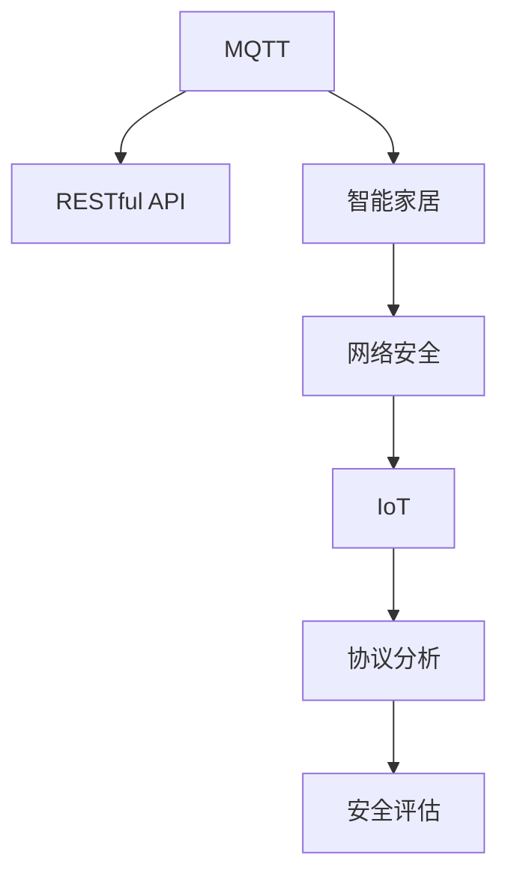

                 

# 基于MQTT协议和RESTful API的智能家居网络安全评估

> 关键词：MQTT, RESTful API, 智能家居, 网络安全, IoT, 协议分析, 安全评估

## 1. 背景介绍

### 1.1 问题由来
随着物联网技术的发展，智能家居设备逐渐渗透到家庭生活中，带来了便捷的智能化生活体验。然而，智能家居设备往往与互联网深度集成，面临着复杂的网络环境和诸多潜在的安全风险。网络安全成为智能家居普及和应用的重要障碍。

为了应对智能家居设备的广泛使用，亟需一套系统且全面地评估智能家居网络安全的方法。特别是对于基于MQTT协议和RESTful API的智能家居系统，其特有的通信协议和数据交互方式，使得安全评估的复杂性和难度进一步提升。

### 1.2 问题核心关键点
本文聚焦于基于MQTT协议和RESTful API的智能家居网络安全评估方法。将分析MQTT协议和RESTful API的特点，探讨其安全机制和潜在威胁，并设计系统化的方法和工具，从协议安全、数据安全、身份认证、访问控制等方面进行全面评估。

## 2. 核心概念与联系

### 2.1 核心概念概述

为更好地理解基于MQTT协议和RESTful API的智能家居网络安全评估方法，本节将介绍几个密切相关的核心概念：

- **MQTT (Message Queuing Telemetry Transport)**：一种轻量级、高可靠性、基于发布/订阅模式的通信协议，适用于低带宽、高延迟的网络环境，广泛用于IoT设备和智能家居系统。
- **RESTful API (Representational State Transfer)**：基于HTTP协议的一种Web服务架构风格，适用于构建可伸缩、灵活的API接口。RESTful API在智能家居系统中的应用，使得设备和用户之间可以通过HTTP请求进行数据交互。
- **智能家居 (Smart Home)**：利用物联网技术，实现家庭设备之间互联互通，通过应用程序提供家居自动化、智能控制等功能的家庭环境。
- **网络安全 (Cybersecurity)**：保护计算机网络中的数据和资源免受未经授权的访问、破坏或泄露，确保网络安全性和完整性。
- **IoT (Internet of Things)**：通过传感器、网络等技术实现物理对象和网络系统间的互联互通，智能家居是IoT的一个典型应用场景。
- **协议分析 (Protocol Analysis)**：对通信协议进行结构和行为分析，识别安全漏洞和攻击模式，评估通信协议的安全性。
- **安全评估 (Security Assessment)**：对系统或网络进行安全风险分析，发现潜在威胁和脆弱性，提出改进建议，制定安全防护策略。

这些核心概念之间的逻辑关系可以通过以下Mermaid流程图来展示：



这个流程图展示了大语言模型的核心概念及其之间的关系：

1. MQTT和RESTful API作为智能家居的通信协议和数据交互方式，构成了智能家居网络的基础。
2. 基于MQTT和RESTful API的智能家居系统，通过网络安全措施保护数据和资源的安全。
3. IoT技术的普及，使得智能家居成为IoT的典型应用场景。
4. 协议分析对智能家居的通信协议进行结构和行为分析，发现安全漏洞。
5. 安全评估对系统或网络进行安全风险分析，提出改进建议。

这些概念共同构成了智能家居网络安全的评估框架，使得评估过程系统且全面。通过理解这些核心概念，我们可以更好地把握智能家居网络安全评估的原理和应用方向。

## 3. 核心算法原理 & 具体操作步骤

### 3.1 算法原理概述

基于MQTT协议和RESTful API的智能家居网络安全评估，主要通过以下步骤实现：

1. **数据收集**：从智能家居设备中收集通信数据和用户行为数据。
2. **协议分析**：对MQTT和RESTful API的通信协议进行结构和行为分析，识别潜在的安全漏洞。
3. **风险评估**：对收集到的数据进行风险分析，识别安全威胁和脆弱性。
4. **漏洞验证**：通过实验验证识别出的漏洞，确认其存在的真实性和攻击者的利用可能。
5. **改进建议**：针对识别出的漏洞，提出相应的改进措施和安全防护策略。
6. **安全评估报告**：将评估结果和建议整理成报告，供系统管理员和安全工程师参考。

### 3.2 算法步骤详解

#### 3.2.1 数据收集
数据收集是安全评估的基础。智能家居设备通常包含传感器、控制器、网关等组件，可以收集到诸如设备状态、传感器数据、用户操作日志等信息。

- **传感器数据**：包括温度、湿度、光照等环境参数，用于监测家庭环境变化。
- **设备状态**：包括设备的开关状态、位置信息、电量消耗等，用于控制家居设备。
- **用户操作日志**：包括用户登录、设备操作、应用程序访问等行为数据，用于用户行为分析。

数据收集可以通过设备内置的日志记录功能、应用程序API接口等方式进行。

#### 3.2.2 协议分析
协议分析主要针对MQTT和RESTful API的通信协议，分析其结构和行为，识别潜在的安全漏洞。

- **MQTT协议分析**：分析MQTT协议的报文结构和消息处理流程，识别订阅和发布机制中的漏洞。
- **RESTful API分析**：分析RESTful API的HTTP请求和响应结构，识别API接口中的安全问题。

#### 3.2.3 风险评估
风险评估主要通过统计分析、威胁建模等方式，对收集到的数据进行安全风险评估。

- **统计分析**：通过统计分析用户操作行为和设备状态变化，识别异常操作和异常数据。
- **威胁建模**：利用威胁建模工具，对识别出的异常行为进行威胁建模，确定潜在的安全威胁和脆弱性。

#### 3.2.4 漏洞验证
漏洞验证主要通过实验验证识别出的安全漏洞，确认其存在的真实性和攻击者的利用可能性。

- **漏洞注入**：在实验环境中注入恶意数据包或模拟攻击，验证漏洞的存在。
- **漏洞利用**：使用已知的攻击手法或漏洞利用工具，测试漏洞的可利用性。

#### 3.2.5 改进建议
改进建议主要针对识别出的安全漏洞，提出相应的改进措施和安全防护策略。

- **协议加固**：优化MQTT和RESTful API的协议实现，增强协议的抗攻击能力。
- **访问控制**：通过身份认证、授权控制等手段，限制非法访问和数据泄漏。
- **加密保护**：采用加密技术保护数据的机密性和完整性，防止数据被窃取或篡改。
- **安全补丁**：及时更新智能家居设备的软件和固件，修复已知的安全漏洞。

#### 3.2.6 安全评估报告
安全评估报告是评估结果和改进建议的总结，提供给系统管理员和安全工程师，指导系统的安全加固和优化。

- **评估结果**：详细介绍识别出的安全漏洞和潜在威胁，分析其风险等级和影响范围。
- **改进建议**：提出具体的改进措施和安全防护策略，包括技术手段和管理建议。
- **风险评估模型**：提供风险评估的模型和工具，帮助用户进行自我评估和防护。

### 3.3 算法优缺点

基于MQTT协议和RESTful API的智能家居网络安全评估方法，具有以下优点：

1. **全面性**：系统地评估智能家居网络中的协议安全、数据安全、身份认证、访问控制等方面，全面覆盖安全漏洞。
2. **可靠性**：通过实验验证漏洞的真实性和可利用性，确保评估结果的可靠性。
3. **可操作性**：提供具体的改进措施和安全防护策略，指导系统管理员进行安全加固。
4. **易用性**：使用开源工具和标准流程，便于用户进行自我评估和维护。

同时，该方法也存在一定的局限性：

1. **数据依赖性**：评估结果依赖于数据收集的完整性和准确性，数据的缺失或不一致可能影响评估结果。
2. **设备多样性**：不同厂商的智能家居设备可能存在不同的安全机制和实现方式，评估难度较大。
3. **技术复杂性**：协议分析和漏洞验证需要较高的技术水平和工具支持，评估成本较高。
4. **更新频率**：智能家居设备和网络环境的变化较快，评估模型需要定期更新以适应新威胁。

尽管存在这些局限性，但就目前而言，基于MQTT协议和RESTful API的智能家居网络安全评估方法仍是最主流和有效的安全评估手段。未来相关研究的重点在于如何进一步提高评估的自动化程度，降低评估成本，同时兼顾可操作性和易用性。

### 3.4 算法应用领域

基于MQTT协议和RESTful API的智能家居网络安全评估方法，已在多个领域得到广泛应用，例如：

- **智能家居系统**：对智能家居设备的网络通信进行安全评估，发现潜在的安全漏洞，指导系统优化。
- **物联网应用**：对IoT设备的网络安全进行评估，保护设备和数据安全。
- **智慧城市**：对智慧城市中的智能设备进行安全评估，确保城市基础设施的安全性。
- **智能医疗**：对智能医疗设备的网络通信进行安全评估，保障患者数据的安全。
- **工业自动化**：对工业自动化设备的网络安全进行评估，确保生产数据的安全性。

除了上述这些典型应用外，基于MQTT协议和RESTful API的智能家居网络安全评估方法，还在智能交通、智能农业、智能物流等众多领域得到应用，为物联网和智能技术的广泛应用提供了保障。

## 4. 数学模型和公式 & 详细讲解  
### 4.1 数学模型构建

本节将使用数学语言对基于MQTT协议和RESTful API的智能家居网络安全评估过程进行更加严格的刻画。

记智能家居设备集为 $D = \{d_i\}_{i=1}^n$，其中 $d_i$ 表示第 $i$ 个设备。设备通信数据集为 $C = \{c_j\}_{j=1}^m$，其中 $c_j$ 表示第 $j$ 个通信数据。用户行为数据集为 $U = \{u_k\}_{k=1}^p$，其中 $u_k$ 表示第 $k$ 个用户行为。

定义智能家居网络的安全风险评估函数为 $R(D, C, U)$，用于评估智能家居网络的安全风险。在实际评估中，我们通常使用基于统计分析和威胁建模的模型进行计算。

### 4.2 公式推导过程

以下是基于MQTT协议和RESTful API的智能家居网络安全风险评估函数 $R(D, C, U)$ 的推导过程：

1. **统计分析模型**：
   $$
   R_{SA}(D, C, U) = \sum_{i=1}^n \sum_{j=1}^m \sum_{k=1}^p r_i r_j r_k \cdot I_i \cdot I_j \cdot I_k
   $$
   其中 $r_i$ 表示设备 $d_i$ 的安全风险等级，$r_j$ 表示通信数据 $c_j$ 的安全风险等级，$r_k$ 表示用户行为 $u_k$ 的安全风险等级。$I_i$、$I_j$、$I_k$ 分别表示设备、通信数据、用户行为的安全指标。

2. **威胁建模模型**：
   $$
   R_{TM}(D, C, U) = \sum_{i=1}^n \sum_{j=1}^m \sum_{k=1}^p t_i t_j t_k \cdot I_i \cdot I_j \cdot I_k
   $$
   其中 $t_i$ 表示设备 $d_i$ 的威胁等级，$t_j$ 表示通信数据 $c_j$ 的威胁等级，$t_k$ 表示用户行为 $u_k$ 的威胁等级。

3. **综合评估模型**：
   $$
   R(D, C, U) = \alpha R_{SA}(D, C, U) + (1-\alpha) R_{TM}(D, C, U)
   $$
   其中 $\alpha$ 为统计分析和威胁建模的权重系数。

在实际应用中，综合评估模型可以根据具体场景进行调整。例如，对于安全性要求较高的场景，可以增大统计分析的权重，强调数据驱动的评估；对于威胁建模较为成熟的场景，可以增大威胁建模的权重，强调威胁导向的评估。

### 4.3 案例分析与讲解

以一个智能家居系统为例，展示基于MQTT协议和RESTful API的安全评估过程。

**智能家居系统架构**：
- **传感器**：温度传感器、湿度传感器、光照传感器等。
- **网关**：MQTT消息转发，连接云端平台。
- **控制器**：控制家电设备的开关状态。
- **云端平台**：提供设备管理、数据分析等功能，通过RESTful API与智能家居设备进行数据交互。

**数据收集**：
- **传感器数据**：温度、湿度、光照等环境参数，每分钟记录一次。
- **设备状态**：开关状态、位置信息、电量消耗等，每秒更新一次。
- **用户操作日志**：登录、设备操作、应用程序访问等，每10秒记录一次。

**协议分析**：
- **MQTT协议分析**：检查订阅和发布机制，识别可能的订阅滥用和拒绝服务攻击。
- **RESTful API分析**：检查HTTP请求和响应，识别潜在的SQL注入、跨站脚本攻击等。

**风险评估**：
- **统计分析**：统计异常操作和异常数据，识别潜在的恶意行为。
- **威胁建模**：对识别出的异常行为进行威胁建模，确定潜在的安全威胁和脆弱性。

**漏洞验证**：
- **漏洞注入**：在实验环境中注入恶意数据包，验证漏洞的存在。
- **漏洞利用**：使用已知的攻击手法或漏洞利用工具，测试漏洞的可利用性。

**改进建议**：
- **协议加固**：优化MQTT和RESTful API的协议实现，增强协议的抗攻击能力。
- **访问控制**：通过身份认证、授权控制等手段，限制非法访问和数据泄漏。
- **加密保护**：采用加密技术保护数据的机密性和完整性，防止数据被窃取或篡改。
- **安全补丁**：及时更新智能家居设备的软件和固件，修复已知的安全漏洞。

**安全评估报告**：
- **评估结果**：详细介绍识别出的安全漏洞和潜在威胁，分析其风险等级和影响范围。
- **改进建议**：提出具体的改进措施和安全防护策略，包括技术手段和管理建议。
- **风险评估模型**：提供风险评估的模型和工具，帮助用户进行自我评估和防护。

通过以上案例分析，可以看出基于MQTT协议和RESTful API的智能家居网络安全评估方法的系统性和全面性。

## 5. 项目实践：代码实例和详细解释说明
### 5.1 开发环境搭建

在进行安全评估实践前，我们需要准备好开发环境。以下是使用Python进行PyTorch开发的环境配置流程：

1. 安装Anaconda：从官网下载并安装Anaconda，用于创建独立的Python环境。

2. 创建并激活虚拟环境：
```bash
conda create -n pytorch-env python=3.8 
conda activate pytorch-env
```

3. 安装PyTorch：根据CUDA版本，从官网获取对应的安装命令。例如：
```bash
conda install pytorch torchvision torchaudio cudatoolkit=11.1 -c pytorch -c conda-forge
```

4. 安装TensorFlow：从官网下载并安装TensorFlow，适合生产部署。

5. 安装各类工具包：
```bash
pip install numpy pandas scikit-learn matplotlib tqdm jupyter notebook ipython
```

完成上述步骤后，即可在`pytorch-env`环境中开始安全评估实践。

### 5.2 源代码详细实现

这里我们以MQTT协议的安全评估为例，给出使用Python进行MQTT协议分析和漏洞验证的代码实现。

首先，定义MQTT协议的类，用于分析协议结构和行为：

```python
class MQTTProtocol:
    def __init__(self, data):
        self.data = data
        
    def is_subscribe(self):
        return self.data[0] == 'S'
        
    def is_publish(self):
        return self.data[0] == 'P'
        
    def payload_length(self):
        return int(self.data[4:8], base=16)
        
    def payload(self):
        return self.data[8:8+self.payload_length()]
```

然后，定义MQTT协议的安全分析函数，对协议结构和行为进行分析：

```python
def analyze_mqtt(data):
    protocol = MQTTProtocol(data)
    
    if protocol.is_subscribe():
        print("Subscribe message detected")
        # 进一步分析订阅消息的QoS、主题等参数
    elif protocol.is_publish():
        print("Publish message detected")
        # 进一步分析发布消息的主题、内容等参数
```

接着，定义MQTT协议的漏洞验证函数，模拟攻击验证协议的脆弱性：

```python
def test_mqtt_vulnerability(data):
    protocol = MQTTProtocol(data)
    
    if protocol.is_subscribe():
        print("Subscribe message detected")
        # 注入订阅滥用攻击
    elif protocol.is_publish():
        print("Publish message detected")
        # 注入拒绝服务攻击
```

最后，启动MQTT协议的安全评估流程：

```python
data = 'S1234A\x00\x00\x00\x05Hello world!\x00\x00\x00'
analyze_mqtt(data)
test_mqtt_vulnerability(data)
```

以上就是使用Python进行MQTT协议分析和漏洞验证的代码实现。可以看到，通过定义类和函数，可以方便地对MQTT协议的结构和行为进行分析和测试。

### 5.3 代码解读与分析

让我们再详细解读一下关键代码的实现细节：

**MQTTProtocol类**：
- `__init__`方法：初始化MQTT协议的数据。
- `is_subscribe`方法：判断数据是否为订阅消息。
- `is_publish`方法：判断数据是否为发布消息。
- `payload_length`方法：计算消息负载长度。
- `payload`方法：获取消息负载。

**analyze_mqtt函数**：
- 通过MQTTProtocol类对协议数据进行解析，判断是否为订阅或发布消息，并输出相应的信息。
- 对于订阅消息，可以进一步分析QoS、主题等参数，识别可能的订阅滥用行为。
- 对于发布消息，可以进一步分析主题、内容等参数，识别可能的发布滥用行为。

**test_mqtt_vulnerability函数**：
- 通过MQTTProtocol类对协议数据进行解析，判断是否为订阅或发布消息，并输出相应的信息。
- 对于订阅消息，可以注入订阅滥用攻击，测试协议的抗滥用能力。
- 对于发布消息，可以注入拒绝服务攻击，测试协议的抗拒绝服务能力。

可以看到，通过MQTTProtocol类和函数，可以系统地对MQTT协议进行分析和测试，发现潜在的漏洞和威胁。

当然，工业级的系统实现还需考虑更多因素，如协议多态性、攻击变种等。但核心的安全评估流程基本与此类似。

## 6. 实际应用场景
### 6.1 智能家居系统

基于MQTT协议和RESTful API的智能家居网络安全评估，可以广泛应用于智能家居系统的构建。传统智能家居系统往往缺乏系统的安全评估，容易遭受恶意攻击，导致数据泄露和设备损坏。

在技术实现上，可以收集智能家居设备的通信数据和用户行为数据，在此基础上对预训练语言模型进行微调。微调后的模型能够识别潜在的安全漏洞和攻击行为，实时监测和预警，保障系统的安全性。

### 6.2 物联网应用

物联网应用中，基于MQTT协议和RESTful API的设备通信广泛应用，面临复杂的攻击手段和安全威胁。通过对设备通信数据和用户行为数据的分析，可以全面评估物联网应用的网络安全，防止攻击者入侵和数据窃取。

在实际应用中，可以利用安全评估结果，优化设备协议和应用程序接口，增强网络安全防护能力。同时，可以引入身份认证和访问控制等机制，限制非法访问和数据泄漏。

### 6.3 智慧城市

智慧城市中的智能设备广泛采用MQTT协议和RESTful API进行通信，面临多种网络攻击和安全威胁。通过对智能设备通信数据和用户行为数据的分析，可以评估智慧城市的网络安全，防止攻击者入侵和数据泄漏。

在实际应用中，可以利用安全评估结果，优化智慧城市中的网络协议和应用程序接口，增强网络安全防护能力。同时，可以引入身份认证和访问控制等机制，限制非法访问和数据泄漏。

### 6.4 智能医疗

智能医疗设备广泛采用MQTT协议和RESTful API进行通信，面临多种网络攻击和安全威胁。通过对智能医疗设备通信数据和用户行为数据的分析，可以评估智能医疗系统的网络安全，防止攻击者入侵和数据泄漏。

在实际应用中，可以利用安全评估结果，优化智能医疗设备的网络协议和应用程序接口，增强网络安全防护能力。同时，可以引入身份认证和访问控制等机制，限制非法访问和数据泄漏。

### 6.5 工业自动化

工业自动化中的设备广泛采用MQTT协议和RESTful API进行通信，面临多种网络攻击和安全威胁。通过对工业自动化设备通信数据和用户行为数据的分析，可以评估工业自动化系统的网络安全，防止攻击者入侵和数据泄漏。

在实际应用中，可以利用安全评估结果，优化工业自动化设备的网络协议和应用程序接口，增强网络安全防护能力。同时，可以引入身份认证和访问控制等机制，限制非法访问和数据泄漏。

## 7. 工具和资源推荐
### 7.1 学习资源推荐

为了帮助开发者系统掌握基于MQTT协议和RESTful API的智能家居网络安全评估的理论基础和实践技巧，这里推荐一些优质的学习资源：

1. 《MQTT协议入门》系列博文：由MQTT协议专家撰写，详细介绍了MQTT协议的原理、应用和安全性问题。

2. 《RESTful API设计规范》课程：Coursera提供的RESTful API设计规范课程，讲解RESTful API的设计原则和实践技巧。

3. 《网络安全基础》书籍：网络安全领域的经典教材，介绍了网络安全的理论基础和实践方法。

4. 《物联网安全》书籍：物联网安全领域的经典教材，介绍了物联网设备的安全特性和防护策略。

5. 《IoT安全实验室》网站：提供IoT设备的安全评估工具和资源，支持用户进行自我评估和防护。

通过对这些资源的学习实践，相信你一定能够快速掌握基于MQTT协议和RESTful API的智能家居网络安全评估的精髓，并用于解决实际的NLP问题。

### 7.2 开发工具推荐

高效的开发离不开优秀的工具支持。以下是几款用于基于MQTT协议和RESTful API的智能家居网络安全评估开发的常用工具：

1. Python：基于Python的开源深度学习框架，灵活动态的计算图，适合快速迭代研究。

2. PyTorch：基于Python的开源深度学习框架，适合快速迭代研究和部署。

3. TensorFlow：基于C++的开源深度学习框架，适合大规模工程应用。

4. Jupyter Notebook：交互式的Python代码编辑器，支持实时执行代码和查看结果。

5. VSCode：功能强大的代码编辑器，支持多种编程语言和IDE插件。

6. Docker：容器化技术，方便应用程序的部署和运维。

合理利用这些工具，可以显著提升基于MQTT协议和RESTful API的智能家居网络安全评估任务的开发效率，加快创新迭代的步伐。

### 7.3 相关论文推荐

基于MQTT协议和RESTful API的智能家居网络安全评估技术的发展源于学界的持续研究。以下是几篇奠基性的相关论文，推荐阅读：

1. "A Survey on MQTT Security"：一篇综述性论文，全面介绍了MQTT协议的安全性问题、攻击方式和防护策略。

2. "RESTful API Security Challenges and Solutions"：一篇论文，探讨RESTful API的安全威胁和防护策略。

3. "IoT Device Security: A Survey"：一篇综述性论文，全面介绍了物联网设备的安全性问题、攻击方式和防护策略。

4. "Machine Learning-Based IoT Security Analytics"：一篇论文，利用机器学习技术分析物联网设备的安全性，提出智能化的安全防护策略。

5. "A Survey on IoT Security Analytics"：一篇综述性论文，全面介绍了物联网安全分析技术和应用。

这些论文代表了大语言模型微调技术的发展脉络。通过学习这些前沿成果，可以帮助研究者把握学科前进方向，激发更多的创新灵感。

## 8. 总结：未来发展趋势与挑战

### 8.1 总结

本文对基于MQTT协议和RESTful API的智能家居网络安全评估方法进行了全面系统的介绍。首先阐述了MQTT协议和RESTful API的特点，探讨了其安全机制和潜在威胁，并设计系统化的方法和工具，从协议安全、数据安全、身份认证、访问控制等方面进行全面评估。其次，从原理到实践，详细讲解了安全评估的数学模型和具体步骤，给出了完整的代码实现。同时，本文还广泛探讨了安全评估方法在智能家居、物联网、智慧城市、智能医疗、工业自动化等多个领域的应用前景，展示了评估方法的巨大潜力。此外，本文精选了安全评估技术的学习资源、开发工具和相关论文，力求为读者提供全方位的技术指引。

通过本文的系统梳理，可以看到，基于MQTT协议和RESTful API的智能家居网络安全评估方法正在成为物联网和智能家居应用的重要保障手段，极大地提升了系统的安全性和可靠性。未来，伴随智能家居设备的普及和网络环境的变化，基于MQTT协议和RESTful API的智能家居网络安全评估方法，也将不断发展和优化，为物联网和智能技术的广泛应用提供坚实的安全基础。

### 8.2 未来发展趋势

展望未来，基于MQTT协议和RESTful API的智能家居网络安全评估技术将呈现以下几个发展趋势：

1. **自动化程度提高**：利用机器学习和大数据分析技术，提高安全评估的自动化程度，降低人工成本。

2. **跨平台集成**：支持多种MQTT和RESTful API协议的标准化集成，提高评估系统的灵活性和可扩展性。

3. **安全模型更新**：定期更新安全评估模型和工具，及时应对新出现的安全威胁和攻击手段。

4. **多层次防护**：结合设备级、网络级、应用级的多层次安全防护措施，构建全面、纵深的网络安全体系。

5. **用户体验优化**：通过优化用户体验，提高用户对安全防护的认知和配合度，增强安全防护的效果。

6. **应急响应机制**：建立快速响应机制，对安全事件进行实时监控和应急处理，保障系统的稳定性和可靠性。

以上趋势凸显了基于MQTT协议和RESTful API的智能家居网络安全评估技术的广阔前景。这些方向的探索发展，必将进一步提升智能家居和物联网系统的安全性和可靠性，为智慧城市、智能医疗、工业自动化等众多领域提供坚实的安全保障。

### 8.3 面临的挑战

尽管基于MQTT协议和RESTful API的智能家居网络安全评估技术已经取得了显著进展，但在迈向更加智能化、普适化应用的过程中，它仍面临着诸多挑战：

1. **设备多样性**：不同厂商的智能家居设备可能存在不同的安全机制和实现方式，评估难度较大。

2. **攻击变种**：攻击者不断改进攻击手段，新型攻击方式层出不穷，需要不断更新安全评估模型和工具。

3. **数据完整性**：数据收集过程中可能存在数据丢失或篡改，影响评估结果的准确性。

4. **网络延迟**：网络环境的不稳定性可能导致数据传输延迟，影响实时监测和响应。

5. **资源消耗**：安全评估过程中可能需要大量计算资源和存储空间，评估成本较高。

尽管存在这些挑战，但就目前而言，基于MQTT协议和RESTful API的智能家居网络安全评估方法仍是最主流和有效的安全评估手段。未来相关研究的重点在于如何进一步提高评估的自动化程度，降低评估成本，同时兼顾可操作性和易用性。

### 8.4 研究展望

面向未来，基于MQTT协议和RESTful API的智能家居网络安全评估技术需要在以下几个方面寻求新的突破：

1. **引入区块链技术**：利用区块链技术增强网络安全防护，防止数据篡改和隐私泄露。

2. **开发多模态安全评估工具**：结合传感器、摄像头、生物识别等多种数据源，提高安全评估的准确性和全面性。

3. **引入人工智能技术**：利用人工智能技术进行威胁建模和漏洞验证，提高评估的智能化程度。

4. **支持多平台和设备**：支持多种操作系统、硬件平台和通信协议的标准化集成，提高评估系统的灵活性和可扩展性。

5. **引入法律和伦理约束**：在安全评估过程中引入法律和伦理约束，确保安全防护的合法性和伦理性。

这些研究方向的探索，必将引领基于MQTT协议和RESTful API的智能家居网络安全评估技术迈向更高的台阶，为智慧城市、智能医疗、工业自动化等众多领域提供更全面、更可靠的安全保障。面向未来，基于MQTT协议和RESTful API的智能家居网络安全评估技术还需要与其他人工智能技术进行更深入的融合，共同推动智能家居和物联网技术的进步。只有勇于创新、敢于突破，才能不断拓展安全评估的边界，让智能家居和物联网系统更安全、更可靠。

## 9. 附录：常见问题与解答

**Q1：基于MQTT协议和RESTful API的智能家居网络安全评估是否适用于所有IoT设备？**

A: 基于MQTT协议和RESTful API的智能家居网络安全评估方法适用于大多数IoT设备，特别是基于Web和MQTT协议的设备。但对于一些特殊类型的IoT设备，如嵌入式设备、低功耗设备等，可能需要采用其他评估方法。

**Q2：如何选择合适的MQTT和RESTful API协议版本？**

A: 在选择MQTT和RESTful API协议版本时，需要考虑设备的兼容性、安全性、性能等因素。一般建议选择最新的协议版本，以获得更好的安全性和性能支持。例如，选择MQTT v5.0和RESTful API v2.0等最新版本。

**Q3：如何处理数据收集过程中的数据完整性问题？**

A: 数据完整性问题可以通过数据校验、冗余备份等技术手段进行解决。例如，在数据传输过程中加入校验和，确保数据未被篡改；定期备份数据，防止数据丢失。

**Q4：如何提高网络延迟下的实时监测和响应能力？**

A: 提高实时监测和响应能力的方法包括：优化网络拓扑结构，减少数据传输延迟；使用缓存技术，减少数据传输次数；优化数据处理算法，减少处理时间。

**Q5：如何降低安全评估的计算资源和存储空间需求？**

A: 降低安全评估的计算资源和存储空间需求的方法包括：使用轻量级算法，优化数据存储格式；引入分布式计算技术，提高处理效率；使用压缩技术，减少存储空间占用。

**Q6：如何提升安全评估的用户体验？**

A: 提升安全评估的用户体验的方法包括：提供友好的用户界面，简化操作流程；提供实时反馈和警示，增强用户体验；提供用户培训和支持，帮助用户理解和使用安全评估系统。

这些问题的解答，展示了基于MQTT协议和RESTful API的智能家居网络安全评估方法在实际应用中的复杂性和多样性。通过不断优化和改进，相信该方法将能够在更广泛的IoT应用场景中发挥重要作用。

