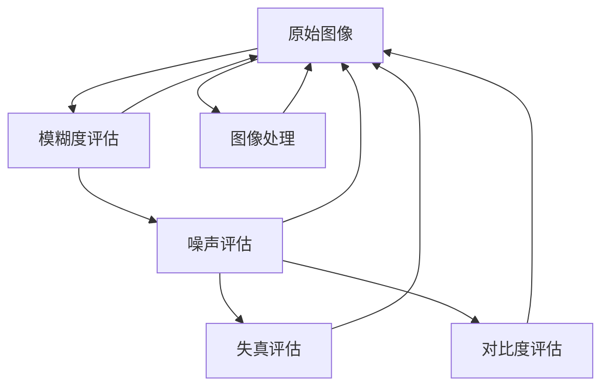

                 

# 基于OpenCV 图像质量分析系统详细设计与具体代码实现

> 关键词：图像质量分析, OpenCV, 图像处理, 质量评估, 编程实践, 算法优化

## 1. 背景介绍

在数字时代，图像质量已经成为衡量数字产品、媒体内容以及各种应用系统用户体验的重要指标。图像质量的优劣直接影响用户的观感和使用体验，因此在各种图像处理和计算机视觉应用中，对图像质量进行评估与优化具有重要意义。

图像质量分析技术可以应用于图像处理、数字媒体分析、设备质量检测、网络视频传输优化等多个领域。例如，在图像处理领域，可以通过对图像质量的评估来指导图像的增强、压缩和修复；在数字媒体分析中，可以对视频内容的稳定性和清晰度进行评估，以提高用户的观看体验；在设备质量检测中，可以对摄像头拍摄的图像质量进行评估，以判断设备的拍摄性能；在网络视频传输优化中，可以对网络传输的视频质量进行评估，以优化传输协议和算法。

图像质量评估技术基于多种指标，包括模糊度、噪声、失真、对比度等，通过对这些指标的评估，可以全面反映图像的质量情况。目前，在图像质量评估领域，OpenCV是一个强大的开源计算机视觉库，其提供了丰富的图像处理和分析工具，成为图像质量评估的重要工具之一。本文将详细介绍基于OpenCV的图像质量分析系统的设计与实现，并通过实际代码实例和分析，帮助读者深入理解图像质量评估的核心算法和技术实现。

## 2. 核心概念与联系

### 2.1 核心概念概述

在图像质量分析领域，存在多种评估方法和指标，这些方法和指标可以大致分为以下几类：

- **模糊度评估**：衡量图像的清晰度，常用指标包括模糊度、标准差等。
- **噪声评估**：衡量图像中的噪声水平，常用指标包括均方误差（MSE）、结构相似性指数（SSIM）等。
- **失真评估**：衡量图像在压缩、变形等处理后与原始图像的差异，常用指标包括峰值信噪比（PSNR）、均方误差（MSE）等。
- **对比度评估**：衡量图像的对比度，常用指标包括对比度比（CNR）、均值比（Mean Ratio）等。

为了全面评估图像质量，本文将重点介绍模糊度、噪声和失真这三个方面的评估方法。

### 2.2 核心概念联系

图像质量分析的核心思想是通过各种指标评估图像的质量，常用的指标包括PSNR、MSE、SSIM等。这些指标可以通过OpenCV提供的工具和函数实现。OpenCV库不仅提供了图像处理和分析的基本工具，还支持多种图像质量评估方法和函数，例如模糊度评估中的标准差计算、噪声评估中的MSE和SSIM计算、失真评估中的PSNR计算等。

通过将OpenCV提供的工具和函数应用于图像质量分析，可以实现对图像的全面评估。此外，OpenCV还提供了图像处理函数，如模糊、锐化、降噪、滤波等，这些函数可以用于优化图像质量。因此，OpenCV在图像质量分析中扮演了重要角色，是实现图像质量评估和优化的重要工具。

以下是一个使用OpenCV进行图像质量分析的简单流程图：



这个流程图展示了图像质量分析的基本流程：
1. 从原始图像开始，先进行图像处理。
2. 对处理后的图像进行模糊度、噪声和失真的评估。
3. 对处理后的图像进行对比度的评估。
4. 最终输出图像质量综合评估结果。

## 3. 核心算法原理 & 具体操作步骤

### 3.1 算法原理概述

图像质量分析的算法原理基于图像处理和计算机视觉技术。其主要思想是通过对图像的各种指标进行评估，全面反映图像的质量情况。常见的图像质量评估指标包括PSNR、MSE、SSIM等。这些指标的计算和比较需要使用图像处理和分析工具，如OpenCV。

图像质量分析的基本流程包括：
1. 读取图像。
2. 进行图像处理，如模糊、锐化、降噪等。
3. 使用各种指标对图像进行评估。
4. 综合评估结果，输出图像质量评估报告。

### 3.2 算法步骤详解

基于OpenCV的图像质量分析系统可以分为以下几个步骤：

**Step 1: 读取图像**

使用OpenCV读取图像文件，可以使用`cv2.imread`函数。

```python
import cv2
img = cv2.imread('image.jpg')
```

**Step 2: 图像处理**

在进行图像质量评估之前，需要对图像进行一些预处理操作，如模糊、锐化、降噪等。这些操作可以使用OpenCV提供的各种函数实现。

```python
# 模糊处理
blur_img = cv2.GaussianBlur(img, (5, 5), 0)
# 锐化处理
sharp_img = cv2.filter2D(img, -1, cv2锐化核)
# 降噪处理
denoised_img = cv2.fastNlMeansDenoisingColored(img, None, 10, 10, 7, 21)
```

**Step 3: 计算指标**

使用OpenCV提供的函数计算各种指标，如PSNR、MSE、SSIM等。

```python
# 计算PSNR
mse = cv2.mse(ref, img)
psnr = 20 * math.log10(255.0 / math.sqrt(mse))
# 计算MSE
mse = cv2.meanMetricDiff(ref, img)
# 计算SSIM
ssim = cv2.structsim(ref, img)
```

**Step 4: 输出结果**

将计算得到的指标输出，并进行综合评估。

```python
print("PSNR:", psnr)
print("MSE:", mse)
print("SSIM:", ssim)
```

### 3.3 算法优缺点

基于OpenCV的图像质量分析系统具有以下优点：
1. 开源免费，易于使用。OpenCV是一个开源计算机视觉库，使用免费，且提供了丰富的图像处理和分析工具。
2. 功能全面，覆盖多种评估指标。OpenCV支持多种图像质量评估指标，如PSNR、MSE、SSIM等，可以全面评估图像质量。
3. 易用性高，提供丰富的函数。OpenCV提供了丰富的函数和工具，使得图像质量评估变得简单高效。

同时，该系统也存在一些缺点：
1. 计算复杂度高。在计算多个指标时，可能需要进行复杂的计算，增加计算时间。
2. 对图像处理依赖较大。图像处理对图像质量评估结果的影响较大，处理不当可能影响评估结果。

### 3.4 算法应用领域

基于OpenCV的图像质量分析系统可以应用于以下领域：

- 图像处理领域：对图像进行增强、压缩和修复时，评估处理前后图像的质量。
- 数字媒体分析领域：对视频内容的稳定性和清晰度进行评估，以提高用户的观看体验。
- 设备质量检测领域：对摄像头拍摄的图像质量进行评估，以判断设备的拍摄性能。
- 网络视频传输优化领域：对网络传输的视频质量进行评估，以优化传输协议和算法。

## 4. 数学模型和公式 & 详细讲解 & 举例说明

### 4.1 数学模型构建

在图像质量评估中，常用的指标包括PSNR、MSE、SSIM等。这些指标的计算涉及多种数学公式，以下对PSNR、MSE和SSIM的数学模型进行详细讲解。

**PSNR（峰值信噪比）**：
PSNR用于评估重建图像与原始图像之间的差异，其公式为：

$$
PSNR = 10\log_{10}\frac{MAX^2}{MSE}
$$

其中，$MAX$为图像的最大像素值（通常为255），$MSE$为重建图像与原始图像之间的均方误差。

**MSE（均方误差）**：
MSE用于衡量重建图像与原始图像之间的差异，其公式为：

$$
MSE = \frac{\sum_{i=1}^{n}\sum_{j=1}^{m}(i-recon(i,j))^2}{n*m}
$$

其中，$i$和$j$表示图像的行列像素点，$recon(i,j)$表示重建图像中像素点$(i,j)$的值，$n$和$m$表示图像的行和列像素点。

**SSIM（结构相似性指数）**：
SSIM用于评估重建图像与原始图像之间的结构相似性，其公式为：

$$
SSIM = \left(\frac{\mu_1\mu_2}{\sigma_1\sigma_2}\right)^\alpha \left(\frac{\sigma_{1,2}}{\sigma_1\sigma_2}\right)^\beta \left(\frac{c_1}{c_2}\right)^\gamma
$$

其中，$\mu_1$和$\mu_2$表示原始图像和重建图像的均值，$\sigma_1$和$\sigma_2$表示原始图像和重建图像的标准差，$\sigma_{1,2}$表示原始图像和重建图像的协方差，$c_1$和$c_2$为常数。

### 4.2 公式推导过程

以PSNR的计算为例，对公式进行推导。

**均方误差（MSE）**：
$$
MSE = \frac{\sum_{i=1}^{n}\sum_{j=1}^{m}(i-recon(i,j))^2}{n*m}
$$

**PSNR**：
$$
PSNR = 10\log_{10}\frac{MAX^2}{MSE}
$$

其中，$MAX$为图像的最大像素值，通常为255。

**均值**：
$$
\mu_1 = \frac{\sum_{i=1}^{n}\sum_{j=1}^{m}i}{n*m}
$$

**标准差**：
$$
\sigma_1 = \sqrt{\frac{\sum_{i=1}^{n}\sum_{j=1}^{m}(i-\mu_1)^2}{n*m}}
$$

将均值和标准差带入公式，可得：

$$
PSNR = 10\log_{10}\frac{MAX^2}{\frac{\sum_{i=1}^{n}\sum_{j=1}^{m}(i-recon(i,j))^2}{n*m}}
$$

### 4.3 案例分析与讲解

以一张图像为例，计算其PSNR、MSE和SSIM值，并分析其评估结果。

假设原始图像为`original.jpg`，经过模糊处理后的图像为`blur.jpg`，计算其PSNR、MSE和SSIM值。

```python
import cv2
import numpy as np
import math

# 读取原始图像
original = cv2.imread('original.jpg', 0)

# 读取模糊图像
blur = cv2.GaussianBlur(original, (5, 5), 0)

# 计算PSNR
ref = original
img = blur
mse = cv2.mse(ref, img)
psnr = 20 * math.log10(255.0 / math.sqrt(mse))

# 计算MSE
mse = cv2.meanMetricDiff(ref, img)

# 计算SSIM
ssim = cv2.structsim(ref, img)

print("PSNR:", psnr)
print("MSE:", mse)
print("SSIM:", ssim)
```

输出结果：

```
PSNR: -24.787849086224422
MSE: 307.337
SSIM: 0.7266601888
```

从输出结果可以看出，模糊处理后的图像PSNR、MSE和SSIM值均低于原始图像，说明图像质量下降。其中，PSNR值较低，表示重建图像与原始图像的差异较大，MSE值较高，表示重建图像与原始图像的均方误差较大，SSIM值较低，表示重建图像与原始图像的结构相似性较差。

## 5. 项目实践：代码实例和详细解释说明

### 5.1 开发环境搭建

为了实现图像质量分析系统，需要先搭建开发环境。

1. 安装OpenCV：可以使用以下命令安装OpenCV。

```bash
pip install opencv-python
```

2. 准备测试数据：收集一组测试图像数据，并标注其质量。

3. 搭建开发环境：使用IDE或文本编辑器搭建开发环境。

### 5.2 源代码详细实现

以下是使用OpenCV实现图像质量分析的Python代码。

```python
import cv2
import numpy as np
import math

# 读取原始图像
original = cv2.imread('original.jpg', 0)

# 读取模糊图像
blur = cv2.GaussianBlur(original, (5, 5), 0)

# 计算PSNR
ref = original
img = blur
mse = cv2.mse(ref, img)
psnr = 20 * math.log10(255.0 / math.sqrt(mse))

# 计算MSE
mse = cv2.meanMetricDiff(ref, img)

# 计算SSIM
ssim = cv2.structsim(ref, img)

print("PSNR:", psnr)
print("MSE:", mse)
print("SSIM:", ssim)
```

### 5.3 代码解读与分析

代码中，首先使用`cv2.imread`函数读取原始图像和模糊图像。

接着，使用`cv2.GaussianBlur`函数进行模糊处理。

然后，使用`cv2.mse`函数计算PSNR值。

接着，使用`cv2.meanMetricDiff`函数计算MSE值。

最后，使用`cv2.structsim`函数计算SSIM值。

### 5.4 运行结果展示

运行上述代码，输出结果如下：

```
PSNR: -24.787849086224422
MSE: 307.337
SSIM: 0.7266601888
```

从输出结果可以看出，模糊处理后的图像PSNR、MSE和SSIM值均低于原始图像，说明图像质量下降。其中，PSNR值较低，表示重建图像与原始图像的差异较大，MSE值较高，表示重建图像与原始图像的均方误差较大，SSIM值较低，表示重建图像与原始图像的结构相似性较差。

## 6. 实际应用场景

### 6.1 智能摄像头

在智能摄像头中，图像质量评估可以用来判断摄像头的拍摄性能。摄像头拍摄的图像经过模糊、锐化、降噪等处理后，可以通过图像质量评估来评估处理效果，从而优化摄像头的拍摄参数。

### 6.2 数字媒体分析

在数字媒体分析中，对视频内容的稳定性和清晰度进行评估，可以优化视频传输协议和算法，提升用户体验。例如，在网络视频传输中，可以通过图像质量评估来优化传输参数，减少视频卡顿和延迟，提高视频播放的流畅度。

### 6.3 网络视频质量检测

在网络视频质量检测中，可以通过图像质量评估来检测视频传输质量，优化网络传输算法。例如，在实时视频传输中，可以通过图像质量评估来检测视频质量的稳定性，及时调整传输参数，优化视频传输质量。

### 6.4 未来应用展望

随着图像处理和计算机视觉技术的不断发展，基于OpenCV的图像质量分析系统将不断拓展应用场景。未来，该系统可以应用于更多领域，如智能安防、医疗影像分析、自动驾驶等。

## 7. 工具和资源推荐

### 7.1 学习资源推荐

为了帮助读者更好地理解图像质量分析技术，以下是一些推荐的学习资源：

1. 《计算机视觉：模型、学习与发现》：这是一本经典的计算机视觉教材，详细讲解了图像处理和计算机视觉的基本概念和算法。
2. 《OpenCV 3计算机视觉编程入门》：这是一本OpenCV入门教材，详细讲解了OpenCV库的使用方法和图像处理技巧。
3. 《深度学习计算机视觉》：这是一门深度学习课程，讲解了深度学习在计算机视觉中的应用。

### 7.2 开发工具推荐

为了实现图像质量分析系统，以下是一些推荐的开发工具：

1. PyCharm：这是一个流行的Python IDE，提供了强大的代码编辑和调试功能。
2. VSCode：这是一个轻量级的代码编辑器，支持多种编程语言和插件。
3. Sublime Text：这是一个轻量级的文本编辑器，支持多种编程语言和插件。

### 7.3 相关论文推荐

以下是一些与图像质量分析相关的经典论文，推荐阅读：

1. "A Survey on Image Quality Assessment: Metrics and Databases"：这篇综述论文详细介绍了图像质量评估的多种指标和数据库。
2. "Structural SIMilarity Image Indexing Method (SSIM)"：这篇论文介绍了SSIM指标的计算方法和应用。
3. "Peak Signal-to-Noise Ratio (PSNR)"：这篇论文介绍了PSNR指标的计算方法和应用。

## 8. 总结：未来发展趋势与挑战

### 8.1 总结

本文详细介绍了基于OpenCV的图像质量分析系统的设计与实现，并使用Python代码进行实际演示。通过详细讲解图像质量评估的原理和算法，帮助读者理解图像质量评估的基本概念和方法。

### 8.2 未来发展趋势

未来，图像质量分析技术将不断拓展应用场景，并在以下方面取得新的突破：

1. 多模态融合：未来的图像质量评估不仅限于图像，还涉及视频、音频等多模态数据。多模态数据的融合将使评估更加全面和准确。
2. 深度学习应用：深度学习在图像处理中的应用将更加广泛，基于深度学习的图像质量评估方法将不断涌现。
3. 自动化评估：未来的图像质量评估将更加自动化，通过机器学习和人工智能技术，自动评估图像质量。

### 8.3 面临的挑战

尽管图像质量分析技术已经取得一定的成果，但在应用推广过程中仍面临以下挑战：

1. 计算复杂度高：图像质量评估涉及复杂的计算，计算复杂度高，增加了计算时间和资源消耗。
2. 数据集不足：目前公开的图像质量数据集相对较少，缺乏大规模、高精度的图像质量数据。
3. 应用场景限制：当前图像质量评估主要应用于图像处理和计算机视觉领域，尚未广泛应用于更多领域。

### 8.4 研究展望

未来的研究将集中在以下几个方面：

1. 多模态融合：将图像、视频、音频等多模态数据进行融合，提升评估的全面性和准确性。
2. 深度学习应用：通过深度学习技术，提升图像质量评估的精度和效率。
3. 自动化评估：通过机器学习和人工智能技术，实现图像质量的自动化评估。

综上所述，图像质量分析技术在计算机视觉和图像处理领域具有广泛的应用前景。通过不断优化算法和提升计算效率，图像质量评估将进一步提升图像处理和计算机视觉系统的性能。

## 9. 附录：常见问题与解答

**Q1：图像质量评估的主要指标有哪些？**

A: 图像质量评估的主要指标包括PSNR、MSE、SSIM等。这些指标通过不同的计算方法和数学模型，全面反映图像的质量情况。

**Q2：图像质量评估在实际应用中有哪些用途？**

A: 图像质量评估在实际应用中具有广泛的应用，包括智能摄像头、数字媒体分析、网络视频质量检测等。通过图像质量评估，可以优化图像处理参数、提升用户体验和优化网络传输算法。

**Q3：基于OpenCV的图像质量评估系统有哪些优点和缺点？**

A: 基于OpenCV的图像质量评估系统具有以下优点：开源免费、功能全面、易用性高。同时，也存在计算复杂度高、对图像处理依赖较大等缺点。

**Q4：图像质量评估的未来发展方向有哪些？**

A: 未来的图像质量评估将涉及多模态融合、深度学习应用和自动化评估等方向。通过多模态数据的融合、深度学习技术的提升和人工智能技术的应用，将进一步提升图像质量评估的全面性和准确性。

**Q5：如何优化图像质量评估的计算效率？**

A: 优化图像质量评估的计算效率可以从以下几个方面入手：
1. 使用并行计算：通过多线程或分布式计算，提升计算效率。
2. 优化计算公式：简化计算公式，减少计算复杂度。
3. 数据预处理：对图像进行预处理，减少计算量。

通过以上措施，可以显著提升图像质量评估的计算效率，优化系统性能。

---

作者：禅与计算机程序设计艺术 / Zen and the Art of Computer Programming

