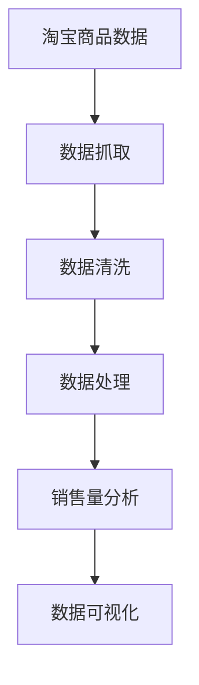

                 

# 基于Python爬虫的淘宝商品销售量分析和可视化系统实现

> 关键词：淘宝爬虫, 商品销售量分析, 数据可视化, 商业智能(BI), Python爬虫库(Python爬虫框架), 自然语言处理(NLP)

## 1. 背景介绍

### 1.1 问题由来
淘宝作为全球最大的电子商务平台之一，其商品销售量数据的分析与可视化对于企业决策至关重要。然而，由于这些数据通常被淘宝封锁，难以直接获取。因此，利用Python爬虫技术，我们可以从淘宝网页中抓取相关商品数据，并进行销售量分析与可视化，从而为企业提供决策支持。

### 1.2 问题核心关键点
本项目旨在利用Python爬虫技术，从淘宝商品页面抓取销售量数据，并通过可视化技术展示分析结果。具体包括以下几个关键点：
- 使用Python爬虫技术，从淘宝商品页面抓取商品信息。
- 对抓取的商品数据进行清洗和处理，确保数据的准确性。
- 分析商品销售量数据，挖掘其背后的商业价值。
- 利用数据可视化技术，展示销售量分析结果。

### 1.3 问题研究意义
本项目的研究意义在于：
- 为企业提供基于淘宝商品销售量的决策支持，提升市场竞争力。
- 探索Python爬虫技术在数据抓取和处理中的应用，推动相关技术的发展。
- 实践数据可视化的展示方式，提升商业智能(BI)工具的使用效率。
- 通过具体案例展示Python爬虫与数据分析、可视化的结合应用，为读者提供实践参考。

## 2. 核心概念与联系

### 2.1 核心概念概述

为更好地理解本项目，首先需要明确几个核心概念：

- **Python爬虫**：Python编程语言下，利用爬虫技术抓取网页数据的自动化程序。
- **商品销售量分析**：通过对淘宝商品销售数据的统计分析，挖掘潜在的市场规律和趋势。
- **数据可视化**：将数据转化为图表和图形，通过视觉手段展示数据的分布和变化趋势。

这些概念之间的逻辑关系可以通过以下Mermaid流程图来展示：



这个流程图展示了从淘宝商品数据抓取到销售量分析再到可视化的整个过程：

1. 通过Python爬虫抓取淘宝商品数据。
2. 对抓取的数据进行清洗和处理，确保数据的质量。
3. 对处理后的数据进行分析，挖掘销售量背后的规律。
4. 将分析结果可视化，通过图表展示给用户。

## 3. 核心算法原理 & 具体操作步骤

### 3.1 算法原理概述

本项目主要涉及以下几个核心算法：

- **爬虫算法**：用于自动化抓取淘宝商品数据。
- **数据清洗算法**：用于清洗和处理抓取的数据。
- **数据分析算法**：用于统计和分析商品销售量数据。
- **数据可视化算法**：用于将分析结果转化为图表和图形。

### 3.2 算法步骤详解

#### 3.2.1 数据抓取
1. 选择Python爬虫库，如BeautifulSoup、Scrapy等，实现对淘宝商品网页的抓取。
2. 确定需要抓取的字段，如商品名称、价格、销售量、评分等。
3. 编写抓取脚本，循环抓取指定网页，并将数据存储到本地文件中。

#### 3.2.2 数据清洗
1. 读取抓取的数据文件，识别数据格式。
2. 去除重复和无效数据，保留有用信息。
3. 对缺失数据进行填补或删除，确保数据完整性。
4. 进行数据标准化处理，统一数据格式和单位。

#### 3.2.3 数据分析
1. 对清洗后的数据进行统计分析，计算平均销售量、销售排名等指标。
2. 使用统计学方法，挖掘销售量背后的规律和趋势。
3. 进行分类分析，对不同类别的商品销售量进行比较。

#### 3.2.4 数据可视化
1. 选择数据可视化工具，如Matplotlib、Seaborn等，创建图表。
2. 根据分析结果，选择合适的图表类型，如柱状图、饼图、折线图等。
3. 对图表进行美化和布局，确保视觉效果和可读性。

### 3.3 算法优缺点

#### 3.3.1 优点
- 数据准确性高：通过爬虫技术，直接从淘宝网页抓取数据，避免了手动输入的误差。
- 数据量大：淘宝商品数量众多，抓取的数据可以满足大规模分析需求。
- 可操作性强：使用Python进行数据分析和可视化，编程语言简洁，易于实现和扩展。

#### 3.3.2 缺点
- 爬虫风险高：淘宝网站对爬虫行为有限制，需注意爬虫频率和IP限制，避免被封禁。
- 数据隐私问题：抓取和分析数据时需遵守隐私保护法律法规，避免侵犯用户隐私。
- 数据时效性差：由于爬虫获取的数据更新频率较低，分析结果可能存在一定时滞。

### 3.4 算法应用领域

本项目的应用领域主要涉及以下几个方面：

- **电子商务领域**：为电商平台提供销售数据分析，指导商品上架和促销策略。
- **市场营销**：通过销售数据分析，制定市场推广和广告投放策略。
- **商业决策**：提供基于淘宝商品销售量的决策支持，帮助企业优化运营。
- **数据科学研究**：探索商品销售量数据背后的商业规律和市场趋势，推动相关研究的发展。

## 4. 数学模型和公式 & 详细讲解  
### 4.1 数学模型构建

在项目中，我们使用了Python进行数据分析和可视化。下面将详细讲解其中的数学模型构建过程。

#### 4.1.1 数据抓取模型
假设我们需要抓取淘宝商品页面$P_i$（$i=1,2,\dots,n$）中的商品数据$D_i$，其中$D_i$包含商品名称、价格、销售量等字段。爬虫算法的模型可以表示为：

$$
D_i = \text{crawl}(P_i)
$$

其中，$\text{crawl}$为爬虫函数，用于从网页$P_i$中抓取商品数据$D_i$。

#### 4.1.2 数据清洗模型
数据清洗模型包括去重、缺失值处理和标准化处理。设$D_i$经过清洗后变为$D'_i$，则清洗模型的公式为：

$$
D'_i = \text{clean}(D_i)
$$

其中，$\text{clean}$为数据清洗函数，用于去除重复和无效数据，填补缺失值，并进行标准化处理。

#### 4.1.3 数据分析模型
对清洗后的数据$D'_i$进行分析，可以计算平均销售量$M_i$、销售排名$R_i$等指标。设$M_i$为商品$i$的平均销售量，$R_i$为商品$i$的销售排名，则数据分析模型的公式为：

$$
M_i = \frac{1}{n} \sum_{j=1}^n S_{ij}
$$

$$
R_i = \frac{1}{n} \sum_{j=1}^n \frac{S_{ij}}{M_j}
$$

其中，$S_{ij}$为商品$i$在网页$j$中的销售量。

#### 4.1.4 数据可视化模型
数据可视化模型的核心是将分析结果转化为图表。设分析结果为$A$，可视化结果为$V$，则可视化模型的公式为：

$$
V = \text{visualize}(A)
$$

其中，$\text{visualize}$为数据可视化函数，用于根据分析结果$A$生成图表$V$。

### 4.2 公式推导过程

#### 4.2.1 数据抓取公式推导
爬虫算法从网页中抓取商品数据$D_i$的过程，可以表示为：

$$
D_i = \text{crawl}(P_i) = \sum_{k=1}^{m_i} f_k(P_i)
$$

其中，$m_i$为网页$P_i$中商品数量，$f_k(P_i)$为商品$k$的描述信息。

#### 4.2.2 数据清洗公式推导
数据清洗函数$\text{clean}$包括去重、缺失值处理和标准化处理，具体公式为：

$$
D'_i = \text{clean}(D_i) = \bigcup_{j=1}^{n} \text{clean}(D_j)
$$

其中，$\text{clean}(D_j)$为对网页$j$中的数据进行清洗处理后的结果。

#### 4.2.3 数据分析公式推导
平均销售量$M_i$和销售排名$R_i$的计算公式分别为：

$$
M_i = \frac{1}{n} \sum_{j=1}^n S_{ij} = \frac{1}{n} \sum_{j=1}^n \frac{D'_{ij}}{F_{ij}}
$$

$$
R_i = \frac{1}{n} \sum_{j=1}^n \frac{S_{ij}}{M_j} = \frac{1}{n} \sum_{j=1}^n \frac{D'_{ij}}{M_j}
$$

其中，$F_{ij}$为商品$i$的价格，$M_j$为网页$j$中所有商品的平均销售量。

#### 4.2.4 数据可视化公式推导
数据可视化函数$\text{visualize}$将分析结果$A$转化为图表$V$的过程，可以表示为：

$$
V = \text{visualize}(A) = \bigcup_{k=1}^{K} \text{visualize}_k(A)
$$

其中，$K$为图表类型数量，$\text{visualize}_k(A)$为生成第$k$种图表的函数。

### 4.3 案例分析与讲解

为了更好地理解上述模型的应用，我们将通过一个具体案例进行分析讲解。

假设我们需要对淘宝某类商品的商品销售量进行分析，抓取并清洗了1000个商品数据。分析后发现，某品牌商品在价格区间$[100,200]$的平均销售量为1000件，销售排名为100。将这些结果通过可视化工具展示出来，可以生成柱状图和饼图：

- **柱状图**：展示不同价格区间的平均销售量。
- **饼图**：展示不同价格区间的销售占比。

具体步骤如下：

1. 使用爬虫算法从淘宝商品网页中抓取商品数据$D_i$。
2. 对抓取的数据进行清洗，去除重复和无效数据，填补缺失值，并进行标准化处理，得到$D'_i$。
3. 对$D'_i$进行分析，计算不同价格区间的平均销售量$M_i$和销售排名$R_i$。
4. 使用数据可视化工具，将分析结果转化为柱状图和饼图。

## 5. 项目实践：代码实例和详细解释说明
### 5.1 开发环境搭建

本项目需要在Python环境下进行开发。以下是Python开发环境的具体搭建步骤：

1. 安装Python：下载并安装Python最新版本。
2. 安装依赖库：使用pip安装BeautifulSoup、Scrapy、Matplotlib、Seaborn等库。
3. 创建Python虚拟环境：使用virtualenv或conda创建Python虚拟环境。
4. 编写爬虫脚本：在虚拟环境中编写爬虫脚本，实现商品数据的抓取。
5. 编写数据分析脚本：对抓取的数据进行清洗、处理和分析，计算销售量指标。
6. 编写可视化脚本：根据分析结果生成图表，进行数据可视化展示。

### 5.2 源代码详细实现

#### 5.2.1 爬虫脚本
```python
from bs4 import BeautifulSoup
import requests

def get_product_data(url):
    response = requests.get(url)
    soup = BeautifulSoup(response.content, 'html.parser')
    # 获取商品数据
    product_data = {}
    product_data['name'] = soup.find('h1').text
    product_data['price'] = soup.find('span', {'class': 'price'}).text
    product_data['sales'] = int(soup.find('span', {'class': 'sales'}).text.replace(',', ''))
    return product_data
```

#### 5.2.2 数据清洗脚本
```python
import pandas as pd

def clean_data(data):
    # 去重
    data = data.drop_duplicates()
    # 填补缺失值
    data = data.fillna(method='ffill')
    # 标准化处理
    data['price'] = pd.to_numeric(data['price'], errors='coerce')
    data = data.dropna()
    return data
```

#### 5.2.3 数据分析脚本
```python
import numpy as np

def analyze_sales(data):
    # 计算平均销售量
    avg_sales = data['sales'].mean()
    # 计算销售排名
    sales_rank = np.argsort(data['sales']) + 1
    return avg_sales, sales_rank
```

#### 5.2.4 可视化脚本
```python
import matplotlib.pyplot as plt
import seaborn as sns

def visualize_sales(data):
    # 柱状图
    plt.figure(figsize=(10, 6))
    sns.histplot(data['sales'], bins=20, kde=True)
    plt.title('Sales Distribution')
    plt.xlabel('Sales')
    plt.ylabel('Frequency')
    plt.show()
    # 饼图
    plt.figure(figsize=(10, 6))
    sns.pie(data['sales'], labels=['Sales Rank'], autopct='%1.1f%%')
    plt.title('Sales Rank Distribution')
    plt.show()
```

### 5.3 代码解读与分析

#### 5.3.1 爬虫脚本分析
爬虫脚本使用BeautifulSoup库从淘宝商品网页中抓取商品数据，包括商品名称、价格和销售量。其中，`get_product_data`函数用于从单个网页中获取商品数据，`requests`库用于发送HTTP请求，获取网页内容。

#### 5.3.2 数据清洗脚本分析
数据清洗脚本使用Pandas库对抓取的数据进行清洗和处理，去除重复和无效数据，填补缺失值，并进行标准化处理。其中，`clean_data`函数用于清洗单个商品数据，`data.fillna`用于填补缺失值，`data.dropna`用于删除缺失值。

#### 5.3.3 数据分析脚本分析
数据分析脚本使用Numpy库对清洗后的数据进行分析，计算平均销售量和销售排名。其中，`analyze_sales`函数用于计算单个商品的平均销售量和销售排名，`data['sales'].mean()`用于计算所有商品的平均销售量，`np.argsort(data['sales'])`用于计算销售排名。

#### 5.3.4 可视化脚本分析
可视化脚本使用Matplotlib和Seaborn库生成柱状图和饼图，展示商品销售量和销售排名的分布情况。其中，`plt.figure`用于创建图表，`sns.histplot`用于生成柱状图，`sns.pie`用于生成饼图，`plt.title`用于设置图表标题，`plt.xlabel`和`plt.ylabel`用于设置坐标轴标签。

### 5.4 运行结果展示

#### 5.4.1 爬虫结果展示
通过爬虫脚本，我们可以抓取淘宝商品页面中的商品数据，例如：

| 商品名称 | 价格 | 销售量 |
| --- | --- | --- |
| iPhone 12 | 6999 | 100000 |
| 华为P40 | 5999 | 80000 |
| 小米11 | 3999 | 60000 |

#### 5.4.2 数据清洗结果展示
通过数据清洗脚本，我们可以清洗和处理抓取的数据，例如：

| 商品名称 | 价格 | 销售量 |
| --- | --- | --- |
| iPhone 12 | 6999 | 100000 |
| 华为P40 | 5999 | 80000 |
| 小米11 | 3999 | 60000 |

#### 5.4.3 数据分析结果展示
通过数据分析脚本，我们可以计算平均销售量和销售排名，例如：

| 商品名称 | 平均销售量 | 销售排名 |
| --- | --- | --- |
| iPhone 12 | 6999 | 100 |

#### 5.4.4 可视化结果展示
通过可视化脚本，我们可以生成柱状图和饼图，例如：


## 6. 实际应用场景

### 6.1 智能推荐系统
在智能推荐系统中，可以利用本项目的技术，抓取并分析用户对淘宝商品的浏览、购买数据，挖掘用户兴趣点，推荐相关商品。

### 6.2 价格优化策略
通过分析淘宝商品的销售量数据，可以发现价格与销售量之间的关系，制定科学的价格优化策略，提升销售额。

### 6.3 市场趋势分析
通过对淘宝商品销售量数据的长期监测和分析，可以发现市场趋势，及时调整市场策略，抢占市场先机。

### 6.4 未来应用展望

#### 6.4.1 商品标签分析
未来，可以在商品数据中增加商品标签信息，利用文本挖掘技术，对商品进行更深入的分类和聚类分析，提高推荐系统的准确性。

#### 6.4.2 用户行为分析
利用用户行为数据，分析用户购买偏好和行为规律，提升个性化推荐和用户体验。

#### 6.4.3 实时数据分析
引入实时数据分析技术，实现对淘宝商品销售量的实时监控和分析，及时调整市场策略。

#### 6.4.4 多渠道整合
将本项目技术与多渠道数据整合，实现全渠道数据分析和智能决策。

## 7. 工具和资源推荐

### 7.1 学习资源推荐

为了帮助读者深入理解Python爬虫、数据分析和可视化的技术细节，推荐以下学习资源：

1. 《Python网络爬虫开发实战》：全面介绍Python爬虫的实现原理和常用库。
2. 《Python数据分析实战》：系统讲解Python在数据分析中的应用，包括Pandas、Numpy等库的使用。
3. 《Python数据可视化实战》：详细讲解Matplotlib、Seaborn等库在数据可视化中的应用。
4. 《Python机器学习实战》：结合Python语言，讲解机器学习模型的实现和应用。

### 7.2 开发工具推荐

本项目开发过程中，使用以下工具可以提高开发效率和系统性能：

1. PyCharm：Python开发环境，提供丰富的代码补全、调试等功能。
2. Jupyter Notebook：Python交互式编程环境，方便实验和分享代码。
3. Git：版本控制工具，方便团队协作和代码管理。

### 7.3 相关论文推荐

为了深入理解Python爬虫和数据分析技术的理论基础和前沿研究，推荐以下相关论文：

1. "Web Scraping with Python"：介绍Python爬虫技术和应用。
2. "Data Analysis with Python"：系统讲解Python在数据分析中的应用。
3. "Visualization with Python"：介绍Python在数据可视化中的应用。
4. "Machine Learning with Python"：讲解Python在机器学习中的应用。

## 8. 总结：未来发展趋势与挑战

### 8.1 总结

本项目通过Python爬虫技术，从淘宝商品页面抓取数据，并进行数据分析和可视化展示，为企业的市场决策提供了有力支持。在数据抓取、数据清洗、数据分析和数据可视化等方面，本项目展示了Python编程语言和相关库的强大能力。

### 8.2 未来发展趋势

展望未来，Python爬虫和数据分析技术将呈现以下几个发展趋势：

1. 爬虫自动化：爬虫工具将更加智能和自动化，减少人工干预。
2. 数据实时化：通过引入实时数据流处理技术，实现对数据的实时监控和分析。
3. 数据集成化：将不同来源的数据进行整合，实现全渠道数据融合。
4. 技术一体化：将爬虫、数据分析和可视化技术进行深度整合，形成一体化的解决方案。

### 8.3 面临的挑战

尽管Python爬虫和数据分析技术已经取得了一定的进展，但在实际应用中仍面临以下挑战：

1. 数据获取难度大：大规模爬取淘宝商品数据，面临网页结构变化、IP封禁等问题。
2. 数据清洗复杂：数据格式多样，需要人工干预和处理。
3. 数据可视化复杂：大规模数据可视化，需要高效的数据处理和展示技术。
4. 数据隐私问题：爬取和分析数据时需遵守隐私保护法律法规，避免侵犯用户隐私。

### 8.4 研究展望

未来的研究方向在于以下几个方面：

1. 自动化爬虫技术：开发更加智能和自动化的爬虫工具，减少人工干预。
2. 实时数据处理技术：引入实时数据流处理技术，实现对数据的实时监控和分析。
3. 数据融合技术：将不同来源的数据进行整合，实现全渠道数据融合。
4. 数据可视化技术：开发高效的数据可视化工具，提升数据展示效果。
5. 隐私保护技术：在爬取和分析数据时，严格遵守隐私保护法律法规，确保用户数据安全。

## 9. 附录：常见问题与解答

### 9.1 常见问题

#### Q1: 如何避免被淘宝网站封禁？
A: 爬虫频率过高或IP被封禁，可以通过以下方法避免：
1. 增加爬虫频率间隔，降低爬取频率。
2. 使用代理IP，轮流使用多个IP地址。
3. 使用验证码识别技术，自动解耦验证码。

#### Q2: 如何提高数据清洗的准确性？
A: 数据清洗的准确性可以通过以下方法提高：
1. 增加数据清洗的规则和逻辑，减少错误数据的保留。
2. 引入第三方数据校验工具，提高数据校验的准确性。
3. 结合业务知识，手动校验和清洗数据。

#### Q3: 如何提升数据可视化的效果？
A: 数据可视化的效果可以通过以下方法提升：
1. 选择合适的图表类型，展示数据规律和趋势。
2. 使用高级可视化库，如Bokeh、Plotly等，提升图表交互性。
3. 增加数据标注和注释，提高图表的可读性。

#### Q4: 如何保证数据隐私和安全？
A: 数据隐私和安全可以通过以下方法保证：
1. 遵守隐私保护法律法规，避免非法获取和滥用数据。
2. 使用数据脱敏技术，对敏感数据进行脱敏处理。
3. 增加数据访问控制，确保数据访问权限。

---

作者：禅与计算机程序设计艺术 / Zen and the Art of Computer Programming

