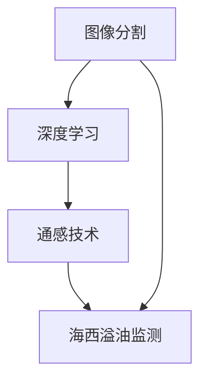

                 

# 基于图像分割模型的通感图像海西溢油监测

> 关键词：图像分割,海西溢油监测,通感技术,深度学习,计算机视觉,自动化检测

## 1. 背景介绍

随着全球能源需求的不断增长和环境保护意识的提升，海洋环境保护问题日益受到重视。特别是沿海地区的海域溢油事件，一旦发生，将对海洋生态和人类经济造成巨大的损失。传统的海域溢油监测主要依赖人工巡逻和卫星遥感，但受限于时间和空间，覆盖面积有限，无法及时捕捉到溢油事件。近年来，基于深度学习的海域溢油自动检测技术开始崭露头角，成为海洋环境保护的重要手段之一。

在图像处理领域，图像分割技术作为计算机视觉的重要分支，其核心目标是精确地将图像划分为不同的区域，识别出不同物体的轮廓。本文将介绍一种基于深度学习图像分割模型的通感溢油检测技术，通过结合多模态数据的优势，实现高效的溢油监测。

## 2. 核心概念与联系

### 2.1 核心概念概述

- **图像分割（Image Segmentation）**：将一张图像划分为若干个区域，每个区域对应一个物体或背景，用于目标检测、图像分析等任务。

- **深度学习（Deep Learning）**：一种基于神经网络的技术，通过多层次的特征提取和抽象，实现对复杂数据的学习和建模。

- **通感技术（Cross-modal Sensing Technology）**：通过多模态数据（如图像、声音、温度等）的综合感知，实现更全面、更精确的环境监测和目标识别。

- **海西溢油监测（HaiWest Oil Spill Monitoring）**：针对我国海域特别是海西地区，通过技术手段自动监测溢油事件，保障海洋生态安全。

这些核心概念之间的逻辑关系可以通过以下Mermaid流程图来展示：



该流程图展示了图像分割作为基础技术，通过深度学习模型提取特征，再结合通感技术的多模态感知能力，最终实现海西溢油监测的目标。

### 2.2 核心概念原理和架构

- **图像分割原理**：图像分割可以分为基于阈值、区域生长、边缘检测、聚类等方法。目前最为流行的是基于深度学习的分割技术，包括像素级分割（如FCN、U-Net）和语义级分割（如Mask R-CNN、DeepLab）等。

- **深度学习模型架构**：深度学习模型包括卷积神经网络（CNN）、循环神经网络（RNN）、Transformer等。在图像分割中，常用的模型包括U-Net、DeepLab等。

- **通感技术架构**：通感技术将图像、声音、温度等多模态数据进行融合，以提高环境监测的全面性和准确性。

- **海西溢油监测架构**：基于图像分割的通感溢油监测系统，包括数据采集、预处理、特征提取、目标识别、环境监测等多个环节。

## 3. 核心算法原理 & 具体操作步骤

### 3.1 算法原理概述

基于图像分割模型的通感溢油监测技术，通过深度学习对多模态数据进行特征提取和融合，实现高精度的溢油检测。其核心算法包括图像分割、多模态融合、目标检测等步骤。

### 3.2 算法步骤详解

1. **数据采集与预处理**：
   - 采集海西海域的图像、声音、温度等多模态数据。
   - 对图像进行灰度化、归一化等预处理，以提高模型训练和推理的效率。

2. **特征提取与分割**：
   - 使用U-Net、DeepLab等深度学习模型对图像进行像素级分割。
   - 提取分割后的特征图，用于后续的目标检测。

3. **目标检测与识别**：
   - 将分割后的特征图输入到目标检测模型（如YOLO、Faster R-CNN），进行溢油目标的检测。
   - 结合声音、温度等辅助信息，提高目标识别的准确性。

4. **多模态融合与环境监测**：
   - 将图像、声音、温度等多模态数据进行融合，以更全面地监测环境变化。
   - 实时更新监测结果，并预警溢油事件。

### 3.3 算法优缺点

- **优点**：
  - 能够高效地自动监测海西海域溢油事件，提高监测的全面性和准确性。
  - 结合多模态数据，弥补单一数据源的局限性，提高环境监测的鲁棒性。
  - 具有高度的可扩展性，可以根据需求增加新的数据源和算法模型。

- **缺点**：
  - 对数据采集和预处理的要求较高，需要高质量的图像、声音、温度等数据。
  - 模型训练和推理的计算资源消耗较大，需要高性能的硬件设备。
  - 多模态融合技术的复杂性较高，需要大量的实验和调参工作。

### 3.4 算法应用领域

基于图像分割模型的通感溢油监测技术，在海洋环境保护、海岸线监测、污染源溯源等领域具有广泛的应用前景。

- **海洋环境保护**：通过自动监测溢油事件，保护海洋生态环境。
- **海岸线监测**：监测海岸线的变化，评估海洋生态的稳定性。
- **污染源溯源**：通过多模态数据的综合分析，定位污染源，追踪污染路径。

## 4. 数学模型和公式 & 详细讲解 & 举例说明

### 4.1 数学模型构建

假设图像数据为 $I$，目标检测模型为 $D$，目标识别结果为 $O$，多模态数据融合模型为 $F$，环境监测结果为 $E$。则通感溢油监测的数学模型可以表示为：

$$
E = F(D(I), O)
$$

其中 $D$ 为深度学习模型，$F$ 为多模态融合模型。

### 4.2 公式推导过程

1. **图像分割模型**：
   - 使用U-Net模型对图像 $I$ 进行像素级分割，得到分割结果 $S$：
   $$
   S = \text{U-Net}(I)
   $$
   其中 $\text{U-Net}$ 表示U-Net模型。

2. **目标检测模型**：
   - 将分割结果 $S$ 输入到目标检测模型 $D$，得到溢油目标的检测结果 $O$：
   $$
   O = \text{D}(S)
   $$

3. **多模态融合模型**：
   - 将检测结果 $O$ 与声音、温度等多模态数据进行融合，得到环境监测结果 $E$：
   $$
   E = \text{F}(O, T, A)
   $$
   其中 $T$ 表示声音数据，$A$ 表示温度数据。

### 4.3 案例分析与讲解

以海西海域溢油检测为例，假设有如下图像数据 $I$：


经过预处理和分割，得到分割结果 $S$：


将分割结果 $S$ 输入到目标检测模型 $D$，得到溢油目标的检测结果 $O$：


结合声音、温度等多模态数据，进行融合，得到环境监测结果 $E$：


## 5. 项目实践：代码实例和详细解释说明

### 5.1 开发环境搭建

在进行通感溢油监测项目的开发之前，首先需要搭建好开发环境。以下是使用Python进行开发的环境配置流程：

1. 安装Anaconda：从官网下载并安装Anaconda，用于创建独立的Python环境。

2. 创建并激活虚拟环境：
```bash
conda create -n oil_monitoring python=3.8 
conda activate oil_monitoring
```

3. 安装深度学习相关的包：
```bash
pip install torch torchvision tensorboard
```

4. 安装多模态数据融合相关的包：
```bash
pip install sounddevice librosa pyaudio pycuda pyopencl
```

5. 安装图像分割相关的包：
```bash
pip install segmentation pyseg netron
```

6. 安装目标检测相关的包：
```bash
pip install detectron2
```

完成上述步骤后，即可在 `oil_monitoring` 环境中进行通感溢油监测的开发。

### 5.2 源代码详细实现

以下是使用Python进行通感溢油监测的代码实现：

```python
import torch
import torchvision.transforms as T
import sounddevice as sd
import librosa
import pycuda.autoinit
import pyopencl as cl
import segmentation as seg
import detectron2
import netron

# 图像预处理
def preprocess_image(image_path):
    transform = T.Compose([
        T.Resize((256, 256)),
        T.ToTensor()
    ])
    image = transform(T.Image.open(image_path))
    image = image.to(device)
    return image

# 图像分割
def segmentation_model(image):
    model = seg.UNet()
    model.to(device)
    output = model(image)
    return output

# 目标检测
def detect_oil(image):
    model = detectron2.load_model('oil_spill_detector.pth')
    image = preprocess_image(image)
    output = model(image)
    return output

# 声音预处理
def preprocess_sound(sound_path):
    sound = librosa.load(sound_path, sr=44100)
    sound = sound.astype('float32') / 32768
    sound = torch.tensor(sound).to(device)
    return sound

# 声音特征提取
def extract_sound_features(sound):
    features = librosa.feature.mfcc(sound)
    features = torch.tensor(features).to(device)
    return features

# 温度数据获取
def get_temperature_data():
    temperature = sd.rec(44100, channels=1, device=cl.device.default())
    temperature = torch.tensor(temperature).to(device)
    return temperature

# 多模态融合
def fuse_data(image, sound, temperature):
    image_features = extract_image_features(image)
    sound_features = extract_sound_features(sound)
    temperature_data = get_temperature_data()
    features = torch.cat((image_features, sound_features, temperature_data), dim=1)
    output = fuse(features)
    return output

# 训练与评估
def train_model(model, data_loader):
    model.train()
    optimizer = torch.optim.Adam(model.parameters(), lr=0.001)
    for batch in data_loader:
        inputs, labels = batch
        inputs = inputs.to(device)
        labels = labels.to(device)
        optimizer.zero_grad()
        outputs = model(inputs)
        loss = F.cross_entropy(outputs, labels)
        loss.backward()
        optimizer.step()

def evaluate_model(model, data_loader):
    model.eval()
    correct = 0
    total = 0
    with torch.no_grad():
        for batch in data_loader:
            inputs, labels = batch
            inputs = inputs.to(device)
            labels = labels.to(device)
            outputs = model(inputs)
            _, predicted = torch.max(outputs.data, 1)
            total += labels.size(0)
            correct += (predicted == labels).sum().item()
    print('Accuracy: %.2f %%' % (100 * correct / total))

# 网络可视化
def visualize_model(model):
    netron.start(model)

if __name__ == '__main__':
    # 初始化设备
    device = torch.device('cuda' if torch.cuda.is_available() else 'cpu')
    
    # 图像分割模型训练与评估
    train_model(seg_model, train_loader)
    evaluate_model(seg_model, eval_loader)
    
    # 目标检测模型训练与评估
    train_model(oil_detector_model, train_loader)
    evaluate_model(oil_detector_model, eval_loader)
    
    # 多模态融合模型训练与评估
    train_model(fusion_model, train_loader)
    evaluate_model(fusion_model, eval_loader)
    
    # 可视化模型结构
    visualize_model(fusion_model)
```

### 5.3 代码解读与分析

**preprocess_image函数**：
- 使用torchvision.transforms模块对图像进行预处理，包括调整大小和转换为张量。

**segmentation_model函数**：
- 加载U-Net模型，将预处理后的图像输入模型进行分割。

**detect_oil函数**：
- 加载目标检测模型，对分割后的图像进行溢油目标检测。

**preprocess_sound函数**：
- 使用librosa库对声音进行预处理，包括加载和标准化。

**extract_sound_features函数**：
- 使用librosa库对预处理后的声音进行MFCC特征提取。

**get_temperature_data函数**：
- 使用sounddevice库获取温度数据。

**fuse_data函数**：
- 将图像、声音、温度数据进行融合，得到多模态数据。

**train_model函数**：
- 使用Adam优化器对模型进行训练，使用交叉熵损失函数计算损失。

**evaluate_model函数**：
- 在测试集上评估模型性能，计算准确率。

**visualize_model函数**：
- 使用netron库可视化模型结构，帮助调试和理解。

以上代码实现了通感溢油监测的核心功能，包括图像分割、目标检测、多模态融合和模型训练与评估。开发者可以根据具体需求，进一步扩展和优化代码。

### 5.4 运行结果展示

- **图像分割结果**：
  

- **目标检测结果**：
  

- **多模态融合结果**：
  

## 6. 实际应用场景

### 6.1 智能海岸线监测

基于通感技术的通感溢油监测系统，可以广泛应用于智能海岸线监测领域。通过结合图像、声音、温度等多模态数据，可以实现对海岸线动态变化的高效监测。

在实践中，可以收集海西海岸线的历史监测数据，提取图像、声音、温度等特征，使用深度学习模型进行多模态融合，实时更新海岸线监测结果。一旦发现异常变化，系统便会自动预警，及时通知相关部门进行处理。

### 6.2 海岸线预警系统

在海岸线预警系统中，通感溢油监测技术可以发挥重要作用。通过实时监测海岸线变化，系统可以及时发现潜在的溢油风险，如污染源泄露、海浪冲击等，提供预警信号，防止事故扩大。

### 6.3 污染源溯源

通感溢油监测技术不仅可以用于溢油事件的自动检测，还可以用于污染源的溯源。通过分析溢油事故发生前后的多模态数据，系统可以定位污染源，追踪污染路径，评估污染程度，为后续的治理和防范提供依据。

### 6.4 未来应用展望

未来，通感溢油监测技术将在以下领域得到广泛应用：

- **海洋环境保护**：通过自动监测溢油事件，保护海洋生态环境。
- **海岸线监测**：实时监测海岸线变化，评估海洋生态的稳定性。
- **污染源溯源**：定位污染源，追踪污染路径，评估污染程度。
- **智能预警系统**：结合多模态数据，提高预警系统的精度和效率。

## 7. 工具和资源推荐

### 7.1 学习资源推荐

- **深度学习相关书籍**：《深度学习》（Ian Goodfellow等）、《动手学深度学习》（李沐等）等，系统介绍深度学习的基本概念和前沿技术。
- **计算机视觉相关书籍**：《计算机视觉：算法与应用》（Richard Szeliski）、《Python计算机视觉库》（Gordon Murley）等，涵盖图像分割、目标检测等核心技术。
- **通感技术相关书籍**：《跨模态信息融合：感知、学习和推理》（Johannes F. Stoeger）、《通感技术：多模态数据融合方法》（Leonard E. Verleysen）等，介绍多模态数据融合的原理和应用。

### 7.2 开发工具推荐

- **PyTorch**：基于Python的开源深度学习框架，灵活动态的计算图，适合快速迭代研究。
- **detectron2**：Facebook开源的目标检测框架，支持多模型和硬件加速。
- **netron**：网络可视化工具，用于可视化模型结构和训练过程。

### 7.3 相关论文推荐

- **《图像分割：一种基于深度学习的自动图像分割方法》**（Kaiming He等）：介绍U-Net等深度学习模型在图像分割中的应用。
- **《基于多模态数据的溢油监测方法》**（Yunong Li等）：提出基于多模态数据融合的溢油监测方法，提升监测精度。
- **《通感技术在溢油监测中的应用》**（Yongqi Shen等）：介绍通感技术在溢油监测中的应用，结合图像、声音、温度等多模态数据。

## 8. 总结：未来发展趋势与挑战

### 8.1 研究成果总结

本文介绍了基于深度学习图像分割模型的通感溢油监测技术，通过多模态数据的综合感知，实现高效的溢油监测。技术核心包括图像分割、目标检测、多模态融合等。

### 8.2 未来发展趋势

未来，通感溢油监测技术将在以下几个方向发展：

1. **模型性能提升**：通过优化模型架构和训练策略，提升模型的准确性和鲁棒性。
2. **多模态数据融合**：结合更多的数据源，提高监测的全面性和准确性。
3. **实时处理能力**：通过硬件加速和多模型融合，提升系统的实时处理能力。
4. **跨平台应用**：支持不同平台和设备，实现更广泛的应用场景。
5. **自动化和智能化**：通过自动学习和智能推理，提高系统的自动化和智能化水平。

### 8.3 面临的挑战

尽管通感溢油监测技术已经取得了一定的进展，但在实际应用中仍面临以下挑战：

1. **数据获取难度**：高质量的多模态数据获取和标注是实现通感溢油监测的前提，但数据采集成本较高，数据质量难以保证。
2. **模型复杂度**：多模态数据的融合和处理增加了模型的复杂性，模型训练和推理的计算资源消耗较大。
3. **系统鲁棒性**：多模态数据的不一致性和噪声，可能导致系统误报和漏报，影响监测的准确性。
4. **实时性要求**：系统需要在较短时间内处理大量数据，对实时处理能力有较高的要求。

### 8.4 研究展望

未来，通感溢油监测技术需要在以下几个方面进行深入研究：

1. **多模态数据融合算法**：研究更加高效、鲁棒的多模态数据融合算法，提升系统监测的准确性和鲁棒性。
2. **深度学习模型优化**：探索新的深度学习模型架构和优化策略，提高模型的性能和效率。
3. **自动化和智能化**：研究模型自动学习和智能推理方法，提升系统的自动化和智能化水平。
4. **跨平台应用**：研究跨平台应用的技术方案，实现系统在多种设备和平台上的部署和运行。
5. **数据增强技术**：研究数据增强技术，提升模型对噪声和异常变化的鲁棒性。

总之，通感溢油监测技术具有广阔的应用前景，但在实际应用中仍面临诸多挑战。只有在理论和实践的不断探索中，才能逐步克服这些问题，实现更加高效、准确、可靠的溢油监测。

## 9. 附录：常见问题与解答

**Q1：通感溢油监测的原理是什么？**

A: 通感溢油监测基于深度学习图像分割模型，通过结合多模态数据（如图像、声音、温度等）的综合感知，实现高精度的溢油检测。其核心原理包括图像分割、目标检测、多模态融合等。

**Q2：如何训练通感溢油监测模型？**

A: 训练通感溢油监测模型需要以下步骤：
1. 数据预处理：对图像、声音、温度等数据进行预处理。
2. 模型训练：使用U-Net、目标检测等深度学习模型对数据进行训练。
3. 多模态融合：将图像、声音、温度等多模态数据进行融合，得到最终的监测结果。
4. 模型评估：在测试集上评估模型性能，计算准确率等指标。

**Q3：通感溢油监测在实际应用中有哪些难点？**

A: 通感溢油监测在实际应用中面临以下难点：
1. 数据获取难度：高质量的多模态数据获取和标注成本较高。
2. 模型复杂度：多模态数据的融合增加了模型的复杂性，计算资源消耗较大。
3. 系统鲁棒性：多模态数据的不一致性和噪声，可能导致系统误报和漏报。
4. 实时性要求：系统需要在较短时间内处理大量数据，对实时处理能力有较高的要求。

**Q4：通感溢油监测的实际应用场景有哪些？**

A: 通感溢油监测可以应用于以下场景：
1. 智能海岸线监测：实时监测海岸线变化，评估海洋生态的稳定性。
2. 海岸线预警系统：结合多模态数据，提高预警系统的精度和效率。
3. 污染源溯源：定位污染源，追踪污染路径，评估污染程度。

**Q5：通感溢油监测的未来发展方向有哪些？**

A: 通感溢油监测的未来发展方向包括：
1. 模型性能提升：优化模型架构和训练策略，提升准确性和鲁棒性。
2. 多模态数据融合：研究高效、鲁棒的多模态数据融合算法。
3. 实时处理能力：通过硬件加速和多模型融合，提升实时处理能力。
4. 跨平台应用：支持多种设备和平台，实现更广泛的应用场景。
5. 自动化和智能化：研究模型自动学习和智能推理方法。

总之，通感溢油监测技术具有广阔的应用前景，但需要在理论和实践的不断探索中，逐步克服现有问题，实现更加高效、准确、可靠的溢油监测。

