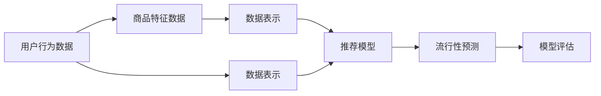

                 

# 基于推荐算法的商品流行性预测算法研究

## 1. 背景介绍

在电商领域，预测商品的流行性（即商品的销量或点击率）是商家优化库存管理、提升运营效率的关键。传统的商品流行性预测方法主要依赖历史销售数据和统计模型，但这种方法往往存在一些局限：

1. **数据依赖性强**：需要长期、大量、细致的历史销售数据，这对于某些商品或市场可能难以获得。
2. **模型缺乏动态适应性**：历史数据可能不反映未来的市场趋势，模型更新速度较慢。
3. **场景局限性**：统计模型一般适用于大宗商品或周期性强的商品，而对于个性化需求较强的商品（如服装、个性化电子产品等），效果不理想。

基于推荐算法的商品流行性预测方法，通过利用用户行为数据和商品特征，能够更准确地预测商品的未来流行性，从而帮助商家更灵活地调整库存和促销策略。近年来，推荐算法在电商领域的应用已经逐步成熟，并显示出巨大的应用潜力。本文将系统地介绍基于推荐算法的商品流行性预测算法，并分析其实现原理、步骤、优缺点及应用领域。

## 2. 核心概念与联系

### 2.1 核心概念概述

- **推荐算法**：通过用户行为数据和商品特征，为用户推荐合适的商品，或预测商品在未来时间段的流行性。推荐算法可以分为协同过滤、基于内容的推荐、混合推荐等。
- **商品流行性预测**：通过分析历史数据和实时数据，预测商品在未来时间段的销量或点击率。
- **数据表示**：将用户行为数据和商品特征转换成计算机可以处理的格式，如向量、矩阵等。
- **模型训练**：通过历史数据训练推荐算法模型，优化模型参数，使其能更好地预测商品流行性。
- **模型评估**：通过验证数据集评估推荐算法的预测准确性和效果。

这些概念之间相互联系，共同构成了基于推荐算法的商品流行性预测的核心逻辑。推荐算法利用用户行为数据和商品特征，通过模型训练得到流行性预测模型，并通过模型评估验证预测效果。

### 2.2 核心概念原理和架构的 Mermaid 流程图



这个流程图展示了数据从用户行为数据和商品特征数据开始，经过数据表示处理，进入推荐模型训练，得到流行性预测结果，并进行模型评估的过程。

## 3. 核心算法原理 & 具体操作步骤

### 3.1 算法原理概述

基于推荐算法的商品流行性预测方法通常包括以下几个步骤：

1. **数据预处理**：收集用户行为数据和商品特征数据，并进行清洗、归一化、特征工程等预处理操作。
2. **数据表示**：将用户行为数据和商品特征数据转换成向量或矩阵形式，便于推荐模型处理。
3. **推荐模型训练**：通过历史数据训练推荐模型，得到流行性预测模型。
4. **流行性预测**：将新商品数据输入到训练好的推荐模型，得到商品的流行性预测。
5. **模型评估**：通过验证数据集评估模型预测效果，调整模型参数以提高预测准确性。

### 3.2 算法步骤详解

**Step 1: 数据预处理**
- 收集用户行为数据和商品特征数据，包括用户的点击、购买、评分等行为数据，以及商品的销量、价格、分类等信息。
- 清洗数据，去除异常值、重复数据等。
- 进行特征工程，提取用户特征、商品特征等，并进行归一化处理。

**Step 2: 数据表示**
- 将用户行为数据和商品特征数据转换成向量或矩阵形式。常用的方法包括：
  - **用户行为向量化**：将用户的行为数据（如点击次数、购买次数等）转换成向量形式，例如采用基于时间的向量表示。
  - **商品特征向量化**：将商品的分类、属性、价格等特征转换成向量形式，例如采用TF-IDF向量化、one-hot编码等。
  - **组合表示**：将用户行为向量和商品特征向量进行组合，生成用户-商品交互矩阵，例如采用基于矩阵分解的方法。

**Step 3: 推荐模型训练**
- 选择合适的推荐算法，如协同过滤、基于内容的推荐、混合推荐等。
- 将历史数据分成训练集和验证集，并使用训练集进行模型训练。常用的推荐算法包括：
  - **协同过滤**：基于用户之间的相似度或商品之间的相似度进行推荐。
  - **基于内容的推荐**：根据用户对商品的属性偏好进行推荐。
  - **混合推荐**：结合协同过滤和基于内容的推荐，综合利用用户行为数据和商品特征数据。
- 使用验证集评估模型预测效果，调整模型参数以提高预测准确性。

**Step 4: 流行性预测**
- 将新商品数据输入到训练好的推荐模型，得到商品的流行性预测。
- 根据预测结果调整库存和促销策略，优化运营效率。

**Step 5: 模型评估**
- 使用测试集评估模型预测效果，常用的评估指标包括准确率、召回率、F1分数等。
- 根据评估结果调整模型参数，改进模型性能。

### 3.3 算法优缺点

**优点**：
1. **动态适应性强**：基于推荐算法的预测方法能够实时反映市场变化，适应性强。
2. **预测准确度高**：通过综合利用用户行为数据和商品特征，预测准确度较高。
3. **可扩展性强**：推荐算法可以根据实际情况进行调整，适用于多种商品和市场。

**缺点**：
1. **数据依赖性强**：需要长期、大量、细致的历史数据，对于某些商品或市场可能难以获得。
2. **模型复杂度高**：推荐算法模型较为复杂，训练和优化需要大量计算资源。
3. **解释性差**：推荐算法模型的决策过程复杂，难以解释和调试。

### 3.4 算法应用领域

基于推荐算法的商品流行性预测方法广泛应用于以下几个领域：

1. **电商推荐系统**：通过分析用户行为数据和商品特征，为用户推荐商品，并预测商品的流行性。
2. **库存管理**：根据预测结果，优化库存管理和物流配送。
3. **广告投放**：通过预测商品的流行性，精准投放广告，提升广告效果。
4. **市场分析**：分析市场趋势和用户需求，指导企业制定战略。

## 4. 数学模型和公式 & 详细讲解

### 4.1 数学模型构建

基于推荐算法的商品流行性预测通常可以建立如下数学模型：

设用户集为 $U$，商品集为 $I$，用户行为数据为 $B$，商品特征数据为 $F$。用户对商品的行为数据可以用向量形式表示为 $b_u = (b_{u1}, b_{u2}, ..., b_{um})$，商品的属性特征可以用向量形式表示为 $f_i = (f_{i1}, f_{i2}, ..., f_{in})$。将用户行为向量 $b_u$ 和商品特征向量 $f_i$ 进行组合，生成用户-商品交互矩阵 $B$：

$$
B = [b_u \cdot f_i]_{ui}
$$

其中 $b_u \cdot f_i$ 表示用户行为数据和商品特征数据的内积，用于计算用户对商品的评分或评分预测。

### 4.2 公式推导过程

推荐算法的核心公式为矩阵分解和协同过滤算法。以下分别介绍这两个算法的公式推导过程：

**矩阵分解算法**：
矩阵分解算法通过将用户-商品交互矩阵 $B$ 分解为 $U \times V$ 矩阵的形式，即 $B \approx UV$，其中 $U$ 为用户矩阵，$V$ 为商品矩阵。通过求解 $U$ 和 $V$，可以得到用户对商品的评分预测。具体推导过程如下：

设 $U \in \mathbb{R}^{m \times k}$ 为用户矩阵，$V \in \mathbb{R}^{k \times n}$ 为商品矩阵，则：

$$
\min_{U,V} \frac{1}{2} ||UV - B||_F^2
$$

其中 $||.||_F$ 表示矩阵的Frobenius范数，即矩阵元素平方和的平方根。

通过求解上述优化问题，可以得到用户矩阵 $U$ 和商品矩阵 $V$，从而得到用户对商品的评分预测：

$$
\hat{b}_{ui} = u_u^T v_i
$$

其中 $u_u^T$ 表示用户矩阵 $U$ 的第 $u$ 行，$v_i^T$ 表示商品矩阵 $V$ 的第 $i$ 列。

**协同过滤算法**：
协同过滤算法通过计算用户之间的相似度或商品之间的相似度，为某个用户推荐相似用户喜欢的商品，或者为某个商品推荐相似用户喜欢的商品。常用的协同过滤算法包括基于用户的协同过滤和基于物品的协同过滤。以下以基于用户的协同过滤为例，介绍公式推导过程：

设 $U \in \mathbb{R}^{m \times k}$ 为用户相似度矩阵，$V \in \mathbb{R}^{m \times n}$ 为商品评分矩阵，则：

$$
\min_{U} \frac{1}{2} ||U - X||_F^2
$$

其中 $X$ 为相似度矩阵，$||.||_F$ 表示矩阵的Frobenius范数。

通过求解上述优化问题，可以得到用户相似度矩阵 $U$，从而得到用户对商品的评分预测：

$$
\hat{b}_{ui} = \sum_{j=1}^{m} u_j v_{ji}
$$

其中 $u_j$ 表示用户矩阵 $U$ 的第 $j$ 行，$v_{ji}$ 表示商品评分矩阵 $V$ 的第 $j$ 行第 $i$ 列。

### 4.3 案例分析与讲解

假设某电商平台有 $m=1000$ 个用户，$n=500$ 个商品，收集到 $b_u = (b_{u1}, b_{u2}, ..., b_{um})$ 和 $f_i = (f_{i1}, f_{i2}, ..., f_{in})$，并生成用户-商品交互矩阵 $B$。

**基于矩阵分解算法的商品流行性预测**：
1. 将用户-商品交互矩阵 $B$ 分解为 $U \times V$ 矩阵的形式，即 $B \approx UV$，得到用户矩阵 $U \in \mathbb{R}^{1000 \times 100}$ 和商品矩阵 $V \in \mathbb{R}^{100 \times 500}$。
2. 对新商品 $i$，计算用户-商品评分预测 $\hat{b}_{ui}$：

$$
\hat{b}_{ui} = u_u^T v_i
$$

**基于协同过滤算法的商品流行性预测**：
1. 计算用户之间的相似度 $X$，得到用户相似度矩阵 $U \in \mathbb{R}^{1000 \times 1000}$。
2. 对新商品 $i$，计算用户-商品评分预测 $\hat{b}_{ui}$：

$$
\hat{b}_{ui} = \sum_{j=1}^{1000} u_j v_{ji}
$$

## 5. 项目实践：代码实例和详细解释说明

### 5.1 开发环境搭建

在开始项目实践前，需要搭建好开发环境。以下是使用Python进行基于推荐算法的商品流行性预测的开发环境配置流程：

1. 安装Anaconda：从官网下载并安装Anaconda，用于创建独立的Python环境。

2. 创建并激活虚拟环境：
```bash
conda create -n recommendation-env python=3.8 
conda activate recommendation-env
```

3. 安装相关库：
```bash
conda install scikit-learn pandas numpy scipy matplotlib 
pip install tensorflow
```

4. 安装相关工具：
```bash
pip install jupyter notebook
```

完成上述步骤后，即可在`recommendation-env`环境中开始项目实践。

### 5.2 源代码详细实现

以下是一个简单的商品流行性预测模型实现示例，基于协同过滤算法和矩阵分解算法。

首先，定义数据预处理函数：

```python
import pandas as pd
import numpy as np
from sklearn.decomposition import TruncatedSVD
from sklearn.metrics.pairwise import cosine_similarity
from sklearn.preprocessing import StandardScaler

def preprocess_data(train_data, test_data):
    # 数据清洗和归一化
    train_data.dropna(inplace=True)
    test_data.dropna(inplace=True)
    
    # 特征工程
    train_data['price'] = (train_data['price'] - train_data['price'].mean()) / train_data['price'].std()
    test_data['price'] = (test_data['price'] - train_data['price'].mean()) / train_data['price'].std()
    
    # 用户行为向量化
    train_bu = train_data.groupby(['user_id', 'item_id'])['action'].apply(lambda x: 1 if x.any() else 0)
    test_bu = test_data.groupby(['user_id', 'item_id'])['action'].apply(lambda x: 1 if x.any() else 0)
    
    # 商品特征向量化
    train_fi = train_data.groupby(['item_id'])['category'].apply(lambda x: 1 if x.any() else 0)
    test_fi = test_data.groupby(['item_id'])['category'].apply(lambda x: 1 if x.any() else 0)
    
    # 用户行为和商品特征组合
    train_B = train_bu.merge(train_fi, on='item_id').dropna().values
    test_B = test_bu.merge(test_fi, on='item_id').dropna().values
    
    return train_B, test_B
```

然后，定义推荐模型训练函数：

```python
def train_recommendation_model(train_B, test_B):
    # 基于矩阵分解算法的推荐模型
    svd = TruncatedSVD(n_components=50, random_state=42)
    U = svd.fit_transform(train_B).T
    
    # 基于协同过滤算法的推荐模型
    X = cosine_similarity(U, U)
    V = np.dot(X, train_B)
    
    # 计算用户-商品评分预测
    def predict(bu, fi):
        return np.dot(V, bu)
    
    return predict, U, V
```

最后，定义流行性预测函数：

```python
def predict_popularity(train_B, test_B, predict_func, U, V):
    # 基于矩阵分解算法的流行性预测
    def predict_bu(bu):
        return np.dot(U, bu)
    
    # 基于协同过滤算法的流行性预测
    def predict_fi(fi):
        return predict_func(fi, V)
    
    # 测试集预测
    test_results = []
    for bu in test_B:
        bu_pred = predict_bu(bu)
        fi_pred = predict_fi(bu_pred)
        test_results.append(fi_pred)
    
    return test_results
```

### 5.3 代码解读与分析

让我们再详细解读一下关键代码的实现细节：

**preprocess_data函数**：
- 进行数据清洗，去除缺失值。
- 对价格数据进行归一化处理。
- 对用户行为和商品特征进行向量化处理，生成用户-商品交互矩阵和商品特征矩阵。
- 将用户行为矩阵和商品特征矩阵进行组合，生成用户-商品交互矩阵 $B$。

**train_recommendation_model函数**：
- 基于矩阵分解算法，使用TruncatedSVD进行矩阵分解，得到用户矩阵 $U$。
- 基于协同过滤算法，计算用户之间的相似度 $X$，得到用户相似度矩阵 $U$ 和商品评分矩阵 $V$。
- 定义预测函数 predict，计算用户-商品评分预测。

**predict_popularity函数**：
- 定义基于矩阵分解算法和协同过滤算法的流行性预测函数 predict_bu 和 predict_fi。
- 对测试集中的每个用户行为向量 bu，计算用户-商品评分预测，并计算基于商品特征向量的评分预测。
- 返回测试集的流行性预测结果。

## 6. 实际应用场景

基于推荐算法的商品流行性预测方法已经在多个电商平台上得到广泛应用，以下是几个典型的应用场景：

### 6.1 电商推荐系统

电商推荐系统通过分析用户行为数据和商品特征，为用户推荐商品，并预测商品的流行性。推荐系统可以根据用户的购买历史、浏览历史、评分等行为数据，生成个性化推荐列表，提升用户购物体验和转化率。

### 6.2 库存管理

通过预测商品的流行性，商家可以优化库存管理，避免库存积压和缺货现象。库存管理系统可以根据商品流行性预测结果，调整库存量和采购策略，提升运营效率。

### 6.3 广告投放

广告投放系统通过预测商品的流行性，精准投放广告，提升广告效果。广告投放系统可以根据商品的流行性预测结果，优化广告投放策略，提升广告点击率和转化率。

### 6.4 市场分析

市场分析系统通过分析历史数据和实时数据，预测市场趋势和用户需求，指导企业制定战略。市场分析系统可以根据商品流行性预测结果，分析市场变化和用户需求，提供市场洞察和决策支持。

## 7. 工具和资源推荐

### 7.1 学习资源推荐

为了帮助开发者系统掌握推荐算法和商品流行性预测的理论基础和实践技巧，这里推荐一些优质的学习资源：

1. 《推荐系统实战》：该书详细介绍了推荐算法的原理和实现方法，包括协同过滤、基于内容的推荐、混合推荐等。
2. Coursera《推荐系统》课程：由斯坦福大学教授讲授，涵盖推荐算法的经典理论和实际应用。
3. Kaggle推荐系统竞赛：通过参加竞赛，实战训练推荐算法，提升算法设计和调优能力。
4. PyTorch官方文档：详细介绍了TensorFlow的API和推荐算法实现方法，适合入门学习。
5. GitHub推荐算法代码库：包含多种推荐算法的实现代码，适合参考学习。

通过对这些资源的学习实践，相信你一定能够快速掌握推荐算法的精髓，并用于解决实际的推荐问题。

### 7.2 开发工具推荐

高效的开发离不开优秀的工具支持。以下是几款用于推荐算法和商品流行性预测开发的常用工具：

1. PyTorch：基于Python的开源深度学习框架，灵活动态的计算图，适合快速迭代研究。
2. TensorFlow：由Google主导开发的开源深度学习框架，生产部署方便，适合大规模工程应用。
3. Scikit-learn：Python机器学习库，包含多种推荐算法实现，适合快速原型开发和实验验证。
4. Jupyter Notebook：交互式的代码开发和展示工具，适合快速迭代实验。
5. Pandas：Python数据处理库，适合数据预处理和特征工程。

合理利用这些工具，可以显著提升推荐算法和商品流行性预测的开发效率，加快创新迭代的步伐。

### 7.3 相关论文推荐

推荐算法和商品流行性预测领域的研究活跃，以下是几篇奠基性的相关论文，推荐阅读：

1. Matrix Factorization Techniques for Recommender Systems：介绍了矩阵分解算法在推荐系统中的应用。
2. Collaborative Filtering for Implicit Feedback Datasets：提出了基于协同过滤算法的推荐系统方法。
3. Adaptive Matrix Factorization with Multiple Contexts：提出了适应性矩阵分解方法，提高推荐系统的泛化能力。
4. Web-scale Matrix Factorization Techniques at Amazon：介绍了亚马逊在推荐系统中的实践经验，包括数据预处理、模型训练和效果评估。

这些论文代表了大数据推荐算法的最新进展，通过学习这些前沿成果，可以帮助研究者把握学科前进方向，激发更多的创新灵感。

## 8. 总结：未来发展趋势与挑战

### 8.1 总结

本文对基于推荐算法的商品流行性预测方法进行了全面系统的介绍。首先阐述了推荐算法在电商领域的应用背景和意义，明确了商品流行性预测在提升运营效率、优化库存管理等方面的独特价值。其次，从原理到实践，详细讲解了推荐算法的实现原理和详细步骤，给出了商品流行性预测任务开发的完整代码实例。同时，本文还广泛探讨了推荐算法在电商推荐、库存管理、广告投放、市场分析等多个行业领域的应用前景，展示了推荐算法的巨大应用潜力。此外，本文精选了推荐算法的各类学习资源，力求为读者提供全方位的技术指引。

通过本文的系统梳理，可以看到，基于推荐算法的商品流行性预测方法已经成为电商领域的重要工具，极大地提升了运营效率和用户体验。未来，伴随推荐算法的持续演进，推荐系统将在更多领域得到应用，为传统行业带来变革性影响。

### 8.2 未来发展趋势

展望未来，基于推荐算法的商品流行性预测技术将呈现以下几个发展趋势：

1. **多模态推荐**：结合文本、图像、视频等多种数据，实现多模态推荐，提升推荐系统的全面性和准确性。
2. **深度学习推荐**：利用深度神经网络模型，提高推荐算法的预测能力和泛化能力。
3. **实时推荐系统**：通过在线学习算法，实时更新推荐模型，适应市场变化和用户需求。
4. **个性化推荐**：结合用户画像和行为数据，实现更加个性化、精准的推荐。
5. **公平性推荐**：优化推荐算法，减少推荐系统的偏见和歧视，提升推荐系统的公平性和可解释性。

以上趋势凸显了推荐算法的广阔前景。这些方向的探索发展，必将进一步提升推荐系统的性能和应用范围，为电商、金融、娱乐等传统行业带来变革性影响。

### 8.3 面临的挑战

尽管基于推荐算法的商品流行性预测技术已经取得了瞩目成就，但在迈向更加智能化、普适化应用的过程中，它仍面临着诸多挑战：

1. **数据质量问题**：推荐算法的性能高度依赖于数据质量，数据缺失、噪声等问题可能导致推荐结果不准确。
2. **模型复杂性**：推荐算法模型较为复杂，训练和优化需要大量计算资源，模型的可解释性较弱。
3. **模型鲁棒性**：推荐算法模型容易受到攻击，如对抗样本攻击、数据注入等，导致模型性能下降。
4. **用户隐私问题**：推荐系统需要收集用户行为数据，涉及用户隐私问题，需要采取有效的隐私保护措施。
5. **动态变化**：用户需求和市场环境不断变化，推荐模型需要实时更新，才能保持其预测能力。

这些挑战需要研究者不断优化算法模型和数据处理流程，提升推荐系统的稳定性和可解释性，才能更好地服务于用户和市场。

### 8.4 研究展望

面对基于推荐算法的商品流行性预测所面临的种种挑战，未来的研究需要在以下几个方面寻求新的突破：

1. **数据增强和清洗**：通过数据增强和清洗，提升数据质量，减少噪声对推荐算法的影响。
2. **模型优化和可解释性**：优化推荐算法模型，提高模型的可解释性和鲁棒性，减少模型的偏见和歧视。
3. **多模态数据融合**：结合多种模态的数据，提升推荐系统的全面性和准确性。
4. **实时推荐系统**：研究在线学习算法，实时更新推荐模型，适应市场变化和用户需求。
5. **隐私保护**：研究隐私保护技术，如差分隐私、联邦学习等，保护用户隐私。

这些研究方向的探索，必将引领推荐算法和商品流行性预测技术迈向更高的台阶，为构建更加智能、个性化、公平、安全的推荐系统铺平道路。面向未来，推荐算法将与深度学习、自然语言处理、图像识别等技术进一步融合，共同推动人工智能技术的不断进步。

## 9. 附录：常见问题与解答

**Q1: 如何选择合适的推荐算法？**

A: 选择合适的推荐算法需要考虑多种因素，如数据类型、模型复杂度、用户需求等。常见的推荐算法包括协同过滤、基于内容的推荐、混合推荐等。协同过滤适用于用户行为数据较丰富的场景，基于内容的推荐适用于商品特征数据较丰富的场景，混合推荐则可以综合利用用户行为数据和商品特征数据，提升推荐系统的全面性和准确性。

**Q2: 如何优化推荐算法的性能？**

A: 推荐算法的性能优化可以从以下几个方面入手：
1. 数据增强和清洗：通过数据增强和清洗，提升数据质量，减少噪声对推荐算法的影响。
2. 模型优化：通过选择合适的优化算法、调整模型参数等，优化推荐算法的性能。
3. 特征工程：通过特征选择、特征提取等，提升特征表示能力，提高推荐算法的预测能力。
4. 在线学习：通过在线学习算法，实时更新推荐模型，适应市场变化和用户需求。

**Q3: 如何保护用户隐私？**

A: 推荐系统需要收集用户行为数据，涉及用户隐私问题，需要采取有效的隐私保护措施。常见的隐私保护技术包括差分隐私、联邦学习等。差分隐私通过添加噪声，保护用户隐私；联邦学习通过分布式训练，保护用户数据。

**Q4: 如何评估推荐算法的性能？**

A: 推荐算法的性能评估可以从以下几个指标入手：
1. 准确率：评估推荐系统的推荐准确性，如Top-k准确率、平均绝对误差等。
2. 召回率：评估推荐系统对正样本的覆盖能力，如召回率、覆盖率等。
3. F1分数：综合考虑准确率和召回率，评估推荐系统的整体性能。
4. NDCG和MRR：评估推荐系统在排序推荐中的性能，如NDCG、MRR等。

通过学习这些评估指标，可以帮助研究者更好地评估推荐算法的性能，改进推荐模型。

---

作者：禅与计算机程序设计艺术 / Zen and the Art of Computer Programming

