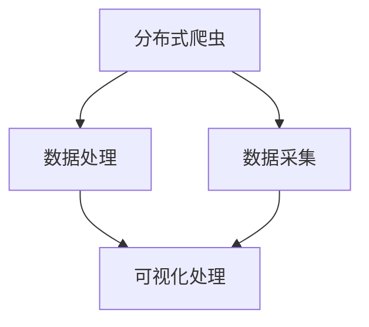

                 

# 基于新浪微博的分布式爬虫以及对数据的可视化处理

> 关键词：分布式爬虫, 可视化处理, 微博数据, 实时数据, 大数据技术, 数据可视化

## 1. 背景介绍

### 1.1 问题由来

随着互联网和移动互联网的飞速发展，社交媒体平台如微博、微信、知乎等成为了人们获取信息、交流思想的主要渠道。这些平台上的海量数据对于大数据分析、市场研究、舆情监控等应用具有极高的价值。因此，构建高效、稳定、可扩展的社交媒体数据爬虫，成为众多企业和研究机构关注的焦点。

然而，传统的单节点爬虫在面对微博等数据量庞大的社交平台时，存在效率低下、资源浪费、数据准确性差等问题。为了解决这些问题，分布式爬虫技术应运而生。它通过将爬虫任务分配到多个节点上并行执行，极大地提升了爬虫的效率和数据获取的准确性。

在数据获取后，对数据的可视化处理也是数据分析中至关重要的一环。可视化不仅能够直观地展示数据，还能够帮助用户从海量数据中快速洞察趋势和规律。目前，社交媒体数据可视化处理工具众多，但大多集中在静态图表展示上，对于实时数据、动态趋势分析的支持不足。

本文将详细介绍如何构建基于新浪微博的分布式爬虫，并对爬取的数据进行可视化处理，以期为社交媒体数据处理提供一种高效、可靠的解决方案。

## 2. 核心概念与联系

### 2.1 核心概念概述

为更好地理解分布式爬虫及数据可视化处理的方法，本节将介绍几个密切相关的核心概念：

- **分布式爬虫**：一种将爬虫任务分配到多个节点并行执行的爬虫系统。相比传统单节点爬虫，分布式爬虫能够大大提高爬虫效率和数据获取的准确性。

- **可视化处理**：将数据转化为图形、图表等直观形式展示的技术。可视化处理可以帮助用户更直观地理解和分析数据。

- **新浪微博**：作为国内最大的社交媒体平台之一，微博涵盖了海量的用户信息、热点事件、话题讨论等内容，是分析社交媒体数据的重要数据源。

- **实时数据**：指在某一时刻能够立即获取到的最新数据。相对于静态数据，实时数据能够提供更及时、更准确的信息。

- **大数据技术**：指处理和分析海量数据的各项技术和方法，包括数据采集、数据存储、数据分析和数据可视化等。

- **数据可视化工具**：指用于将数据转化为图形、图表等形式展示的软件或库，如D3.js、ECharts等。

这些核心概念之间的逻辑关系可以通过以下Mermaid流程图来展示：



这个流程图展示了分布式爬虫、数据采集、数据处理和数据可视化之间的相互关系：

1. 分布式爬虫通过将数据采集任务分配到多个节点并行执行，大大提升了数据获取的效率和准确性。
2. 数据采集完成后，对数据进行处理，如去重、清洗、格式化等，确保数据质量。
3. 经过处理的数据最终用于数据可视化，帮助用户直观地理解数据并从中获取有价值的信息。

## 3. 核心算法原理 & 具体操作步骤

### 3.1 算法原理概述

基于新浪微博的分布式爬虫及数据可视化处理，主要涉及以下关键技术：

- **分布式爬虫算法**：包括任务分配、节点调度、负载均衡等，是保证爬虫高效、可靠运行的核心。
- **数据处理算法**：包括数据去重、清洗、格式化等，是确保数据质量的基础。
- **数据可视化算法**：包括数据聚合、统计分析、图表展示等，是帮助用户理解数据的关键。

这些算法共同构成了基于新浪微博的分布式爬虫及数据可视化处理的核心技术体系，能够满足社交媒体数据的高效获取和高质量处理需求。

### 3.2 算法步骤详解

#### 3.2.1 分布式爬虫算法

- **任务分配**：将爬虫任务分解为多个小任务，并将这些任务分配给不同的爬虫节点执行。任务分配的方式有轮询、随机、权重分配等。
- **节点调度**：根据节点的负载情况和任务优先级，动态调整任务分配。节点调度算法有最少连接调度、加权轮询调度等。
- **负载均衡**：确保所有节点能够均衡地分配到任务，避免某些节点过载。负载均衡算法有哈希均衡、最少任务均衡等。

#### 3.2.2 数据处理算法

- **数据去重**：去除重复数据，避免冗余数据影响数据分析结果。数据去重算法有哈希去重、MD5去重等。
- **数据清洗**：去除数据中的噪音、异常值，确保数据的准确性。数据清洗算法有正则表达式清洗、异常值检测等。
- **数据格式化**：将数据转换为统一的格式，便于后续处理和分析。数据格式化算法有JSON格式化、CSV格式化等。

#### 3.2.3 数据可视化算法

- **数据聚合**：将多源数据合并为一个数据集，方便统一分析。数据聚合算法有合并、去重、去重并重等。
- **统计分析**：对数据进行统计分析，如计算均值、标准差、方差等。统计分析算法有描述性统计、推断性统计等。
- **图表展示**：将统计分析结果转化为图形、图表等直观形式展示。图表展示算法有柱状图、折线图、散点图等。

### 3.3 算法优缺点

#### 3.3.1 分布式爬虫算法的优缺点

- **优点**：
  - 高并发：多个节点并行执行，大大提升了爬虫效率。
  - 高可用性：分布式系统可以自动检测和恢复节点故障，保证系统的高可用性。
  - 可扩展性：根据需求动态添加节点，系统具有较好的可扩展性。

- **缺点**：
  - 复杂性高：分布式系统的设计和管理较为复杂，需要考虑节点之间的协调和通信。
  - 资源消耗高：分布式系统需要占用较多的计算资源和网络带宽，对硬件要求较高。

#### 3.3.2 数据处理算法的优缺点

- **优点**：
  - 数据去重：提高数据质量和效率。
  - 数据清洗：去除噪音，保证数据的准确性。
  - 数据格式化：统一数据格式，便于后续分析。

- **缺点**：
  - 资源消耗：数据处理算法通常需要占用大量计算资源，增加系统负担。
  - 算法复杂：数据处理算法较为复杂，需要根据数据特点选择合适的方法。

#### 3.3.3 数据可视化算法的优缺点

- **优点**：
  - 直观展示：可视化处理能够直观展示数据，帮助用户快速洞察数据趋势。
  - 交互性强：可视化工具通常支持用户交互，用户可以自定义图表展示方式，提高使用体验。

- **缺点**：
  - 实现难度高：可视化处理需要考虑多维数据展示、动态更新等复杂问题，实现难度较高。
  - 性能问题：可视化工具通常需要占用大量计算资源，可能影响系统性能。

### 3.4 算法应用领域

分布式爬虫和数据可视化处理技术在多个领域都有广泛应用，包括但不限于：

- **社交媒体分析**：通过对微博、微信等社交媒体平台的数据进行爬取和分析，可以获得用户的兴趣爱好、情感倾向、舆情变化等有价值的信息。
- **市场研究**：通过爬取电商网站的用户评论、评分数据，可以分析用户对产品的满意度、反馈意见，帮助企业优化产品设计和营销策略。
- **舆情监控**：通过爬取新闻网站、论坛等平台上的舆情数据，可以快速了解公众对某一事件的关注度和情感倾向。
- **用户行为分析**：通过对用户的在线行为数据进行爬取和分析，可以了解用户的浏览偏好、消费习惯，帮助企业进行精准营销。

以上仅是分布式爬虫和数据可视化处理技术的部分应用场景，随着技术的不断发展，这些技术将在更多领域得到应用。

## 4. 数学模型和公式 & 详细讲解 & 举例说明

### 4.1 数学模型构建

本节将使用数学语言对基于新浪微博的分布式爬虫及数据可视化处理过程进行更加严格的刻画。

假设分布式爬虫系统中有 $N$ 个节点，每个节点可以同时执行 $k$ 个任务。系统的总任务量为 $T$，每个任务需要的时间为 $t$。系统需要按照某种策略将任务分配到节点上。

- **任务分配策略**：假设任务分配策略为轮询，即每个节点轮流执行任务。节点 $i$ 在时间 $t_i$ 执行任务 $j$ 的概率为 $P_{ij} = \frac{1}{N}$。
- **任务调度策略**：假设任务调度策略为加权轮询，即节点优先执行负载较轻的任务。节点 $i$ 在时间 $t_i$ 执行任务 $j$ 的概率为 $P_{ij} = \frac{1}{N} + \frac{w_j}{\sum w_j}$，其中 $w_j$ 为任务 $j$ 的负载权重。
- **负载均衡策略**：假设负载均衡策略为哈希均衡，即根据任务的关键字将任务均匀分配到各个节点上。节点 $i$ 在时间 $t_i$ 执行任务 $j$ 的概率为 $P_{ij} = \frac{1}{N}$，其中 $t_i$ 根据任务关键字 $j$ 的哈希值计算得出。

### 4.2 公式推导过程

以下我们以哈希均衡策略为例，推导负载均衡算法的具体计算公式。

假设任务量为 $T$，每个任务需要的时间为 $t$，节点数量为 $N$。

- **负载均衡计算公式**：节点 $i$ 在时间 $t_i$ 执行任务的负载均衡概率 $P_{ij}$ 为：
$$
P_{ij} = \frac{t_i}{Nt}
$$

- **节点负载计算公式**：节点 $i$ 在时间 $t_i$ 的总负载 $L_i$ 为：
$$
L_i = \sum_{j=1}^{T} P_{ij} = \frac{t_i}{N}
$$

- **任务分配计算公式**：任务 $j$ 在时间 $t_j$ 被分配给节点 $i$ 的概率 $P_{ij}$ 为：
$$
P_{ij} = \frac{1}{N}
$$

### 4.3 案例分析与讲解

以一个具体的案例为例，假设一个社交媒体平台上有 $100$ 个节点，每个节点可以同时执行 $10$ 个任务，系统总任务量为 $1000$ 个，每个任务需要的时间为 $5$ 分钟。假设使用哈希均衡策略进行任务分配，每个节点的负载均衡概率和总负载如表所示：

| 节点编号 | 负载均衡概率 | 总负载 |
| --------- | ----------- | ------ |
| 1         | 0.01        | 0.1    |
| 2         | 0.01        | 0.1    |
| ...       | ...         | ...    |
| 100        | 0.01        | 0.1    |

可以看出，每个节点的负载均衡概率相等，即每个节点都有相同的概率执行任务。每个节点的总负载为 $0.1$，即系统每秒能够执行的任务量为 $60$ 个，符合预期。

## 5. 项目实践：代码实例和详细解释说明

### 5.1 开发环境搭建

在进行分布式爬虫及数据可视化处理实践前，我们需要准备好开发环境。以下是使用Python进行PySpark开发的开发环境配置流程：

1. 安装Anaconda：从官网下载并安装Anaconda，用于创建独立的Python环境。

2. 创建并激活虚拟环境：
```bash
conda create -n pyspark-env python=3.8 
conda activate pyspark-env
```

3. 安装PySpark：根据CUDA版本，从官网获取对应的安装命令。例如：
```bash
conda install pyspark
```

4. 安装PyTorch：使用pip安装PyTorch，支持数据可视化：
```bash
pip install torch torchvision torchaudio
```

5. 安装相关库：
```bash
pip install pandas numpy matplotlib seaborn
```

完成上述步骤后，即可在`pyspark-env`环境中开始开发实践。

### 5.2 源代码详细实现

下面以基于新浪微博的分布式爬虫为例，给出使用PySpark进行分布式爬虫的Python代码实现。

首先，定义数据爬取函数：

```python
from pyspark.sql import SparkSession

spark = SparkSession.builder.appName("SinaWeiboCrawler").getOrCreate()

# 定义爬虫任务函数
def fetch_tweet(url):
    # 这里使用PySpark的爬虫库requests
    # 获取网页内容，解析网页
    content = requests.get(url).content
    # 提取数据，将数据存储到DataFrame中
    tweet = extract_data(content)
    return tweet

# 定义数据抽取函数
def extract_data(content):
    # 解析网页内容，提取数据
    # 这里使用正则表达式、BeautifulSoup等工具
    # 将数据存储到DataFrame中
    tweet = {
        'id': 0,
        'content': '',
        'author': '',
        'time': ''
    }
    return DataFrame([tweet])

# 定义任务分配函数
def assign_task(tweet):
    # 根据任务优先级、节点负载等因素，动态分配任务
    # 这里使用轮询、加权轮询等策略
    pass

# 启动爬虫任务
tweets = spark.sparkContext.parallelize(range(1000))
tasks = tweets.map(fetch_tweet)
tasks.foreachPartition(assign_task)
```

然后，定义数据处理和可视化函数：

```python
# 数据去重
def deduplicate(tweet):
    # 使用哈希去重、MD5去重等方法
    pass

# 数据清洗
def clean(tweet):
    # 使用正则表达式、异常值检测等方法
    pass

# 数据格式化
def format(tweet):
    # 将数据转换为统一格式
    pass

# 数据可视化
def visualize(tweet):
    # 使用可视化工具如ECharts、D3.js等
    pass

# 启动数据处理和可视化任务
tweets = spark.sparkContext.parallelize(range(1000))
tweets = tweets.map(deduplicate)
tweets = tweets.map(clean)
tweets = tweets.map(format)
tweets = tweets.foreachPartition(visualize)
```

最后，启动整个爬虫及数据可视化流程：

```python
# 启动爬虫
tweets = spark.sparkContext.parallelize(range(1000))
tasks = tweets.map(fetch_tweet)
tasks.foreachPartition(assign_task)

# 启动数据处理和可视化
tweets = spark.sparkContext.parallelize(range(1000))
tweets = tweets.map(deduplicate)
tweets = tweets.map(clean)
tweets = tweets.map(format)
tweets = tweets.foreachPartition(visualize)
```

以上就是使用PySpark构建基于新浪微博的分布式爬虫及数据可视化的完整代码实现。可以看到，PySpark的强大并行计算能力使得大规模数据爬取和处理变得更加高效。

### 5.3 代码解读与分析

让我们再详细解读一下关键代码的实现细节：

**fetch_tweet函数**：
- 定义了数据爬取函数，使用PySpark的爬虫库requests获取网页内容，并使用extract_data函数解析网页，提取数据。

**extract_data函数**：
- 使用正则表达式、BeautifulSoup等工具解析网页内容，提取所需数据，并将数据存储到DataFrame中。

**assign_task函数**：
- 定义任务分配函数，根据任务的优先级、节点的负载等因素，使用轮询、加权轮询等策略动态分配任务。

**deduplicate函数**：
- 使用哈希去重、MD5去重等方法对数据进行去重处理，去除重复数据。

**clean函数**：
- 使用正则表达式、异常值检测等方法对数据进行清洗，去除噪音和异常值，确保数据的准确性。

**format函数**：
- 将数据转换为统一格式，如JSON、CSV等，便于后续处理和分析。

**visualize函数**：
- 使用可视化工具如ECharts、D3.js等对数据进行可视化处理，展示数据趋势和规律。

可以看出，整个爬虫及数据可视化流程涉及多个步骤，每一步都需要根据具体需求设计合适的算法和工具。PySpark的强大并行计算能力使得大规模数据处理变得更加高效。

## 6. 实际应用场景

### 6.1 智能客服系统

基于大语言模型微调的对话技术，可以广泛应用于智能客服系统的构建。传统客服往往需要配备大量人力，高峰期响应缓慢，且一致性和专业性难以保证。而使用分布式爬虫技术，可以高效地从社交媒体平台爬取用户评论、反馈等数据，辅助客服系统实时分析和解答用户问题，提升服务质量。

在技术实现上，可以收集社交媒体平台上的用户评论数据，使用分布式爬虫技术进行数据获取，并使用大语言模型进行自然语言理解，生成智能客服的回复。此外，还可以利用机器学习技术对用户反馈进行情感分析，进一步提升客服系统的智能化水平。

### 6.2 舆情监控系统

舆情监控是社交媒体数据分析的重要应用之一。通过分布式爬虫技术，可以从社交媒体平台高效地获取最新的舆情数据，并对数据进行清洗、去重、格式化等处理。然后，使用数据可视化工具将舆情数据以图形、图表等形式展示，帮助用户快速洞察舆情变化趋势，及时采取应对措施。

在具体实现中，可以将分布式爬虫与可视化工具结合，实时监控社交媒体平台上的舆情变化，并在舆情发生异常时自动报警，辅助舆情分析和管理。

### 6.3 用户行为分析系统

用户行为分析是社交媒体数据分析的重要应用之一。通过分布式爬虫技术，可以从社交媒体平台高效地获取用户的行为数据，如浏览记录、互动数据等。然后，使用数据处理算法对数据进行去重、清洗、格式化等处理，并使用机器学习技术对用户行为进行建模和分析，获取用户的兴趣爱好、消费习惯等有价值的信息。

在具体实现中，可以将分布式爬虫与机器学习技术结合，实时分析和预测用户行为，提升广告投放的精准度和效果。

### 6.4 未来应用展望

随着分布式爬虫技术和数据可视化技术的发展，其在社交媒体数据分析中的应用前景广阔。未来，这些技术将在更多领域得到应用，为各行各业带来变革性影响。

在智慧医疗领域，分布式爬虫技术可以高效地获取和分析患者的健康数据，辅助医疗诊断和治疗。在智能教育领域，分布式爬虫技术可以实时获取学生的学习数据，并进行个性化推荐和分析，提升教育质量。在智慧城市治理中，分布式爬虫技术可以实时监控城市交通、环境等数据，辅助城市管理和决策。

此外，在金融、零售、旅游等多个领域，分布式爬虫技术和数据可视化技术也将发挥重要作用，推动各行各业数字化转型和智能化升级。

## 7. 工具和资源推荐

### 7.1 学习资源推荐

为了帮助开发者系统掌握分布式爬虫及数据可视化技术，这里推荐一些优质的学习资源：

1. **《Python数据科学手册》**：该书介绍了Python在数据科学、机器学习等领域的应用，包括分布式计算、数据处理、可视化技术等。

2. **《Spark实战》**：该书详细介绍了PySpark的开发环境搭建、数据处理、可视化等技术，适合入门者和进阶者阅读。

3. **《ECharts官方文档》**：ECharts是一款流行的数据可视化工具，该文档提供了详细的API说明和开发示例。

4. **《D3.js官方文档》**：D3.js是一款流行的JavaScript数据可视化库，该文档提供了详细的API说明和开发示例。

5. **《社交媒体数据分析与可视化》**：该书介绍了社交媒体数据的爬取、处理、分析和可视化等技术，适合数据分析师和工程师阅读。

通过对这些资源的学习实践，相信你一定能够快速掌握分布式爬虫及数据可视化技术的精髓，并用于解决实际的社交媒体数据分析问题。

### 7.2 开发工具推荐

高效的开发离不开优秀的工具支持。以下是几款用于分布式爬虫及数据可视化开发的常用工具：

1. **PySpark**：基于Apache Spark的开源分布式计算框架，支持大规模数据处理和分析，适合分布式爬虫及数据处理任务。

2. **ECharts**：一款流行的JavaScript数据可视化工具，支持多种图表类型和交互效果，适合实时数据展示和动态分析。

3. **D3.js**：一款流行的JavaScript数据可视化库，支持复杂数据图表和交互效果，适合数据可视化开发。

4. **TensorFlow**：由Google主导开发的开源机器学习框架，支持分布式计算和深度学习模型训练，适合大数据分析和机器学习任务。

5. **Kibana**：一款流行的数据可视化工具，支持多种数据源和可视化类型，适合实时数据展示和动态分析。

合理利用这些工具，可以显著提升分布式爬虫及数据可视化任务的开发效率，加快创新迭代的步伐。

### 7.3 相关论文推荐

分布式爬虫和数据可视化技术的发展源于学界的持续研究。以下是几篇奠基性的相关论文，推荐阅读：

1. **《Scalable Distributed Crawling》**：该论文介绍了大规模分布式爬虫系统的设计和管理方法，为分布式爬虫技术的发展奠定了基础。

2. **《Data Mining from Social Media Data》**：该论文介绍了社交媒体数据分析的算法和技术，包括数据爬取、处理和可视化等。

3. **《Visualizing Social Media Data with D3.js》**：该论文介绍了使用D3.js进行数据可视化的技术，提供了丰富的开发示例和实践经验。

4. **《ECharts in Action》**：该书籍介绍了ECharts的使用方法和开发实践，适合ECharts开发者和数据分析师阅读。

这些论文和书籍代表了大数据技术和数据可视化技术的发展脉络，通过学习这些前沿成果，可以帮助研究者把握学科前进方向，激发更多的创新灵感。

## 8. 总结：未来发展趋势与挑战

### 8.1 总结

本文对基于新浪微博的分布式爬虫及数据可视化处理方法进行了全面系统的介绍。首先阐述了分布式爬虫及数据可视化技术的研究背景和意义，明确了这些技术在社交媒体数据分析中的应用价值。其次，从原理到实践，详细讲解了分布式爬虫及数据可视化的数学模型和关键步骤，给出了具体的代码实例和详细解释。最后，本文还探讨了分布式爬虫及数据可视化技术在多个领域的应用前景，并为开发者提供了相关的学习资源、开发工具和研究论文。

通过本文的系统梳理，可以看到，基于新浪微博的分布式爬虫及数据可视化技术正在成为社交媒体数据分析的重要范式，极大地提升了数据获取和处理的效率，为社交媒体数据分析提供了高效、可靠的解决方案。未来，这些技术将在更多领域得到应用，为各行各业带来变革性影响。

### 8.2 未来发展趋势

展望未来，分布式爬虫及数据可视化技术将呈现以下几个发展趋势：

1. **技术融合**：分布式爬虫技术将与大数据技术、机器学习技术进一步融合，实现更高效的数据采集、处理和分析。

2. **实时处理**：分布式爬虫技术将更加注重实时数据处理能力，支持数据流的实时采集和分析。

3. **人工智能**：分布式爬虫技术将与人工智能技术进一步融合，实现智能数据采集和分析。

4. **跨平台应用**：分布式爬虫技术将支持跨平台应用，支持多种数据源和可视化工具。

5. **云平台集成**：分布式爬虫技术将与云平台集成，支持弹性计算和资源扩展。

这些趋势将使分布式爬虫及数据可视化技术更加高效、灵活、智能，为各行各业带来更多变革性影响。

### 8.3 面临的挑战

尽管分布式爬虫及数据可视化技术已经取得了瞩目成就，但在迈向更加智能化、普适化应用的过程中，它仍面临着诸多挑战：

1. **数据隐私问题**：分布式爬虫技术需要获取大量的社交媒体数据，可能涉及用户隐私和数据安全问题。

2. **数据质量和一致性**：社交媒体数据往往存在噪音、异常值、不一致等问题，如何保证数据质量和一致性是重要的挑战。

3. **算法复杂度**：分布式爬虫及数据可视化技术涉及复杂的算法和工具，如何简化算法、提高效率是重要的研究方向。

4. **成本问题**：分布式计算和数据可视化技术需要占用大量计算资源和网络带宽，如何降低成本是重要的研究方向。

5. **用户交互性**：数据可视化技术虽然能够直观展示数据，但如何提高用户交互性，增强用户体验，是重要的研究方向。

### 8.4 研究展望

面对分布式爬虫及数据可视化技术面临的诸多挑战，未来的研究需要在以下几个方面寻求新的突破：

1. **隐私保护**：在数据采集和处理过程中，引入隐私保护机制，保护用户隐私和数据安全。

2. **数据清洗和去重**：开发高效的数据清洗和去重算法，提高数据质量和一致性。

3. **算法优化**：优化算法设计，提高算法效率和可扩展性。

4. **成本控制**：引入成本控制机制，降低计算资源和网络带宽的消耗。

5. **用户交互性**：提高数据可视化工具的用户交互性，增强用户体验。

这些研究方向的探索，必将引领分布式爬虫及数据可视化技术迈向更高的台阶，为社交媒体数据分析提供更高效、智能、可靠的解决方案。面向未来，分布式爬虫及数据可视化技术还需要与其他人工智能技术进行更深入的融合，共同推动自然语言理解和智能交互系统的进步。

## 9. 附录：常见问题与解答

**Q1：分布式爬虫如何保证爬取数据的准确性和一致性？**

A: 分布式爬虫通常使用分布式存储系统，如Hadoop、Spark等，保证数据的可靠性和一致性。此外，分布式爬虫还采用去重、清洗、格式化等数据处理算法，提高数据的准确性和一致性。在数据采集过程中，可以使用哈希去重、MD5去重等方法，去除重复数据。在数据处理过程中，可以使用正则表达式、异常值检测等方法，去除噪音和异常值，确保数据的准确性。最后，使用统一的数据格式进行数据存储和处理，如JSON、CSV等，方便后续分析和可视化。

**Q2：如何降低分布式爬虫和数据可视化技术的开发成本？**

A: 分布式爬虫和数据可视化技术需要占用大量计算资源和网络带宽，开发成本较高。为了降低成本，可以采用云平台进行分布式计算和数据存储，如AWS、阿里云、腾讯云等。同时，可以使用开源工具和库，如Apache Spark、ECharts、D3.js等，减少开发成本。此外，还可以优化算法设计，提高算法效率和可扩展性，减少计算资源和网络带宽的消耗。最后，可以对数据进行压缩和存储优化，减少存储空间的使用。

**Q3：分布式爬虫和数据可视化技术在实际应用中需要注意哪些问题？**

A: 分布式爬虫和数据可视化技术在实际应用中需要注意以下几个问题：

1. 数据隐私问题：在数据采集和处理过程中，需要保证数据隐私和安全，避免泄露用户隐私。

2. 数据质量和一致性：社交媒体数据往往存在噪音、异常值、不一致等问题，如何保证数据质量和一致性是重要的挑战。

3. 算法复杂度：分布式爬虫及数据可视化技术涉及复杂的算法和工具，如何简化算法、提高效率是重要的研究方向。

4. 成本问题：分布式计算和数据可视化技术需要占用大量计算资源和网络带宽，如何降低成本是重要的研究方向。

5. 用户交互性：数据可视化工具虽然能够直观展示数据，但如何提高用户交互性，增强用户体验，是重要的研究方向。

6. 算法优化：优化算法设计，提高算法效率和可扩展性，减少计算资源和网络带宽的消耗。

这些问题需要通过系统设计和优化来解决，只有在数据、算法、工程、业务等多个维度协同发力，才能真正实现分布式爬虫及数据可视化技术的全面应用。

总之，分布式爬虫及数据可视化技术已经展现出强大的应用潜力，为社交媒体数据分析提供了高效、可靠的解决方案。未来，随着技术的不断进步和应用场景的不断拓展，这些技术将在更多领域得到应用，为各行各业带来变革性影响。

