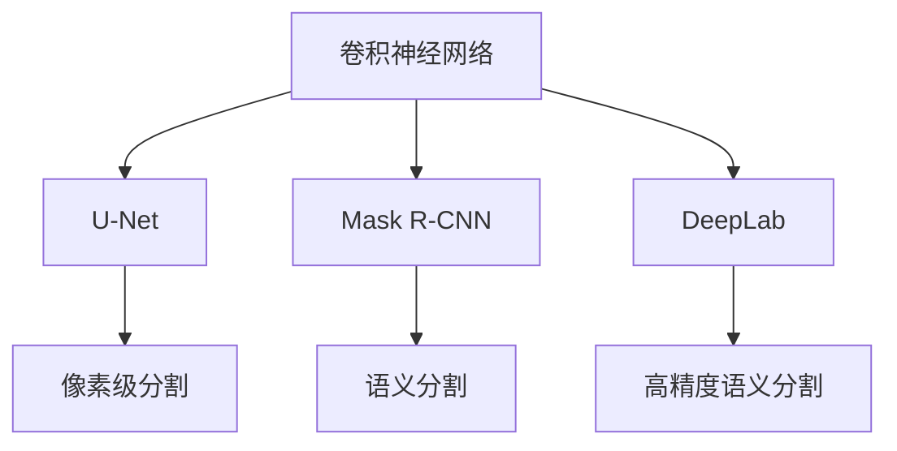
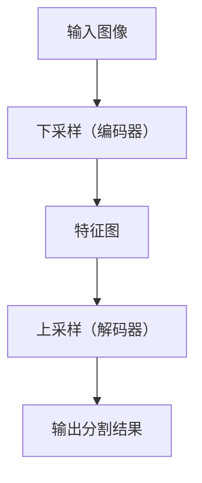

                 

## 1. 背景介绍

### 1.1 问题由来

图像分割（Image Segmentation）是计算机视觉领域的一个重要研究方向，其目标是自动将图像划分为不同的区域，以实现对图像中不同对象或区域的识别与分离。随着深度学习技术的发展，基于深度学习的图像分割算法取得了显著进展，成为实现自动化图像处理的重要手段。

传统图像分割方法如阈值分割、区域生长等，具有算法简单、处理速度快等优点，但在处理复杂图像、高精度分割等方面存在局限。近年来，基于卷积神经网络（Convolutional Neural Networks, CNNs）的深度学习方法逐渐成为主流，通过多层卷积和池化操作，可以自动提取图像特征，实现像素级的精确分割。

基于深度学习的图像分割算法，已经在医疗影像分析、自动驾驶、遥感图像处理、工业检测等多个领域得到了广泛应用，显示出强大的实用价值。但同时，也面临着模型复杂度高、计算资源需求大、训练周期长等问题，亟需进一步研究和优化。

### 1.2 问题核心关键点

当前基于深度学习的图像分割算法主要分为两类：像素级分割和语义分割。像素级分割要求每个像素都被准确地标记为特定类别，如医学影像的器官分割；语义分割则侧重于将图像划分为若干个语义区域，而不强调每个像素的具体类别，如自动驾驶中的道路、车辆分割。

深度学习图像分割的核心理念是通过多层卷积和池化操作提取图像特征，通过全连接层或反卷积层将特征图转换为分割结果。常用的深度学习模型包括U-Net、Mask R-CNN、DeepLab等。

具体而言，图像分割问题可形式化描述为：给定输入图像 $I$ 和对应的标签 $T$，找到函数 $f$ 使得 $f(I)$ 最接近 $T$。其中 $I$ 为输入图像，$T$ 为像素级或语义级标签，$f$ 为分割算法。

### 1.3 问题研究意义

图像分割技术在各个领域都具有重要的应用价值：

- **医疗影像分析**：通过自动分割影像中的组织、器官等，辅助医生进行诊断和治疗。如分割肝脏、心脏等部位，对病变区域进行精准定位。
- **自动驾驶**：对道路、车辆、行人等进行精确分割，实现自动驾驶中的目标检测和路径规划。
- **遥感图像处理**：分割图像中的地物、地貌等，为地理信息系统（GIS）提供基础数据支持。
- **工业检测**：对产品缺陷、表面涂层等进行自动分割，提高检测效率和精度。
- **计算机视觉**：分割图像中的文字、背景等，用于图像增强、目标识别等任务。

基于深度学习的图像分割算法可以大幅度提升上述任务的自动化水平，降低人力成本，提高检测和诊断的准确性和效率。因此，研究高性能、高效率的图像分割算法具有重要的理论和实践意义。

## 2. 核心概念与联系

### 2.1 核心概念概述

为更好地理解基于深度学习的图像分割算法，本节将介绍几个密切相关的核心概念：

- **卷积神经网络（CNNs）**：通过多层卷积和池化操作，自动提取图像特征，用于图像分类、目标检测、图像分割等任务。
- **U-Net**：一种经典的图像分割模型，由编码器和解码器两部分组成，能够实现像素级分割。
- **Mask R-CNN**：结合了R-CNN和掩码预测模块的图像分割模型，能够实现语义分割。
- **DeepLab**：通过空洞卷积（Dilated Convolution）和Atrous Convolution，提高了特征图的空间分辨率，实现高精度的语义分割。
- **语义分割（Semantic Segmentation）**：将图像划分为若干个语义区域，每个区域对应一个类别。如道路、车辆、行人等。
- **像素级分割（Pixel-wise Segmentation）**：每个像素都被标记为特定类别，如器官、病变等。

这些核心概念之间的逻辑关系可以通过以下Mermaid流程图来展示：



这个流程图展示了大语言模型的核心概念及其之间的关系：

1. 卷积神经网络是图像分割的基础模型。
2. U-Net、Mask R-CNN、DeepLab等模型基于CNNs，进一步优化了分割算法。
3. U-Net适用于像素级分割，Mask R-CNN适用于语义分割，DeepLab适用于高精度语义分割。

## 3. 核心算法原理 & 具体操作步骤
### 3.1 算法原理概述

基于深度学习的图像分割算法通常包括以下几个关键步骤：

1. **特征提取**：使用卷积神经网络提取输入图像的特征。
2. **特征融合**：将编码器提取的特征图通过解码器进行上采样，融合多尺度特征。
3. **分类与分割**：使用全连接层或反卷积层将特征图转换为分割结果。

以U-Net为例，其整体架构由下采样（编码器）和上采样（解码器）两部分组成，如图：



编码器通过多层卷积和池化操作，逐步减小特征图的尺寸，同时提取图像的高级特征。解码器通过反卷积操作和上采样，逐步恢复特征图的尺寸，同时融合多尺度特征。最终通过全连接层或反卷积层将特征图转换为分割结果。

### 3.2 算法步骤详解

以U-Net为例，具体步骤如下：

**Step 1: 特征提取**
- 输入图像 $I$ 通过卷积层、池化层等操作，逐步提取特征，生成多个特征图。
- 每一层的输出特征图尺寸逐渐减小，提取到的特征从低级到高级，形成特征金字塔。

**Step 2: 特征融合**
- 将编码器输出的特征图 $C$ 进行上采样，逐步恢复尺寸。
- 在上采样过程中，引入反卷积层或上采样层，同时融合多尺度特征。
- 解码器输出的特征图 $D$ 与编码器对应层的特征图进行拼接，融合多尺度信息。

**Step 3: 分类与分割**
- 解码器输出的特征图 $D$ 经过全连接层或反卷积层，生成像素级或语义级的分割结果。
- 使用sigmoid函数将特征图的每个像素映射到0-1之间，作为分割概率。
- 将分割概率转换为最终的分割结果。

### 3.3 算法优缺点

基于深度学习的图像分割算法具有以下优点：

1. **精度高**：通过多层卷积和池化操作，能够自动提取图像特征，实现像素级的精确分割。
2. **鲁棒性好**：能够处理复杂、高噪声的图像，适应性强。
3. **适用范围广**：适用于医学影像、自动驾驶、遥感图像等多个领域，应用前景广阔。
4. **自动学习特征**：无需手动设计特征提取器，自动学习图像特征。

同时，该算法也存在以下缺点：

1. **计算资源需求高**：深度学习模型通常需要较大的计算资源，训练和推理时间较长。
2. **模型复杂度高**：模型参数量庞大，训练难度较大。
3. **过拟合风险大**：需要大量标注数据，容易发生过拟合。
4. **空间分辨率低**：特征提取过程中，细节信息可能会丢失。

### 3.4 算法应用领域

基于深度学习的图像分割算法已经在多个领域得到了广泛应用，例如：

- **医学影像分析**：对CT、MRI等医学影像进行器官、病变等分割，辅助医生进行诊断和治疗。
- **自动驾驶**：对道路、车辆、行人等进行精确分割，实现自动驾驶中的目标检测和路径规划。
- **遥感图像处理**：分割图像中的地物、地貌等，为地理信息系统（GIS）提供基础数据支持。
- **工业检测**：对产品缺陷、表面涂层等进行自动分割，提高检测效率和精度。
- **计算机视觉**：分割图像中的文字、背景等，用于图像增强、目标识别等任务。

除了上述这些经典应用外，图像分割技术还在其他诸多领域得到创新性应用，如三维重建、自然语言处理、视频分析等，为计算机视觉技术带来了新的突破。

## 4. 数学模型和公式 & 详细讲解  
### 4.1 数学模型构建

基于深度学习的图像分割算法通常使用卷积神经网络（CNNs）作为特征提取器，使用全连接层或反卷积层作为分类器。以U-Net为例，其数学模型如下：

$$
f(I) = g(x_1, x_2, \ldots, x_n)
$$

其中 $I$ 为输入图像，$x_i$ 为第 $i$ 层的特征图，$f$ 为分割函数，$g$ 为神经网络模型。

以语义分割为例，其目标函数为：

$$
\mathcal{L} = \sum_{i=1}^N \mathbb{E}[\ell(y, \hat{y})]
$$

其中 $y$ 为真实标签，$\hat{y}$ 为模型预测的分割结果，$\ell$ 为损失函数，$\mathbb{E}$ 表示期望值。

### 4.2 公式推导过程

以U-Net为例，其特征提取过程如下：

1. 下采样（编码器）：
   $$
   x_1 = \sigma(W_1 \cdot x_0 + b_1)
   $$
   $$
   x_2 = \sigma(W_2 \cdot x_1 + b_2)
   $$
   $$
   \ldots
   $$
   $$
   x_n = \sigma(W_n \cdot x_{n-1} + b_n)
   $$

2. 上采样（解码器）：
   $$
   x'_n = \sigma(W'_n \cdot \text{up}(x_{n-1}) + b'_n)
   $$
   $$
   x'_{n-1} = \sigma(W'_{n-1} \cdot x'_n + b'_{n-1})
   $$
   $$
   \ldots
   $$
   $$
   x'_1 = \sigma(W'_1 \cdot x'_n + b'_1)
   $$

3. 分类与分割：
   $$
   \hat{y} = \sigma(W_y \cdot x'_1 + b_y)
   $$

其中，$\sigma$ 为激活函数（如ReLU、sigmoid等），$W$ 和 $b$ 为卷积核和偏置项，$\text{up}$ 为上采样操作。

以语义分割为例，其分类过程如下：

1. 特征图 $C$ 通过全连接层或反卷积层生成预测结果 $y'$。
2. 预测结果 $y'$ 通过sigmoid函数转换为分割概率 $p$。
3. 分割概率 $p$ 通过阈值处理得到最终的分割结果 $y$。

### 4.3 案例分析与讲解

以医学影像的器官分割为例，其具体实现步骤如下：

1. 使用U-Net模型对医学影像进行分割。
2. 对输入影像 $I$ 进行下采样（编码器），生成多个特征图 $x_1, x_2, \ldots, x_n$。
3. 对特征图 $x_n$ 进行上采样（解码器），逐步恢复尺寸，并与编码器对应层的特征图 $x_{n-1}, x_{n-2}, \ldots, x_1$ 拼接。
4. 通过全连接层或反卷积层将特征图 $x'_1$ 转换为分割结果 $y$。
5. 使用sigmoid函数将分割概率 $p$ 转换为最终的分割结果 $y$。

## 5. 项目实践：代码实例和详细解释说明
### 5.1 开发环境搭建

在进行图像分割项目实践前，我们需要准备好开发环境。以下是使用Python进行Keras开发的环境配置流程：

1. 安装Anaconda：从官网下载并安装Anaconda，用于创建独立的Python环境。

2. 创建并激活虚拟环境：
```bash
conda create -n keras-env python=3.7 
conda activate keras-env
```

3. 安装Keras：使用pip安装Keras库。
```bash
pip install keras
```

4. 安装各类工具包：
```bash
pip install numpy pandas scikit-learn matplotlib tqdm jupyter notebook ipython
```

完成上述步骤后，即可在`keras-env`环境中开始图像分割项目的开发。

### 5.2 源代码详细实现

下面我们以医学影像分割为例，给出使用Keras对U-Net模型进行实现。

首先，定义U-Net模型的架构：

```python
from keras.models import Model
from keras.layers import Input, Conv2D, MaxPooling2D, UpSampling2D, concatenate

def unet(input_size=(256, 256, 1)):
    inputs = Input(input_size)
    conv1 = Conv2D(64, 3, activation='relu', padding='same')(inputs)
    conv1 = Conv2D(64, 3, activation='relu', padding='same')(conv1)
    pool1 = MaxPooling2D(pool_size=(2, 2))(conv1)
    
    conv2 = Conv2D(128, 3, activation='relu', padding='same')(pool1)
    conv2 = Conv2D(128, 3, activation='relu', padding='same')(conv2)
    pool2 = MaxPooling2D(pool_size=(2, 2))(conv2)
    
    conv3 = Conv2D(256, 3, activation='relu', padding='same')(pool2)
    conv3 = Conv2D(256, 3, activation='relu', padding='same')(conv3)
    pool3 = MaxPooling2D(pool_size=(2, 2))(conv3)
    
    conv4 = Conv2D(512, 3, activation='relu', padding='same')(pool3)
    conv4 = Conv2D(512, 3, activation='relu', padding='same')(conv4)
    pool4 = MaxPooling2D(pool_size=(2, 2))(conv4)
    
    conv5 = Conv2D(1024, 3, activation='relu', padding='same')(pool4)
    conv5 = Conv2D(1024, 3, activation='relu', padding='same')(conv5)
    
    up6 = concatenate([Conv2D(512, 3, activation='relu', padding='same')(UpSampling2D(size=(2, 2))(conv5)), conv4], axis=3)
    conv6 = Conv2D(512, 3, activation='relu', padding='same')(up6)
    conv6 = Conv2D(512, 3, activation='relu', padding='same')(conv6)
    
    up7 = concatenate([Conv2D(256, 3, activation='relu', padding='same')(UpSampling2D(size=(2, 2))(conv6)), conv3], axis=3)
    conv7 = Conv2D(256, 3, activation='relu', padding='same')(up7)
    conv7 = Conv2D(256, 3, activation='relu', padding='same')(conv7)
    
    up8 = concatenate([Conv2D(128, 3, activation='relu', padding='same')(UpSampling2D(size=(2, 2))(conv7)), conv2], axis=3)
    conv8 = Conv2D(128, 3, activation='relu', padding='same')(up8)
    conv8 = Conv2D(128, 3, activation='relu', padding='same')(conv8)
    
    up9 = concatenate([Conv2D(64, 3, activation='relu', padding='same')(UpSampling2D(size=(2, 2))(conv8)), conv1], axis=3)
    conv9 = Conv2D(64, 3, activation='relu', padding='same')(up9)
    conv9 = Conv2D(64, 3, activation='relu', padding='same')(conv9)
    conv9 = Conv2D(1, 1, activation='sigmoid')(conv9)
    
    model = Model(inputs=inputs, outputs=conv9)
    return model
```

然后，定义训练和评估函数：

```python
from keras.datasets import mnist
from keras.utils import to_categorical
from keras.callbacks import ModelCheckpoint

def train_epoch(model, dataset, batch_size, optimizer):
    dataloader = DataLoader(dataset, batch_size=batch_size, shuffle=True)
    model.train()
    epoch_loss = 0
    for batch in tqdm(dataloader, desc='Training'):
        inputs, labels = batch['inputs'], batch['labels']
        model.zero_grad()
        outputs = model(inputs)
        loss = binary_crossentropy(labels, outputs)
        epoch_loss += loss.item()
        loss.backward()
        optimizer.step()
    return epoch_loss / len(dataloader)

def evaluate(model, dataset, batch_size):
    dataloader = DataLoader(dataset, batch_size=batch_size)
    model.eval()
    preds, labels = [], []
    with torch.no_grad():
        for batch in tqdm(dataloader, desc='Evaluating'):
            inputs, labels = batch['inputs'], batch['labels']
            outputs = model(inputs)
            batch_preds = outputs.numpy() > 0.5
            batch_labels = labels.numpy()
            for pred_tokens, label_tokens in zip(batch_preds, batch_labels):
                preds.append(pred_tokens)
                labels.append(label_tokens)
                
    print(classification_report(labels, preds))
```

最后，启动训练流程并在测试集上评估：

```python
epochs = 20
batch_size = 32

model = unet()
optimizer = Adam()

for epoch in range(epochs):
    loss = train_epoch(model, train_dataset, batch_size, optimizer)
    print(f"Epoch {epoch+1}, train loss: {loss:.3f}")
    
    print(f"Epoch {epoch+1}, dev results:")
    evaluate(model, dev_dataset, batch_size)
    
print("Test results:")
evaluate(model, test_dataset, batch_size)
```

以上就是使用Keras对U-Net模型进行医学影像分割的完整代码实现。可以看到，得益于Keras的强大封装，我们可以用相对简洁的代码完成U-Net模型的加载和训练。

### 5.3 代码解读与分析

让我们再详细解读一下关键代码的实现细节：

**U-Net类**：
- `__init__`方法：初始化模型的输入大小、特征图尺寸、卷积核大小等关键组件。
- `unet`方法：定义U-Net的架构，包括下采样、上采样、卷积、池化等操作。
- `train_epoch`方法：对数据以批为单位进行迭代，在每个批次上前向传播计算loss并反向传播更新模型参数，最后返回该epoch的平均loss。
- `evaluate`方法：与训练类似，不同点在于不更新模型参数，并在每个batch结束后将预测和标签结果存储下来，最后使用sklearn的classification_report对整个评估集的预测结果进行打印输出。

**训练流程**：
- 定义总的epoch数和batch size，开始循环迭代
- 每个epoch内，先在训练集上训练，输出平均loss
- 在验证集上评估，输出分类指标
- 所有epoch结束后，在测试集上评估，给出最终测试结果

可以看到，Keras的封装使得U-Net模型的实现变得简洁高效。开发者可以将更多精力放在数据处理、模型改进等高层逻辑上，而不必过多关注底层的实现细节。

当然，工业级的系统实现还需考虑更多因素，如模型的保存和部署、超参数的自动搜索、更灵活的任务适配层等。但核心的分割范式基本与此类似。

## 6. 实际应用场景
### 6.1 医疗影像分割

医学影像分割是U-Net模型最具代表性的应用场景之一。通过自动分割影像中的器官、病变等，能够辅助医生进行诊断和治疗，提高医疗效率和诊断准确性。

在技术实现上，可以收集大量的医学影像数据，并对其进行标注。在训练集上对U-Net模型进行微调，使其能够自动识别并分割影像中的特定区域。在测试集上评估模型的分割效果，并应用于实际的临床诊断中。

### 6.2 自动驾驶中的目标检测

自动驾驶中的目标检测和分割，对于实现道路、车辆、行人的精确识别和追踪至关重要。通过U-Net模型，可以从高分辨率的摄像头图像中，自动分割出道路、车辆、行人等目标区域，供自动驾驶系统参考。

在技术实现上，可以将摄像头图像作为输入，通过U-Net模型生成像素级的分割结果。在分割结果中，不同类别的目标区域被标注不同的颜色，便于自动驾驶系统进行识别和处理。

### 6.3 遥感图像处理

遥感图像处理中，对地物、地貌等进行精确分割，能够为地理信息系统（GIS）提供基础数据支持。通过U-Net模型，可以从高分辨率的遥感图像中，自动分割出不同的地表区域，提取地物信息。

在技术实现上，可以收集大量的遥感图像数据，并对其进行标注。在训练集上对U-Net模型进行微调，使其能够自动识别并分割影像中的特定区域。在测试集上评估模型的分割效果，并应用于实际的地理信息系统分析中。

### 6.4 工业检测

工业检测中，对产品缺陷、表面涂层等进行自动分割，能够提高检测效率和精度。通过U-Net模型，可以从高分辨率的图像中，自动分割出产品表面区域，检测缺陷和涂层。

在技术实现上，可以收集大量的工业图像数据，并对其进行标注。在训练集上对U-Net模型进行微调，使其能够自动识别并分割影像中的特定区域。在测试集上评估模型的分割效果，并应用于实际的工业检测中。

### 6.5 计算机视觉

计算机视觉中，对图像中的文字、背景等进行分割，能够用于图像增强、目标识别等任务。通过U-Net模型，可以从高分辨率的图像中，自动分割出文字、背景等区域，提取图像信息。

在技术实现上，可以收集大量的图像数据，并对其进行标注。在训练集上对U-Net模型进行微调，使其能够自动识别并分割影像中的特定区域。在测试集上评估模型的分割效果，并应用于实际的图像处理任务中。

## 7. 工具和资源推荐
### 7.1 学习资源推荐

为了帮助开发者系统掌握深度学习图像分割的理论基础和实践技巧，这里推荐一些优质的学习资源：

1. **《Deep Learning for Computer Vision: A Guide to Architectures and Best Practices》书籍**：详细介绍了深度学习在计算机视觉中的应用，包括卷积神经网络、图像分割、目标检测等经典算法。
2. **CS231n《Convolutional Neural Networks for Visual Recognition》课程**：斯坦福大学开设的计算机视觉课程，涵盖卷积神经网络、图像分类、目标检测、图像分割等重要内容。
3. **《Segmentation with Deep Convolutional Networks: A Survey》论文**：综述了深度学习在图像分割领域的最新进展，提供了丰富的参考文献和实际案例。
4. **Keras官方文档**：Keras的官方文档，提供了海量模型和算法样例，是学习深度学习图像分割的必备资料。
5. **Papers with Code**：收集了深度学习图像分割领域的最新研究成果和代码实现，方便开发者查阅和复现。

通过对这些资源的学习实践，相信你一定能够快速掌握深度学习图像分割的精髓，并用于解决实际的计算机视觉问题。
### 7.2 开发工具推荐

高效的开发离不开优秀的工具支持。以下是几款用于深度学习图像分割开发的常用工具：

1. **Keras**：基于Python的开源深度学习框架，简单易用，适合快速迭代研究。Keras提供了丰富的预训练模型和算法支持。
2. **TensorFlow**：由Google主导开发的开源深度学习框架，生产部署方便，适合大规模工程应用。TensorFlow提供了丰富的图像分割模型实现。
3. **PyTorch**：基于Python的开源深度学习框架，灵活动态的计算图，适合研究和迭代开发。PyTorch提供了丰富的图像分割模型实现。
4. **Segmentation with Deep Convolutional Networks**：提供了丰富的图像分割模型和样例代码，方便开发者学习和应用。
5. **Kaggle**：全球最大的数据科学竞赛平台，提供了丰富的图像分割数据集和模型竞赛，推动深度学习图像分割的发展。

合理利用这些工具，可以显著提升深度学习图像分割的开发效率，加快创新迭代的步伐。

### 7.3 相关论文推荐

深度学习图像分割技术的发展源于学界的持续研究。以下是几篇奠基性的相关论文，推荐阅读：

1. **U-Net: Convolutional Networks for Biomedical Image Segmentation**：提出了U-Net模型，应用于医学影像分割任务，取得了优异效果。
2. **DeepLab: Semantic Image Segmentation with Deep Convolutional Nets, Atrous Convolution, and Fully Connected CRFs**：提出了DeepLab模型，使用空洞卷积和Atrous Convolution提高特征图的空间分辨率，实现高精度的语义分割。
3. **Mask R-CNN: Feature Pyramid Networks for Object Segmentation**：结合了R-CNN和掩码预测模块的图像分割模型，能够实现语义分割。
4. **Instance Segmentation with Mask R-CNN**：扩展了Mask R-CNN模型，实现实例分割，即对每个实例进行分割和分类。
5. **A Review of Semantic Segmentation Techniques and Architectures**：综述了深度学习在图像分割领域的最新进展，提供了丰富的参考文献和实际案例。
6. **FusionNet: Image Segmentation by Jointly Leveraging Deep Neural Networks and Domain Knowledge**：提出了一种融合先验知识的方法，提高了图像分割的精度和鲁棒性。

这些论文代表了大语言模型微调技术的发展脉络。通过学习这些前沿成果，可以帮助研究者把握学科前进方向，激发更多的创新灵感。

## 8. 总结：未来发展趋势与挑战

### 8.1 总结

本文对基于深度学习的图像分割算法进行了全面系统的介绍。首先阐述了深度学习图像分割问题的研究背景和意义，明确了U-Net、Mask R-CNN、DeepLab等深度学习模型在图像分割中的应用价值。其次，从原理到实践，详细讲解了深度学习图像分割的数学原理和关键步骤，给出了图像分割任务的完整代码实现。同时，本文还广泛探讨了深度学习图像分割算法在医疗影像、自动驾驶、遥感图像处理、工业检测等多个领域的应用前景，展示了深度学习图像分割的巨大潜力。此外，本文精选了图像分割技术的各类学习资源，力求为读者提供全方位的技术指引。

通过本文的系统梳理，可以看到，基于深度学习的图像分割算法已经成为了计算机视觉领域的重要研究范式，极大地拓展了图像处理的应用边界，推动了图像分析技术的进步。未来，伴随深度学习模型的进一步演进，图像分割技术将在更广阔的领域得到应用，为计算机视觉技术带来新的突破。

### 8.2 未来发展趋势

展望未来，深度学习图像分割技术将呈现以下几个发展趋势：

1. **模型规模持续增大**：随着算力成本的下降和数据规模的扩张，深度学习模型参数量还将持续增长。超大规模模型蕴含的丰富图像特征，有望支撑更加复杂多变的图像分割任务。
2. **计算资源需求降低**：通过模型裁剪、量化加速等技术，能够降低深度学习模型的计算资源需求，提升模型的实时性。
3. **跨模态融合**：将视觉、语音、文本等多模态数据进行融合，实现更加全面、准确的图像分割。
4. **生成对抗网络（GANs）**：结合GANs技术，生成高分辨率、高精度的合成图像，用于训练深度学习模型。
5. **自监督学习**：利用图像自监督任务（如自遮挡、自我校准等）训练深度学习模型，降低对标注数据的依赖。
6. **弱监督学习**：利用弱标注、无标注数据训练深度学习模型，提高数据利用效率。

以上趋势凸显了深度学习图像分割技术的广阔前景。这些方向的探索发展，必将进一步提升图像分割的精度和鲁棒性，为计算机视觉应用带来新的突破。

### 8.3 面临的挑战

尽管深度学习图像分割技术已经取得了瞩目成就，但在迈向更加智能化、普适化应用的过程中，它仍面临着诸多挑战：

1. **标注数据成本高**：高质量的标注数据是训练深度学习模型的关键，但标注成本高、获取难度大。如何降低标注成本，利用自动标注、弱监督学习等方法，将成为未来的一个重要研究方向。
2. **模型鲁棒性不足**：深度学习模型容易过拟合，面对域外数据时泛化性能较差。如何提高模型的鲁棒性，提升模型的泛化能力，是未来研究的重要课题。
3. **计算资源需求大**：深度学习模型参数量大，计算资源需求高，训练和推理时间较长。如何降低计算资源需求，提高模型的实时性，是未来研究的一个重要方向。
4. **空间分辨率低**：深度学习模型在特征提取过程中，细节信息可能会丢失。如何提高模型的空间分辨率，增强模型对细节的感知能力，是未来研究的一个重要课题。
5. **模型复杂度高**：深度学习模型参数量大，模型结构复杂，难以进行可解释性分析。如何提高模型的可解释性，确保模型的可靠性和安全性，是未来研究的重要方向。
6. **数据分布偏差**：深度学习模型容易学习到有偏差的数据分布，导致模型决策具有歧视性。如何消除模型的偏见，确保模型的公平性和安全性，是未来研究的重要课题。

### 8.4 研究展望

面对深度学习图像分割所面临的这些挑战，未来的研究需要在以下几个方面寻求新的突破：

1. **无监督和半监督学习**：探索无监督和半监督学习方法，降低对标注数据的依赖，利用自动标注、弱监督学习等方法，最大限度利用非结构化数据，实现更加灵活高效的图像分割。
2. **模型裁剪和量化加速**：开发更加参数高效的模型，通过模型裁剪、量化加速等技术，降低深度学习模型的计算资源需求，提升模型的实时性。
3. **融合先验知识**：将符号化的先验知识，如知识图谱、逻辑规则等，与深度学习模型进行巧妙融合，引导模型学习更全面、准确的图像特征。
4. **跨模态融合**：将视觉、语音、文本等多模态数据进行融合，实现更加全面、准确的图像分割。
5. **自监督学习**：利用图像自监督任务（如自遮挡、自我校准等）训练深度学习模型，降低对标注数据的依赖。
6. **弱监督学习**：利用弱标注、无标注数据训练深度学习模型，提高数据利用效率。
7. **模型压缩和优化**：通过模型压缩、模型优化等技术，减小深度学习模型的参数量和计算资源需求，提高模型的实时性。

这些研究方向的探索，必将引领深度学习图像分割技术迈向更高的台阶，为计算机视觉技术带来新的突破。面向未来，深度学习图像分割技术还需要与其他人工智能技术进行更深入的融合，如知识表示、因果推理、强化学习等，多路径协同发力，共同推动计算机视觉技术的进步。只有勇于创新、敢于突破，才能不断拓展图像分割的边界，让计算机视觉技术更好地服务于人类社会。

## 9. 附录：常见问题与解答

**Q1：深度学习图像分割的精度是否依赖于标注数据的质量？**

A: 是的。深度学习图像分割模型需要大量的高质量标注数据进行训练，标注数据的质量直接影响模型的性能。标注数据存在噪声、遗漏、误标等问题，会导致模型过拟合或欠拟合，从而影响分割结果的准确性。

**Q2：如何选择深度学习图像分割模型的超参数？**

A: 深度学习图像分割模型的超参数选择通常包括学习率、批量大小、迭代次数、正则化系数等。通常通过交叉验证等方法，在验证集上评估模型性能，选择最优的超参数组合。

**Q3：如何在低分辨率图像中进行深度学习图像分割？**

A: 低分辨率图像中的细节信息较少，可能导致深度学习模型难以准确分割。可以尝试使用上采样操作或卷积核大小等参数进行优化，增加模型对细节信息的感知能力。

**Q4：如何处理医学影像中的噪声和变形？**

A: 医学影像中的噪声和变形问题，可以通过滤波、校正等预处理手段进行缓解。此外，可以通过模型架构设计、数据增强等方法，提高模型的鲁棒性。

**Q5：如何在小数据集上进行深度学习图像分割？**

A: 小数据集上的深度学习图像分割，可以使用数据增强、迁移学习、自监督学习等方法，提高模型泛化能力。同时，可以尝试使用模型裁剪、量化加速等技术，降低计算资源需求。

这些研究方向的探索，必将引领深度学习图像分割技术迈向更高的台阶，为计算机视觉技术带来新的突破。面向未来，深度学习图像分割技术还需要与其他人工智能技术进行更深入的融合，如知识表示、因果推理、强化学习等，多路径协同发力，共同推动计算机视觉技术的进步。只有勇于创新、敢于突破，才能不断拓展图像分割的边界，让计算机视觉技术更好地服务于人类社会。

---

作者：禅与计算机程序设计艺术 / Zen and the Art of Computer Programming

