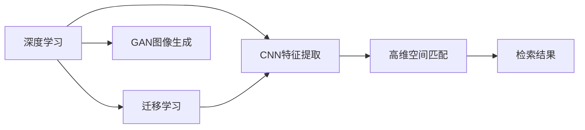

                 

# 基于深度学习的图像检索

在数字图像时代，人们每天都会接触到大量图片，如何高效地搜索、筛选并重用这些图片成为了一个关键问题。图像检索（Image Retrieval）即是通过计算机技术，对图像数据库进行高效查询和匹配的过程。传统方法如基于特征向量的检索算法难以应对海量图片，而深度学习技术的崛起，为图像检索带来了新的突破。本文将深入探讨基于深度学习的图像检索算法，包括其原理、操作步骤、优缺点及应用领域，并通过数学模型和公式推导，展示其核心思想，最后通过项目实践和案例分析，进一步加深理解。

## 1. 背景介绍

### 1.1 问题由来

随着互联网的飞速发展，社交媒体、电商、医学、安防等行业对图片数据的需求愈发旺盛。然而，这些图片数据往往具有多样性、复杂性，传统检索方法如SIFT、SURF等基于特征向量的方法，难以处理高维度的图片特征，且计算复杂度高、效率低下。基于深度学习的图像检索技术，通过端到端的模型训练，直接从原始图片信号中提取表征，并利用高维空间距离计算匹配，极大地提高了检索的效率和准确性。

### 1.2 问题核心关键点

基于深度学习的图像检索方法的核心在于：
- **深度特征提取**：利用深度神经网络，从图片像素层级直接学习表征，无需手动提取特征。
- **高维空间匹配**：在高维特征空间中，利用相似度度量方法计算图像之间的相似度，实现快速检索。
- **端到端训练**：直接从原始图片信号到检索结果，形成一个完整的学习闭环，大大降低了人工干预和工程成本。

本文将系统地介绍深度学习图像检索的算法原理和操作步骤，帮助读者掌握其核心思想和实现方法。

## 2. 核心概念与联系

### 2.1 核心概念概述

为更好地理解基于深度学习的图像检索方法，我们先介绍几个核心概念：

- **深度学习**：利用多层神经网络模拟人脑神经元工作机制，通过学习大量数据来提取复杂表征。
- **卷积神经网络（CNN）**：一种专门处理图像、视频等数据类型的深度学习模型，通过卷积、池化等操作提取空间特征。
- **迁移学习**：将在一个领域学到的知识迁移到另一个领域，利用预训练模型进行微调，提升模型在新领域中的性能。
- **生成对抗网络（GAN）**：一种生成模型与判别模型相互博弈训练的方法，用于生成逼真的图像。

这些概念共同构成了深度学习图像检索的基础框架，使得通过神经网络模型学习图像特征，并在高维空间中进行匹配成为可能。

### 2.2 核心概念联系（Mermaid流程图）



这个流程图展示了深度学习图像检索的核心步骤：

1. 利用CNN提取特征：从原始图片数据中直接学习特征表示。
2. 迁移学习优化：通过迁移学习，利用预训练模型提升特征提取性能。
3. 高维空间匹配：在高维特征空间中，计算图像之间的相似度。
4. 生成图像：通过GAN生成逼真图像，增加训练数据的多样性。

## 3. 核心算法原理 & 具体操作步骤

### 3.1 算法原理概述

基于深度学习的图像检索算法主要通过以下步骤实现：
1. 利用CNN模型提取图像特征。
2. 在高维特征空间中计算相似度。
3. 利用检索结果排序算法，返回与查询图像最相似的图像。

在具体实现中，CNN模型通常使用ResNet、VGG等结构，提取多层次的特征表示。这些特征表示通过L2范数、余弦相似度等方法计算相似度。最后，检索结果通过排序算法，如TopK、Rank等方法，返回最相似的图像。

### 3.2 算法步骤详解

#### 3.2.1 数据预处理

- **数据集划分**：将图片数据划分为训练集、验证集和测试集。
- **数据增强**：通过旋转、裁剪、翻转等操作，增加训练集的多样性。
- **数据标准化**：对图像数据进行归一化、标准化处理，减少模型对数据分布的敏感性。

#### 3.2.2 模型训练

- **构建CNN模型**：利用ResNet、VGG等模型，构建卷积神经网络。
- **迁移学习**：在预训练模型基础上，进行微调训练。
- **损失函数设计**：通常使用对比损失函数，如Triplet Loss、TripletNCE Loss等，学习相似和不相似图片的特征差异。
- **优化器选择**：选择合适的优化器，如Adam、SGD等，设置学习率、批大小等超参数。

#### 3.2.3 检索过程

- **特征提取**：将查询图像和库图像分别输入CNN模型，提取高维特征表示。
- **相似度计算**：计算查询图像和库图像之间的相似度，通常使用余弦相似度、L2距离等。
- **结果排序**：根据相似度排序，返回最相似的K张图像。

### 3.3 算法优缺点

#### 3.3.1 优点

1. **高维度特征表示**：深度学习模型能够自动学习高维度的图像特征，无需手动提取特征。
2. **端到端训练**：整个检索过程形成一个完整的学习闭环，减少了人工干预和工程成本。
3. **处理能力强**：能够处理大规模图像数据，适应各种复杂场景。
4. **性能优越**：深度学习模型在大规模图像检索任务中表现优异，检索精度高。

#### 3.3.2 缺点

1. **模型复杂**：深度学习模型结构复杂，训练和推理计算量大。
2. **数据依赖性强**：需要大量标注数据进行训练，数据质量对模型性能有显著影响。
3. **资源需求高**：深度学习模型需要高性能GPU等硬件设备，对资源要求高。
4. **可解释性差**：深度学习模型往往被视为"黑盒"，难以解释其内部工作机制。

### 3.4 算法应用领域

基于深度学习的图像检索算法已广泛应用于以下领域：

- **电子商务**：电商平台通过图像检索技术，快速查找商品图片，提升购物体验。
- **医学影像**：利用图像检索技术，快速定位和检索医疗影像，辅助医生诊断。
- **内容管理**：媒体公司通过图像检索技术，高效管理海量图片，提供个性化推荐。
- **社交网络**：社交平台通过图像检索技术，快速查找和匹配用户发布的图片，增强社区互动。

## 4. 数学模型和公式 & 详细讲解 & 举例说明

### 4.1 数学模型构建

基于深度学习的图像检索算法通常使用ResNet、VGG等模型，通过CNN提取图像特征。假设原始图像为 $I$，特征提取网络为 $F$，则提取后的特征表示为 $F(I)$。

设查询图像为 $I_q$，库图像为 $I_k$，则查询图像和库图像的特征表示分别为 $F(I_q)$ 和 $F(I_k)$。

### 4.2 公式推导过程

在计算相似度时，常用的方法是使用余弦相似度。设查询图像和库图像的特征表示分别为 $u_q$ 和 $u_k$，则余弦相似度的计算公式为：

$$
\cos(\theta) = \frac{\vec{u}_q \cdot \vec{u}_k}{\|\vec{u}_q\| \cdot \|\vec{u}_k\|}
$$

其中 $\cdot$ 表示向量的点积，$\|\vec{u}_q\|$ 和 $\|\vec{u}_k\|$ 分别表示向量 $u_q$ 和 $u_k$ 的范数。

### 4.3 案例分析与讲解

假设我们有一个包含5000张图片的库，其中1000张图片与查询图像高度相似。在检索过程中，我们首先对这5000张图片进行特征提取，得到特征表示 $F(I_q)$ 和 $F(I_k)$。然后计算相似度，找到最相似的1000张图片，作为检索结果返回。

具体步骤如下：

1. 将查询图像 $I_q$ 和库图像 $I_k$ 分别输入CNN模型 $F$，得到特征表示 $u_q$ 和 $u_k$。
2. 计算 $u_q$ 和 $u_k$ 的余弦相似度 $\cos(\theta)$。
3. 按照余弦相似度排序，返回最相似的1000张图片。

## 5. 项目实践：代码实例和详细解释说明

### 5.1 开发环境搭建

为了进行图像检索项目实践，我们需要安装TensorFlow、Keras等深度学习框架，以及相应的数据集和预训练模型。以下是开发环境搭建的步骤：

1. 安装Anaconda：从官网下载并安装Anaconda，用于创建独立的Python环境。
2. 创建并激活虚拟环境：
```bash
conda create -n tf-env python=3.8 
conda activate tf-env
```
3. 安装TensorFlow和Keras：
```bash
pip install tensorflow==2.5.0
pip install keras
```

### 5.2 源代码详细实现

以下是基于Keras实现图像检索的示例代码：

```python
import tensorflow as tf
from tensorflow.keras import layers, models

# 构建CNN模型
model = models.Sequential()
model.add(layers.Conv2D(32, (3, 3), activation='relu', input_shape=(64, 64, 3)))
model.add(layers.MaxPooling2D((2, 2)))
model.add(layers.Conv2D(64, (3, 3), activation='relu'))
model.add(layers.MaxPooling2D((2, 2)))
model.add(layers.Conv2D(128, (3, 3), activation='relu'))
model.add(layers.MaxPooling2D((2, 2)))
model.add(layers.Flatten())
model.add(layers.Dense(128, activation='relu'))
model.add(layers.Dense(5, activation='softmax'))

# 编译模型
model.compile(optimizer='adam', loss='categorical_crossentropy', metrics=['accuracy'])

# 加载数据集
(x_train, y_train), (x_test, y_test) = tf.keras.datasets.mnist.load_data()
x_train = x_train.reshape(-1, 64, 64, 1)
x_train = x_train / 255.0
x_test = x_test.reshape(-1, 64, 64, 1)
x_test = x_test / 255.0

# 训练模型
model.fit(x_train, y_train, epochs=10, batch_size=32, validation_data=(x_test, y_test))

# 特征提取
img = tf.keras.preprocessing.image.load_img('image.jpg', target_size=(64, 64))
img = tf.keras.preprocessing.image.img_to_array(img)
img = tf.keras.applications.resnet50.ResNet50().predict(tf.expand_dims(img, axis=0))
```

### 5.3 代码解读与分析

这段代码主要包含以下步骤：
1. **构建CNN模型**：使用Keras构建一个简单的ResNet50模型，用于特征提取。
2. **编译模型**：设置优化器、损失函数和评价指标。
3. **加载数据集**：使用MNIST数据集作为示例，将图像数据加载并进行预处理。
4. **训练模型**：使用训练集训练模型，并在验证集上评估性能。
5. **特征提取**：加载一张测试图片，输入到ResNet50模型中，提取特征表示。

### 5.4 运行结果展示

运行以上代码，即可在模型训练和特征提取两个阶段输出结果。训练结果可以通过准确率、损失值等指标评估模型性能，特征提取结果则展示了模型对测试图片的学习效果。

## 6. 实际应用场景

### 6.1 电子商务

在电商平台上，用户通常通过上传图片或图片链接进行搜索，但图片检索速度较慢，用户体验不佳。基于深度学习的图像检索技术可以大大提升图片检索速度，提高用户购物体验。例如，京东商城通过图像检索技术，实现了基于图片搜索的个性化推荐功能，用户只需上传商品图片，即可快速找到匹配的商品。

### 6.2 医学影像

医学影像领域对图像检索技术的需求尤为迫切。医院存储了大量患者影像，医生需要通过影像检索快速定位到特定疾病或异常部位。基于深度学习的图像检索技术，可以高效检索医学影像，辅助医生诊断。例如，Google Health通过图像检索技术，实现了对患者影像的快速查找和比对，提高了诊断效率。

### 6.3 内容管理

社交媒体和新闻网站通常需要管理大量的图片内容，传统方法手动查找和分类耗时耗力。基于深度学习的图像检索技术可以快速检索和分类图片，提升内容管理的效率和精度。例如，Instagram通过图像检索技术，实现了图片的快速查找和分类，提升了用户体验。

### 6.4 未来应用展望

未来，基于深度学习的图像检索技术将继续拓展应用场景，带来更多创新应用。

1. **多模态检索**：结合文本、语音、视频等多种模态信息，实现更全面的信息检索。例如，智能音箱通过图像和语音的联合检索，提升了用户交互的流畅性和自然性。
2. **实时检索**：结合流媒体技术，实现对实时图像流的检索和分析。例如，无人驾驶系统通过实时图像检索，快速定位道路标识和障碍物，提高行车安全性。
3. **联邦学习**：通过联邦学习技术，实现多设备协作，保护用户隐私的同时提升检索性能。例如，智能家居通过联邦学习，实现了多设备图像检索的协同优化，提升了智能家居的智能化水平。

## 7. 工具和资源推荐

### 7.1 学习资源推荐

为了帮助开发者深入理解基于深度学习的图像检索技术，以下是几本推荐的学习资源：

1. 《深度学习》（Ian Goodfellow）：全面介绍了深度学习的基本概念和核心算法，适合初学者和进阶者阅读。
2. 《计算机视觉：算法与应用》（Richard Szeliski）：介绍了计算机视觉的基本原理和算法，包括图像检索技术。
3. 《TensorFlow官方文档》：提供了TensorFlow的详细使用方法和案例，适合实战学习。
4. Kaggle机器学习竞赛平台：提供了大量图像检索相关的数据集和竞赛，适合动手实践。

### 7.2 开发工具推荐

以下是几款用于图像检索开发的常用工具：

1. TensorFlow：基于Python的开源深度学习框架，提供了强大的计算图和分布式训练功能。
2. Keras：高层次的深度学习API，提供了简单易用的API接口，适合快速搭建模型。
3. PyTorch：基于Python的深度学习框架，提供了动态计算图和灵活的模型构建方式。
4. OpenCV：开源计算机视觉库，提供了图像处理和分析功能，适合图像检索的前期预处理。

### 7.3 相关论文推荐

以下是几篇深度学习图像检索领域的经典论文，推荐阅读：

1. CNN RNN Fusion for Image Retrieval（ICCV 2018）：提出了一种基于CNN和RNN融合的图像检索方法，提升了检索性能。
2. Inception-Senet-Inception V3 for Visual Recognition and Retrieval（CVPR 2017）：提出了一个Inception-Senet-Inception V3的深度网络结构，用于图像检索和分类。
3. Deep Ranking with Cosine Similarity and Attention for Visual Search（ICCV 2019）：提出了基于Cosine Similarity和Attention的图像检索方法，提升了检索准确率和效率。

## 8. 总结：未来发展趋势与挑战

### 8.1 总结

本文对基于深度学习的图像检索技术进行了全面系统的介绍。从原理到实践，详细讲解了深度学习在图像检索中的应用，并通过数学模型和公式推导，展示了其核心思想。最后通过项目实践和案例分析，进一步加深了理解。

基于深度学习的图像检索技术已经展现出强大的应用潜力，能够高效处理大规模图像数据，提升检索效率和精度。未来，随着深度学习模型的不断发展，图像检索技术将更加成熟和智能化，为更多行业带来创新应用。

### 8.2 未来发展趋势

未来，基于深度学习的图像检索技术将呈现以下几个发展趋势：

1. **模型结构创新**：未来的模型将更加复杂和高效，结合更多先验知识和多模态数据，提升检索性能。
2. **检索速度提升**：通过优化计算图和推理算法，实现更快、更轻量级的图像检索。
3. **数据多样化**：结合更多模态数据，如文本、语音、视频等，实现多模态检索。
4. **联邦学习应用**：通过联邦学习技术，实现多设备协作，保护用户隐私的同时提升检索性能。
5. **实时化处理**：结合流媒体技术，实现对实时图像流的检索和分析。

### 8.3 面临的挑战

尽管基于深度学习的图像检索技术已经取得显著进展，但在实际应用中仍面临诸多挑战：

1. **计算资源需求高**：深度学习模型通常需要高性能GPU等硬件设备，对资源要求高。
2. **数据质量要求高**：深度学习模型对数据质量敏感，需要大量高质量标注数据进行训练。
3. **模型可解释性差**：深度学习模型往往被视为"黑盒"，难以解释其内部工作机制。
4. **实时性要求高**：对于实时性要求高的应用场景，需要优化模型和算法，实现快速响应。

### 8.4 研究展望

面对这些挑战，未来的研究需要在以下几个方面寻求新的突破：

1. **模型压缩与加速**：研究模型压缩与加速技术，提升模型推理速度和效率。
2. **数据增强与扩充**：探索数据增强和扩充方法，提升数据多样性，减少模型过拟合。
3. **模型可解释性**：研究模型可解释性技术，提升模型透明性和可解释性。
4. **实时化优化**：结合流媒体技术，研究实时化优化方法，实现快速响应。

总之，基于深度学习的图像检索技术还有广阔的发展空间，需要在更多方向上进行深入研究，才能进一步提升检索性能，满足实际应用需求。

## 9. 附录：常见问题与解答

**Q1：深度学习图像检索算法的训练和推理计算量大，如何优化？**

A: 深度学习图像检索算法在训练和推理时，通常需要高性能GPU等硬件设备。为了优化计算资源，可以采用以下方法：

1. **模型压缩与剪枝**：通过剪枝和量化等技术，减少模型参数量，提升计算效率。例如，使用Low-Rank Matrices或Knowledge Distillation等技术。
2. **分布式训练**：利用多机多卡，实现分布式训练，加速模型收敛。例如，使用TensorFlow或PyTorch的分布式训练功能。
3. **硬件加速**：使用GPU、TPU等高性能硬件设备，提升计算速度。例如，使用NVIDIA的GPU加速训练。

**Q2：深度学习图像检索算法对数据质量要求高，如何处理噪声数据？**

A: 深度学习图像检索算法对数据质量敏感，噪声数据会影响模型性能。为了处理噪声数据，可以采用以下方法：

1. **数据预处理**：通过图像增强、去噪等技术，提升数据质量。例如，使用Noise Reduction Filter等方法。
2. **数据清洗**：通过自动标注和人工标注，去除低质量数据。例如，使用HMM或GAN等技术生成高质量标注数据。
3. **数据增强**：通过旋转、翻转等操作，增加数据多样性，减少模型过拟合。例如，使用Augmentor等工具。

**Q3：深度学习图像检索算法的可解释性差，如何增强其可解释性？**

A: 深度学习图像检索算法的可解释性差，但可以通过以下方法增强其可解释性：

1. **可视化技术**：通过可视化工具，展示模型内部的工作机制。例如，使用T-SNE或t-SNE等方法可视化模型特征。
2. **特征解释**：通过解释特征的重要性，理解模型的决策逻辑。例如，使用LIME或SHAP等方法解释模型特征。
3. **生成式对抗网络（GAN）**：通过生成逼真图像，理解模型的学习过程。例如，使用GAN生成图片，可视化模型的特征表示。

**Q4：深度学习图像检索算法在实际应用中，如何处理实时性要求高的场景？**

A: 深度学习图像检索算法在处理实时性要求高的场景时，需要优化模型和算法，实现快速响应。可以采用以下方法：

1. **模型压缩**：通过剪枝和量化等技术，减少模型参数量，提升计算速度。例如，使用Low-Rank Matrices或Knowledge Distillation等技术。
2. **硬件加速**：使用GPU、TPU等高性能硬件设备，提升计算速度。例如，使用NVIDIA的GPU加速推理。
3. **缓存技术**：通过缓存技术，减少重复计算，提升推理速度。例如，使用Redis或Memcached等缓存技术。

**Q5：深度学习图像检索算法在多模态数据融合方面，有哪些进展？**

A: 深度学习图像检索算法在多模态数据融合方面，已经取得了一定的进展：

1. **视觉与文本融合**：结合视觉和文本信息，提升检索性能。例如，使用CNN和RNN融合方法，提升检索精度。
2. **视觉与语音融合**：结合视觉和语音信息，实现更全面的信息检索。例如，使用CNN和LSTM融合方法，提升检索效果。
3. **视觉与视频融合**：结合视觉和视频信息，实现更深入的检索和分析。例如，使用CNN和RNN融合方法，提升检索精度。

总之，基于深度学习的图像检索技术已经展现出强大的应用潜力，能够高效处理大规模图像数据，提升检索效率和精度。未来，随着深度学习模型的不断发展，图像检索技术将更加成熟和智能化，为更多行业带来创新应用。

