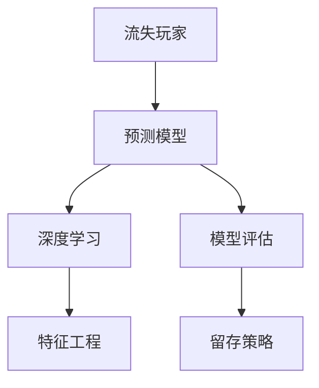

                 

# 基于深度学习的网络游戏流失玩家预测算法研究

> 关键词：网络游戏，流失玩家，预测模型，深度学习，特征工程，机器学习，游戏公司，用户行为分析，玩家流失率，留存策略

## 1. 背景介绍

### 1.1 问题由来

近年来，随着互联网和移动设备的普及，网络游戏市场迅速发展，成为全球娱乐产业的重要组成部分。然而，用户流失现象在网络游戏领域尤为严重，尤其是在免费游戏的用户人群中，高流失率是一个普遍存在的问题。据统计，多数免费游戏的用户流失率在50%以上，这意味着每两个用户中就有一个会在几个月内离开游戏。高流失率不仅影响了游戏公司的用户留存率和收益，还造成了资源浪费，增加了运营成本。因此，对玩家流失现象的预测和分析，对于游戏公司制定有效的留存策略具有重要意义。

### 1.2 问题核心关键点

针对玩家流失现象的预测，主要关注以下几个关键点：
- **数据采集与处理**：从游戏数据库中提取用户行为数据，并进行预处理。
- **特征工程**：通过分析用户行为数据，选择和构造对玩家流失有预测能力的特征。
- **模型选择与训练**：基于预测任务选择合适的深度学习模型，如神经网络、决策树、支持向量机等，并进行训练和调优。
- **模型评估与优化**：使用测试集对模型进行评估，并通过交叉验证等方法进行模型优化。
- **策略实施与反馈**：将模型应用于实际运营中，分析策略实施效果，并持续优化预测模型。

### 1.3 问题研究意义

对网络游戏流失玩家的预测，有助于游戏公司进行更精准的用户管理，制定有效的留存策略，降低流失率，提升用户生命周期价值。具体来说：

1. **用户生命周期价值（CLV）**：通过流失预测，游戏公司可以更好地识别潜在流失用户，采取措施提高用户粘性，从而提升用户生命周期价值。
2. **个性化推荐**：基于用户特征分析，提供个性化的游戏内容和推荐，增强用户体验，提高用户满意度和忠诚度。
3. **成本控制**：减少对非活跃用户的资源投入，优化营销和运营策略，降低运营成本。
4. **市场竞争力**：通过精准的流失预测，及时采取留存措施，增强市场竞争力，避免用户流失给竞争对手带来机会。

## 2. 核心概念与联系

### 2.1 核心概念概述

本节将介绍几个与流失预测密切相关的核心概念：

- **流失玩家（Churn Player）**：指那些在游戏平台不再活跃的玩家，不再登陆游戏、不再进行任何游戏相关的互动行为的玩家。
- **预测模型（Predictive Model）**：通过分析历史用户行为数据，构建模型预测未来玩家流失概率的机器学习模型。
- **深度学习（Deep Learning）**：一种机器学习技术，利用多层神经网络对数据进行层次化处理，提取数据中的高级特征。
- **特征工程（Feature Engineering）**：通过对原始数据进行特征选择、特征构造等操作，提取对模型预测有帮助的特征。
- **模型评估（Model Evaluation）**：通过测试集对模型进行评估，检验模型的预测能力，选择最优模型。
- **留存策略（Retention Strategy）**：基于预测结果，制定针对性的留存措施，如个性化推荐、积分奖励、专属活动等，提升用户粘性。

这些核心概念之间的逻辑关系可以通过以下Mermaid流程图来展示：



这个流程图展示了大语言模型的核心概念及其之间的关系：

1. 流失玩家通过预测模型进行预测。
2. 预测模型基于深度学习技术。
3. 深度学习模型依赖特征工程提取数据特征。
4. 模型评估确定模型预测能力。
5. 留存策略实施后对流失预测效果进行反馈优化。

## 3. 核心算法原理 & 具体操作步骤
### 3.1 算法原理概述

基于深度学习的流失玩家预测模型，通过分析用户行为数据，利用多层神经网络提取高阶特征，构建预测模型。其主要原理包括以下几个步骤：

1. **数据采集与处理**：从游戏数据库中提取用户行为数据，并进行数据清洗和预处理，去除噪声和异常值。
2. **特征工程**：选择和构造对流失有预测能力的特征，如游戏时间、活跃天数、消费金额等。
3. **模型构建**：基于深度学习框架，构建神经网络模型，进行参数初始化和模型训练。
4. **模型评估**：使用测试集对模型进行评估，选择最优模型。
5. **策略实施与优化**：将模型应用于实际运营中，分析留存策略实施效果，持续优化模型。

### 3.2 算法步骤详解

以下是基于深度学习的流失玩家预测模型的具体实现步骤：

**Step 1: 数据采集与预处理**

- **数据来源**：游戏平台的用户行为数据，包括用户基本信息、游戏行为数据、消费记录等。
- **数据清洗**：去除缺失值和异常值，处理重复数据，归一化数值型特征。
- **特征构造**：选择和构造对流失有预测能力的特征，如用户活跃时间、游戏时长、消费金额等。

**Step 2: 特征工程**

- **特征选择**：通过分析用户行为数据，选择对流失有预测能力的特征。例如，用户活跃时间、游戏时长、消费金额等。
- **特征构造**：通过特征组合和变换，构造新的特征。例如，用户每日平均游戏时间、消费总额等。
- **特征归一化**：对数值型特征进行归一化处理，使其在相同量级下进行比较。

**Step 3: 模型构建**

- **模型选择**：选择适合的深度学习模型，如多层感知器（MLP）、卷积神经网络（CNN）、循环神经网络（RNN）等。
- **模型训练**：使用训练集对模型进行训练，调整模型参数，优化损失函数。
- **超参数调优**：通过交叉验证等方法，选择最优的超参数组合，如学习率、批大小等。

**Step 4: 模型评估**

- **模型测试**：使用测试集对模型进行测试，计算预测精度、召回率、F1分数等指标。
- **模型优化**：根据模型评估结果，调整模型参数和结构，提高模型预测能力。

**Step 5: 策略实施与优化**

- **策略实施**：基于模型预测结果，实施个性化的留存策略，如推荐个性化内容、提供专属活动等。
- **效果反馈**：持续收集用户行为数据，分析策略实施效果，调整和优化模型和策略。

### 3.3 算法优缺点

基于深度学习的流失玩家预测模型具有以下优点：
1. **高预测准确性**：深度学习模型能够自动提取高阶特征，提高预测精度。
2. **适应性广**：适用于多种类型的游戏数据和用户行为，具有较强的泛化能力。
3. **实时预测**：深度学习模型能够实时处理数据，快速预测玩家流失概率。

同时，该模型也存在以下局限性：
1. **数据需求高**：需要大量的历史数据进行训练，数据获取成本较高。
2. **计算资源消耗大**：深度学习模型需要较高的计算资源，训练和推理耗时长。
3. **模型复杂度高**：深度学习模型结构复杂，参数较多，不易解释和调试。
4. **过拟合风险**：当模型参数过多时，容易发生过拟合，影响模型泛化能力。

尽管存在这些局限性，但就目前而言，基于深度学习的流失玩家预测模型仍然是游戏行业应用最主流的方法之一。未来相关研究的重点在于如何进一步降低模型对数据的需求，提高模型的实时性，同时兼顾模型复杂性和可解释性等因素。

### 3.4 算法应用领域

基于深度学习的流失玩家预测模型在多个领域得到广泛应用，具体包括：

- **游戏公司**：通过流失预测，制定有效的留存策略，提高用户粘性，降低流失率。
- **广告公司**：根据用户行为数据，预测流失风险，调整广告投放策略，提升广告效果。
- **金融公司**：对客户流失进行分析，优化产品和服务，提高客户满意度。
- **电商公司**：通过流失预测，优化客户管理，提升客户留存率，增加销售额。

## 4. 数学模型和公式 & 详细讲解  
### 4.1 数学模型构建

本节将使用数学语言对基于深度学习的网络游戏流失玩家预测模型进行更加严格的刻画。

假设流失玩家预测模型为 $M(x; \theta)$，其中 $x$ 为输入特征向量，$\theta$ 为模型参数。定义模型在输入 $x$ 上的损失函数为 $\ell(M(x), y)$，其中 $y$ 为真实标签。在实际应用中，我们通常使用交叉熵损失函数，用于衡量模型预测输出与真实标签之间的差异。

### 4.2 公式推导过程

以多层感知器（MLP）模型为例，其数学模型构建如下：

- **输入层**：将用户行为数据映射为向量 $x$。
- **隐藏层**：使用非线性激活函数进行特征提取，增加模型表达能力。
- **输出层**：使用逻辑回归函数输出预测结果 $y'$。

交叉熵损失函数为：

$$
\ell(M(x), y) = -\frac{1}{N}\sum_{i=1}^N \sum_{j=1}^C y_{i,j} \log M_{i,j}(x)
$$

其中，$y_{i,j}$ 为第 $i$ 个样本的第 $j$ 个标签，$M_{i,j}(x)$ 为模型对样本 $i$ 的 $j$ 个标签的预测概率。

**模型训练**：使用梯度下降等优化算法，最小化损失函数，更新模型参数 $\theta$。

$$
\theta \leftarrow \theta - \eta \nabla_{\theta}\ell(M(x), y) 
$$

其中，$\eta$ 为学习率，$\nabla_{\theta}\ell(M(x), y)$ 为损失函数对模型参数的梯度。

**模型评估**：使用测试集对模型进行评估，计算预测精度、召回率、F1分数等指标。

$$
Precision = \frac{TP}{TP + FP}
$$

$$
Recall = \frac{TP}{TP + FN}
$$

$$
F1 Score = 2 \times \frac{Precision \times Recall}{Precision + Recall}
$$

其中，$TP$ 为真正例，$FP$ 为假正例，$FN$ 为假负例。

## 5. 项目实践：代码实例和详细解释说明
### 5.1 开发环境搭建

在进行流失预测模型开发前，我们需要准备好开发环境。以下是使用Python进行TensorFlow开发的环境配置流程：

1. 安装Anaconda：从官网下载并安装Anaconda，用于创建独立的Python环境。

2. 创建并激活虚拟环境：
```bash
conda create -n tf-env python=3.8 
conda activate tf-env
```

3. 安装TensorFlow：从官网获取对应的安装命令。例如：
```bash
pip install tensorflow-gpu
```

4. 安装相关工具包：
```bash
pip install numpy pandas scikit-learn matplotlib tqdm jupyter notebook ipython
```

完成上述步骤后，即可在`tf-env`环境中开始流失预测模型开发。

### 5.2 源代码详细实现

这里我们以多层感知器（MLP）模型为例，给出使用TensorFlow进行流失玩家预测的代码实现。

首先，定义模型和数据处理函数：

```python
import tensorflow as tf
from tensorflow.keras import layers
import numpy as np
import pandas as pd

class MLPModel(tf.keras.Model):
    def __init__(self, input_dim, hidden_dim, output_dim):
        super(MLPModel, self).__init__()
        self.input_dim = input_dim
        self.hidden_dim = hidden_dim
        self.output_dim = output_dim
        self.layers = layers.Sequential([
            layers.Dense(hidden_dim, activation='relu'),
            layers.Dense(output_dim, activation='sigmoid')
        ])
    
    def call(self, x):
        return self.layers(x)

def preprocess_data(data):
    # 数据清洗和预处理
    # 特征选择和构造
    # 特征归一化
    return processed_data
```

然后，定义模型训练函数：

```python
def train_model(model, train_data, validation_data, epochs, batch_size, learning_rate):
    optimizer = tf.keras.optimizers.Adam(learning_rate=learning_rate)
    model.compile(optimizer=optimizer, loss='binary_crossentropy', metrics=['accuracy'])
    model.fit(train_data, validation_data=validation_data, epochs=epochs, batch_size=batch_size, verbose=1)
    return model
```

接着，定义模型评估函数：

```python
def evaluate_model(model, test_data):
    loss, accuracy = model.evaluate(test_data, verbose=0)
    return accuracy
```

最后，启动模型训练和评估流程：

```python
input_dim = # 输入特征维度
hidden_dim = # 隐藏层维度
output_dim = # 输出维度

train_data = preprocess_data(train_data)
validation_data = preprocess_data(validation_data)
test_data = preprocess_data(test_data)

model = MLPModel(input_dim, hidden_dim, output_dim)
model = train_model(model, train_data, validation_data, epochs=10, batch_size=32, learning_rate=0.001)
accuracy = evaluate_model(model, test_data)
print("Test accuracy:", accuracy)
```

以上就是使用TensorFlow进行流失预测的完整代码实现。可以看到，TensorFlow封装了复杂的深度学习模型和优化算法，使得开发者可以快速迭代和优化模型。

### 5.3 代码解读与分析

让我们再详细解读一下关键代码的实现细节：

**MLPModel类**：
- `__init__`方法：初始化模型参数和层结构。
- `call`方法：定义模型前向传播过程。

**preprocess_data函数**：
- 数据清洗：去除缺失值和异常值，处理重复数据。
- 特征选择：选择和构造对流失有预测能力的特征，如用户活跃时间、游戏时长、消费金额等。
- 特征归一化：对数值型特征进行归一化处理。

**train_model函数**：
- 模型编译：定义损失函数、优化器和评估指标。
- 模型训练：使用训练集对模型进行训练，调整模型参数。
- 超参数调优：通过交叉验证等方法，选择最优的超参数组合。

**evaluate_model函数**：
- 模型评估：使用测试集对模型进行评估，计算预测精度、召回率、F1分数等指标。

**模型训练流程**：
- 定义输入特征维度、隐藏层维度和输出维度，进行特征预处理。
- 定义多层感知器模型，进行模型训练。
- 使用测试集评估模型，输出预测精度。

可以看出，TensorFlow框架提供了简洁易用的接口，使得流失预测模型的开发变得更加高效和可靠。

## 6. 实际应用场景
### 6.1 游戏公司

基于深度学习的流失玩家预测模型，在游戏公司中的应用主要体现在以下几个方面：

- **用户留存**：通过预测流失玩家，制定个性化留存策略，提高用户粘性，降低流失率。
- **活动设计**：基于流失预测结果，设计针对性的留存活动，如专属奖励、限时任务等，提升用户活跃度。
- **数据监控**：实时监控用户行为数据，分析流失趋势，及时调整运营策略。

### 6.2 金融公司

在金融公司中，流失预测模型可以用于分析客户流失原因，优化产品和服务，提升客户满意度。具体应用包括：

- **客户流失分析**：通过流失预测模型，分析客户流失的主要原因，如产品问题、服务不足等。
- **产品优化**：基于流失分析结果，优化产品功能和用户体验，提高客户留存率。
- **客户管理**：实时监控客户行为，预测流失风险，提供个性化的服务和推荐。

### 6.3 电商公司

电商公司通过流失预测模型，可以优化客户管理，提升客户留存率，增加销售额。具体应用包括：

- **个性化推荐**：根据用户行为数据，预测流失风险，提供个性化的产品推荐，提高用户购买率。
- **营销策略**：基于流失预测结果，调整营销策略，提高广告效果，增加客户转化率。
- **客户管理**：实时监控客户行为，分析流失原因，制定针对性的留存策略。

## 7. 工具和资源推荐
### 7.1 学习资源推荐

为了帮助开发者系统掌握深度学习在流失预测中的应用，这里推荐一些优质的学习资源：

1. 《深度学习》（Ian Goodfellow等著）：经典深度学习教材，涵盖深度学习原理和应用，适合系统学习。
2. 《Python深度学习》（Francois Chollet著）：使用Keras框架实现深度学习模型的书籍，适合实战学习。
3. Coursera《深度学习专项课程》：由DeepLearning.ai提供的深度学习课程，涵盖深度学习基础和应用。
4. Udacity《深度学习纳米学位》：实战项目驱动的深度学习课程，适合工程实践。
5. GitHub深度学习项目：通过阅读和参与开源项目，积累实际项目经验。

通过对这些资源的学习实践，相信你一定能够快速掌握深度学习在流失预测中的应用，并用于解决实际的NLP问题。

### 7.2 开发工具推荐

高效的开发离不开优秀的工具支持。以下是几款用于深度学习项目开发的常用工具：

1. TensorFlow：由Google主导开发的开源深度学习框架，生产部署方便，适合大规模工程应用。
2. PyTorch：基于Python的开源深度学习框架，灵活性高，适合快速迭代研究。
3. Keras：基于TensorFlow和Theano的高级深度学习框架，易用性高，适合快速开发原型。
4. Jupyter Notebook：免费的交互式编程环境，支持多种语言和工具库，适合开发和调试。
5. GitHub：代码托管平台，支持版本控制和协作开发，适合代码管理和版本迭代。

合理利用这些工具，可以显著提升深度学习模型的开发效率，加快创新迭代的步伐。

### 7.3 相关论文推荐

深度学习在流失预测领域的发展迅速，以下是几篇奠基性的相关论文，推荐阅读：

1. "Predicting Customer Churn: A Comparative Analysis of Machine Learning Algorithms"：对多种机器学习算法在流失预测中的应用进行比较分析，推荐使用随机森林和逻辑回归。
2. "Deep Learning for Customer Churn Prediction"：使用深度学习模型进行流失预测，对比传统机器学习算法，展示了深度学习模型的优势。
3. "Customer Churn Prediction with Deep Learning and Natural Language Processing"：将自然语言处理技术应用于流失预测，提取用户评论中的文本特征，提升预测精度。
4. "A Survey on Churn Prediction with Machine Learning"：对流失预测领域的经典算法和技术进行综述，推荐阅读。
5. "Customer Churn Prediction: A Deep Learning Approach"：使用深度学习模型进行流失预测，探讨不同模型和超参数对预测效果的影响。

这些论文代表了大语言模型微调技术的发展脉络。通过学习这些前沿成果，可以帮助研究者把握学科前进方向，激发更多的创新灵感。

## 8. 总结：未来发展趋势与挑战

### 8.1 总结

本文对基于深度学习的网络游戏流失玩家预测模型进行了全面系统的介绍。首先阐述了流失预测的背景和意义，明确了深度学习在流失预测中的应用。其次，从原理到实践，详细讲解了深度学习模型的构建和训练过程，给出了流失预测任务开发的完整代码实例。同时，本文还广泛探讨了流失预测模型在游戏公司、金融公司、电商公司等领域的实际应用前景，展示了深度学习模型的强大潜力。此外，本文精选了深度学习在流失预测领域的各类学习资源，力求为读者提供全方位的技术指引。

通过本文的系统梳理，可以看到，基于深度学习的流失玩家预测模型正在成为游戏行业的重要范式，极大地拓展了深度学习模型的应用边界，催生了更多的落地场景。受益于深度学习模型的强大性能，流失预测模型在实际应用中取得了显著的效果，帮助游戏公司、金融公司、电商公司等实现了客户留存和业务优化。未来，伴随深度学习模型的不断发展，流失预测模型将在更多领域得到应用，为各行各业带来变革性影响。

### 8.2 未来发展趋势

展望未来，深度学习在流失预测领域将呈现以下几个发展趋势：

1. **模型复杂度增加**：随着深度学习技术的发展，模型的复杂度将不断增加，包括更深的网络结构、更多的层数、更大的参数量等。
2. **实时预测能力提升**：通过优化模型结构和使用GPU等硬件资源，实现实时预测，及时捕捉用户行为变化，快速响应策略调整。
3. **多模态特征融合**：融合文本、图像、视频等多模态数据，提高模型的表达能力和泛化能力。
4. **联邦学习**：通过联邦学习技术，在保证用户隐私的前提下，从多个数据源中联合训练模型，提升预测精度。
5. **模型可解释性增强**：利用可解释性模型，如LIME、SHAP等，提升模型的透明度和可信度。
6. **自动化调参**：使用自动化调参工具，如AutoML、Hyperopt等，优化模型参数和超参数，提高模型性能。

以上趋势凸显了深度学习在流失预测领域的广阔前景。这些方向的探索发展，必将进一步提升预测模型的精度和实时性，为各行各业带来更大的价值。

### 8.3 面临的挑战

尽管深度学习在流失预测领域已经取得了瞩目成就，但在迈向更加智能化、普适化应用的过程中，它仍面临着诸多挑战：

1. **数据需求高**：深度学习模型需要大量的历史数据进行训练，数据获取成本较高。
2. **计算资源消耗大**：深度学习模型需要较高的计算资源，训练和推理耗时长。
3. **模型复杂度高**：深度学习模型结构复杂，参数较多，不易解释和调试。
4. **过拟合风险**：当模型参数过多时，容易发生过拟合，影响模型泛化能力。
5. **隐私保护**：在数据收集和使用过程中，如何保护用户隐私，避免数据泄露，是一个重要问题。

尽管存在这些挑战，但随着技术的不断进步和应用实践的积累，深度学习在流失预测领域的潜力将被进一步挖掘，为各行各业带来更大的价值。

### 8.4 研究展望

面对深度学习在流失预测领域面临的挑战，未来的研究需要在以下几个方面寻求新的突破：

1. **数据获取和处理**：探索数据增强和数据合成技术，降低数据获取成本，提高数据质量。
2. **模型优化和调优**：开发更高效的模型结构和优化算法，降低计算资源消耗，提升模型性能。
3. **隐私保护和数据安全**：研究隐私保护技术，如差分隐私、联邦学习等，保护用户数据隐私。
4. **可解释性研究**：利用可解释性模型，提升模型的透明度和可信度，帮助用户理解预测结果。
5. **自动化调参**：研究自动化调参技术，优化模型参数和超参数，提高模型性能。

这些研究方向将进一步推动深度学习在流失预测领域的发展，为各行各业带来更大的价值。通过不断探索和优化，深度学习在流失预测领域的潜力将被进一步挖掘，为各行各业带来更大的价值。

## 9. 附录：常见问题与解答

**Q1：深度学习在流失预测中如何克服数据不足的问题？**

A: 深度学习模型需要大量的历史数据进行训练，但数据获取成本较高。为了克服数据不足的问题，可以采用以下方法：
1. 数据增强：通过对已有数据进行改写、合成等操作，扩充训练集。
2. 迁移学习：利用预训练模型和迁移学习技术，在少量标注数据上实现快速适应。
3. 自监督学习：使用自监督学习任务，如掩码语言模型，利用无标注数据进行预训练，提高模型泛化能力。

**Q2：如何在深度学习模型中降低过拟合风险？**

A: 深度学习模型容易发生过拟合，影响模型泛化能力。可以采用以下方法降低过拟合风险：
1. 正则化：使用L2正则、Dropout等技术，减少模型复杂度，避免过拟合。
2. 早停机制：在模型训练过程中，及时停止训练，避免过拟合。
3. 数据增强：通过数据增强技术，丰富训练集多样性，减少模型过拟合。
4. 模型集成：通过集成多个模型，取平均值或投票，减少过拟合风险。

**Q3：如何在深度学习模型中提高实时预测能力？**

A: 深度学习模型需要较长的训练和推理时间，难以实现实时预测。可以采用以下方法提高实时预测能力：
1. 模型压缩：使用模型压缩技术，如剪枝、量化等，减少模型参数和计算量，加速推理速度。
2. 硬件加速：使用GPU、TPU等高性能设备，加速模型训练和推理。
3. 模型优化：优化模型结构和算法，提高模型效率，减少计算量。
4. 分阶段训练：将模型训练分为多个阶段，逐步提高模型精度和实时性。

**Q4：如何在深度学习模型中提高模型可解释性？**

A: 深度学习模型通常被视为"黑盒"系统，难以解释其内部工作机制和决策逻辑。可以采用以下方法提高模型可解释性：
1. 可解释性模型：使用可解释性模型，如LIME、SHAP等，解释模型的决策过程。
2. 特征重要性分析：分析模型中各个特征的重要性，理解模型对预测结果的贡献。
3. 可视化技术：使用可视化技术，如热力图、梯度图等，展示模型内部结构和参数变化。
4. 模型简化：简化模型结构，减少复杂度，提高可解释性。

**Q5：如何在深度学习模型中提高隐私保护水平？**

A: 在数据收集和使用过程中，如何保护用户隐私，避免数据泄露，是一个重要问题。可以采用以下方法提高隐私保护水平：
1. 数据匿名化：对数据进行匿名化处理，去除敏感信息，保护用户隐私。
2. 差分隐私：使用差分隐私技术，确保数据处理过程中不泄露个人隐私。
3. 联邦学习：通过联邦学习技术，在多个数据源中联合训练模型，保护数据隐私。
4. 数据加密：对数据进行加密处理，确保数据在传输和存储过程中的安全。

这些方法可以帮助提高深度学习模型的隐私保护水平，保护用户数据安全。

---

作者：禅与计算机程序设计艺术 / Zen and the Art of Computer Programming

