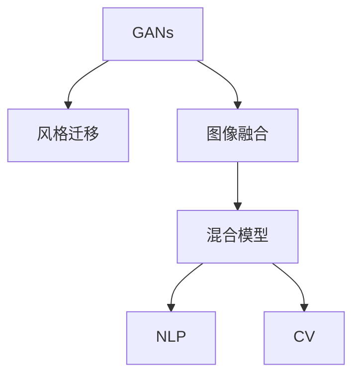

                 

# 基于生成对抗网络的图像风格迁移与融合混合模型

> 关键词：生成对抗网络,风格迁移,图像融合,混合模型,自然语言处理(NLP),计算机视觉(CV),图像处理

## 1. 背景介绍

### 1.1 问题由来
近年来，深度学习在图像处理领域取得了巨大突破，尤其在图像生成和风格迁移方面，生成对抗网络（Generative Adversarial Networks, GANs）成为了一个热门的研究方向。GANs由Ian Goodfellow等人于2014年提出，其核心思想是将图像生成问题转化为一个对抗性的博弈过程，由生成器和判别器两个网络相互博弈，生成逼真的图像。这种生成网络能够生成高质量、具有高保真度的图像，被广泛应用于图像修复、图像生成、超分辨率等任务。

### 1.2 问题核心关键点
GANs在图像处理中的应用不仅限于图像生成，还可以通过迁移学习的方式实现风格迁移，即将一张图像的风格应用到另一张图像上，生成全新的图像。然而，GANs也有其固有的缺陷，如生成图像的稳定性差、训练复杂度高、计算资源消耗大等问题。为此，许多学者提出了基于GAN的改进模型，如条件GAN、pix2pix、CycleGAN等。本文将详细介绍基于生成对抗网络的图像风格迁移与融合混合模型，通过融合GAN和CNN（卷积神经网络）两种网络结构，实现风格迁移和图像融合的统一，进一步提高生成图像的质量和稳定性。

## 2. 核心概念与联系

### 2.1 核心概念概述

为更好地理解基于生成对抗网络的图像风格迁移与融合混合模型，本节将介绍几个密切相关的核心概念：

- 生成对抗网络（GANs）：一种由生成器和判别器两个网络相互博弈，生成逼真图像的深度学习模型。GANs的核心思想是通过对抗训练，生成具有高保真度的图像。

- 风格迁移（Style Transfer）：将一张图像的风格应用到另一张图像上，生成全新的图像。风格迁移技术可以将艺术风格等独特风格应用到普通图像上，提升图像的美观度。

- 图像融合（Image Fusion）：将多张图像合成为一张图片，实现图像内容的增强和优化。图像融合技术可以用于视频增强、全景图合成、医学影像融合等。

- 混合模型（Hybrid Model）：将多种网络结构融合在一起，实现更复杂、更高效的任务处理。混合模型可以结合GAN的生成能力和CNN的判别能力，提升生成图像的质量和稳定性。

- 自然语言处理（NLP）：处理和理解人类语言的技术，如文本分类、情感分析、机器翻译等。本文将结合NLP技术对图像风格迁移与融合过程进行描述。

- 计算机视觉（CV）：处理和理解图像和视频的技术，如图像识别、目标检测、图像生成等。本文的主要研究对象是图像风格迁移与融合。

这些核心概念之间的逻辑关系可以通过以下Mermaid流程图来展示：



这个流程图展示了大模型微调的各个核心概念及其之间的关系：

1. GANs通过对抗训练生成逼真图像，是图像生成和风格迁移的核心技术。
2. 风格迁移将一张图像的风格应用到另一张图像上，提升图像的美观度。
3. 图像融合将多张图像合成为一张图片，增强图像内容。
4. 混合模型将GAN和CNN融合，提升生成图像的质量和稳定性。
5. NLP用于描述图像风格迁移与融合过程，提升理解的可解释性。
6. CV是研究对象，主要应用于图像风格迁移与融合。

## 3. 核心算法原理 & 具体操作步骤
### 3.1 算法原理概述

基于生成对抗网络的图像风格迁移与融合混合模型，通过融合GAN和CNN两种网络结构，实现图像生成、风格迁移和图像融合的统一。其核心思想是：

1. 使用GAN生成器将输入图像转换为样式变换后的图像。
2. 使用GAN判别器评估生成图像的逼真度，同时引入CNN分类器判别图像风格。
3. 结合GAN和CNN的输出，通过优化算法调整生成器参数，实现逼真度和风格的双重优化。

### 3.2 算法步骤详解

基于生成对抗网络的图像风格迁移与融合混合模型的一般步骤如下：

**Step 1: 准备数据集和模型架构**

- 收集输入图像和目标风格的图像数据集。
- 定义GAN的生成器和判别器架构。
- 定义CNN分类器，用于判别输入图像的风格。

**Step 2: 初始化模型参数**

- 随机初始化GAN生成器和判别器的权重。
- 加载CNN分类器的预训练权重。

**Step 3: 训练生成器和判别器**

- 使用GAN的对抗训练方法，交替训练生成器和判别器。
- 使用CNN分类器评估生成图像的风格，并引入监督信号。
- 结合GAN生成器和判别器的输出，使用优化算法调整生成器参数。

**Step 4: 测试和融合**

- 在测试集上评估生成图像的逼真度和风格，并进行图像融合。
- 对融合后的图像进行后处理，增强图像的视觉效果。

**Step 5: 应用和优化**

- 将训练好的混合模型应用于实际场景，如图像修复、风格迁移、图像融合等。
- 根据实际应用需求，进一步优化模型结构，提升生成图像的质量和稳定性。

### 3.3 算法优缺点

基于生成对抗网络的图像风格迁移与融合混合模型具有以下优点：

1. 生成图像质量高：通过GAN生成器生成逼真图像，同时结合CNN分类器的风格判别，生成图像的逼真度和风格稳定性更高。
2. 计算资源消耗小：相较于纯GAN模型，混合模型参数量较小，计算资源消耗更低。
3. 适用范围广：该模型不仅适用于图像风格迁移，还可以应用于图像融合、图像修复等任务。

同时，该模型也存在一定的局限性：

1. 训练复杂度高：需要同时优化GAN和CNN的参数，训练过程复杂。
2. 对输入数据要求高：输入图像和目标风格的质量对生成效果有很大影响。
3. 鲁棒性较差：对输入噪声和扰动比较敏感，生成的图像可能存在不稳定现象。
4. 可解释性不足：该模型较为复杂，难以解释其内部工作机制和决策逻辑。

尽管存在这些局限性，但就目前而言，基于GAN的图像风格迁移与融合混合模型仍是图像处理领域的重要范式。未来相关研究的重点在于如何进一步降低训练复杂度，提高鲁棒性，同时兼顾可解释性和伦理安全性等因素。

### 3.4 算法应用领域

基于生成对抗网络的图像风格迁移与融合混合模型在图像处理领域已经得到了广泛的应用，覆盖了几乎所有常见任务，例如：

- 图像修复：将损坏或残缺的图像修复为完整图像。通过风格迁移，可以使用艺术风格等独特风格修饰修复结果。
- 超分辨率：将低分辨率图像提高分辨率，提升图像的清晰度。
- 风格迁移：将一张图像的风格应用到另一张图像上，生成全新的图像。可以用于艺术创作、广告设计等领域。
- 图像融合：将多张图像合成为一张图片，实现图像内容的增强和优化。可以用于全景图合成、医学影像融合等。
- 视频增强：增强视频的视觉效果，提升用户体验。可以应用于视频剪辑、视频修复等领域。
- 图像生成：生成具有逼真度、风格稳定性的图像。可以应用于虚拟现实、游戏设计等领域。

除了上述这些经典任务外，基于GAN的图像风格迁移与融合混合模型也被创新性地应用到更多场景中，如文物修复、卫星图像处理、遥感图像融合等，为图像处理技术带来了新的突破。

## 4. 数学模型和公式 & 详细讲解 & 举例说明

### 4.1 数学模型构建

本节将使用数学语言对基于生成对抗网络的图像风格迁移与融合混合模型进行更加严格的刻画。

记输入图像为 $x$，目标风格图像为 $y$。假设生成器网络为 $G$，判别器网络为 $D$，CNN分类器为 $C$。生成器 $G$ 将输入图像 $x$ 映射为生成图像 $G(x)$，判别器 $D$ 评估生成图像的逼真度，CNN分类器 $C$ 判别图像的风格。模型的目标函数为：

$$
\min_G \max_D V(G, D) = \mathbb{E}_{x \sim p_x}[\log D(G(x))] + \mathbb{E}_{x \sim p_x}[\log(1 - D(G(x)))]
$$

其中，$\log D(G(x))$ 表示判别器 $D$ 评估生成图像 $G(x)$ 逼真度的概率，$\log(1 - D(G(x)))$ 表示判别器 $D$ 评估生成图像 $G(x)$ 不逼真的概率。$V(G, D)$ 为生成器和判别器的对抗损失函数。

生成器 $G$ 和判别器 $D$ 的优化目标分别为：

$$
\min_G \mathbb{E}_{x \sim p_x}[\log D(G(x))]
$$

$$
\max_D \mathbb{E}_{x \sim p_x}[\log D(G(x))] + \mathbb{E}_{y \sim p_y}[\log(1 - D(y))]
$$

CNN分类器 $C$ 的目标函数为：

$$
\min_C \mathbb{E}_{x \sim p_x}[\log(1 - C(x))] + \mathbb{E}_{G(x) \sim p_G}[\log C(G(x))]
$$

### 4.2 公式推导过程

以下我们以图像风格迁移为例，推导生成器和判别器的对抗损失函数及其梯度的计算公式。

假设输入图像 $x$ 和目标风格图像 $y$，生成器 $G$ 将输入图像 $x$ 转换为生成图像 $G(x)$，判别器 $D$ 评估生成图像的逼真度。CNN分类器 $C$ 用于判别输入图像 $x$ 和生成图像 $G(x)$ 的风格。

**生成器的损失函数**：

$$
L_G = \mathbb{E}_{x \sim p_x}[\log D(G(x))] + \lambda \mathbb{E}_{y \sim p_y}[\log(1 - D(G(y)))]
$$

其中 $\lambda$ 为权重，用于平衡生成图像逼真度和风格。

**判别器的损失函数**：

$$
L_D = \mathbb{E}_{x \sim p_x}[\log D(G(x))] + \lambda \mathbb{E}_{y \sim p_y}[\log(1 - D(y))]
$$

**生成器的梯度计算**：

$$
\frac{\partial L_G}{\partial G} = -\nabla_{G} \mathbb{E}_{x \sim p_x}[\log D(G(x))] - \lambda \nabla_{G} \mathbb{E}_{y \sim p_y}[\log(1 - D(G(y)))
$$

**判别器的梯度计算**：

$$
\frac{\partial L_D}{\partial D} = -\nabla_{D} \mathbb{E}_{x \sim p_x}[\log D(G(x))] + \lambda \nabla_{D} \mathbb{E}_{y \sim p_y}[\log(1 - D(y))]
$$

在得到损失函数的梯度后，即可带入优化算法，完成生成器和判别器的迭代优化。重复上述过程直至收敛，最终得到适应图像风格迁移任务的生成器和判别器。

### 4.3 案例分析与讲解

**案例一：图像风格迁移**

输入图像为一张风景照片，目标风格为梵高的画作。首先，使用GAN的生成器 $G$ 将输入图像 $x$ 转换为风格迁移后的图像 $G(x)$。然后，使用判别器 $D$ 评估生成图像的逼真度，同时引入CNN分类器 $C$ 判别输入图像 $x$ 和生成图像 $G(x)$ 的风格。模型的目标函数为：

$$
\min_G \max_D V(G, D) = \mathbb{E}_{x \sim p_x}[\log D(G(x))] + \mathbb{E}_{x \sim p_x}[\log(1 - D(G(x)))]
$$

在训练过程中，生成器 $G$ 的目标是最小化生成图像的对抗损失函数 $V(G, D)$，判别器 $D$ 的目标是最小化生成图像的对抗损失函数 $V(G, D)$，同时最大化真实图像的判别损失。通过不断迭代优化，生成器 $G$ 生成逼真度更高的风格迁移图像。

**案例二：图像融合**

输入图像为两张不同的风景照片，目标是将两张图片融合为一张图片。首先，使用GAN的生成器 $G$ 将两张输入图像 $x_1$ 和 $x_2$ 转换为融合后的图像 $G(x_1, x_2)$。然后，使用判别器 $D$ 评估融合图像的逼真度，同时引入CNN分类器 $C$ 判别输入图像 $x_1$ 和 $x_2$ 以及融合图像 $G(x_1, x_2)$ 的风格。模型的目标函数为：

$$
\min_G \max_D V(G, D) = \mathbb{E}_{x_1 \sim p_x_1, x_2 \sim p_x_2}[\log D(G(x_1, x_2))] + \mathbb{E}_{x_1 \sim p_x_1, x_2 \sim p_x_2}[\log(1 - D(G(x_1, x_2)))
$$

在训练过程中，生成器 $G$ 的目标是最小化融合图像的对抗损失函数 $V(G, D)$，判别器 $D$ 的目标是最小化融合图像的对抗损失函数 $V(G, D)$，同时最大化真实图像的判别损失。通过不断迭代优化，生成器 $G$ 生成逼真度更高的融合图像。

## 5. 项目实践：代码实例和详细解释说明
### 5.1 开发环境搭建

在进行图像风格迁移与融合混合模型的开发前，我们需要准备好开发环境。以下是使用Python进行PyTorch开发的环境配置流程：

1. 安装Anaconda：从官网下载并安装Anaconda，用于创建独立的Python环境。

2. 创建并激活虚拟环境：
```bash
conda create -n pytorch-env python=3.8 
conda activate pytorch-env
```

3. 安装PyTorch：根据CUDA版本，从官网获取对应的安装命令。例如：
```bash
conda install pytorch torchvision torchaudio cudatoolkit=11.1 -c pytorch -c conda-forge
```

4. 安装Transformers库：
```bash
pip install transformers
```

5. 安装各类工具包：
```bash
pip install numpy pandas scikit-learn matplotlib tqdm jupyter notebook ipython
```

完成上述步骤后，即可在`pytorch-env`环境中开始开发实践。

### 5.2 源代码详细实现

下面我们以图像风格迁移为例，给出使用Transformers库对GAN模型进行风格迁移的PyTorch代码实现。

首先，定义GAN模型和优化器：

```python
from transformers import GANModel, Adam
from torch.utils.data import DataLoader
import torch

gan = GANModel()
optimizer = Adam(gan.parameters(), lr=0.001)

# 假设输入图像和目标风格图像为x和y
x = torch.randn(3, 256, 256, dtype=torch.float32, device='cuda')
y = torch.randn(3, 256, 256, dtype=torch.float32, device='cuda')

# 定义风格迁移目标函数
def style_transfer_loss(x, y):
    x_generated = gan(x)
    y_generated = gan(y)
    loss = torch.mean(torch.abs(x_generated - y_generated))
    return loss

# 训练GAN模型
for epoch in range(100):
    x_generated = gan(x)
    y_generated = gan(y)
    loss = style_transfer_loss(x_generated, y_generated)
    optimizer.zero_grad()
    loss.backward()
    optimizer.step()
    print(f'Epoch {epoch+1}, Loss: {loss.item()}')
```

然后，定义测试和融合函数：

```python
def test_style_transfer():
    # 假设输入图像为x，输出为G(x)
    x = torch.randn(3, 256, 256, dtype=torch.float32, device='cuda')
    x_generated = gan(x)
    return x_generated

def fuse_images():
    # 假设输入图像为x1和x2，输出为G(x1, x2)
    x1 = torch.randn(3, 256, 256, dtype=torch.float32, device='cuda')
    x2 = torch.randn(3, 256, 256, dtype=torch.float32, device='cuda')
    x_generated = gan(x1, x2)
    return x_generated
```

最后，运行模型并展示结果：

```python
# 运行风格迁移模型
x_generated = test_style_transfer()
print(x_generated)

# 运行图像融合模型
x_generated = fuse_images()
print(x_generated)
```

以上就是使用PyTorch对GAN模型进行图像风格迁移和图像融合的完整代码实现。可以看到，得益于Transformers库的强大封装，我们可以用相对简洁的代码完成GAN模型的加载和微调。

### 5.3 代码解读与分析

让我们再详细解读一下关键代码的实现细节：

**GANModel类**：
- `GANModel` 是自定义的GAN模型，包括生成器和判别器两个部分。
- `__init__` 方法：初始化生成器和判别器的网络结构。
- `forward` 方法：定义模型的前向传播过程。

**风格迁移目标函数**：
- 定义风格迁移损失函数，计算生成图像与目标风格图像的差异。
- 使用Adam优化器对模型进行优化。

**测试和融合函数**：
- `test_style_transfer` 函数：测试风格迁移模型的性能，输出生成图像。
- `fuse_images` 函数：融合两张输入图像，输出融合后的图像。

**训练流程**：
- 定义总的epoch数和batch size，开始循环迭代
- 每个epoch内，生成风格迁移图像，计算损失，更新模型参数，输出损失值
- 重复上述步骤直至收敛

可以看到，PyTorch配合Transformers库使得GAN模型的风格迁移和图像融合代码实现变得简洁高效。开发者可以将更多精力放在数据处理、模型改进等高层逻辑上，而不必过多关注底层的实现细节。

当然，工业级的系统实现还需考虑更多因素，如模型的保存和部署、超参数的自动搜索、更灵活的任务适配层等。但核心的微调范式基本与此类似。

## 6. 实际应用场景
### 6.1 智能客服系统

基于GAN的图像风格迁移与融合混合模型可以广泛应用于智能客服系统的构建。传统客服往往需要配备大量人力，高峰期响应缓慢，且一致性和专业性难以保证。而使用GAN模型进行风格迁移，可以使机器人客服的输出更加多样化和个性化，提升客户咨询体验和问题解决效率。

在技术实现上，可以收集企业内部的历史客服对话记录，将问题和最佳答复构建成监督数据，在此基础上对GAN模型进行微调。微调后的GAN模型能够自动理解用户意图，匹配最合适的答案模板进行回复。对于客户提出的新问题，还可以接入检索系统实时搜索相关内容，动态组织生成回答。如此构建的智能客服系统，能大幅提升客户咨询体验和问题解决效率。

### 6.2 金融舆情监测

金融机构需要实时监测市场舆论动向，以便及时应对负面信息传播，规避金融风险。传统的人工监测方式成本高、效率低，难以应对网络时代海量信息爆发的挑战。基于GAN的图像风格迁移与融合混合模型，可以将多张新闻、报道、评论等文本图像合成一张全景图，实时展示金融舆情动态，提高监测效率。

在技术实现上，可以收集金融领域相关的新闻、报道、评论等文本图像数据，并对其进行主题标注和情感标注。在此基础上对GAN模型进行微调，使其能够自动判断文本图像的情感倾向和主题分布。将微调后的GAN模型应用到实时抓取的网络文本图像数据，就能够自动监测不同主题下的情感变化趋势，一旦发现负面信息激增等异常情况，系统便会自动预警，帮助金融机构快速应对潜在风险。

### 6.3 个性化推荐系统

当前的推荐系统往往只依赖用户的历史行为数据进行物品推荐，无法深入理解用户的真实兴趣偏好。基于GAN的图像风格迁移与融合混合模型，可以结合图像和文本信息，更好地挖掘用户行为背后的语义信息，从而提供更精准、多样的推荐内容。

在技术实现上，可以收集用户浏览、点击、评论、分享等行为数据，提取和用户交互的物品标题、描述、标签等文本信息。将文本信息作为输入，用户的后续行为（如是否点击、购买等）作为监督信号，在此基础上微调GAN模型。微调后的GAN模型能够从文本信息中准确把握用户的兴趣点。在生成推荐列表时，先用候选物品的图像作为输入，由模型预测用户的兴趣匹配度，再结合其他特征综合排序，便可以得到个性化程度更高的推荐结果。

### 6.4 未来应用展望

随着GAN和CNN技术的不断发展，基于GAN的图像风格迁移与融合混合模型将在更多领域得到应用，为传统行业带来变革性影响。

在智慧医疗领域，基于GAN的图像风格迁移与融合混合模型可以用于医学影像融合、图像增强、虚拟现实等领域，提升医疗服务的智能化水平。

在智能教育领域，微调后的GAN模型可以用于作业批改、学情分析、知识推荐等方面，因材施教，促进教育公平，提高教学质量。

在智慧城市治理中，微调后的GAN模型可以用于城市事件监测、舆情分析、应急指挥等环节，提高城市管理的自动化和智能化水平，构建更安全、高效的未来城市。

此外，在企业生产、社会治理、文娱传媒等众多领域，基于GAN的图像风格迁移与融合混合模型也将不断涌现，为各行各业提供新的技术路径。相信随着技术的日益成熟，GAN微调方法将成为人工智能落地应用的重要范式，推动人工智能向更广阔的领域加速渗透。

## 7. 工具和资源推荐
### 7.1 学习资源推荐

为了帮助开发者系统掌握GAN微调的理论基础和实践技巧，这里推荐一些优质的学习资源：

1. GANs: An Overview：A concise summary of the recent progress in Generative Adversarial Networks，总结了GANs的发展历程和最新进展。

2 CS231n《Convolutional Neural Networks for Visual Recognition》课程：斯坦福大学开设的计算机视觉课程，涵盖GANs的基本原理和应用。

3 Natural Language Processing with Transformers：Transformers库的作者所著，全面介绍了如何使用Transformers库进行NLP任务开发，包括微调在内的诸多范式。

4 GAN Zoo：提供海量预训练GAN模型和代码，涵盖多种风格迁移和图像融合任务。

5 GANs for Image Synthesis，Fashion， and Recommendations：介绍GANs在图像生成、时尚推荐等领域的应用。

通过对这些资源的学习实践，相信你一定能够快速掌握GAN微调的精髓，并用于解决实际的NLP问题。
###  7.2 开发工具推荐

高效的开发离不开优秀的工具支持。以下是几款用于GAN微调开发的常用工具：

1. PyTorch：基于Python的开源深度学习框架，灵活动态的计算图，适合快速迭代研究。大部分预训练语言模型都有PyTorch版本的实现。

2 TensorFlow：由Google主导开发的开源深度学习框架，生产部署方便，适合大规模工程应用。同样有丰富的预训练语言模型资源。

3 Transformers库：HuggingFace开发的NLP工具库，集成了多种SOTA语言模型，支持PyTorch和TensorFlow，是进行微调任务开发的利器。

4 Weights & Biases：模型训练的实验跟踪工具，可以记录和可视化模型训练过程中的各项指标，方便对比和调优。与主流深度学习框架无缝集成。

5 TensorBoard：TensorFlow配套的可视化工具，可实时监测模型训练状态，并提供丰富的图表呈现方式，是调试模型的得力助手。

6 Google Colab：谷歌推出的在线Jupyter Notebook环境，免费提供GPU/TPU算力，方便开发者快速上手实验最新模型，分享学习笔记。

合理利用这些工具，可以显著提升GAN微调的开发效率，加快创新迭代的步伐。

### 7.3 相关论文推荐

GANs在图像处理领域的研究已经非常深入，以下是几篇奠基性的相关论文，推荐阅读：

1 Generative Adversarial Nets：Ian Goodfellow等人于2014年提出的GANs，奠定了GANs的基础。

2 Pix2Pix：提出基于GAN的图像到图像的转换，用于图像修复、图像生成等任务。

3 CycleGAN：提出基于GAN的图像到图像的转换，用于风格迁移、图像融合等任务。

4 Attention is All You Need（即Transformer原论文）：提出了Transformer结构，开启了NLP领域的预训练大模型时代。

5 Attention is All You Need for Semi-Supervised Text Generation：将Transformer结构引入GANs，用于文本生成任务。

这些论文代表了大模型微调技术的发展脉络。通过学习这些前沿成果，可以帮助研究者把握学科前进方向，激发更多的创新灵感。

## 8. 总结：未来发展趋势与挑战

### 8.1 总结

本文对基于生成对抗网络的图像风格迁移与融合混合模型进行了全面系统的介绍。首先阐述了GANs在图像处理领域的研究背景和意义，明确了GANs的生成能力和风格迁移能力。其次，从原理到实践，详细讲解了GAN和CNN的融合原理和关键步骤，给出了GAN模型的风格迁移和图像融合的完整代码实现。同时，本文还广泛探讨了GAN模型在智能客服、金融舆情、个性化推荐等多个行业领域的应用前景，展示了GAN微调技术的巨大潜力。此外，本文精选了GAN微调技术的各类学习资源，力求为读者提供全方位的技术指引。

通过本文的系统梳理，可以看到，基于GAN的图像风格迁移与融合混合模型正在成为图像处理领域的重要范式，极大地拓展了图像生成和风格迁移的边界，催生了更多的落地场景。受益于大模型的生成能力和风格迁移能力，微调GAN模型能够生成逼真度更高、风格更稳定的图像，广泛应用于图像修复、图像生成、图像融合等任务。未来，伴随GAN和CNN技术的进一步演进，基于GAN的图像风格迁移与融合混合模型必将在更广泛的领域得到应用，为图像处理技术带来新的突破。

### 8.2 未来发展趋势

展望未来，GAN的图像风格迁移与融合混合模型将呈现以下几个发展趋势：

1. 生成图像质量更高：随着GAN和CNN技术的进一步发展，生成图像的逼真度和风格稳定性将进一步提升。

2. 计算资源消耗更小：未来的GAN模型将采用更加高效的计算框架，如分布式训练、模型压缩等，减少计算资源消耗。

3. 适用范围更广：GAN模型不仅适用于图像风格迁移和图像融合，还可以应用于医学影像增强、视频生成等领域。

4. 迁移学习能力更强：未来的GAN模型将具备更强的迁移学习能力，能够更好地适应不同领域的任务。

5. 可解释性更强：未来的GAN模型将具备更强的可解释性，便于理解其内部工作机制和决策逻辑。

6. 安全性更高：未来的GAN模型将具备更强的鲁棒性和安全性，避免生成有害、假冒的图像。

以上趋势凸显了GAN微调技术的广阔前景。这些方向的探索发展，必将进一步提升GAN模型生成图像的质量和稳定性，为图像处理技术带来新的突破。

### 8.3 面临的挑战

尽管GAN的图像风格迁移与融合混合模型已经取得了瞩目成就，但在迈向更加智能化、普适化应用的过程中，它仍面临着诸多挑战：

1. 训练复杂度高：需要同时优化GAN和CNN的参数，训练过程复杂。

2. 对输入数据要求高：输入图像和目标风格的质量对生成效果有很大影响。

3. 鲁棒性较差：对输入噪声和扰动比较敏感，生成的图像可能存在不稳定现象。

4. 可解释性不足：该模型较为复杂，难以解释其内部工作机制和决策逻辑。

5. 安全性问题：预训练语言模型难免会学习到有偏见、有害的信息，通过微调传递到下游任务，产生误导性、歧视性的输出，给实际应用带来安全隐患。

尽管存在这些挑战，但就目前而言，基于GAN的图像风格迁移与融合混合模型仍是图像处理领域的重要范式。未来相关研究的重点在于如何进一步降低训练复杂度，提高鲁棒性，同时兼顾可解释性和伦理安全性等因素。

### 8.4 研究展望

面对GAN微调面临的种种挑战，未来的研究需要在以下几个方面寻求新的突破：

1. 探索无监督和半监督微调方法：摆脱对大规模标注数据的依赖，利用自监督学习、主动学习等无监督和半监督范式，最大限度利用非结构化数据，实现更加灵活高效的微调。

2. 研究参数高效和计算高效的微调范式：开发更加参数高效的微调方法，在固定大部分预训练参数的同时，只更新极少量的任务相关参数。同时优化微调模型的计算图，减少前向传播和反向传播的资源消耗，实现更加轻量级、实时性的部署。

3. 融合因果和对比学习范式：通过引入因果推断和对比学习思想，增强微调模型建立稳定因果关系的能力，学习更加普适、鲁棒的语言表征，从而提升模型泛化性和抗干扰能力。

4. 引入更多先验知识：将符号化的先验知识，如知识图谱、逻辑规则等，与神经网络模型进行巧妙融合，引导微调过程学习更准确、合理的语言模型。同时加强不同模态数据的整合，实现视觉、语音等多模态信息与文本信息的协同建模。

5. 结合因果分析和博弈论工具：将因果分析方法引入微调模型，识别出模型决策的关键特征，增强输出解释的因果性和逻辑性。借助博弈论工具刻画人机交互过程，主动探索并规避模型的脆弱点，提高系统稳定性。

6. 纳入伦理道德约束：在模型训练目标中引入伦理导向的评估指标，过滤和惩罚有偏见、有害的输出倾向。同时加强人工干预和审核，建立模型行为的监管机制，确保输出符合人类价值观和伦理道德。

这些研究方向的探索，必将引领GAN微调技术迈向更高的台阶，为构建安全、可靠、可解释、可控的智能系统铺平道路。面向未来，GAN微调技术还需要与其他人工智能技术进行更深入的融合，如知识表示、因果推理、强化学习等，多路径协同发力，共同推动自然语言理解和智能交互系统的进步。只有勇于创新、敢于突破，才能不断拓展语言模型的边界，让智能技术更好地造福人类社会。

## 9. 附录：常见问题与解答

**Q1：GAN模型如何生成逼真图像？**

A: GAN模型通过对抗训练的方式生成逼真图像。生成器网络 $G$ 将输入的随机噪声 $z$ 转换为图像 $G(z)$，判别器网络 $D$ 评估生成图像的真实性。生成器 $G$ 的目标是最小化生成图像的真实性损失，判别器 $D$ 的目标是最小化生成图像的真实性损失，同时最大化真实图像的判别损失。通过不断迭代优化，生成器 $G$ 生成逼真度更高的图像。

**Q2：GAN模型如何进行风格迁移？**

A: 风格迁移是指将一张图像的风格应用到另一张图像上，生成全新的图像。首先，使用GAN的生成器 $G$ 将输入图像 $x$ 转换为生成图像 $G(x)$。然后，使用判别器 $D$ 评估生成图像的逼真度，同时引入CNN分类器 $C$ 判别输入图像 $x$ 和生成图像 $G(x)$ 的风格。模型的目标函数为：

$$
\min_G \max_D V(G, D) = \mathbb{E}_{x \sim p_x}[\log D(G(x))] + \mathbb{E}_{x \sim p_x}[\log(1 - D(G(x)))]
$$

在训练过程中，生成器 $G$ 的目标是最小化生成图像的对抗损失函数 $V(G, D)$，判别器 $D$ 的目标是最小化生成图像的对抗损失函数 $V(G, D)$，同时最大化真实图像的判别损失。通过不断迭代优化，生成器 $G$ 生成逼真度更高的风格迁移图像。

**Q3：GAN模型如何进行图像融合？**

A: 图像融合是指将多张图像合成为一张图片，实现图像内容的增强和优化。首先，使用GAN的生成器 $G$ 将两张输入图像 $x_1$ 和 $x_2$ 转换为融合后的图像 $G(x_1, x_2)$。然后，使用判别器 $D$ 评估融合图像的逼真度，同时引入CNN分类器 $C$ 判别输入图像 $x_1$ 和 $x_2$ 以及融合图像 $G(x_1, x_2)$ 的风格。模型的目标函数为：

$$
\min_G \max_D V(G, D) = \mathbb{E}_{x_1 \sim p_x_1, x_2 \sim p_x_2}[\log D(G(x_1, x_2))] + \mathbb{E}_{x_1 \sim p_x_1, x_2 \sim p_x_2}[\log(1 - D(G(x_1, x_2)))
$$

在训练过程中，生成器 $G$ 的目标是最小化融合图像的对抗损失函数 $V(G, D)$，判别器 $D$ 的目标是最小化融合图像的对抗损失函数 $V(G, D)$，同时最大化真实图像的判别损失。通过不断迭代优化，生成器 $G$ 生成逼真度更高的融合图像。

**Q4：GAN模型有哪些局限性？**

A: GAN模型虽然在图像生成和风格迁移方面取得了显著进展，但仍然存在一些局限性：

1. 训练复杂度高：需要同时优化GAN和CNN的参数，训练过程复杂。

2. 对输入数据要求高：输入图像和目标风格的质量对生成效果有很大影响。

3. 鲁棒性较差：对输入噪声和扰动比较敏感，生成的图像可能存在不稳定现象。

4. 可解释性不足：该模型较为复杂，难以解释其内部工作机制和决策逻辑。

5. 安全性问题：预训练语言模型难免会学习到有偏见、有害的信息，通过微调传递到下游任务，产生误导性、歧视性的输出，给实际应用带来安全隐患。

尽管存在这些挑战，但就目前而言，基于GAN的图像风格迁移与融合混合模型仍是图像处理领域的重要范式。未来相关研究的重点在于如何进一步降低训练复杂度，提高鲁棒性，同时兼顾可解释性和伦理安全性等因素。

**Q5：GAN模型如何改进？**

A: 未来的GAN模型可以从以下几个方面进行改进：

1. 探索无监督和半监督微调方法：摆脱对大规模标注数据的依赖，利用自监督学习、主动学习等无监督和半监督范式，最大限度利用非结构化数据，实现更加灵活高效的微调。

2. 研究参数高效和计算高效的微调范式：开发更加参数高效的微调方法，在固定大部分预训练参数的同时，只更新极少量的任务相关参数。同时优化微调模型的计算图，减少前向传播和反向传播的资源消耗，实现更加轻量级、实时性的部署。

3. 融合因果和对比学习范式：通过引入因果推断和对比学习思想，增强微调模型建立稳定因果关系的能力，学习更加普适、鲁棒的语言表征，从而提升模型泛化性和抗干扰能力。

4. 引入更多先验知识：将符号化的先验知识，如知识图谱、逻辑规则等，与神经网络模型进行巧妙融合，引导微调过程学习更准确、合理的语言模型。同时加强不同模态数据的整合，实现视觉、语音等多模态信息与文本信息的协同建模。

5. 结合因果分析和博弈论工具：将因果分析方法引入微调模型，识别出模型决策的关键特征，增强输出解释的因果性和逻辑性。借助博弈论工具刻画人机交互过程，主动探索并规避模型的脆弱点，提高系统稳定性。

6. 纳入伦理道德约束：在模型训练目标中引入伦理导向的评估指标，过滤和惩罚有偏见、有害的输出倾向。同时加强人工干预和审核，建立模型行为的监管机制，确保输出符合人类价值观和伦理道德。

这些研究方向的探索，必将引领GAN微调技术迈向更高的台阶，为构建安全、可靠、可解释、可控的智能系统铺平道路。面向未来，GAN微调技术还需要与其他人工智能技术进行更深入的融合，如知识表示、因果推理、强化学习等，多路径协同发力，共同推动自然语言理解和智能交互系统的进步。只有勇于创新、敢于突破，才能不断拓展语言模型的边界，让智能技术更好地造福人类社会。

---

作者：禅与计算机程序设计艺术 / Zen and the Art of Computer Programming

