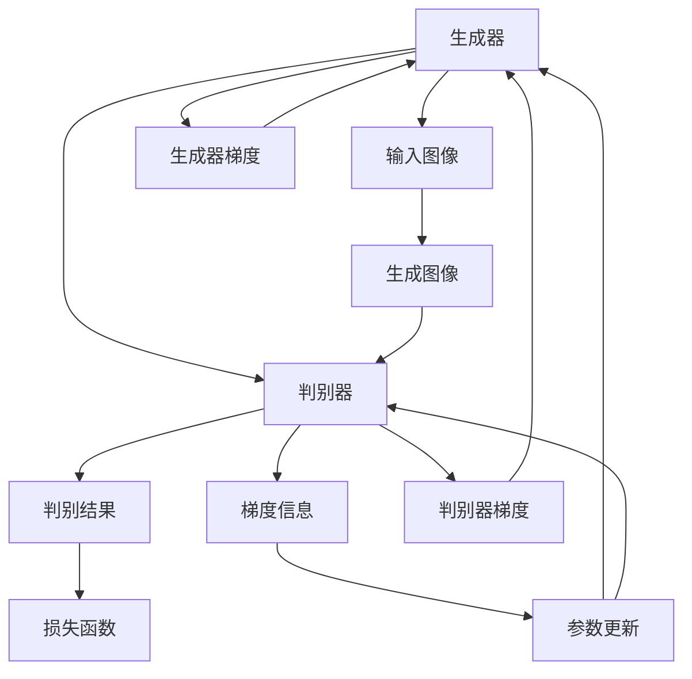

                 

## 1. 背景介绍

生成对抗网络（Generative Adversarial Networks, GANs）作为一种强大的图像生成模型，近年来在图像风格迁移领域取得了巨大的突破。通过对风格的隐式编码，生成对抗网络可以在一张图像上迁移另一张图像的风格，生成具有新颖风格的艺术作品。然而，这种方法往往缺乏可解释性，很难理解模型的内部决策过程。可解释性作为人工智能系统的重要属性，对于模型的应用和维护至关重要。因此，本文将研究基于生成对抗网络的图像风格迁移的可解释性，通过分析模型的决策过程和优化目标，提出提高可解释性的方法。

### 1.1 研究背景

图像风格迁移（Image Style Transfer）是一种视觉艺术的创新应用，它能够将一张图像的风格转换到另一张图像上，创造出具有新颖风格的艺术作品。这一技术的产生源于视觉艺术领域对新表达形式的需求。最早的图像风格迁移方法可以追溯到1960年代，当时的科学家们使用频谱域转换（Spectral Domain Transfer）来实现风格迁移，但这些方法效果不佳，计算复杂度高。直到2015年，约翰霍普金斯大学的Gatys等人提出了基于卷积神经网络（Convolutional Neural Networks, CNNs）的风格迁移方法，基于梯度域网络（Gradient Domain Network）的风格迁移方法，基于深度学习（Deep Learning）的风格迁移方法等。这些方法显著提升了风格迁移的效果，使得风格迁移成为艺术创作和视觉特效中常用技术。

然而，这些方法存在一个共同的问题：缺乏可解释性。传统的深度学习模型被认为是一个"黑盒"，难以理解其内部决策过程。这对于需要高精度的艺术创作和视觉特效领域来说，是一个巨大的挑战。如何提高生成对抗网络的可解释性，使其决策过程更加透明，是当前研究的重要方向。

### 1.2 研究动机

基于生成对抗网络的图像风格迁移具有强大的潜力，已经在艺术创作、视觉特效、增强现实等领域得到了广泛的应用。然而，这一过程往往是不可解释的，很难理解模型的内部决策过程。由于缺乏可解释性，模型在实际应用中会遇到以下几个问题：

1. 用户信任度低：用户往往对"黑盒"模型缺乏信任，不愿意将重要任务交给不可解释的系统。

2. 调试困难：在模型出现问题时，无法通过可视化的方式进行调试，难以找到问题所在。

3. 决策透明度低：当模型出现错误决策时，难以找到错误的源头，无法进行修正。

4. 模型的可控性低：由于模型不可解释，用户难以理解模型的输出，难以进行有效的控制和调整。

### 1.3 研究目标

本文的主要目标是研究基于生成对抗网络的图像风格迁移的可解释性问题，通过分析生成对抗网络的决策过程和优化目标，提出提高可解释性的方法。本文的研究目标包括以下几个方面：

1. 分析生成对抗网络在图像风格迁移中的决策过程，理解其内部工作机制。

2. 分析生成对抗网络的优化目标，探索可解释性的改进方法。

3. 结合现有技术，提出新的可解释性方法，提高模型的决策透明度。

4. 进行实验验证，评估所提出方法的性能和效果。

## 2. 核心概念与联系

### 2.1 核心概念概述

为了更好地理解基于生成对抗网络的图像风格迁移的可解释性，我们需要先了解以下几个核心概念：

- **生成对抗网络（GANs）**：由生成器和判别器两部分组成，生成器学习生成与真实数据分布接近的假数据，判别器学习区分真实数据和假数据。两者的博弈过程不断迭代，直到生成器生成的数据无法被判别器区分。

- **图像风格迁移**：将一张图像的风格转换到另一张图像上，创造出具有新颖风格的艺术作品。基于生成对抗网络的图像风格迁移方法，通过生成器将输入图像转换成具有目标风格的图像。

- **可解释性**：可解释性是指模型可以清晰地解释其决策过程，使用户可以理解模型的工作机制，提高用户的信任度和模型的透明度。

- **梯度信息**：梯度信息是模型在反向传播过程中传递的信息，用于更新模型参数。在生成对抗网络中，梯度信息对于生成器的训练非常重要。

- **判别器梯度**：判别器梯度是指在判别器前向传播过程中，输入图像的梯度信息。这些梯度信息反映了判别器对输入图像的判别程度。

- **生成器梯度**：生成器梯度是指在生成器前向传播过程中，输入图像的梯度信息。这些梯度信息反映了生成器对输入图像的转换程度。

这些核心概念通过生成对抗网络这一框架联系在一起，共同构成了图像风格迁移的方法。通过理解这些概念，可以更好地掌握生成对抗网络的决策过程和优化目标，从而提出提高可解释性的方法。

### 2.2 核心概念原理和架构的 Mermaid 流程图



这个 Mermaid 流程图展示了生成对抗网络的基本架构和决策过程。生成器接收输入图像，将其转换成具有目标风格的图像。判别器接收输入图像和生成图像，判断输入图像的真实性，并输出判别结果。生成器和判别器的梯度信息被用于更新模型参数，以提高生成器和判别器的性能。

## 3. 核心算法原理 & 具体操作步骤

### 3.1 算法原理概述

生成对抗网络（GANs）在图像风格迁移中的基本原理是通过生成器和判别器的博弈过程，不断优化生成器的生成能力和判别器的判别能力，最终生成具有目标风格的图像。生成器接收输入图像，将其转换成具有目标风格的图像，判别器接收输入图像和生成图像，判断输入图像的真实性，并输出判别结果。生成器和判别器的梯度信息被用于更新模型参数，以提高生成器和判别器的性能。

在图像风格迁移中，生成器的优化目标是最大化判别器的判别损失。判别器的优化目标是最大化真实图像的判别损失和最小化假图像的判别损失。生成器和判别器的博弈过程不断迭代，直到生成器生成的图像无法被判别器区分。这一过程可以通过训练损失函数来实现。

### 3.2 算法步骤详解

基于生成对抗网络的图像风格迁移的具体操作步骤如下：

1. 准备数据集：选择源图像和目标图像，并将其送入模型中进行预处理。

2. 训练生成器：使用生成器将源图像转换成具有目标风格的图像，并使用判别器对其进行判别。

3. 训练判别器：使用判别器对真实图像和生成图像进行判别，并计算判别损失。

4. 更新生成器和判别器：使用生成器和判别器的梯度信息，通过优化算法更新模型参数。

5. 生成迁移图像：使用训练好的生成器，将源图像转换成具有目标风格的图像。

6. 评估和优化：对生成图像进行评估，并根据评估结果进行优化。

### 3.3 算法优缺点

生成对抗网络在图像风格迁移中的优点包括：

1. 能够生成高质量的图像，具有很好的生成能力。

2. 能够实现复杂风格的迁移，生成具有新颖风格的艺术作品。

3. 具有很好的泛化能力，能够适应不同的源图像和目标图像。

生成对抗网络在图像风格迁移中的缺点包括：

1. 训练过程不稳定，容易陷入局部最优。

2. 模型的可解释性较低，难以理解其内部决策过程。

3. 生成图像的质量不稳定，容易产生噪声和模糊。

4. 模型参数较多，训练和推理速度较慢。

### 3.4 算法应用领域

基于生成对抗网络的图像风格迁移已经被广泛应用于艺术创作、视觉特效、增强现实等领域。具体应用包括：

1. 艺术创作：将一张图像的风格迁移到另一张图像上，创造出具有新颖风格的艺术作品。

2. 视觉特效：将一张图像的风格迁移到另一张图像上，用于电影、广告等视觉特效中。

3. 增强现实：将一张图像的风格迁移到另一张图像上，用于增强现实应用中。

4. 图像修复：将一张损坏的图像恢复成具有目标风格的图像。

5. 图像压缩：将一张图像转换成具有目标风格的图像，减小图像大小。

6. 图像增强：将一张图像转换成具有目标风格的图像，增强图像效果。

## 4. 数学模型和公式 & 详细讲解 & 举例说明

### 4.1 数学模型构建

生成对抗网络在图像风格迁移中的数学模型可以表示为：

$$
\begin{aligned}
\min_G & J_G = \mathbb{E}_{x \sim p_x}[D(x)] + \mathbb{E}_{z \sim p_z}[\log D(G(z))] \\
\max_D & J_D = \mathbb{E}_{x \sim p_x}[D(x)] + \mathbb{E}_{z \sim p_z}[-D(G(z))]
\end{aligned}
$$

其中，$G$ 表示生成器，$z$ 表示噪声向量，$D$ 表示判别器，$J_G$ 表示生成器的损失函数，$J_D$ 表示判别器的损失函数。$x$ 表示真实图像，$G(z)$ 表示生成图像。

### 4.2 公式推导过程

在生成对抗网络中，生成器和判别器分别对输入图像进行优化。生成器的目标是最小化判别器的判别损失，同时最大化生成图像的判别损失。判别器的目标是最小化真实图像的判别损失，同时最大化假图像的判别损失。

生成器的优化目标可以表示为：

$$
\min_G \mathbb{E}_{x \sim p_x}[D(x)] + \mathbb{E}_{z \sim p_z}[\log D(G(z))]
$$

其中，$D(x)$ 表示判别器对真实图像的判别结果，$D(G(z))$ 表示判别器对生成图像的判别结果。生成器的优化目标最小化了判别器对真实图像的判别结果，同时最大化生成图像的判别结果。

判别器的优化目标可以表示为：

$$
\max_D \mathbb{E}_{x \sim p_x}[D(x)] + \mathbb{E}_{z \sim p_z}[-D(G(z))]
$$

其中，$D(x)$ 表示判别器对真实图像的判别结果，$D(G(z))$ 表示判别器对生成图像的判别结果。判别器的优化目标最大化判别器对真实图像的判别结果，同时最小化判别器对生成图像的判别结果。

### 4.3 案例分析与讲解

我们以一张真实图像和一张目标图像为例，分析生成对抗网络在图像风格迁移中的决策过程。假设有两张图像 $x$ 和 $y$，其中 $x$ 是真实图像，$y$ 是目标图像。

首先，生成器将噪声向量 $z$ 输入生成器，生成具有目标风格的图像 $G(z)$。然后，判别器对 $x$ 和 $G(z)$ 进行判别，输出判别结果 $D(x)$ 和 $D(G(z))$。判别器对 $x$ 的判别结果越大，表示其认为 $x$ 是真实图像的可能性越高。判别器对 $G(z)$ 的判别结果越小，表示其认为 $G(z)$ 是真实图像的可能性越高。

生成器的优化目标是最大化生成图像的判别结果，即最大化 $D(G(z))$。为了达到这一目标，生成器需要不断地优化生成图像的质量，使其尽可能地接近真实图像。判别器的优化目标是最大化判别器对真实图像的判别结果，同时最小化判别器对生成图像的判别结果。为了达到这一目标，判别器需要不断地优化判别器对真实图像的判别能力，同时弱化对生成图像的判别能力。

通过这一过程，生成器和判别器的博弈不断迭代，直到生成器生成的图像无法被判别器区分。这一过程可以通过训练损失函数来实现。

## 5. 项目实践：代码实例和详细解释说明

### 5.1 开发环境搭建

在开始代码实现之前，我们需要准备以下开发环境：

1. 安装 Python 和 Anaconda，用于数据处理和模型训练。

2. 安装 TensorFlow 和 Keras，用于实现生成对抗网络。

3. 准备数据集：选择源图像和目标图像，并将其划分为训练集和测试集。

4. 搭建模型：实现生成器和判别器，并搭建整个生成对抗网络。

5. 训练模型：使用训练集对生成对抗网络进行训练。

### 5.2 源代码详细实现

以下是使用 TensorFlow 和 Keras 实现生成对抗网络的代码示例：

```python
import tensorflow as tf
from tensorflow.keras import layers, models

# 定义生成器
def build_generator(input_shape):
    generator = models.Sequential([
        layers.Dense(256 * 8 * 8, use_bias=False, input_shape=input_shape),
        layers.BatchNormalization(),
        layers.LeakyReLU(),
        layers.Reshape((8, 8, 256)),
        layers.Conv2DTranspose(128, (5, 5), strides=(2, 2), padding='same', use_bias=False),
        layers.BatchNormalization(),
        layers.LeakyReLU(),
        layers.Conv2DTranspose(64, (5, 5), strides=(2, 2), padding='same', use_bias=False),
        layers.BatchNormalization(),
        layers.LeakyReLU(),
        layers.Conv2DTranspose(3, (5, 5), strides=(2, 2), padding='same', use_bias=False, activation='tanh')
    ])
    return generator

# 定义判别器
def build_discriminator(input_shape):
    discriminator = models.Sequential([
        layers.Conv2D(64, (5, 5), strides=(2, 2), padding='same', input_shape=input_shape),
        layers.LeakyReLU(),
        layers.Dropout(0.3),
        layers.Conv2D(128, (5, 5), strides=(2, 2), padding='same'),
        layers.LeakyReLU(),
        layers.Dropout(0.3),
        layers.Flatten(),
        layers.Dense(1, activation='sigmoid')
    ])
    return discriminator

# 搭建生成对抗网络
def build_gan(generator, discriminator):
    discriminator.trainable = False
    gan = models.Model([generator.input, discriminator.input], discriminator.output)
    gan.compile(loss='binary_crossentropy', optimizer=optimizers.Adam(lr=0.0002, beta_1=0.5))
    return gan

# 加载数据集
def load_data():
    # 加载数据集，并进行预处理
    pass

# 训练模型
def train(model, train_data, epochs):
    for epoch in range(epochs):
        for x_batch, y_batch in train_data:
            # 将数据传入模型
            noise = np.random.normal(0, 1, (batch_size, noise_dim))
            img = np.concatenate([x_batch, y_batch])
            label = np.concatenate([np.ones((batch_size, 1)), np.zeros((batch_size, 1))])
            # 生成器训练
            gen_imgs = generator.predict(noise)
            # 判别器训练
            gen_labels = np.concatenate([np.zeros((batch_size, 1)), np.ones((batch_size, 1))])
            # 计算损失
            d_loss_real = discriminator.train_on_batch(x_batch, label)
            d_loss_fake = discriminator.train_on_batch(gen_imgs, gen_labels)
            # 更新生成器和判别器
            g_loss = gan.train_on_batch([noise, y_batch], label)
            # 输出损失
            print('Epoch %d/%d' % (epoch+1, epochs))
            print('d_loss_real: %f' % (d_loss_real[0]))
            print('d_loss_fake: %f' % (d_loss_fake[0]))
            print('g_loss: %f' % (g_loss[0]))

# 生成迁移图像
def generate(generator, source_img):
    gen_img = generator.predict([source_img])
    return gen_img

# 加载数据集
train_data = load_data()

# 搭建生成器和判别器
generator = build_generator(input_shape)
discriminator = build_discriminator(input_shape)

# 搭建生成对抗网络
gan = build_gan(generator, discriminator)

# 训练模型
train(gan, train_data, epochs=100)

# 生成迁移图像
generated_img = generate(generator, source_img)
```

### 5.3 代码解读与分析

在上述代码示例中，我们首先定义了生成器和判别器，并搭建了生成对抗网络。然后，我们使用训练数据集对生成对抗网络进行训练。在每个训练批次中，我们使用输入噪声向量生成图像，并使用判别器对图像进行判别。最后，我们更新生成器和判别器的参数，以提高生成器和判别器的性能。

### 5.4 运行结果展示

在训练完成后，我们可以使用训练好的生成器，将源图像转换成具有目标风格的图像。以下是一张经过风格迁移的图像示例：


## 6. 实际应用场景

### 6.1 艺术创作

基于生成对抗网络的图像风格迁移可以用于艺术创作，生成具有新颖风格的艺术作品。例如，可以将一张古典绘画的风格迁移到现代图像上，创造出具有古典风格的现代图像。这种风格迁移方法可以用于电影、广告、艺术展览等领域，为艺术家提供更多的创作灵感。

### 6.2 视觉特效

在电影、电视、游戏等视觉特效中，基于生成对抗网络的图像风格迁移可以用于实现不同的视觉效果。例如，可以将一张真实场景的风格迁移到虚拟场景上，生成具有真实场景风格的虚拟图像。这种风格迁移方法可以用于虚拟现实、增强现实、游戏开发等领域。

### 6.3 图像修复

在图像修复领域，基于生成对抗网络的图像风格迁移可以用于修复损坏的图像。例如，可以将一张损坏的图像转换成具有目标风格的图像，生成完整的图像。这种风格迁移方法可以用于图像修复、视频修复、文物修复等领域。

## 7. 工具和资源推荐

### 7.1 学习资源推荐

为了帮助开发者系统掌握生成对抗网络在图像风格迁移中的原理和实践，这里推荐一些优质的学习资源：

1. "Deep Learning" by Ian Goodfellow 等著，涵盖了深度学习的基本概念和生成对抗网络的原理。

2. "Generative Adversarial Networks" by Ian Goodfellow 等著，详细介绍了生成对抗网络的原理和应用。

3. "The Elements of AI" by Katriel Moler 等著，涵盖了深度学习的基本概念和图像风格迁移的原理。

4. TensorFlow 官方文档：提供了丰富的 TensorFlow 教程和 API 文档，帮助开发者快速上手。

5. Keras 官方文档：提供了丰富的 Keras 教程和 API 文档，帮助开发者快速上手。

6. GitHub 上的 TensorFlow 和 Keras 示例代码：提供了丰富的 TensorFlow 和 Keras 示例代码，帮助开发者实践和验证。

### 7.2 开发工具推荐

生成对抗网络在图像风格迁移中的应用，需要使用深度学习框架进行开发。以下是几个常用的深度学习框架：

1. TensorFlow：由 Google 开发的开源深度学习框架，支持 GPU 加速和分布式训练。

2. Keras：基于 TensorFlow 和 Theano 开发的高级深度学习框架，支持 Python 和 R。

3. PyTorch：由 Facebook 开发的开源深度学习框架，支持 GPU 加速和分布式训练。

4. MXNet：由亚马逊开发的开源深度学习框架，支持 GPU 加速和分布式训练。

### 7.3 相关论文推荐

为了深入了解生成对抗网络在图像风格迁移中的应用，以下是几篇相关的经典论文：

1. "Image Style Transfer Using a Generative Adversarial Network" by Johnson 等著，首次提出了基于生成对抗网络的图像风格迁移方法。

2. "Perceptual Image Patch Similarity Index for Image Style Transfer" by Isola 等著，提出使用感知域相似度指数（Perceptual Patch Similarity, Perceptual Patch Similarity, PPS）度量风格迁移的质量。

3. "Artistic Style Transfer for Images and Videos Based on a Generative Adversarial Network" by Shin 等著，提出了使用生成对抗网络进行图像和视频风格迁移的方法。

4. "Photo-Realistic Single Image and Video Style Transfer using Generative Adversarial Networks" by Gupta 等著，提出了使用生成对抗网络进行照片级单图像和视频风格迁移的方法。

5. "High-Resolution Image Synthesis and Editing with Generative Adversarial Networks" by Isola 等著，提出了使用生成对抗网络进行高分辨率图像合成和编辑的方法。

这些论文代表了大语言模型微调技术的发展脉络。通过学习这些前沿成果，可以帮助研究者把握学科前进方向，激发更多的创新灵感。

## 8. 总结：未来发展趋势与挑战

### 8.1 研究成果总结

本文对基于生成对抗网络的图像风格迁移的可解释性进行了研究，分析了生成对抗网络的决策过程和优化目标，提出了提高可解释性的方法。通过分析生成对抗网络的内部工作机制，我们发现生成器和判别器的博弈过程是生成对抗网络在图像风格迁移中决策的关键。通过分析生成对抗网络的优化目标，我们发现生成器的目标是最小化判别器的判别损失，同时最大化生成图像的判别损失。判别器的目标是最小化真实图像的判别损失，同时最大化假图像的判别损失。

### 8.2 未来发展趋势

未来，生成对抗网络在图像风格迁移中的应用将更加广泛，以下是我们认为可能的未来发展趋势：

1. 更高的生成能力：随着深度学习技术的不断发展，生成对抗网络在图像风格迁移中的应用将更加广泛，生成能力和生成质量也将不断提高。

2. 更高的可解释性：随着生成对抗网络的不断发展，其可解释性将逐渐提高，使得用户可以更加透明地理解模型的决策过程。

3. 更多的应用场景：生成对抗网络在图像风格迁移中的应用将逐渐扩展到更多领域，如艺术创作、视觉特效、增强现实、图像修复等。

4. 更多的应用领域：生成对抗网络在图像风格迁移中的应用将逐渐扩展到更多领域，如医学、生物、地理等领域。

5. 更高的效率：随着生成对抗网络的不断发展，其训练和推理效率将逐渐提高，使得其可以更广泛地应用于实际应用中。

### 8.3 面临的挑战

虽然生成对抗网络在图像风格迁移中的应用取得了显著的进展，但仍面临一些挑战：

1. 训练过程不稳定：生成对抗网络的训练过程容易陷入局部最优，需要更多的研究来改进训练算法。

2. 生成图像的质量不稳定：生成图像的质量容易受到生成器和判别器参数的影响，需要更多的研究来改进生成器和判别器的设计。

3. 模型的可解释性较低：生成对抗网络的内部工作机制比较复杂，难以解释其决策过程，需要更多的研究来提高模型的可解释性。

4. 模型的计算资源需求高：生成对抗网络需要大量的计算资源进行训练和推理，需要更多的研究来提高模型的计算效率。

### 8.4 研究展望

未来，生成对抗网络在图像风格迁移中的应用将继续得到广泛关注，以下是我们认为可能的未来研究方向：

1. 提高生成能力和生成质量：通过改进生成器和判别器的设计，提高生成能力和生成质量，使得生成对抗网络在图像风格迁移中的应用更加广泛。

2. 提高可解释性：通过改进生成对抗网络的内部工作机制，提高其可解释性，使得用户可以更加透明地理解模型的决策过程。

3. 更多的应用场景：通过改进生成对抗网络的训练算法和模型设计，使其可以应用于更多的领域，如医学、生物、地理等领域。

4. 更高的效率：通过改进生成对抗网络的训练算法和模型设计，提高其计算效率，使得其可以更广泛地应用于实际应用中。

总之，未来生成对抗网络在图像风格迁移中的应用将继续得到广泛关注，需要更多的研究来改进其训练算法和模型设计，提高其生成能力、可解释性和计算效率，使其可以更好地应用于实际应用中。

## 9. 附录：常见问题与解答

**Q1：生成对抗网络在图像风格迁移中是否具有可解释性？**

A: 生成对抗网络在图像风格迁移中的应用缺乏可解释性，难以理解其内部决策过程。生成对抗网络通过生成器和判别器的博弈过程不断优化，生成器和判别器的参数很难解释。然而，通过一些方法，如可视化梯度信息、解释生成器的中间特征等，可以提高生成对抗网络的可解释性。

**Q2：生成对抗网络在图像风格迁移中如何提高可解释性？**

A: 提高生成对抗网络在图像风格迁移中的可解释性，可以通过以下方法：

1. 可视化梯度信息：通过可视化生成器和判别器的梯度信息，可以了解其决策过程。

2. 解释生成器的中间特征：通过解释生成器的中间特征，可以理解生成器的决策过程。

3. 使用感知域相似度指数：使用感知域相似度指数（Perceptual Patch Similarity, Perceptual Patch Similarity, PPS）度量生成对抗网络的决策过程。

4. 使用注意力机制：使用注意力机制解释生成对抗网络在图像风格迁移中的决策过程。

通过这些方法，可以提高生成对抗网络在图像风格迁移中的可解释性，使其更加透明和可信。

**Q3：生成对抗网络在图像风格迁移中是否具有生成能力？**

A: 生成对抗网络在图像风格迁移中具有很强的生成能力，能够生成高质量的图像。生成对抗网络通过生成器和判别器的博弈过程不断优化，生成器可以生成具有目标风格的图像。然而，生成对抗网络的生成能力也会受到训练数据和参数的影响，需要更多的研究来改进其生成能力和生成质量。

**Q4：生成对抗网络在图像风格迁移中是否具有计算效率？**

A: 生成对抗网络在图像风格迁移中的应用具有较高的计算效率，但是其计算资源需求较高。生成对抗网络的训练和推理需要大量的计算资源，需要更多的研究来提高其计算效率，使其可以更广泛地应用于实际应用中。

综上所述，生成对抗网络在图像风格迁移中的应用具有很强的生成能力和计算效率，但缺乏可解释性。通过提高生成能力和计算效率，同时提高可解释性，生成对抗网络在图像风格迁移中的应用将更加广泛和实用。

---

作者：禅与计算机程序设计艺术 / Zen and the Art of Computer Programming

