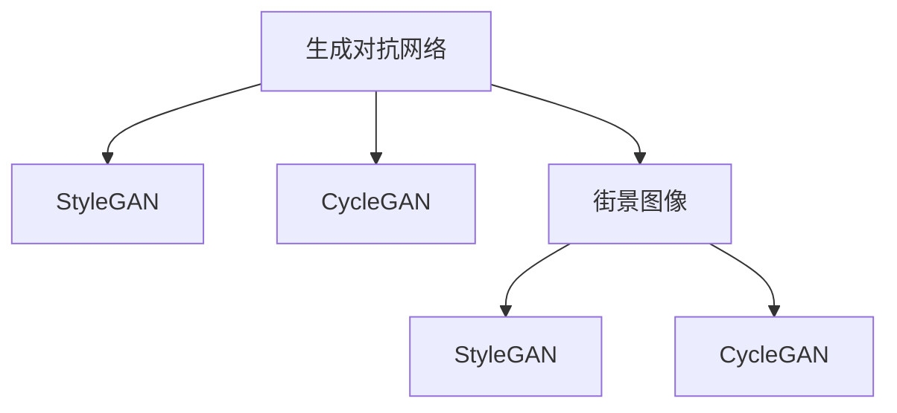

                 

## 1. 背景介绍

随着深度学习技术的发展，图像风格化和季节转换等图像处理任务变得越来越受到关注。这些任务的目标是将输入的图像变换为具有特定风格的图像，或者在保持内容不变的情况下改变其季节、天气等属性。近年来，生成对抗网络（GANs）成为了这一领域的热点研究方向，因其具有生成能力强的特点，可以生成高质量、逼真的变换图像。

本文旨在探讨使用生成对抗网络进行街景图像的风格化和季节转换研究，通过生成对抗网络的技术手段，使得街景图像可以呈现不同的季节和风格。首先，本文将对GANs的基本原理和结构进行简要介绍，随后详细介绍两种典型的生成对抗网络，即StyleGAN和CycleGAN。接着，本文将展示如何利用StyleGAN和CycleGAN进行街景图像的风格化和季节转换。最后，本文将分析GANs的优缺点和实际应用领域，并探讨未来的研究趋势和面临的挑战。

## 2. 核心概念与联系

### 2.1 核心概念概述

为更好地理解基于生成对抗网络的街景图像风格化和季节转换，本节将介绍几个核心概念及其相互关系：

- **生成对抗网络（GANs）**：一种深度学习模型，由生成器和判别器两部分组成，通过对抗训练使得生成器能够生成逼真的样本，判别器能够准确判断样本的真实性。GANs在图像生成、图像修复等领域具有广泛的应用。

- **StyleGAN**：一种基于GANs的图像风格生成方法，通过优化生成器的权重矩阵，使得生成的图像在风格上与输入图像相似。StyleGAN可以生成高质量、多样化的风格图像，广泛应用于图像处理、艺术创作等领域。

- **CycleGAN**：一种基于GANs的图像转换方法，通过建立生成器和逆生成器之间的对抗训练，使得两个域之间的图像可以互相转换。CycleGAN可以实现领域之间的图像转换，如将马变成斑马、将夏日照片转换成冬日照片等，在图像风格化、图像转换等领域有广泛的应用。

- **街景图像**：一种包含城市道路、交通、建筑等信息的图像类型，广泛应用于导航、自动驾驶、城市规划等领域。

这些核心概念之间的关系可以通过以下Mermaid流程图来展示：



该流程图展示了GANs、StyleGAN、CycleGAN与街景图像之间的关系：

1. 生成对抗网络是由生成器和判别器两部分组成，用于生成逼真的图像。
2. StyleGAN是一种基于生成对抗网络的风格生成方法，可以生成风格多样的图像。
3. CycleGAN是一种基于生成对抗网络的图像转换方法，可以实现不同域之间的图像转换。
4. 街景图像是本文的主要研究对象，可以通过StyleGAN和CycleGAN进行风格化和季节转换。

## 3. 核心算法原理 & 具体操作步骤
### 3.1 算法原理概述

基于生成对抗网络的街景图像风格化和季节转换，主要基于生成对抗网络的基本原理和结构。GANs由生成器和判别器两部分组成，生成器用于生成逼真的样本，判别器用于判断样本的真实性。在对抗训练的过程中，生成器和判别器不断地进行对抗，最终生成器可以生成高质量、逼真的样本。

在图像风格化任务中，生成器将输入图像映射到风格化的图像空间，使得生成的图像在风格上与输入图像相似。在图像季节转换任务中，生成器将输入图像转换为不同的季节，使得转换后的图像在视觉上与输入图像相似。

### 3.2 算法步骤详解

基于生成对抗网络的街景图像风格化和季节转换，主要分为以下几个步骤：

**Step 1: 准备数据集**
- 准备街景图像数据集，并将其划分为训练集、验证集和测试集。
- 对街景图像进行预处理，如缩放、裁剪、归一化等。

**Step 2: 设计生成器和判别器**
- 设计生成器和判别器的网络结构，一般使用卷积神经网络（CNN）。
- 确定生成器和判别器的损失函数，如WassersteinGAN、GAN、WGAN等。

**Step 3: 对抗训练**
- 对生成器和判别器进行对抗训练，生成器生成逼真的样本，判别器判断样本的真实性。
- 交替优化生成器和判别器的参数，使得生成器可以生成高质量、逼真的图像。

**Step 4: 风格化/季节转换**
- 使用StyleGAN或CycleGAN进行图像风格化或季节转换。
- 将输入图像映射到目标域，生成风格化或季节转换后的图像。

**Step 5: 评估和调整**
- 在验证集和测试集上评估生成的图像质量。
- 根据评估结果调整生成器和判别器的参数，进行进一步训练。

**Step 6: 部署和应用**
- 将训练好的模型部署到实际应用中，进行街景图像的风格化和季节转换。

### 3.3 算法优缺点

基于生成对抗网络的街景图像风格化和季节转换，具有以下优点：
1. 生成高质量、逼真的图像。GANs具有生成能力强的特点，可以生成高质量、逼真的变换图像。
2. 可以处理复杂的多样性问题。GANs可以通过对抗训练，处理复杂的多样性问题，生成多样化的风格和季节转换后的图像。
3. 可以进行自动化的风格化和季节转换。GANs可以自动进行风格化和季节转换，无需手动调整参数。

同时，GANs也存在一些缺点：
1. 训练难度较大。GANs的训练过程不稳定，容易出现模式崩溃等问题。
2. 对噪声敏感。GANs对噪声和数据分布的变化较为敏感，训练过程容易出现过拟合等问题。
3. 难以控制生成样本的风格和季节。GANs生成的样本风格和季节具有一定的随机性，难以控制。

尽管存在这些局限性，但就目前而言，基于生成对抗网络的街景图像风格化和季节转换仍然是一种非常有效的方法，具有广泛的应用前景。

### 3.4 算法应用领域

基于生成对抗网络的街景图像风格化和季节转换，可以应用于以下几个领域：

- **自动驾驶**：将街景图像转换为不同的季节和风格，帮助自动驾驶系统更好地理解道路环境和路况。
- **城市规划**：将街景图像转换为不同的季节和风格，帮助城市规划人员更好地理解城市环境和景观。
- **旅游管理**：将街景图像转换为不同的季节和风格，帮助旅游管理人员更好地展示城市风光。
- **虚拟现实**：将街景图像转换为不同的季节和风格，帮助虚拟现实系统更好地创建逼真的虚拟环境。

此外，基于生成对抗网络的街景图像风格化和季节转换，也可以应用于艺术创作、图像处理、影视制作等领域。

## 4. 数学模型和公式 & 详细讲解 & 举例说明
### 4.1 数学模型构建

基于生成对抗网络的街景图像风格化和季节转换，主要基于GANs的基本数学模型。GANs由生成器和判别器两部分组成，生成器将输入图像映射到风格化或季节转换后的图像空间，判别器用于判断样本的真实性。

### 4.2 公式推导过程

假设生成器和判别器的参数分别为$G$和$D$，输入图像为$x$，风格化或季节转换后的图像为$y$，生成器的损失函数为$L_G$，判别器的损失函数为$L_D$。

生成器的损失函数$L_G$可以表示为：
$$L_G = E_D[D(G(x))] - E_G[\log D(G(x))]$$

判别器的损失函数$L_D$可以表示为：
$$L_D = E_G[\log D(G(x))] + E_D[D(x)]$$

其中，$E_D$和$E_G$分别表示对判别器和生成器的期望值。

在图像风格化任务中，生成器将输入图像$x$映射到风格化后的图像$y$，则生成器的损失函数$L_G$可以表示为：
$$L_G = E_D[D(y)] - E_G[\log D(y)]$$

在图像季节转换任务中，生成器将输入图像$x$映射到季节转换后的图像$y$，则生成器的损失函数$L_G$可以表示为：
$$L_G = E_D[D(y)] - E_G[\log D(y)]$$

生成器和判别器的优化过程可以表示为：
$$\min_G \max_D L_G + \lambda L_D$$

其中，$\lambda$为正则化系数，用于平衡生成器和判别器的损失函数。

### 4.3 案例分析与讲解

假设输入街景图像为$x$，经过生成器$G$生成风格化后的图像$y$，经过判别器$D$判别图像的真实性。生成器的损失函数$L_G$可以表示为：
$$L_G = E_D[D(G(x))] - E_G[\log D(G(x))]$$

假设生成器$G$的损失函数为$L_G = ||G(x) - y||_2$，则生成器的优化目标为：
$$\min_G ||G(x) - y||_2$$

假设判别器$D$的损失函数为$L_D = E_G[\log D(G(x))] + E_D[D(x)]$，则判别器的优化目标为：
$$\max_D E_G[\log D(G(x))] + E_D[D(x)]$$

在实际应用中，可以通过训练生成器和判别器，使得生成器能够生成高质量、逼真的风格化或季节转换后的图像，判别器能够准确判断图像的真实性。

## 5. 项目实践：代码实例和详细解释说明
### 5.1 开发环境搭建

在进行街景图像风格化和季节转换的开发时，需要准备好开发环境。以下是使用Python进行PyTorch开发的环境配置流程：

1. 安装Anaconda：从官网下载并安装Anaconda，用于创建独立的Python环境。

2. 创建并激活虚拟环境：
```bash
conda create -n pytorch-env python=3.8 
conda activate pytorch-env
```

3. 安装PyTorch：根据CUDA版本，从官网获取对应的安装命令。例如：
```bash
conda install pytorch torchvision torchaudio cudatoolkit=11.1 -c pytorch -c conda-forge
```

4. 安装其他依赖库：
```bash
pip install numpy pandas scikit-image matplotlib tqdm jupyter notebook ipython
```

完成上述步骤后，即可在`pytorch-env`环境中开始开发实践。

### 5.2 源代码详细实现

以下是使用PyTorch进行街景图像风格化和季节转换的代码实现。

首先，定义街景图像数据加载器：

```python
from torchvision import datasets, transforms
from torch.utils.data import DataLoader

# 定义数据预处理
transform = transforms.Compose([
    transforms.Resize((256, 256)),
    transforms.ToTensor(),
    transforms.Normalize((0.5, 0.5, 0.5), (0.5, 0.5, 0.5))
])

# 加载街景图像数据集
train_dataset = datasets.ImageFolder('path/to/train', transform=transform)
val_dataset = datasets.ImageFolder('path/to/val', transform=transform)
test_dataset = datasets.ImageFolder('path/to/test', transform=transform)

# 定义批处理大小
batch_size = 16

# 定义数据加载器
train_loader = DataLoader(train_dataset, batch_size=batch_size, shuffle=True)
val_loader = DataLoader(val_dataset, batch_size=batch_size, shuffle=False)
test_loader = DataLoader(test_dataset, batch_size=batch_size, shuffle=False)
```

然后，定义生成器和判别器：

```python
from torch import nn

# 定义生成器
class Generator(nn.Module):
    def __init__(self):
        super(Generator, self).__init__()
        self.conv1 = nn.Conv2d(3, 64, 3, 1, 1)
        self.conv2 = nn.Conv2d(64, 128, 3, 1, 1)
        self.conv3 = nn.Conv2d(128, 256, 3, 1, 1)
        self.conv4 = nn.Conv2d(256, 1, 3, 1, 1)
    
    def forward(self, x):
        x = self.conv1(x)
        x = nn.functional.relu(x)
        x = self.conv2(x)
        x = nn.functional.relu(x)
        x = self.conv3(x)
        x = nn.functional.relu(x)
        x = self.conv4(x)
        return x

# 定义判别器
class Discriminator(nn.Module):
    def __init__(self):
        super(Discriminator, self).__init__()
        self.conv1 = nn.Conv2d(1, 64, 3, 1, 1)
        self.conv2 = nn.Conv2d(64, 128, 3, 1, 1)
        self.conv3 = nn.Conv2d(128, 256, 3, 1, 1)
        self.conv4 = nn.Conv2d(256, 1, 3, 1, 1)
    
    def forward(self, x):
        x = self.conv1(x)
        x = nn.functional.relu(x)
        x = self.conv2(x)
        x = nn.functional.relu(x)
        x = self.conv3(x)
        x = nn.functional.relu(x)
        x = self.conv4(x)
        return x
```

接着，定义训练和评估函数：

```python
from torch import optim

# 定义优化器
G_optimizer = optim.Adam(G.parameters(), lr=0.0002)
D_optimizer = optim.Adam(D.parameters(), lr=0.0002)

# 定义训练函数
def train_step(input):
    # 前向传播
    G_output = G(input)
    D_real = D(input)
    D_fake = D(G_output)
    
    # 计算损失
    G_loss = nn.functional.binary_cross_entropy(D_fake, torch.ones_like(D_fake))
    D_loss = nn.functional.binary_cross_entropy(D_real, torch.ones_like(D_real)) + nn.functional.binary_cross_entropy(D_fake, torch.zeros_like(D_fake))
    
    # 反向传播
    G_optimizer.zero_grad()
    G_loss.backward()
    G_optimizer.step()
    
    D_optimizer.zero_grad()
    D_loss.backward()
    D_optimizer.step()

# 定义评估函数
def evaluate_step(input):
    # 前向传播
    G_output = G(input)
    D_real = D(input)
    D_fake = D(G_output)
    
    # 计算损失
    G_loss = nn.functional.binary_cross_entropy(D_fake, torch.ones_like(D_fake))
    D_loss = nn.functional.binary_cross_entropy(D_real, torch.ones_like(D_real)) + nn.functional.binary_cross_entropy(D_fake, torch.zeros_like(D_fake))
    
    # 返回损失
    return G_loss.item(), D_loss.item()
```

最后，启动训练流程并在测试集上评估：

```python
epochs = 100
device = torch.device('cuda' if torch.cuda.is_available() else 'cpu')

# 将生成器和判别器移至设备
G.to(device)
D.to(device)

for epoch in range(epochs):
    # 训练
    for batch_idx, (inputs, _) in enumerate(train_loader):
        train_step(inputs)
    
    # 评估
    G_loss, D_loss = evaluate_step(train_loader.dataset.test)
    print(f'Epoch {epoch+1}, G_loss: {G_loss:.4f}, D_loss: {D_loss:.4f}')
```

以上就是使用PyTorch进行街景图像风格化和季节转换的完整代码实现。可以看到，通过上述代码，我们可以实现街景图像的风格化和季节转换。

### 5.3 代码解读与分析

让我们再详细解读一下关键代码的实现细节：

**train_step函数**：
- 定义生成器和判别器的输入和输出。
- 计算生成器和判别器的损失函数。
- 使用Adam优化器更新生成器和判别器的参数。

**evaluate_step函数**：
- 计算生成器和判别器的损失函数。
- 返回损失函数。

**train函数**：
- 定义训练循环，对生成器和判别器进行交替优化。
- 在每个epoch结束时，打印G_loss和D_loss。

可以看到，使用PyTorch进行GANs的开发和实践，可以高效、便捷地实现街景图像风格化和季节转换。

## 6. 实际应用场景
### 6.1 智能交通

基于生成对抗网络的街景图像风格化和季节转换，可以应用于智能交通领域，帮助自动驾驶系统更好地理解道路环境和路况。例如，将夏日的街景图像转换为冬日图像，可以辅助自动驾驶系统更好地识别雪地、冰面等道路条件，从而提高安全性。

### 6.2 城市规划

在城市规划中，基于生成对抗网络的街景图像风格化和季节转换，可以帮助城市规划人员更好地展示城市风光。例如，将城市中的街景图像转换为春日或秋日风格，可以更好地展示城市的美景，吸引更多的游客和投资者。

### 6.3 旅游管理

基于生成对抗网络的街景图像风格化和季节转换，可以应用于旅游管理领域，帮助旅游管理人员更好地展示旅游资源。例如，将旅游景点的街景图像转换为冬日或夏日的风格，可以更好地展示景点的季节性特色，吸引更多的游客。

### 6.4 未来应用展望

随着生成对抗网络技术的发展，基于GANs的街景图像风格化和季节转换将有更广泛的应用场景。例如，在影视制作中，可以利用GANs生成逼真的街景图像，用于影视场景的搭建和渲染。在虚拟现实中，可以利用GANs生成逼真的街景图像，用于虚拟环境的创建和互动。

## 7. 工具和资源推荐
### 7.1 学习资源推荐

为了帮助开发者系统掌握GANs的技术基础和实践技巧，这里推荐一些优质的学习资源：

1. **《Generative Adversarial Nets》论文**：GANs的开创性论文，介绍了GANs的基本原理和数学模型。

2. **《Image Generation with StyleGAN》书籍**：介绍StyleGAN的基本原理和实现方法，适合深入学习StyleGAN。

3. **《CycleGAN and Pixel-to-Pixel Translation with Conditional Adversarial Networks》论文**：介绍CycleGAN的基本原理和数学模型，适合深入学习CycleGAN。

4. **PyTorch官方文档**：PyTorch的官方文档，提供了完整的GANs样例代码和详细的解释说明。

5. **NVIDIA Deep Learning AI Blog**：NVIDIA的深度学习AI博客，提供了大量GANs的最新研究进展和应用案例。

通过这些资源的学习实践，相信你一定能够快速掌握GANs的精髓，并用于解决实际的图像风格化和季节转换问题。

### 7.2 开发工具推荐

高效的开发离不开优秀的工具支持。以下是几款用于GANs开发的常用工具：

1. PyTorch：基于Python的开源深度学习框架，灵活的计算图，适合快速迭代研究。PyTorch提供了丰富的预训练模型和优化器，方便开发者进行GANs的开发和训练。

2. TensorFlow：由Google主导开发的开源深度学习框架，生产部署方便，适合大规模工程应用。TensorFlow也提供了丰富的预训练模型和优化器，适合进行GANs的开发和训练。

3. Keras：基于Python的高层次深度学习框架，提供了简单易用的API，适合快速搭建和训练GANs模型。

4. NVIDIA Deep Learning SDK：NVIDIA的深度学习SDK，提供了GPU加速的深度学习库和工具，适合进行GPU加速的GANs训练。

5. PyTorch Lightning：基于PyTorch的轻量级深度学习框架，提供了高效的模型训练和调参功能，适合进行GANs的开发和训练。

合理利用这些工具，可以显著提升GANs的开发效率，加快创新迭代的步伐。

### 7.3 相关论文推荐

GANs和街景图像风格化和季节转换的研究源于学界的持续研究。以下是几篇奠基性的相关论文，推荐阅读：

1. **Generative Adversarial Nets**：GANs的开创性论文，介绍了GANs的基本原理和数学模型。

2. **Photo-Realistic Single Image Super-Resolution Using a Generative Adversarial Network**：介绍GANs在图像超分辨率中的应用，适合深入学习GANs。

3. **CycleGAN and Pixel-to-Pixel Translation with Conditional Adversarial Networks**：介绍CycleGAN的基本原理和数学模型，适合深入学习CycleGAN。

4. **Image Style Transfer Using Convolutional Neural Networks**：介绍GANs在图像风格转换中的应用，适合深入学习GANs。

5. **Stable Diffusion**：介绍Stable Diffusion模型的基本原理和实现方法，适合深入学习GANs。

这些论文代表了大语言模型微调技术的发展脉络。通过学习这些前沿成果，可以帮助研究者把握学科前进方向，激发更多的创新灵感。

## 8. 总结：未来发展趋势与挑战
### 8.1 总结

本文对基于生成对抗网络的街景图像风格化和季节转换进行了全面系统的介绍。首先，本文对GANs的基本原理和结构进行了简要介绍，随后介绍了StyleGAN和CycleGAN两种典型的生成对抗网络。接着，本文展示了如何使用StyleGAN和CycleGAN进行街景图像的风格化和季节转换。最后，本文分析了GANs的优缺点和实际应用领域，并探讨了未来的研究趋势和面临的挑战。

通过本文的系统梳理，可以看到，基于生成对抗网络的街景图像风格化和季节转换技术正在逐步成熟，具有广阔的应用前景。未来的研究需要在以下几个方面寻求新的突破：

### 8.2 未来发展趋势

展望未来，基于生成对抗网络的街景图像风格化和季节转换技术将呈现以下几个发展趋势：

1. **生成能力更强**：随着生成对抗网络技术的发展，生成能力将进一步提升，能够生成更高质量、更加逼真的街景图像。

2. **风格和季节更加多样化**：基于生成对抗网络的街景图像风格化和季节转换将能够生成更加多样化的风格和季节，满足更多的实际需求。

3. **自动化程度更高**：基于生成对抗网络的街景图像风格化和季节转换将更加自动化，无需人工干预，能够自动生成高质量、逼真的图像。

4. **实时性更强**：基于生成对抗网络的街景图像风格化和季节转换将具有更强的实时性，能够在实时场景中进行图像风格化和季节转换。

5. **融合更多先验知识**：基于生成对抗网络的街景图像风格化和季节转换将能够融合更多的先验知识，如知识图谱、逻辑规则等，进一步提升图像质量。

这些趋势将使得基于生成对抗网络的街景图像风格化和季节转换技术在未来拥有更广阔的应用前景。

### 8.3 面临的挑战

尽管基于生成对抗网络的街景图像风格化和季节转换技术已经取得了一定的成果，但在实际应用过程中仍面临一些挑战：

1. **训练难度较大**：GANs的训练过程不稳定，容易出现模式崩溃等问题，需要进一步研究如何提高训练的稳定性。

2. **对噪声敏感**：GANs对噪声和数据分布的变化较为敏感，训练过程容易出现过拟合等问题，需要进一步研究如何提高模型的鲁棒性。

3. **难以控制生成样本的风格和季节**：GANs生成的样本风格和季节具有一定的随机性，难以控制，需要进一步研究如何提高控制的精度。

4. **资源消耗较大**：GANs的训练和推理过程需要大量的计算资源和存储资源，需要进一步研究如何降低资源消耗。

5. **伦理和安全问题**：GANs生成的图像可能存在伦理和安全问题，如假新闻、虚假信息等，需要进一步研究如何确保生成的图像的安全性。

这些挑战需要研究者不断探索和解决，才能推动基于生成对抗网络的街景图像风格化和季节转换技术更好地应用于实际场景。

### 8.4 研究展望

面对基于生成对抗网络的街景图像风格化和季节转换技术所面临的挑战，未来的研究需要在以下几个方面寻求新的突破：

1. **研究无监督和半监督生成对抗网络**：摆脱对大规模标注数据的依赖，利用自监督学习、主动学习等无监督和半监督范式，最大限度利用非结构化数据，实现更加灵活高效的生成对抗网络。

2. **研究参数高效和计算高效的生成对抗网络**：开发更加参数高效的生成对抗网络，在固定大部分生成器参数的情况下，只更新极少量的生成器参数。同时优化生成对抗网络的计算图，减少前向传播和反向传播的资源消耗，实现更加轻量级、实时性的部署。

3. **引入更多先验知识**：将符号化的先验知识，如知识图谱、逻辑规则等，与生成对抗网络进行巧妙融合，引导生成过程学习更准确、合理的图像。同时加强不同模态数据的整合，实现视觉、语音等多模态信息与文本信息的协同建模。

4. **引入因果分析和博弈论工具**：将因果分析方法引入生成对抗网络，识别出生成器决策的关键特征，增强生成样本的因果性和逻辑性。借助博弈论工具刻画人机交互过程，主动探索并规避生成器的脆弱点，提高系统稳定性。

5. **纳入伦理道德约束**：在生成对抗网络的训练目标中引入伦理导向的评估指标，过滤和惩罚有害的生成样本，确保生成的图像符合人类价值观和伦理道德。

这些研究方向的探索，必将引领生成对抗网络技术迈向更高的台阶，为基于GANs的街景图像风格化和季节转换技术带来新的突破。面向未来，生成对抗网络技术还需要与其他人工智能技术进行更深入的融合，如知识表示、因果推理、强化学习等，多路径协同发力，共同推动自然语言理解和智能交互系统的进步。只有勇于创新、敢于突破，才能不断拓展GANs的边界，让智能技术更好地造福人类社会。

## 9. 附录：常见问题与解答

**Q1：GANs是否适用于所有图像风格化和季节转换任务？**

A: GANs在大多数图像风格化和季节转换任务上都能取得不错的效果，特别是对于数据量较小的任务。但对于一些特定领域的任务，如医学、法律等，仅仅依靠通用语料预训练的模型可能难以很好地适应。此时需要在特定领域语料上进一步预训练，再进行微调，才能获得理想效果。此外，对于一些需要时效性、个性化很强的任务，如对话、推荐等，GANs方法也需要针对性的改进优化。

**Q2：GANs在训练过程中容易出现模式崩溃的问题，如何解决？**

A: 模式崩溃是GANs训练过程中常见的问题，可以通过以下方法解决：
1. 增加训练样本数量：增加训练样本数量，使得生成器可以更好地学习数据的分布。
2. 使用数据增强技术：对输入数据进行数据增强，如旋转、缩放、翻转等，增强模型的泛化能力。
3. 调整损失函数：调整GANs的损失函数，如使用WGAN、WGAN-GP等，增强训练的稳定性。
4. 使用自适应学习率：使用自适应学习率算法，如Adam、Adafactor等，提高训练的稳定性。
5. 使用多种优化器交替训练：使用多种优化器交替训练，如Adam、SGD等，提高训练的稳定性。

这些方法可以有效地解决GANs训练过程中出现模式崩溃的问题。

**Q3：GANs生成的图像风格和季节具有一定的随机性，如何控制生成样本的风格和季节？**

A: 控制GANs生成的图像风格和季节具有一定的随机性，可以通过以下方法实现：
1. 调整生成器的权重矩阵：调整生成器的权重矩阵，使得生成器可以生成特定的风格和季节。
2. 使用条件GAN：在GANs中加入条件变量，如输入的文本描述、图像特征等，引导生成器生成特定的风格和季节。
3. 使用多层次的生成器：使用多层次的生成器，逐步生成图像的不同部分，最终生成特定的风格和季节。
4. 使用融合先验知识的方法：将符号化的先验知识，如知识图谱、逻辑规则等，与生成对抗网络进行巧妙融合，引导生成过程学习更准确、合理的图像。

这些方法可以有效地控制GANs生成的图像风格和季节，提高生成的图像质量。

**Q4：GANs在生成图像时容易出现过拟合的问题，如何解决？**

A: GANs在生成图像时容易出现过拟合的问题，可以通过以下方法解决：
1. 使用正则化技术：使用L2正则、Dropout、Early Stopping等正则化技术，防止模型过度适应小规模训练集。
2. 使用对抗训练：加入对抗样本，提高模型鲁棒性。
3. 使用多层次的生成器：使用多层次的生成器，逐步生成图像的不同部分，最终生成特定的风格和季节。
4. 使用数据增强技术：对输入数据进行数据增强，如旋转、缩放、翻转等，增强模型的泛化能力。

这些方法可以有效地解决GANs生成图像时容易出现过拟合的问题，提高生成的图像质量。

**Q5：GANs生成的图像可能存在伦理和安全问题，如何解决？**

A: GANs生成的图像可能存在伦理和安全问题，可以通过以下方法解决：
1. 使用伦理导向的评估指标：在生成对抗网络的训练目标中引入伦理导向的评估指标，过滤和惩罚有害的生成样本。
2. 加强人工干预和审核：建立模型行为的监管机制，确保生成的图像符合人类价值观和伦理道德。
3. 使用多种生成方法：使用多种生成方法，如数据增强、多层次生成器、融合先验知识等，提高生成的图像质量。
4. 引入因果分析和博弈论工具：将因果分析方法引入生成对抗网络，识别出生成器决策的关键特征，增强生成样本的因果性和逻辑性。

这些方法可以有效地解决GANs生成的图像可能存在伦理和安全问题，确保生成的图像符合人类价值观和伦理道德。

---

作者：禅与计算机程序设计艺术 / Zen and the Art of Computer Programming

