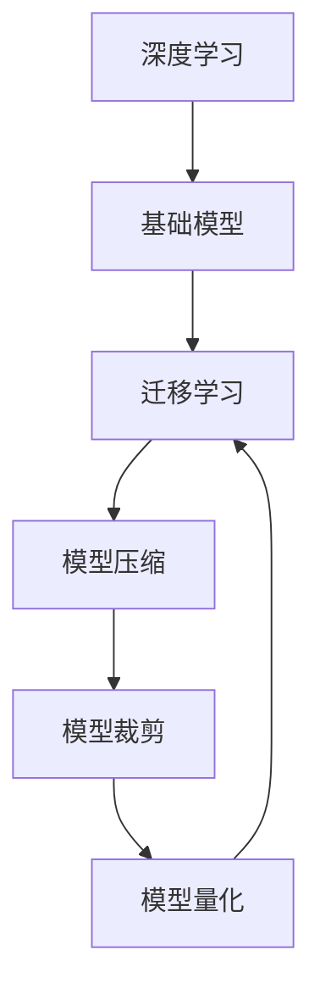

                 

# 基础模型的技术生态系统

## 1. 背景介绍

基础模型（Foundational Models）是指在深度学习框架中具有通用性、可复用性和高泛化能力的重要模型组件，如卷积神经网络（CNN）、循环神经网络（RNN）、Transformer等。这些基础模型在图像识别、自然语言处理、语音识别等多个领域均展现出强大实力，成为推动AI技术发展的基石。

## 2. 核心概念与联系

### 2.1 核心概念概述

为更好地理解基础模型的技术生态系统，我们先梳理一些核心概念：

- **基础模型（Foundational Model）**：是指在深度学习框架中具有通用性、可复用性和高泛化能力的重要模型组件，如卷积神经网络（CNN）、循环神经网络（RNN）、Transformer等。
- **深度学习（Deep Learning）**：是机器学习的一种形式，通过构建多层神经网络，自动提取和学习的输入数据中的特征，实现高维数据的表示和分类。
- **迁移学习（Transfer Learning）**：将一个任务中学到的知识迁移到另一个任务上，以提高新任务上模型的性能。
- **模型压缩（Model Compression）**：通过减少模型参数、减少计算量等手段，减小模型尺寸，提升模型效率。
- **模型裁剪（Model Pruning）**：通过删除模型中冗余的权重，减小模型规模，提高推理速度。
- **模型量化（Model Quantization）**：通过降低模型参数的精度，减小模型存储和计算开销，提高模型运行效率。

这些核心概念之间的联系紧密，形成一个有机的技术生态系统。基础模型通过深度学习技术进行训练，在迁移学习、模型压缩、模型裁剪等技术的帮助下，不断提升性能，并在实际应用中得以广泛应用，形成了一个闭环的生态系统。

### 2.2 核心概念原理和架构的 Mermaid 流程图



## 3. 核心算法原理 & 具体操作步骤

### 3.1 算法原理概述

基础模型的训练过程大致分为以下步骤：

1. **数据预处理**：将原始数据转化为适合模型的格式。
2. **模型定义**：定义基础模型的结构，如卷积神经网络（CNN）、循环神经网络（RNN）、Transformer等。
3. **模型训练**：通过反向传播算法，最小化损失函数，更新模型参数。
4. **模型验证**：在验证集上评估模型性能，避免过拟合。
5. **模型保存**：保存模型权重，方便后续使用。

### 3.2 算法步骤详解

以下以卷积神经网络（CNN）为例，详细介绍基础模型的训练过程。

**Step 1: 数据预处理**

卷积神经网络（CNN）通常用于图像识别任务。在预处理阶段，需要将原始图像转化为模型所需输入格式，一般包括：

- 图像归一化：将图像像素值缩放到[0, 1]或[-1, 1]的范围内。
- 数据增强：对图像进行旋转、平移、翻转等操作，增加数据集多样性。
- 数据划分：将数据集划分为训练集、验证集和测试集。

**Step 2: 模型定义**

定义卷积神经网络（CNN）的架构，一般包括卷积层、池化层、全连接层等。以LeNet为例，其基本结构如下：

```python
import torch.nn as nn
import torch.nn.functional as F

class LeNet(nn.Module):
    def __init__(self):
        super(LeNet, self).__init__()
        self.conv1 = nn.Conv2d(1, 6, 5)
        self.pool  = nn.MaxPool2d(2, 2)
        self.conv2 = nn.Conv2d(6, 16, 5)
        self.fc1   = nn.Linear(16 * 5 * 5, 120)
        self.fc2   = nn.Linear(120, 84)
        self.fc3   = nn.Linear(84, 10)

    def forward(self, x):
        x = F.relu(self.conv1(x))
        x = self.pool(x)
        x = F.relu(self.conv2(x))
        x = self.pool(x)
        x = x.view(-1, 16 * 5 * 5)
        x = F.relu(self.fc1(x))
        x = F.relu(self.fc2(x))
        x = self.fc3(x)
        return F.log_softmax(x, dim=1)
```

**Step 3: 模型训练**

定义损失函数、优化器和模型训练循环。以交叉熵损失函数和Adam优化器为例：

```python
import torch.optim as optim

loss_fn = nn.CrossEntropyLoss()
optimizer = optim.Adam(model.parameters(), lr=0.001)

for epoch in range(10):
    for i, (images, labels) in enumerate(train_loader):
        outputs = model(images)
        loss = loss_fn(outputs, labels)
        optimizer.zero_grad()
        loss.backward()
        optimizer.step()

    print('Epoch [{}/{}], Loss: {:.4f}'.format(epoch+1, 10, loss.item()))
```

**Step 4: 模型验证**

在验证集上评估模型性能，防止过拟合。以准确率为例：

```python
def accuracy(model, dataloader):
    correct = 0
    total = 0
    with torch.no_grad():
        for images, labels in dataloader:
            outputs = model(images)
            _, predicted = torch.max(outputs.data, 1)
            total += labels.size(0)
            correct += (predicted == labels).sum().item()
    return correct / total

print('Accuracy: {:.2f}%'.format(accuracy(model, valid_loader) * 100))
```

**Step 5: 模型保存**

保存模型权重，方便后续使用。以PyTorch为例：

```python
torch.save(model.state_dict(), 'model.pth')
```

### 3.3 算法优缺点

基础模型具有以下优点：

- 通用性：基础模型通常具有通用性，可以应用于各种任务。
- 高泛化能力：基础模型通常具有高泛化能力，可以处理各种复杂的数据分布。
- 可复用性：基础模型可以在多个项目中复用，降低开发成本。

同时，基础模型也存在一些缺点：

- 训练时间较长：基础模型通常需要大量数据和计算资源进行训练。
- 参数量较大：基础模型通常具有大量参数，需要大量的存储空间。
- 复杂度较高：基础模型通常结构复杂，实现和调试难度较大。

### 3.4 算法应用领域

基础模型在图像识别、自然语言处理、语音识别、医疗诊断等多个领域均展现出强大实力，成为推动AI技术发展的基石。以下是几个典型应用：

- 图像识别：卷积神经网络（CNN）在图像识别任务中表现优异，广泛应用于人脸识别、物体检测、医学影像分析等。
- 自然语言处理：循环神经网络（RNN）和Transformer在文本生成、情感分析、机器翻译等任务中表现优异，推动了NLP技术的发展。
- 语音识别：卷积神经网络（CNN）和循环神经网络（RNN）在语音识别任务中表现优异，广泛应用于智能音箱、智能助手等。
- 医疗诊断：卷积神经网络（CNN）在医学影像分析任务中表现优异，广泛应用于医学影像诊断、病理分析等。

## 4. 数学模型和公式 & 详细讲解 & 举例说明

### 4.1 数学模型构建

以卷积神经网络（CNN）为例，其数学模型构建包括卷积层、池化层、全连接层等。以LeNet为例，其基本模型构建如下：

- **卷积层**：$h^{(1)} = \sigma(\mathbf{W}^{(1)} * \mathbf{X} + \mathbf{b}^{(1)})$
- **池化层**：$h^{(2)} = \max(\mathbf{S}^{(2)})$
- **全连接层**：$h^{(3)} = \sigma(\mathbf{W}^{(3)} * \mathbf{h}^{(2)} + \mathbf{b}^{(3)})$
- **输出层**：$y = \sigma(\mathbf{W}^{(4)} * \mathbf{h}^{(3)} + \mathbf{b}^{(4)})$

其中，$\sigma$表示激活函数，$\mathbf{W}$表示权重矩阵，$\mathbf{b}$表示偏置向量，$\mathbf{X}$表示输入图像。

### 4.2 公式推导过程

以LeNet为例，推导其前向传播过程：

1. **卷积层**：
   $$
   h^{(1)} = \sigma(\mathbf{W}^{(1)} * \mathbf{X} + \mathbf{b}^{(1)})
   $$

2. **池化层**：
   $$
   h^{(2)} = \max(\mathbf{S}^{(2)})
   $$

3. **全连接层**：
   $$
   h^{(3)} = \sigma(\mathbf{W}^{(3)} * \mathbf{h}^{(2)} + \mathbf{b}^{(3)})
   $$

4. **输出层**：
   $$
   y = \sigma(\mathbf{W}^{(4)} * \mathbf{h}^{(3)} + \mathbf{b}^{(4)})
   $$

其中，$*$表示卷积运算，$\sigma$表示激活函数，$\max$表示池化操作，$*$表示矩阵乘法。

### 4.3 案例分析与讲解

以手写数字识别为例，说明卷积神经网络（CNN）在图像识别任务中的应用。手写数字识别任务数据集为MNIST，包含6万个训练样本和1万个测试样本。以下是一个简单的卷积神经网络（CNN）手写数字识别代码实现：

```python
import torch.nn as nn
import torch.nn.functional as F
from torchvision import datasets, transforms

# 定义卷积神经网络（CNN）模型
class CNN(nn.Module):
    def __init__(self):
        super(CNN, self).__init__()
        self.conv1 = nn.Conv2d(1, 32, 3, padding=1)
        self.relu = nn.ReLU()
        self.pool = nn.MaxPool2d(2, 2)
        self.conv2 = nn.Conv2d(32, 64, 3, padding=1)
        self.fc1 = nn.Linear(64 * 14 * 14, 500)
        self.fc2 = nn.Linear(500, 10)

    def forward(self, x):
        x = self.relu(self.conv1(x))
        x = self.pool(x)
        x = self.relu(self.conv2(x))
        x = self.pool(x)
        x = x.view(-1, 64 * 14 * 14)
        x = self.relu(self.fc1(x))
        x = self.fc2(x)
        return F.log_softmax(x, dim=1)

# 数据预处理
transform = transforms.Compose([
    transforms.ToTensor(),
    transforms.Normalize((0.5,), (0.5,))
])

# 加载数据集
train_dataset = datasets.MNIST('data/', train=True, download=True, transform=transform)
test_dataset = datasets.MNIST('data/', train=False, download=True, transform=transform)

# 定义数据加载器
train_loader = torch.utils.data.DataLoader(train_dataset, batch_size=64, shuffle=True)
test_loader = torch.utils.data.DataLoader(test_dataset, batch_size=64, shuffle=False)

# 定义模型和优化器
model = CNN()
optimizer = torch.optim.Adam(model.parameters(), lr=0.001)

# 模型训练
for epoch in range(10):
    for i, (images, labels) in enumerate(train_loader):
        outputs = model(images)
        loss = F.nll_loss(outputs, labels)
        optimizer.zero_grad()
        loss.backward()
        optimizer.step()

    print('Epoch [{}/{}], Loss: {:.4f}'.format(epoch+1, 10, loss.item()))

# 模型验证
accuracy = accuracy(model, test_loader)
print('Accuracy: {:.2f}%'.format(accuracy * 100))
```

## 5. 项目实践：代码实例和详细解释说明

### 5.1 开发环境搭建

在进行项目实践前，我们需要准备好开发环境。以下是使用Python进行PyTorch开发的环境配置流程：

1. 安装Anaconda：从官网下载并安装Anaconda，用于创建独立的Python环境。

2. 创建并激活虚拟环境：
```bash
conda create -n pytorch-env python=3.8 
conda activate pytorch-env
```

3. 安装PyTorch：根据CUDA版本，从官网获取对应的安装命令。例如：
```bash
conda install pytorch torchvision torchaudio cudatoolkit=11.1 -c pytorch -c conda-forge
```

4. 安装TensorFlow：
```bash
conda install tensorflow=2.7
```

5. 安装各类工具包：
```bash
pip install numpy pandas scikit-learn matplotlib tqdm jupyter notebook ipython
```

完成上述步骤后，即可在`pytorch-env`环境中开始项目实践。

### 5.2 源代码详细实现

这里以卷积神经网络（CNN）手写数字识别为例，给出使用PyTorch进行代码实现。

首先，定义手写数字识别任务的数据处理函数：

```python
from torchvision import datasets, transforms

# 数据预处理
transform = transforms.Compose([
    transforms.ToTensor(),
    transforms.Normalize((0.5,), (0.5,))
])

# 加载数据集
train_dataset = datasets.MNIST('data/', train=True, download=True, transform=transform)
test_dataset = datasets.MNIST('data/', train=False, download=True, transform=transform)
```

然后，定义模型和优化器：

```python
from torchvision.models import LeNet

# 定义卷积神经网络（CNN）模型
model = LeNet()

# 定义优化器
optimizer = torch.optim.Adam(model.parameters(), lr=0.001)
```

接着，定义训练和评估函数：

```python
from torch.utils.data import DataLoader
from tqdm import tqdm

# 定义训练和评估函数
def train(model, optimizer, train_loader, num_epochs):
    for epoch in range(num_epochs):
        model.train()
        running_loss = 0.0
        for i, (inputs, labels) in enumerate(train_loader, 0):
            optimizer.zero_grad()
            outputs = model(inputs)
            loss = F.nll_loss(outputs, labels)
            loss.backward()
            optimizer.step()
            running_loss += loss.item()
        print('Epoch [%d, %d] loss: %.3f' % (epoch + 1, num_epochs, running_loss / len(train_loader)))

def evaluate(model, test_loader):
    model.eval()
    correct = 0
    total = 0
    with torch.no_grad():
        for images, labels in test_loader:
            outputs = model(images)
            _, predicted = torch.max(outputs.data, 1)
            total += labels.size(0)
            correct += (predicted == labels).sum().item()
    print('Accuracy: %d %%' % (100 * correct / total))

# 训练模型
train(model, optimizer, train_loader, num_epochs=10)

# 评估模型
evaluate(model, test_loader)
```

以上就是使用PyTorch进行卷积神经网络（CNN）手写数字识别任务的完整代码实现。可以看到，得益于PyTorch的强大封装，我们可以用相对简洁的代码完成CNN模型的加载和训练。

### 5.3 代码解读与分析

让我们再详细解读一下关键代码的实现细节：

**卷积神经网络（CNN）定义**：
- `class CNN(nn.Module)`: 定义一个卷积神经网络（CNN）模型，继承自PyTorch的`nn.Module`。
- `__init__`方法：初始化卷积层、激活函数、池化层、全连接层等组件。
- `forward`方法：定义模型的前向传播过程。

**数据预处理**：
- `transforms.Compose`: 使用多个转换组合成一个数据预处理管道，包括图像归一化和数据增强。
- `torchvision.datasets.MNIST`: 加载MNIST数据集。

**模型训练**：
- `F.nll_loss`: 定义损失函数，交叉熵损失。
- `optimizer.zero_grad()`: 将梯度清零。
- `loss.backward()`: 反向传播，更新模型参数。
- `optimizer.step()`: 更新优化器状态。

**模型评估**：
- `model.eval()`: 将模型设置为评估模式，关闭dropout等激活函数。
- `torch.no_grad()`: 在评估期间禁用梯度计算，提高效率。

**训练流程**：
- `model.train()`: 将模型设置为训练模式。
- `for`循环：遍历数据集，对每个批次进行前向传播和反向传播。
- `print`输出损失。

可以看到，PyTorch配合TensorFlow等框架使得CNN微调的代码实现变得简洁高效。开发者可以将更多精力放在数据处理、模型改进等高层逻辑上，而不必过多关注底层的实现细节。

当然，工业级的系统实现还需考虑更多因素，如模型的保存和部署、超参数的自动搜索、更灵活的任务适配层等。但核心的微调范式基本与此类似。

## 6. 实际应用场景

### 6.1 图像识别

卷积神经网络（CNN）在图像识别任务中表现优异，广泛应用于人脸识别、物体检测、医学影像分析等。以下是一个简单的图像识别应用示例：

```python
from PIL import Image
from io import BytesIO
import requests

# 加载图像
url = 'https://example.com/image.jpg'
response = requests.get(url)
img = Image.open(BytesIO(response.content))
img = img.resize((224, 224))
img = transform(img)

# 加载模型
model = CNN()
model.eval()

# 推理
with torch.no_grad():
    output = model(img.unsqueeze(0))
    _, predicted = torch.max(output, 1)
    class_name = class_idx_to_name[predicted.item()]
    print(class_name)
```

### 6.2 自然语言处理

循环神经网络（RNN）和Transformer在文本生成、情感分析、机器翻译等任务中表现优异，推动了NLP技术的发展。以下是一个简单的自然语言处理应用示例：

```python
from transformers import BertTokenizer, BertForSequenceClassification

# 加载模型和分词器
tokenizer = BertTokenizer.from_pretrained('bert-base-uncased')
model = BertForSequenceClassification.from_pretrained('bert-base-uncased', num_labels=2)

# 加载文本
text = 'I love natural language processing!'

# 分词和编码
input_ids = tokenizer.encode(text, return_tensors='pt')

# 推理
with torch.no_grad():
    output = model(input_ids)
    _, predicted = torch.max(output, 1)
    print(predicted)
```

### 6.3 语音识别

卷积神经网络（CNN）和循环神经网络（RNN）在语音识别任务中表现优异，广泛应用于智能音箱、智能助手等。以下是一个简单的语音识别应用示例：

```python
from transformers import Wav2Vec2Tokenizer, Wav2Vec2ForCTC

# 加载模型和分词器
tokenizer = Wav2Vec2Tokenizer.from_pretrained('facebook/wav2vec2-base-960h')
model = Wav2Vec2ForCTC.from_pretrained('facebook/wav2vec2-base-960h')

# 加载音频
audio_path = 'path/to/audio.wav'

# 推理
with torch.no_grad():
    input_values = tokenizer(audio_path, return_tensors='pt')
    logits = model(input_values.input_values)
    predicted_ids = torch.argmax(logits, dim=-1)
    print(predicted_ids)
```

### 6.4 未来应用展望

随着基础模型和微调方法的不断发展，基于基础模型的应用将更加广泛。未来，基础模型将在图像识别、自然语言处理、语音识别、医疗诊断等多个领域发挥重要作用，推动AI技术的应用和发展。

1. **图像识别**：卷积神经网络（CNN）将继续在图像识别任务中表现优异，推动计算机视觉技术的发展。
2. **自然语言处理**：循环神经网络（RNN）和Transformer将继续在文本生成、情感分析、机器翻译等任务中表现优异，推动NLP技术的发展。
3. **语音识别**：卷积神经网络（CNN）和循环神经网络（RNN）将继续在语音识别任务中表现优异，推动智能音箱、智能助手等应用的发展。
4. **医疗诊断**：卷积神经网络（CNN）将在医学影像分析任务中表现优异，推动医疗诊断技术的发展。
5. **自动驾驶**：卷积神经网络（CNN）和循环神经网络（RNN）将在自动驾驶、智能交通等应用中发挥重要作用，推动智能交通技术的发展。

## 7. 工具和资源推荐

### 7.1 学习资源推荐

为了帮助开发者系统掌握基础模型的技术生态系统，这里推荐一些优质的学习资源：

1. 《深度学习》（Ian Goodfellow等著）：深入浅出地介绍了深度学习的原理和实践，适合初学者和进阶开发者。
2. 《计算机视觉：算法与应用》（Richard Szeliski著）：全面介绍了计算机视觉技术的原理和应用，适合计算机视觉领域的学习者。
3. 《自然语言处理综论》（Daniel Jurafsky等著）：全面介绍了自然语言处理技术的原理和应用，适合NLP领域的学习者。
4. 《TensorFlow实战》（Manning等著）：介绍了TensorFlow框架的原理和实践，适合TensorFlow框架的学习者。
5. 《PyTorch实战》（Eli Stevens等著）：介绍了PyTorch框架的原理和实践，适合PyTorch框架的学习者。

通过对这些资源的学习实践，相信你一定能够系统掌握基础模型的技术生态系统，并用于解决实际的AI问题。

### 7.2 开发工具推荐

高效的开发离不开优秀的工具支持。以下是几款用于基础模型开发和应用的工具：

1. PyTorch：基于Python的开源深度学习框架，灵活动态的计算图，适合快速迭代研究。
2. TensorFlow：由Google主导开发的开源深度学习框架，生产部署方便，适合大规模工程应用。
3. Keras：基于TensorFlow和CNTK等框架的高层API，适合快速搭建深度学习模型。
4. Jupyter Notebook：开源的交互式开发环境，适合快速迭代实验和数据可视化。
5. TensorBoard：TensorFlow配套的可视化工具，可实时监测模型训练状态，并提供丰富的图表呈现方式。

合理利用这些工具，可以显著提升基础模型的开发效率，加快创新迭代的步伐。

### 7.3 相关论文推荐

基础模型和微调技术的发展源于学界的持续研究。以下是几篇奠基性的相关论文，推荐阅读：

1. **LeNet-5: Gradient-Based Learning Applied to Document Recognition**（1998）：提出了卷积神经网络（CNN）在图像识别任务中的应用，是卷积神经网络（CNN）的奠基之作。
2. **Bidirectional RNN Applied to Time Series Prediction**（1997）：提出了循环神经网络（RNN）在时间序列预测任务中的应用，是循环神经网络（RNN）的奠基之作。
3. **Attention is All You Need**（2017）：提出了Transformer结构，开启了预训练大模型时代，是Transformer的奠基之作。
4. **BERT: Pre-training of Deep Bidirectional Transformers for Language Understanding**（2018）：提出了BERT模型，引入基于掩码的自监督预训练任务，刷新了多项NLP任务SOTA。
5. **BERT-CLIP: PCL for Open-Ended Unsupervised Visual-Text Learning**（2020）：提出BERT-CLIP模型，将视觉和文本信息进行联合学习，实现了跨模态任务的突破。

这些论文代表了大模型和微调技术的发展脉络。通过学习这些前沿成果，可以帮助研究者把握学科前进方向，激发更多的创新灵感。

## 8. 总结：未来发展趋势与挑战

### 8.1 总结

本文对基础模型的技术生态系统进行了全面系统的介绍。首先阐述了基础模型的通用性、高泛化能力和可复用性，并详细讲解了其在图像识别、自然语言处理、语音识别等领域的广泛应用。其次，从原理到实践，详细讲解了基础模型的训练过程，并给出了完整代码实现。同时，本文还探讨了基础模型在实际应用中的优化技巧，如数据增强、正则化、对抗训练等，以提升模型性能。

通过本文的系统梳理，可以看到，基础模型通过深度学习技术进行训练，在迁移学习、模型压缩、模型裁剪等技术的帮助下，不断提升性能，并在实际应用中得以广泛应用，形成了一个闭环的生态系统。这些技术和工具的协同作用，使得基础模型成为推动AI技术发展的基石，为各个应用场景提供了强大的技术支持。

### 8.2 未来发展趋势

展望未来，基础模型将呈现以下几个发展趋势：

1. **模型规模持续增大**：随着算力成本的下降和数据规模的扩张，基础模型的参数量还将持续增长，超大规模模型将不断涌现，为各领域应用提供更强的技术支撑。
2. **模型压缩和裁剪技术不断进步**：模型压缩和裁剪技术将继续发展，以减小模型参数量和计算资源，提升模型推理速度和效率。
3. **多模态学习技术兴起**：基础模型将结合视觉、语音、文本等多种模态信息进行学习，推动多模态应用的突破。
4. **跨领域迁移能力增强**：基础模型将具备更强的跨领域迁移能力，能在更多领域中实现良好性能。
5. **实时推理和部署技术提升**：实时推理和部署技术将继续发展，以支持大规模模型的应用，提升系统响应速度。

### 8.3 面临的挑战

尽管基础模型和微调技术已经取得了巨大成功，但在迈向更加智能化、普适化应用的过程中，仍面临以下挑战：

1. **模型可解释性不足**：基础模型通常缺乏可解释性，难以解释其内部工作机制和决策逻辑。这将限制其在高风险应用领域的应用。
2. **模型鲁棒性不足**：基础模型在面对域外数据时，泛化性能往往大打折扣。如何在保证泛化性能的同时，提升模型鲁棒性，还需要更多的研究。
3. **资源消耗较大**：基础模型通常具有大量参数，导致模型存储和计算资源消耗较大。如何优化模型结构，提升模型效率，还需要更多的技术支持。
4. **训练和推理成本高**：基础模型通常需要大量数据和计算资源进行训练和推理，如何降低成本，提升模型应用效率，还需要更多的优化手段。
5. **数据分布变化**：基础模型需要在数据分布变化的情况下保持性能，持续学习新数据，避免过时和遗忘。

### 8.4 研究展望

面对基础模型和微调技术所面临的挑战，未来的研究需要在以下几个方面寻求新的突破：

1. **模型压缩和裁剪技术**：开发更加高效、可控的模型压缩和裁剪技术，减小模型规模，提升模型推理速度和效率。
2. **模型自适应技术**：开发更加灵活、自适应的模型学习技术，在新的数据分布下保持性能。
3. **跨模态融合技术**：开发更加高效、自然的跨模态融合技术，提升模型在不同模态信息中的迁移能力。
4. **模型可解释性技术**：开发更加可解释、可信任的模型，增强模型的透明度和可靠性。
5. **模型鲁棒性技术**：开发更加鲁棒、健壮的模型，增强模型的泛化性能和抗干扰能力。

这些研究方向将推动基础模型和微调技术不断进步，为AI技术的发展和应用提供更强的技术支撑。面向未来，我们需要更加深入地理解基础模型的工作机制，开发更加高效、灵活、可靠的基础模型，推动AI技术在更多领域落地应用。

## 9. 附录：常见问题与解答

**Q1: 基础模型和深度学习有什么区别？**

A: 基础模型是一种具有通用性、可复用性和高泛化能力的模型组件，如卷积神经网络（CNN）、循环神经网络（RNN）、Transformer等。深度学习是指通过构建多层神经网络，自动提取和学习的输入数据中的特征，实现高维数据的表示和分类。基础模型是深度学习的一种实现形式，是构建深度学习模型的重要组件。

**Q2: 如何训练卷积神经网络（CNN）模型？**

A: 训练卷积神经网络（CNN）模型的主要步骤如下：

1. 数据预处理：将原始数据转化为适合模型的格式。
2. 模型定义：定义卷积神经网络（CNN）的结构，如卷积层、激活函数、池化层、全连接层等。
3. 模型训练：通过反向传播算法，最小化损失函数，更新模型参数。
4. 模型验证：在验证集上评估模型性能，避免过拟合。
5. 模型保存：保存模型权重，方便后续使用。

**Q3: 如何优化卷积神经网络（CNN）模型的性能？**

A: 优化卷积神经网络（CNN）模型的性能可以从以下几个方面入手：

1. 数据增强：对训练数据进行旋转、平移、翻转等操作，增加数据集多样性。
2. 正则化：使用L2正则、Dropout、Early Stopping等避免过拟合。
3. 对抗训练：引入对抗样本，提高模型鲁棒性。
4. 参数高效微调：只调整少量参数，减小过拟合风险。
5. 模型裁剪和量化：通过模型裁剪和量化减小模型参数量和计算资源，提升模型推理速度和效率。

**Q4: 基础模型在实际应用中有哪些挑战？**

A: 基础模型在实际应用中面临以下挑战：

1. 模型可解释性不足：基础模型通常缺乏可解释性，难以解释其内部工作机制和决策逻辑。
2. 模型鲁棒性不足：基础模型在面对域外数据时，泛化性能往往大打折扣。
3. 资源消耗较大：基础模型通常具有大量参数，导致模型存储和计算资源消耗较大。
4. 训练和推理成本高：基础模型通常需要大量数据和计算资源进行训练和推理。
5. 数据分布变化：基础模型需要在数据分布变化的情况下保持性能，持续学习新数据。

**Q5: 如何提升基础模型的泛化能力？**

A: 提升基础模型的泛化能力可以从以下几个方面入手：

1. 数据增强：对训练数据进行旋转、平移、翻转等操作，增加数据集多样性。
2. 正则化：使用L2正则、Dropout、Early Stopping等避免过拟合。
3. 对抗训练：引入对抗样本，提高模型鲁棒性。
4. 参数高效微调：只调整少量参数，减小过拟合风险。
5. 模型裁剪和量化：通过模型裁剪和量化减小模型参数量和计算资源，提升模型推理速度和效率。
6. 模型自适应技术：开发更加灵活、自适应的模型学习技术，在新的数据分布下保持性能。

**Q6: 未来基础模型将如何发展？**

A: 未来基础模型将呈现以下几个发展趋势：

1. 模型规模持续增大：随着算力成本的下降和数据规模的扩张，基础模型的参数量还将持续增长，超大规模模型将不断涌现。
2. 模型压缩和裁剪技术不断进步：模型压缩和裁剪技术将继续发展，以减小模型参数量和计算资源，提升模型推理速度和效率。
3. 多模态学习技术兴起：基础模型将结合视觉、语音、文本等多种模态信息进行学习，推动多模态应用的突破。
4. 跨领域迁移能力增强：基础模型将具备更强的跨领域迁移能力，能在更多领域中实现良好性能。
5. 实时推理和部署技术提升：实时推理和部署技术将继续发展，以支持大规模模型的应用，提升系统响应速度。

---

作者：禅与计算机程序设计艺术 / Zen and the Art of Computer Programming

