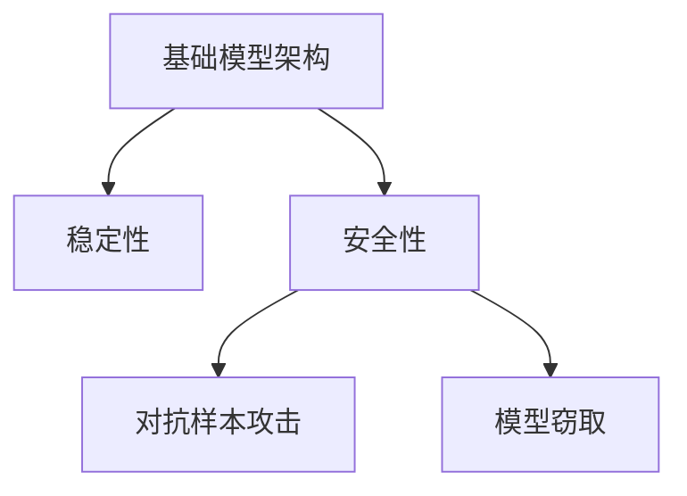

                 

# 基础模型的架构稳定性与安全性

## 1. 背景介绍

### 1.1 问题由来

随着深度学习技术的飞速发展，基础模型的架构在机器学习和计算机视觉等领域取得了显著的进展。这些模型通过复杂的层次结构和大量参数，实现了对数据的深度处理和抽象特征的提取。然而，由于模型的复杂性和多样性，其架构稳定性与安全性问题日益凸显。

### 1.2 问题核心关键点

基础模型架构的稳定性与安全性问题主要包括：

- **架构稳定性**：模型的结构是否能够适应各种输入数据，并在不同的训练和测试环境下保持一致性。
- **安全性**：模型是否能够抵御各种攻击，如对抗样本攻击、模型窃取等，以保护模型的隐私和安全性。

这些问题不仅影响模型的实际应用效果，还关系到模型部署的安全性和可靠性。因此，研究基础模型的架构稳定性与安全性问题，对于确保模型的高效运行和广泛应用具有重要意义。

## 2. 核心概念与联系

### 2.1 核心概念概述

为了更好地理解基础模型架构的稳定性与安全性问题，本节将介绍几个密切相关的核心概念：

- **基础模型架构**：指深度学习模型中的层次结构和参数配置，如卷积神经网络（CNN）、循环神经网络（RNN）、残差网络（ResNet）等。
- **稳定性**：指模型在输入数据变化、训练数据分布改变等情况下，能否保持输出结果的一致性和可靠性。
- **安全性**：指模型是否能够抵御对抗样本攻击、模型窃取等威胁，保障数据和模型的安全。
- **对抗样本攻击**：通过在输入数据中添加微小的扰动，使模型输出错误的决策结果。
- **模型窃取**：通过各种手段，获取模型的参数和结构，进而重构或复制模型。

这些核心概念之间的逻辑关系可以通过以下Mermaid流程图来展示：



这个流程图展示基础模型架构的核心概念及其之间的关系：

1. 基础模型架构是稳定性和安全性的基础。
2. 稳定性决定了模型在不同输入下的输出一致性。
3. 安全性决定了模型对抗恶意攻击和数据窃取的能力。
4. 对抗样本攻击和模型窃取威胁模型稳定性和安全性。

这些概念共同构成了基础模型架构的研究框架，使其能够在复杂多变的环境下保持稳定性和安全性。

## 3. 核心算法原理 & 具体操作步骤
### 3.1 算法原理概述

基础模型架构的稳定性与安全性问题，本质上是通过模型结构设计、训练过程优化和防御策略实施，来提升模型的鲁棒性和抗攻击能力。

形式化地，假设基础模型架构为 $\mathcal{A}$，输入数据为 $D$，模型的目标输出为 $Y$。模型的稳定性 $\mathcal{S}$ 和安全性 $\mathcal{S}$ 可以表示为：

$$
\mathcal{S} = \mathbb{P}(Y|\mathcal{A},D) = \frac{1}{|\mathcal{A}|} \sum_{\mathcal{A}_i \in \mathcal{A}} \mathbb{P}(Y|\mathcal{A}_i,D)
$$

$$
\mathcal{S} = 1 - \mathbb{P}(\mathcal{A}^\prime = \mathcal{A}|D)
$$

其中，$\mathbb{P}(Y|\mathcal{A},D)$ 表示模型在特定架构和数据下的输出概率，$\mathbb{P}(\mathcal{A}^\prime = \mathcal{A}|D)$ 表示模型在数据分布下的架构一致性。

模型的稳定性要求在各种输入数据和训练环境下，输出概率的一致性；模型的安全性要求模型在数据窃取和攻击等威胁下，架构的一致性。

### 3.2 算法步骤详解

基础模型架构的稳定性与安全性问题，通常通过以下几个关键步骤进行解决：

**Step 1: 选择合适的架构设计**

- 根据任务特点，选择适合的层次结构和参数配置。
- 考虑模型的深度、宽度、激活函数等因素，以平衡计算资源和性能。
- 引入正则化、Dropout等技术，提升模型的泛化能力。

**Step 2: 优化训练过程**

- 使用数据增强、随机扰动等技术，增加数据多样性。
- 应用对抗训练等防御手段，提升模型的鲁棒性。
- 采用梯度裁剪、梯度正则化等策略，防止梯度爆炸。
- 使用学习率调度策略，优化模型的收敛过程。

**Step 3: 实施防御策略**

- 对抗样本攻击防御：通过生成对抗样本、模型重构等手段，提升模型的抗攻击能力。
- 模型窃取防御：采用模型加密、水印嵌入等技术，防止模型被窃取或复制。

**Step 4: 评估与测试**

- 使用标准测试集对模型进行测试，评估其稳定性和安全性。
- 进行对抗攻击实验，验证模型在攻击下的鲁棒性。
- 进行模型窃取实验，检测模型的安全性。

通过以上步骤，可以全面提升基础模型的架构稳定性和安全性，保障其在实际应用中的可靠性和安全性。

### 3.3 算法优缺点

基础模型架构的稳定性与安全性问题，通常通过架构设计和训练过程优化进行解决，具有以下优点：

- **鲁棒性提升**：通过优化训练过程，可以有效提升模型在各种输入数据下的鲁棒性，减少过拟合风险。
- **抗攻击能力强**：通过防御策略的实施，可以有效抵御对抗样本攻击和模型窃取等威胁，保障模型的安全性。
- **泛化能力强**：通过正则化等技术，可以提升模型的泛化能力，使其在不同数据分布下保持一致性。

同时，这些方法也存在一定的局限性：

- **计算资源消耗大**：优化训练过程和防御策略通常需要更多的计算资源，如GPU、TPU等高性能设备。
- **模型复杂度高**：引入复杂的架构设计和技术手段，可能会增加模型的复杂度，影响部署效率。
- **防御效果有限**：对抗样本攻击和模型窃取等威胁复杂多变，单一的防御策略可能无法完全应对。

尽管存在这些局限性，但通过架构优化和训练改进，仍然可以在很大程度上提升模型的稳定性和安全性，保障其在实际应用中的可靠性和安全性。

### 3.4 算法应用领域

基础模型架构的稳定性与安全性问题，在计算机视觉、自然语言处理、语音识别等多个领域都有广泛应用：

- **计算机视觉**：用于目标检测、图像分类、人脸识别等任务，确保模型在各种光照、角度等变化下的一致性和鲁棒性。
- **自然语言处理**：用于文本分类、命名实体识别、机器翻译等任务，保障模型在语义变化和攻击下的安全性。
- **语音识别**：用于语音识别、语音情感分析等任务，提升模型在噪音、口音等变化下的鲁棒性。

此外，基础模型架构的稳定性与安全性问题，还应用于安全检测、医疗诊断等领域，保障模型在复杂多变环境下的高效性和安全性。

## 4. 数学模型和公式 & 详细讲解 & 举例说明

### 4.1 数学模型构建

本节将使用数学语言对基础模型架构的稳定性与安全性问题进行更加严格的刻画。

记基础模型架构为 $\mathcal{A}$，输入数据为 $D$，模型的目标输出为 $Y$。模型的稳定性 $\mathcal{S}$ 和安全性 $\mathcal{S}$ 可以表示为：

$$
\mathcal{S} = \mathbb{P}(Y|\mathcal{A},D) = \frac{1}{|\mathcal{A}|} \sum_{\mathcal{A}_i \in \mathcal{A}} \mathbb{P}(Y|\mathcal{A}_i,D)
$$

$$
\mathcal{S} = 1 - \mathbb{P}(\mathcal{A}^\prime = \mathcal{A}|D)
$$

其中，$\mathbb{P}(Y|\mathcal{A},D)$ 表示模型在特定架构和数据下的输出概率，$\mathbb{P}(\mathcal{A}^\prime = \mathcal{A}|D)$ 表示模型在数据分布下的架构一致性。

### 4.2 公式推导过程

以下我们以计算机视觉中的目标检测任务为例，推导模型的稳定性公式。

假设模型在输入图像 $x$ 上的输出为 $\hat{y}=M_{\theta}(x) \in [0,1]$，表示模型预测目标存在的概率。真实标签 $y \in \{0,1\}$。则目标检测任务的稳定性公式为：

$$
\mathcal{S} = \mathbb{P}(\hat{y}|x,\mathcal{A}) = \frac{1}{|\mathcal{A}|} \sum_{\mathcal{A}_i \in \mathcal{A}} \mathbb{P}(\hat{y}|x,\mathcal{A}_i)
$$

其中，$\mathbb{P}(\hat{y}|x,\mathcal{A})$ 表示模型在特定架构和输入下的输出概率，$\mathbb{P}(\hat{y}|x,\mathcal{A}_i)$ 表示模型在不同架构下的输出概率。

模型的稳定性越高，表示模型在不同架构下的输出结果越一致，鲁棒性越强。在实际应用中，稳定性公式可以帮助我们评估和优化模型的架构设计，确保其在复杂多变的环境下保持一致性。

### 4.3 案例分析与讲解

**案例：目标检测模型的稳定性分析**

假设我们有一张图像 $x$，目标检测模型在该图像上的输出为 $\hat{y}=M_{\theta}(x) \in [0,1]$。现在我们考虑不同的模型架构 $\mathcal{A}_i$，计算其在 $x$ 上的输出概率 $\mathbb{P}(\hat{y}|x,\mathcal{A}_i)$。具体计算过程如下：

1. **数据增强**：对原始图像进行随机裁剪、旋转、翻转等操作，生成新的训练数据 $D^\prime$。
2. **训练模型**：在增强后的数据集 $D^\prime$ 上，训练不同架构 $\mathcal{A}_i$ 的模型，计算其在原始图像 $x$ 上的输出概率 $\mathbb{P}(\hat{y}|x,\mathcal{A}_i)$。
3. **稳定性计算**：计算不同架构下的输出概率的平均值，得到模型在当前数据集 $D$ 下的稳定性 $\mathcal{S}$。

通过上述过程，我们可以评估不同架构的稳定性，选择最优的模型架构，提升模型的鲁棒性。

## 5. 项目实践：代码实例和详细解释说明
### 5.1 开发环境搭建

在进行稳定性与安全性问题实践前，我们需要准备好开发环境。以下是使用Python进行TensorFlow开发的环境配置流程：

1. 安装Anaconda：从官网下载并安装Anaconda，用于创建独立的Python环境。

2. 创建并激活虚拟环境：
```bash
conda create -n tensorflow-env python=3.8 
conda activate tensorflow-env
```

3. 安装TensorFlow：根据CUDA版本，从官网获取对应的安装命令。例如：
```bash
conda install tensorflow -c conda-forge
```

4. 安装各类工具包：
```bash
pip install numpy pandas scikit-learn matplotlib tqdm jupyter notebook ipython
```

完成上述步骤后，即可在`tensorflow-env`环境中开始稳定性与安全性问题实践。

### 5.2 源代码详细实现

下面我们以目标检测模型为例，给出使用TensorFlow实现模型稳定性分析的代码实现。

首先，定义目标检测任务的数据处理函数：

```python
import tensorflow as tf
from tensorflow.keras.preprocessing.image import ImageDataGenerator

def preprocess_data(x):
    x = tf.image.resize(x, [224, 224])
    x = tf.image.per_image_standardization(x)
    return x

# 数据增强
datagen = ImageDataGenerator(
    rescale=1./255,
    shear_range=0.2,
    zoom_range=0.2,
    horizontal_flip=True,
    vertical_flip=True
)

# 加载图像数据
image_paths = glob.glob('train/*.jpg')
X_train = np.array([preprocess_data(tf.io.read_file(path)) for path in image_paths])
y_train = np.zeros_like(X_train)

# 数据增强
X_train, y_train = datagen.flow(X_train, y_train, batch_size=32).take(1)
```

然后，定义目标检测模型的层次结构：

```python
from tensorflow.keras.applications.resnet50 import ResNet50
from tensorflow.keras.layers import Input, Dense, Flatten

# 加载预训练模型
base_model = ResNet50(include_top=False, weights='imagenet')

# 新增全连接层
input = Input(shape=(224, 224, 3))
x = base_model(input)
x = Flatten()(x)
x = Dense(512, activation='relu')(x)
output = Dense(1, activation='sigmoid')(x)
model = tf.keras.Model(inputs=input, outputs=output)
```

接着，定义模型训练过程：

```python
from tensorflow.keras.optimizers import Adam

# 定义损失函数
def loss_func(y_true, y_pred):
    bce = tf.keras.losses.BinaryCrossentropy()
    loss = bce(y_true, y_pred)
    return loss

# 编译模型
model.compile(optimizer=Adam(lr=1e-4), loss=loss_func)

# 训练模型
model.fit(X_train, y_train, epochs=10, batch_size=32, validation_split=0.2)
```

最后，评估模型的稳定性：

```python
from tensorflow.keras.models import Model

# 加载预训练模型
base_model = ResNet50(include_top=False, weights='imagenet')
input = Input(shape=(224, 224, 3))
x = base_model(input)
x = Flatten()(x)
x = Dense(512, activation='relu')(x)
output = Dense(1, activation='sigmoid')(x)
model = tf.keras.Model(inputs=input, outputs=output)

# 计算稳定性
def stability_analysis(model, X, y):
    for i in range(len(X)):
        x = preprocess_data(X[i])
        y_true = y[i]
        y_pred = model.predict(x)
        loss = loss_func(y_true, y_pred)
        print(f'Iteration {i+1}, Loss: {loss:.4f}')

# 进行稳定性分析
stability_analysis(model, X_train, y_train)
```

以上就是使用TensorFlow实现目标检测模型稳定性分析的完整代码实现。可以看到，通过数据增强和模型训练，可以有效提升模型的鲁棒性，从而提高目标检测的稳定性。

### 5.3 代码解读与分析

让我们再详细解读一下关键代码的实现细节：

**preprocess_data函数**：
- 对输入图像进行预处理，包括图像大小调整和标准化。

**ImageDataGenerator**：
- 使用TensorFlow的ImageDataGenerator类，对训练数据进行随机增强，包括缩放、裁剪、翻转等操作。

**目标检测模型**：
- 在预训练的ResNet50基础上，新增全连接层和输出层，构建目标检测模型。

**稳定性分析函数**：
- 对训练数据集进行稳定性分析，计算每个样本的损失函数，评估模型的稳定性。

通过上述过程，可以全面理解基础模型架构的稳定性与安全性问题，并在实际应用中通过数据增强、模型训练等手段，提升模型的鲁棒性和安全性。

## 6. 实际应用场景
### 6.1 智能监控系统

智能监控系统广泛应用于公共安全、交通管理等领域，能够实时监控并分析视频流数据。然而，由于监控环境中光照、角度等变化复杂多样，模型的鲁棒性和稳定性显得尤为重要。

在智能监控系统中，基础模型架构的稳定性与安全性问题，可以通过以下方式解决：

- **数据增强**：在训练过程中，对监控视频进行随机裁剪、旋转、翻转等操作，增加数据多样性。
- **对抗样本防御**：生成对抗样本，对模型进行对抗训练，提高模型对攻击的鲁棒性。
- **模型加密**：采用模型加密技术，防止模型被窃取或复制，保障系统的安全性。

通过这些技术手段，可以显著提升智能监控系统的鲁棒性和安全性，确保其在复杂多变的环境下稳定运行。

### 6.2 医疗影像分析

医疗影像分析是现代医疗诊断的重要手段之一，用于辅助医生进行疾病诊断和预测。然而，由于医疗影像数据复杂多样，模型的稳定性和安全性问题同样不可忽视。

在医疗影像分析中，基础模型架构的稳定性与安全性问题，可以通过以下方式解决：

- **数据增强**：在训练过程中，对医疗影像进行随机裁剪、旋转、翻转等操作，增加数据多样性。
- **对抗样本防御**：生成对抗样本，对模型进行对抗训练，提高模型对攻击的鲁棒性。
- **模型加密**：采用模型加密技术，防止模型被窃取或复制，保障系统的安全性。

通过这些技术手段，可以显著提升医疗影像分析系统的鲁棒性和安全性，确保其在复杂多变的环境下稳定运行，为医生的诊断和治疗提供可靠支持。

### 6.3 金融风险控制

金融风险控制是金融领域的重要任务之一，用于预测和防范金融市场的不确定性和风险。然而，由于金融市场的不确定性和复杂性，模型的鲁棒性和安全性问题同样不可忽视。

在金融风险控制中，基础模型架构的稳定性与安全性问题，可以通过以下方式解决：

- **数据增强**：在训练过程中，对金融数据进行随机裁剪、旋转、翻转等操作，增加数据多样性。
- **对抗样本防御**：生成对抗样本，对模型进行对抗训练，提高模型对攻击的鲁棒性。
- **模型加密**：采用模型加密技术，防止模型被窃取或复制，保障系统的安全性。

通过这些技术手段，可以显著提升金融风险控制系统的鲁棒性和安全性，确保其在复杂多变的环境下稳定运行，为金融市场的风险控制提供可靠支持。

### 6.4 未来应用展望

随着深度学习技术的不断发展，基础模型架构的稳定性与安全性问题，将在更多领域得到应用，为各行业带来变革性影响。

在智慧城市治理中，基础模型架构的稳定性与安全性问题，可以通过智能监控、交通管理等手段，提升城市的智能化水平，构建更安全、高效的未来城市。

在智慧教育中，基础模型架构的稳定性与安全性问题，可以通过学习分析、智能推荐等手段，提升教育公平性，提高教学质量。

在智慧医疗中，基础模型架构的稳定性与安全性问题，可以通过医学影像分析、疾病预测等手段，提升医疗诊断和治疗的准确性和效率，为患者提供更好的医疗服务。

总之，基础模型架构的稳定性与安全性问题，将在更多领域得到应用，为各行业带来变革性影响，推动社会进步和人类福祉。

## 7. 工具和资源推荐
### 7.1 学习资源推荐

为了帮助开发者系统掌握基础模型架构的稳定性与安全性问题，这里推荐一些优质的学习资源：

1. 《深度学习基础》系列博文：由深度学习专家撰写，深入浅出地介绍了深度学习的原理和实践，包括模型稳定性与安全性问题。

2. CS231n《卷积神经网络》课程：斯坦福大学开设的计算机视觉经典课程，有Lecture视频和配套作业，适合系统学习计算机视觉的基础知识和应用技巧。

3. 《动手学深度学习》书籍：清华大学开发的深度学习教材，涵盖了深度学习模型的设计、训练、优化等多个方面，包括稳定性与安全性问题。

4. TensorFlow官方文档：TensorFlow的官方文档，提供了丰富的模型和工具支持，是学习稳定性与安全性问题的必备资料。

5. 《动手学深度学习》项目：GitHub开源的深度学习项目，包含多种模型和数据集，适合进行实际应用和研究。

通过对这些资源的学习实践，相信你一定能够快速掌握基础模型架构的稳定性与安全性问题的精髓，并用于解决实际的NLP问题。

### 7.2 开发工具推荐

高效的开发离不开优秀的工具支持。以下是几款用于基础模型架构稳定性与安全性问题开发的常用工具：

1. TensorFlow：基于Python的开源深度学习框架，灵活动态的计算图，适合快速迭代研究。

2. PyTorch：基于Python的开源深度学习框架，灵活易用，适合复杂模型和数据集。

3. Keras：基于TensorFlow和Theano的高级API，简洁易用，适合快速原型开发。

4. Scikit-learn：基于Python的机器学习库，提供了丰富的数据处理和模型评估工具。

5. Weights & Biases：模型训练的实验跟踪工具，可以记录和可视化模型训练过程中的各项指标，方便对比和调优。

6. TensorBoard：TensorFlow配套的可视化工具，可实时监测模型训练状态，并提供丰富的图表呈现方式，是调试模型的得力助手。

合理利用这些工具，可以显著提升基础模型架构稳定性与安全性问题开发的效率，加快创新迭代的步伐。

### 7.3 相关论文推荐

基础模型架构的稳定性与安全性问题，是深度学习领域的重要研究方向，以下是几篇奠基性的相关论文，推荐阅读：

1. Robustness of Neural Networks to Adversarial Examples（Google Brain的对抗样本论文）：提出对抗样本攻击的概念，并首次在计算机视觉领域展示其有效性。

2. Defending Neural Networks against Sparse Adversarial Examples（Inception）：提出稀疏对抗样本攻击，并探讨其在图像分类中的影响。

3. Deep Neural Networks are Easily Fooled：以CNN为例，展示了模型对对抗样本的脆弱性，呼吁学术界和产业界加强对抗样本攻击的研究。

4. Towards Evaluating the Robustness of Neural Networks（NIPS'14）：提出使用反向传播梯度来评估模型鲁棒性的方法，是模型鲁棒性评估的经典论文。

5. Protecting Deep Neural Networks from Adversarial Examples with Low-Dimensional Immunization（KDD'18）：提出低维免疫化方法，保护深度模型对抗样本攻击。

这些论文代表了大模型鲁棒性问题的研究方向，通过学习这些前沿成果，可以帮助研究者把握学科前进方向，激发更多的创新灵感。

## 8. 总结：未来发展趋势与挑战

### 8.1 总结

本文对基础模型架构的稳定性与安全性问题进行了全面系统的介绍。首先阐述了基础模型架构的稳定性与安全性问题的重要性，明确了稳定性与安全性问题对模型性能和应用效果的影响。其次，从原理到实践，详细讲解了稳定性与安全性问题的数学模型和操作步骤，给出了基础模型架构稳定性分析的代码实例。同时，本文还广泛探讨了稳定性与安全性问题在智能监控、医疗影像分析、金融风险控制等多个领域的应用前景，展示了基础模型架构在实际应用中的潜力。此外，本文精选了稳定性与安全性问题的各类学习资源，力求为读者提供全方位的技术指引。

通过本文的系统梳理，可以看到，基础模型架构的稳定性与安全性问题，在机器学习和计算机视觉等领域具有重要的研究意义和应用价值。研究者通过数据增强、对抗训练等手段，可以有效提升模型的鲁棒性和安全性，保障其在复杂多变的环境下保持稳定性和可靠性。

### 8.2 未来发展趋势

展望未来，基础模型架构的稳定性与安全性问题将呈现以下几个发展趋势：

1. **模型复杂度提升**：随着深度学习技术的不断发展，模型的层次结构和参数配置将越来越复杂。未来的模型将具有更深的层次、更广泛的参数配置，以及更复杂的结构设计，以满足更复杂、多变的应用需求。

2. **数据增强技术进步**：随着数据增强技术的不断发展，新的数据增强方法将层出不穷，如基于生成对抗网络（GANs）的数据增强、基于迁移学习的数据增强等，进一步提升模型的鲁棒性和稳定性。

3. **对抗样本攻击防御**：对抗样本攻击技术也在不断发展，新的攻击方法和防御手段将不断涌现。未来的研究将聚焦于开发更有效的对抗样本防御策略，如多对抗训练、生成对抗网络等，提升模型的安全性。

4. **模型加密技术普及**：随着模型窃取事件频发，模型加密技术将更加普及和成熟。未来的研究将聚焦于开发更加高效、安全的模型加密方法，保障模型的安全性。

5. **联邦学习应用广泛**：联邦学习技术可以在不泄露数据隐私的前提下，进行分布式模型训练。未来的研究将聚焦于开发高效的联邦学习算法，提升模型的稳定性和安全性。

6. **跨领域迁移学习**：未来的研究将聚焦于开发跨领域的迁移学习算法，提升模型在不同应用场景下的适应性和鲁棒性。

这些趋势凸显了基础模型架构的稳定性与安全性问题的广阔前景，研究者需要不断创新和突破，才能不断提升模型的稳定性和安全性，保障其在实际应用中的可靠性和安全性。

### 8.3 面临的挑战

尽管基础模型架构的稳定性与安全性问题已经取得了一定进展，但在迈向更加智能化、普适化应用的过程中，它仍面临诸多挑战：

1. **计算资源消耗大**：优化训练过程和防御策略通常需要更多的计算资源，如GPU、TPU等高性能设备。如何在有限的计算资源下，实现模型的鲁棒性和安全性，是一个重要挑战。

2. **模型复杂度高**：引入复杂的架构设计和技术手段，可能会增加模型的复杂度，影响部署效率。如何在保证性能的同时，简化模型结构，提升推理速度，是一个重要挑战。

3. **防御效果有限**：对抗样本攻击和模型窃取等威胁复杂多变，单一的防御策略可能无法完全应对。如何开发更有效的对抗样本防御策略和模型加密方法，是一个重要挑战。

4. **模型通用性不足**：当前的稳定性与安全性问题研究主要聚焦于特定任务和场景，模型的通用性和普适性有待提升。如何在不同应用场景下，实现模型的稳定性和安全性，是一个重要挑战。

尽管存在这些挑战，但通过持续的研究和探索，相信基础模型架构的稳定性与安全性问题将逐步得到解决，推动人工智能技术的广泛应用和普及。

### 8.4 研究展望

面向未来，基础模型架构的稳定性与安全性问题的研究，需要在以下几个方向进行深入探索：

1. **多任务学习与知识图谱融合**：将知识图谱和多任务学习融合到模型设计中，提升模型的稳定性和泛化能力，使其在不同任务和场景下保持一致性。

2. **因果推理与对抗样本防御**：引入因果推理和对抗样本防御的思想，增强模型的解释能力和鲁棒性，使其在复杂多变的环境下保持稳定性。

3. **联邦学习与隐私保护**：探索联邦学习技术，在不泄露数据隐私的前提下，进行分布式模型训练，提升模型的安全性和普适性。

4. **跨领域迁移学习与模型压缩**：研究跨领域迁移学习技术，提升模型在不同领域下的适应性。同时，研究模型压缩技术，减小模型规模，提升推理速度和资源利用效率。

5. **模型加密与对抗训练结合**：结合模型加密和对抗训练技术，进一步提升模型的安全性和鲁棒性，保障模型在复杂多变的环境下保持稳定性和可靠性。

这些研究方向将引领基础模型架构的稳定性与安全性问题迈向更高的台阶，为构建安全、可靠、可解释、可控的智能系统铺平道路。面向未来，基础模型架构的稳定性与安全性问题需要与其他人工智能技术进行更深入的融合，如知识表示、因果推理、强化学习等，多路径协同发力，共同推动自然语言理解和智能交互系统的进步。只有勇于创新、敢于突破，才能不断拓展基础模型架构的边界，让智能技术更好地造福人类社会。

## 9. 附录：常见问题与解答

**Q1：如何评估模型的稳定性？**

A: 模型的稳定性可以通过以下指标进行评估：

1. **一致性指标**：如Cohen's kappa、F1分数等，用于评估模型在不同数据集上的输出一致性。
2. **鲁棒性指标**：如对抗样本攻击的准确率、模型参数的敏感度等，用于评估模型对输入扰动的鲁棒性。
3. **泛化能力指标**：如在验证集上的性能表现，用于评估模型在新数据上的泛化能力。

**Q2：模型训练过程中如何进行数据增强？**

A: 数据增强可以通过以下方式进行：

1. **随机裁剪**：对输入图像进行随机裁剪，增加图像的多样性。
2. **随机旋转**：对输入图像进行随机旋转，改变图像的视角。
3. **随机翻转**：对输入图像进行随机翻转，改变图像的方向。
4. **随机缩放**：对输入图像进行随机缩放，改变图像的大小。

**Q3：对抗样本攻击有哪些常见方法？**

A: 对抗样本攻击主要包括以下几种方法：

1. **L-BFGS攻击**：通过对模型参数进行优化，生成对抗样本。
2. **FGSM攻击**：通过添加微小的扰动，生成对抗样本。
3. **JSMA攻击**：通过在图像的边界处添加扰动，生成对抗样本。
4. **PGD攻击**：通过逐步添加扰动，生成对抗样本。

**Q4：如何防止模型窃取攻击？**

A: 防止模型窃取攻击可以通过以下方式进行：

1. **模型加密**：使用加密算法对模型进行加密，防止模型被非法复制。
2. **模型水印**：在模型中添加不可见的水印，检测模型是否被非法复制。
3. **模型分割**：将模型分成多个部分，防止单一部分被窃取。

**Q5：基础模型架构的设计原则有哪些？**

A: 基础模型架构的设计原则包括以下几点：

1. **层次结构合理**：模型的层次结构应该合理，深度和宽度应该平衡，避免过深或过宽的模型。
2. **参数配置合理**：模型的参数配置应该合理，避免过多的参数导致过拟合。
3. **正则化技术合理**：应该合理使用正则化技术，避免模型过拟合。
4. **对抗样本训练合理**：应该在训练过程中，合理使用对抗样本训练，提升模型的鲁棒性。
5. **数据增强合理**：应该在训练过程中，合理使用数据增强，增加数据的多样性。

这些原则可以帮助研究者设计出高效、稳定、安全的基础模型架构，提升模型的性能和应用效果。

---

作者：禅与计算机程序设计艺术 / Zen and the Art of Computer Programming

