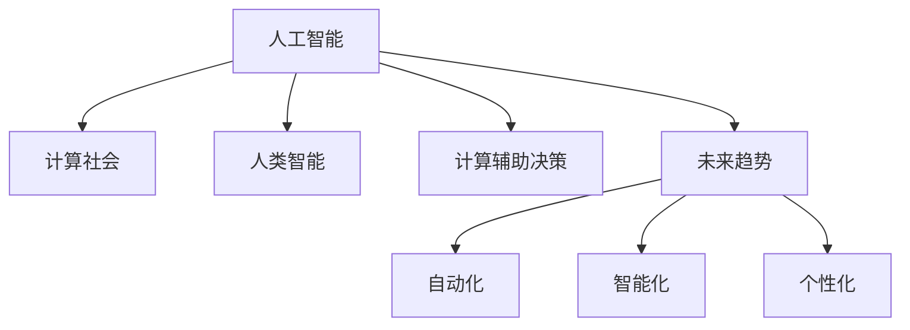

                 

# 塑造未来社会：人类计算的深远意义

> 关键词：人工智能,计算社会,人类智能,计算辅助决策,未来趋势

## 1. 背景介绍

### 1.1 问题由来
人类社会正处于数字化的新时代。从古代文明到工业革命，再到信息时代的快速发展，人类不断通过技术的进步来提高生产力和生活质量。但以往的技术革命往往集中于生产工具的提升，而今天，人工智能（AI）的崛起将人类计算的边界推向了新的高度。

人工智能不仅是技术领域的一次革命，更是对社会结构、工作方式、教育体系乃至人类价值观的全方位影响。从智能助手、自动驾驶、医疗诊断到金融投资，AI渗透到了社会的各个角落。人类的计算能力因此得以大幅提升，而这背后是计算技术的快速演进。

本系列文章将深入探讨人类计算的深远意义，通过全面系统的分析，揭示AI在塑造未来社会中的关键作用。

### 1.2 问题核心关键点
人类计算的进步源于人类对数据的理解和处理能力的提升。随着计算技术的发展，人工智能不仅能够处理和分析大量数据，还能够在复杂环境中进行决策和预测。这对社会的各个方面都产生了深远的影响：

- **经济层面**：自动化和智能化的生产方式，不仅提高了生产效率，还带来了新的商业模式和就业形态。
- **社会层面**：大数据和AI技术的应用，使得公共决策更科学、更透明，社会治理更加高效。
- **教育层面**：AI辅助教学，个性化学习，让每个孩子都能获得适合自己的教育资源。
- **健康层面**：AI在医疗影像分析、基因组学等领域的应用，提高了疾病诊断的准确性，延长了人类寿命。

AI技术在提升人类计算能力的同时，也带来了新的挑战和风险。如何在保证技术进步的同时，确保其对人类社会的影响是积极、正面的，是我们必须面对的问题。

## 2. 核心概念与联系

### 2.1 核心概念概述

本节将介绍几个与人类计算进步相关的核心概念：

- **人工智能（AI）**：一种通过机器学习和算法模拟人类智能的技术。AI涵盖了从简单规则系统到复杂神经网络的广泛技术。
- **计算社会（Computational Society）**：一个以计算和数据驱动的社会形态，其中人类计算能力极大提升，数据和算法成为社会的核心资源。
- **人类智能（Human Intelligence）**：指人类大脑的自然智能，包括逻辑推理、情感判断、创造力等。
- **计算辅助决策（Computation-Assisted Decision-Making）**：使用算法和模型辅助人类进行决策，提高决策的科学性和准确性。
- **未来趋势**：AI技术的发展将推动社会的各个方面不断进步，包括自动化、智能化、个性化等方向。

这些概念之间的逻辑关系可以通过以下Mermaid流程图来展示：



这个流程图展示了几组核心概念之间的关系：

1. 人工智能通过计算和数据驱动的社会形态。
2. 人工智能辅助增强人类智能。
3. 人工智能的计算能力用于辅助决策，推动社会发展。
4. AI技术的发展趋势，包括自动化、智能化、个性化等方向。

## 3. 核心算法原理 & 具体操作步骤

### 3.1 算法原理概述

人类计算的进步主要体现在对数据的处理和分析能力上。AI算法通过学习大量的数据，识别出数据的规律和模式，从而进行预测和决策。其核心原理包括：

- **数据获取与清洗**：从原始数据中提取有用信息，去除噪声和错误。
- **特征工程**：对数据进行编码和转换，以便算法能够理解和使用。
- **模型训练**：使用监督或非监督学习算法，训练出能够预测或分类数据的模型。
- **模型评估与优化**：使用验证集或测试集评估模型性能，并进行调整优化。
- **应用部署**：将训练好的模型应用于实际场景，进行预测或决策。

这些步骤构成了AI算法的基本流程，广泛应用于各个领域。

### 3.2 算法步骤详解

以下以机器学习算法为例，详细讲解AI算法的步骤：

1. **数据获取与清洗**：
   - 收集原始数据，如文本、图像、音频等。
   - 清洗数据，去除重复、缺失、噪声等。
   - 数据标注，为训练提供标签信息。

2. **特征工程**：
   - 特征选择，选择对模型有用的特征。
   - 特征转换，如PCA、LDA等降维技术，以及特征提取、编码等。
   - 特征缩放，如标准化、归一化等，保证特征在同一尺度。

3. **模型训练**：
   - 选择合适的算法，如回归、分类、聚类等。
   - 设置超参数，如学习率、迭代次数、正则化等。
   - 训练模型，通过反向传播算法更新参数。

4. **模型评估与优化**：
   - 使用交叉验证、留出法、自助法等技术进行模型评估。
   - 使用指标如准确率、召回率、F1分数等评估模型性能。
   - 调整超参数，进行模型优化，防止过拟合和欠拟合。

5. **应用部署**：
   - 将模型封装为API或微服务，提供接口供应用调用。
   - 在实时场景中，模型进行预测或决策。
   - 监控模型性能，进行周期性更新和维护。

### 3.3 算法优缺点

人类计算的进步带来了许多好处，但也存在一些问题：

**优点**：
- **效率提升**：AI算法能够处理大量数据，提高决策速度。
- **精度提高**：AI模型基于大量数据训练，能够提供高质量的预测结果。
- **应用广泛**：AI技术广泛应用于各个领域，带来新的商业机会。
- **个性化**：AI能够根据用户行为进行个性化推荐，提升用户体验。

**缺点**：
- **数据依赖**：模型依赖于高质量、大量的数据，数据获取成本高。
- **解释性差**：复杂模型难以解释其内部逻辑，缺乏透明度。
- **安全性问题**：模型可能受到攻击，导致错误预测。
- **伦理问题**：AI决策可能存在偏见，影响公平性。

## 4. 数学模型和公式 & 详细讲解 & 举例说明

### 4.1 数学模型构建

本节将详细讲解AI算法中常见的数学模型和公式。

以线性回归为例，设输入向量为 $\mathbf{x}=[x_1,x_2,...,x_n]^T$，输出向量为 $\mathbf{y}$，线性回归模型的目标是最小化预测值与真实值之间的平方误差。数学模型可表示为：

$$
\mathbf{y}=\mathbf{W}\mathbf{x}+b
$$

其中，$\mathbf{W}$ 为权重矩阵，$b$ 为偏置项。

### 4.2 公式推导过程

在线性回归中，我们希望最小化目标函数 $L$，该函数为预测值与真实值之间的误差平方和：

$$
L=\frac{1}{2N}\sum_{i=1}^N(y_i-\mathbf{w}^T\mathbf{x}_i)^2
$$

使用梯度下降法求解最优参数，梯度向量为：

$$
\nabla_{\mathbf{w},b}L=-\frac{1}{N}\sum_{i=1}^N(y_i-\mathbf{w}^T\mathbf{x}_i)\mathbf{x}_i
$$

通过计算梯度，不断调整权重矩阵和偏置项，使得模型输出尽可能接近真实值。

### 4.3 案例分析与讲解

以房价预测为例，使用线性回归模型进行训练。假设我们有 $N$ 个房屋的样本数据，包括面积、卧室数量、卫生间数量等特征，以及对应的房价。

**步骤**：
1. 收集和清洗数据，去掉重复和噪声数据。
2. 对特征进行编码和标准化，将数据转换为模型可用的形式。
3. 使用梯度下降算法训练线性回归模型，不断调整权重和偏置，最小化预测值与真实值之间的误差。
4. 使用测试集评估模型性能，根据评估结果进行模型优化。
5. 将模型部署到实际场景中，进行房价预测。

## 5. 项目实践：代码实例和详细解释说明

### 5.1 开发环境搭建

在进行AI算法实践前，需要准备好开发环境。以下是使用Python进行TensorFlow开发的环境配置流程：

1. 安装Anaconda：从官网下载并安装Anaconda，用于创建独立的Python环境。
2. 创建并激活虚拟环境：
```bash
conda create -n tf-env python=3.7 
conda activate tf-env
```
3. 安装TensorFlow：
```bash
pip install tensorflow
```
4. 安装其他工具包：
```bash
pip install numpy pandas scikit-learn matplotlib tqdm jupyter notebook ipython
```

完成上述步骤后，即可在`tf-env`环境中开始AI算法实践。

### 5.2 源代码详细实现

以下是使用TensorFlow进行房价预测的代码实现：

```python
import tensorflow as tf
import numpy as np
import pandas as pd

# 准备数据
data = pd.read_csv('housing.csv')
X = data[['area', 'bedrooms', 'bathrooms']]
y = data['price']

# 数据预处理
X = np.array(X)
y = np.array(y)

# 划分训练集和测试集
N = len(X)
train_size = int(0.8 * N)
X_train = X[:train_size]
y_train = y[:train_size]
X_test = X[train_size:]
y_test = y[train_size:]

# 定义模型
X_placeholder = tf.placeholder(tf.float32, shape=[None, 3])
Y_placeholder = tf.placeholder(tf.float32, shape=[None, 1])
W_placeholder = tf.Variable(tf.random_normal([3, 1]))
b_placeholder = tf.Variable(tf.random_normal([1]))

Y_predict = tf.matmul(X_placeholder, W_placeholder) + b_placeholder

loss = tf.reduce_mean(tf.square(Y_predict - Y_placeholder))

# 优化器
optimizer = tf.train.GradientDescentOptimizer(learning_rate=0.01)
train_op = optimizer.minimize(loss)

# 训练模型
with tf.Session() as sess:
    sess.run(tf.global_variables_initializer())
    for i in range(10000):
        _, l = sess.run([train_op, loss], feed_dict={X_placeholder: X_train, Y_placeholder: y_train.reshape(-1, 1)})
        if i % 1000 == 0:
            print('Step %d, loss = %.3f' % (i, l))
    W_value, b_value = sess.run([W_placeholder, b_placeholder])
    print('W:', W_value, 'b:', b_value)

# 测试模型
test_predictions = sess.run(Y_predict, feed_dict={X_placeholder: X_test})
print('Test predictions:', test_predictions)
```

### 5.3 代码解读与分析

让我们再详细解读一下关键代码的实现细节：

**数据准备**：
- 使用pandas库加载数据集，进行数据清洗和特征选择。
- 将特征转换为numpy数组，进行数据预处理。

**模型定义**：
- 使用TensorFlow的占位符定义输入数据和标签。
- 定义线性回归模型，包括权重矩阵和偏置项。
- 计算损失函数，即预测值与真实值之间的平方误差。
- 使用梯度下降优化器进行模型训练。

**训练过程**：
- 在TensorFlow会话中运行模型，进行模型训练。
- 每1000步打印一次损失函数值，监控训练过程。
- 训练完成后，获取模型的权重和偏置项。

**测试过程**：
- 在测试集上测试模型性能，输出预测结果。

## 6. 实际应用场景

### 6.1 智能交通系统

AI技术在智能交通系统中得到了广泛应用。智能交通系统通过采集车辆位置、速度、交通流量等数据，实时分析交通情况，优化信号灯控制，减少交通拥堵，提高道路通行效率。

例如，使用AI算法对视频数据进行目标检测和跟踪，实时分析车辆行为，从而优化信号灯的开关时机和时长，提高交通流量的稳定性。此外，AI还可以用于预测交通流量、优化路网规划、进行事故预警等，全面提升交通系统的智能化水平。

### 6.2 金融风险控制

金融风险控制是AI技术在金融行业的重要应用之一。AI算法通过分析历史数据，识别出风险特征，预测未来的风险趋势，从而辅助金融机构进行风险评估和决策。

例如，使用AI算法对贷款申请人的信用记录、收入水平、负债情况等进行综合评估，预测其还款能力，从而决定是否批准贷款。此外，AI还可以用于股票市场预测、信用风险评估、欺诈检测等，保障金融系统的稳定运行。

### 6.3 医疗健康领域

AI技术在医疗健康领域的应用已经初见成效。AI算法通过分析医学影像、基因组数据、电子病历等数据，辅助医生进行诊断、预测和治疗。

例如，使用AI算法对医学影像进行自动检测和分析，识别出病灶的位置和大小，辅助医生进行诊断和治疗。此外，AI还可以用于药物研发、基因组学分析、疾病预测等，推动医疗行业的数字化转型。

### 6.4 未来应用展望

随着AI技术的不断进步，未来在各个领域的应用将更加广泛和深入。以下是一些未来应用的方向：

1. **自动化生产**：AI技术可以用于智能制造，优化生产流程，提高生产效率。例如，使用AI进行质量检测、设备维护、库存管理等，实现生产自动化。
2. **智慧城市**：AI技术可以用于智慧城市建设，提升城市管理水平。例如，使用AI进行城市交通管理、环境监测、公共安全等，构建更智能、更高效的城市。
3. **教育领域**：AI技术可以用于个性化教育，根据学生行为和偏好，提供个性化的学习内容和方法。例如，使用AI进行智能辅导、作业批改、课程推荐等，提升教育质量。
4. **社交媒体分析**：AI技术可以用于社交媒体分析，分析用户行为和情感，预测社会趋势。例如，使用AI进行舆情监测、品牌管理、用户行为分析等，提升社交媒体运营水平。

未来，AI技术将在更多领域发挥作用，推动社会的全面进步。

## 7. 工具和资源推荐

### 7.1 学习资源推荐

为了帮助开发者系统掌握AI技术的应用，这里推荐一些优质的学习资源：

1. 《深度学习》（Ian Goodfellow）：经典深度学习教材，涵盖了深度学习的基本概念和算法。
2. TensorFlow官方文档：TensorFlow官方文档提供了丰富的API和样例，是学习TensorFlow的最佳资源。
3. PyTorch官方文档：PyTorch官方文档提供了详细的API和样例，是学习PyTorch的最佳资源。
4. Coursera深度学习课程：由斯坦福大学Andrew Ng教授开设的深度学习课程，是学习深度学习的最佳选择。
5. Kaggle数据科学竞赛：Kaggle是一个数据科学竞赛平台，提供了丰富的数据集和挑战，是练习深度学习的最佳场所。

通过对这些资源的学习实践，相信你一定能够快速掌握AI技术的精髓，并用于解决实际的商业问题。

### 7.2 开发工具推荐

高效的开发离不开优秀的工具支持。以下是几款用于AI算法开发的常用工具：

1. TensorFlow：由Google主导开发的深度学习框架，生产部署方便，适合大规模工程应用。
2. PyTorch：由Facebook主导开发的深度学习框架，灵活高效，适合研究实验。
3. Jupyter Notebook：一个强大的交互式编程环境，支持Python、R等多种语言。
4. Anaconda：一个强大的数据科学环境，提供了大量的科学计算库和工具。
5. Visual Studio Code：一个流行的代码编辑器，支持多种语言和框架。

合理利用这些工具，可以显著提升AI算法的开发效率，加快创新迭代的步伐。

### 7.3 相关论文推荐

AI技术的发展源于学界的持续研究。以下是几篇奠基性的相关论文，推荐阅读：

1. AlexNet（ImageNet数据集竞赛）：提出AlexNet模型，展示了卷积神经网络在图像识别任务上的潜力。
2. AlphaGo（围棋冠军赛）：AlphaGo使用深度学习技术，实现了在围棋领域超越人类顶尖选手的目标。
3. GANs（生成对抗网络）：提出生成对抗网络，能够生成高质量的图像、音频、视频等数据。
4. Transformer（自然语言处理）：提出Transformer模型，大幅提升了自然语言处理任务的性能。
5. GPT-3（语言模型）：提出GPT-3模型，展示了大规模语言模型的强大能力。

这些论文代表了大规模计算技术的发展脉络。通过学习这些前沿成果，可以帮助研究者把握学科前进方向，激发更多的创新灵感。

## 8. 总结：未来发展趋势与挑战

### 8.1 研究成果总结

AI技术的进步带来了巨大的社会变革，其在多个领域的成功应用展示了其强大的潜力。通过深度学习、机器学习等技术，人类计算能力得以大幅提升，推动了社会的全面进步。

### 8.2 未来发展趋势

未来，AI技术将呈现以下几个发展趋势：

1. **自动化和智能化**：AI技术将更加自动化和智能化，实现全自动化生产、智能城市管理等。
2. **多模态融合**：AI技术将融合视觉、语音、文本等多种模态，实现全面的智能感知。
3. **人机协作**：AI技术将与人类进行更加紧密的协作，辅助人类进行决策和任务处理。
4. **跨领域应用**：AI技术将在更多领域得到应用，如金融、医疗、教育、交通等，推动社会的全面进步。

### 8.3 面临的挑战

尽管AI技术已经取得了显著的进展，但在迈向更加智能化、普适化应用的过程中，仍面临许多挑战：

1. **数据隐私和安全**：AI技术需要大量的数据，数据隐私和安全问题不容忽视。
2. **伦理和社会责任**：AI决策可能存在偏见，影响公平性，需加强伦理和社会责任研究。
3. **模型可解释性**：AI模型难以解释其内部逻辑，缺乏透明度，需加强可解释性研究。
4. **资源和计算成本**：大规模计算任务需要大量的计算资源，需探索更高效的计算方法。
5. **技术普及**：AI技术需要普及到各个领域，需加强技术培训和普及教育。

### 8.4 研究展望

为了应对这些挑战，未来的研究需要在以下几个方面寻求新的突破：

1. **数据隐私保护**：开发数据隐私保护技术，保护用户数据安全。
2. **公平性和透明性**：开发公平性评估方法和透明性增强技术，确保AI决策的公平和透明。
3. **高效计算方法**：开发更高效的计算方法和硬件，降低计算成本。
4. **技术普及和培训**：加强技术培训和普及教育，提升AI技术的普及率。
5. **伦理和社会责任**：加强伦理和社会责任研究，确保AI技术健康发展。

## 9. 附录：常见问题与解答

**Q1：AI技术在各个领域的应用效果如何？**

A: AI技术在各个领域的应用效果显著。例如，在金融领域，AI可以用于风险控制、信用评估、欺诈检测等，提高了金融系统的稳定性和安全性。在医疗领域，AI可以用于医学影像分析、基因组学分析等，提高了诊断的准确性和效率。在教育领域，AI可以用于个性化辅导、作业批改等，提升了教育质量。在交通领域，AI可以用于智能交通管理、自动驾驶等，提高了交通效率。

**Q2：AI技术在应用中需要注意哪些问题？**

A: AI技术在应用中需要注意以下问题：
1. 数据隐私和安全问题：保护用户数据隐私，确保数据安全。
2. 伦理和社会责任问题：确保AI决策的公平性和透明性。
3. 模型可解释性问题：提高模型的可解释性，增强用户信任。
4. 资源和计算成本问题：提高计算效率，降低计算成本。
5. 技术普及问题：加强技术培训和普及教育，提升技术应用水平。

**Q3：AI技术的未来发展方向是什么？**

A: AI技术的未来发展方向包括：
1. 自动化和智能化：实现全自动化生产和智能城市管理。
2. 多模态融合：融合视觉、语音、文本等多种模态，实现全面的智能感知。
3. 人机协作：与人类进行更加紧密的协作，辅助人类进行决策和任务处理。
4. 跨领域应用：在更多领域得到应用，如金融、医疗、教育、交通等，推动社会的全面进步。

**Q4：如何提升AI技术的可解释性？**

A: 提升AI技术的可解释性，可以从以下几个方面入手：
1. 使用可解释模型：如决策树、规则系统等，这些模型更容易解释其内部逻辑。
2. 开发可解释技术：如LIME、SHAP等，这些技术可以解释复杂模型的预测过程。
3. 引入领域知识：将领域专家的知识融入模型训练，提高模型的可解释性。
4. 可视化展示：通过可视化工具，展示模型的决策过程和预测结果，增强可解释性。

**Q5：AI技术在实际应用中如何保证数据隐私和安全？**

A: AI技术在实际应用中，可以采用以下措施保证数据隐私和安全：
1. 数据加密：对数据进行加密处理，确保数据传输和存储的安全性。
2. 匿名化处理：对数据进行匿名化处理，保护用户隐私。
3. 访问控制：对数据访问进行严格的控制，确保只有授权人员能够访问数据。
4. 数据分割：对数据进行分割处理，确保数据在不同场景下的安全性。
5. 数据审计：定期进行数据审计，发现和修复潜在的安全漏洞。

---

作者：禅与计算机程序设计艺术 / Zen and the Art of Computer Programming

