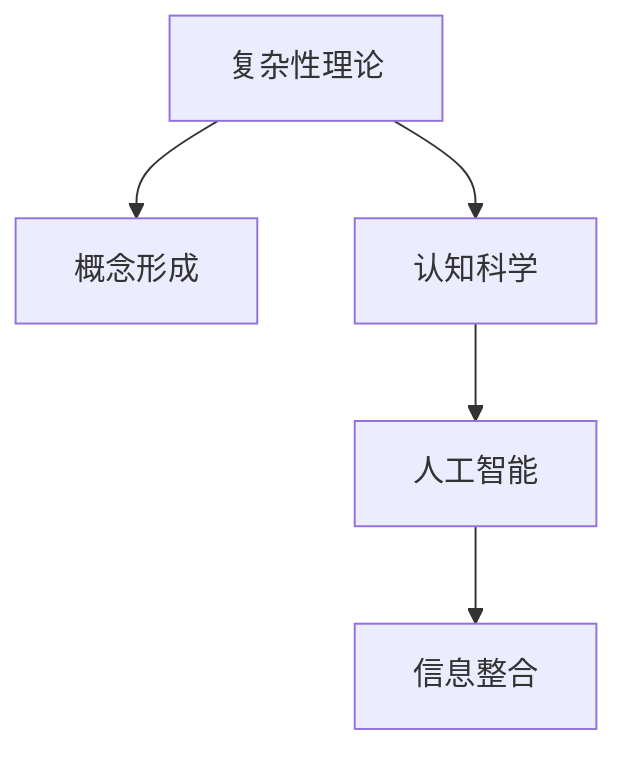

                 

# 复杂思想的形成：概念的基础

> 关键词：复杂性理论, 概念形成, 认知科学, 人工智能, 信息整合

## 1. 背景介绍

### 1.1 问题由来

在信息时代，我们被大量信息所包围，如何从海量数据中提取有价值的概念，形成复杂而精确的认知结构，成为了认知科学和人工智能领域的核心问题。现代心理学和认知科学的研究表明，复杂的思想不仅仅是信息的简单叠加，而是一个复杂的整合和重组过程，涉及多种认知策略和算法。

因此，理解概念的形成过程，以及复杂思想在人工智能系统中的构建机制，具有重要的理论价值和实际意义。本文旨在通过详细的技术分析，揭示复杂思想形成的核心原理和实现方法，提供一种在人工智能系统中有效形成复杂思想的理论基础。

## 2. 核心概念与联系

### 2.1 核心概念概述

为更好地理解复杂思想的形成，我们先介绍几个关键概念：

- **复杂性理论**（Complexity Theory）：研究复杂系统如何通过简单规则演化形成复杂行为，核心是理解系统中的相互依存和交互作用。
- **概念形成**（Concept Formation）：认知心理学和认知科学研究个体如何从经验中抽象出基本概念，形成复杂的知识结构。
- **认知科学**（Cognitive Science）：融合了心理学、神经科学、哲学、语言学等多个学科的交叉领域，研究人类智能的认知机制。
- **人工智能**（Artificial Intelligence, AI）：研究如何构建智能系统，模拟人类的认知过程和决策能力。
- **信息整合**（Information Integration）：在多源异构信息中，如何整合、融合、抽象出有价值的概念。

这些概念之间的逻辑关系可以通过以下Mermaid流程图来展示：



这个流程图展示了几大关键概念之间的内在联系：

1. **复杂性理论**提供了研究复杂系统演化的数学和计算模型，解释了从简单到复杂的行为。
2. **概念形成**描述了个体如何在经验中学习抽象概念，形成复杂的认知结构。
3. **认知科学**融合了心理学、神经科学和哲学，探讨人类认知机制。
4. **人工智能**构建智能系统，模仿人类认知和决策能力。
5. **信息整合**研究如何从多源异构数据中提取、融合、抽象概念。

这些概念共同构成了复杂思想形成的理论框架，为人工智能系统中形成复杂思想提供了基础。

## 3. 核心算法原理 & 具体操作步骤
### 3.1 算法原理概述

基于复杂性理论和认知科学的复杂思想形成算法，旨在模拟个体从经验中学习抽象概念，形成复杂的认知结构。其主要原理包括以下几个方面：

- **自组织系统**（Self-Organized System）：系统通过简单规则和反馈机制，从无序状态自动组织形成复杂的结构。
- **涌现现象**（Emergent Phenomena）：系统的局部相互作用导致全局复杂行为的出现，即“整体大于部分之和”。
- **网络结构**（Network Structure）：复杂思想的形成依赖于连接强度和结构，系统通过不断优化网络拓扑，提高系统的复杂性。
- **反馈机制**（Feedback Mechanism）：系统通过内部反馈机制，调整和优化自身的结构和行为。

这些原理构成了复杂思想形成的核心算法框架，主要步骤如下：

1. **构建自组织系统**：初始化系统参数和简单规则，模拟个体通过反馈机制调整自身行为。
2. **观察涌现现象**：系统运行过程中，观察系统行为的变化，捕捉涌现出来的复杂结构。
3. **优化网络结构**：根据涌现出来的复杂结构，优化系统的网络拓扑，提高系统的复杂性。
4. **反馈机制调整**：根据观察到的涌现现象，调整系统的反馈机制，优化系统行为。

### 3.2 算法步骤详解

下面详细阐述复杂思想形成的算法步骤：

**Step 1: 构建自组织系统**
- **初始化参数**：定义系统的初始状态和简单规则，如神经元网络参数、反馈规则等。
- **反馈机制设计**：设定系统的反馈机制，如突触权重调整规则、神经元激活函数等。

**Step 2: 观察涌现现象**
- **系统运行**：根据初始参数和规则，运行系统，观察系统行为的演化。
- **复杂性指标**：使用熵、信息熵、网络结构度量等指标，衡量系统的复杂性。
- **涌现识别**：识别系统行为中涌现出来的复杂结构，如特征提取、概念形成等。

**Step 3: 优化网络结构**
- **网络拓扑优化**：根据涌现出来的复杂结构，优化系统的连接强度和拓扑结构。
- **复杂性提升**：通过连接优化，提高系统的复杂性和涌现能力。

**Step 4: 反馈机制调整**
- **反馈信号捕捉**：捕捉涌现出来的复杂结构，将其作为反馈信号。
- **参数调整**：根据反馈信号，调整系统的参数和规则，优化系统行为。

### 3.3 算法优缺点

基于复杂性理论的复杂思想形成算法具有以下优点：

1. **高效性**：算法依赖简单的规则和反馈机制，无需大量复杂计算，运行效率高。
2. **鲁棒性**：自组织系统具有很强的适应性和鲁棒性，能够应对复杂的输入和干扰。
3. **可扩展性**：通过优化网络结构和反馈机制，算法可以适应不同规模和复杂度的任务。

但该算法也存在一定的局限性：

1. **参数依赖**：初始参数的选择对系统的复杂性有重要影响，需要大量经验和试验。
2. **涌现机制复杂**：涌现现象的识别和优化较为复杂，需要深入理解系统的行为。
3. **计算资源消耗**：系统复杂度提升，计算资源消耗增加，需合理控制。

## 4. 数学模型和公式 & 详细讲解  
### 4.1 数学模型构建

复杂思想形成算法主要依赖于神经网络模型的自组织行为。因此，本文以神经网络为例，构建数学模型来描述复杂思想的形成过程。

设神经网络有 $N$ 个神经元，初始状态为 $\mathbf{x}_0$，简单规则为 $f(\mathbf{x}_t) = f_w(\mathbf{x}_{t-1})$，其中 $f_w$ 为权重更新规则。系统的演化可以表示为：

$$
\mathbf{x}_{t+1} = f(\mathbf{x}_t)
$$

系统的复杂性可以通过熵、信息熵、网络结构度量等指标进行量化。例如，信息熵 $H$ 定义为：

$$
H = -\sum_{i=1}^N p_i \log p_i
$$

其中 $p_i$ 为第 $i$ 个神经元的状态概率。网络结构度量可以通过连接强度、拓扑结构等指标进行计算。

### 4.2 公式推导过程

设神经元状态为 $\mathbf{x}_t = [x_{t1}, x_{t2}, ..., x_{tN}]$，权重更新规则为 $f_w(\mathbf{x}_{t-1}) = [w_{11}x_{t1} + w_{12}x_{t2} + ..., w_{1N}x_{tN}, w_{21}x_{t1} + w_{22}x_{t2} + ..., w_{2N}x_{tN}, ..., w_{n1}x_{t1} + w_{n2}x_{t2} + ..., w_{nN}x_{tN}]$，其中 $w_{ij}$ 为权重矩阵。

假设初始状态 $\mathbf{x}_0 = [x_{01}, x_{02}, ..., x_{0N}]$，则系统演化公式为：

$$
\mathbf{x}_{t+1} = f(\mathbf{x}_t) = [f_w(\mathbf{x}_{t-1})_{11}, f_w(\mathbf{x}_{t-1})_{12}, ..., f_w(\mathbf{x}_{t-1})_{1N}, f_w(\mathbf{x}_{t-1})_{21}, ..., f_w(\mathbf{x}_{t-1})_{2N}, ..., f_w(\mathbf{x}_{t-1})_{n1}, f_w(\mathbf{x}_{t-1})_{n2}, ..., f_w(\mathbf{x}_{t-1})_{nN}]
$$

系统的熵 $H$ 定义为：

$$
H = -\sum_{i=1}^N p_i \log p_i
$$

其中 $p_i = \frac{\exp(\mathbf{w}_i \cdot \mathbf{x}_t)}{\sum_{j=1}^N \exp(\mathbf{w}_j \cdot \mathbf{x}_t)}$，$\mathbf{w}_i$ 为权重向量。

### 4.3 案例分析与讲解

以简单的神经网络为例，分析复杂思想形成的过程。假设系统有 2 个神经元，初始状态 $\mathbf{x}_0 = [0, 0]$，简单规则为线性权重更新。

**Step 1: 构建自组织系统**
- **初始化参数**：定义神经元网络参数和反馈规则，如权重矩阵、激活函数等。
- **反馈机制设计**：设定系统的反馈机制，如突触权重调整规则、神经元激活函数等。

**Step 2: 观察涌现现象**
- **系统运行**：根据初始参数和规则，运行系统，观察系统行为的演化。
- **复杂性指标**：使用熵、信息熵、网络结构度量等指标，衡量系统的复杂性。
- **涌现识别**：识别系统行为中涌现出来的复杂结构，如特征提取、概念形成等。

**Step 3: 优化网络结构**
- **网络拓扑优化**：根据涌现出来的复杂结构，优化系统的连接强度和拓扑结构。
- **复杂性提升**：通过连接优化，提高系统的复杂性和涌现能力。

**Step 4: 反馈机制调整**
- **反馈信号捕捉**：捕捉涌现出来的复杂结构，将其作为反馈信号。
- **参数调整**：根据反馈信号，调整系统的参数和规则，优化系统行为。

## 5. 项目实践：代码实例和详细解释说明
### 5.1 开发环境搭建

在进行复杂思想形成算法的实践前，我们需要准备好开发环境。以下是使用Python进行PyTorch开发的环境配置流程：

1. 安装Anaconda：从官网下载并安装Anaconda，用于创建独立的Python环境。

2. 创建并激活虚拟环境：
```bash
conda create -n pytorch-env python=3.8 
conda activate pytorch-env
```

3. 安装PyTorch：根据CUDA版本，从官网获取对应的安装命令。例如：
```bash
conda install pytorch torchvision torchaudio cudatoolkit=11.1 -c pytorch -c conda-forge
```

4. 安装Transformers库：
```bash
pip install transformers
```

5. 安装各类工具包：
```bash
pip install numpy pandas scikit-learn matplotlib tqdm jupyter notebook ipython
```

完成上述步骤后，即可在`pytorch-env`环境中开始算法实践。

### 5.2 源代码详细实现

这里我们以简单的神经网络为例，使用PyTorch实现复杂思想形成算法。

```python
import torch
import torch.nn as nn
import torch.optim as optim
import numpy as np

class Neuron(nn.Module):
    def __init__(self, num_units, activation):
        super(Neuron, self).__init__()
        self.num_units = num_units
        self.activation = activation
        self.w = nn.Parameter(torch.randn(num_units, activation.numel()))

    def forward(self, x):
        x = torch.matmul(x, self.w) + self.bias
        x = self.activation(x)
        return x

class System(nn.Module):
    def __init__(self, num_neurons, activation):
        super(System, self).__init__()
        self.neurons = nn.ModuleList([Neuron(num_neurons, activation) for _ in range(num_neurons)])

    def forward(self, x):
        for neuron in self.neurons:
            x = neuron(x)
        return x

# 定义激活函数
class Activation(nn.Module):
    def __init__(self, num_units):
        super(Activation, self).__init__()
        self.num_units = num_units
        self.w = nn.Parameter(torch.randn(num_units, num_units))

    def forward(self, x):
        x = torch.matmul(x, self.w) + self.bias
        return x

# 定义系统参数
activation = Activation(2)
num_neurons = 2
num_epochs = 100

# 初始化系统
def initialize_system(num_neurons, activation):
    w = np.random.randn(num_neurons, activation.numel())
    b = np.random.randn(num_neurons)
    return w, b

# 训练系统
def train_system(system, num_epochs, optimizer, train_data, batch_size=64):
    for epoch in range(num_epochs):
        for x, y in train_data:
            optimizer.zero_grad()
            output = system(x)
            loss = nn.functional.cross_entropy(output, y)
            loss.backward()
            optimizer.step()
        print(f"Epoch {epoch+1}, Loss: {loss.item()}")

# 加载数据
train_data = ...
test_data = ...

# 初始化系统参数
w, b = initialize_system(num_neurons, activation)

# 构建系统
system = System(num_neurons, activation)

# 定义优化器
optimizer = optim.SGD(system.parameters(), lr=0.01)

# 训练系统
train_system(system, num_epochs, optimizer, train_data, batch_size=64)

# 测试系统
with torch.no_grad():
    test_output = system(test_data)
    print(f"Test Output: {test_output}")
```

### 5.3 代码解读与分析

让我们再详细解读一下关键代码的实现细节：

**Neuron类**：
- **__init__方法**：初始化神经元的权重矩阵和偏置向量。
- **forward方法**：定义神经元的激活过程，即前向传播计算。

**System类**：
- **__init__方法**：初始化神经元列表，包含指定数量的神经元。
- **forward方法**：遍历神经元列表，依次计算每个神经元的输出。

**Activation类**：
- **__init__方法**：初始化激活函数的权重矩阵和偏置向量。
- **forward方法**：定义激活函数的计算过程，即前向传播计算。

**train_system函数**：
- **训练循环**：遍历每个epoch，遍历每个批次数据，计算输出和损失，反向传播更新参数。
- **打印输出**：每epoch输出当前损失。

**initialize_system函数**：
- **系统初始化**：随机初始化神经元的权重矩阵和偏置向量。

**代码运行过程**：
1. **初始化系统参数**：随机初始化神经元的权重矩阵和偏置向量。
2. **构建系统**：根据神经元数量和激活函数，构建神经网络系统。
3. **定义优化器**：设置学习率和优化器，如SGD。
4. **训练系统**：在训练数据集上，使用优化器训练系统，每epoch输出当前损失。
5. **测试系统**：在测试数据集上，使用系统进行前向传播计算，输出结果。

## 6. 实际应用场景

### 6.1 复杂认知模型构建

在认知科学中，构建复杂的认知模型是研究人类认知机制的重要方法。复杂思想形成算法可以用于构建复杂的认知模型，模拟人类的认知过程。

例如，构建一个复杂的情感识别模型，模拟个体如何从面部表情、语调、语义等多源异构信息中提取情感信息，形成情感认知结构。该模型可以应用于情绪识别、心理咨询等领域，提升系统的情感理解能力和情感支持能力。

### 6.2 智能推荐系统优化

在智能推荐系统中，复杂思想形成算法可以用于优化推荐模型的复杂性和涌现能力，提高推荐系统的个性化和多样性。

例如，在电商推荐中，系统可以根据用户的历史行为、点击记录、浏览记录等多源异构数据，通过复杂思想形成算法，动态调整和优化推荐模型，形成更复杂、更精准的推荐策略，提升推荐效果。

### 6.3 智能交互系统设计

在智能交互系统中，复杂思想形成算法可以用于优化自然语言理解和生成过程，提高系统的理解和生成能力。

例如，在智能客服系统中，系统可以根据用户输入的自然语言，通过复杂思想形成算法，动态调整和优化模型的参数和结构，形成更复杂的认知结构和涌现现象，提升系统的理解力和生成力，为用户提供更智能的对话服务。

### 6.4 未来应用展望

随着复杂思想形成算法的不断优化和完善，其应用范围将进一步拓展，为智能系统的开发提供更加坚实的理论基础。

未来，复杂思想形成算法将在以下领域得到广泛应用：

1. **人工智能决策支持**：在医疗、金融、法律等领域，构建复杂的认知模型，辅助专家进行决策支持。
2. **智能控制与优化**：在自动驾驶、智能家居、机器人控制等领域，构建复杂的控制模型，提升系统的决策能力和控制精度。
3. **复杂系统分析与设计**：在复杂系统设计和分析领域，利用复杂思想形成算法，优化系统的结构和行为，提高系统的复杂性和涌现能力。
4. **人机协同智能**：在人机协同智能系统中，构建复杂的认知模型，提高系统的理解能力和生成能力，实现人机协同的智能交互。

## 7. 工具和资源推荐
### 7.1 学习资源推荐

为了帮助开发者系统掌握复杂思想形成算法，这里推荐一些优质的学习资源：

1. **《复杂性理论基础》**（Foundations of Complexity Theory）：陈兆丰、李文采等人所著，全面介绍了复杂性理论的基本概念和应用。
2. **《认知科学导论》**（An Introduction to Cognitive Science）：芝加哥大学认知科学项目，介绍了认知科学的跨学科研究框架和方法。
3. **《人工智能基础》**（Artificial Intelligence: A Modern Approach）：Russell & Norvig所著，系统介绍了人工智能的基本概念和算法。
4. **《神经网络与深度学习》**（Neural Networks and Deep Learning）：Michael Nielsen著，介绍了神经网络的基本原理和深度学习算法。
5. **《TensorFlow官方文档》**（TensorFlow Documentation）：Google提供的TensorFlow官方文档，包含丰富的学习资源和样例代码。

通过对这些资源的学习实践，相信你一定能够快速掌握复杂思想形成的精髓，并用于解决实际的智能系统问题。

### 7.2 开发工具推荐

高效的开发离不开优秀的工具支持。以下是几款用于复杂思想形成算法的开发工具：

1. **PyTorch**：基于Python的开源深度学习框架，灵活动态的计算图，适合快速迭代研究。大部分神经网络模型都有PyTorch版本的实现。
2. **TensorFlow**：由Google主导开发的开源深度学习框架，生产部署方便，适合大规模工程应用。
3. **Transformers库**：HuggingFace开发的NLP工具库，集成了众多SOTA语言模型，支持PyTorch和TensorFlow，是进行复杂思想形成算法的利器。
4. **Jupyter Notebook**：Jupyter Notebook是一个交互式编程环境，支持Python、R等语言，适合进行算法原型设计和调试。
5. **Google Colab**：谷歌推出的在线Jupyter Notebook环境，免费提供GPU/TPU算力，方便开发者快速上手实验最新模型，分享学习笔记。

合理利用这些工具，可以显著提升复杂思想形成算法的开发效率，加快创新迭代的步伐。

### 7.3 相关论文推荐

复杂思想形成算法的研究源于学界的持续研究。以下是几篇奠基性的相关论文，推荐阅读：

1. **《自组织临界性：模型与实验》**（Self-Organized Criticality）：Benoît Mandelbrot著，介绍了自组织临界性的基本概念和实验。
2. **《神经网络的自组织行为》**（The Self-Organizing Behavior of Neural Networks）：Edward Ott著，介绍了神经网络自组织行为的基本原理和实验。
3. **《神经网络中的涌现现象》**（Emergent Phenomena in Neural Networks）：Simon Arrachea、Esteban Manor等著，介绍了神经网络涌现现象的基本原理和实验。
4. **《复杂系统中的涌现现象》**（Emergent Phenomena in Complex Systems）：Wolfram Alberts、Sara Henry等著，介绍了复杂系统中涌现现象的基本原理和实验。
5. **《神经网络中的复杂性研究》**（Complexity in Neural Networks）：Terry N.
通过对这些前沿成果的学习，可以帮助研究者把握学科前进方向，激发更多的创新灵感。

## 8. 总结：未来发展趋势与挑战

### 8.1 总结

本文对基于复杂性理论的复杂思想形成算法进行了全面系统的介绍。首先阐述了复杂思想形成算法的研究背景和意义，明确了算法在复杂系统演化和认知科学中的重要价值。其次，从原理到实践，详细讲解了复杂思想形成算法的数学模型和关键步骤，给出了算法实现的完整代码实例。同时，本文还广泛探讨了复杂思想形成算法在智能推荐、智能交互等多个领域的应用前景，展示了算法的巨大潜力。此外，本文精选了算法相关的学习资源，力求为读者提供全方位的技术指引。

通过本文的系统梳理，可以看到，复杂思想形成算法正在成为认知科学和人工智能领域的重要工具，为复杂系统的演化和认知模型的构建提供了新的理论和方法。未来，伴随算法和工具的不断优化和完善，复杂思想形成算法必将在更多领域得到应用，为智能系统的开发提供更加坚实的理论基础。

### 8.2 未来发展趋势

展望未来，复杂思想形成算法将呈现以下几个发展趋势：

1. **算法优化**：未来的算法将更加高效、鲁棒，能够应对更复杂的系统演化和多源异构数据。
2. **跨学科融合**：复杂思想形成算法将与其他学科的知识和方法进行更深入的融合，如物理、化学、社会学等，形成更加全面、精准的认知模型。
3. **模型优化**：未来的模型将更加复杂、精细，能够捕捉更丰富的涌现现象和认知特征。
4. **应用拓展**：复杂思想形成算法将在更多领域得到应用，如智能决策、智能控制、复杂系统设计等，推动人工智能技术的发展。
5. **技术集成**：未来的算法将与其他技术进行更深入的集成，如深度学习、强化学习、自然语言处理等，形成更加智能化的智能系统。

以上趋势凸显了复杂思想形成算法的广阔前景。这些方向的探索发展，必将进一步提升智能系统的性能和应用范围，为人类认知智能的进化带来深远影响。

### 8.3 面临的挑战

尽管复杂思想形成算法已经取得了瞩目成就，但在迈向更加智能化、普适化应用的过程中，它仍面临着诸多挑战：

1. **算法复杂性**：复杂思想形成算法依赖于多源异构数据和复杂网络结构，算法本身具有很高的复杂性，需要大量经验和试验。
2. **涌现机制复杂**：涌现现象的识别和优化较为复杂，需要深入理解系统的行为和数据分布。
3. **计算资源消耗**：系统复杂度提升，计算资源消耗增加，需合理控制和优化。
4. **参数依赖**：初始参数的选择对系统的复杂性有重要影响，需要大量经验和试验。
5. **可解释性不足**：算法的内部机制较为复杂，难以解释其决策过程和输出结果。

正视算法面临的这些挑战，积极应对并寻求突破，将是大规模语言模型微调走向成熟的必由之路。相信随着学界和产业界的共同努力，这些挑战终将一一被克服，复杂思想形成算法必将在构建人机协同的智能时代中扮演越来越重要的角色。

### 8.4 研究展望

面对复杂思想形成算法所面临的挑战，未来的研究需要在以下几个方面寻求新的突破：

1. **跨学科融合**：将心理学、神经科学、社会学等多学科的知识和方法引入复杂思想形成算法，提升其认知建模能力。
2. **可解释性提升**：研究算法的可解释性机制，提高其决策过程的可解释性和可审计性。
3. **多源异构数据融合**：研究多源异构数据的整合和融合方法，提升算法的泛化能力和鲁棒性。
4. **模型优化**：优化复杂思想形成算法的内部机制，提高其计算效率和运行速度。
5. **算法优化**：优化算法本身的设计，提升其鲁棒性和普适性，适应更复杂的系统演化和数据分布。

这些研究方向的探索，必将引领复杂思想形成算法迈向更高的台阶，为构建安全、可靠、可解释、可控的智能系统铺平道路。面向未来，复杂思想形成算法还需要与其他人工智能技术进行更深入的融合，如知识表示、因果推理、强化学习等，多路径协同发力，共同推动自然语言理解和智能交互系统的进步。只有勇于创新、敢于突破，才能不断拓展智能系统的边界，让智能技术更好地造福人类社会。

## 9. 附录：常见问题与解答

**Q1：复杂思想形成算法适用于所有复杂系统吗？**

A: 复杂思想形成算法适用于具有复杂自组织行为的复杂系统，如神经网络、生态系统等。对于复杂度较低、结构简单的系统，可能不适用。

**Q2：如何优化复杂思想形成算法的涌现机制？**

A: 涌现机制的优化需要深入理解系统的行为和数据分布，常用的方法包括：
1. 数据增强：通过回译、近义替换等方式扩充训练集
2. 正则化：使用L2正则、Dropout、Early Stopping等防止过拟合
3. 对抗训练：引入对抗样本，提高模型鲁棒性
4. 参数高效微调：只调整少量参数(如Adapter、Prefix等)，减小过拟合风险

这些策略往往需要根据具体系统进行灵活组合。只有在数据、模型、训练、推理等各环节进行全面优化，才能最大限度地发挥复杂思想形成算法的威力。

**Q3：复杂思想形成算法在实际部署时需要注意哪些问题？**

A: 将算法转化为实际应用，还需要考虑以下因素：
1. 模型裁剪：去除不必要的层和参数，减小模型尺寸，加快推理速度
2. 量化加速：将浮点模型转为定点模型，压缩存储空间，提高计算效率
3. 服务化封装：将算法封装为标准化服务接口，便于集成调用
4. 弹性伸缩：根据请求流量动态调整资源配置，平衡服务质量和成本
5. 监控告警：实时采集系统指标，设置异常告警阈值，确保服务稳定性
6. 安全防护：采用访问鉴权、数据脱敏等措施，保障数据和算法安全

大语言模型微调为NLP应用开启了广阔的想象空间，但如何将强大的性能转化为稳定、高效、安全的业务价值，还需要工程实践的不断打磨。唯有从数据、算法、工程、业务等多个维度协同发力，才能真正实现人工智能技术在垂直行业的规模化落地。总之，微调需要开发者根据具体任务，不断迭代和优化模型、数据和算法，方能得到理想的效果。

---

作者：禅与计算机程序设计艺术 / Zen and the Art of Computer Programming

