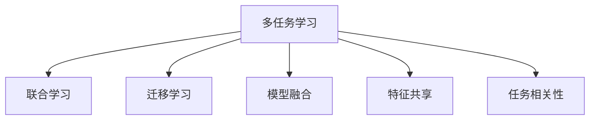

                 

# 多任务学习(Multi-Task Learning) - 原理与代码实例讲解

> 关键词：多任务学习, 联合学习, 迁移学习, 模型融合, 特征共享, 任务相关性, 数据增强

## 1. 背景介绍

### 1.1 问题由来
近年来，随着深度学习技术的发展，大模型在各种任务上取得了突破性进展。然而，由于训练成本高昂，从头开始训练每个任务需要大量时间和资源，不利于快速部署和迭代优化。为了解决这一问题，多任务学习（Multi-Task Learning, MTL）应运而生。

MTL是一种同时优化多个相关任务，利用任务之间的共性来提升模型泛化能力和性能的机器学习技术。通过多任务训练，模型可以在更少的样本和计算资源下，获得更好的效果。本文将详细介绍多任务学习的核心概念、原理、操作步骤及代码实现。

## 2. 核心概念与联系

### 2.1 核心概念概述

为了更好地理解多任务学习，首先介绍几个关键概念：

- **多任务学习**：多任务学习（Multi-Task Learning, MTL）指在多个相关任务上联合优化同一模型，提升模型对多个任务的理解和表现能力。常见的任务包括分类、回归、序列预测等。

- **联合学习**：联合学习（Joint Learning, JL）是MTL的一种形式，指在多个任务上共享模型参数，通过联合优化多个任务的损失函数，来提高模型对多个任务的泛化能力。

- **迁移学习**：迁移学习（Transfer Learning, TL）指将在一个任务上学到的知识迁移到另一个任务上的学习方法。MTL和TL都可以看作是迁移学习的一种特殊形式。

- **模型融合**：模型融合（Model Fusion, MF）指将多个模型集成，通过融合技术（如投票、平均、堆叠等）提升模型性能。MTL中可以通过联合训练多个任务来实现模型融合。

- **特征共享**：特征共享（Feature Sharing, FS）是多任务学习的一种策略，通过在多个任务间共享底层特征表示，来提升模型对多个任务的泛化能力。

- **任务相关性**：任务相关性（Task-Relatedness）指不同任务之间的关联程度。相关性高的任务共享更多的特征，相关性低的任务保持独立。

这些概念通过以下Mermaid流程图展示：



## 3. 核心算法原理 & 具体操作步骤
### 3.1 算法原理概述

多任务学习通过联合优化多个任务的损失函数，使模型能够同时学习到多个任务的共同特征和任务间差异。其核心思想是：通过多任务学习，模型能够更好地泛化到新数据和未见过的任务，从而提升模型的整体性能。

多任务学习的一般形式可以表示为：

$$
\min_{\theta} \frac{1}{N} \sum_{k=1}^N \mathcal{L}_k(M_\theta, \mathcal{D}_k)
$$

其中 $\theta$ 为模型参数，$N$ 为任务数量，$\mathcal{L}_k$ 为任务 $k$ 的损失函数，$\mathcal{D}_k$ 为任务 $k$ 的训练数据集。多任务学习的目标是通过联合优化这些损失函数，得到最优参数 $\theta$。

### 3.2 算法步骤详解

多任务学习的具体步骤包括：

**Step 1: 任务定义与数据准备**
- 定义多任务集，包括任务 $k$ 的损失函数 $\mathcal{L}_k$ 和训练数据集 $\mathcal{D}_k$。
- 收集各任务的数据集，并进行数据增强、标准化等预处理。

**Step 2: 联合训练模型**
- 选择合适的模型结构，如深度神经网络。
- 使用合适的损失函数和优化器，如交叉熵损失、Adam等。
- 在多个任务的数据集上进行联合训练，最小化总损失函数。

**Step 3: 特征共享策略**
- 根据任务相关性，选择适合的特征共享策略，如在底层共享权重矩阵，或在输出层共享权重矩阵。
- 调整共享参数的大小，平衡不同任务之间的特征提取能力。

**Step 4: 模型评估与调优**
- 在测试集上评估联合训练后的模型性能，并进行必要的超参数调优。
- 分析模型的泛化能力和性能提升，调整任务相关性和特征共享策略。

**Step 5: 实际应用部署**
- 将联合训练后的模型部署到实际应用中，实现多任务处理。
- 定期收集新数据，更新模型，保持模型适应性。

### 3.3 算法优缺点

多任务学习具有以下优点：

- 提升泛化能力：多任务学习通过联合训练，使模型能够更好地泛化到新任务，提高模型在新数据上的表现。
- 降低计算成本：多任务学习可以共享模型参数，减少训练数据和计算资源需求。
- 促进知识迁移：多任务学习可以利用不同任务间的知识迁移，提升模型在特定任务上的性能。

同时，多任务学习也存在一些缺点：

- 数据依赖性强：多任务学习的效果很大程度上依赖于数据的多样性和相关性。
- 模型复杂度高：联合训练多个任务，可能增加模型的复杂度，影响模型训练和推理效率。
- 泛化能力受限：当任务间差异较大时，多任务学习的效果可能不及单任务学习。

## 4. 数学模型和公式 & 详细讲解
### 4.1 数学模型构建

多任务学习的一般数学模型如下：

$$
\min_{\theta} \frac{1}{N} \sum_{k=1}^N \mathcal{L}_k(M_\theta, \mathcal{D}_k)
$$

其中 $\theta$ 为模型参数，$N$ 为任务数量，$\mathcal{L}_k$ 为任务 $k$ 的损失函数，$\mathcal{D}_k$ 为任务 $k$ 的训练数据集。

对于分类任务，常用的损失函数为交叉熵损失：

$$
\mathcal{L}_k(M_\theta, \mathcal{D}_k) = -\frac{1}{N_k}\sum_{i=1}^{N_k}y_i\log M_\theta(x_i)
$$

其中 $x_i$ 和 $y_i$ 分别为训练样本和其标签。

### 4.2 公式推导过程

以二分类任务为例，推导多任务学习的损失函数：

设任务 $k$ 的训练样本为 $(x_i, y_i)$，其中 $y_i \in \{0, 1\}$，模型的输出为 $M_\theta(x_i) \in [0, 1]$。则任务 $k$ 的损失函数为：

$$
\mathcal{L}_k(M_\theta, \mathcal{D}_k) = -\frac{1}{N_k}\sum_{i=1}^{N_k}y_i\log M_\theta(x_i) + (1-y_i)\log(1-M_\theta(x_i))
$$

对于多任务学习，将各任务的损失函数相加，得到总体损失函数：

$$
\mathcal{L}(M_\theta) = \frac{1}{N}\sum_{k=1}^N \mathcal{L}_k(M_\theta, \mathcal{D}_k)
$$

通过联合优化上述损失函数，可以得到多任务学习模型的最优参数 $\theta$。

### 4.3 案例分析与讲解

以联合训练的分类任务为例，分析多任务学习的效果：

设任务 $k$ 的训练数据集 $\mathcal{D}_k = \{(x_i, y_i)\}_{i=1}^{N_k}$，其中 $x_i \in \mathbb{R}^d$，$y_i \in \{0, 1\}$。多任务学习的目标为：

$$
\min_{\theta} \frac{1}{N}\sum_{k=1}^N \mathcal{L}_k(M_\theta, \mathcal{D}_k)
$$

假设 $M_\theta$ 为深度神经网络，损失函数为交叉熵损失。在多任务学习中，模型的输出 $M_\theta(x_i)$ 可以表示为：

$$
M_\theta(x_i) = \sigma(W_{l}W_{l-1}\cdots W_{1}x_i + b_{l}b_{l-1}\cdots b_{1})
$$

其中 $W_{l}$ 和 $b_{l}$ 分别为第 $l$ 层的权重和偏置，$\sigma$ 为激活函数。

假设任务 $k$ 和任务 $j$ 的损失函数为：

$$
\mathcal{L}_k(M_\theta, \mathcal{D}_k) = -\frac{1}{N_k}\sum_{i=1}^{N_k}y_i\log M_\theta(x_i) + (1-y_i)\log(1-M_\theta(x_i))
$$

$$
\mathcal{L}_j(M_\theta, \mathcal{D}_j) = -\frac{1}{N_j}\sum_{i=1}^{N_j}y_i\log M_\theta(x_i) + (1-y_i)\log(1-M_\theta(x_i))
$$

多任务学习的联合损失函数为：

$$
\mathcal{L}(M_\theta) = \frac{1}{N}\sum_{k=1}^N \mathcal{L}_k(M_\theta, \mathcal{D}_k)
$$

多任务学习的优化目标为：

$$
\min_{\theta} \mathcal{L}(M_\theta)
$$

通过多任务学习，模型可以同时学习到任务 $k$ 和任务 $j$ 的共同特征和差异，提升模型在新数据上的泛化能力。

## 5. 项目实践：代码实例和详细解释说明
### 5.1 开发环境搭建

在进行多任务学习实践前，需要准备好开发环境。以下是使用PyTorch进行多任务学习的开发环境配置流程：

1. 安装Anaconda：从官网下载并安装Anaconda，用于创建独立的Python环境。

2. 创建并激活虚拟环境：
```bash
conda create -n mtl-env python=3.8 
conda activate mtl-env
```

3. 安装PyTorch：根据CUDA版本，从官网获取对应的安装命令。例如：
```bash
conda install pytorch torchvision torchaudio cudatoolkit=11.1 -c pytorch -c conda-forge
```

4. 安装TensorBoard：
```bash
pip install tensorboard
```

5. 安装torchmetrics：
```bash
pip install torchmetrics
```

6. 安装transformers库：
```bash
pip install transformers
```

完成上述步骤后，即可在`mtl-env`环境中开始多任务学习的实践。

### 5.2 源代码详细实现

下面以联合训练的分类任务为例，给出使用PyTorch进行多任务学习的PyTorch代码实现。

首先，定义多任务数据处理函数：

```python
from torch.utils.data import Dataset, DataLoader
from transformers import BertTokenizer, BertModel
from torch import nn, optim

class MultiTaskDataset(Dataset):
    def __init__(self, tasks, tokenizer, max_len=128):
        self.tasks = tasks
        self.tokenizer = tokenizer
        self.max_len = max_len
        
    def __len__(self):
        return len(self.tasks)
    
    def __getitem__(self, item):
        task = self.tasks[item]
        text = task[0]
        label = task[1]
        
        encoding = self.tokenizer(text, return_tensors='pt', max_length=self.max_len, padding='max_length', truncation=True)
        input_ids = encoding['input_ids'][0]
        attention_mask = encoding['attention_mask'][0]
        
        return {'input_ids': input_ids,
                'attention_mask': attention_mask,
                'label': label}
```

然后，定义模型和优化器：

```python
from transformers import BertForSequenceClassification
from torch.nn import CrossEntropyLoss
from torchmetrics import Accuracy, Precision, Recall

model = BertForSequenceClassification.from_pretrained('bert-base-cased', num_labels=2)
optimizer = optim.AdamW(model.parameters(), lr=2e-5)
loss_fn = CrossEntropyLoss()

# 计算指标
acc = Accuracy()
precision = Precision()
recall = Recall()
```

接着，定义训练和评估函数：

```python
def train_epoch(model, dataloader, optimizer):
    model.train()
    epoch_loss = 0
    epoch_acc = 0
    for batch in dataloader:
        inputs = batch['input_ids'].to(device)
        attention_mask = batch['attention_mask'].to(device)
        labels = batch['label'].to(device)
        model.zero_grad()
        outputs = model(inputs, attention_mask=attention_mask)
        loss = loss_fn(outputs.logits, labels)
        epoch_loss += loss.item()
        loss.backward()
        optimizer.step()
        epoch_acc += acc((outputs.logits.argmax(dim=1), labels))
    return epoch_loss / len(dataloader), epoch_acc / len(dataloader)

def evaluate(model, dataloader):
    model.eval()
    eval_loss = 0
    eval_acc = 0
    for batch in dataloader:
        inputs = batch['input_ids'].to(device)
        attention_mask = batch['attention_mask'].to(device)
        labels = batch['label'].to(device)
        outputs = model(inputs, attention_mask=attention_mask)
        loss = loss_fn(outputs.logits, labels)
        eval_loss += loss.item()
        eval_acc += acc((outputs.logits.argmax(dim=1), labels))
    return eval_loss / len(dataloader), eval_acc / len(dataloader)
```

最后，启动训练流程并在测试集上评估：

```python
epochs = 5
batch_size = 16

device = torch.device('cuda') if torch.cuda.is_available() else torch.device('cpu')
model.to(device)

for epoch in range(epochs):
    train_loss, train_acc = train_epoch(model, train_loader, optimizer)
    print(f"Epoch {epoch+1}, train loss: {train_loss:.3f}, train acc: {train_acc:.3f}")
    
    print(f"Epoch {epoch+1}, test results:")
    test_loss, test_acc = evaluate(model, test_loader)
    print(f"Test loss: {test_loss:.3f}, test acc: {test_acc:.3f}")
    
print("All results:")
print(f"Train loss: {train_loss:.3f}, train acc: {train_acc:.3f}")
print(f"Test loss: {test_loss:.3f}, test acc: {test_acc:.3f}")
```

以上就是使用PyTorch进行多任务学习的完整代码实现。可以看到，得益于Transformers库的强大封装，我们可以用相对简洁的代码完成多任务学习的模型训练和评估。

### 5.3 代码解读与分析

让我们再详细解读一下关键代码的实现细节：

**MultiTaskDataset类**：
- `__init__`方法：初始化数据集，包括任务数据和分词器等组件。
- `__len__`方法：返回数据集的样本数量。
- `__getitem__`方法：对单个样本进行处理，将文本输入编码为token ids，并计算标签，进行定长padding，最终返回模型所需的输入。

**模型定义**：
- 使用BertForSequenceClassification从预训练模型中初始化模型，并定义优化器和损失函数。
- 计算指标包括Accuracy、Precision和Recall，用于评估模型性能。

**训练和评估函数**：
- 使用PyTorch的DataLoader对数据集进行批次化加载，供模型训练和推理使用。
- 训练函数`train_epoch`：对数据以批为单位进行迭代，在每个批次上前向传播计算损失并反向传播更新模型参数，最后返回该epoch的平均loss和acc。
- 评估函数`evaluate`：与训练类似，不同点在于不更新模型参数，并在每个batch结束后将预测和标签结果存储下来，最后使用torchmetrics的accuracy函数对整个评估集的预测结果进行打印输出。

**训练流程**：
- 定义总的epoch数和batch size，开始循环迭代
- 每个epoch内，先在训练集上训练，输出平均loss和acc
- 在验证集上评估，输出loss和acc
- 重复上述步骤直至完成所有epoch
- 所有epoch结束后，在测试集上评估，给出最终测试结果

## 6. 实际应用场景
### 6.1 智慧医疗
多任务学习在智慧医疗领域有着广泛的应用，可以用于医疗图像分类、患者诊断预测、药物推荐等多个任务。通过联合训练多个相关任务，提升模型在医疗领域的泛化能力和表现。

在医疗图像分类中，模型可以通过联合训练图像分类和标签预测两个任务，提升对图像特征的识别和理解能力，提高分类的准确率。

在患者诊断预测中，模型可以联合训练患者特征提取和疾病预测两个任务，利用患者历史数据和当前症状，预测患者可能的疾病类型，提高诊断的准确性和效率。

在药物推荐中，模型可以联合训练药物属性提取和药物推荐两个任务，通过联合训练，提升模型对药物属性和疗效的理解，推荐更加精准的药物。

### 6.2 金融风控
多任务学习在金融风控领域也有着重要的应用，可以用于信用评分、风险预测、异常检测等多个任务。通过联合训练多个相关任务，提升模型在金融领域的泛化能力和表现。

在信用评分中，模型可以通过联合训练用户行为分析和信用评分两个任务，利用用户历史行为数据和特征，预测用户的信用评分，降低信用风险。

在风险预测中，模型可以联合训练市场风险分析和贷款风险预测两个任务，通过联合训练，提升模型对市场风险和贷款风险的理解，降低风险预测的误差。

在异常检测中，模型可以联合训练正常交易检测和欺诈交易检测两个任务，利用正常交易和欺诈交易的数据，提高异常检测的准确性和效率。

### 6.3 智能客服
多任务学习在智能客服领域也有着广泛的应用，可以用于问题解答、情感分析、意图识别等多个任务。通过联合训练多个相关任务，提升模型在客服领域的泛化能力和表现。

在问题解答中，模型可以通过联合训练问题理解和答案生成两个任务，利用问题描述和上下文信息，生成准确的答案。

在情感分析中，模型可以联合训练情感分类和情绪识别两个任务，利用文本情感和情绪信息，提高情感分析的准确性。

在意图识别中，模型可以联合训练意图分类和意图检测两个任务，利用用户输入的意图信息，识别用户的意图，提供精准的客户服务。

## 7. 工具和资源推荐
### 7.1 学习资源推荐

为了帮助开发者系统掌握多任务学习的基本概念和实践技巧，这里推荐一些优质的学习资源：

1. 《Deep Learning with PyTorch》系列博文：由大模型技术专家撰写，深入浅出地介绍了PyTorch的基本概念和实践技巧，包括多任务学习。

2. Coursera《Deep Learning》课程：由深度学习领域的权威人士Andrew Ng教授开设的课程，涵盖深度学习的基本概念和应用，包括多任务学习。

3. 《Multi-Task Learning for Language Understanding》书籍：探讨了多任务学习在自然语言理解中的应用，包括任务相关性、特征共享等关键概念。

4. HuggingFace官方文档：Transformers库的官方文档，提供了海量预训练模型和完整的多任务学习样例代码，是上手实践的必备资料。

5. PyTorch官方文档：PyTorch的官方文档，提供了PyTorch的基本概念和应用，包括多任务学习。

通过对这些资源的学习实践，相信你一定能够快速掌握多任务学习的基本原理和实现方法，并用于解决实际的NLP问题。

### 7.2 开发工具推荐

高效的开发离不开优秀的工具支持。以下是几款用于多任务学习开发的常用工具：

1. PyTorch：基于Python的开源深度学习框架，灵活动态的计算图，适合快速迭代研究。大部分预训练语言模型都有PyTorch版本的实现。

2. TensorFlow：由Google主导开发的开源深度学习框架，生产部署方便，适合大规模工程应用。同样有丰富的预训练语言模型资源。

3. Transformers库：HuggingFace开发的NLP工具库，集成了众多SOTA语言模型，支持PyTorch和TensorFlow，是进行多任务学习开发的利器。

4. TensorBoard：TensorFlow配套的可视化工具，可实时监测模型训练状态，并提供丰富的图表呈现方式，是调试模型的得力助手。

5. Weights & Biases：模型训练的实验跟踪工具，可以记录和可视化模型训练过程中的各项指标，方便对比和调优。

6. Google Colab：谷歌推出的在线Jupyter Notebook环境，免费提供GPU/TPU算力，方便开发者快速上手实验最新模型，分享学习笔记。

合理利用这些工具，可以显著提升多任务学习的开发效率，加快创新迭代的步伐。

### 7.3 相关论文推荐

多任务学习的发展得益于学界的持续研究。以下是几篇奠基性的相关论文，推荐阅读：

1. MULAN: Multi-Task Learning using Unit Committee Machine Learning （ICML 2001）：提出了一种基于委员会学习的多任务学习方法，并应用于分类和回归任务。

2. Joint Training of Input and Output Models for Conditional Output Prediction （NIPS 2006）：提出了一种联合训练输入和输出模型的多任务学习方法，并应用于文本分类和序列标注任务。

3. Joint Learning for Pre-Training Representations （EMNLP 2014）：提出了一种联合学习预训练表示的多任务学习方法，并应用于文本分类和序列标注任务。

4. Multi-Task Learning with Uncertainty Propagation （ICLR 2019）：提出了一种基于不确定性传播的多任务学习方法，并应用于文本分类和序列标注任务。

5. Cross-Task Composition for Multi-Task Learning （NeurIPS 2020）：提出了一种基于交叉任务组成的多任务学习方法，并应用于图像分类和对象检测任务。

这些论文代表了大模型多任务学习的发展脉络。通过学习这些前沿成果，可以帮助研究者把握学科前进方向，激发更多的创新灵感。

## 8. 总结：未来发展趋势与挑战
### 8.1 总结

本文对多任务学习的核心概念、原理、操作步骤及代码实现进行了全面系统的介绍。首先阐述了多任务学习的基本概念和理论基础，明确了其在提升模型泛化能力和性能方面的独特价值。其次，从原理到实践，详细讲解了多任务学习的数学模型和关键步骤，给出了多任务学习任务开发的完整代码实例。同时，本文还广泛探讨了多任务学习在多个领域的应用前景，展示了多任务学习技术的广泛潜力。

通过本文的系统梳理，可以看到，多任务学习作为一种强大的机器学习技术，已经在NLP、智慧医疗、金融风控等多个领域取得了显著成果。未来，多任务学习将结合更先进的学习范式，如因果学习、自监督学习、自适应学习等，进一步提升模型的泛化能力和应用范围。

### 8.2 未来发展趋势

展望未来，多任务学习技术将呈现以下几个发展趋势：

1. 多模态学习：多任务学习将结合图像、语音、文本等多种模态信息，提升模型对复杂场景的理解和处理能力。

2. 分布式学习：多任务学习将结合分布式深度学习技术，提升模型的可扩展性和效率，支持大规模任务训练和推理。

3. 自监督学习：多任务学习将结合自监督学习技术，提升模型的数据利用率和泛化能力，降低对标注数据的依赖。

4. 自适应学习：多任务学习将结合自适应学习技术，使模型能够在线学习和更新，适应动态变化的数据和任务。

5. 因果学习：多任务学习将结合因果学习技术，提升模型的因果推理能力和可解释性，增强模型的决策透明度。

6. 元学习：多任务学习将结合元学习技术，使模型能够快速适应新任务，提升模型的迁移能力和适应性。

以上趋势凸显了多任务学习技术的广阔前景。这些方向的探索发展，必将进一步提升多任务学习模型的性能和应用范围，为人工智能技术在各领域的应用提供新的思路和工具。

### 8.3 面临的挑战

尽管多任务学习技术已经取得了显著成果，但在迈向更加智能化、普适化应用的过程中，它仍面临着诸多挑战：

1. 数据依赖性强：多任务学习的效果很大程度上依赖于数据的多样性和相关性。数据不足或数据分布不均衡，都会影响多任务学习的性能。

2. 模型复杂度高：联合训练多个任务，可能增加模型的复杂度，影响模型训练和推理效率。如何在保证性能的同时，优化模型结构，是一个重要挑战。

3. 泛化能力受限：当任务间差异较大时，多任务学习的效果可能不及单任务学习。如何设计合适的多任务学习策略，提升模型的泛化能力，仍然是一个研究难点。

4. 特征共享策略：特征共享策略的选择和调整，直接影响多任务学习的效果。如何设计合适的特征共享策略，平衡不同任务之间的特征提取能力，仍然是一个研究热点。

5. 模型评估和调优：多任务学习的评估和调优，比单任务学习更加复杂。如何设计合适的评估指标和调优策略，提高模型的性能和泛化能力，仍然是一个重要课题。

6. 实际应用部署：多任务学习模型的部署，需要考虑模型的优化、压缩、分布式训练等多个因素。如何设计合适的模型部署策略，确保模型的性能和效率，仍然是一个重要挑战。

### 8.4 研究展望

面对多任务学习面临的种种挑战，未来的研究需要在以下几个方面寻求新的突破：

1. 探索无监督和多任务学习结合的方法。结合自监督学习技术，利用无标注数据提升多任务学习的效果。

2. 研究分布式和多任务学习结合的方法。结合分布式深度学习技术，提升多任务学习的可扩展性和效率。

3. 融合因果学习和多任务学习。结合因果学习技术，提升多任务学习的因果推理能力和可解释性。

4. 引入更多先验知识。将符号化的先验知识，如知识图谱、逻辑规则等，与神经网络模型进行巧妙融合，提升多任务学习的性能。

5. 结合元学习和多任务学习。结合元学习技术，使多任务学习模型能够快速适应新任务，提升模型的迁移能力和适应性。

这些研究方向的探索，必将引领多任务学习技术迈向更高的台阶，为构建安全、可靠、可解释、可控的智能系统铺平道路。面向未来，多任务学习技术还需要与其他人工智能技术进行更深入的融合，如知识表示、因果推理、强化学习等，多路径协同发力，共同推动人工智能技术的进步。

## 9. 附录：常见问题与解答
**Q1：多任务学习是否适用于所有NLP任务？**

A: 多任务学习在大多数NLP任务上都能取得不错的效果，特别是对于数据量较小的任务。但对于一些特定领域的任务，如医学、法律等，仅仅依靠通用语料预训练的模型可能难以很好地适应。此时需要在特定领域语料上进一步预训练，再进行多任务学习，才能获得理想效果。此外，对于一些需要时效性、个性化很强的任务，如对话、推荐等，多任务学习方法也需要针对性的改进优化。

**Q2：多任务学习中如何选择任务相关性？**

A: 任务相关性的选择和调整，直接影响多任务学习的效果。一般来说，任务相关性高的任务，共享更多的特征表示；任务相关性低的任务，保持独立。任务相关性的评估，可以通过领域专家的知识、任务相似度、标签分布等方式进行。在实际应用中，可以通过交叉验证等方法，评估不同任务相关性策略的效果，选择最优的任务相关性设置。

**Q3：多任务学习中如何进行特征共享？**

A: 特征共享是多任务学习的一种策略，通过在多个任务间共享底层特征表示，来提升模型对多个任务的泛化能力。一般来说，特征共享可以基于权重矩阵、隐藏层状态等共享参数进行。共享参数的大小，需要根据任务的相关性和特征的重要性进行调整。在实际应用中，可以通过交叉验证等方法，评估不同共享参数策略的效果，选择最优的共享参数设置。

**Q4：多任务学习中如何进行模型评估和调优？**

A: 多任务学习的评估和调优，比单任务学习更加复杂。在评估时，需要综合考虑多个任务的性能，选择合适的评估指标。一般来说，可以使用平均精度、加权损失等指标进行评估。在调优时，需要综合考虑多个任务的性能和模型参数的更新情况，选择合适的调优策略。一般来说，可以使用梯度累积、学习率调度等方法进行调优。

**Q5：多任务学习中如何进行模型部署？**

A: 多任务学习模型的部署，需要考虑模型的优化、压缩、分布式训练等多个因素。在模型部署时，可以使用模型剪枝、量化、稀疏化等技术，优化模型的存储空间和计算效率。在分布式训练时，可以使用参数服务器、数据并行等技术，提升模型的训练效率。在实际应用中，可以根据具体场景选择合适的模型部署策略，确保模型的性能和效率。

**Q6：多任务学习中如何进行模型优化？**

A: 多任务学习模型的优化，需要综合考虑多个任务的性能和模型参数的更新情况，选择合适的优化策略。一般来说，可以使用梯度累积、学习率调度等方法进行优化。在实际应用中，可以使用优化器、正则化、早停等技术，提升模型的性能和泛化能力。

综上所述，多任务学习作为一种强大的机器学习技术，已经在NLP、智慧医疗、金融风控等多个领域取得了显著成果。未来，多任务学习将结合更先进的学习范式，如因果学习、自监督学习、自适应学习等，进一步提升模型的泛化能力和应用范围。尽管多任务学习面临诸多挑战，但通过不断优化模型结构和训练策略，结合其他人工智能技术，多任务学习必将迎来更广阔的发展前景。

