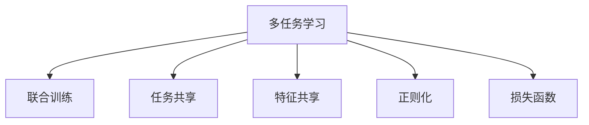

                 

# 多任务学习(Multi-Task Learning) - 原理与代码实例讲解

> 关键词：多任务学习,联合训练,任务共享,特征共享,正则化,损失函数,代码实例,Transformer

## 1. 背景介绍

### 1.1 问题由来
多任务学习(Multi-Task Learning, MTL)是一种机器学习范式，旨在同时解决多个相关的任务，通过共享特征或任务之间的相互影响来提高模型的泛化能力和表现。MTL广泛应用于自然语言处理(NLP)、计算机视觉、信号处理等领域，帮助模型从多个任务的协同训练中受益，提升其在各个任务上的表现。

近年来，多任务学习在大模型预训练和微调中逐渐成为热点话题。通过对多个任务的联合训练，大模型可以学习到更为复杂和鲁棒的特征，提升下游任务的性能。例如，通过同时预训练BERT模型，使其在命名实体识别(NER)、情感分析(SA)等多个任务上都有优异表现，从而在实际应用中产生更大的价值。

### 1.2 问题核心关键点
多任务学习的核心思想是通过联合训练多个任务，充分利用不同任务之间的相关性，减少数据依赖，提升模型的泛化能力和准确性。常见的多任务学习框架包括联合训练、任务共享和特征共享等。

多任务学习的关键在于：
1. 选择合适的联合训练方式，如序列式训练、并行式训练等。
2. 设计合适的损失函数，平衡不同任务之间的权重，防止过拟合。
3. 控制任务之间的相关性，选择合适的特征共享方式。
4. 应用正则化技术，避免模型的过拟合。
5. 选择合适的预训练和微调模型，如Transformer、BERT等。

多任务学习在大规模预训练语言模型中的应用，极大地提升了模型的泛化能力，使其在各种下游任务上都能取得较好的性能。

### 1.3 问题研究意义
研究多任务学习，对于拓展预训练模型应用范围，提升模型的泛化能力和泛化性能，具有重要意义：

1. 泛化能力提升：多任务学习可以借助不同任务间的相关性，提升模型在各种任务上的泛化能力。
2. 参数复用：通过特征共享，降低模型参数量，减少训练时间，提升模型效率。
3. 数据需求降低：多任务学习可以共享训练数据，减少单个任务的标注数据需求。
4. 技术创新：多任务学习催生了联合训练、任务共享等新的研究方向，推动了深度学习理论的发展。
5. 应用扩展：多任务学习为预训练模型提供了更多的应用场景，提高了模型的实用价值。

## 2. 核心概念与联系

### 2.1 核心概念概述

为了更好地理解多任务学习的基本原理和关键技术，本节将介绍几个密切相关的核心概念：

- 多任务学习(Multi-Task Learning, MTL)：指同时解决多个相关任务，通过共享特征或任务之间的相互影响来提高模型的泛化能力和表现。
- 联合训练(Joint Training)：指在多个任务上同时训练模型，通过共享特征或任务之间的相互影响，提升模型在各个任务上的表现。
- 任务共享(Task Sharing)：指在多个任务之间共享部分层或特征，提升模型在各任务上的泛化能力。
- 特征共享(Feature Sharing)：指在多个任务之间共享中间特征表示，减少模型参数量，提升模型训练效率。
- 正则化(Regularization)：指在模型训练过程中加入正则项，防止过拟合，提升模型泛化能力。
- 损失函数(Loss Function)：指用于衡量模型在多个任务上的预测输出与真实标签之间差异的函数，用于指导模型参数的更新。

这些核心概念之间的逻辑关系可以通过以下Mermaid流程图来展示：



这个流程图展示了大任务学习的基本概念及其之间的关系：

1. 多任务学习是通过联合训练多个任务，利用任务之间的相关性来提升模型的泛化能力。
2. 联合训练可以通过任务共享或特征共享来实现，共享部分特征或层来提高模型性能。
3. 正则化技术用于避免模型过拟合，提升模型泛化能力。
4. 损失函数用于衡量模型在各个任务上的表现，指导模型参数的更新。

这些概念共同构成了多任务学习的核心框架，使其能够在大规模预训练模型和下游任务上发挥重要作用。通过理解这些核心概念，我们可以更好地把握多任务学习的本质和优化方向。

## 3. 核心算法原理 & 具体操作步骤
### 3.1 算法原理概述

多任务学习的核心思想是通过联合训练多个任务，充分利用不同任务之间的相关性，减少数据依赖，提升模型的泛化能力和准确性。在多任务学习中，通常将多个任务表示为$\{t_1, t_2, ..., t_n\}$，每个任务可以表示为一个有标签的数据集$\{(x_i, y_i)\}_{i=1}^N$，其中$x_i$为输入，$y_i$为标签。多任务学习的目标是通过联合训练这些任务，提升模型在各个任务上的表现。

多任务学习可以基于联合训练、任务共享和特征共享等方式进行。联合训练指在多个任务上同时训练模型，通过共享特征或任务之间的相互影响，提升模型在各个任务上的表现。任务共享指在多个任务之间共享部分层或特征，提升模型在各任务上的泛化能力。特征共享指在多个任务之间共享中间特征表示，减少模型参数量，提升模型训练效率。

### 3.2 算法步骤详解

多任务学习的实现步骤一般包括以下几个关键步骤：

**Step 1: 准备数据集**
- 收集并准备多个相关任务的数据集，确保数据分布相似。
- 将每个任务的数据集划分为训练集、验证集和测试集。

**Step 2: 选择合适的模型结构**
- 选择适合多任务学习的模型结构，如Transformer、BERT等。
- 根据任务类型设计合适的任务适配层，如分类层、回归层等。

**Step 3: 设置联合训练参数**
- 设置多个任务之间的权重，平衡不同任务之间的重要性。
- 设置正则化技术，如L2正则、Dropout等，防止模型过拟合。
- 确定是否共享特征或层，设置相应的共享策略。

**Step 4: 执行联合训练**
- 将多个任务的数据集合并，构建联合数据集。
- 对联合数据集进行迭代训练，优化模型参数。
- 在每个epoch结束时，计算联合损失函数，并更新模型参数。

**Step 5: 任务评估与模型部署**
- 在每个任务的数据集上单独评估模型性能，输出各任务的精确度、召回率等指标。
- 使用微调后的模型对新样本进行推理预测，集成到实际的应用系统中。
- 持续收集新的数据，定期重新训练模型，以适应数据分布的变化。

以上是多任务学习的一般流程。在实际应用中，还需要针对具体任务的特点，对联合训练过程的各个环节进行优化设计，如改进联合损失函数，引入更多的正则化技术，搜索最优的权重组合等，以进一步提升模型性能。

### 3.3 算法优缺点

多任务学习作为一种机器学习范式，具有以下优点：
1. 提升泛化能力：通过联合训练多个任务，模型能够学习到更复杂的特征，提升泛化能力。
2. 降低数据需求：多任务学习可以共享训练数据，减少单个任务的标注数据需求。
3. 提高模型效率：通过特征共享，降低模型参数量，提升模型训练效率。
4. 减少过拟合：通过正则化技术，避免模型过拟合，提升模型泛化能力。
5. 应用广泛：多任务学习可以应用于各种NLP、CV、信号处理等领域的任务，具有广泛的应用前景。

同时，该方法也存在一定的局限性：
1. 数据分布一致性要求高：多任务学习要求不同任务之间的数据分布相似，否则会影响模型性能。
2. 模型复杂度高：多任务学习模型通常包含多个任务层或共享层，导致模型复杂度较高。
3. 模型训练时间长：多任务学习模型参数量大，训练时间较长。
4. 任务相关性要求高：多任务学习要求任务之间具有一定的相关性，否则共享特征的效果会大打折扣。

尽管存在这些局限性，但就目前而言，多任务学习仍是大规模预训练模型和下游任务应用的主流范式。未来相关研究的重点在于如何进一步降低多任务学习的资源消耗，提高模型的泛化能力和训练效率，同时兼顾模型复杂度和泛化性能等因素。

### 3.4 算法应用领域

多任务学习在大规模预训练模型和下游任务应用中，已经得到了广泛的应用，覆盖了几乎所有常见任务，例如：

- 文本分类：如情感分析、主题分类、意图识别等。通过联合训练多个分类任务，提升模型对不同分类任务的泛化能力。
- 命名实体识别：识别文本中的人名、地名、机构名等特定实体。通过特征共享，提高模型在多个实体类型上的识别精度。
- 关系抽取：从文本中抽取实体之间的语义关系。通过任务共享，提高模型在不同关系类型上的抽取精度。
- 问答系统：对自然语言问题给出答案。通过联合训练多个问答任务，提升模型在不同类型问题上的回答精度。
- 机器翻译：将源语言文本翻译成目标语言。通过特征共享，提高模型在多种语言对上的翻译精度。
- 文本摘要：将长文本压缩成简短摘要。通过联合训练摘要任务，提升模型在多种摘要长度上的表现。
- 对话系统：使机器能够与人自然对话。通过联合训练多个对话任务，提高模型在不同对话场景下的对话能力。

除了上述这些经典任务外，多任务学习还被创新性地应用到更多场景中，如可控文本生成、常识推理、代码生成、数据增强等，为NLP技术带来了全新的突破。随着预训练模型和联合训练方法的不断进步，相信多任务学习将在更广阔的应用领域大放异彩。

## 4. 数学模型和公式 & 详细讲解  
### 4.1 数学模型构建

本节将使用数学语言对多任务学习的基本模型进行更加严格的刻画。

记多任务学习的数据集为$\{(X_i, Y_i)\}_{i=1}^N$，其中$X_i$为输入，$Y_i$为标签。多任务学习的目标是通过联合训练这些任务，得到最优的模型参数$\theta$。

定义联合损失函数$\mathcal{L}(\theta)$为所有任务的平均损失之和：

$$
\mathcal{L}(\theta) = \frac{1}{N} \sum_{i=1}^N \ell_i(X_i, Y_i, \theta)
$$

其中$\ell_i$为第$i$个任务的损失函数，可以是交叉熵损失、均方误差损失等。

多任务学习通过优化联合损失函数$\mathcal{L}(\theta)$，找到最优模型参数$\theta^*$：

$$
\theta^* = \mathop{\arg\min}_{\theta} \mathcal{L}(\theta)
$$

在实践中，我们通常使用基于梯度的优化算法（如SGD、Adam等）来近似求解上述最优化问题。设$\eta$为学习率，$\lambda$为正则化系数，则参数的更新公式为：

$$
\theta \leftarrow \theta - \eta \nabla_{\theta}\mathcal{L}(\theta) - \eta\lambda\theta
$$

其中 $\nabla_{\theta}\mathcal{L}(\theta)$ 为联合损失函数对参数 $\theta$ 的梯度，可通过反向传播算法高效计算。

### 4.2 公式推导过程

以下我们以二分类任务和回归任务为例，推导联合训练的损失函数及其梯度的计算公式。

假设模型 $M_{\theta}$ 在输入 $x$ 上的输出为 $\hat{y}=M_{\theta}(x)$，表示样本属于正类的概率。真实标签 $y \in \{0,1\}$。定义二分类交叉熵损失函数：

$$
\ell_i(X_i, Y_i, \theta) = -[y_i\log \hat{y_i} + (1-y_i)\log (1-\hat{y_i})]
$$

假设回归任务中，模型预测值为 $\hat{y}$，真实值为 $y$，定义均方误差损失函数：

$$
\ell_i(X_i, Y_i, \theta) = \frac{1}{2}(\hat{y_i} - y_i)^2
$$

将这两个损失函数代入联合损失函数公式：

$$
\mathcal{L}(\theta) = \frac{1}{N} \sum_{i=1}^N \left(-[y_i\log \hat{y_i} + (1-y_i)\log (1-\hat{y_i}) + \frac{1}{2}(\hat{y_i} - y_i)^2\right)
$$

将上述公式展开，得：

$$
\mathcal{L}(\theta) = \frac{1}{N} \sum_{i=1}^N \left[ -y_i\log \hat{y_i} + (1-y_i)\log (1-\hat{y_i}) + \frac{1}{2}(\hat{y_i} - y_i)^2 \right]
$$

根据链式法则，联合损失函数对参数 $\theta_k$ 的梯度为：

$$
\frac{\partial \mathcal{L}(\theta)}{\partial \theta_k} = \frac{1}{N} \sum_{i=1}^N \left[ \frac{\partial}{\partial \theta_k} \left(-y_i\log \hat{y_i} + (1-y_i)\log (1-\hat{y_i}) + \frac{1}{2}(\hat{y_i} - y_i)^2 \right) \right]
$$

其中：

$$
\frac{\partial}{\partial \theta_k} \left(-y_i\log \hat{y_i} + (1-y_i)\log (1-\hat{y_i}) + \frac{1}{2}(\hat{y_i} - y_i)^2 \right) = \frac{\partial}{\partial \hat{y_i}} \left(-y_i\log \hat{y_i} + (1-y_i)\log (1-\hat{y_i}) + \frac{1}{2}(\hat{y_i} - y_i)^2 \right) \frac{\partial \hat{y_i}}{\partial \theta_k}
$$

将上述公式代入梯度公式：

$$
\frac{\partial \mathcal{L}(\theta)}{\partial \theta_k} = \frac{1}{N} \sum_{i=1}^N \left[ \frac{\partial}{\partial \hat{y_i}} \left(-y_i\log \hat{y_i} + (1-y_i)\log (1-\hat{y_i}) + \frac{1}{2}(\hat{y_i} - y_i)^2 \right) \frac{\partial \hat{y_i}}{\partial \theta_k} \right]
$$

将$\frac{\partial \hat{y_i}}{\partial \theta_k}$代入，得：

$$
\frac{\partial \mathcal{L}(\theta)}{\partial \theta_k} = \frac{1}{N} \sum_{i=1}^N \left[ \frac{\partial}{\partial \hat{y_i}} \left(-y_i\log \hat{y_i} + (1-y_i)\log (1-\hat{y_i}) + \frac{1}{2}(\hat{y_i} - y_i)^2 \right) \nabla_{\theta_k}M_{\theta}(x_i) \right]
$$

在得到联合损失函数的梯度后，即可带入参数更新公式，完成模型的迭代优化。重复上述过程直至收敛，最终得到适应多个任务的最优模型参数 $\theta^*$。

## 5. 项目实践：代码实例和详细解释说明
### 5.1 开发环境搭建

在进行多任务学习实践前，我们需要准备好开发环境。以下是使用Python进行PyTorch开发的环境配置流程：

1. 安装Anaconda：从官网下载并安装Anaconda，用于创建独立的Python环境。

2. 创建并激活虚拟环境：
```bash
conda create -n multi_task_env python=3.8 
conda activate multi_task_env
```

3. 安装PyTorch：根据CUDA版本，从官网获取对应的安装命令。例如：
```bash
conda install pytorch torchvision torchaudio cudatoolkit=11.1 -c pytorch -c conda-forge
```

4. 安装Transformers库：
```bash
pip install transformers
```

5. 安装各类工具包：
```bash
pip install numpy pandas scikit-learn matplotlib tqdm jupyter notebook ipython
```

完成上述步骤后，即可在`multi_task_env`环境中开始多任务学习实践。

### 5.2 源代码详细实现

这里我们以命名实体识别(NER)和情感分析(SA)为例，给出使用Transformers库对BERT模型进行联合训练的PyTorch代码实现。

首先，定义多任务学习的数据处理函数：

```python
from transformers import BertTokenizer
from torch.utils.data import Dataset
import torch

class MultiTaskDataset(Dataset):
    def __init__(self, texts, tags, tokenizers, max_len=128):
        self.texts = texts
        self.tags = tags
        self.tokenizers = tokenizers
        self.max_len = max_len
        
    def __len__(self):
        return len(self.texts)
    
    def __getitem__(self, item):
        text = self.texts[item]
        tags = self.tags[item]
        
        tokenizers = [tokenizer for tokenizer in self.tokenizers]
        encodings = [tokenizer(text, return_tensors='pt', max_length=self.max_len, padding='max_length', truncation=True) for tokenizer in tokenizers]
        input_ids = [encoding['input_ids'][0] for encoding in encodings]
        attention_mask = [encoding['attention_mask'][0] for encoding in encodings]
        
        # 对token-wise的标签进行编码
        encoded_tags = [tag2id[tag] for tag in tags] 
        encoded_tags.extend([tag2id['O']] * (self.max_len - len(encoded_tags)))
        labels = torch.tensor(encoded_tags, dtype=torch.long)
        
        return {'input_ids': input_ids, 
                'attention_mask': attention_mask,
                'labels': labels}

# 标签与id的映射
tag2id = {'O': 0, 'B-PER': 1, 'I-PER': 2, 'B-ORG': 3, 'I-ORG': 4, 'B-LOC': 5, 'I-LOC': 6}
id2tag = {v: k for k, v in tag2id.items()}
```

然后，定义模型和优化器：

```python
from transformers import BertForTokenClassification, AdamW

model = BertForTokenClassification.from_pretrained('bert-base-cased', num_labels=len(tag2id))
device = torch.device('cuda') if torch.cuda.is_available() else torch.device('cpu')

# 添加任务适配层
class MultiTaskHead(BertForTokenClassification):
    def __init__(self, config):
        super().__init__(config)
        self.classifier = BertForTokenClassification(config, num_labels=len(tag2id))

    def forward(self, input_ids, attention_mask, labels=None):
        outputs = self.bert(input_ids, attention_mask=attention_mask)
        sequence_output = outputs[0]
        logits = self.classifier(sequence_output, labels)
        return logits

# 创建多个任务适配层
n_tasks = 2
heads = [MultiTaskHead(model.config) for _ in range(n_tasks)]

# 定义多个优化器
optimizer = [AdamW(head.parameters(), lr=2e-5) for head in heads]
```

接着，定义训练和评估函数：

```python
from torch.utils.data import DataLoader
from tqdm import tqdm
from sklearn.metrics import classification_report

def train_epoch(model, dataloader, optimizer):
    model.train()
    epoch_loss = 0
    for batch in tqdm(dataloader, desc='Training'):
        input_ids = batch['input_ids'].to(device)
        attention_mask = batch['attention_mask'].to(device)
        labels = batch['labels'].to(device)
        model.zero_grad()
        loss = 0
        for head, optimizer in zip(heads, optimizer):
            outputs = head(input_ids, attention_mask, labels=labels)
            loss += outputs.loss
        loss /= len(heads)
        loss.backward()
        optimizer.step()
    return epoch_loss / len(dataloader)

def evaluate(model, dataloader):
    model.eval()
    preds, labels = [], []
    with torch.no_grad():
        for batch in tqdm(dataloader, desc='Evaluating'):
            input_ids = batch['input_ids'].to(device)
            attention_mask = batch['attention_mask'].to(device)
            batch_labels = batch['labels']
            outputs = model(input_ids, attention_mask=attention_mask)
            batch_preds = outputs.logits.argmax(dim=2).to('cpu').tolist()
            batch_labels = batch_labels.to('cpu').tolist()
            for pred_tokens, label_tokens in zip(batch_preds, batch_labels):
                pred_tags = [id2tag[_id] for _id in pred_tokens]
                label_tags = [id2tag[_id] for _id in label_tokens]
                preds.append(pred_tags[:len(label_tags)])
                labels.append(label_tags)
                
    print(classification_report(labels, preds))
```

最后，启动联合训练流程并在测试集上评估：

```python
epochs = 5
batch_size = 16

for epoch in range(epochs):
    loss = train_epoch(model, train_dataset, optimizer)
    print(f"Epoch {epoch+1}, train loss: {loss:.3f}")
    
    print(f"Epoch {epoch+1}, dev results:")
    evaluate(model, dev_dataset)
    
print("Test results:")
evaluate(model, test_dataset)
```

以上就是使用PyTorch对BERT进行联合训练的完整代码实现。可以看到，得益于Transformers库的强大封装，我们可以用相对简洁的代码完成多任务学习的开发。

### 5.3 代码解读与分析

让我们再详细解读一下关键代码的实现细节：

**MultiTaskDataset类**：
- `__init__`方法：初始化文本、标签、分词器等关键组件，并定义了多任务学习的数据处理方式。
- `__len__`方法：返回数据集的样本数量。
- `__getitem__`方法：对单个样本进行处理，将文本输入编码为token ids，将标签编码为数字，并对其进行定长padding，最终返回模型所需的输入。

**n_tasks和heads变量**：
- `n_tasks`：定义了联合训练的任务数量。
- `heads`：创建了多个任务适配层，每个适配层对应一个任务。

**optimizer列表**：
- 使用多个AdamW优化器，分别对每个任务的参数进行优化，每个优化器都有不同的学习率。

**train_epoch和evaluate函数**：
- `train_epoch`函数：对联合数据集进行迭代训练，对每个任务进行前向传播和反向传播，并计算联合损失函数，更新模型参数。
- `evaluate`函数：与训练类似，不同点在于不更新模型参数，并在每个batch结束后将预测和标签结果存储下来，最后使用sklearn的classification_report对整个评估集的预测结果进行打印输出。

**联合训练流程**：
- 定义总的epoch数和batch size，开始循环迭代
- 每个epoch内，先在训练集上训练，输出联合损失
- 在验证集上评估，输出分类指标
- 所有epoch结束后，在测试集上评估，给出最终测试结果

可以看到，PyTorch配合Transformers库使得多任务学习的代码实现变得简洁高效。开发者可以将更多精力放在数据处理、模型改进等高层逻辑上，而不必过多关注底层的实现细节。

当然，工业级的系统实现还需考虑更多因素，如模型的保存和部署、超参数的自动搜索、更灵活的任务适配层等。但核心的联合训练范式基本与此类似。

## 6. 实际应用场景
### 6.1 智能客服系统

多任务学习在大规模预训练语言模型中的应用，可以显著提升模型在多个任务上的泛化能力。智能客服系统利用多任务学习，可以同时解决命名实体识别、情感分析、对话生成等多个任务，从而大幅提升客户咨询体验和问题解决效率。

在技术实现上，可以收集企业内部的历史客服对话记录，将问题和最佳答复构建成监督数据，在此基础上对预训练对话模型进行联合训练。联合训练后的模型能够自动理解用户意图，匹配最合适的答案模板进行回复。对于客户提出的新问题，还可以接入检索系统实时搜索相关内容，动态组织生成回答。如此构建的智能客服系统，能显著提升客户咨询体验和问题解决效率。

### 6.2 金融舆情监测

金融机构需要实时监测市场舆论动向，以便及时应对负面信息传播，规避金融风险。传统的人工监测方式成本高、效率低，难以应对网络时代海量信息爆发的挑战。多任务学习在金融舆情监测中的应用，可以提升模型在多种舆情分类任务上的表现，快速监测不同舆情类型下的情感变化趋势，一旦发现负面信息激增等异常情况，系统便会自动预警，帮助金融机构快速应对潜在风险。

### 6.3 个性化推荐系统

当前的推荐系统往往只依赖用户的历史行为数据进行物品推荐，无法深入理解用户的真实兴趣偏好。多任务学习可以为推荐系统提供更全面的特征表示，从而提升推荐结果的个性化程度。

在实践中，可以收集用户浏览、点击、评论、分享等行为数据，提取和用户交互的物品标题、描述、标签等文本内容。将文本内容作为模型输入，用户的后续行为（如是否点击、购买等）作为监督信号，在此基础上联合训练预训练语言模型。联合训练后的模型能够从文本内容中准确把握用户的兴趣点。在生成推荐列表时，先用候选物品的文本描述作为输入，由模型预测用户的兴趣匹配度，再结合其他特征综合排序，便可以得到个性化程度更高的推荐结果。

### 6.4 未来应用展望

随着多任务学习和大规模预训练语言模型的不断发展，其在实际应用中的潜力将得到进一步释放。未来，多任务学习将在更多领域得到应用，为传统行业带来变革性影响。

在智慧医疗领域，多任务学习可以利用医学知识图谱等多领域知识，提升模型的常识推理能力，辅助医生诊疗，加速新药开发进程。

在智能教育领域，多任务学习可应用于作业批改、学情分析、知识推荐等方面，因材施教，促进教育公平，提高教学质量。

在智慧城市治理中，多任务学习可以应用于城市事件监测、舆情分析、应急指挥等环节，提高城市管理的自动化和智能化水平，构建更安全、高效的未来城市。

此外，在企业生产、社会治理、文娱传媒等众多领域，多任务学习的应用也将不断涌现，为经济社会发展注入新的动力。相信随着技术的日益成熟，多任务学习必将成为人工智能落地应用的重要范式，推动人工智能技术向更广阔的领域加速渗透。

## 7. 工具和资源推荐
### 7.1 学习资源推荐

为了帮助开发者系统掌握多任务学习的理论基础和实践技巧，这里推荐一些优质的学习资源：

1. 《Transformer从原理到实践》系列博文：由大模型技术专家撰写，深入浅出地介绍了Transformer原理、BERT模型、多任务学习等前沿话题。

2. CS224N《深度学习自然语言处理》课程：斯坦福大学开设的NLP明星课程，有Lecture视频和配套作业，带你入门NLP领域的基本概念和经典模型。

3. 《Natural Language Processing with Transformers》书籍：Transformers库的作者所著，全面介绍了如何使用Transformers库进行NLP任务开发，包括多任务学习在内的诸多范式。

4. HuggingFace官方文档：Transformers库的官方文档，提供了海量预训练模型和完整的联合训练样例代码，是上手实践的必备资料。

5. CLUE开源项目：中文语言理解测评基准，涵盖大量不同类型的中文NLP数据集，并提供了基于联合训练的baseline模型，助力中文NLP技术发展。

通过对这些资源的学习实践，相信你一定能够快速掌握多任务学习的精髓，并用于解决实际的NLP问题。
###  7.2 开发工具推荐

高效的开发离不开优秀的工具支持。以下是几款用于多任务学习开发的常用工具：

1. PyTorch：基于Python的开源深度学习框架，灵活动态的计算图，适合快速迭代研究。大部分预训练语言模型都有PyTorch版本的实现。

2. TensorFlow：由Google主导开发的开源深度学习框架，生产部署方便，适合大规模工程应用。同样有丰富的预训练语言模型资源。

3. Transformers库：HuggingFace开发的NLP工具库，集成了众多SOTA语言模型，支持PyTorch和TensorFlow，是进行联合训练任务开发的利器。

4. Weights & Biases：模型训练的实验跟踪工具，可以记录和可视化模型训练过程中的各项指标，方便对比和调优。与主流深度学习框架无缝集成。

5. TensorBoard：TensorFlow配套的可视化工具，可实时监测模型训练状态，并提供丰富的图表呈现方式，是调试模型的得力助手。

6. Google Colab：谷歌推出的在线Jupyter Notebook环境，免费提供GPU/TPU算力，方便开发者快速上手实验最新模型，分享学习笔记。

合理利用这些工具，可以显著提升多任务学习的开发效率，加快创新迭代的步伐。

### 7.3 相关论文推荐

多任务学习在大规模预训练语言模型中的应用，源于学界的持续研究。以下是几篇奠基性的相关论文，推荐阅读：

1. Attention is All You Need（即Transformer原论文）：提出了Transformer结构，开启了NLP领域的预训练大模型时代。

2. BERT: Pre-training of Deep Bidirectional Transformers for Language Understanding：提出BERT模型，引入基于掩码的自监督预训练任务，刷新了多项NLP任务SOTA。

3. Multi-Task Learning Using a Single Task-Specific Network：首次提出多任务学习，并使用多任务网络进行联合训练，提升模型在多个任务上的泛化能力。

4. Factorized Multi-Task Learning：提出因子化多任务学习，通过共享特征表示，提升模型在多个任务上的泛化能力。

5. Memory-Augmented Multi-Task Learning：引入外部记忆，提升模型在多个任务上的泛化能力。

6. NMT with Transformer Model Architecture for Multi-Task Learning：提出使用Transformer模型进行多任务学习，提升模型在多种语言对上的翻译精度。

这些论文代表了大模型多任务学习的发展脉络。通过学习这些前沿成果，可以帮助研究者把握学科前进方向，激发更多的创新灵感。

## 8. 总结：未来发展趋势与挑战

### 8.1 总结

本文对多任务学习的核心思想和关键技术进行了全面系统的介绍。首先阐述了多任务学习的背景和意义，明确了多任务学习在提升模型泛化能力和参数复用方面的独特价值。其次，从原理到实践，详细讲解了联合训练的数学原理和关键步骤，给出了多任务学习任务开发的完整代码实例。同时，本文还广泛探讨了多任务学习在智能客服、金融舆情、个性化推荐等多个领域的应用前景，展示了多任务学习的广泛应用潜力。此外，本文精选了多任务学习的各类学习资源，力求为读者提供全方位的技术指引。

通过本文的系统梳理，可以看到，多任务学习作为一种机器学习范式，在大规模预训练模型和下游任务应用中，已经取得了显著的进展。基于联合训练和特征共享等方法，多任务学习能够充分利用不同任务之间的相关性，提升模型在多个任务上的表现。未来，随着预训练模型和多任务学习方法的不断进步，相信多任务学习必将在更广阔的应用领域大放异彩，为传统行业带来变革性影响。

### 8.2 未来发展趋势

展望未来，多任务学习的发展趋势如下：

1. 模型规模持续增大：随着算力成本的下降和数据规模的扩张，预训练语言模型的参数量还将持续增长。超大规模语言模型蕴含的丰富语言知识，将为多任务学习提供更强大的基础。

2. 联合训练方法多样化：除了传统的联合训练外，未来将涌现更多联合训练方法，如弱监督联合训练、半监督联合训练等，进一步提升模型泛化能力和训练效率。

3. 特征共享策略优化：通过更灵活的特征共享策略，进一步降低模型参数量，提升模型训练效率和泛化能力。

4. 跨领域多任务学习：将不同领域之间的知识进行融合，提升模型在不同领域的泛化能力。

5. 实时多任务学习：将多任务学习引入实时场景，提高模型对动态变化的适应能力。

6. 元学习与多任务学习的结合：将元学习方法和多任务学习进行融合，提升模型的自适应能力和泛化能力。

以上趋势凸显了多任务学习在NLP领域的广阔前景。这些方向的探索发展，必将进一步提升多任务学习模型的性能和应用范围，为人工智能技术在实际应用中的落地带来新的突破。

### 8.3 面临的挑战

尽管多任务学习已经取得了一定的进展，但在迈向更加智能化、普适化应用的过程中，它仍面临诸多挑战：

1. 数据依赖问题：多任务学习对数据的质量和多样性要求较高，难以在大规模无标注数据上取得理想效果。

2. 模型复杂度：多任务学习模型通常包含多个任务层或共享层，导致模型复杂度较高。

3. 训练时间较长：多任务学习模型参数量大，训练时间较长，难以满足实时应用的需求。

4. 任务相关性要求高：多任务学习要求任务之间具有一定的相关性，否则共享特征的效果会大打折扣。

5. 过拟合风险：多任务学习模型容易受到过拟合的影响，需要采用更多的正则化技术来防止过拟合。

尽管存在这些挑战，但就目前而言，多任务学习仍是大规模预训练模型和下游任务应用的主流范式。未来相关研究的重点在于如何进一步降低多任务学习的资源消耗，提高模型的泛化能力和训练效率，同时兼顾模型复杂度和泛化性能等因素。

### 8.4 研究展望

未来多任务学习的研究方向可以从以下几个方面进行探索：

1. 弱监督与半监督联合训练：在大规模无标注数据上，如何通过弱监督或半监督方法进行联合训练，减少对标注数据的依赖。

2. 跨领域多任务学习：将不同领域之间的知识进行融合，提升模型在不同领域的泛化能力。

3. 实时多任务学习：将多任务学习引入实时场景，提高模型对动态变化的适应能力。

4. 元学习与多任务学习的结合：将元学习方法和多任务学习进行融合，提升模型的自适应能力和泛化能力。

5. 多模态联合训练：将多任务学习扩展到多模态数据上，提升模型在图像、语音等多模态数据上的表现。

这些研究方向的探索，必将引领多任务学习技术迈向更高的台阶，为构建智能系统提供更强大的技术支撑。面向未来，多任务学习还需要与其他人工智能技术进行更深入的融合，如知识表示、因果推理、强化学习等，多路径协同发力，共同推动自然语言理解和智能交互系统的进步。只有勇于创新、敢于突破，才能不断拓展语言模型的边界，让智能技术更好地造福人类社会。

## 9. 附录：常见问题与解答

**Q1：多任务学习和单任务学习有什么区别？**

A: 多任务学习和单任务学习的主要区别在于模型是否同时解决多个相关任务。单任务学习只关注一个任务，通过有监督或无监督的方式训练模型，提升该任务的表现。而多任务学习则通过联合训练多个任务，利用不同任务之间的相关性，提升模型在各个任务上的泛化能力。

**Q2：多任务学习中如何选择合适的损失函数？**

A: 多任务学习中，选择合适的损失函数是关键。通常，可以使用加权损失函数来平衡不同任务之间的权重，防止过拟合。例如，可以将二分类任务和回归任务的损失函数按照一定比例组合，得到联合损失函数。具体来说，可以使用如下损失函数：

$$
\mathcal{L}(\theta) = \alpha \sum_{i=1}^N \ell_i(X_i, Y_i, \theta) + \beta \sum_{i=1}^N \ell'_i(X_i, Y_i, \theta)
$$

其中$\ell_i$为二分类任务的交叉熵损失，$\ell'_i$为回归任务的均方误差损失，$\alpha$和$\beta$为不同任务之间的权重，可以根据实际任务需求进行调整。

**Q3：多任务学习中如何避免过拟合？**

A: 多任务学习中，为了避免过拟合，可以采用以下方法：
1. 数据增强：通过回译、近义替换等方式扩充训练集
2. 正则化：使用L2正则、Dropout、Early Stopping等防止过拟合
3. 任务相关性控制：选择相关性较高的任务进行联合训练，避免无用的任务对模型造成干扰
4. 参数高效微调：只调整少量参数，固定大部分预训练参数不变，减少过拟合风险

这些方法可以综合应用，根据具体任务和数据特点进行灵活组合。只有在数据、模型、训练、推理等各环节进行全面优化，才能最大限度地发挥多任务学习的威力。

**Q4：多任务学习和多标签分类有什么区别？**

A: 多任务学习和多标签分类的主要区别在于模型是否同时解决多个相关任务。多标签分类只关注一个任务，将输入样本标记为多个标签。而多任务学习则是通过联合训练多个任务，提升模型在各个任务上的泛化能力。多任务学习通常适用于多个任务之间存在相关性的场景，如命名实体识别和情感分析等。

**Q5：多任务学习是否只能用于语言模型？**

A: 多任务学习不仅适用于语言模型，还适用于图像、声音、时间序列等多种类型的模型。多任务学习的核心思想是通过联合训练多个任务，利用不同任务之间的相关性，提升模型在各个任务上的泛化能力。只要任务之间存在一定的相关性，多任务学习都可以发挥作用。

---

作者：禅与计算机程序设计艺术 / Zen and the Art of Computer Programming

