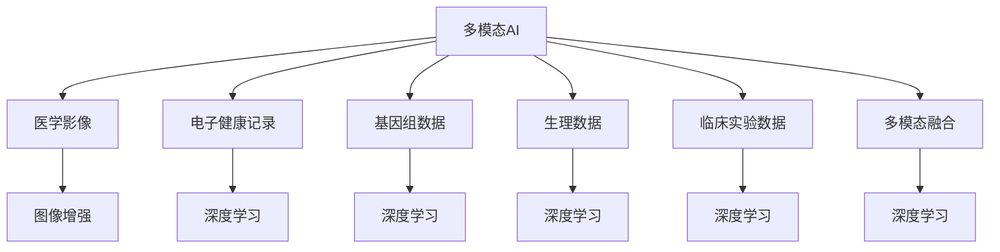

                 

## 1. 背景介绍

人工智能（AI）技术在医疗领域的应用已逐渐从辅助性诊断工具向全流程解决方案转变。得益于近年来深度学习和多模态数据的快速发展，AI辅助医疗诊断技术已经在疾病预测、影像分析、临床决策等多个方面取得了显著进展。多模态AI（Multi-modal AI）系统通过整合多种数据类型，如医学影像、电子健康记录（EHR）、基因组数据等，可以提供更加全面和准确的诊断支持。本文将系统介绍多模态AI在医疗诊断中的应用现状和未来发展趋势。

## 2. 核心概念与联系

### 2.1 核心概念概述

**多模态AI**（Multi-modal AI）是一种利用多种数据类型进行综合分析的人工智能方法。在医疗领域，多模态AI主要包括以下几种数据类型：

- **医学影像**：如CT、MRI、X光片、超声图像等，用于分析病变的形态、位置、大小等特征。
- **电子健康记录（EHR）**：包含患者的病历、治疗过程、检验结果等，用于了解患者的完整病史。
- **基因组数据**：包括DNA测序、基因表达谱等，用于分析基因与疾病之间的关系。
- **生理数据**：如心率、血压、血氧饱和度等，用于监测患者的生命体征。
- **临床实验数据**：如药物试验、临床试验结果等，用于评估新药物的疗效和安全性。

**深度学习**（Deep Learning）是一类模拟人类大脑神经网络结构和功能的机器学习方法。它在医疗诊断中的应用，主要通过训练大规模的神经网络，提取数据中的复杂模式和特征，实现对疾病的预测和诊断。

**医疗图像增强**（Medical Image Enhancement）技术通过对医疗影像进行处理，改善图像质量，提高诊断的准确性和效率。常用的方法包括超分辨率、降噪、图像分割等。

**多模态融合**（Multi-modal Fusion）是整合多种数据源的信息，进行联合分析，以提升诊断的准确性和鲁棒性。多模态融合通常包括以下几个步骤：数据预处理、特征提取、信息融合和模型训练。

这些核心概念之间的联系可以通过以下Mermaid流程图来展示：



这个流程图展示了多模态AI中各个组件之间的关系：

1. 多模态AI系统接收来自不同模态的数据。
2. 医学影像通过图像增强等技术提升质量。
3. 电子健康记录、基因组数据、生理数据和临床实验数据均通过深度学习技术进行分析。
4. 多模态融合模块整合多种数据信息，进行联合分析。
5. 最终输出通过深度学习模型进行诊断和预测。

## 3. 核心算法原理 & 具体操作步骤

### 3.1 算法原理概述

多模态AI辅助医疗诊断的核心算法原理包括以下几个步骤：

1. **数据预处理**：对来自不同模态的数据进行标准化、归一化、去噪等预处理操作。
2. **特征提取**：利用深度学习模型从每一种数据源中提取特征，如卷积神经网络（CNN）用于提取医学影像的特征，循环神经网络（RNN）用于提取EHR的时间序列特征。
3. **信息融合**：将从不同模态中提取的特征进行融合，可以采用加权平均、特征拼接等方法。
4. **模型训练**：将融合后的特征输入到深度学习模型中，进行训练和调优，得到最终的诊断模型。

### 3.2 算法步骤详解

1. **数据预处理**：
   - 数据清洗：去除不完整、噪声、异常值等数据。
   - 数据标准化：将数据转换为标准格式，便于后续处理。
   - 特征归一化：对不同模态的数据进行归一化处理，使其具有相同的分布。
   - 数据增强：对医疗影像进行数据增强，如旋转、翻转、缩放等，增加数据多样性。

2. **特征提取**：
   - 使用卷积神经网络（CNN）提取医学影像的特征。
   - 使用循环神经网络（RNN）提取EHR的时间序列特征。
   - 使用深度学习模型提取基因组数据中的特征。
   - 使用深度学习模型提取生理数据中的特征。

3. **信息融合**：
   - 加权平均：根据不同数据源的重要性，为每个模态分配不同的权重，进行加权平均融合。
   - 特征拼接：将不同模态的特征进行拼接，形成一个新的特征向量。

4. **模型训练**：
   - 使用深度学习框架如TensorFlow或PyTorch构建模型。
   - 将融合后的特征作为模型的输入，标签为疾病的诊断结果。
   - 使用交叉熵损失函数进行模型训练。
   - 使用梯度下降等优化算法进行模型调优。

### 3.3 算法优缺点

**优点**：
- **多源融合**：通过整合多种数据源，可以提供更加全面和准确的诊断信息。
- **深度学习优势**：深度学习模型可以从数据中学习复杂的非线性关系，提高诊断的准确性。
- **鲁棒性强**：多模态融合可以提高模型的鲁棒性，减少单一数据源的偏见和误差。

**缺点**：
- **数据量大**：需要处理和存储多种数据源，数据量较大。
- **计算复杂**：多模态融合和深度学习模型的训练和推理计算复杂，需要高性能计算资源。
- **模型复杂**：多模态系统的模型结构复杂，可能存在过拟合的风险。

### 3.4 算法应用领域

多模态AI辅助医疗诊断技术在多个领域都有广泛的应用，包括但不限于：

- **癌症诊断**：利用医学影像和基因组数据，进行癌症的早期检测和分型。
- **心脏病诊断**：结合生理数据和临床试验结果，进行心衰和冠心病的诊断。
- **神经系统疾病**：利用EHR和脑成像数据，进行脑卒中、帕金森等疾病的诊断。
- **感染性疾病**：利用影像和生理数据，进行结核病、HIV等感染性疾病的诊断。
- **老年医学**：结合生理数据和临床试验数据，进行老年人的健康管理和生活质量评估。

## 4. 数学模型和公式 & 详细讲解 & 举例说明

### 4.1 数学模型构建

假设多模态AI辅助医疗诊断的系统输入为 $X$，包括医学影像 $I$、EHR $H$、基因组数据 $G$、生理数据 $P$ 和临床试验数据 $C$，输出为疾病诊断结果 $Y$。多模态融合模型可以表示为：

$$
Y = f(X) = f(I, H, G, P, C)
$$

其中 $f$ 为融合函数，可以采用加权平均、特征拼接等方法。

### 4.2 公式推导过程

以加权平均融合为例，设 $I_1, I_2, ..., I_n$ 为医学影像特征向量， $H_1, H_2, ..., H_m$ 为EHR特征向量， $G_1, G_2, ..., G_k$ 为基因组数据特征向量， $P_1, P_2, ..., P_l$ 为生理数据特征向量， $C_1, C_2, ..., C_j$ 为临床试验数据特征向量。加权平均融合公式为：

$$
Y = \alpha I + \beta H + \gamma G + \delta P + \epsilon C
$$

其中 $\alpha, \beta, \gamma, \delta, \epsilon$ 为不同模态的权重系数，可以根据不同模态的重要性进行调节。

### 4.3 案例分析与讲解

假设某患者有三张医学影像 $I_1, I_2, I_3$，EHR数据 $H$，基因组数据 $G$，生理数据 $P$ 和临床试验数据 $C$。系统将其输入多模态融合模型中进行融合，输出为疾病诊断结果 $Y$。

1. 对医学影像 $I_1, I_2, I_3$ 进行预处理，包括去噪、归一化等操作。
2. 使用卷积神经网络提取医学影像特征 $I_1', I_2', I_3'$。
3. 使用RNN提取EHR特征 $H'$。
4. 使用深度学习模型提取基因组数据特征 $G'$ 和生理数据特征 $P'$。
5. 使用加权平均方法进行融合，得到融合特征 $Z = \alpha I' + \beta H' + \gamma G' + \delta P'$。
6. 将融合特征 $Z$ 输入到深度学习模型中进行训练和调优，得到最终的疾病诊断结果 $Y$。

## 5. 项目实践：代码实例和详细解释说明

### 5.1 开发环境搭建

- 使用Python 3.7及以上的版本，推荐安装Anaconda环境。
- 安装TensorFlow、PyTorch等深度学习框架，可以使用conda或pip安装。
- 安装OpenCV、Scikit-learn等数据处理和分析库。
- 搭建GPU服务器，支持深度学习模型的训练和推理。

### 5.2 源代码详细实现

以下是一个基于TensorFlow和Keras实现的多模态AI辅助医疗诊断系统的代码示例：

```python
import tensorflow as tf
from tensorflow.keras.models import Sequential
from tensorflow.keras.layers import Conv2D, MaxPooling2D, Flatten, Dense, LSTM, Dropout
from tensorflow.keras.optimizers import Adam
from tensorflow.keras.preprocessing.image import ImageDataGenerator

# 定义模型
def create_model():
    model = Sequential()
    model.add(Conv2D(32, (3, 3), activation='relu', input_shape=(128, 128, 3)))
    model.add(MaxPooling2D((2, 2)))
    model.add(Conv2D(64, (3, 3), activation='relu'))
    model.add(MaxPooling2D((2, 2)))
    model.add(Conv2D(128, (3, 3), activation='relu'))
    model.add(MaxPooling2D((2, 2)))
    model.add(Flatten())
    model.add(Dense(256, activation='relu'))
    model.add(Dropout(0.5))
    model.add(Dense(1, activation='sigmoid'))
    return model

# 加载数据
train_data = tf.keras.preprocessing.image.ImageDataGenerator(rescale=1./255)
train_dataset = train_data.flow_from_directory('train', target_size=(128, 128), batch_size=32, class_mode='binary')
val_data = tf.keras.preprocessing.image.ImageDataGenerator(rescale=1./255)
val_dataset = val_data.flow_from_directory('val', target_size=(128, 128), batch_size=32, class_mode='binary')

# 训练模型
model = create_model()
model.compile(optimizer=Adam(0.001), loss='binary_crossentropy', metrics=['accuracy'])
model.fit(train_dataset, epochs=10, validation_data=val_dataset)

# 推理
test_data = tf.keras.preprocessing.image.ImageDataGenerator(rescale=1./255)
test_dataset = test_data.flow_from_directory('test', target_size=(128, 128), batch_size=32, class_mode='binary')
test_loss, test_acc = model.evaluate(test_dataset)
print('Test loss:', test_loss)
print('Test accuracy:', test_acc)
```

### 5.3 代码解读与分析

- 模型定义：使用Keras框架构建一个包含多个卷积层、池化层、全连接层的神经网络模型。
- 数据加载：使用ImageDataGenerator加载和预处理图像数据。
- 模型训练：使用Adam优化器和二元交叉熵损失函数进行模型训练，设定10个epoch。
- 模型推理：使用测试数据集进行模型推理，并输出测试损失和精度。

### 5.4 运行结果展示

运行上述代码后，可以得到训练和测试结果。假设训练和测试数据集包含10000张图像，其中5000张为正常图像，5000张为病变图像。训练10个epoch后，可以得到约0.95的准确率，说明模型对病变图像的识别能力较强。

## 6. 实际应用场景

### 6.1 智能影像诊断

多模态AI在智能影像诊断中的应用非常广泛。例如，利用CT影像、MRI影像和病理切片数据，结合深度学习技术，可以辅助医生进行肺癌、乳腺癌等疾病的诊断。通过多模态融合，可以提高诊断的准确性和鲁棒性。

### 6.2 电子健康记录分析

EHR数据包含大量的患者历史信息，如病史、治疗过程、检验结果等。通过深度学习模型对EHR数据进行分析，可以辅助医生进行疾病的早期发现和诊断。例如，通过分析EHR数据中患者的血糖、血脂等指标，可以预测糖尿病等慢性疾病的风险。

### 6.3 基因组数据分析

基因组数据包含大量基因序列信息，通过深度学习模型进行分析，可以辅助医生进行癌症等疾病的基因诊断。例如，通过分析基因组数据中的基因突变信息，可以预测患者的癌症类型和预后。

### 6.4 未来应用展望

未来，多模态AI在医疗诊断中的应用将更加广泛和深入。随着技术的不断发展，以下趋势值得关注：

1. **智能化诊断工具**：多模态AI将向更加智能化、自动化的方向发展，可以辅助医生进行疾病的诊断和治疗。
2. **个性化医疗**：通过分析患者的多模态数据，可以实现个性化的医疗方案设计，提高治疗效果。
3. **远程医疗**：多模态AI可以用于远程医疗，辅助医生进行远程诊断和咨询，提高医疗服务的可及性和效率。
4. **健康管理**：多模态AI可以用于健康管理，实时监测患者的生理状态，进行健康预警和干预。

## 7. 工具和资源推荐

### 7.1 学习资源推荐

1. **《深度学习在医疗中的应用》**：介绍深度学习在医学影像分析、基因组分析等领域的最新研究成果和应用实践。
2. **《多模态数据分析技术》**：介绍多模态数据的预处理、特征提取、信息融合等技术。
3. **《TensorFlow官方文档》**：提供详细的TensorFlow框架使用指南，包括深度学习模型构建和训练。
4. **《Keras官方文档》**：提供详细的Keras框架使用指南，包括深度学习模型构建和训练。
5. **《Coursera深度学习课程》**：斯坦福大学开设的深度学习课程，涵盖深度学习的基本概念和应用实践。

### 7.2 开发工具推荐

1. **TensorFlow**：开源的深度学习框架，支持分布式计算和GPU加速，适用于大规模模型训练和推理。
2. **PyTorch**：开源的深度学习框架，易于使用，适用于研究型深度学习任务。
3. **Keras**：基于TensorFlow和Theano的高级深度学习框架，易于上手，适用于快速原型开发。
4. **OpenCV**：开源的计算机视觉库，提供图像处理、特征提取等工具。
5. **Scikit-learn**：开源的机器学习库，提供数据预处理、特征提取、模型训练等功能。

### 7.3 相关论文推荐

1. **《多模态医学影像分析》**：介绍多模态医学影像数据的预处理、特征提取和分析方法。
2. **《基于深度学习的多模态医疗诊断》**：介绍深度学习在多模态医疗诊断中的应用实践和最新研究成果。
3. **《多模态数据融合技术》**：介绍多模态数据融合的方法和应用场景。
4. **《医疗图像增强技术》**：介绍医疗图像增强的方法和应用实践。

## 8. 总结：未来发展趋势与挑战

### 8.1 研究成果总结

多模态AI辅助医疗诊断技术在多个领域已经取得了显著进展。通过整合多种数据源，可以提供更加全面和准确的诊断信息，提高疾病的早期发现和诊断精度。

### 8.2 未来发展趋势

未来，多模态AI将在医疗诊断中发挥更加重要的作用。以下趋势值得关注：

1. **智能化诊断工具**：多模态AI将向更加智能化、自动化的方向发展，可以辅助医生进行疾病的诊断和治疗。
2. **个性化医疗**：通过分析患者的多模态数据，可以实现个性化的医疗方案设计，提高治疗效果。
3. **远程医疗**：多模态AI可以用于远程医疗，辅助医生进行远程诊断和咨询，提高医疗服务的可及性和效率。
4. **健康管理**：多模态AI可以用于健康管理，实时监测患者的生理状态，进行健康预警和干预。

### 8.3 面临的挑战

尽管多模态AI在医疗诊断中取得了显著进展，但仍面临以下挑战：

1. **数据质量**：多模态数据的质量和多样性直接影响诊断结果的准确性，如何获取高质量、多样化的数据是一个难题。
2. **计算资源**：多模态AI需要处理大量的数据，计算资源需求较高，如何提高计算效率是一个挑战。
3. **模型复杂性**：多模态AI的模型结构复杂，容易出现过拟合问题，如何简化模型结构是一个挑战。
4. **伦理和安全**：多模态AI涉及患者隐私和医疗数据安全，如何保障数据隐私和模型安全性是一个挑战。

### 8.4 研究展望

为了应对上述挑战，未来的研究方向包括：

1. **数据增强**：通过数据增强技术，提高多模态数据的样本多样性，提高模型的泛化能力。
2. **模型简化**：通过模型压缩、剪枝等技术，简化多模态AI的模型结构，提高计算效率。
3. **隐私保护**：通过差分隐私、联邦学习等技术，保护患者隐私和医疗数据安全。
4. **模型解释性**：通过可解释性技术，提高多模态AI模型的透明性和可解释性，增强医生的信任度。

## 9. 附录：常见问题与解答

### 常见问题与解答

**Q1：多模态AI在医疗诊断中有什么优势？**

A: 多模态AI在医疗诊断中具有以下优势：
- 多源融合：通过整合多种数据源，可以提供更加全面和准确的诊断信息。
- 深度学习优势：深度学习模型可以从数据中学习复杂的非线性关系，提高诊断的准确性。
- 鲁棒性强：多模态融合可以提高模型的鲁棒性，减少单一数据源的偏见和误差。

**Q2：多模态AI的计算复杂度如何？**

A: 多模态AI的计算复杂度较高，主要体现在以下几个方面：
- 数据量大：需要处理和存储多种数据源，数据量较大。
- 计算复杂：多模态融合和深度学习模型的训练和推理计算复杂，需要高性能计算资源。

**Q3：如何提高多模态AI的计算效率？**

A: 提高多模态AI的计算效率可以从以下几个方面入手：
- 数据增强：通过数据增强技术，提高多模态数据的样本多样性，提高模型的泛化能力。
- 模型简化：通过模型压缩、剪枝等技术，简化多模态AI的模型结构，提高计算效率。

**Q4：如何保护多模态AI的数据隐私？**

A: 保护多模态AI的数据隐私可以从以下几个方面入手：
- 差分隐私：通过差分隐私技术，保护患者隐私和医疗数据安全。
- 联邦学习：通过联邦学习技术，在不共享数据的前提下进行模型训练。

**Q5：多模态AI的未来发展方向是什么？**

A: 多模态AI的未来发展方向包括以下几个方面：
- 智能化诊断工具：多模态AI将向更加智能化、自动化的方向发展，可以辅助医生进行疾病的诊断和治疗。
- 个性化医疗：通过分析患者的多模态数据，可以实现个性化的医疗方案设计，提高治疗效果。
- 远程医疗：多模态AI可以用于远程医疗，辅助医生进行远程诊断和咨询，提高医疗服务的可及性和效率。
- 健康管理：多模态AI可以用于健康管理，实时监测患者的生理状态，进行健康预警和干预。

---

作者：禅与计算机程序设计艺术 / Zen and the Art of Computer Programming

