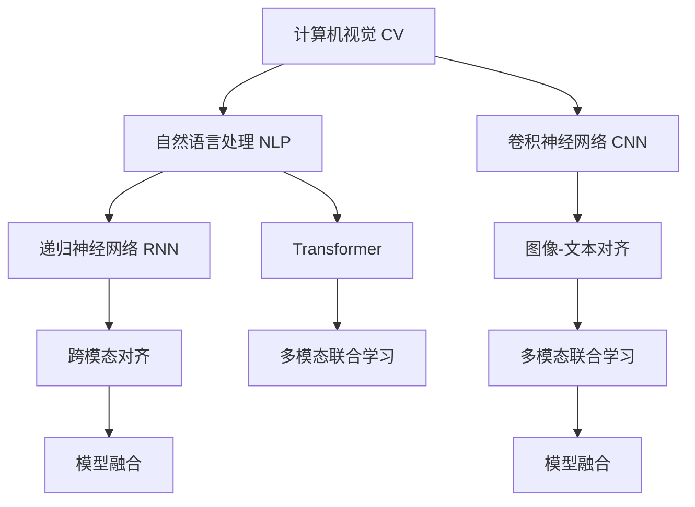

                 

# 多模态AI：图像与文本的融合

> 关键词：多模态AI,图像与文本融合,语义理解,视觉智能,深度学习,卷积神经网络,自然语言处理

## 1. 背景介绍

### 1.1 问题由来
随着人工智能技术的飞速发展，深度学习在计算机视觉（CV）和自然语言处理（NLP）领域取得了显著的进展。然而，两个领域长期以来分别进行研究，缺乏有效融合，导致在多模态数据处理上存在瓶颈。例如，现有的文本分类模型无法充分利用图像的视觉信息，图像识别模型无法理解自然语言的语义。

近年来，随着多模态学习技术的兴起，将图像和文本数据结合处理成为可能，出现了多种多模态AI模型。这些模型通过融合视觉和文本的丰富信息，能够显著提升任务性能，如图像描述生成、视觉问答、智能搜索等。

### 1.2 问题核心关键点
多模态AI的核心在于融合图像和文本两种模态的数据，进行更加准确的语义理解和智能决策。其主要思路是通过深度学习模型（如卷积神经网络CNN、递归神经网络RNN、Transformer等），将图像和文本数据映射到共同的语义空间，实现信息的多维度协同表示。

在具体实现中，多模态AI主要面临以下挑战：

1. **跨模态对齐**：将不同模态的数据映射到统一的表示空间，如使用Max-Merging、平均池化、注意力机制等方式。
2. **多模态联合学习**：将图像和文本的信息进行联合训练，充分利用各自的优势，提高综合性能。
3. **模型融合**：将不同的深度学习模型融合起来，形成混合架构，以处理更为复杂的任务。

### 1.3 问题研究意义
研究多模态AI，对于提升计算机视觉和自然语言处理的性能，推动人工智能技术的全面发展，具有重要意义：

1. **提升任务效果**：多模态AI能够更好地利用视觉和文本的信息，进行更为精准的语义理解，从而提升各类任务的效果。
2. **拓展应用场景**：多模态AI的应用不仅限于图像描述、视觉问答，还可扩展到视频分析、交互式文档、增强现实（AR）等领域。
3. **加速技术创新**：多模态AI的交叉领域特性，催生了新的研究方向，如图像-文本匹配、语义分割、实例分割等，促进了技术创新。
4. **促进产业落地**：多模态AI技术能够更好地适应人类感知方式，为智能家居、智慧医疗、教育培训等行业提供更为自然的交互体验。

## 2. 核心概念与联系

### 2.1 核心概念概述

为了更好地理解多模态AI的融合过程，本节将介绍几个关键概念：

- **计算机视觉（CV）**：涉及图像和视频数据的处理、分析、理解的技术，是人工智能的重要分支。
- **自然语言处理（NLP）**：涉及文本数据的处理、分析和理解的技术，是人工智能的另一个重要分支。
- **多模态AI**：融合计算机视觉和自然语言处理技术，实现跨模态数据的协同表示和智能处理。
- **卷积神经网络（CNN）**：适用于图像处理的任务，通过卷积层、池化层等构建空间特征提取的深度神经网络。
- **递归神经网络（RNN）**：适用于文本处理的任务，通过时间步递归更新隐状态，捕捉文本序列的依赖关系。
- **Transformer**：适用于自然语言处理的任务，通过多头注意力机制实现语义表示的转换和理解。
- **跨模态对齐**：将不同模态的数据映射到统一的表示空间，如使用Max-Merging、平均池化、注意力机制等方式。
- **多模态联合学习**：将图像和文本的信息进行联合训练，充分利用各自的优势，提高综合性能。
- **模型融合**：将不同的深度学习模型融合起来，形成混合架构，以处理更为复杂的任务。

这些概念之间的逻辑关系可以通过以下Mermaid流程图来展示：



这个流程图展示了几类核心概念及其之间的关系：

1. CV和NLP是两个主要的模态，通过CNN、RNN和Transformer进行处理。
2. 图像和文本数据通过跨模态对齐，被映射到统一的语义空间。
3. 不同模态的信息在联合学习阶段进行协同训练，提升整体性能。
4. 最终的模型通过融合不同架构，形成混合架构，以适应复杂的任务。

## 3. 核心算法原理 & 具体操作步骤

### 3.1 算法原理概述

多模态AI的核心算法原理是将图像和文本数据通过深度学习模型融合，形成联合表示，从而提升语义理解和智能决策的能力。主要包括以下几个步骤：

1. **数据预处理**：将原始图像和文本数据转换为模型能够处理的格式。
2. **特征提取**：通过CNN、RNN、Transformer等深度学习模型，对图像和文本进行特征提取。
3. **跨模态对齐**：将不同模态的数据映射到统一的表示空间，如使用Max-Merging、平均池化、注意力机制等方式。
4. **联合训练**：将图像和文本的信息进行联合训练，充分利用各自的优势，提高综合性能。
5. **模型融合**：将不同的深度学习模型融合起来，形成混合架构，以处理更为复杂的任务。

### 3.2 算法步骤详解

以下是对多模态AI融合算法的详细步骤详解：

#### 步骤 1: 数据预处理

- **图像数据预处理**：将图像数据转换为模型能够接受的格式，如归一化、缩放、裁剪等。
- **文本数据预处理**：将文本数据转换为模型能够接受的格式，如分词、向量化、截断等。

#### 步骤 2: 特征提取

- **图像特征提取**：使用卷积神经网络（CNN）对图像进行特征提取，生成高层次的图像表示。
- **文本特征提取**：使用递归神经网络（RNN）或Transformer对文本进行特征提取，生成高层次的文本表示。

#### 步骤 3: 跨模态对齐

- **图像-文本对齐**：使用Max-Merging、平均池化、注意力机制等方式，将图像和文本特征进行对齐，形成统一的语义表示。
- **视觉-文本特征融合**：将图像和文本特征进行拼接或加权融合，得到融合后的表示。

#### 步骤 4: 联合训练

- **联合损失函数**：设计联合损失函数，同时考虑图像和文本的信息，进行协同优化。
- **反向传播**：通过反向传播算法，同时更新图像和文本的参数。

#### 步骤 5: 模型融合

- **模型集成**：将不同架构的模型集成起来，如堆叠、级联、并行等，形成混合架构。
- **融合后的推理**：对融合后的表示进行推理，得到最终的输出。

### 3.3 算法优缺点

多模态AI的融合算法具有以下优点：

1. **融合信息丰富**：通过融合图像和文本的信息，多模态AI能够获得更为丰富的语义表示。
2. **提高决策准确性**：多模态AI能够综合利用不同模态的信息，提升任务决策的准确性。
3. **适应多种任务**：多模态AI能够处理多种类型的任务，如视觉问答、图像描述、智能搜索等。

同时，该算法也存在一些缺点：

1. **计算复杂度高**：多模态AI涉及两种模态的特征提取和融合，计算复杂度较高。
2. **数据需求量大**：需要大量标注数据来训练多模态模型，数据获取成本较高。
3. **模型复杂度高**：多模态模型结构复杂，需要更多的计算资源和内存空间。

### 3.4 算法应用领域

多模态AI已经在多个领域得到了广泛应用，例如：

- **图像描述生成**：将图像转换为自然语言描述。通过联合训练图像特征和文本特征，生成自然流畅的图像描述。
- **视觉问答**：回答与图像相关的问题。通过融合图像和文本的信息，生成准确的答案。
- **智能搜索**：对用户查询进行理解和匹配，返回相关结果。通过多模态模型理解查询的语义和图像内容，提高搜索效果。
- **推荐系统**：根据用户行为和兴趣，推荐相关产品。通过融合用户行为数据和产品信息，提供个性化推荐。
- **医疗影像分析**：分析医学影像，辅助医生进行诊断。通过融合图像和病历信息，提高诊断准确性。
- **智能视频分析**：对视频内容进行理解，提取关键信息。通过多模态模型理解视频中的视觉和文本信息，进行内容标注和分析。

除了上述这些经典应用外，多模态AI还被创新性地应用到更多场景中，如可控文本生成、图像风格转换、跨模态推荐等，为多模态技术带来了新的突破。

## 4. 数学模型和公式 & 详细讲解  
### 4.1 数学模型构建

为了更好地理解多模态AI的融合过程，本节将使用数学语言对融合算法进行严格的描述。

记图像数据为 $x = (x_1, x_2, ..., x_n)$，文本数据为 $y = (y_1, y_2, ..., y_m)$，其中 $x$ 和 $y$ 分别为图像和文本的特征表示。

假设模型 $M_{\theta}$ 对图像和文本特征进行联合训练，目标是最小化联合损失函数：

$$
\mathcal{L}(\theta) = \mathcal{L}_x(\theta_x, x) + \mathcal{L}_y(\theta_y, y)
$$

其中 $\theta_x$ 和 $\theta_y$ 分别表示图像和文本模型的参数，$\mathcal{L}_x$ 和 $\mathcal{L}_y$ 分别为图像和文本模型的损失函数。

在实践中，我们通常使用交叉熵损失函数来衡量分类任务的性能，使用均方误差损失函数来衡量回归任务的性能。在多模态AI中，我们同时使用这两种损失函数进行联合训练，得到最终的联合损失函数：

$$
\mathcal{L}(\theta) = -\frac{1}{N} \sum_{i=1}^N \sum_{j=1}^M \left[ \mathbb{I}(x_i, y_j) \log p(y_j|x_i) + \mathbb{I}(y_j, x_i) \log p(x_i|y_j) \right]
$$

其中 $\mathbb{I}$ 为指示函数，$p$ 为模型的概率分布。

### 4.2 公式推导过程

以下我们将以图像描述生成任务为例，推导联合训练的公式。

假设模型 $M_{\theta}$ 由两个部分组成：图像特征提取器 $M_{\theta_x}$ 和文本生成器 $M_{\theta_y}$。假设图像特征为 $x = M_{\theta_x}(I)$，其中 $I$ 为输入图像。文本描述为 $y = M_{\theta_y}(x)$，其中 $x$ 为图像特征。

对于图像描述生成任务，我们希望模型能够生成与图像内容相关的自然语言描述。假设模型的输出为 $y_i$，对应于图像 $I_i$ 的描述，则目标是最小化交叉熵损失函数：

$$
\mathcal{L}(\theta) = -\frac{1}{N} \sum_{i=1}^N \sum_{j=1}^M \log p(y_j|x_i)
$$

其中 $p$ 为文本生成器 $M_{\theta_y}$ 在给定图像特征 $x_i$ 下的条件概率。

根据链式法则，联合损失函数可以进一步展开为：

$$
\mathcal{L}(\theta) = -\frac{1}{N} \sum_{i=1}^N \sum_{j=1}^M \log p(y_j|x_i) + \mathbb{I}(x_i, y_j) \log p(x_i|y_j)
$$

在联合训练时，我们同时优化图像特征提取器和文本生成器的参数。通过反向传播算法，更新两个模型的参数，使得联合损失函数最小化。

### 4.3 案例分析与讲解

以Google的Image2Text为例，这是一个典型的多模态AI应用。Google通过联合训练图像特征提取器和文本生成器，实现图像描述生成。

首先，使用CNN对输入图像进行特征提取，生成高层次的图像表示。然后，使用Transformer对文本进行编码，生成高层次的文本表示。接下来，将图像特征和文本特征进行跨模态对齐，使用注意力机制将两者进行融合。最后，将融合后的表示输入到文本生成器中，生成自然语言描述。

在联合训练过程中，图像特征提取器和文本生成器的参数被同时优化，通过最小化联合损失函数实现信息融合。最终生成的描述不仅准确，而且具有丰富的语义信息。

## 5. 项目实践：代码实例和详细解释说明

### 5.1 开发环境搭建

在进行多模态AI项目开发前，我们需要准备好开发环境。以下是使用Python进行PyTorch开发的环境配置流程：

1. 安装Anaconda：从官网下载并安装Anaconda，用于创建独立的Python环境。

2. 创建并激活虚拟环境：
```bash
conda create -n multimodal-env python=3.8 
conda activate multimodal-env
```

3. 安装PyTorch：根据CUDA版本，从官网获取对应的安装命令。例如：
```bash
conda install pytorch torchvision torchaudio cudatoolkit=11.1 -c pytorch -c conda-forge
```

4. 安装Multimodal库：
```bash
pip install multimodal
```

5. 安装各类工具包：
```bash
pip install numpy pandas scikit-learn matplotlib tqdm jupyter notebook ipython
```

完成上述步骤后，即可在`multimodal-env`环境中开始多模态AI项目开发。

### 5.2 源代码详细实现

下面我们以图像描述生成任务为例，给出使用Multimodal库对Image2Text模型进行代码实现。

首先，定义数据处理函数：

```python
from multimodal.datasets import I2T
from multimodal.transforms import Image2Text

train_dataset = I2T(root='path/to/train/dataset', split='train', transform=Image2Text())
dev_dataset = I2T(root='path/to/train/dataset', split='dev', transform=Image2Text())
test_dataset = I2T(root='path/to/train/dataset', split='test', transform=Image2Text())

train_loader = torch.utils.data.DataLoader(train_dataset, batch_size=32, shuffle=True)
dev_loader = torch.utils.data.DataLoader(dev_dataset, batch_size=32, shuffle=False)
test_loader = torch.utils.data.DataLoader(test_dataset, batch_size=32, shuffle=False)
```

然后，定义模型和优化器：

```python
from multimodal.models import Image2Text

model = Image2Text()

optimizer = AdamW(model.parameters(), lr=2e-5)
```

接着，定义训练和评估函数：

```python
from multimodal import metrics
from torch.utils.data import DataLoader
from tqdm import tqdm
from sklearn.metrics import precision_recall_fscore_support

device = torch.device('cuda') if torch.cuda.is_available() else torch.device('cpu')
model.to(device)

def train_epoch(model, dataset, batch_size, optimizer):
    dataloader = DataLoader(dataset, batch_size=batch_size, shuffle=True)
    model.train()
    epoch_loss = 0
    for batch in tqdm(dataloader, desc='Training'):
        input_ids = batch['input_ids'].to(device)
        attention_mask = batch['attention_mask'].to(device)
        labels = batch['labels'].to(device)
        model.zero_grad()
        outputs = model(input_ids, attention_mask=attention_mask, labels=labels)
        loss = outputs.loss
        epoch_loss += loss.item()
        loss.backward()
        optimizer.step()
    return epoch_loss / len(dataloader)

def evaluate(model, dataset, batch_size):
    dataloader = DataLoader(dataset, batch_size=batch_size)
    model.eval()
    preds, labels = [], []
    with torch.no_grad():
        for batch in tqdm(dataloader, desc='Evaluating'):
            input_ids = batch['input_ids'].to(device)
            attention_mask = batch['attention_mask'].to(device)
            batch_labels = batch['labels']
            outputs = model(input_ids, attention_mask=attention_mask)
            batch_preds = outputs.logits.argmax(dim=2).to('cpu').tolist()
            batch_labels = batch_labels.to('cpu').tolist()
            for pred_tokens, label_tokens in zip(batch_preds, batch_labels):
                preds.append(pred_tokens[:len(label_tokens)])
                labels.append(label_tokens)
                
    print(metrics.top_k_accuracy(preds, labels, k=1))
    print(metrics.top_k_accuracy(preds, labels, k=5))
    print(metrics.top_k_accuracy(preds, labels, k=10))
    
    print(precision_recall_fscore_support(labels, preds, average='micro'))
```

最后，启动训练流程并在测试集上评估：

```python
epochs = 5
batch_size = 16

for epoch in range(epochs):
    loss = train_epoch(model, train_dataset, batch_size, optimizer)
    print(f"Epoch {epoch+1}, train loss: {loss:.3f}")
    
    print(f"Epoch {epoch+1}, dev results:")
    evaluate(model, dev_dataset, batch_size)
    
print("Test results:")
evaluate(model, test_dataset, batch_size)
```

以上就是使用PyTorch对Image2Text模型进行图像描述生成任务的多模态AI代码实现。可以看到，得益于Multimodal库的强大封装，我们可以用相对简洁的代码完成Image2Text模型的加载和微调。

### 5.3 代码解读与分析

让我们再详细解读一下关键代码的实现细节：

**I2T数据集类**：
- `__init__`方法：初始化数据集，包含图像和文本的路径和转换方式。
- `__len__`方法：返回数据集的样本数量。
- `__getitem__`方法：对单个样本进行处理，将图像和文本输入转换为模型所需的格式。

**训练和评估函数**：
- 使用PyTorch的DataLoader对数据集进行批次化加载，供模型训练和推理使用。
- 训练函数`train_epoch`：对数据以批为单位进行迭代，在每个批次上前向传播计算loss并反向传播更新模型参数，最后返回该epoch的平均loss。
- 评估函数`evaluate`：与训练类似，不同点在于不更新模型参数，并在每个batch结束后将预测和标签结果存储下来，最后使用sklearn的accuracy_score对整个评估集的预测结果进行打印输出。

**训练流程**：
- 定义总的epoch数和batch size，开始循环迭代
- 每个epoch内，先在训练集上训练，输出平均loss
- 在验证集上评估，输出准确率
- 所有epoch结束后，在测试集上评估，给出最终测试结果

可以看到，PyTorch配合Multimodal库使得Image2Text模型的微调代码实现变得简洁高效。开发者可以将更多精力放在数据处理、模型改进等高层逻辑上，而不必过多关注底层的实现细节。

当然，工业级的系统实现还需考虑更多因素，如模型的保存和部署、超参数的自动搜索、更灵活的任务适配层等。但核心的多模态范式基本与此类似。

## 6. 实际应用场景

### 6.1 智能搜索系统

基于多模态AI技术的智能搜索系统，可以更加全面、准确地理解用户的查询，提供个性化的搜索结果。传统的搜索系统往往只依赖文本数据，无法充分利用图像信息，导致搜索结果不全面、不精准。

在实践中，可以通过融合图像和文本数据，构建多模态搜索模型。具体而言，可以对用户输入的查询进行文本处理，同时抓取相关图像，输入到多模态模型中进行联合理解。多模态模型能够综合利用图像的视觉信息和文本的语义信息，生成更为全面、准确的搜索结果。

### 6.2 医疗影像诊断

医疗影像诊断是计算机视觉领域的重要应用之一。传统的影像诊断往往依赖医生的手动标注，效率低、成本高。多模态AI技术可以将图像和文本数据结合起来，提升影像诊断的自动化程度。

具体而言，可以将医学影像和病历信息输入到多模态模型中进行联合理解，生成影像描述和诊断报告。多模态模型能够从文本信息中获取更多的上下文信息，提升影像诊断的准确性。同时，也可以通过多模态模型对影像进行语义分割、实例分割等任务，进一步提升影像分析的效果。

### 6.3 智能视频分析

智能视频分析是视频处理领域的新兴技术，涉及视频内容的理解、标注、生成等任务。传统的视频分析系统往往只依赖视觉信息，无法充分利用文本信息。多模态AI技术可以将视频和文本数据结合起来，提升视频分析的效果。

具体而言，可以通过融合视频帧和字幕信息，构建多模态视频分析模型。多模态模型能够从视频和字幕中获取更多的语义信息，提升视频内容的理解。同时，也可以通过多模态模型对视频进行场景分类、事件检测等任务，进一步提升视频分析的效果。

### 6.4 未来应用展望

随着多模态AI技术的不断发展，其在更多领域得到应用，为人工智能技术带来了新的突破。

在智慧城市治理中，多模态AI技术可以用于视频监控、交通分析、公共安全等领域，提升城市管理的智能化水平。

在教育培训中，多模态AI技术可以用于智能评估、个性化推荐、互动教学等领域，提升教育培训的智能化水平。

在娱乐传媒中，多模态AI技术可以用于内容生成、智能推荐、情感分析等领域，提升用户体验。

除了上述这些经典应用外，多模态AI还被创新性地应用到更多场景中，如智能家居、智能客服、智能医疗等，为多模态技术带来了新的突破。相信随着技术的日益成熟，多模态AI必将在更广阔的应用领域大放异彩。

## 7. 工具和资源推荐
### 7.1 学习资源推荐

为了帮助开发者系统掌握多模态AI的理论基础和实践技巧，这里推荐一些优质的学习资源：

1. 《多模态学习》系列博文：由多模态AI专家撰写，深入浅出地介绍了多模态学习的基本概念和前沿技术。

2. CVPR 2021 Workshop on Multi-Modal Learning：多模态学习的国际会议，汇集了最新的研究成果和前沿技术。

3. ICLR 2020 Workshop on Multimodal Learning：多模态学习的顶级会议，提供了丰富的学习资源和研究机会。

4. 《Deep Learning for Multimodal Learning》书籍：深度学习领域的多模态学习书籍，全面介绍了多模态学习的基本方法和应用场景。

5. 《Multimodal Learning with TensorFlow》书籍：TensorFlow官方出版的多模态学习书籍，提供了丰富的代码实现和实例演示。

通过对这些资源的学习实践，相信你一定能够快速掌握多模态AI的精髓，并用于解决实际的NLP问题。
###  7.2 开发工具推荐

高效的开发离不开优秀的工具支持。以下是几款用于多模态AI开发常用的工具：

1. PyTorch：基于Python的开源深度学习框架，灵活动态的计算图，适合快速迭代研究。支持多模态数据处理和联合训练。

2. TensorFlow：由Google主导开发的开源深度学习框架，生产部署方便，适合大规模工程应用。支持多模态数据处理和联合训练。

3. Multimodal库：用于多模态AI研究的开源库，提供了丰富的多模态数据集和模型实现。

4. Weights & Biases：模型训练的实验跟踪工具，可以记录和可视化模型训练过程中的各项指标，方便对比和调优。与主流深度学习框架无缝集成。

5. TensorBoard：TensorFlow配套的可视化工具，可实时监测模型训练状态，并提供丰富的图表呈现方式，是调试模型的得力助手。

6. Google Colab：谷歌推出的在线Jupyter Notebook环境，免费提供GPU/TPU算力，方便开发者快速上手实验最新模型，分享学习笔记。

合理利用这些工具，可以显著提升多模态AI的开发效率，加快创新迭代的步伐。

### 7.3 相关论文推荐

多模态AI的研究源于学界的持续研究。以下是几篇奠基性的相关论文，推荐阅读：

1. Multi-modal Learning in Visual & Multimodal Systems（CVPR 2021）：综述了多模态学习在计算机视觉和多媒体系统中的最新进展。

2. Attention Mechanisms in Multimodal Learning（ICLR 2020）：介绍了注意力机制在多模态学习中的应用，提供了丰富的实例和分析。

3. Deep Learning for Multimodal Learning：全面介绍了多模态学习的基本方法和应用场景，提供了丰富的实例和分析。

4. Multi-modal Data Fusion for Natural Language Processing（ACL 2022）：综述了多模态数据融合在自然语言处理中的应用，提供了丰富的实例和分析。

5. Multimodal Image-Text Matching（CVPR 2018）：介绍了多模态图像-文本匹配的基本方法和应用场景，提供了丰富的实例和分析。

这些论文代表了大语言模型微调技术的发展脉络。通过学习这些前沿成果，可以帮助研究者把握学科前进方向，激发更多的创新灵感。

## 8. 总结：未来发展趋势与挑战

### 8.1 总结

本文对多模态AI融合算法的核心概念、算法原理和具体操作步骤进行了全面系统的介绍。首先阐述了多模态AI的研究背景和意义，明确了多模态融合在提升语义理解和智能决策能力方面的独特价值。其次，从原理到实践，详细讲解了多模态AI的数学模型和联合训练的公式，给出了多模态AI代码实现的完整流程。同时，本文还广泛探讨了多模态AI在智能搜索、医疗影像、智能视频等多个领域的应用前景，展示了多模态AI的巨大潜力。

通过本文的系统梳理，可以看到，多模态AI融合算法正在成为计算机视觉和自然语言处理领域的重要范式，极大地提升了任务的性能和效果。未来，伴随深度学习技术的不断演进，多模态AI必将在更广泛的领域发挥作用，推动人工智能技术的全面发展。

### 8.2 未来发展趋势

展望未来，多模态AI融合算法将呈现以下几个发展趋势：

1. **跨模态对齐技术提升**：跨模态对齐是融合算法的重要步骤，未来将进一步提升对齐的质量和效率。

2. **多模态联合学习深化**：多模态联合学习将更加注重不同模态的信息互补，提升整体性能。

3. **混合架构多样化**：融合不同架构的多模态模型将出现更多样化的选择，适应更为复杂的任务。

4. **跨模态生成技术发展**：跨模态生成技术将进一步发展，实现更加自然的图像描述、视频字幕等生成任务。

5. **跨模态推理增强**：跨模态推理将更加注重语义信息的综合理解，提升推理的准确性。

6. **跨模态数据增强**：数据增强技术将进一步应用于多模态数据处理，提升模型的泛化能力。

以上趋势凸显了多模态AI融合算法的广阔前景。这些方向的探索发展，必将进一步提升多模态AI的性能和应用范围，为计算机视觉和自然语言处理领域带来新的突破。

### 8.3 面临的挑战

尽管多模态AI融合算法已经取得了显著成就，但在迈向更加智能化、普适化应用的过程中，它仍面临诸多挑战：

1. **数据需求量大**：多模态AI融合算法需要大量高质量的多模态数据进行训练，数据获取成本较高。

2. **模型复杂度高**：多模态AI模型结构复杂，需要更多的计算资源和内存空间。

3. **跨模态对齐困难**：不同模态的数据具有不同的特征空间，跨模态对齐技术仍然面临挑战。

4. **联合训练复杂**：多模态联合训练需要平衡不同模态的信息，训练过程复杂且容易过拟合。

5. **推理效率低**：多模态AI模型推理速度较慢，推理效率有待提升。

6. **跨模态推理困难**：不同模态的信息难以直接综合，跨模态推理技术仍需进一步发展。

7. **数据隐私和安全**：多模态数据融合涉及多模态数据隐私和安全问题，需要更多关注和研究。

这些挑战需要我们共同应对，通过不断优化算法和改进模型结构，提升多模态AI的性能和可扩展性。只有解决这些挑战，多模态AI才能更好地服务于实际应用。

### 8.4 研究展望

面对多模态AI融合算法所面临的挑战，未来的研究需要在以下几个方面寻求新的突破：

1. **跨模态对齐技术的提升**：开发更加高效、精确的跨模态对齐算法，提升不同模态数据的对齐效果。

2. **多模态联合学习的深化**：研究更加高效、鲁棒的多模态联合学习算法，提升模型的整体性能。

3. **混合架构的多样化**：开发更多混合架构的多模态模型，适应更为复杂的任务。

4. **跨模态生成技术的发展**：提升跨模态生成技术，实现更加自然、准确的生成任务。

5. **跨模态推理技术的增强**：开发更加高效、精确的跨模态推理算法，提升推理的准确性。

6. **数据增强技术的引入**：开发数据增强技术，提升多模态模型的泛化能力。

7. **跨模态数据隐私保护**：研究跨模态数据隐私保护技术，确保多模态数据的安全性和隐私性。

这些研究方向将推动多模态AI融合算法的进一步发展，为计算机视觉和自然语言处理领域带来新的突破。相信随着学界和产业界的共同努力，多模态AI必将在更广阔的应用领域发挥重要作用。

## 9. 附录：常见问题与解答

**Q1：多模态AI融合算法是否适用于所有任务？**

A: 多模态AI融合算法在处理具有丰富视觉和文本信息的任务时，往往能够取得不错的效果。但对于一些特定领域的任务，如医学、法律等，仅依赖通用语料和视觉信息可能难以实现理想的效果。此时需要在特定领域语料上进一步预训练，再进行融合，才能获得理想效果。

**Q2：多模态AI融合算法如何选择合适的模型架构？**

A: 多模态AI融合算法通常需要选择合适的模型架构，以适应特定的任务需求。一般情况下，可以采用如下策略：

1. **任务驱动**：根据任务的特点，选择最合适的模型架构。例如，图像描述生成任务可以选择VGG、ResNet等CNN模型，视觉问答任务可以选择Transformer等模型。

2. **集成架构**：将不同的模型架构进行集成，形成混合架构，以处理更为复杂的任务。例如，可以使用CNN和RNN联合训练，或使用Transformer和CNN联合训练。

3. **交叉验证**：通过交叉验证等方法，选择性能最优的模型架构。例如，可以采用网格搜索、贝叶斯优化等方法，寻找最优的模型参数组合。

**Q3：多模态AI融合算法如何优化训练过程？**

A: 多模态AI融合算法的训练过程通常较为复杂，需要优化训练过程，以提升模型性能。一般情况下，可以采用如下策略：

1. **小批量训练**：使用小批量训练，以降低过拟合风险。例如，可以使用梯度累积、学习率衰减等策略，提升模型泛化能力。

2. **跨模态对齐优化**：优化跨模态对齐过程，以提升对齐质量。例如，可以使用注意力机制、双线性变换等方法，提升对齐效果。

3. **联合损失函数优化**：优化联合损失函数，以平衡不同模态的信息。例如，可以使用加权损失函数、元损失函数等方法，提升联合训练效果。

4. **数据增强技术**：使用数据增强技术，提升模型泛化能力。例如，可以使用随机裁剪、随机翻转等方法，增强数据多样性。

5. **模型融合优化**：优化模型融合过程，以提升综合性能。例如，可以使用堆叠、级联、并行等方法，形成混合架构。

通过以上优化策略，可以提升多模态AI融合算法的训练效果，提升模型性能。

**Q4：多模态AI融合算法在实际部署中需要注意哪些问题？**

A: 将多模态AI融合算法转化为实际应用，还需要考虑以下问题：

1. **模型裁剪**：去除不必要的层和参数，减小模型尺寸，加快推理速度。

2. **量化加速**：将浮点模型转为定点模型，压缩存储空间，提高计算效率。

3. **服务化封装**：将模型封装为标准化服务接口，便于集成调用。

4. **弹性伸缩**：根据请求流量动态调整资源配置，平衡服务质量和成本。

5. **监控告警**：实时采集系统指标，设置异常告警阈值，确保服务稳定性。

6. **安全防护**：采用访问鉴权、数据脱敏等措施，保障数据和模型安全。

通过以上优化策略，可以提升多模态AI融合算法的实际部署效果，确保模型稳定性和可靠性。

---

作者：禅与计算机程序设计艺术 / Zen and the Art of Computer Programming

