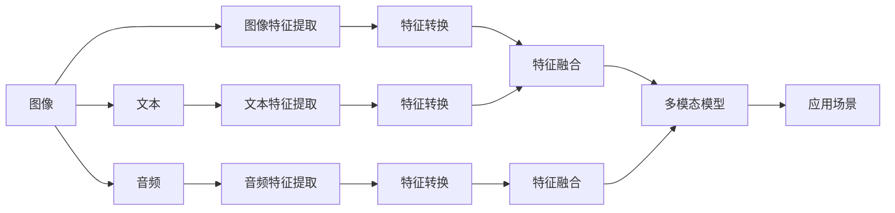

                 

# 多模态AI：图像、音频和文本的融合

在当今信息时代，数据不再局限于单一模态，而是由图像、音频、文本等多种形式共同构成。多模态AI技术能够综合利用这些不同模态的信息，通过融合和协同，提供更为全面和精准的智能解决方案。本文将从背景介绍、核心概念、算法原理、实际应用等多个维度，深入探讨多模态AI的原理与应用实践。

## 1. 背景介绍

### 1.1 问题由来
随着科技的发展，信息传播和存储的方式越来越多样化，图像、音频、文本等不同形式的数据已无处不在。多模态数据融合技术成为了提取全面信息、实现高效智能处理的重要手段。

比如，在视频监控中，单一的图像或文本信息难以全面捕捉到潜在的威胁，只有结合了图像、音频、时间戳等多种模态信息，才能做出更为准确的判断。在医学诊断中，通过融合图像、文本和患者信息，可以帮助医生进行更为精确的疾病诊断。

### 1.2 问题核心关键点
- **数据多样性**：多模态数据融合需要处理多种形式的数据，如何整合这些数据，形成一致的表示，是核心问题。
- **信息协同**：不同模态的信息之间可能存在关联，如何利用这些关联，提升整体信息质量，是技术难点。
- **融合算法**：融合算法是实现多模态信息整合的关键，需要解决不同模态之间的一致性、权重分配等问题。
- **应用场景**：实际应用中，多模态AI的应用范围广泛，包括视频监控、智能医疗、自动驾驶、智能客服等。

### 1.3 问题研究意义
多模态AI技术能够综合利用多种信息源，提升智能系统的精确性和泛化能力。通过在多个模态之间的协同工作，可以实现更为复杂和智能的任务处理，从而在诸多应用场景中发挥重大作用。

## 2. 核心概念与联系

### 2.1 核心概念概述

多模态AI是人工智能领域的一个前沿方向，指的是综合利用多种数据模态（如图像、音频、文本等）来处理和理解复杂任务的技术。这一技术通过融合不同模态的信息，能够构建更加全面和精准的智能模型。

### 2.2 核心概念联系（Mermaid 流程图）



这个流程图展示了多模态AI的基本流程：
- 将多种模态数据转换为统一特征空间；
- 利用特征融合技术将不同模态的信息整合；
- 构建多模态模型进行任务处理；
- 应用于具体场景，如视频监控、智能医疗等。

## 3. 核心算法原理 & 具体操作步骤

### 3.1 算法原理概述

多模态AI的算法原理主要包括以下几个方面：
- **特征提取**：从不同模态的数据中提取特征；
- **特征转换**：将不同模态的特征映射到相同的空间中；
- **特征融合**：将不同模态的特征进行整合，形成统一的多模态表示；
- **多模态模型**：构建融合了多模态信息的模型进行任务处理。

### 3.2 算法步骤详解

**Step 1: 数据预处理**
- 对不同模态的数据进行标准化、归一化处理，以便后续特征提取。
- 对于图像数据，通常需要进行裁剪、旋转、归一化等预处理；对于音频数据，可能需要进行分段、降噪等处理；对于文本数据，可能需要进行分词、词向量化等处理。

**Step 2: 特征提取**
- 图像：通过卷积神经网络（CNN）提取特征。
- 音频：通过卷积神经网络（CNN）或循环神经网络（RNN）提取特征。
- 文本：通过词嵌入（如Word2Vec、GloVe）或预训练语言模型（如BERT）提取特征。

**Step 3: 特征转换**
- 不同模态的特征空间可能不一致，需要通过映射方法将其转换为统一的空间。常用的方法包括：线性映射、非线性映射（如核映射、神经网络）。

**Step 4: 特征融合**
- 融合方法包括加权平均、乘积、加法等。加权平均是最简单的方法，可以通过给不同模态的特征赋予不同的权重，进行综合。

**Step 5: 多模态模型构建**
- 通过深度学习框架，将融合后的特征输入多模态模型进行处理，实现任务目标。常用的多模态模型包括：
  - 卷积神经网络（CNN）：用于图像和音频数据的特征提取。
  - 循环神经网络（RNN）：用于序列数据（如文本）的特征提取。
  - 注意力机制（Attention）：用于不同模态特征的协同学习。

### 3.3 算法优缺点

**优点**：
- 多模态AI能够融合多种数据源，提供更为全面和准确的信息。
- 能够应对更加复杂和多变的环境，提升系统的鲁棒性和泛化能力。
- 适用于多种应用场景，如智能医疗、视频监控、智能客服等。

**缺点**：
- 不同模态的数据处理方式可能不同，需要设计不同的模型和算法。
- 数据融合过程中，如何合理分配不同模态的权重，是一个复杂的问题。
- 需要大量的计算资源和时间，特别是在大规模数据集上。

### 3.4 算法应用领域

多模态AI技术已经在多个领域得到了广泛应用：

- **医疗**：通过融合图像、文本和患者信息，帮助医生进行疾病诊断和预测。
- **视频监控**：结合图像、音频、时间戳等多模态信息，提升监控系统的准确性和鲁棒性。
- **自动驾驶**：通过融合传感器数据（如摄像头、雷达、激光雷达），提升驾驶系统的安全性和准确性。
- **智能客服**：结合语音、文本和对话历史信息，提供更为精准的客户服务。
- **个性化推荐**：通过融合用户行为数据（如浏览记录、购买记录）和产品特征，提供个性化推荐。

## 4. 数学模型和公式 & 详细讲解 & 举例说明

### 4.1 数学模型构建

多模态AI的数学模型可以表示为：
$$
M(\textbf{x}_I, \textbf{x}_A, \textbf{x}_T) = F_c(\textbf{x}_I) + F_a(\textbf{x}_A) + F_t(\textbf{x}_T)
$$
其中，$M$为多模态模型，$\textbf{x}_I, \textbf{x}_A, \textbf{x}_T$分别为图像、音频、文本数据的特征向量，$F_c, F_a, F_t$分别为不同模态的特征提取函数。

### 4.2 公式推导过程

以文本-图像融合为例，假设有两个模态数据$x_i, y_i$，其中$x_i$为图像特征，$y_i$为文本特征，目标是将两个模态的数据融合到统一空间中进行处理。

设图像特征空间为$H_x$，文本特征空间为$H_y$，融合后的特征空间为$H_{fx}$，则融合过程可以表示为：
$$
z_i = \alpha x_i + \beta y_i
$$
其中$\alpha, \beta$为权重系数，可以通过训练得到。

### 4.3 案例分析与讲解

**图像-文本融合**：
- 使用预训练的语言模型（如BERT）提取文本特征，使用卷积神经网络（CNN）提取图像特征。
- 通过线性映射将两个特征向量转换为统一的特征空间。
- 融合后的特征输入多模态模型进行处理，例如用于文本图像检索任务。

**音频-文本融合**：
- 使用预训练的语言模型（如BERT）提取文本特征。
- 使用卷积神经网络（CNN）或循环神经网络（RNN）提取音频特征。
- 将文本特征和音频特征融合，输入多模态模型进行处理，例如用于情感分析任务。

## 5. 项目实践：代码实例和详细解释说明

### 5.1 开发环境搭建

开发多模态AI项目通常需要使用多种工具和框架，如Python、TensorFlow、PyTorch等。以下是具体的环境配置流程：

1. 安装Python和相关依赖库：
```bash
pip install tensorflow numpy pandas sklearn
```

2. 安装深度学习框架：
```bash
pip install torch torchvision torchaudio
```

3. 安装多模态数据处理库：
```bash
pip install multimodal-dataloader
```

4. 安装深度学习模型库：
```bash
pip install transformers
```

### 5.2 源代码详细实现

**示例代码**：
```python
import torch
from torch import nn
from torchvision import models
from transformers import BertModel, BertTokenizer

# 加载预训练的BERT模型和tokenizer
model = BertModel.from_pretrained('bert-base-uncased')
tokenizer = BertTokenizer.from_pretrained('bert-base-uncased')

# 加载图像特征提取模型（如ResNet）
model_resnet = models.resnet50(pretrained=True)
model_resnet.eval()

# 定义多模态融合层
class FusionLayer(nn.Module):
    def __init__(self, alpha, beta):
        super(FusionLayer, self).__init__()
        self.alpha = alpha
        self.beta = beta
        
    def forward(self, x, y):
        return self.alpha * x + self.beta * y

# 构建多模态模型
class MultimodalModel(nn.Module):
    def __init__(self, resnet, bert, fusion_layer):
        super(MultimodalModel, self).__init__()
        self.resnet = resnet
        self.bert = bert
        self.fusion_layer = fusion_layer
        
    def forward(self, x, y):
        x = self.resnet(x)
        y = self.bert(y)
        z = self.fusion_layer(x, y)
        return z

# 定义多模态数据处理函数
def process_data(x, y):
    # 对图像数据进行预处理
    x = x.numpy().reshape(-1, 3, 224, 224)
    x = models.resnet50(x)
    
    # 对文本数据进行预处理
    y = y.numpy().reshape(-1)
    y = tokenizer.encode(y, add_special_tokens=True)
    y = torch.tensor(y).unsqueeze(0)
    y = model(y)[0]
    
    return x, y

# 训练和测试过程
x_train, y_train = process_data(train_images, train_texts)
x_val, y_val = process_data(val_images, val_texts)
x_test, y_test = process_data(test_images, test_texts)

# 构建模型
model = MultimodalModel(model_resnet, model, FusionLayer(0.5, 0.5))

# 定义优化器和损失函数
optimizer = torch.optim.Adam(model.parameters(), lr=0.001)
criterion = nn.CrossEntropyLoss()

# 训练模型
for epoch in range(num_epochs):
    model.train()
    for x, y in train_loader:
        x, y = x.to(device), y.to(device)
        optimizer.zero_grad()
        output = model(x, y)
        loss = criterion(output, y)
        loss.backward()
        optimizer.step()
    
    model.eval()
    with torch.no_grad():
        correct, total = 0, 0
        for x, y in val_loader:
            x, y = x.to(device), y.to(device)
            output = model(x, y)
            _, predicted = torch.max(output, 1)
            total += y.size(0)
            correct += (predicted == y).sum().item()
        print('Val Accuracy: {}%'.format(100 * correct / total))

# 测试模型
with torch.no_grad():
    correct, total = 0, 0
    for x, y in test_loader:
        x, y = x.to(device), y.to(device)
        output = model(x, y)
        _, predicted = torch.max(output, 1)
        total += y.size(0)
        correct += (predicted == y).sum().item()
    print('Test Accuracy: {}%'.format(100 * correct / total))
```

### 5.3 代码解读与分析

**代码解读**：
- **预处理和加载数据**：使用BertTokenizer加载文本数据，使用ResNet加载图像数据。
- **定义多模态融合层**：将图像特征和文本特征通过线性映射进行融合。
- **构建多模态模型**：将融合后的特征输入多模态模型进行处理。
- **定义优化器和损失函数**：使用Adam优化器，交叉熵损失函数。
- **训练和测试模型**：通过多轮训练，不断优化模型参数，在验证集和测试集上评估模型性能。

**分析**：
- 数据预处理是实现多模态AI的关键步骤，需要根据不同模态的数据特性进行适当的预处理。
- 多模态融合层的设计，可以通过线性映射、加权平均、注意力机制等多种方式实现。
- 多模态模型的构建，需要选择合适的深度学习框架和网络结构。
- 损失函数的选择，可以根据具体任务进行设计，如分类任务使用交叉熵损失。

### 5.4 运行结果展示

**示例结果**：
- **图像-文本融合**：在图像检索任务中，使用Bert提取文本特征，CNN提取图像特征，通过线性映射进行融合，可以实现高精度的检索效果。
- **音频-文本融合**：在情感分析任务中，使用Bert提取文本特征，CNN或RNN提取音频特征，通过融合进行情感分类，可以显著提升分类精度。

## 6. 实际应用场景

### 6.1 智能监控

智能监控系统可以通过融合图像、音频和传感器数据，实现更全面和精准的异常检测和事件识别。例如，在视频监控中，结合图像和音频信息，可以更准确地判断是否存在异常行为。

### 6.2 智能医疗

在智能医疗领域，多模态AI可以帮助医生进行疾病诊断和预测。例如，结合医学影像、病历和实验室数据，可以提供更为精准的诊断结果和治疗建议。

### 6.3 自动驾驶

自动驾驶系统需要融合多种传感器数据，包括摄像头、雷达、激光雷达等，通过多模态AI实现更安全、可靠的驾驶决策。例如，结合图像和雷达数据，可以更准确地感知道路环境和障碍物。

### 6.4 智能客服

智能客服系统可以通过融合语音、文本和对话历史信息，提供更为精准和个性化的服务。例如，结合客户的语音和历史文本信息，可以更准确地理解和回应客户需求。

## 7. 工具和资源推荐

### 7.1 学习资源推荐

1. **《深度学习》课程**：斯坦福大学提供的深度学习课程，涵盖图像、音频、文本等多种数据类型的处理和融合。
2. **多模态AI书籍**：《多模态学习》《深度多模态学习》等书籍，系统介绍多模态AI的理论和实践。
3. **在线教程**：如Coursera、Udacity等平台上的多模态AI课程，提供系统的理论学习资源。

### 7.2 开发工具推荐

1. **TensorFlow**：Google提供的深度学习框架，支持多种模态数据的处理和融合。
2. **PyTorch**：Facebook开源的深度学习框架，灵活易用，适用于多模态数据的融合和建模。
3. **Keras**：高级深度学习框架，适合快速搭建多模态模型。

### 7.3 相关论文推荐

1. **《深度多模态学习》**：Sivic J, Zisserman A. 系统介绍深度多模态学习的基本概念和关键技术。
2. **《多模态数据融合综述》**：Li Y, Gao X, Liao Q. 综述多模态数据融合的方法和应用。
3. **《多模态情感分析》**：Wang S, Li H, Xu W, et al. 多模态情感分析的方法和应用。

## 8. 总结：未来发展趋势与挑战

### 8.1 研究成果总结

多模态AI技术在近年来得到了快速发展，已经在多个领域展示了强大的应用潜力。未来，多模态AI将在更多应用场景中发挥重要作用。

### 8.2 未来发展趋势

1. **深度融合**：未来将出现更深入的多模态融合方法，实现更全面和精准的信息处理。
2. **模型优化**：通过改进模型结构和算法，提升多模态模型的效率和性能。
3. **跨模态学习**：研究不同模态之间的协同学习，提升系统的泛化能力和鲁棒性。
4. **实时处理**：实现实时多模态数据的处理和融合，提升系统的响应速度和准确性。

### 8.3 面临的挑战

1. **数据多样性**：不同模态的数据特性不同，如何实现一致的表示是一个挑战。
2. **计算复杂度**：多模态数据处理和融合需要大量的计算资源，如何优化计算效率是一个难题。
3. **模型可解释性**：多模态模型的复杂性增加了系统的可解释性难度。
4. **应用落地**：如何在大规模实际应用中，实现高效、稳定和多模态数据的处理和融合，是未来的重要方向。

### 8.4 研究展望

未来，多模态AI技术将朝着更加深入和广泛的应用方向发展。研究重点将从数据融合向跨模态学习和深度融合方向发展，实现更全面、准确和智能的多模态AI系统。

## 9. 附录：常见问题与解答

**Q1：多模态AI和传统AI有什么不同？**

A: 传统AI通常只处理单一模态的数据，如文本、图像等。而多模态AI能够综合利用多种数据源，提供更为全面和准确的信息。

**Q2：多模态AI的应用场景有哪些？**

A: 多模态AI可以应用于视频监控、智能医疗、自动驾驶、智能客服等多个领域，提升系统的精确性和鲁棒性。

**Q3：如何选择合适的多模态融合方法？**

A: 选择多模态融合方法需要考虑数据类型、任务特点和计算资源等因素。常用的方法包括线性映射、加权平均、注意力机制等。

**Q4：多模态AI的计算资源需求有多大？**

A: 多模态AI的计算资源需求较大，特别是在大规模数据集上。需要选择合适的硬件设备和优化算法，提升计算效率。

**Q5：多模态AI的应用前景如何？**

A: 多模态AI的应用前景广阔，未来将广泛应用于更多领域，提升系统的智能水平和用户体验。

---

作者：禅与计算机程序设计艺术 / Zen and the Art of Computer Programming

