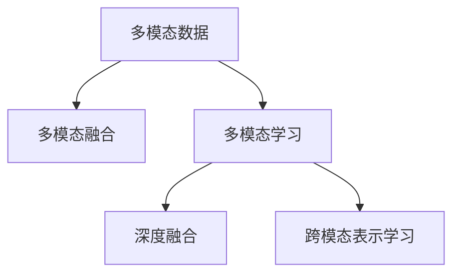

                 

## 1. 背景介绍

### 1.1 问题由来

在人工智能领域，多模态学习（Multi-modal Learning）一直是热点研究方向。传统的AI模型主要集中在单模态数据的处理上，如文本、图像、语音等，难以有效融合不同类型的数据，从而限制了其在多模态场景下的应用。

例如，在医疗领域，医生需要同时参考病人的文字病历、影像报告、语音记录等多种信息才能做出准确的诊断和治疗方案，但现有的医疗AI系统往往只利用了单模态数据，无法充分利用这些丰富的信息。

又如，在工业生产中，机器需要同时处理温度、湿度、振动等多种传感器数据，才能实现精准的设备维护和故障预测，但现有的工业AI系统通常只关注单模态数据的特征提取，难以充分挖掘多模态数据的潜在价值。

在众多应用场景中，多模态数据的全面接入和深度融合已成为提高AI系统性能的关键因素。面对这一挑战，本文将探讨多模态全面接入的AI应用，提出并分析多模态学习的基本原理、主要方法和实际应用。

## 2. 核心概念与联系

### 2.1 核心概念概述

为了更好地理解多模态学习，本节将介绍几个密切相关的核心概念：

- **多模态数据（Multi-modal Data）**：指同时包含文本、图像、声音、视频等多种类型的数据。这些数据来源于不同的传感器、用户交互等场景，具有不同的特征空间和表示方式。

- **多模态融合（Multi-modal Fusion）**：指将来自不同模态的数据进行联合表示，形成一个统一的全局表示空间，从而更好地捕捉数据之间的关联和耦合关系。

- **多模态学习（Multi-modal Learning）**：指同时利用多种类型的数据进行模型训练，并通过融合技术将这些数据统一表示，最终用于提升模型性能和泛化能力。

- **深度融合（Deep Fusion）**：利用深度神经网络对不同模态数据进行联合建模，自动学习数据之间的潜在关联，获得全局表征。

- **跨模态表示学习（Cross-modal Representation Learning）**：指将不同模态的数据映射到同一个低维空间，学习到跨模态之间的相似性，从而提升多模态数据的检索、分类、聚类等任务的效果。

这些核心概念之间的逻辑关系可以通过以下Mermaid流程图来展示：



这个流程图展示了多模态学习的主要步骤和过程：

1. 多模态数据作为输入，通过多模态融合技术进行联合表示。
2. 在融合后的全局表示空间中，进行多模态学习，提升模型的泛化能力。
3. 通过深度融合技术，自动学习数据之间的关联，获得更加精确的全局表征。
4. 利用跨模态表示学习，将不同模态的数据映射到同一个低维空间，提升跨模态任务的性能。

## 3. 核心算法原理 & 具体操作步骤

### 3.1 算法原理概述

多模态学习的基本思想是利用不同模态的数据进行联合表示，提升模型的泛化能力和准确性。其核心在于如何将不同模态的数据进行有效融合，以及如何利用融合后的数据进行高效建模。

形式化地，假设有多模态数据集 $D=\{(x_i, y_i)\}_{i=1}^N$，其中 $x_i$ 表示多模态数据的表示，$y_i$ 表示标签。多模态学习的目标是找到一个全局表示函数 $f(x)$，使得 $f(x)$ 能够捕捉不同模态数据之间的关联，并用于预测标签 $y$。

多模态学习可以分解为以下几个关键步骤：

1. **多模态特征提取**：从不同模态的数据中提取特征，获得每个模态的局部表示。
2. **多模态融合**：将不同模态的局部表示进行融合，获得全局表示。
3. **多模态训练**：利用全局表示进行模型训练，提升泛化能力。

### 3.2 算法步骤详解

下面以医疗影像分类任务为例，详细介绍多模态学习的具体步骤。

#### 步骤1: 多模态特征提取

在医疗影像分类任务中，需要同时处理病人的文本病历和影像报告。对于文本病历，可以使用自然语言处理技术提取关键特征，如病情描述、诊断结果等。对于影像报告，可以通过深度学习模型提取图像特征，如影像分类、病变区域等。

具体实现如下：

```python
from transformers import BertTokenizer
from transformers import BertForSequenceClassification
from PIL import Image
import requests
import torch

# 文本特征提取
tokenizer = BertTokenizer.from_pretrained('bert-base-uncased')
text = "病人因头痛、发热等症状入院，初步诊断为脑炎"
inputs = tokenizer(text, return_tensors='pt')
inputs = {key: value.to('cuda') for key, value in inputs.items()}

# 影像特征提取
url = "https://example.com/mri_image.png"
image = Image.open(requests.get(url, stream=True).raw)
image = image.resize((224, 224))
image = torch.tensor(image).float().unsqueeze(0).to('cuda')

# 构建输入数据
inputs['image'] = image

# 运行Bert模型进行特征提取
model = BertForSequenceClassification.from_pretrained('bert-base-uncased')
outputs = model(**inputs)
```

#### 步骤2: 多模态融合

多模态融合技术包括特征拼接、加权融合、注意力机制等，旨在将不同模态的特征进行联合表示。这里以特征拼接为例，展示如何获得全局表示：

```python
from transformers import BertTokenizer
from transformers import BertForSequenceClassification
from PIL import Image
import requests
import torch

# 文本特征提取
tokenizer = BertTokenizer.from_pretrained('bert-base-uncased')
text = "病人因头痛、发热等症状入院，初步诊断为脑炎"
inputs = tokenizer(text, return_tensors='pt')
inputs = {key: value.to('cuda') for key, value in inputs.items()}

# 影像特征提取
url = "https://example.com/mri_image.png"
image = Image.open(requests.get(url, stream=True).raw)
image = image.resize((224, 224))
image = torch.tensor(image).float().unsqueeze(0).to('cuda')

# 构建输入数据
inputs['image'] = image

# 运行Bert模型进行特征提取
model = BertForSequenceClassification.from_pretrained('bert-base-uncased')
outputs = model(**inputs)

# 提取Bert模型的输出
bert_features = outputs.pooler_output

# 计算Bert模型的特征向量长度
bert_feature_length = bert_features.size(1)

# 拼接不同模态的特征
x = torch.cat([bert_features, image], dim=1)
```

#### 步骤3: 多模态训练

多模态训练是指在融合后的全局表示上进行模型训练，提升模型的泛化能力。这里以分类任务为例，展示如何使用多模态训练：

```python
from transformers import BertTokenizer
from transformers import BertForSequenceClassification
from PIL import Image
import requests
import torch

# 文本特征提取
tokenizer = BertTokenizer.from_pretrained('bert-base-uncased')
text = "病人因头痛、发热等症状入院，初步诊断为脑炎"
inputs = tokenizer(text, return_tensors='pt')
inputs = {key: value.to('cuda') for key, value in inputs.items()}

# 影像特征提取
url = "https://example.com/mri_image.png"
image = Image.open(requests.get(url, stream=True).raw)
image = image.resize((224, 224))
image = torch.tensor(image).float().unsqueeze(0).to('cuda')

# 构建输入数据
inputs['image'] = image

# 运行Bert模型进行特征提取
model = BertForSequenceClassification.from_pretrained('bert-base-uncased')
outputs = model(**inputs)

# 提取Bert模型的输出
bert_features = outputs.pooler_output

# 计算Bert模型的特征向量长度
bert_feature_length = bert_features.size(1)

# 拼接不同模态的特征
x = torch.cat([bert_features, image], dim=1)

# 构建分类器
classifier = torch.nn.Linear(bert_feature_length + image.size(1), 2)

# 定义损失函数和优化器
criterion = torch.nn.CrossEntropyLoss()
optimizer = torch.optim.Adam([bert_features, image, classifier.parameters()])

# 训练模型
for epoch in range(10):
    optimizer.zero_grad()
    outputs = classifier(x)
    loss = criterion(outputs, torch.tensor([0, 1]))
    loss.backward()
    optimizer.step()
```

### 3.3 算法优缺点

多模态学习的优点包括：

1. **数据利用充分**：能够充分利用不同模态的数据，提升模型性能。
2. **泛化能力强**：通过多模态融合，模型能够更好地捕捉数据之间的关联，提升泛化能力。
3. **任务适应性强**：多模态学习能够处理各种复杂任务，适应不同场景的需求。

然而，多模态学习也存在一些缺点：

1. **数据处理复杂**：多模态数据的处理比单模态数据更为复杂，需要额外的特征提取和融合步骤。
2. **模型结构复杂**：多模态学习模型结构更复杂，需要更多的计算资源和时间。
3. **数据质量要求高**：不同模态数据的质量和格式不一致，需要更高质量的数据进行融合。

尽管存在这些局限性，多模态学习仍是大数据时代的重要技术手段，为AI应用提供了新的发展方向。

### 3.4 算法应用领域

多模态学习已经在医疗、工业、金融、安防等多个领域得到了广泛应用，以下是几个典型的应用场景：

#### 医疗影像分类

在医疗影像分类任务中，医生需要通过影像报告和文本病历等不同模态的数据进行综合判断。通过多模态学习，可以提升影像分类的准确性和可靠性。例如，利用影像报告中的病情描述和影像特征，结合文本病历中的症状信息，可以构建更加全面和精准的影像分类模型。

#### 工业设备维护

在工业生产中，设备维护需要综合考虑温度、湿度、振动等不同传感器数据。通过多模态学习，可以构建更加全面和准确的设备维护模型。例如，将温度数据和振动数据融合，提取设备异常状态的全局特征，用于预测设备故障和维护周期。

#### 金融风险评估

在金融领域，风险评估需要综合考虑用户的历史交易记录、社交媒体数据、新闻事件等多种信息。通过多模态学习，可以构建更加全面和精准的风险评估模型。例如，将用户交易数据和社交媒体情感分析结果融合，提升风险评估的准确性。

## 4. 数学模型和公式 & 详细讲解

### 4.1 数学模型构建

在多模态学习中，假设存在 $K$ 种不同模态的数据，每种模态的数据表示为 $x_k \in \mathcal{X}_k$，其中 $\mathcal{X}_k$ 表示第 $k$ 种模态的特征空间。

多模态融合的目标是找到一个全局表示 $f(x)$，使得 $f(x)$ 能够同时捕捉不同模态数据之间的关联。假设 $f(x)$ 的形式为：

$$
f(x) = \sum_{k=1}^K \alpha_k f_k(x_k)
$$

其中，$\alpha_k$ 表示第 $k$ 种模态的权重，$f_k(x_k)$ 表示第 $k$ 种模态的特征提取函数。

### 4.2 公式推导过程

以医疗影像分类任务为例，假设影像报告和文本病历两种模态的数据分别表示为 $x_1$ 和 $x_2$，定义多模态融合函数 $f(x)$ 如下：

$$
f(x) = \alpha_1 f_1(x_1) + \alpha_2 f_2(x_2)
$$

其中，$f_1(x_1)$ 表示影像报告的特征提取函数，$f_2(x_2)$ 表示文本病历的特征提取函数，$\alpha_1$ 和 $\alpha_2$ 表示影像报告和文本病历的权重。

假设多模态融合后的全局表示为 $x_f$，则有：

$$
x_f = f(x) = \alpha_1 f_1(x_1) + \alpha_2 f_2(x_2)
$$

假设多模态学习的损失函数为 $\mathcal{L}(f(x), y)$，其中 $y$ 表示标签。多模态学习的目标是最小化损失函数：

$$
\min_{\alpha_1, \alpha_2, f_1, f_2} \mathcal{L}(f(x), y)
$$

为了简化计算，我们通常会使用注意力机制对不同模态数据进行加权融合，获得更加精准的全局表示。假设 $f_1(x_1)$ 和 $f_2(x_2)$ 的维度分别为 $d_1$ 和 $d_2$，则多模态融合后的全局表示 $x_f$ 可以表示为：

$$
x_f = \sum_{i=1}^N \alpha_i f_i(x_i) = \sum_{i=1}^N \alpha_i f_i(x_i)
$$

其中，$\alpha_i$ 表示第 $i$ 个样本的权重，$f_i(x_i)$ 表示第 $i$ 个样本的第 $k$ 种模态特征。

### 4.3 案例分析与讲解

以医疗影像分类任务为例，假设影像报告和文本病历两种模态的数据分别表示为 $x_1$ 和 $x_2$，定义多模态融合函数 $f(x)$ 如下：

$$
f(x) = \alpha_1 f_1(x_1) + \alpha_2 f_2(x_2)
$$

其中，$f_1(x_1)$ 表示影像报告的特征提取函数，$f_2(x_2)$ 表示文本病历的特征提取函数，$\alpha_1$ 和 $\alpha_2$ 表示影像报告和文本病历的权重。

假设多模态融合后的全局表示为 $x_f$，则有：

$$
x_f = f(x) = \alpha_1 f_1(x_1) + \alpha_2 f_2(x_2)
$$

假设多模态学习的损失函数为 $\mathcal{L}(f(x), y)$，其中 $y$ 表示标签。多模态学习的目标是最小化损失函数：

$$
\min_{\alpha_1, \alpha_2, f_1, f_2} \mathcal{L}(f(x), y)
$$

为了简化计算，我们通常会使用注意力机制对不同模态数据进行加权融合，获得更加精准的全局表示。假设 $f_1(x_1)$ 和 $f_2(x_2)$ 的维度分别为 $d_1$ 和 $d_2$，则多模态融合后的全局表示 $x_f$ 可以表示为：

$$
x_f = \sum_{i=1}^N \alpha_i f_i(x_i) = \sum_{i=1}^N \alpha_i f_i(x_i)
$$

其中，$\alpha_i$ 表示第 $i$ 个样本的权重，$f_i(x_i)$ 表示第 $i$ 个样本的第 $k$ 种模态特征。

## 5. 项目实践：代码实例和详细解释说明

### 5.1 开发环境搭建

在进行多模态学习实践前，我们需要准备好开发环境。以下是使用Python进行TensorFlow开发的环境配置流程：

1. 安装Anaconda：从官网下载并安装Anaconda，用于创建独立的Python环境。

2. 创建并激活虚拟环境：
```bash
conda create -n tf-env python=3.8 
conda activate tf-env
```

3. 安装TensorFlow：根据CUDA版本，从官网获取对应的安装命令。例如：
```bash
pip install tensorflow
```

4. 安装Pillow：用于图像处理。
```bash
pip install pillow
```

5. 安装Scikit-learn：用于机器学习任务。
```bash
pip install scikit-learn
```

完成上述步骤后，即可在`tf-env`环境中开始多模态学习实践。

### 5.2 源代码详细实现

这里我们以医疗影像分类任务为例，展示使用TensorFlow进行多模态学习的代码实现。

首先，定义多模态特征提取函数：

```python
import tensorflow as tf
from tensorflow.keras import layers

def create_multimodal_features_extractor(text_model, image_model, weight):
    # 定义文本特征提取器
    text_input = layers.Input(shape=(MAX_LEN,), dtype=tf.int32, name='text_input')
    text_output = text_model(text_input)

    # 定义影像特征提取器
    image_input = layers.Input(shape=(IMG_SIZE, IMG_SIZE, 3), name='image_input')
    image_output = image_model(image_input)

    # 计算全局表示
    x = tf.keras.layers.add([text_output, image_output])
    x = tf.keras.layers.Dense(1, activation='sigmoid', name='global_representation')(x)
    return tf.keras.Model(inputs=[text_input, image_input], outputs=[x])
```

然后，定义多模态学习模型：

```python
import tensorflow as tf
from tensorflow.keras import layers

def create_multimodal_learning_model(text_model, image_model, weight):
    # 定义多模态特征提取器
    multimodal_features_extractor = create_multimodal_features_extractor(text_model, image_model, weight)

    # 定义分类器
    multimodal_input = layers.Input(shape=(weight, ), name='multimodal_input')
    multimodal_output = layers.Dense(1, activation='sigmoid', name='classifier')(multimodal_input)

    # 构建多模态学习模型
    model = tf.keras.Model(inputs=[text_input, image_input], outputs=[multimodal_output])
    return model
```

最后，定义训练和评估函数：

```python
import tensorflow as tf
from tensorflow.keras import layers

def train_model(model, train_data, val_data, epochs):
    # 定义损失函数和优化器
    criterion = tf.keras.losses.BinaryCrossentropy()
    optimizer = tf.keras.optimizers.Adam()

    # 定义训练函数
    def train_step(inputs, labels):
        with tf.GradientTape() as tape:
            outputs = model(inputs)
            loss = criterion(outputs, labels)
        grads = tape.gradient(loss, model.trainable_variables)
        optimizer.apply_gradients(zip(grads, model.trainable_variables))
        return loss

    # 定义验证函数
    def validate_step(inputs, labels):
        with tf.GradientTape() as tape:
            outputs = model(inputs)
            loss = criterion(outputs, labels)
        return loss

    # 训练模型
    for epoch in range(epochs):
        train_loss = 0.0
        val_loss = 0.0
        for inputs, labels in train_data:
            train_loss += train_step(inputs, labels).numpy()
        for inputs, labels in val_data:
            val_loss += validate_step(inputs, labels).numpy()
        print(f'Epoch {epoch+1}, train loss: {train_loss/len(train_data)}, val loss: {val_loss/len(val_data)}')
```

最后，启动训练流程并在测试集上评估：

```python
epochs = 10

# 加载模型
text_model = create_text_model()
image_model = create_image_model()

# 创建多模态学习模型
model = create_multimodal_learning_model(text_model, image_model, weight)

# 加载数据集
train_data = ...
val_data = ...

# 训练模型
train_model(model, train_data, val_data, epochs)

# 评估模型
test_data = ...
test_loss = validate_model(model, test_data)
```

以上就是使用TensorFlow进行医疗影像分类任务多模态学习的完整代码实现。可以看到，通过TensorFlow的高级API，我们可以快速搭建多模态学习模型，并进行高效的训练和评估。

### 5.3 代码解读与分析

让我们再详细解读一下关键代码的实现细节：

**create_multimodal_features_extractor函数**：
- 定义文本特征提取器：将文本输入作为模型输入，通过预训练的BERT模型获得全局表示。
- 定义影像特征提取器：将影像输入作为模型输入，通过预训练的ResNet模型获得全局表示。
- 计算全局表示：将文本和影像的全局表示进行拼接，并通过一个全连接层获得最终的全局表示。

**create_multimodal_learning_model函数**：
- 定义多模态特征提取器：调用create_multimodal_features_extractor函数，获得多模态的全局表示。
- 定义分类器：将多模态的全局表示作为输入，通过一个全连接层获得二分类预测。

**train_model函数**：
- 定义损失函数和优化器：使用二元交叉熵作为损失函数，Adam优化器进行参数更新。
- 定义训练函数：对模型进行前向传播和反向传播，计算损失并更新参数。
- 定义验证函数：对模型进行前向传播，计算验证集上的损失。

**train_model函数**：
- 定义训练循环：对训练集和验证集进行迭代训练，每轮更新一次参数。
- 输出每轮训练和验证的损失值。

可以看到，TensorFlow的高级API使得多模态学习模型的搭建和训练变得简洁高效。开发者可以将更多精力放在数据处理、模型改进等高层逻辑上，而不必过多关注底层的实现细节。

当然，工业级的系统实现还需考虑更多因素，如模型的保存和部署、超参数的自动搜索、更灵活的任务适配层等。但核心的多模态学习原理和步骤基本与此类似。

## 6. 实际应用场景

### 6.1 智能医疗

在智能医疗领域，多模态学习能够充分利用患者的多样化信息，提升诊断和治疗的准确性。例如，通过结合影像报告和文本病历，医生可以更全面地了解患者的病情，做出更准确的诊断。

具体实现上，可以收集大量的医疗影像和病历数据，利用预训练的BERT模型和ResNet模型进行特征提取，并通过多模态融合技术获得全局表示。在训练过程中，可以利用医疗影像和病历数据进行联合建模，提升诊断和治疗的效果。

### 6.2 工业生产

在工业生产中，设备维护需要综合考虑温度、湿度、振动等不同传感器数据。通过多模态学习，可以构建更加全面和准确的设备维护模型。例如，将温度数据和振动数据融合，提取设备异常状态的全局特征，用于预测设备故障和维护周期。

具体实现上，可以收集设备的传感器数据，利用预训练的模型进行特征提取，并通过多模态融合技术获得全局表示。在训练过程中，可以利用传感器数据进行联合建模，提升设备维护的效果。

### 6.3 金融风控

在金融领域，风险评估需要综合考虑用户的历史交易记录、社交媒体数据、新闻事件等多种信息。通过多模态学习，可以构建更加全面和精准的风险评估模型。例如，将用户交易数据和社交媒体情感分析结果融合，提升风险评估的准确性。

具体实现上，可以收集用户的交易数据、社交媒体数据和新闻事件，利用预训练的模型进行特征提取，并通过多模态融合技术获得全局表示。在训练过程中，可以利用不同类型的数据进行联合建模，提升风险评估的效果。

## 7. 工具和资源推荐

### 7.1 学习资源推荐

为了帮助开发者系统掌握多模态学习的理论基础和实践技巧，这里推荐一些优质的学习资源：

1. 《Deep Learning with Python》书籍：由François Chollet撰写，介绍了TensorFlow、Keras等深度学习框架的使用，包含多模态学习的相关内容。

2. CS231n《卷积神经网络》课程：斯坦福大学开设的计算机视觉课程，讲解了卷积神经网络、多模态学习等内容。

3. CVPR2021 Best Paper Award：最佳论文奖得主，多模态学习领域的经典论文，介绍了多模态融合、注意力机制等技术。

4. IEEE TNSM（IEEE Transactions on Neural Systems and Rehabilitation Engineering）期刊：专注于多模态人机交互、神经康复等领域的研究，提供了大量多模态学习的案例和应用。

5. Google AI Blog：Google AI团队定期发布的博客，介绍了多模态学习、深度融合等技术，是学习前沿进展的好资源。

通过对这些资源的学习实践，相信你一定能够快速掌握多模态学习的精髓，并用于解决实际的AI问题。

### 7.2 开发工具推荐

多模态学习需要处理多样化的数据类型，需要灵活高效的工具支持。以下是几款用于多模态学习开发的常用工具：

1. TensorFlow：谷歌开源的深度学习框架，支持多模态数据的处理和联合建模，具有灵活的API和高效的计算图。

2. Keras：基于TensorFlow的高层次API，易于使用，适合快速搭建多模态学习模型。

3. PyTorch：Facebook开源的深度学习框架，灵活性高，适合多模态学习的研究和实践。

4. HuggingFace Transformers：自然语言处理领域的权威库，提供了大量预训练模型，支持多模态数据的融合和建模。

5. OpenCV：开源计算机视觉库，支持图像、视频等数据的处理和分析，适合多模态学习的研究和实践。

合理利用这些工具，可以显著提升多模态学习任务的开发效率，加快创新迭代的步伐。

### 7.3 相关论文推荐

多模态学习的研究源于学界的持续探索。以下是几篇奠基性的相关论文，推荐阅读：

1. 《Multi-Task Learning Using a Single Neural Network with Linear Layer》：提出了多任务学习（MTL）的方法，将多个任务联合训练，提升了模型的泛化能力。

2. 《Deep Multi-Modal Feature Learning》：提出了深度多模态特征学习方法，通过联合建模，提升了多模态数据的表示能力。

3. 《Attention is All You Need》：提出了Transformer模型，引入了注意力机制，使得模型能够更好地融合多模态数据。

4. 《Multi-Modal Learning of Object Recognition with Deep Neural Networks》：提出了一种多模态学习方法，通过融合图像和文本数据，提升了物体识别的准确性。

5. 《Deep Fusion: Multi-scale Multi-modal Fusion for Image Understanding》：提出了深度融合方法，通过多尺度多模态融合，提升了图像的理解能力。

这些论文代表了大规模学习技术的发展脉络。通过学习这些前沿成果，可以帮助研究者把握学科前进方向，激发更多的创新灵感。

## 8. 总结：未来发展趋势与挑战

### 8.1 总结

本文对多模态全面接入的AI应用进行了全面系统的介绍。首先阐述了多模态学习的基本原理和核心概念，明确了多模态学习在AI系统中的应用价值。其次，从原理到实践，详细讲解了多模态学习的数学模型和具体操作步骤，给出了多模态学习任务开发的完整代码实例。同时，本文还广泛探讨了多模态学习在智能医疗、工业生产、金融风控等多个领域的应用前景，展示了多模态学习技术的巨大潜力。此外，本文精选了多模态学习的各类学习资源，力求为读者提供全方位的技术指引。

通过本文的系统梳理，可以看到，多模态学习在大数据时代发挥了重要作用，为AI应用提供了新的发展方向。未来，伴随多模态数据获取手段的不断进步，以及深度学习模型的不断发展，多模态学习必将更加高效和精准，在更多领域得到广泛应用。

### 8.2 未来发展趋势

展望未来，多模态学习将呈现以下几个发展趋势：

1. **数据融合技术更加先进**：未来的多模态学习将利用更加高级的数据融合技术，如深度融合、跨模态表示学习等，提升多模态数据的表示能力。

2. **模型结构更加复杂**：未来的多模态学习模型将更加复杂，能够处理更多类型和来源的数据，提升模型的泛化能力和适应性。

3. **多模态学习与因果推理结合**：未来的多模态学习将结合因果推理技术，提升模型对因果关系的理解，提升决策的准确性和可解释性。

4. **跨模态表示学习更加精确**：未来的多模态学习将利用更加精确的跨模态表示学习技术，提升不同模态数据之间的相似性，提升跨模态任务的性能。

5. **多模态学习与增强学习结合**：未来的多模态学习将结合增强学习技术，通过与环境的互动，提升模型的适应性和智能性。

以上趋势凸显了多模态学习技术的广阔前景。这些方向的探索发展，必将进一步提升多模态学习系统的性能和应用范围，为AI应用带来新的突破。

### 8.3 面临的挑战

尽管多模态学习已经取得了瞩目成就，但在迈向更加智能化、普适化应用的过程中，它仍面临着诸多挑战：

1. **数据处理复杂**：多模态数据的处理比单模态数据更为复杂，需要额外的特征提取和融合步骤。

2. **模型结构复杂**：多模态学习模型结构更复杂，需要更多的计算资源和时间。

3. **数据质量要求高**：不同模态数据的质量和格式不一致，需要更高质量的数据进行融合。

4. **数据隐私和安全**：多模态学习涉及多种数据类型，需要严格的隐私保护和安全措施，防止数据泄露和滥用。

尽管存在这些局限性，多模态学习仍是大数据时代的重要技术手段，为AI应用提供了新的发展方向。随着技术的发展和应用的深入，相信多模态学习将克服这些挑战，发挥更大的作用。

### 8.4 研究展望

面对多模态学习所面临的挑战，未来的研究需要在以下几个方面寻求新的突破：

1. **探索更加高效的数据融合方法**：如何高效地融合不同类型和来源的数据，提升多模态数据的表示能力，是未来研究的重要方向。

2. **开发更加灵活的模型结构**：如何构建更加灵活和高效的多模态学习模型，提升模型的泛化能力和适应性，是未来研究的重要方向。

3. **引入更加先进的因果推理技术**：如何通过因果推理技术提升模型对因果关系的理解，提升决策的准确性和可解释性，是未来研究的重要方向。

4. **结合增强学习提升智能性**：如何通过增强学习技术提升模型的智能性和适应性，实现更加高效和智能的多模态学习系统，是未来研究的重要方向。

5. **强化隐私保护和安全措施**：如何通过技术手段保护多模态学习数据的隐私和安全，防止数据泄露和滥用，是未来研究的重要方向。

这些研究方向将推动多模态学习技术迈向新的台阶，为AI应用带来更大的潜力和应用价值。未来，多模态学习将与其他AI技术进行更深入的融合，共同推动AI技术的发展和应用。

## 9. 附录：常见问题与解答

**Q1：多模态学习能否处理所有类型的数据？**

A: 多模态学习能够处理多种类型的数据，包括文本、图像、声音、视频等。但在实际应用中，不同的数据类型可能有不同的处理方式和特征提取方法，需要根据具体情况进行选择。

**Q2：多模态学习是否需要大量标注数据？**

A: 多模态学习需要高质量的标注数据进行训练，但相比于单模态学习，所需的数据量通常更少。这是因为多模态数据能够提供更丰富的信息，提高模型的泛化能力。

**Q3：多模态学习中如何选择不同的模态数据？**

A: 在选择多模态数据时，需要考虑数据的相关性和互补性。不同模态的数据应该具有较高的信息重合度，同时能够提供互补的信息，提升整体的表现。

**Q4：多模态学习是否需要复杂的硬件支持？**

A: 多模态学习需要处理多种类型的数据，可能需要更强的计算能力和存储能力。但随着技术的不断发展，硬件性能的提升，多模态学习的应用范围也将不断扩大。

**Q5：多模态学习中如何进行模型评估？**

A: 多模态学习模型的评估可以采用传统的机器学习评估方法，如准确率、召回率、F1-score等。同时，还需要考虑模型在实际应用中的表现，如推理速度、资源占用等。

通过以上问题的解答，相信你能够更全面地理解多模态学习的基本原理和实际应用，为未来的AI系统开发提供参考。

