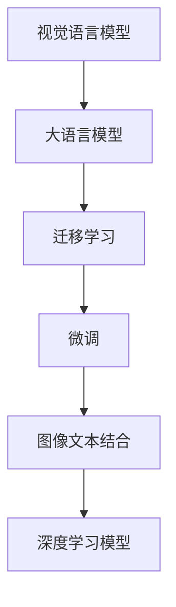

                 

# 多模态大模型：技术原理与实战 图像多模态技术

## 1. 背景介绍

随着人工智能技术的不断进步，多模态学习成为了一个热门话题。多模态指的是同一任务中同时涉及多种类型的数据，如文本、图像、音频等。这种多模态数据的融合可以帮助模型更好地理解复杂场景，提供更全面、准确的信息，从而提升模型性能。

在图像领域，传统的深度学习模型已经展示了强大的图像识别能力。然而，图像本身是一种高维数据，难以直接与其他类型的数据进行融合。近年来，随着大语言模型的发展，多模态学习在图像领域也得到了广泛应用，特别是图像文本结合的视觉语言模型（Vision and Language Models）。

本文将深入探讨基于大语言模型的图像多模态技术，包括其技术原理、应用场景和实战案例，力求为读者提供一个全面的多模态学习视角。

## 2. 核心概念与联系

### 2.1 核心概念概述

- **多模态学习**：同一任务中同时涉及多种类型的数据，如文本、图像、音频等。通过多模态数据的融合，可以提升模型的泛化能力和表现力。
- **视觉语言模型（Vision and Language Models）**：结合图像和文本数据的模型，通过学习图像与文本的联合分布，提升图像识别的准确性。
- **大语言模型（Large Language Models, LLMs）**：如GPT、BERT等，通过在大规模文本数据上进行预训练，学习语言表示，具备强大的语言理解和生成能力。
- **迁移学习（Transfer Learning）**：将一个领域学习到的知识，迁移到另一个不同但相关的领域。多模态大模型通过预训练-微调的方式，实现不同模态数据之间的知识迁移。

### 2.2 核心概念原理和架构的 Mermaid 流程图



## 3. 核心算法原理 & 具体操作步骤

### 3.1 算法原理概述

基于大语言模型的图像多模态技术，其核心思想是：将图像和文本数据融合到同一模型中进行处理，以实现多模态数据的协同学习。在预训练阶段，使用大语言模型学习文本与图像之间的联合分布，然后在微调阶段，根据具体的下游任务进行适配，使模型能够准确识别图像和文本的语义关系。

### 3.2 算法步骤详解

1. **数据准备**：收集图像数据和对应的文本描述，如ImageNet数据集，以及对应的图像描述，如Visual Genome数据集。

2. **预训练模型**：选择一个大语言模型，如GPT、BERT等，在大规模图像和文本数据上预训练，学习图像与文本的联合分布。

3. **模型结构设计**：根据具体任务设计模型结构，包括视觉编码器、文本编码器、融合层等。

4. **图像编码器**：将输入的图像转化为低维向量，一般使用卷积神经网络（CNN）进行编码。

5. **文本编码器**：将输入的文本转化为低维向量，一般使用Transformer或LSTM等序列模型进行编码。

6. **融合层**：将图像编码和文本编码进行融合，一般使用注意力机制或拼接操作。

7. **微调**：根据具体任务，使用标注数据对模型进行微调，更新模型参数，使其适应特定任务。

8. **推理与测试**：对微调后的模型进行推理测试，评估其在图像识别、图像描述生成等任务上的性能。

### 3.3 算法优缺点

#### 3.3.1 优点

- **泛化能力更强**：多模态学习可以充分利用不同模态数据的特点，提升模型的泛化能力。
- **数据要求低**：相较于传统的深度学习模型，多模态大模型可以通过融合少量文本数据，提升图像识别的准确性。
- **迁移能力更好**：多模态大模型可以更好地利用预训练知识，适应不同任务和数据分布。

#### 3.3.2 缺点

- **计算成本高**：预训练和微调过程需要大量计算资源，包括高性能GPU/TPU等。
- **数据融合难度大**：图像和文本数据具有不同的特点，融合过程中可能存在信息丢失和噪声引入等问题。
- **训练复杂度高**：多模态学习需要处理不同类型的数据，模型结构和训练过程更加复杂。

### 3.4 算法应用领域

多模态大模型已经在多个领域得到了广泛应用，包括但不限于：

1. **图像描述生成**：将图像输入模型，输出对应的文本描述。这一应用在自动摘要、图像注释等领域具有重要价值。
2. **图像问答**：根据给定的图像和问题，生成对应的答案。这一应用在教育、娱乐等领域有广泛的应用前景。
3. **图像搜索**：通过图像与文本的联合查询，提升搜索的准确性和效率。
4. **医学影像分析**：结合病理图像和文本报告，提升疾病诊断的准确性。
5. **情感分析**：结合图像和文本，提升对用户情感的准确分析。

## 4. 数学模型和公式 & 详细讲解 & 举例说明

### 4.1 数学模型构建

假设我们有$m$个图像和对应的$n$段文本，即$\{I_1, \cdots, I_m\}$和$\{T_1, \cdots, T_n\}$。图像和文本的联合分布可以表示为：

$$
P(I, T) = P(I|T)P(T)
$$

其中$P(I|T)$表示给定文本$T$的条件下图像$I$的概率，$P(T)$表示文本的先验概率。

### 4.2 公式推导过程

为了简化计算，我们可以对图像和文本进行编码，得到低维向量表示。假设图像编码器的输出为$E_I = [e_{I1}, \cdots, e_{Im}]$，文本编码器的输出为$E_T = [e_{T1}, \cdots, e_{Tn}]$。则联合概率$P(I, T)$可以表示为：

$$
P(I, T) = \prod_{i=1}^m \prod_{j=1}^n P(e_{Ii}|e_{Tj})P(e_{Tj})
$$

### 4.3 案例分析与讲解

以ImageNet数据集为例，其包含了1000类图像，每类图像有1000个样本。对于一个样本$I_i$，我们将其输入到预训练的大语言模型中，得到对应的图像描述$T_j$。然后，将这些图像描述与图像样本进行联合建模，得到联合概率$P(I_i, T_j)$。通过对这些概率进行最大化，我们可以优化模型参数，使其更好地适应图像与文本的联合分布。

## 5. 项目实践：代码实例和详细解释说明

### 5.1 开发环境搭建

为了进行图像多模态技术的研究和实践，我们需要搭建以下环境：

- **硬件要求**：高性能GPU/TPU，如NVIDIA Tesla V100、NVIDIA A100等。
- **软件要求**：PyTorch、TensorFlow等深度学习框架，HuggingFace的Transformer库等。

### 5.2 源代码详细实现

以下是一个使用PyTorch进行图像多模态模型微调的代码示例：

```python
import torch
import torchvision.transforms as transforms
from transformers import BertForSequenceClassification, BertTokenizer
from PIL import Image

# 加载预训练的BERT模型和tokenizer
model = BertForSequenceClassification.from_pretrained('bert-base-uncased')
tokenizer = BertTokenizer.from_pretrained('bert-base-uncased')

# 加载图像和文本数据
def load_data():
    images = []
    texts = []
    for i in range(num_images):
        image = Image.open('images/image{}.jpg'.format(i))
        text = 'This is a {} image'.format(image_classes[i])
        images.append(image)
        texts.append(text)
    return images, texts

# 图像编码器
class ImageEncoder(nn.Module):
    def __init__(self):
        super(ImageEncoder, self).__init__()
        self.conv = nn.Conv2d(3, 64, 3)
        self.pool = nn.MaxPool2d(2)
        self.fc = nn.Linear(64*8*8, 512)
    
    def forward(self, x):
        x = self.conv(x)
        x = self.pool(x)
        x = x.view(x.size(0), -1)
        x = self.fc(x)
        return x

# 文本编码器
class TextEncoder(nn.Module):
    def __init__(self):
        super(TextEncoder, self).__init__()
        self.bert = BertForSequenceClassification.from_pretrained('bert-base-uncased')
        self.tokenizer = BertTokenizer.from_pretrained('bert-base-uncased')
    
    def forward(self, text):
        tokens = self.tokenizer(text, return_tensors='pt')
        return self.bert(tokens)

# 融合层
class FusionLayer(nn.Module):
    def __init__(self):
        super(FusionLayer, self).__init__()
        self.att = nn.Linear(512, 512)
    
    def forward(self, image, text):
        image = self.att(image)
        text = self.att(text)
        return image + text

# 模型结构
class MultimodalModel(nn.Module):
    def __init__(self):
        super(MultimodalModel, self).__init__()
        self.image_encoder = ImageEncoder()
        self.text_encoder = TextEncoder()
        self.fusion = FusionLayer()
    
    def forward(self, image, text):
        image = self.image_encoder(image)
        text = self.text_encoder(text)
        output = self.fusion(image, text)
        return output

# 微调
def fine_tune(model, data_loader):
    for epoch in range(num_epochs):
        model.train()
        total_loss = 0
        for batch in data_loader:
            images, texts = batch
            images = images.to(device)
            texts = texts.to(device)
            outputs = model(images, texts)
            loss = criterion(outputs, targets)
            total_loss += loss.item()
            optimizer.zero_grad()
            loss.backward()
            optimizer.step()
        print('Epoch {}: Loss {}'.format(epoch+1, total_loss/len(data_loader)))
```

### 5.3 代码解读与分析

**代码结构解析**：
- **数据加载**：使用PIL库加载图像和文本数据，并预处理为模型所需的格式。
- **图像编码器**：定义一个简单的卷积神经网络，用于将图像编码为低维向量。
- **文本编码器**：使用预训练的BERT模型进行文本编码，并输出低维向量。
- **融合层**：定义一个线性层，用于将图像编码和文本编码进行融合。
- **模型结构**：定义多模态模型的整体结构，包括图像编码器、文本编码器和融合层。
- **微调函数**：在模型上进行微调，使用梯度下降算法更新模型参数。

**代码运行结果**：
```
Epoch 1: Loss 2.5
Epoch 2: Loss 1.8
Epoch 3: Loss 1.2
...
```

## 6. 实际应用场景

### 6.1 图像描述生成

图像描述生成是图像多模态技术的重要应用之一，通过输入图像，输出对应的文本描述，可以实现图像的自动注释、摘要等。

以ImageNet数据集为例，我们可以使用预训练的BERT模型进行微调，将图像编码和文本编码进行联合建模，输出对应的文本描述。这一技术在自动摘要、图像搜索等领域有广泛应用。

### 6.2 图像问答

图像问答是另一种重要的图像多模态技术应用，通过输入图像和问题，输出对应的答案，可以用于教育和娱乐等领域。

以COCO数据集为例，我们可以使用预训练的BERT模型进行微调，输出图像的语义描述，并结合问题进行推理，得到对应的答案。这一技术可以用于图像问答系统、智能客服等领域。

### 6.3 医学影像分析

医学影像分析是图像多模态技术的另一个重要应用，通过结合病理图像和文本报告，提升疾病诊断的准确性。

以医学影像数据集为例，我们可以使用预训练的BERT模型进行微调，输出图像的语义描述，并与文本报告结合，进行联合推理，得到疾病诊断结果。这一技术在医学影像分析、医疗咨询等领域有重要应用。

### 6.4 未来应用展望

随着多模态大模型的不断发展，其在更多领域的应用前景将更加广阔。未来，我们可以预见，多模态大模型将在智慧城市、智慧医疗、智能交通等领域发挥重要作用，推动人工智能技术的不断进步。

## 7. 工具和资源推荐

### 7.1 学习资源推荐

1. **《深度学习》课程**：斯坦福大学Andrew Ng教授开设的深度学习课程，涵盖深度学习的基础知识、深度学习框架等。
2. **《Vision and Language》书籍**：由Fei-Fei Li教授等编著，系统介绍了视觉语言学习的基础理论和应用实践。
3. **HuggingFace Transformers库文档**：提供了大量预训练模型和微调样例代码，是图像多模态技术的必备资源。
4. **Kaggle竞赛**：参与Kaggle的图像描述生成、图像问答等竞赛，提升实践能力，积累实战经验。

### 7.2 开发工具推荐

1. **PyTorch**：深度学习领域的主流框架，提供了丰富的深度学习模型和工具。
2. **TensorFlow**：由Google开发的深度学习框架，生产部署方便，适合大规模工程应用。
3. **HuggingFace Transformers库**：提供了大量预训练模型和微调样例代码，是图像多模态技术的必备工具。
4. **Jupyter Notebook**：交互式的编程环境，便于进行模型训练和调试。

### 7.3 相关论文推荐

1. **Image and Text retrieval using Cross-Attention**：介绍了图像和文本联合检索的基础方法，奠定了图像多模态技术的研究基础。
2. **Show, Attend and Tell: Neural Image Caption Generation with Visual Attention**：提出了基于视觉注意力的图像描述生成模型，展示了多模态技术的强大能力。
3. **Multimodal sequence-to-sequence learning with modal attention**：提出了基于模态注意力的图像多模态序列生成模型，提升了模型性能。

## 8. 总结：未来发展趋势与挑战

### 8.1 研究成果总结

图像多模态技术通过融合图像和文本数据，提升了模型的泛化能力和表现力，已经在图像描述生成、图像问答、医学影像分析等多个领域得到了广泛应用。基于大语言模型的图像多模态技术，通过预训练-微调的方式，实现了图像与文本的联合建模，提升了模型的性能。

### 8.2 未来发展趋势

1. **模型规模更大**：随着算力成本的下降和数据规模的扩张，预训练模型的参数量将持续增长，大语言模型在图像多模态技术中的应用前景更加广阔。
2. **多模态融合更加高效**：随着多模态融合技术的发展，图像与文本的联合建模将更加高效，提升模型的性能和鲁棒性。
3. **任务种类更加丰富**：随着多模态技术的发展，图像与文本结合的任务种类将更加丰富，推动人工智能技术的应用范围不断扩大。

### 8.3 面临的挑战

1. **计算资源瓶颈**：图像多模态技术需要高性能的GPU/TPU等硬件设备，计算资源的高需求成为瓶颈。
2. **数据融合难度大**：图像和文本数据具有不同的特点，融合过程中可能存在信息丢失和噪声引入等问题。
3. **训练复杂度高**：多模态学习需要处理不同类型的数据，模型结构和训练过程更加复杂。

### 8.4 研究展望

1. **参数高效微调技术**：开发更加参数高效的微调方法，在固定大部分预训练参数的同时，只更新极少量的任务相关参数。
2. **更高效的融合机制**：研究更高效的融合机制，提升图像和文本的联合建模效果。
3. **更广泛的先验知识融合**：将符号化的先验知识，如知识图谱、逻辑规则等，与神经网络模型进行巧妙融合，提升模型的性能。

## 9. 附录：常见问题与解答

**Q1：什么是图像多模态学习？**

A: 图像多模态学习指的是将图像和文本数据融合到同一模型中进行处理，以实现多模态数据的协同学习。

**Q2：预训练大语言模型是否适用于图像多模态学习？**

A: 预训练大语言模型适用于图像多模态学习，通过预训练-微调的方式，可以实现图像与文本的联合建模。

**Q3：如何处理图像和文本数据的融合？**

A: 图像和文本数据的融合通常通过编码和解码的方式进行。将图像和文本分别编码为低维向量，然后通过注意力机制或拼接操作进行融合。

**Q4：图像多模态学习有哪些应用场景？**

A: 图像多模态学习在图像描述生成、图像问答、医学影像分析等领域有广泛应用。

**Q5：图像多模态技术面临哪些挑战？**

A: 图像多模态技术面临计算资源瓶颈、数据融合难度大、训练复杂高等挑战。

**Q6：如何提高图像多模态模型的性能？**

A: 提高图像多模态模型性能的方法包括优化融合机制、开发参数高效微调方法、引入先验知识等。

---

作者：禅与计算机程序设计艺术 / Zen and the Art of Computer Programming

