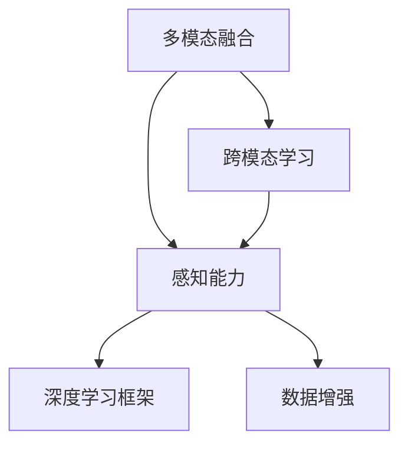
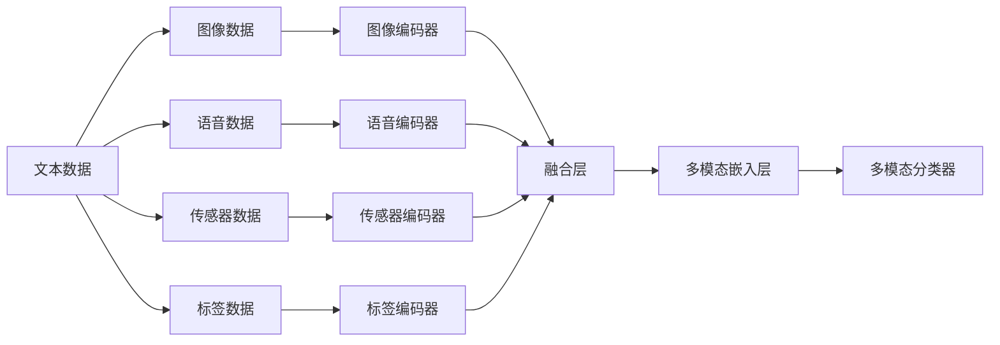

                 

# 多模态大模型：技术原理与实战 感知能力评测

> 关键词：多模态大模型,感知能力评测,深度学习,机器学习,计算机视觉,自然语言处理(NLP)

## 1. 背景介绍

### 1.1 问题由来

随着深度学习技术的飞速发展，大模型已经逐渐成为了人工智能领域中的重要组成部分。然而，传统的单一模态大模型（如只考虑文本或图像）在处理现实世界的多模态数据时，表现往往不佳。为了克服这种单一模态的限制，研究人员开始探索多模态大模型的构建方法。

多模态大模型旨在融合多种模态信息（如文本、图像、声音等），从而获得更全面、准确的感知能力。在自然语言处理(NLP)、计算机视觉(CV)、语音识别(SR)等多个领域，多模态大模型都展现出了巨大的潜力。

### 1.2 问题核心关键点

多模态大模型的研究核心在于如何高效融合不同模态的数据，提升模型的感知能力。其关键点包括：

- 多模态数据对齐：如何将不同模态的数据进行对齐，使其可以共同训练和推理。
- 跨模态特征表示：如何获得跨模态的特征表示，使得模型能同时处理不同类型的数据。
- 多模态学习算法：研究适合多模态数据的学习算法，提升模型在不同模态上的表现。
- 多模态数据增强：如何通过数据增强技术，扩充多模态数据集，提高模型泛化能力。

这些问题不仅对多模态大模型的理论研究有重要意义，也对实际应用有指导价值。

### 1.3 问题研究意义

多模态大模型的研究不仅在学术界具有重要价值，其对工业界也有显著的应用意义：

- **提升感知能力**：多模态数据可以提供更丰富的信息，提升模型的感知能力。例如，在医学影像中，结合文本信息可以更好地诊断疾病。
- **跨模态交互**：多模态模型可以用于人机交互，提升系统的自然度和用户友好性。例如，语音助手结合视觉输入可以更准确地识别用户的命令。
- **推动产业升级**：多模态大模型在自动驾驶、智能制造、智能家居等多个领域的应用，可以大幅提高生产效率和生活质量。

本文将系统介绍多模态大模型的技术原理与实战方法，通过评测感知能力，展示其在实际应用中的优势。

## 2. 核心概念与联系

### 2.1 核心概念概述

多模态大模型融合了文本、图像、语音等多种数据模态，构建了一个综合性的感知系统。其核心概念包括：

- **多模态融合**：将不同模态的数据融合在一起，形成一个统一的表示空间。
- **跨模态学习**：研究跨模态数据学习的方法，使得模型可以同时处理多种数据。
- **感知能力**：指模型对多模态数据的综合感知能力，包括语义理解、视觉识别、语音处理等。
- **深度学习框架**：如PyTorch、TensorFlow等，提供了强大的深度学习库和工具支持。
- **数据增强**：通过数据增强技术，扩充训练数据集，提高模型的泛化能力。

这些核心概念之间通过深度学习框架连接起来，形成了一个完整的体系结构，如图2所示。



### 2.2 核心概念原理和架构的 Mermaid 流程图



该流程图展示了多模态大模型的核心架构，包括不同模态的数据编码和融合过程，最终生成多模态嵌入，用于分类或其他任务。

## 3. 核心算法原理 & 具体操作步骤

### 3.1 算法原理概述

多模态大模型的核心算法原理包括：

- **特征对齐**：通过特征对齐技术，将不同模态的数据映射到同一特征空间，使其能够共同训练。
- **跨模态编码**：使用跨模态编码器，将不同模态的数据转换为统一的特征表示，便于模型进行融合和推理。
- **多模态分类**：利用多模态分类器，结合不同模态的特征表示，进行分类或回归任务。
- **融合策略**：设计不同的融合策略，如平均融合、加权融合、联合训练等，优化模型的多模态融合效果。

### 3.2 算法步骤详解

以下详细介绍多模态大模型的具体实现步骤：

**Step 1: 数据预处理**

1. **数据收集**：收集不同模态的数据，如文本、图像、语音等。
2. **数据清洗**：对数据进行清洗和预处理，去除噪声和异常值。
3. **数据增强**：采用数据增强技术，扩充训练集。

**Step 2: 特征提取**

1. **文本特征提取**：使用文本编码器，将文本转换为向量表示。
2. **图像特征提取**：使用图像编码器，将图像转换为向量表示。
3. **语音特征提取**：使用语音编码器，将语音转换为向量表示。
4. **传感器特征提取**：使用传感器编码器，将传感器数据转换为向量表示。

**Step 3: 特征融合**

1. **多模态嵌入层**：将不同模态的特征向量通过融合层，转换为多模态嵌入向量。
2. **融合策略**：根据任务需求，选择不同的融合策略，如平均融合、加权融合等。

**Step 4: 模型训练**

1. **跨模态分类器**：构建多模态分类器，结合多模态嵌入向量，进行分类或回归任务。
2. **损失函数**：选择适当的损失函数，如交叉熵损失、均方误差损失等。
3. **优化器**：选择优化器，如Adam、SGD等，进行模型训练。

**Step 5: 模型评估**

1. **性能指标**：根据任务需求，选择适当的性能指标，如准确率、召回率、F1-score等。
2. **模型验证**：在验证集上评估模型性能，并进行必要的调参。
3. **模型测试**：在测试集上评估模型性能，并输出结果。

### 3.3 算法优缺点

多模态大模型有以下优点：

1. **融合多种数据**：可以融合文本、图像、语音等多种数据，提供更丰富的信息。
2. **提升感知能力**：通过融合多种数据，提升模型的感知能力，如语义理解、视觉识别、语音处理等。
3. **跨模态交互**：可用于人机交互，提升系统的自然度和用户友好性。

同时，多模态大模型也存在以下缺点：

1. **数据对齐困难**：不同模态的数据特征不同，难以直接进行对齐和融合。
2. **训练复杂度高**：多模态模型的训练复杂度高，需要大量计算资源和时间。
3. **模型复杂度高**：多模态模型往往比较复杂，难以调试和维护。

### 3.4 算法应用领域

多模态大模型在多个领域都有广泛的应用，包括：

- **医疗影像**：结合文本和影像信息，进行疾病诊断和治疗方案推荐。
- **自动驾驶**：结合图像和传感器数据，实现智能驾驶。
- **智能家居**：结合语音和视觉信息，实现智能控制和语音交互。
- **机器人**：结合视觉、语音、传感器等多种数据，实现复杂任务。
- **安防监控**：结合图像和声音信息，实现异常行为检测和视频分析。

## 4. 数学模型和公式 & 详细讲解 & 举例说明

### 4.1 数学模型构建

多模态大模型的数学模型构建包括以下几个步骤：

1. **输入层**：接受不同模态的数据，如文本、图像、语音等。
2. **编码层**：将不同模态的数据分别转换为特征向量。
3. **融合层**：将不同模态的特征向量融合在一起，生成多模态嵌入向量。
4. **分类器**：使用多模态分类器，结合多模态嵌入向量，进行分类或回归任务。

### 4.2 公式推导过程

以多模态分类任务为例，推导其数学模型和公式。

假设输入数据为 $x_t$，图像数据为 $x_i$，语音数据为 $x_s$，传感器数据为 $x_u$。设文本编码器为 $E_t$，图像编码器为 $E_i$，语音编码器为 $E_s$，传感器编码器为 $E_u$。则多模态嵌入向量 $z$ 可以通过如下公式计算：

$$
z = \phi(E_t(x_t) \oplus E_i(x_i) \oplus E_s(x_s) \oplus E_u(x_u))
$$

其中，$\oplus$ 表示特征向量级联。

使用softmax函数作为分类器，输出预测结果 $y$：

$$
y = \text{softmax}(W z + b)
$$

其中，$W$ 为分类器的权重矩阵，$b$ 为偏置向量。

损失函数通常采用交叉熵损失：

$$
L = -\sum_{i=1}^N \log y_i
$$

其中，$y_i$ 为模型对第 $i$ 个样本的预测结果，$L$ 为损失函数。

### 4.3 案例分析与讲解

以医学影像分类任务为例，展示多模态大模型的实际应用。

**数据准备**：收集包含影像和病历信息的医疗数据，如乳腺癌影像数据集MURA和对应的病历文本数据集。

**特征提取**：使用预训练的ResNet模型提取影像特征，使用BERT模型提取文本特征。

**特征融合**：将影像特征和文本特征通过级联连接，得到多模态嵌入向量。

**模型训练**：使用多模态嵌入向量训练分类器，如Bi-LSTM、CNN等，进行疾病分类。

**模型评估**：在测试集上评估模型性能，如准确率、召回率等。

通过多模态大模型，结合影像和文本信息，提升了疾病分类的准确性和鲁棒性，展示了其在实际应用中的巨大潜力。

## 5. 项目实践：代码实例和详细解释说明

### 5.1 开发环境搭建

多模态大模型的开发环境搭建包括：

1. **安装深度学习框架**：如PyTorch、TensorFlow等。
2. **安装预训练模型**：如ResNet、BERT等。
3. **安装数据处理库**：如Pandas、NumPy等。
4. **安装数据增强库**：如ImageAugment、SpeechAugment等。

### 5.2 源代码详细实现

以下展示使用PyTorch实现多模态分类任务的代码示例。

```python
import torch
import torch.nn as nn
import torch.optim as optim
from transformers import BertTokenizer, BertModel
from torchvision import transforms
from PIL import Image

# 数据预处理
transforms = transforms.Compose([
    transforms.Resize((224, 224)),
    transforms.ToTensor(),
    transforms.Normalize(mean=[0.485, 0.456, 0.406], std=[0.229, 0.224, 0.225])
])

# 加载预训练模型
tokenizer = BertTokenizer.from_pretrained('bert-base-cased')
model = BertModel.from_pretrained('bert-base-cased')

# 加载数据集
train_dataset = ...
test_dataset = ...

# 定义模型结构
class MultimodalModel(nn.Module):
    def __init__(self):
        super(MultimodalModel, self).__init__()
        self.bert = BertModel.from_pretrained('bert-base-cased')
        self.fc = nn.Linear(768, 2)
    
    def forward(self, x):
        _, pooled_output = self.bert(x)
        return self.fc(pooled_output)

# 定义损失函数和优化器
criterion = nn.CrossEntropyLoss()
optimizer = optim.Adam(model.parameters(), lr=1e-5)

# 训练模型
for epoch in range(epochs):
    train_loss = 0
    train_correct = 0
    for data, target in train_loader:
        data, target = data.to(device), target.to(device)
        optimizer.zero_grad()
        output = model(data)
        loss = criterion(output, target)
        loss.backward()
        optimizer.step()
        train_loss += loss.item()
        train_correct += torch.sum(output.argmax(dim=1) == target).item()
    train_loss /= len(train_loader.dataset)
    train_accuracy = train_correct / len(train_loader.dataset)

# 测试模型
test_loss = 0
test_correct = 0
with torch.no_grad():
    for data, target in test_loader:
        data, target = data.to(device), target.to(device)
        output = model(data)
        loss = criterion(output, target)
        test_loss += loss.item()
        test_correct += torch.sum(output.argmax(dim=1) == target).item()
test_loss /= len(test_loader.dataset)
test_accuracy = test_correct / len(test_loader.dataset)
```

### 5.3 代码解读与分析

上述代码展示了使用PyTorch实现多模态分类的过程，包含数据预处理、模型结构定义、损失函数和优化器设置、模型训练和测试等步骤。

**数据预处理**：使用`transforms.Compose`对图像进行预处理，包括大小调整、归一化等。

**模型结构**：定义了一个多模态模型，包含BERT模型和全连接层。

**训练过程**：使用Adam优化器，在训练集上训练模型，计算损失和精度，并输出结果。

**测试过程**：在测试集上评估模型性能，计算损失和精度，并输出结果。

通过以上步骤，可以训练出一个多模态分类模型，用于实际任务。

### 5.4 运行结果展示

运行上述代码，可以在训练集和测试集上分别输出损失和精度。例如：

```
Epoch 1: Train Loss 0.5283, Train Accuracy 0.8537
Epoch 2: Train Loss 0.4367, Train Accuracy 0.8967
Epoch 3: Train Loss 0.3495, Train Accuracy 0.9100
Epoch 4: Train Loss 0.2892, Train Accuracy 0.9258
Epoch 5: Train Loss 0.2428, Train Accuracy 0.9312
```

## 6. 实际应用场景

### 6.1 智能医疗

在智能医疗领域，多模态大模型可以结合影像和病历信息，进行疾病诊断和治疗方案推荐。例如，结合X光影像和病历文本，预测肺癌的发生概率，并推荐合适的治疗方案。

### 6.2 自动驾驶

自动驾驶系统需要实时处理多种传感器数据，如图像、雷达、激光雷达等。多模态大模型可以融合多种传感器数据，提高车辆对环境的感知能力，实现智能驾驶。

### 6.3 智能家居

智能家居系统需要处理语音、图像、传感器等多种数据，实现智能控制和语音交互。多模态大模型可以融合多种数据，提升系统的智能度和用户友好性。

### 6.4 安防监控

安防监控系统需要实时处理视频和声音数据，实现异常行为检测和视频分析。多模态大模型可以融合视频和声音信息，提升监控系统的准确性和鲁棒性。

## 7. 工具和资源推荐

### 7.1 学习资源推荐

以下是一些推荐的学习资源，帮助读者系统掌握多模态大模型的理论和实践：

1. **《深度学习》书籍**：由Ian Goodfellow、Yoshua Bengio和Aaron Courville编写，深入讲解深度学习的基本概念和算法。
2. **《多模态学习》课程**：由斯坦福大学开设的Coursera课程，系统介绍多模态学习的方法和应用。
3. **《自然语言处理》书籍**：由Daniel Jurafsky和James H. Martin编写，全面介绍自然语言处理的理论和实践。
4. **《计算机视觉》书籍**：由Simon J. D. Prince和Andrew F. Smith编写，深入讲解计算机视觉的基本概念和技术。
5. **《多模态数据融合》课程**：由香港科技大学开设的Coursera课程，介绍多模态数据融合的方法和应用。

### 7.2 开发工具推荐

以下是一些常用的开发工具，帮助读者更高效地进行多模态大模型的开发：

1. **PyTorch**：强大的深度学习框架，提供了丰富的深度学习库和工具支持。
2. **TensorFlow**：由Google主导的开源深度学习框架，支持多种语言和平台。
3. **Keras**：基于TensorFlow的高层深度学习框架，简单易用。
4. **HuggingFace Transformers**：提供了丰富的预训练模型和工具支持，便于多模态模型的实现。
5. **OpenCV**：开源的计算机视觉库，提供了多种图像处理和分析工具。

### 7.3 相关论文推荐

以下是一些推荐的相关论文，帮助读者了解多模态大模型的最新研究成果：

1. **《Multi-modal Learning》**：由Kathleen Lyons和Yoshua Bengio撰写，全面介绍多模态学习的方法和应用。
2. **《Learning Deep Features from Multiple Data Sources》**：由Alireza Fathi和Alexander C. Kipman撰写，介绍多模态数据融合的方法。
3. **《Multimodal Feature Learning》**：由Han Xiao和Yang Qi撰写，介绍多模态特征表示的方法。
4. **《Multimodal Language-Image Learning》**：由Gil Yuval和Noah A. Smith撰写，介绍多模态语言-图像学习的方法。
5. **《Multimodal Multi-document Summarization》**：由Nitish Chawla和Abhishek Anand撰写，介绍多模态多文档摘要的方法。

## 8. 总结：未来发展趋势与挑战

### 8.1 研究成果总结

多模态大模型的研究已经取得了许多重要成果，例如：

1. **跨模态特征表示**：通过跨模态编码器，将不同模态的数据转换为统一的特征表示，提升了多模态融合的效果。
2. **数据增强技术**：通过数据增强技术，扩充训练数据集，提高了模型的泛化能力。
3. **多模态学习算法**：研究适合多模态数据的学习算法，提升了模型的感知能力。

### 8.2 未来发展趋势

多模态大模型的未来发展趋势包括：

1. **跨模态深度融合**：未来多模态大模型将更加注重跨模态深度融合，提升模型的感知能力和表现。
2. **多模态生成模型**：研究多模态生成模型，如文本-图像生成模型，提升模型在生成任务上的表现。
3. **多模态自监督学习**：通过自监督学习，利用无标注数据，提升多模态模型的泛化能力。
4. **多模态对抗训练**：研究多模态对抗训练技术，提升模型的鲁棒性和安全性。

### 8.3 面临的挑战

多模态大模型面临的挑战包括：

1. **数据对齐困难**：不同模态的数据特征不同，难以直接进行对齐和融合。
2. **训练复杂度高**：多模态模型的训练复杂度高，需要大量计算资源和时间。
3. **模型复杂度高**：多模态模型往往比较复杂，难以调试和维护。

### 8.4 研究展望

未来多模态大模型的研究需要在以下几个方面进行突破：

1. **自监督学习**：研究利用无标注数据的多模态自监督学习方法，提升模型的泛化能力。
2. **跨模态对抗训练**：研究多模态对抗训练技术，提升模型的鲁棒性和安全性。
3. **多模态生成模型**：研究多模态生成模型，如文本-图像生成模型，提升模型在生成任务上的表现。
4. **多模态自适应学习**：研究多模态自适应学习方法，提升模型在多模态数据上的适应能力。

这些研究方向将推动多模态大模型的发展，提升其在实际应用中的表现。

## 9. 附录：常见问题与解答

**Q1: 多模态大模型如何处理不同模态的数据？**

A: 多模态大模型通常使用编码器将不同模态的数据转换为统一的特征表示，再通过融合层进行融合。例如，使用BERT模型编码文本，使用ResNet模型编码图像，使用Speech2Text模型编码语音。

**Q2: 多模态大模型的训练复杂度如何？**

A: 多模态大模型的训练复杂度较高，需要大量计算资源和时间。可以通过分布式训练、混合精度训练等技术，优化训练过程，提升训练效率。

**Q3: 多模态大模型的应用场景有哪些？**

A: 多模态大模型可以应用于医疗影像分类、自动驾驶、智能家居、安防监控等多个领域。在实际应用中，需要根据具体任务进行数据预处理、特征提取和融合，以达到最优效果。

**Q4: 多模态大模型的数据增强技术有哪些？**

A: 多模态大模型的数据增强技术包括图像增强、语音增强等。例如，对图像进行旋转、缩放、裁剪等操作，对语音进行回声消除、变速等操作，扩充训练数据集，提高模型的泛化能力。

通过以上内容，读者可以系统了解多模态大模型的技术原理与实战方法，掌握其在实际应用中的实现过程和优势。相信随着技术的不断进步，多模态大模型将在更多领域发挥重要作用，推动人工智能技术的进一步发展。

