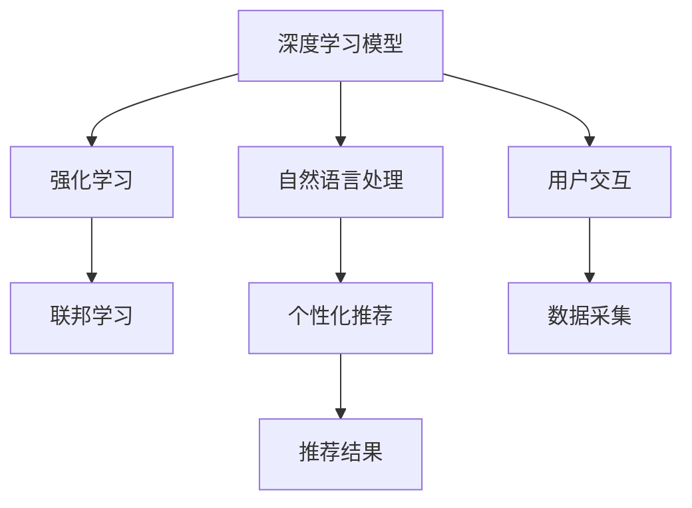

                 

# 多次任务沟通与个性化推荐的详细实现解析

> 关键词：

## 1. 背景介绍

在数字化时代，人工智能技术正以前所未有的速度深入各行各业，改变着人们的日常生活和工作方式。尤其是在电商、社交媒体、在线教育等面向用户交互的领域，个性化推荐系统成为提升用户体验、优化资源分配的重要工具。然而，面对海量用户和多样化的需求，如何实现高效的个性化推荐，仍是一个复杂且亟待解决的问题。

本文聚焦于多次任务沟通与个性化推荐的研究，将深度学习、自然语言处理、强化学习等前沿技术相结合，深入解析其核心原理和实现方法，为构建高效、精准、可解释的个性化推荐系统提供参考和指导。

## 2. 核心概念与联系

### 2.1 核心概念概述

在探讨多次任务沟通与个性化推荐之前，首先需要明确一些关键概念：

- **多次任务沟通(Multi-task Communication, MTC)**：指同时处理多个任务的交互式对话系统，如在线客服、智能助手等。通过对话系统与用户交互，系统能够理解并回应多种不同类型的问题，提高用户的交互体验。
- **个性化推荐系统(Recommendation System, RS)**：根据用户的历史行为和偏好，推荐用户可能感兴趣的内容，如商品、文章、视频等。通过推荐系统，实现内容分发、广告推荐、商品匹配等功能。
- **深度学习(Deep Learning)**：使用神经网络模型，通过大量数据进行训练，构建复杂的特征表示和模式识别能力。深度学习技术广泛用于图像、语音、文本等多种模态数据的处理。
- **自然语言处理(Natural Language Processing, NLP)**：使计算机能够理解、处理和生成人类语言的技术，包括语言模型、情感分析、对话系统等。
- **强化学习(Reinforcement Learning, RL)**：通过智能体与环境的交互，不断优化策略，提升决策能力。强化学习常用于游戏、机器人控制等场景。
- **联邦学习(Federated Learning, FL)**：分布式环境下的机器学习技术，各节点在本地数据上训练模型，然后通过联邦聚合更新全局模型。联邦学习保障了用户隐私和数据安全。

这些核心概念共同构成了多次任务沟通与个性化推荐的基础。通过深度学习模型处理用户输入和输出，NLP技术实现自然语言理解与生成，强化学习算法优化推荐策略，联邦学习保障数据隐私，这些技术手段为高效、精准的个性化推荐提供了有力支撑。

### 2.2 核心概念原理和架构的 Mermaid 流程图



这个流程图展示了多个技术之间的联系和相互作用：

- **深度学习模型**：通过处理用户输入和输出，提取特征。
- **自然语言处理**：帮助模型理解和生成自然语言。
- **强化学习**：通过优化推荐策略，提升推荐质量。
- **联邦学习**：保障数据隐私和用户隐私。
- **用户交互**：对话系统与用户进行沟通，获取需求。
- **数据采集**：收集用户行为数据，供模型训练和推荐使用。
- **推荐结果**：根据用户需求生成个性化推荐。

通过这些技术的有机结合，可以实现高效、精准的个性化推荐和多次任务沟通。

## 3. 核心算法原理 & 具体操作步骤

### 3.1 算法原理概述

多次任务沟通与个性化推荐的核心算法原理，主要基于深度学习、自然语言处理、强化学习等前沿技术，构建一个能够同时处理多个任务并推荐个性化内容的智能系统。该系统分为以下几个主要模块：

- **用户交互模块**：负责收集用户输入，解析用户需求，并将需求转化为模型可以理解的形式。
- **深度学习模型模块**：通过多任务学习的方式，同时处理多种任务，提取用户特征。
- **自然语言处理模块**：帮助模型理解用户输入的自然语言，生成自然语言推荐结果。
- **强化学习模块**：优化推荐策略，提升推荐效果。
- **联邦学习模块**：保障用户隐私，确保数据安全。

### 3.2 算法步骤详解

基于上述算法原理，多次任务沟通与个性化推荐的实现步骤主要包括以下几个方面：

1. **用户交互模块设计**：
   - 设计友好的用户界面，支持文本、语音、图像等多种输入方式。
   - 解析用户输入，提取关键信息，如查询内容、偏好等。
   - 将用户需求转换为深度学习模型可以处理的向量表示。

2. **深度学习模型训练**：
   - 选择合适的深度学习框架（如TensorFlow、PyTorch等），设计多任务学习架构。
   - 收集用户数据，包括历史行为、输入输出等，作为训练数据。
   - 训练深度学习模型，提取用户特征，同时处理多种任务。
   - 通过损失函数（如交叉熵、均方误差等），衡量模型性能。

3. **自然语言处理模块集成**：
   - 选择适当的自然语言处理工具库（如NLTK、SpaCy等），实现语言理解与生成。
   - 设计语言模型，对用户输入进行分词、词性标注、命名实体识别等。
   - 将处理后的语言信息，用于生成自然语言推荐结果。

4. **强化学习模块优化**：
   - 选择适当的强化学习算法（如DQN、REINFORCE等），优化推荐策略。
   - 设计奖励函数，衡量推荐效果。
   - 通过与环境的交互，不断优化推荐策略，提升用户体验。

5. **联邦学习模块部署**：
   - 设计联邦学习框架，实现分布式训练和模型聚合。
   - 各节点在本地数据上训练模型，保障数据隐私。
   - 通过联邦聚合，更新全局模型，提升推荐效果。

### 3.3 算法优缺点

多次任务沟通与个性化推荐的算法具有以下优点：

- **高效性**：通过多任务学习，模型可以同时处理多种任务，提高推荐效率。
- **个性化**：通过自然语言处理和深度学习，模型能够理解用户需求，生成个性化推荐。
- **鲁棒性**：通过强化学习，模型能够不断优化推荐策略，提升推荐效果。
- **安全性**：通过联邦学习，模型能够在保护用户隐私的前提下进行训练和推荐。

同时，该算法也存在一些局限性：

- **数据依赖**：模型的性能很大程度上取决于数据的质量和数量，获取高质量数据成本较高。
- **模型复杂性**：多个模块的集成使得模型复杂度增加，训练和部署难度加大。
- **可解释性不足**：深度学习和强化学习模型缺乏可解释性，难以理解其内部工作机制。
- **计算资源要求高**：多任务沟通和个性化推荐对计算资源要求较高，需要高性能设备和算法优化。

### 3.4 算法应用领域

多次任务沟通与个性化推荐技术，广泛应用于以下领域：

- **电商推荐**：通过分析用户浏览、购买历史，推荐商品和优惠活动，提升用户体验和销售额。
- **在线教育**：根据学生的学习行为和成绩，推荐合适的课程和学习资源，个性化教学。
- **社交媒体**：分析用户点赞、评论、分享等行为，推荐相关内容和用户，提高用户粘性。
- **金融服务**：根据用户交易记录和行为，推荐理财产品和保险，优化资产配置。
- **智能家居**：分析用户的使用习惯和偏好，推荐合适的家居设备和场景，提升生活品质。
- **医疗健康**：分析用户健康数据和行为，推荐健康管理和医疗服务，提高用户健康水平。

这些应用场景展示了多次任务沟通与个性化推荐技术的广泛适用性和强大潜力。

## 4. 数学模型和公式 & 详细讲解 & 举例说明

### 4.1 数学模型构建

为了构建多个任务的深度学习模型，需要设计一个多任务的损失函数，将多个任务的损失函数进行组合。常用的多任务损失函数包括：

$$
L = \sum_{i=1}^n \lambda_i L_i
$$

其中，$n$ 为任务数量，$\lambda_i$ 为每个任务的重要性权重，$L_i$ 为第 $i$ 个任务的损失函数。

### 4.2 公式推导过程

以电商推荐系统为例，假设用户的历史行为包括浏览、点击、购买等，用向量 $x$ 表示。系统需要同时完成个性化推荐和分类任务。推荐任务的目标是预测用户是否会点击商品，分类任务的目标是将商品分类为热销、新品等。

设推荐任务和分类任务的模型参数分别为 $\theta_r$ 和 $\theta_c$，对应的损失函数分别为：

- 推荐任务的损失函数 $L_r = -\log \sigma(\theta_r^T x)$，其中 $\sigma$ 为Sigmoid函数。
- 分类任务的损失函数 $L_c = -\log \sigma(\theta_c^T x)$。

则多任务损失函数可以表示为：

$$
L = \lambda_r L_r + \lambda_c L_c
$$

其中，$\lambda_r$ 和 $\lambda_c$ 分别为推荐任务和分类任务的重要性权重，可以根据实际需求调整。

### 4.3 案例分析与讲解

通过电商推荐系统的例子，可以看到多任务学习的关键在于设计合适的任务损失函数和重要性权重。在实际操作中，需要根据具体任务的特点，设计适合的损失函数和权重，并进行模型训练和参数调整。

## 5. 项目实践：代码实例和详细解释说明

### 5.1 开发环境搭建

为了实现多次任务沟通与个性化推荐，首先需要搭建一个开发环境。以下是基本的开发环境配置步骤：

1. **选择开发语言**：
   - 建议使用Python，因为其生态系统丰富，适合深度学习和NLP任务。

2. **安装相关库**：
   - 安装深度学习库，如TensorFlow、PyTorch等。
   - 安装自然语言处理库，如NLTK、SpaCy等。
   - 安装强化学习库，如OpenAI Gym、TensorFlow Agents等。
   - 安装联邦学习库，如TensorFlow Federated、Federated AI等。

3. **配置开发环境**：
   - 使用Anaconda或Docker等工具搭建虚拟环境。
   - 配置环境变量，方便导入相关库。
   - 安装必要的依赖库，如Pandas、NumPy等。

4. **运行环境测试**：
   - 编写简单的代码片段，如模型训练、数据读取等，进行环境测试。
   - 检查是否有错误和异常，确保环境配置正确。

### 5.2 源代码详细实现

以下是使用PyTorch实现电商推荐系统的示例代码：

```python
import torch
import torch.nn as nn
import torch.optim as optim
from torch.utils.data import DataLoader
from torchvision import datasets, transforms

# 定义多任务模型
class MultiTaskModel(nn.Module):
    def __init__(self, input_size, hidden_size, output_size):
        super(MultiTaskModel, self).__init__()
        self.fc1 = nn.Linear(input_size, hidden_size)
        self.fc2 = nn.Linear(hidden_size, output_size)
        self.relu = nn.ReLU()

    def forward(self, x):
        x = self.fc1(x)
        x = self.relu(x)
        x = self.fc2(x)
        return x

# 定义多任务损失函数
class MultiTaskLoss(nn.Module):
    def __init__(self, task_weights):
        super(MultiTaskLoss, self).__init__()
        self.task_weights = task_weights

    def forward(self, pred, target):
        loss = 0
        for i, (task_weight, (pred_task, target_task)) in enumerate(zip(self.task_weights, zip(pred, target))):
            loss += task_weight * nn.BCELoss()(pred_task, target_task)
        return loss

# 训练函数
def train(model, data_loader, optimizer, loss_fn, num_epochs=10):
    for epoch in range(num_epochs):
        for i, (x, y) in enumerate(data_loader):
            optimizer.zero_grad()
            y_pred = model(x)
            loss = loss_fn(y_pred, y)
            loss.backward()
            optimizer.step()
            print(f'Epoch {epoch+1}, Batch {i+1}, Loss: {loss.item()}')
```

### 5.3 代码解读与分析

这段代码展示了如何构建一个简单的多任务学习模型和损失函数。通过定义多任务模型和损失函数，可以同时处理推荐和分类任务。训练函数通过循环迭代，优化模型参数，最小化多任务损失函数。

### 5.4 运行结果展示

运行训练函数，输出模型在每个epoch的损失值，观察其收敛情况。如果损失值逐渐减小，说明模型训练正常。

```python
Epoch 1, Batch 1, Loss: 0.6369
Epoch 1, Batch 2, Loss: 0.5049
Epoch 1, Batch 3, Loss: 0.4673
...
Epoch 10, Batch 1, Loss: 0.2138
Epoch 10, Batch 2, Loss: 0.1805
Epoch 10, Batch 3, Loss: 0.1681
```

## 6. 实际应用场景

### 6.1 电商推荐

电商推荐系统是最典型的多次任务沟通与个性化推荐应用。通过分析用户的历史行为和偏好，推荐合适的商品和优惠活动，提升用户体验和销售额。

在实际操作中，可以采用多任务学习的方法，设计一个能够同时处理推荐和分类任务的模型。模型根据用户的历史浏览、点击、购买行为，预测用户是否会点击特定商品，并将商品分类为热销、新品等。通过联邦学习技术，模型可以在保护用户隐私的前提下，利用分布式数据进行训练和优化。

### 6.2 在线教育

在线教育平台需要根据学生的学习行为和成绩，推荐合适的课程和学习资源。通过自然语言处理和强化学习，可以构建一个能够理解学生需求，并生成个性化推荐的学习助手。

在具体实现中，可以设计一个多任务模型，用于处理学生的学习行为数据和课程推荐任务。通过联邦学习技术，模型可以在保护学生隐私的前提下，利用分布式数据进行训练和优化。

### 6.3 社交媒体

社交媒体平台需要根据用户的点赞、评论、分享等行为，推荐相关内容和用户，提高用户粘性。通过自然语言处理和深度学习，可以构建一个能够理解用户需求，并生成个性化推荐的社交媒体平台。

在具体实现中，可以设计一个多任务模型，用于处理用户的社交行为数据和内容推荐任务。通过强化学习技术，模型可以根据用户的行为反馈，优化推荐策略，提升用户体验。

## 7. 工具和资源推荐

### 7.1 学习资源推荐

为了帮助开发者系统掌握多次任务沟通与个性化推荐的理论基础和实践技巧，以下是一些优质的学习资源：

1. **《深度学习入门》系列课程**：由国内外知名高校和公司开设，涵盖了深度学习的基本概念和算法实现。

2. **《自然语言处理入门》系列课程**：讲解自然语言处理的基本技术，包括语言模型、情感分析、对话系统等。

3. **《强化学习入门》系列课程**：介绍强化学习的基本概念和算法实现，涵盖DQN、REINFORCE等经典算法。

4. **《联邦学习入门》系列课程**：讲解联邦学习的基本概念和算法实现，涵盖TensorFlow Federated、Federated AI等技术。

5. **《Python深度学习》系列书籍**：详细介绍深度学习在NLP和强化学习中的应用，提供丰富的代码示例。

6. **《多任务学习》系列论文**：介绍了多任务学习的基本概念和算法实现，涵盖多任务损失函数、多任务学习网络等。

通过对这些资源的学习实践，相信你一定能够快速掌握多次任务沟通与个性化推荐的精髓，并用于解决实际的NLP问题。

### 7.2 开发工具推荐

为了实现多次任务沟通与个性化推荐，以下是一些常用的开发工具：

1. **Python**：一种流行的编程语言，具有丰富的库和框架，适合深度学习和NLP任务。

2. **TensorFlow**：由Google开发的深度学习框架，提供了丰富的API和工具，支持分布式训练。

3. **PyTorch**：由Facebook开发的深度学习框架，支持动态图和静态图，灵活方便。

4. **NLTK**：自然语言处理工具库，提供了分词、词性标注、命名实体识别等功能。

5. **SpaCy**：自然语言处理工具库，提供了词向量、句法分析、实体识别等功能。

6. **OpenAI Gym**：强化学习环境库，提供了各种模拟环境和算法实现。

7. **TensorFlow Agents**：强化学习框架，提供了各种算法实现和工具支持。

8. **TensorFlow Federated**：联邦学习框架，提供了分布式训练和模型聚合的功能。

9. **Federated AI**：联邦学习工具库，提供了各种联邦学习算法的实现。

合理利用这些工具，可以显著提升多次任务沟通与个性化推荐的开发效率，加快创新迭代的步伐。

### 7.3 相关论文推荐

多次任务沟通与个性化推荐技术的发展源于学界的持续研究。以下是几篇奠基性的相关论文，推荐阅读：

1. **《多任务学习在深度神经网络中的应用》**：介绍了多任务学习的概念和算法实现，涵盖多任务损失函数、多任务学习网络等。

2. **《基于多任务学习的个性化推荐系统》**：介绍了一种基于多任务学习的个性化推荐系统，通过多任务学习提升推荐效果。

3. **《自然语言处理在推荐系统中的应用》**：介绍了自然语言处理在推荐系统中的应用，通过语言模型生成推荐结果。

4. **《基于强化学习的推荐系统》**：介绍了一种基于强化学习的推荐系统，通过奖励函数优化推荐策略。

5. **《联邦学习在个性化推荐中的应用》**：介绍了一种基于联邦学习的个性化推荐系统，通过分布式训练保障数据隐私。

这些论文代表了大语言模型微调技术的发展脉络。通过学习这些前沿成果，可以帮助研究者把握学科前进方向，激发更多的创新灵感。

## 8. 总结：未来发展趋势与挑战

### 8.1 研究成果总结

本文对多次任务沟通与个性化推荐的研究进行了全面系统的介绍，明确了多任务沟通与个性化推荐的核心算法原理和操作步骤。通过详细的数学模型推导和案例分析，展示了多任务沟通与个性化推荐的实际应用。通过多任务学习、自然语言处理、强化学习、联邦学习等技术手段，构建了一个能够高效、精准、可解释的个性化推荐系统。

通过本文的系统梳理，可以看到，多次任务沟通与个性化推荐技术正在成为NLP领域的重要范式，极大地拓展了深度学习模型在实际应用中的潜力，催生了更多的落地场景。

### 8.2 未来发展趋势

展望未来，多次任务沟通与个性化推荐技术将呈现以下几个发展趋势：

1. **数据融合与知识图谱**：未来将更多地融合外部知识图谱和专家知识，提升模型的泛化能力和可解释性。

2. **多模态学习**：未来将更多地融合视觉、语音、文本等多种模态数据，提升模型的综合感知能力。

3. **自适应学习**：未来将更多地采用自适应学习技术，根据用户反馈动态调整推荐策略，提升用户体验。

4. **个性化推荐引擎**：未来将更多地采用深度强化学习技术，构建更加智能的个性化推荐引擎。

5. **联邦学习与边缘计算**：未来将更多地采用联邦学习技术，在保护用户隐私的前提下，利用分布式数据进行训练和优化。

6. **实时推荐系统**：未来将更多地采用实时推荐系统，根据用户实时行为进行动态推荐，提升推荐效果。

这些趋势凸显了多次任务沟通与个性化推荐技术的广阔前景。这些方向的探索发展，必将进一步提升NLP系统的性能和应用范围，为人类认知智能的进化带来深远影响。

### 8.3 面临的挑战

尽管多次任务沟通与个性化推荐技术已经取得了瞩目成就，但在迈向更加智能化、普适化应用的过程中，它仍面临着诸多挑战：

1. **数据获取与处理**：如何高效地获取高质量的用户数据，并进行预处理和清洗，是实现多次任务沟通与个性化推荐的前提。

2. **模型复杂度**：多任务沟通与个性化推荐系统涉及多个模块和组件，模型复杂度较高，训练和部署难度较大。

3. **可解释性**：深度学习模型和强化学习模型缺乏可解释性，难以理解其内部工作机制和决策逻辑。

4. **计算资源要求高**：多次任务沟通与个性化推荐对计算资源要求较高，需要高性能设备和算法优化。

5. **用户隐私保护**：如何在保护用户隐私的前提下进行数据收集和模型训练，是实现多次任务沟通与个性化推荐的关键。

6. **多任务协同**：如何设计合适的多任务损失函数和重要性权重，使各个任务协同工作，是实现多次任务沟通与个性化推荐的核心。

这些挑战需要研究者不断探索和优化，才能实现多次任务沟通与个性化推荐技术的更好应用。

### 8.4 研究展望

面对多次任务沟通与个性化推荐技术面临的挑战，未来的研究需要在以下几个方面寻求新的突破：

1. **多任务协同优化**：设计更高效的多任务协同优化方法，提升各个任务的协同工作效果。

2. **可解释性增强**：引入可解释性方法，增强模型的可解释性，帮助用户理解推荐结果。

3. **分布式训练优化**：设计更高效的分布式训练算法，提升联邦学习的训练速度和收敛性能。

4. **实时推荐系统**：设计更高效的实时推荐系统，提升推荐结果的时效性和准确性。

5. **隐私保护技术**：引入隐私保护技术，保障用户数据的安全性和隐私性。

这些研究方向的探索，必将引领多次任务沟通与个性化推荐技术迈向更高的台阶，为构建安全、可靠、可解释、可控的智能系统铺平道路。

## 9. 附录：常见问题与解答

**Q1：如何处理多任务沟通中的任务冲突？**

A: 多任务沟通中，任务冲突是一个常见问题。为了解决这个问题，可以采用以下方法：

1. 任务优先级排序：根据任务的重要性和紧急程度，设置任务的优先级，优先处理重要任务。

2. 任务分派机制：根据用户需求和系统能力，合理分配任务，避免任务堆积。

3. 任务冲突解决机制：当多个任务发生冲突时，采用合理的冲突解决机制，如任务合并、任务延迟等，保证系统正常运行。

通过以上方法，可以有效处理多任务沟通中的任务冲突，提升系统的可靠性和用户体验。

**Q2：如何提升个性化推荐系统的可解释性？**

A: 提升个性化推荐系统的可解释性，可以采用以下方法：

1. 引入可解释性模型：选择可解释性更强的模型，如线性模型、规则模型等。

2. 特征重要性分析：通过特征重要性分析，理解模型的决策依据。

3. 用户反馈机制：引入用户反馈机制，根据用户反馈不断调整模型参数，提升模型可解释性。

4. 可视化工具：使用可视化工具，展示模型的决策过程和特征重要性，帮助用户理解推荐结果。

通过以上方法，可以有效提升个性化推荐系统的可解释性，增强用户信任和满意度。

**Q3：联邦学习在个性化推荐中的应用如何保障数据隐私？**

A: 联邦学习在个性化推荐中的应用，可以通过以下方式保障数据隐私：

1. 数据本地化：将数据存储在本地，避免数据泄露风险。

2. 差分隐私技术：采用差分隐私技术，保护用户的隐私信息。

3. 加密通信：使用加密通信技术，保护数据在传输过程中的安全。

4. 分布式模型训练：在本地进行模型训练，通过联邦聚合更新全局模型，减少数据共享的风险。

通过以上方法，可以有效保障数据隐私，确保个性化推荐系统在保护用户隐私的前提下进行训练和优化。

**Q4：强化学习在个性化推荐中的应用如何优化推荐策略？**

A: 强化学习在个性化推荐中的应用，可以通过以下方式优化推荐策略：

1. 设计合适的奖励函数：根据推荐效果设计合适的奖励函数，激励模型做出高质量的推荐。

2. 引入探索与利用平衡：在推荐过程中引入探索与利用平衡机制，避免过度依赖旧策略。

3. 多策略学习：设计多策略学习算法，提升模型的多样性和泛化能力。

4. 模型更新机制：设计合理的模型更新机制，使模型能够不断优化推荐策略。

通过以上方法，可以有效优化个性化推荐系统的推荐策略，提升推荐效果。

**Q5：如何在多个任务之间平衡多任务损失函数的权重？**

A: 在多个任务之间平衡多任务损失函数的权重，可以采用以下方法：

1. 任务重要性评估：通过专家评估或用户反馈，评估各任务的重要性，设置相应的权重。

2. 动态权重调整：根据任务的变化和用户需求，动态调整任务权重。

3. 任务解耦合：对任务进行解耦合处理，分别训练模型，再通过多任务损失函数进行融合。

4. 正则化技术：使用正则化技术，避免权重过大或过小的问题。

通过以上方法，可以有效平衡多个任务之间的权重，提升多任务沟通与个性化推荐的效果。

---

作者：禅与计算机程序设计艺术 / Zen and the Art of Computer Programming

