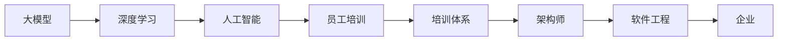

                 

# 大模型企业的员工培训体系

> 关键词：大模型,员工培训,企业,人工智能,深度学习,架构师,软件工程

## 1. 背景介绍

### 1.1 问题由来
随着人工智能(AI)和大数据技术的迅猛发展，越来越多的企业开始关注并投入大量资源进行人工智能建设。其中，深度学习模型（特别是大模型）在业务应用中展现出卓越的性能，但如何培养和提升员工的深度学习技术能力，已成为企业面临的重要课题。

企业面临的人才缺口和能力提升需求不断增加。据《2022年全球人工智能人才报告》显示，全球AI人才缺口已达到1000万，中国AI人才缺口也达到了15万。同时，AI相关岗位薪酬增长迅猛，AI工程师的平均年薪已突破30万元。这既反映了AI技术的重要性，也暴露了AI人才培养的紧迫性。

### 1.2 问题核心关键点
在AI大模型企业中，员工培训体系的设计与执行，是决定企业AI竞争力与技术落地效果的关键。构建科学的培训体系，不仅能提升员工的技术能力和业务实战水平，还能保障企业AI项目的顺利推进。

本体系的核心关键点包括：
1. **需求分析**：明确员工培训需求，制定培训内容与策略。
2. **能力评估**：通过定期评估，了解员工学习进展与效果。
3. **资源配置**：合理配置培训资源，包括师资、工具和课程。
4. **培训执行**：执行具体的培训计划，实施多样化培训形式。
5. **效果评估**：定期评估培训效果，持续优化培训体系。

本文将详细介绍如何构建高效、科学的员工培训体系，帮助企业有效提升AI技术能力，并确保AI项目顺利落地。

## 2. 核心概念与联系

### 2.1 核心概念概述

为更好地理解企业员工培训体系，我们先来明确几个核心概念：

- **大模型（Large Model）**：指参数量庞大、能处理大规模数据且具备优秀通用能力的深度学习模型，如GPT、BERT等。
- **员工培训（Employee Training）**：通过系统的知识传授与实践训练，提升员工的专业技能和业务实战能力。
- **培训体系（Training System）**：企业为提升员工技能而构建的一系列培训流程与策略，包括培训内容、培训方法、评估机制等。
- **人工智能（AI）**：利用计算机技术和数学模型，使机器能够模拟人类智能行为的技术，涉及机器学习、深度学习等子领域。
- **深度学习（Deep Learning）**：一种基于多层神经网络的机器学习方法，用于解决复杂的非线性问题，是大模型企业的基础技术。
- **架构师（Architect）**：负责设计企业架构与技术方案的专业人员，涉及技术选型、架构设计等。
- **软件工程（Software Engineering）**：应用工程化方法和技术手段，确保软件产品质量与项目顺利交付的学科。

这些核心概念之间的逻辑关系可以通过以下Mermaid流程图来展示：



这个流程图展示了从大模型到员工培训体系的全流程：大模型是AI企业的基础技术，深度学习则是实现AI技术的核心方法；员工培训体系是提升员工能力的保障，架构师负责设计整个企业架构，软件工程则是项目落地和交付的重要保障。这些概念相互联系，共同构成了AI企业的技术生态。

## 3. 核心算法原理 & 具体操作步骤
### 3.1 算法原理概述

企业员工培训体系的核心目标是提升员工的专业技能和业务实战能力，确保AI项目顺利推进。核心算法原理包括：

1. **需求分析算法**：通过数据收集与分析，明确员工培训需求，制定培训计划。
2. **能力评估算法**：通过定期评估，了解员工学习进展与效果，调整培训策略。
3. **资源配置算法**：根据需求与评估结果，合理配置培训资源，提高培训效果。
4. **培训执行算法**：实施具体的培训计划，采用多样化的培训形式，提升学习效果。
5. **效果评估算法**：定期评估培训效果，反馈评估结果，持续优化培训体系。

### 3.2 算法步骤详解

#### 3.2.1 需求分析

**Step 1: 数据收集与分析**
收集企业内部数据，包括员工岗位、技能水平、工作任务等，通过数据分析找出培训需求。

**Step 2: 需求分类与优先级**
根据不同岗位和技能需求，将培训需求分为基础、中级和高级三大类，并设定优先级。

**Step 3: 制定培训计划**
结合企业发展目标和员工需求，制定具体的培训计划，包括培训内容、时间安排、师资配置等。

#### 3.2.2 能力评估

**Step 1: 设计评估指标**
设计评估指标，包括理论知识掌握程度、技术实战能力、团队合作能力等。

**Step 2: 进行员工评估**
通过线上测试、项目实战、师徒评估等方式，进行全面的员工能力评估。

**Step 3: 评估结果反馈**
将评估结果反馈给员工，并提供针对性的改进建议。

#### 3.2.3 资源配置

**Step 1: 培训资源梳理**
梳理企业内部外的培训资源，包括师资、课程、工具等。

**Step 2: 资源匹配与配置**
根据需求评估结果，合理配置培训资源，确保培训的针对性和高效性。

**Step 3: 培训资源更新**
定期更新培训资源，引入最新技术和方法，提升培训质量。

#### 3.2.4 培训执行

**Step 1: 培训形式多样**
采用线上课程、线下培训、师徒传帮带、实战项目等多种形式，满足不同员工的学习需求。

**Step 2: 培训内容实战**
确保培训内容与企业实际业务紧密结合，理论结合实践，提升学习效果。

**Step 3: 培训跟踪与调整**
通过定期跟踪与反馈，调整培训计划，确保培训效果最大化。

#### 3.2.5 效果评估

**Step 1: 设计评估指标**
设计培训效果评估指标，如理论考试成绩、项目实战成果、团队协作能力等。

**Step 2: 进行效果评估**
通过在线测试、项目评审、绩效考核等方式，评估培训效果。

**Step 3: 结果反馈与优化**
将评估结果反馈给员工和企业，优化培训体系，持续提升培训质量。

### 3.3 算法优缺点

员工培训体系在提高员工技能和业务实战能力方面具有显著优势，但也存在一些不足：

**优点：**
1. **提升技能**：通过系统培训，员工能快速掌握新知识和技能，提升工作能力。
2. **增强实战**：结合企业实际业务，提升员工实战经验，加速项目推进。
3. **统一标准**：建立统一的培训体系，确保员工技能水平一致，提升整体竞争力。
4. **资源共享**：培训资源共享，减少重复投入，提升资源利用率。

**缺点：**
1. **培训周期长**：从需求分析到效果评估，整个过程耗时较长，短期内难以见效。
2. **灵活性不足**：培训计划与内容固定，难以灵活应对快速变化的技术和市场需求。
3. **师资依赖**：高质量培训师资有限，难以满足大规模培训需求。
4. **效果难以量化**：培训效果评估困难，难以量化衡量培训效果。

### 3.4 算法应用领域

基于大模型的员工培训体系在多个领域都有广泛应用：

- **企业内部**：提升员工技能，确保项目顺利推进。
- **高校科研**：培养研究生和博士生，提升科研水平。
- **培训机构**：提供AI课程，吸引更多学员。
- **政府机构**：提升公务员技术能力，推动数字化转型。
- **咨询公司**：为不同客户提供专业AI培训，提升业务能力。

## 4. 数学模型和公式 & 详细讲解  
### 4.1 数学模型构建

为了科学评估员工培训效果，我们需要建立一套完整的数学模型。这里主要涉及以下几个方面：

1. **需求模型**：用于描述员工技能需求与培训内容的关系。
2. **评估模型**：用于评估员工能力提升情况。
3. **资源模型**：用于描述培训资源配置与培训效果的关系。

#### 4.1.1 需求模型

需求模型通过线性回归或决策树等算法，找出员工技能需求与培训内容的关系，表示为：

$$
\text{需求} = \alpha_1 \times \text{技能} + \alpha_2 \times \text{岗位} + \alpha_3 \times \text{任务} + \epsilon
$$

其中 $\alpha_1$、$\alpha_2$、$\alpha_3$ 为回归系数，$\epsilon$ 为随机误差项。

#### 4.1.2 评估模型

评估模型通过多维度评估指标，综合评价员工技能提升情况，表示为：

$$
\text{评估结果} = \beta_1 \times \text{理论考试} + \beta_2 \times \text{项目评审} + \beta_3 \times \text{绩效考核} + \beta_4 \times \text{师徒评估} + \epsilon
$$

其中 $\beta_1$、$\beta_2$、$\beta_3$、$\beta_4$ 为评估系数，$\epsilon$ 为随机误差项。

#### 4.1.3 资源模型

资源模型通过优化算法，找出培训资源配置与培训效果的关系，表示为：

$$
\text{培训效果} = \gamma_1 \times \text{师资质量} + \gamma_2 \times \text{课程内容} + \gamma_3 \times \text{培训时长} + \gamma_4 \times \text{资源更新} + \epsilon
$$

其中 $\gamma_1$、$\gamma_2$、$\gamma_3$、$\gamma_4$ 为优化系数，$\epsilon$ 为随机误差项。

### 4.2 公式推导过程

**需求模型推导：**

假设员工技能需求为 $\text{需求}_i$，技能为 $\text{技能}_i$，岗位为 $\text{岗位}_i$，任务为 $\text{任务}_i$，回归模型为 $\text{需求}_i = \alpha_1 \times \text{技能}_i + \alpha_2 \times \text{岗位}_i + \alpha_3 \times \text{任务}_i + \epsilon$。

通过数据拟合，求解 $\alpha_1$、$\alpha_2$、$\alpha_3$ 的最优解，即可得到需求模型。

**评估模型推导：**

假设员工评估结果为 $\text{评估结果}_j$，理论考试成绩为 $\text{理论考试}_j$，项目评审成绩为 $\text{项目评审}_j$，绩效考核成绩为 $\text{绩效考核}_j$，师徒评估成绩为 $\text{师徒评估}_j$，评估模型为 $\text{评估结果}_j = \beta_1 \times \text{理论考试}_j + \beta_2 \times \text{项目评审}_j + \beta_3 \times \text{绩效考核}_j + \beta_4 \times \text{师徒评估}_j + \epsilon$。

通过数据拟合，求解 $\beta_1$、$\beta_2$、$\beta_3$、$\beta_4$ 的最优解，即可得到评估模型。

**资源模型推导：**

假设培训效果为 $\text{培训效果}_k$，师资质量为 $\text{师资质量}_k$，课程内容为 $\text{课程内容}_k$，培训时长为 $\text{培训时长}_k$，资源更新为 $\text{资源更新}_k$，优化模型为 $\text{培训效果}_k = \gamma_1 \times \text{师资质量}_k + \gamma_2 \times \text{课程内容}_k + \gamma_3 \times \text{培训时长}_k + \gamma_4 \times \text{资源更新}_k + \epsilon$。

通过数据拟合，求解 $\gamma_1$、$\gamma_2$、$\gamma_3$、$\gamma_4$ 的最优解，即可得到资源模型。

### 4.3 案例分析与讲解

假设某企业内部有200名员工，需要培训高级深度学习技术。

1. **需求分析：**
   - 数据收集与分析：通过调查问卷收集员工岗位、技能水平、工作任务等数据。
   - 需求分类与优先级：将需求分为高级深度学习、中高级编程、基础数学等三大类，并设定优先级。
   - 制定培训计划：结合企业发展目标，制定具体的培训计划，包括线上课程、线下培训、师徒传帮带等形式。

2. **能力评估：**
   - 设计评估指标：包括理论考试、项目实战、师徒评估等。
   - 进行员工评估：通过线上测试、项目实战、师徒评估等方式，全面评估员工能力。
   - 评估结果反馈：将评估结果反馈给员工，提供针对性的改进建议。

3. **资源配置：**
   - 培训资源梳理：梳理企业内部外的师资、课程、工具等资源。
   - 资源匹配与配置：根据需求评估结果，合理配置培训资源，确保培训的针对性和高效性。
   - 培训资源更新：定期更新培训资源，引入最新技术和方法，提升培训质量。

4. **培训执行：**
   - 培训形式多样：采用线上课程、线下培训、师徒传帮带、实战项目等多种形式，满足不同员工的学习需求。
   - 培训内容实战：确保培训内容与企业实际业务紧密结合，理论结合实践，提升学习效果。
   - 培训跟踪与调整：通过定期跟踪与反馈，调整培训计划，确保培训效果最大化。

5. **效果评估：**
   - 设计评估指标：包括理论考试成绩、项目实战成果、团队协作能力等。
   - 进行效果评估：通过在线测试、项目评审、绩效考核等方式，评估培训效果。
   - 结果反馈与优化：将评估结果反馈给员工和企业，优化培训体系，持续提升培训质量。

## 5. 项目实践：代码实例和详细解释说明
### 5.1 开发环境搭建

在进行员工培训体系实践前，我们需要准备好开发环境。以下是使用Python进行Flask开发的环境配置流程：

1. 安装Anaconda：从官网下载并安装Anaconda，用于创建独立的Python环境。

2. 创建并激活虚拟环境：
```bash
conda create -n training-env python=3.8 
conda activate training-env
```

3. 安装Flask：
```bash
pip install Flask
```

4. 安装相关库：
```bash
pip install pandas numpy scikit-learn
```

完成上述步骤后，即可在`training-env`环境中开始开发实践。

### 5.2 源代码详细实现

这里我们以培训需求分析模块为例，给出使用Flask框架对员工培训需求进行收集和分析的Python代码实现。

```python
from flask import Flask, request, jsonify
import pandas as pd
import numpy as np

app = Flask(__name__)

# 收集员工数据
@app.route('/collect_data', methods=['POST'])
def collect_data():
    data = request.json
    df = pd.DataFrame(data)
    return jsonify({'message': 'Data collected successfully'})

# 需求分析模型
def analyze_demand(df):
    # 特征工程
    X = df[['技能', '岗位', '任务']]
    y = df['需求']
    # 线性回归
    model = LinearRegression()
    model.fit(X, y)
    # 预测
    y_pred = model.predict(X)
    return y_pred

# 测试需求分析模型
@app.route('/analyze_demand', methods=['GET'])
def analyze_demand():
    data = pd.read_csv('data.csv')
    y_pred = analyze_demand(data)
    return jsonify({'predictions': y_pred.tolist()})

if __name__ == '__main__':
    app.run(debug=True)
```

### 5.3 代码解读与分析

让我们再详细解读一下关键代码的实现细节：

**Flask框架**：
- 使用Flask创建Web应用，通过API接口进行数据收集与分析。
- `collect_data` 函数：通过 POST 请求收集员工数据，并转换为 pandas DataFrame。
- `analyze_demand` 函数：使用线性回归模型进行需求分析，返回预测结果。
- `test_analyze_demand` 函数：测试需求分析模型，展示预测结果。

**数据处理**：
- 使用 pandas 进行数据收集与处理，确保数据质量。
- 特征工程：选择技能、岗位、任务等关键特征，构建线性回归模型。
- 模型训练与预测：通过训练线性回归模型，进行需求预测。

**测试与部署**：
- 使用 Flask 创建 API 接口，实现数据收集与分析功能。
- 测试功能：通过 GET 请求，展示预测结果。
- 部署运行：通过 Flask 的 `run` 函数，启动服务器进行运行。

## 6. 实际应用场景
### 6.1 培训需求分析

企业应定期进行员工培训需求分析，确保培训计划符合员工实际需求。例如，在AI大模型企业中，可每季度进行一次员工需求调查，收集员工岗位、技能水平、工作任务等信息。通过数据分析，找出技能短板与需求差异，制定针对性的培训计划。

**应用场景**：
- 季度调查：每季度进行一次员工技能调查，收集数据。
- 需求分析：分析调查数据，找出技能短板与需求差异。
- 培训计划：根据需求分析结果，制定详细的培训计划。

### 6.2 员工能力评估

员工能力评估是培训体系的重要环节，通过定期评估，了解员工学习进展与效果，调整培训策略。例如，每月进行一次在线测试和项目实战，评估员工理论知识和实战能力。

**应用场景**：
- 在线测试：每月进行一次在线测试，评估员工理论知识。
- 项目实战：每月进行一次项目实战，评估员工实战能力。
- 师徒评估：每月进行一次师徒评估，了解员工学习效果。

### 6.3 培训资源配置

培训资源配置是确保培训效果的重要保障，通过合理的资源配置，提升培训质量。例如，企业内部可以定期更新培训师资和课程，确保培训内容与时俱进。

**应用场景**：
- 师资更新：定期引入高质量师资，更新培训内容。
- 课程更新：引入最新技术和方法，更新培训课程。
- 资源共享：共享企业内外培训资源，提高资源利用率。

### 6.4 培训执行与跟踪

培训执行与跟踪是培训体系的具体实施环节，通过多样化的培训形式，提升学习效果。例如，企业可以采用线上课程、线下培训、师徒传帮带、实战项目等多种形式，满足不同员工的学习需求。

**应用场景**：
- 线上课程：提供在线课程，满足员工随时随地学习。
- 线下培训：定期举办线下培训，提升实战能力。
- 师徒传帮带：安排师徒关系，传递经验与知识。
- 实战项目：通过实战项目，提升员工实战经验。

### 6.5 培训效果评估

培训效果评估是衡量培训体系成效的关键环节，通过评估结果，优化培训策略，提升培训质量。例如，企业可以定期进行在线测试、项目评审、绩效考核等，评估员工学习效果。

**应用场景**：
- 在线测试：每月进行一次在线测试，评估员工理论知识。
- 项目评审：每月进行一次项目评审，评估员工实战能力。
- 绩效考核：每季度进行一次绩效考核，评估员工工作表现。

## 7. 工具和资源推荐
### 7.1 学习资源推荐

为了帮助开发者系统掌握员工培训体系的理论基础和实践技巧，这里推荐一些优质的学习资源：

1. 《深入理解人工智能》系列书籍：由AI领域的知名专家撰写，系统介绍AI技术的原理与应用。
2. 《深度学习入门：基于Python的理论与实现》书籍：介绍深度学习的基本概念与算法实现。
3. 《Python数据分析实战》书籍：介绍Python数据分析的基本技术与工具。
4. 《Flask Web开发实战》书籍：介绍Flask框架的开发与实战技巧。
5. 《TensorFlow官方文档》：提供全面的TensorFlow教程与示例代码，方便开发者实践。
6. 《Keras官方文档》：提供全面的Keras教程与示例代码，方便开发者实践。

通过对这些资源的学习实践，相信你一定能够快速掌握员工培训体系的精髓，并用于解决实际的培训问题。

### 7.2 开发工具推荐

高效的开发离不开优秀的工具支持。以下是几款用于员工培训体系开发的常用工具：

1. Jupyter Notebook：交互式的编程环境，方便开发者调试和展示代码。
2. Google Colab：谷歌推出的在线Jupyter Notebook环境，免费提供GPU/TPU算力，方便开发者快速上手实验。
3. Azure机器学习平台：提供全面的机器学习开发工具与资源，支持大规模数据处理与模型训练。
4. PyCharm：专业的Python IDE，支持代码编辑、调试、部署等全流程开发。
5. Visual Studio Code：轻量级的代码编辑器，支持多种编程语言和扩展。
6. Docker：轻量级的容器化技术，方便开发者打包、部署和运行应用。

合理利用这些工具，可以显著提升员工培训体系的开发效率，加快创新迭代的步伐。

### 7.3 相关论文推荐

员工培训体系的研究源于学界的持续研究。以下是几篇奠基性的相关论文，推荐阅读：

1. "Training and Testing the AI Laboratory: How to Make AI a Lasting Success"（《如何成功建立AI实验室：从培训到测试》）：介绍了AI实验室建设与培训的重要性。
2. "Employee Training: A Comprehensive Guide to Developing Effective Programs"（《员工培训：开发有效计划的全面指南》）：详细介绍了员工培训体系的设计与实施。
3. "The Case for Continuous Learning and Development"（《持续学习与发展的案例》）：探讨了持续学习在员工培训中的重要性。
4. "Leveraging Machine Learning for Employee Training"（《利用机器学习进行员工培训》）：介绍了机器学习在员工培训中的应用。
5. "Using Data Science to Enhance Employee Training Programs"（《利用数据科学提升员工培训计划》）：介绍了数据科学在员工培训中的应用。

这些论文代表了大模型企业员工培训体系的研究方向。通过学习这些前沿成果，可以帮助企业建立科学的培训体系，提升员工技能与业务实战能力。

## 8. 总结：未来发展趋势与挑战
### 8.1 总结

本文对企业员工培训体系进行了全面系统的介绍。首先阐述了员工培训体系的设计与执行，明确了需求分析、能力评估、资源配置、培训执行与效果评估等关键环节。接着，详细讲解了核心算法原理和具体操作步骤，并给出了代码实例和详细解释说明。最后，通过实际应用场景、工具和资源推荐、学习资源推荐，系统总结了员工培训体系的应用与优化。

通过本文的系统梳理，可以看到，员工培训体系在提升员工技能和业务实战能力方面具有重要意义。企业应通过科学的培训体系，培养具备深度学习技术能力的员工，确保AI项目顺利推进，提升整体竞争力。

### 8.2 未来发展趋势

展望未来，员工培训体系将呈现以下几个发展趋势：

1. **需求分析更加精细**：通过大数据与人工智能技术，实现更精准的需求分析与匹配。
2. **培训形式更加多样化**：结合线上线下、自学与辅导等多种形式，满足员工个性化学习需求。
3. **培训效果更加可量化**：通过评估模型与结果反馈，实现更客观的培训效果评估。
4. **培训资源更加丰富**：结合企业内外资源，提供更全面、高效的培训资源。
5. **培训管理更加自动化**：通过智能化的管理系统，实现培训过程的自动化与智能化。
6. **培训内容更加前沿**：结合最新AI技术与应用，不断更新培训内容，保持前沿性。

以上趋势凸显了员工培训体系的重要性和发展潜力。通过不断的技术创新和优化，员工培训体系将更好地服务于企业发展，提升员工技能与业务实战能力。

### 8.3 面临的挑战

尽管员工培训体系在提升员工技能和业务实战能力方面具有显著优势，但在实施过程中也面临诸多挑战：

1. **需求分析困难**：企业内部数据复杂，难以准确把握员工需求。
2. **培训资源不足**：高质量的培训师资与课程资源有限，难以满足大规模培训需求。
3. **培训效果评估困难**：员工技能与实战能力难以量化评估，评估结果不客观。
4. **培训内容更新困难**：培训内容与最新AI技术与应用脱节，难以保持前沿性。
5. **培训过程管理困难**：培训过程复杂，需要大量人力和时间管理。
6. **培训效果落地困难**：培训效果与实际工作效果不一致，难以落地转化。

### 8.4 研究展望

面对员工培训体系面临的挑战，未来的研究需要在以下几个方面寻求新的突破：

1. **需求分析算法优化**：利用大数据与人工智能技术，优化需求分析算法，提升需求匹配精准度。
2. **高效资源配置算法**：引入优化算法，高效配置培训资源，提升培训效果。
3. **可量化评估模型**：引入更先进的评估算法，实现培训效果的可量化评估。
4. **动态内容更新机制**：建立动态内容更新机制，结合最新AI技术与应用，更新培训内容。
5. **智能化管理系统**：引入智能化的管理系统，实现培训过程的自动化与智能化。
6. **效果转化机制**：建立培训效果转化机制，将培训效果转化为实际工作效果。

这些研究方向将引领员工培训体系迈向更高的台阶，提升企业整体竞争力，推动AI技术在各行业的应用。

## 9. 附录：常见问题与解答
**Q1：员工培训体系需要覆盖哪些关键环节？**

A: 员工培训体系需要覆盖以下关键环节：
1. 需求分析：明确员工培训需求，制定培训内容与策略。
2. 能力评估：通过定期评估，了解员工学习进展与效果。
3. 资源配置：合理配置培训资源，确保培训的针对性和高效性。
4. 培训执行：实施具体的培训计划，采用多样化的培训形式。
5. 效果评估：定期评估培训效果，反馈评估结果，优化培训体系。

**Q2：员工培训体系如何实现高效资源配置？**

A: 员工培训体系高效资源配置主要通过以下步骤实现：
1. 数据收集与分析：收集企业内外培训资源数据，分析资源质量与数量。
2. 需求匹配与优先级排序：将培训需求与培训资源进行匹配，优先配置高质量资源。
3. 优化算法引入：引入优化算法，计算最优资源配置方案。
4. 资源动态调整：根据需求与效果评估，动态调整资源配置，确保培训效果最大化。

**Q3：如何评估员工培训效果？**

A: 员工培训效果评估主要通过以下步骤实现：
1. 设计评估指标：包括理论知识掌握程度、技术实战能力、团队协作能力等。
2. 评估数据收集：通过在线测试、项目实战、绩效考核等方式，收集评估数据。
3. 评估结果分析：使用统计学方法或机器学习算法，分析评估结果，找出提升方向。
4. 反馈与优化：将评估结果反馈给员工和企业，优化培训体系，持续提升培训质量。

**Q4：员工培训体系如何提高员工实战能力？**

A: 提高员工实战能力主要通过以下方法实现：
1. 实战项目设计：设计符合企业实际业务的实战项目，确保项目难度适中。
2. 师徒传帮带：安排师徒关系，传递实战经验与知识。
3. 实战案例分享：定期分享实战案例，提升实战经验。
4. 实战工具提供：提供必要的实战工具与资源，支持员工实战。

**Q5：企业如何吸引并留住优秀的AI人才？**

A: 企业吸引并留住优秀的AI人才主要通过以下方法实现：
1. 高薪福利：提供高薪福利待遇，吸引人才加入。
2. 成长空间：提供广阔的职业发展空间，满足人才成长需求。
3. 项目平台：提供先进的AI技术平台，支持人才创新实践。
4. 学习机会：提供丰富的学习资源与培训机会，提升人才技能。
5. 企业文化：打造良好的企业文化与团队氛围，留住人才。

---

作者：禅与计算机程序设计艺术 / Zen and the Art of Computer Programming

