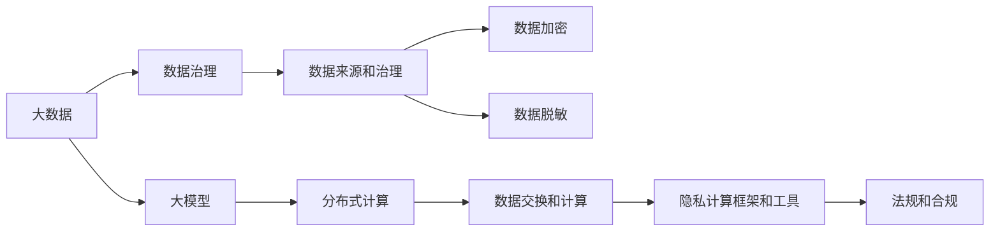

                 

# 大模型企业的隐私计算策略

> 关键词：隐私计算, 大数据, 大模型, 隐私保护, 数据治理, 分布式计算

## 1. 背景介绍

### 1.1 问题由来
随着大数据时代的到来，企业数据规模日益膨胀，数据资源成为企业获取竞争优势的重要资产。然而，大规模数据处理和存储的需求，也带来了严峻的隐私保护挑战。如何在大数据应用中实现数据价值的最大化，同时保障用户隐私和数据安全，是当下亟需解决的难题。

数据隐私保护技术，旨在以最少化数据泄露风险的前提下，最大化数据利用的价值。随着人工智能和大数据技术的融合，隐私保护技术的重要性愈发凸显。隐私计算通过在不泄露数据原貌的情况下，实现数据的有效计算，成为新一代隐私保护技术的代表。

大模型企业利用大数据驱动的AI技术，在业务发展、智能决策等方面具有显著优势。但同时，模型的训练和应用涉及海量敏感数据，如何兼顾业务发展和隐私保护，成为大模型企业需要面对的关键问题。因此，本文将详细探讨大模型企业在隐私计算方面的策略，以期在保障隐私的前提下，充分发挥大模型的价值。

### 1.2 问题核心关键点
本节将重点介绍大模型企业在隐私计算策略中需要关注的几个核心关键点：

- 数据来源和治理：如何获取、存储和管理数据，确保数据质量和安全。
- 数据隐私保护：如何对敏感数据进行脱敏、加密等处理，保护用户隐私。
- 数据交换和计算：如何在保证隐私的前提下，实现数据的有效计算和共享。
- 隐私计算框架和工具：如何选择和使用隐私计算技术，保障计算过程的隐私性。
- 法规和合规：如何在隐私计算过程中符合国家法律法规和行业标准。

这些关键点涉及企业的数据隐私治理和计算安全，是构建大模型隐私计算策略的基础。通过深入探讨这些核心问题，本文将为读者提供一个全面、系统的隐私计算策略框架。

## 2. 核心概念与联系

### 2.1 核心概念概述

为更好地理解大模型企业的隐私计算策略，本节将介绍几个关键概念：

- 隐私计算(Privacy-Preserving Computation)：在不泄露数据原貌的情况下，通过技术手段对数据进行处理，实现数据计算和分析。
- 大数据(大数据)：指体量巨大、速度极快、类型多样的数据集合，通常包括结构化数据、非结构化数据和半结构化数据。
- 数据治理(Data Governance)：通过一系列策略、技术和工具，对数据进行采集、存储、管理、分析和应用，确保数据的质量、安全和合规。
- 大模型(Large Model)：指具有亿级以上参数的深度学习模型，如BERT、GPT-3等，用于处理复杂数据结构和复杂问题。
- 分布式计算(Distributed Computing)：利用多台计算机协同工作，提高计算效率和数据处理能力。
- 数据加密(Data Encryption)：通过特定的算法，对数据进行编码处理，确保数据在传输和存储过程中的安全性。
- 数据脱敏(Data Masking)：对数据中的敏感信息进行屏蔽或模糊处理，减少隐私泄露风险。
- 差分隐私(Differential Privacy)：通过在数据分析中引入噪声，保护个体隐私，同时保证分析结果的可靠性。
- 多方安全计算(MPC)：通过多台计算机协同工作，在不共享数据的情况下，实现数据的联合计算。

这些概念通过隐私计算的逻辑关系进行了展示，如下：



以上流程图展示了隐私计算过程中各环节之间的逻辑关系：

1. 大数据处理：收集和管理海量数据。
2. 数据治理：确保数据的准确性、完整性和一致性。
3. 数据加密和脱敏：对敏感数据进行保护，减少隐私泄露风险。
4. 大模型训练：利用大模型处理复杂数据结构和复杂问题。
5. 分布式计算：提升数据处理和计算能力。
6. 数据交换和计算：在不共享数据的情况下，实现数据的有效计算和共享。
7. 隐私计算框架和工具：提供隐私计算的解决方案，保障计算过程的隐私性。
8. 法规和合规：确保数据处理符合法律规定，保障用户隐私和数据安全。

## 3. 核心算法原理 & 具体操作步骤
### 3.1 算法原理概述

隐私计算通过在数据计算过程中引入隐私保护机制，确保数据的安全和隐私性。其核心思想在于，在不泄露数据原貌的情况下，对数据进行计算和分析。大模型企业在进行隐私计算时，通常遵循以下步骤：

1. 数据收集和预处理：对原始数据进行清洗和标准化，去除噪声和异常值。
2. 数据加密和脱敏：对敏感数据进行加密和脱敏处理，确保数据在传输和存储过程中的安全性。
3. 数据分割和交换：将数据分割为多个部分，通过安全的方式进行数据交换。
4. 大模型训练和计算：在大模型中加载处理后的数据，进行模型训练和计算。
5. 结果汇总和解密：汇总计算结果，解密后得到最终的分析结果。

隐私计算主要包括以下几类技术：

- 差分隐私：在数据处理中引入噪声，保护个体隐私。
- 同态加密：对数据进行加密，计算结果自动解密，确保数据隐私性。
- 多方安全计算(MPC)：多台计算机协同工作，在不共享数据的情况下，实现数据的联合计算。
- 联邦学习：多个计算节点通过分布式方式，共同训练模型，确保数据不离开本地。

### 3.2 算法步骤详解

以下以联邦学习为例，详细介绍大模型企业在隐私计算中常用的联邦学习算法：

**Step 1: 数据收集和预处理**
- 收集来自不同用户或机构的数据集。
- 对数据进行清洗和标准化，去除噪声和异常值。
- 对敏感数据进行加密和脱敏处理，确保数据在传输和存储过程中的安全性。

**Step 2: 模型分割和交换**
- 将数据分割为多个部分，每个部分只包含部分数据。
- 将分割后的数据部分安全地交换到其他计算节点，确保数据在传输过程中的隐私性。

**Step 3: 模型训练**
- 在各个计算节点上，使用本地数据训练模型，生成模型参数。
- 使用安全通信协议，交换模型参数的差异。
- 在中央服务器上汇总模型参数，生成全局模型。

**Step 4: 结果汇总和解密**
- 对全局模型进行汇总和优化，生成最终的训练结果。
- 解密计算结果，得到最终的分析结果。

### 3.3 算法优缺点

隐私计算在大数据和大模型的应用中具有显著优势：

优点：
1. 数据隐私保护：通过加密和脱敏等技术，确保数据在计算过程中的隐私性。
2. 分布式计算：通过分布式计算，提高数据处理和计算效率。
3. 法规合规：确保数据处理符合法律法规，保障用户隐私和数据安全。

缺点：
1. 计算复杂度高：隐私计算通常需要复杂的算法和技术，计算开销较大。
2. 通信开销大：数据分割和交换过程中，需要大量通信，影响计算效率。
3. 安全风险高：隐私计算技术复杂，存在一定的安全漏洞和风险。

### 3.4 算法应用领域

隐私计算在大模型企业的数据处理和计算中，有广泛的应用前景。具体应用场景包括：

- 用户行为分析：通过对用户数据的隐私计算，分析用户行为和偏好，实现个性化推荐。
- 金融风控：利用用户数据进行模型训练，实现金融风险控制和欺诈检测。
- 医疗健康：对患者数据进行隐私计算，实现疾病诊断和治疗方案优化。
- 智能制造：对生产数据进行隐私计算，实现智能制造和流程优化。
- 智慧城市：对城市数据进行隐私计算，实现智能交通、环境监测等。
- 社交媒体：对用户数据进行隐私计算，实现内容推荐和用户画像分析。

以上应用场景展示了隐私计算在大模型企业中的广泛应用，从各个领域的数据处理和计算中，充分体现了隐私计算的价值。

## 4. 数学模型和公式 & 详细讲解  
### 4.1 数学模型构建

隐私计算涉及多个数学模型和算法，本节将详细介绍其中的差分隐私模型：

差分隐私的目标是在保护个体隐私的同时，保证分析结果的可靠性。差分隐私模型可以表示为：

$$
\epsilon-DP: \forall S, P(\mathcal{D} \in S) \leq e^{\epsilon} \cdot P(\mathcal{D} \in S')
$$

其中 $\mathcal{D}$ 表示原始数据集，$S$ 表示任意一个子集，$S'$ 表示与 $S$ 相邻的另一个子集，$\epsilon$ 表示隐私保护参数。差分隐私模型要求，对于任意两个相邻的数据集，加入噪声后的概率比不超过 $e^{\epsilon}$。

差分隐私的具体实现，通常包括以下几个步骤：

1. 定义噪声分布：选择适当的噪声分布，如拉普拉斯分布、高斯分布等。
2. 引入噪声：在数据分析过程中引入噪声，保护个体隐私。
3. 计算结果：使用原始数据和噪声数据进行计算，生成分析结果。
4. 隐私评估：评估分析结果的隐私保护水平，确保符合差分隐私要求。

### 4.2 公式推导过程

以下是差分隐私的详细推导过程：

假设原始数据集 $\mathcal{D}$，每个记录包含 $n$ 个属性。差分隐私的目标是保护个体隐私，同时保证分析结果的可靠性。

定义噪声变量 $\xi$，假设其服从拉普拉斯分布，即：

$$
\xi \sim L(\Delta)
$$

其中 $\Delta$ 表示噪声的尺度参数。

对于任意一个子集 $S$，计算 $S$ 在原始数据集 $\mathcal{D}$ 中的概率为：

$$
P(S|\mathcal{D}) = \frac{count(S)}{n}
$$

其中 $count(S)$ 表示子集 $S$ 中记录的数量。

在引入噪声后，计算 $S$ 在噪声数据集 $\mathcal{D} + \xi$ 中的概率为：

$$
P(S|\mathcal{D} + \xi) = \frac{count(S) + count(S \cap S') + count(S')}{n}
$$

其中 $S'$ 表示与 $S$ 相邻的子集。

引入噪声后，概率比为：

$$
\frac{P(S|\mathcal{D})}{P(S|\mathcal{D} + \xi)} = \frac{count(S)}{count(S) + count(S \cap S') + count(S')} \cdot \frac{n}{n + 1}
$$

根据差分隐私的定义，概率比应不超过 $e^{\epsilon}$：

$$
\frac{count(S)}{count(S) + count(S \cap S') + count(S')} \cdot \frac{n}{n + 1} \leq e^{\epsilon}
$$

进行化简，得到：

$$
\frac{count(S \cap S')}{count(S) + count(S \cap S') + count(S')} \geq 1 - \frac{1}{e^{\epsilon}}
$$

定义 $t = \frac{1}{n} \cdot count(S)$，则上式可以写为：

$$
t + \frac{t}{n} \cdot \Delta \geq t - t(1 - \frac{1}{e^{\epsilon}})
$$

进一步化简，得到：

$$
\Delta \geq \frac{1}{1 - \frac{1}{e^{\epsilon}}}
$$

由于 $\Delta$ 表示噪声的尺度参数，因此差分隐私的参数 $\epsilon$ 与噪声尺度 $\Delta$ 成正比。

### 4.3 案例分析与讲解

假设有一家大模型企业，需要分析用户对某产品的评分数据。为了保护用户隐私，企业使用了差分隐私算法进行数据处理。

具体步骤如下：

1. 定义噪声分布：选择拉普拉斯分布，噪声尺度参数为 $\Delta$。
2. 引入噪声：在数据处理过程中，对每个记录加入噪声，生成噪声数据集。
3. 计算结果：使用原始数据和噪声数据进行计算，生成分析结果。
4. 隐私评估：评估分析结果的隐私保护水平，确保符合差分隐私要求。

例如，当 $\epsilon = 1$ 时，假设原始数据集中有 1000 个记录，其中 800 个记录评分为 4，200 个记录评分为 3。

引入噪声后，计算 $S = \{4\}$ 在噪声数据集中的概率为：

$$
P(S|\mathcal{D} + \xi) = \frac{800 + 200 + 1}{1000 + 1} \approx 0.79
$$

原始数据中 $S$ 的概率为 $0.8$，因此概率比为：

$$
\frac{0.8}{0.79} \approx 1.025
$$

由于 $1.025 < e^{1} = 2.71828$，因此符合差分隐私要求。

## 5. 项目实践：代码实例和详细解释说明
### 5.1 开发环境搭建

在进行隐私计算实践前，我们需要准备好开发环境。以下是使用Python进行联邦学习开发的流程：

1. 安装Anaconda：从官网下载并安装Anaconda，用于创建独立的Python环境。

2. 创建并激活虚拟环境：
```bash
conda create -n federated-learning python=3.8 
conda activate federated-learning
```

3. 安装PyTorch：根据CUDA版本，从官网获取对应的安装命令。例如：
```bash
conda install pytorch torchvision torchaudio cudatoolkit=11.1 -c pytorch -c conda-forge
```

4. 安装Federated Learning库：
```bash
pip install fl-estimator
```

5. 安装各类工具包：
```bash
pip install numpy pandas scikit-learn matplotlib tqdm jupyter notebook ipython
```

完成上述步骤后，即可在`federated-learning`环境中开始联邦学习实践。

### 5.2 源代码详细实现

下面以联邦学习为例，给出使用Federated Learning库进行模型微调的PyTorch代码实现。

首先，定义模型和优化器：

```python
from fl_estimator.python_estimator import FLModel

class MyModel(FLModel):
    def __init__(self):
        super().__init__()
        self.model = MyModel()
    
    def forward(self, x, y=None):
        return self.model(x, y)
    
    def predict(self, x):
        return self.model.predict(x)
    
    def train_step(self, batch):
        inputs, labels = batch
        optimizer.zero_grad()
        outputs = self.model(inputs)
        loss = loss_fn(outputs, labels)
        loss.backward()
        optimizer.step()
    
    def train_epoch(self, dataset, batch_size, num_epochs):
        for epoch in range(num_epochs):
            for batch in tqdm(dataset, desc='Training'):
                self.train_step(batch)
    
    def evaluate(self, dataset, batch_size):
        correct = 0
        total = 0
        for batch in tqdm(dataset, desc='Evaluating'):
            inputs, labels = batch
            outputs = self.model(inputs)
            predictions = outputs.argmax(dim=1)
            total += labels.size(0)
            correct += (predictions == labels).sum().item()
        accuracy = correct / total
        return accuracy
```

然后，定义数据集和模型：

```python
from torch.utils.data import DataLoader
from torchvision import datasets, transforms

transform = transforms.Compose([
    transforms.ToTensor(),
    transforms.Normalize((0.5,), (0.5,))
])

train_dataset = datasets.MNIST('data', train=True, download=True, transform=transform)
test_dataset = datasets.MNIST('data', train=False, transform=transform)

train_loader = DataLoader(train_dataset, batch_size=batch_size, shuffle=True)
test_loader = DataLoader(test_dataset, batch_size=batch_size, shuffle=False)
```

接着，定义训练和评估函数：

```python
from fl_estimator.python_estimator import FLClient

class FLClientAdapter(FLClient):
    def __init__(self, server_ip, server_port, my_model, batch_size, num_epochs):
        super().__init__(server_ip, server_port)
        self.my_model = my_model
        self.batch_size = batch_size
        self.num_epochs = num_epochs

    def train(self, train_loader, test_loader):
        self.my_model.train_epoch(train_loader, self.batch_size, self.num_epochs)
        return self.my_model.evaluate(test_loader, self.batch_size)

    def push_weights(self):
        self.server.push_weights(self.my_model)

    def pull_weights(self):
        self.my_model = self.server.pull_weights()
```

最后，启动训练流程并在测试集上评估：

```python
from fl_server.python_server import FLServer

server = FLServer(server_ip, server_port)
client = FLClientAdapter(server_ip, server_port, model, batch_size, num_epochs)

server.train(train_loader, test_loader, client.train, client.push_weights, client.pull_weights)
```

以上就是使用Federated Learning库进行模型微调的完整代码实现。可以看到，Federated Learning库提供了简单易用的API，通过少量代码即可实现联邦学习模型的训练和评估。

### 5.3 代码解读与分析

让我们再详细解读一下关键代码的实现细节：

**MyModel类**：
- 继承自Federated Learning库的FLModel类。
- 实现了模型的前向传播、预测、训练步骤、训练周期、评估等功能。

**train_step方法**：
- 实现模型的单批次训练，使用反向传播更新模型参数，并在每个批次结束时记录梯度。

**train_epoch方法**：
- 实现模型的训练周期，使用循环迭代的方式，对每个批次进行训练，并记录训练过程中的各项指标。

**train方法**：
- 实现模型的训练，调用train_epoch方法对训练集进行训练，并在训练结束后进行评估。

**push_weights和pull_weights方法**：
- 实现模型的同步更新，在每个训练周期结束后，将模型参数同步到服务器端，并从服务器端拉取更新后的模型参数。

**FLClientAdapter类**：
- 实现Federated Learning的客户端逻辑，继承自Federated Learning库的FLClient类。
- 实现了模型的训练、模型参数的推送和拉取。

通过以上代码，我们构建了一个基于联邦学习的模型微调系统，实现了模型的分布式训练和参数同步。可以看到，Federated Learning库提供了完整的API和框架，可以大大简化联邦学习模型的开发过程。

## 6. 实际应用场景
### 6.1 智能制造

在大规模制造企业中，利用隐私计算技术，可以实现对生产数据的隐私保护和智能分析。企业可以利用联邦学习技术，对来自多个工厂的生产数据进行联合训练，优化生产流程，提高产品质量。

具体而言，各工厂将生产数据本地存储，通过联邦学习技术，对数据进行分割和交换，共同训练优化模型。模型训练过程中，各工厂只传递参数差异，不共享原始数据，确保数据隐私。最终，企业可以基于联合训练的模型，实现对生产数据的智能分析和优化。

### 6.2 智慧城市

智慧城市建设中，涉及大量的公共数据，包括交通流量、环境监测、公共安全等。通过隐私计算技术，可以有效保护这些数据的隐私性，同时实现数据的共享和利用。

具体而言，各城市可以利用联邦学习技术，对本地数据进行联合训练，生成智慧城市模型。模型训练过程中，各城市只传递参数差异，不共享原始数据，确保数据隐私。最终，企业可以基于联合训练的模型，实现对公共数据的智能分析和决策支持。

### 6.3 金融风控

金融行业涉及大量用户数据，包括交易记录、信用评分等敏感信息。通过隐私计算技术，可以有效保护用户隐私，同时实现数据的联合分析和风控决策。

具体而言，金融机构可以利用联邦学习技术，对来自多个用户的交易数据进行联合训练，生成风控模型。模型训练过程中，各金融机构只传递参数差异，不共享原始数据，确保用户隐私。最终，企业可以基于联合训练的模型，实现对交易数据的智能分析和风险控制。

### 6.4 未来应用展望

随着隐私计算技术的发展，未来在大模型企业中的应用将更加广泛，具体展望如下：

1. 隐私计算的自动化：未来隐私计算技术将更加自动化，通过AI算法实现隐私计算的自动化部署和优化。

2. 隐私计算的集成化：隐私计算技术将与其他AI技术进行更深入的融合，如知识图谱、强化学习等，实现更高效、更全面的数据处理和分析。

3. 隐私计算的普适化：隐私计算技术将逐步普及到各个行业领域，实现跨领域、跨地域的数据共享和分析。

4. 隐私计算的可解释性：隐私计算技术将更加注重模型的可解释性，通过可解释性技术，使模型的决策过程更加透明、可信任。

5. 隐私计算的安全性：隐私计算技术将更加注重安全性，通过多重加密、差分隐私等手段，保护数据的隐私和安全。

6. 隐私计算的扩展性：隐私计算技术将更加注重扩展性，通过分布式计算、边缘计算等技术，实现更大规模、更高效的数据处理和分析。

以上展望展示了隐私计算技术在大模型企业中的广泛应用前景，相信随着技术的不断进步，隐私计算将在大模型企业中发挥越来越重要的作用。

## 7. 工具和资源推荐
### 7.1 学习资源推荐

为了帮助开发者系统掌握大模型企业在隐私计算方面的策略，这里推荐一些优质的学习资源：

1. 《联邦学习与隐私保护》系列博文：由联邦学习专家撰写，深入浅出地介绍了联邦学习的基本概念、实现方法和应用场景。

2. 《差分隐私与数据安全》课程：由隐私计算专家开设的隐私保护课程，涵盖差分隐私、同态加密、多方安全计算等多个主题，帮助开发者全面掌握隐私计算技术。

3. 《隐私计算与大数据》书籍：系统介绍了隐私计算技术在大数据中的应用，包括隐私计算的基本原理、算法和技术。

4. 《TensorFlow Federated》官方文档：TensorFlow联邦学习库的官方文档，提供了丰富的联邦学习样例代码，是联邦学习开发的重要参考。

5. 《隐私计算开源项目》：汇集了多个隐私计算开源项目，包括差分隐私、同态加密、多方安全计算等，提供了丰富的隐私计算实现。

通过对这些资源的学习实践，相信你一定能够快速掌握大模型企业在隐私计算方面的策略，并用于解决实际的隐私保护问题。
###  7.2 开发工具推荐

高效的开发离不开优秀的工具支持。以下是几款用于隐私计算开发的常用工具：

1. TensorFlow Federated：谷歌开发的联邦学习库，提供了丰富的API和工具，支持联邦学习模型的开发和训练。

2. PyTorch Federated：Facebook开发的联邦学习库，提供了灵活的API和算法，支持多种联邦学习模型的开发。

3. FL Estimator：Apache开发的联邦学习框架，提供了简单易用的API，支持联邦学习模型的分布式训练和参数同步。

4. FL Privacy Library：微软开发的隐私计算库，提供了差分隐私、同态加密等隐私计算工具，支持隐私计算模型的开发和应用。

5. WebAssembly：WebAssembly是一种低级字节码格式，可以在浏览器和服务器端运行，适合分布式计算和隐私计算。

6. SQLAlchemy：Python的ORM框架，支持分布式计算和数据同步，适合隐私计算的数据管理和操作。

合理利用这些工具，可以显著提升隐私计算的开发效率，加快创新迭代的步伐。

### 7.3 相关论文推荐

隐私计算技术的发展源于学界的持续研究。以下是几篇奠基性的相关论文，推荐阅读：

1. A Client-Server Architecture for Efficient Federated Learning：提出联邦学习的架构，并讨论了隐私保护和通信效率。

2. Tighter Upper Bound on Privacy Loss in Private Machine Learning：推导了隐私保护参数的严格上界，为差分隐私提供了理论支持。

3. Secure Multiparty Computation for Distributed Machine Learning：提出多方安全计算在联邦学习中的应用，保障了数据的隐私和安全。

4. Federated Learning Systems in Industry: A Survey and Roadmap：总结了联邦学习在工业界的应用现状和未来发展方向。

5. Machine Learning in the Age of Privacy-First Design：探讨了隐私保护在机器学习中的应用，提出了隐私保护的多种策略。

这些论文代表了大模型企业隐私计算技术的发展脉络。通过学习这些前沿成果，可以帮助研究者把握学科前进方向，激发更多的创新灵感。

## 8. 总结：未来发展趋势与挑战

### 8.1 总结

本文对大模型企业在隐私计算策略中的核心概念、算法原理和具体操作步骤进行了详细阐述。通过探讨隐私计算在大数据和大模型中的应用，展示了隐私计算在大模型企业中的广泛应用前景。同时，本文还介绍了联邦学习算法、差分隐私模型等隐私计算技术，并给出了具体的代码实现和应用场景，为读者提供了全面的隐私计算策略框架。

通过本文的系统梳理，可以看到，隐私计算技术在大模型企业中的应用，能够有效保护数据隐私，同时实现数据的联合计算和分析。未来，隐私计算将成为大模型企业数据处理和计算的核心技术，帮助企业更好地利用数据资源，提升业务价值。

### 8.2 未来发展趋势

展望未来，隐私计算技术在大模型企业中的应用将呈现以下几个发展趋势：

1. 自动化：隐私计算技术将更加自动化，通过AI算法实现隐私计算的自动化部署和优化。

2. 集成化：隐私计算技术将与其他AI技术进行更深入的融合，如知识图谱、强化学习等，实现更高效、更全面的数据处理和分析。

3. 普适化：隐私计算技术将逐步普及到各个行业领域，实现跨领域、跨地域的数据共享和分析。

4. 可解释性：隐私计算技术将更加注重模型的可解释性，通过可解释性技术，使模型的决策过程更加透明、可信任。

5. 安全性：隐私计算技术将更加注重安全性，通过多重加密、差分隐私等手段，保护数据的隐私和安全。

6. 扩展性：隐私计算技术将更加注重扩展性，通过分布式计算、边缘计算等技术，实现更大规模、更高效的数据处理和分析。

以上趋势展示了隐私计算技术在大模型企业中的广泛应用前景，相信随着技术的不断进步，隐私计算将在大模型企业中发挥越来越重要的作用。

### 8.3 面临的挑战

尽管隐私计算技术在数据保护和分析中具有重要价值，但在实践中仍面临诸多挑战：

1. 计算复杂度高：隐私计算通常需要复杂的算法和技术，计算开销较大，需要优化算法和提升硬件性能。

2. 通信开销大：数据分割和交换过程中，需要大量通信，影响计算效率。

3. 安全风险高：隐私计算技术复杂，存在一定的安全漏洞和风险，需要进一步完善和优化。

4. 模型可解释性不足：隐私计算模型通常缺乏可解释性，难以解释其内部工作机制和决策逻辑。

5. 跨领域应用难度大：隐私计算技术在不同行业中的应用具有特殊性，需要针对具体场景进行优化。

6. 法规和合规问题：隐私计算技术需要在符合法律法规和行业标准的前提下应用，增加了技术应用的复杂性。

7. 数据质量问题：数据质量和一致性问题，对隐私计算的准确性和可靠性产生影响。

正视隐私计算面临的这些挑战，积极应对并寻求突破，将是大模型企业隐私计算实现的关键。相信随着学界和产业界的共同努力，这些挑战终将一一被克服，隐私计算技术将在大模型企业中发挥更大的价值。

### 8.4 研究展望

未来隐私计算技术的研究方向，可以从以下几个方面进行探索：

1. 隐私计算与人工智能的融合：将隐私计算技术与AI技术进行深度融合，实现更高效、更全面的数据处理和分析。

2. 隐私计算的可解释性研究：研究隐私计算模型的可解释性，使模型的决策过程更加透明、可信任。

3. 隐私计算的安全性提升：通过优化算法和提升硬件性能，减少隐私计算的安全漏洞和风险。

4. 隐私计算的自动化研究：研究隐私计算的自动化算法和技术，提升隐私计算的效率和可靠性。

5. 隐私计算的跨领域应用研究：针对不同行业的应用场景，开发特定的隐私计算算法和工具，实现隐私计算的跨领域应用。

6. 隐私计算的法规和合规研究：研究隐私计算技术在符合法律法规和行业标准下的应用，保障数据隐私和安全。

7. 隐私计算的扩展性研究：研究隐私计算的扩展性算法和技术，提升隐私计算的计算能力和数据处理效率。

这些研究方向的探索，必将引领隐私计算技术迈向更高的台阶，为构建隐私保护的大模型企业奠定坚实的基础。

## 9. 附录：常见问题与解答

**Q1：隐私计算对大模型企业的数据处理和分析有哪些影响？**

A: 隐私计算技术可以有效地保护数据的隐私，同时实现数据的联合计算和分析。通过隐私计算，企业可以在不泄露数据原貌的情况下，进行数据的处理和分析，从而获得更全面、更准确的数据洞察。隐私计算技术的广泛应用，可以极大地提升大模型企业在数据处理和分析中的效率和准确性，增强企业的数据竞争力。

**Q2：如何在隐私计算中保障模型的可解释性？**

A: 隐私计算模型的可解释性可以通过以下几种方式保障：

1. 模型设计：在模型设计阶段，引入可解释性组件，如可解释性向量机、决策树等。

2. 模型解释：在模型训练过程中，记录模型的决策路径和参数变化，生成解释性报告。

3. 可视化工具：使用可视化工具，如LIME、SHAP等，对模型进行可视化分析，解释模型的决策过程。

4. 数据标注：在数据标注过程中，引入可解释性标签，增强数据的解释性。

5. 模型复现：在模型部署和应用过程中，保证模型的复现性，确保模型的稳定性和可解释性。

通过以上方法，可以在隐私计算中保障模型的可解释性，使模型的决策过程更加透明、可信任。

**Q3：隐私计算在大规模数据处理中面临哪些挑战？**

A: 隐私计算在大规模数据处理中面临以下挑战：

1. 计算复杂度高：隐私计算通常需要复杂的算法和技术，计算开销较大，需要优化算法和提升硬件性能。

2. 通信开销大：数据分割和交换过程中，需要大量通信，影响计算效率。

3. 安全风险高：隐私计算技术复杂，存在一定的安全漏洞和风险，需要进一步完善和优化。

4. 模型可解释性不足：隐私计算模型通常缺乏可解释性，难以解释其内部工作机制和决策逻辑。

5. 跨领域应用难度大：隐私计算技术在不同行业中的应用具有特殊性，需要针对具体场景进行优化。

6. 法规和合规问题：隐私计算技术需要在符合法律法规和行业标准的前提下应用，增加了技术应用的复杂性。

7. 数据质量问题：数据质量和一致性问题，对隐私计算的准确性和可靠性产生影响。

正视隐私计算面临的这些挑战，积极应对并寻求突破，将是大模型企业隐私计算实现的关键。

**Q4：联邦学习在大规模数据处理中的优势有哪些？**

A: 联邦学习在大规模数据处理中的优势包括：

1. 数据隐私保护：通过分布式计算，各节点只传递模型参数，不共享原始数据，保障数据隐私。

2. 数据多样性：各节点的数据具有多样性，有助于模型的泛化能力。

3. 计算效率高：通过分布式计算，可以并行处理大规模数据，提高计算效率。

4. 模型灵活性：各节点可以根据自身需求和场景，选择不同的模型架构和优化方法。

5. 模型可解释性：通过分布式训练，可以生成更加透明、可信任的模型。

6. 应用广泛：联邦学习适用于多种场景，包括智慧城市、智能制造、金融风控等。

通过联邦学习技术，可以有效地保护数据的隐私，同时实现数据的联合计算和分析，提高数据处理的效率和准确性。

---

作者：禅与计算机程序设计艺术 / Zen and the Art of Computer Programming

