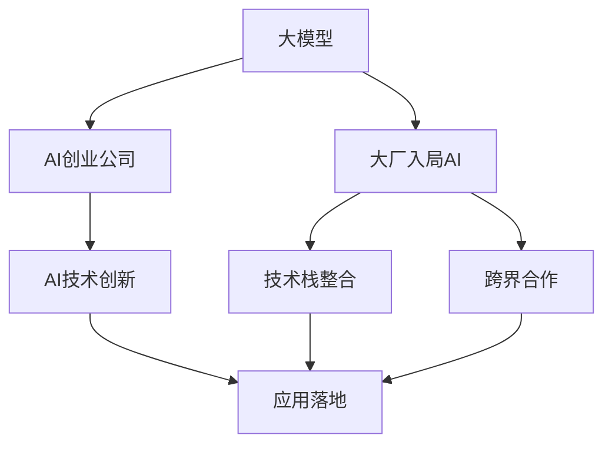

                 

# 大模型创业潮:互联网大厂高管纷纷入局AI

## 1. 背景介绍

### 1.1 问题由来

近年来，人工智能（AI）技术的迅猛发展，尤其是深度学习和机器学习的广泛应用，极大地推动了技术创新和产业变革。大模型，如GPT、BERT等，凭借其强大的语言理解和生成能力，在自然语言处理（NLP）、计算机视觉（CV）、语音识别等领域取得了显著成果，成为企业和技术团队竞相追逐的热点。

然而，大模型的训练和部署需要巨额资金、高性能计算资源和专业的技术团队，传统的中小企业难以承担。因此，互联网大厂纷纷将目光投向AI，希望通过自主研发或外部合作，快速构建AI能力，抢占市场先机。

### 1.2 问题核心关键点

互联网大厂入局AI的核心关键点包括：

1. **技术积累**：拥有强大的技术储备和研发能力，能够快速落地大模型，并在关键技术上保持领先。
2. **数据资源**：拥有海量数据资源，包括用户行为数据、市场调研数据、行业报告等，为模型训练提供充分的基础。
3. **人才储备**：汇聚了大量高水平AI人才，包括算法工程师、数据科学家、产品经理等，能够快速组建高效的AI团队。
4. **战略定位**：明确AI在企业战略中的地位，将其作为核心竞争力，进行系统性投入和长期规划。
5. **市场机遇**：瞄准AI技术在各个垂直领域的广泛应用，如智能客服、推荐系统、自动驾驶等，把握市场机遇。

### 1.3 问题研究意义

互联网大厂入局AI具有重要意义：

1. **加速技术落地**：大厂的加入，可以加速AI技术在实际业务中的应用，推动AI技术的产业化进程。
2. **提升创新能力**：大厂的技术积累和人才优势，可以提升企业在AI领域的创新能力，保持技术领先地位。
3. **形成行业标准**：大厂的行业影响力，可以推动AI技术的标准化和规范化，形成统一的行业标准。
4. **驱动产业变革**：AI技术的广泛应用，可以推动各行业的数字化转型，提升效率和竞争力。
5. **带来经济效益**：AI技术的商业化应用，可以创造显著的经济价值，推动企业的可持续发展。

## 2. 核心概念与联系

### 2.1 核心概念概述

为了更好地理解互联网大厂入局AI，需要明确几个关键概念：

1. **大模型（Large Model）**：指具有数十亿参数规模的预训练模型，如BERT、GPT等，具备强大的语言理解和生成能力。
2. **AI创业公司**：专注于AI技术的创新和应用，通过自主研发或外部合作，构建AI能力的企业。
3. **大厂入局AI**：指互联网巨头企业（如Google、Facebook、Amazon、Alibaba等）通过内部研发或外部投资，进入AI领域的战略布局。
4. **技术栈整合**：指将AI技术与其他业务技术（如大数据、云计算、区块链等）进行系统性整合，构建全面的技术生态。
5. **跨界合作**：指大厂与外部创业公司、高校、研究机构等进行合作，共同推动AI技术的发展。

这些核心概念之间的逻辑关系可以通过以下Mermaid流程图来展示：



这个流程图展示了大模型、AI创业公司、大厂入局AI、技术栈整合和跨界合作之间的关系：

1. 大模型为AI技术创新提供了基础。
2. AI创业公司基于大模型，进行技术创新和应用落地。
3. 大厂通过入局AI，整合技术栈，推动AI技术的产业化。
4. 跨界合作促进了AI技术的快速发展和应用。

## 3. 核心算法原理 & 具体操作步骤
### 3.1 算法原理概述

互联网大厂入局AI的核心算法原理是利用大模型的强大能力，结合自身的技术优势和数据资源，构建高效、精准的AI系统。其核心算法主要包括：

1. **自监督学习（Self-Supervised Learning）**：利用大规模无标签数据，训练大模型进行预训练，学习通用的语言和视觉知识。
2. **迁移学习（Transfer Learning）**：在大模型的基础上，进行任务特定的微调，提升模型在特定任务上的性能。
3. **强化学习（Reinforcement Learning）**：通过与环境的交互，训练模型进行优化和决策，提升模型的智能水平。
4. **混合学习（Hybrid Learning）**：结合监督学习和无监督学习，综合利用多模态数据，提升模型的泛化能力。

这些算法原理的结合，可以构建出高效、鲁棒、智能的AI系统，实现商业价值。

### 3.2 算法步骤详解

互联网大厂入局AI的具体操作步骤包括：

1. **数据准备**：收集和清洗大规模的数据，如文本、图片、音频等，为模型训练提供数据基础。
2. **模型选择**：选择合适的预训练模型，如BERT、GPT等，作为基础模型。
3. **模型微调**：在预训练模型的基础上，进行任务特定的微调，提升模型在特定任务上的性能。
4. **集成优化**：将多个模型的输出进行集成和优化，提升模型的整体表现。
5. **部署上线**：将训练好的模型部署到实际业务场景中，进行线上测试和优化。

### 3.3 算法优缺点

互联网大厂入局AI的优势包括：

1. **数据优势**：拥有海量数据资源，能够快速进行模型训练和优化。
2. **技术优势**：拥有强大的技术积累和人才储备，能够快速构建高效的AI系统。
3. **品牌优势**：品牌影响力大，能够快速推广AI产品，吸引用户和客户。
4. **资本优势**：具备充足的资金支持，能够进行长期的技术投入和市场拓展。

然而，也存在一些缺点：

1. **高昂成本**：大模型的训练和部署需要巨额资金和计算资源，成本较高。
2. **技术复杂**：AI技术的复杂性和技术门槛较高，需要大量技术人才进行开发和维护。
3. **市场竞争**：AI领域竞争激烈，需要不断创新和优化，才能保持市场竞争力。
4. **数据隐私**：AI系统需要大量的数据支持，但数据隐私问题需要妥善处理，避免泄露和滥用。

### 3.4 算法应用领域

互联网大厂入局AI的应用领域广泛，包括：

1. **智能客服**：利用大模型进行自然语言理解和生成，构建智能客服系统，提升客户服务体验。
2. **推荐系统**：基于用户的兴趣和行为数据，构建推荐系统，提供个性化的商品和服务。
3. **自动驾驶**：利用大模型进行视觉和语音识别，构建自动驾驶系统，提升交通安全性。
4. **智能医疗**：基于患者数据和医疗知识，构建智能诊疗系统，提高医疗诊断和治疗的精准度。
5. **金融科技**：利用大模型进行风险评估和欺诈检测，提升金融服务的可靠性和安全性。
6. **智能安防**：基于视频和音频数据，构建智能安防系统，提高安全监控的效率和精度。

## 4. 数学模型和公式 & 详细讲解  
### 4.1 数学模型构建

大模型和AI技术的数学模型构建需要考虑以下几个关键因素：

1. **预训练模型的构建**：利用大规模无标签数据，进行自监督学习，构建大模型。
2. **任务特定微调的构建**：在预训练模型的基础上，进行任务特定的微调，构建适应特定任务的模型。
3. **多模态融合的构建**：结合文本、图片、音频等多模态数据，构建综合的AI系统。

### 4.2 公式推导过程

以自然语言处理（NLP）为例，大模型的预训练过程可以表示为：

$$
\theta = \mathop{\arg\min}_{\theta} \mathcal{L}(\mathcal{D}_L, \theta)
$$

其中，$\theta$ 为模型参数，$\mathcal{L}$ 为损失函数，$\mathcal{D}_L$ 为预训练数据集。

对于特定任务的微调，可以表示为：

$$
\theta = \mathop{\arg\min}_{\theta} \mathcal{L}(\mathcal{D}_T, \theta)
$$

其中，$\mathcal{D}_T$ 为任务特定数据集。

### 4.3 案例分析与讲解

以Google的BERT模型为例，BERT通过大规模文本数据的自监督预训练，学习通用的语言知识，并在特定任务上进行微调，提升在情感分析、文本分类、命名实体识别等任务上的性能。具体过程包括：

1. **预训练阶段**：在大型无标签文本数据上，利用掩码语言模型和下一句预测任务进行预训练，学习语言的基本规律和上下文关系。
2. **微调阶段**：在特定任务的数据集上进行微调，通过任务相关的损失函数和优化算法，调整模型参数，提升模型在特定任务上的表现。
3. **集成优化**：将多个微调模型的输出进行集成，提升整体的准确性和鲁棒性。

## 5. 项目实践：代码实例和详细解释说明
### 5.1 开发环境搭建

以下是Google使用TensorFlow和Keras进行BERT微调的开发环境搭建流程：

1. **安装TensorFlow**：
```
pip install tensorflow
```

2. **安装Keras**：
```
pip install keras
```

3. **安装BERT模型**：
```
pip install transformers
```

### 5.2 源代码详细实现

以下是Google使用TensorFlow和Keras进行BERT微调的代码实现：

```python
import tensorflow as tf
from transformers import BertTokenizer, TFBertForSequenceClassification
import numpy as np
import pandas as pd
import tensorflow_datasets as tfds

# 加载数据集
train_dataset, test_dataset = tfds.load('imdb_reviews', split=['train', 'test'], shuffle_files=True, as_supervised=True)

# 数据预处理
tokenizer = BertTokenizer.from_pretrained('bert-base-uncased')
train_encodings = tokenizer(train_dataset.map(lambda x, y: (x, y)), padding='max_length', truncation=True, max_length=128)
test_encodings = tokenizer(test_dataset.map(lambda x, y: (x, y)), padding='max_length', truncation=True, max_length=128)

# 构建模型
model = TFBertForSequenceClassification.from_pretrained('bert-base-uncased', num_labels=2, output_attentions=False, output_hidden_states=False)
model.compile(optimizer=tf.keras.optimizers.Adam(learning_rate=2e-5), loss=tf.keras.losses.BinaryCrossentropy(), metrics=[tf.keras.metrics.AUC()])

# 训练模型
model.fit(train_encodings['input_ids'], train_encodings['label'], epochs=3, validation_data=(test_encodings['input_ids'], test_encodings['label']))
```

### 5.3 代码解读与分析

该代码实现中，我们使用TensorFlow和Keras搭建了BERT模型的微调环境，步骤如下：

1. **数据加载**：使用TensorFlow Datasets加载IMDB影评数据集。
2. **数据预处理**：利用BERT分词器进行数据编码，将文本转换为模型所需的token ids和attention mask。
3. **模型构建**：使用TFBertForSequenceClassification模型进行微调，指定输出层和损失函数。
4. **模型编译**：指定优化器和损失函数，编译模型。
5. **模型训练**：使用训练集进行模型训练，并设置验证集。

## 6. 实际应用场景
### 6.1 智能客服系统

互联网大厂在智能客服系统方面的应用，主要通过大模型进行自然语言理解和生成，构建智能客服系统，提升客户服务体验。具体场景包括：

1. **客服对话**：利用大模型进行对话生成，回答客户的常见问题，提升服务效率。
2. **情感分析**：分析客户的情感倾向，进行情感分类，提升服务质量。
3. **知识库构建**：利用大模型进行文本分析和分类，构建知识库，提升服务准确性。

### 6.2 推荐系统

互联网大厂在推荐系统方面的应用，主要通过大模型进行用户行为分析和个性化推荐，提升用户的购物体验。具体场景包括：

1. **用户行为分析**：利用大模型分析用户的浏览、点击、购买等行为数据，进行用户画像建模。
2. **商品推荐**：基于用户画像，利用大模型进行商品推荐，提升转化率和满意度。
3. **广告投放**：利用大模型进行广告的智能投放，提升广告效果和广告主收益。

### 6.3 自动驾驶

互联网大厂在自动驾驶方面的应用，主要通过大模型进行环境感知和决策，提升自动驾驶系统的安全性和可靠性。具体场景包括：

1. **视觉识别**：利用大模型进行图像和视频数据的视觉识别，识别车辆、行人等障碍物。
2. **语音识别**：利用大模型进行语音识别，与用户进行交互，提升用户体验。
3. **路径规划**：利用大模型进行路径规划和决策，优化驾驶策略，提升安全性和效率。

### 6.4 智能医疗

互联网大厂在智能医疗方面的应用，主要通过大模型进行疾病诊断和治疗，提升医疗服务的质量和效率。具体场景包括：

1. **疾病诊断**：利用大模型进行医学影像分析和文本分析，辅助医生进行疾病诊断。
2. **治疗方案推荐**：利用大模型进行治疗方案的推荐，提升治疗效果。
3. **健康管理**：利用大模型进行健康管理，提供个性化的健康建议和预警。

### 6.5 金融科技

互联网大厂在金融科技方面的应用，主要通过大模型进行风险评估和欺诈检测，提升金融服务的可靠性和安全性。具体场景包括：

1. **风险评估**：利用大模型进行信用评估和风险预测，提升贷款和投资的精准度。
2. **欺诈检测**：利用大模型进行交易和行为的异常检测，提升金融系统的安全性。
3. **客户服务**：利用大模型进行智能客服，提升客户服务的效率和体验。

## 7. 工具和资源推荐
### 7.1 学习资源推荐

以下是几本经典的AI书籍，推荐读者学习：

1. 《深度学习》（Ian Goodfellow著）：系统介绍深度学习的基本理论和算法。
2. 《人工智能》（Stuart Russell和Peter Norvig著）：介绍人工智能的基本概念和应用。
3. 《机器学习实战》（Peter Harrington著）：提供机器学习算法的代码实现和应用案例。
4. 《自然语言处理综论》（Daniel Jurafsky和James H. Martin著）：介绍自然语言处理的基本理论和应用。
5. 《统计学习方法》（李航著）：介绍统计学习的基本理论和算法。

### 7.2 开发工具推荐

以下是几款常用的AI开发工具，推荐读者使用：

1. TensorFlow：由Google主导开发的深度学习框架，适合大规模工程应用。
2. PyTorch：由Facebook开发的深度学习框架，适合快速迭代研究。
3. Keras：基于TensorFlow和Theano的高级深度学习框架，适合快速开发和原型设计。
4. HuggingFace Transformers：提供多种预训练语言模型的封装，便于微调应用。
5. Jupyter Notebook：支持Python和R等语言的交互式开发环境，适合数据科学和机器学习开发。

### 7.3 相关论文推荐

以下是几篇经典的AI论文，推荐读者学习：

1. Attention is All You Need（NeurIPS 2017）：提出Transformer结构，开启大模型时代。
2. BERT: Pre-training of Deep Bidirectional Transformers for Language Understanding（NAACL 2019）：提出BERT模型，刷新多项NLP任务SOTA。
3. Language Models are Unsupervised Multitask Learners（arXiv 2018）：展示大模型在zero-shot学习中的强大能力。
4. Parameter-Efficient Transfer Learning for NLP（EMNLP 2019）：提出Adapter等参数高效微调方法，减小过拟合风险。
5. AdaLoRA: Adaptive Low-Rank Adaptation for Parameter-Efficient Fine-Tuning（NeurIPS 2020）：使用自适应低秩适应的微调方法，提升微调效率。

## 8. 总结：未来发展趋势与挑战
### 8.1 研究成果总结

互联网大厂入局AI，通过利用大模型的强大能力，结合自身的技术优势和数据资源，构建高效、精准的AI系统，推动了AI技术在各个垂直领域的广泛应用。

### 8.2 未来发展趋势

未来AI技术的发展趋势包括：

1. **大模型持续进化**：大模型的参数规模和训练数据将继续扩大，提升模型的性能和泛化能力。
2. **跨界融合加速**：AI技术与大数据、云计算、区块链等技术的融合加速，推动AI技术的广泛应用。
3. **智能决策增强**：利用大模型进行智能决策，提升决策的精准度和可靠性。
4. **应用场景丰富**：AI技术将应用于更多垂直领域，如智能制造、智慧农业、智能家居等，推动各行业的数字化转型。
5. **伦理和安全重视**：AI技术的伦理和安全问题将得到更多关注，确保AI系统的公平、透明和可信。

### 8.3 面临的挑战

互联网大厂入局AI，面临的挑战包括：

1. **高昂成本**：大模型的训练和部署需要巨额资金和计算资源，成本较高。
2. **技术复杂**：AI技术的复杂性和技术门槛较高，需要大量技术人才进行开发和维护。
3. **市场竞争**：AI领域竞争激烈，需要不断创新和优化，才能保持市场竞争力。
4. **数据隐私**：AI系统需要大量的数据支持，但数据隐私问题需要妥善处理，避免泄露和滥用。
5. **伦理和安全**：AI技术的伦理和安全问题需要妥善解决，确保AI系统的公平、透明和可信。

### 8.4 研究展望

未来的AI研究展望包括：

1. **技术突破**：不断进行技术创新和突破，提升AI系统的性能和效率。
2. **跨领域应用**：推动AI技术在更多垂直领域的应用，提升各行业的数字化水平。
3. **伦理规范**：建立AI技术的伦理规范，确保AI系统的公平、透明和可信。
4. **人机协作**：推动人机协作，构建更加智能和高效的社会。

## 9. 附录：常见问题与解答

**Q1：互联网大厂入局AI的意义是什么？**

A: 互联网大厂入局AI，具有以下几方面意义：

1. **技术优势**：拥有强大的技术储备和研发能力，能够快速落地大模型，并在关键技术上保持领先。
2. **数据资源**：拥有海量数据资源，能够快速进行模型训练和优化。
3. **品牌影响力**：品牌影响力大，能够快速推广AI产品，吸引用户和客户。
4. **资本优势**：具备充足的资金支持，能够进行长期的技术投入和市场拓展。

**Q2：大模型有哪些常见的应用场景？**

A: 大模型的应用场景包括：

1. **自然语言处理（NLP）**：如智能客服、文本分类、情感分析等。
2. **计算机视觉（CV）**：如图像识别、目标检测、人脸识别等。
3. **语音识别**：如语音转文本、语音识别、说话人识别等。
4. **智能推荐**：如个性化推荐系统、广告投放等。
5. **自动驾驶**：如环境感知、路径规划、驾驶决策等。
6. **智能安防**：如视频分析、人脸识别、行为分析等。

**Q3：如何构建高效的AI系统？**

A: 构建高效的AI系统需要考虑以下几个方面：

1. **选择合适的算法**：选择适合任务和数据特点的算法，如自监督学习、迁移学习、强化学习等。
2. **数据准备**：收集和清洗大规模数据，为模型训练提供数据基础。
3. **模型选择**：选择合适的预训练模型，如BERT、GPT等，作为基础模型。
4. **模型微调**：在预训练模型的基础上，进行任务特定的微调，提升模型在特定任务上的性能。
5. **集成优化**：将多个模型的输出进行集成和优化，提升整体的准确性和鲁棒性。
6. **部署上线**：将训练好的模型部署到实际业务场景中，进行线上测试和优化。

**Q4：大模型的训练和部署需要哪些资源？**

A: 大模型的训练和部署需要以下几个方面的资源：

1. **计算资源**：需要高性能计算资源，如GPU、TPU等。
2. **存储资源**：需要大容量存储资源，存储训练数据和模型。
3. **网络资源**：需要高速网络资源，进行数据传输和模型下载。
4. **软件工具**：需要使用深度学习框架，如TensorFlow、PyTorch等。
5. **技术人才**：需要专业技术人员进行模型开发、训练和部署。

**Q5：如何保障AI系统的安全性？**

A: 保障AI系统的安全性需要考虑以下几个方面：

1. **数据隐私保护**：采用数据脱敏、加密等技术，保障数据隐私和安全。
2. **模型鲁棒性提升**：采用对抗训练、鲁棒性增强等技术，提升模型的鲁棒性和抗干扰能力。
3. **算法透明性**：确保算法的透明性和可解释性，避免算法的黑盒性。
4. **安全审计**：定期进行安全审计和漏洞检测，确保系统的安全性和可靠性。
5. **用户授权**：设置用户授权和访问控制，避免恶意访问和攻击。

---

作者：禅与计算机程序设计艺术 / Zen and the Art of Computer Programming

