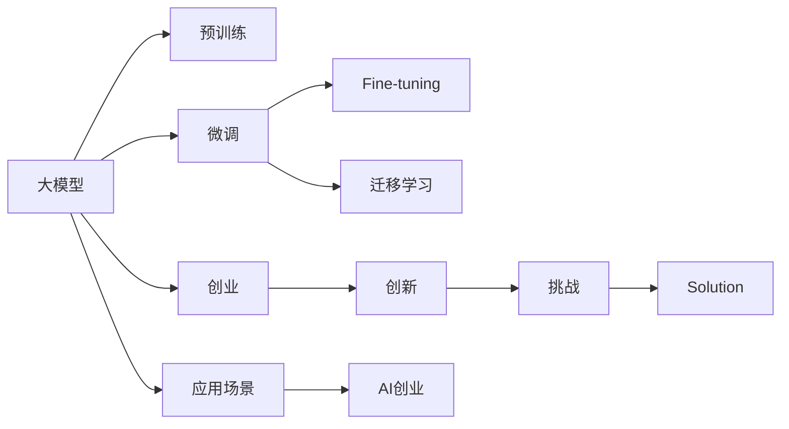

                 

# 大模型创业的创新与挑战

> 关键词：大模型,创业,创新,挑战,人工智能

## 1. 背景介绍

随着人工智能技术的迅猛发展，大模型（Large Models）成为了商业和技术创新中不可或缺的组成部分。从深度学习的早期开始，研究人员便不断探索使用更大、更复杂的模型，以期提升在图像、语音、自然语言处理（NLP）等领域的性能。如今，随着计算资源的丰富和算法的成熟，大模型不仅在学术研究中大放异彩，更是在实际应用中取得了显著的商业成功。大模型成为了创业公司寻求快速增长的关键工具，然而，与大模型相关的一系列挑战也随之而来。本文将全面探讨大模型在创业公司中的创新应用和所面临的挑战。

## 2. 核心概念与联系

### 2.1 核心概念概述

为了更好地理解大模型在创业中的应用，我们首先需要了解几个关键概念：

- **大模型（Large Models）**：指的是那些具有数十亿甚至数百亿参数的深度神经网络模型，如GPT-3、BERT、Transformer等。这些模型通过在大型数据集上进行预训练，可以捕捉复杂的语言、图像和语音模式，并应用于各种自然语言处理、计算机视觉和语音识别任务。

- **预训练（Pre-training）**：指在大型无标签数据集上训练模型，使其能学习到通用的特征表示。预训练是训练大模型的关键步骤，可以在大规模数据上学习到复杂的模式，然后再在小数据集上进行微调（Fine-tuning），以适应特定任务。

- **微调（Fine-tuning）**：在预训练模型上加入特定任务的数据集，通过监督学习来调整模型参数，使其能够更好地完成特定任务。

- **迁移学习（Transfer Learning）**：指将在大规模数据集上学习到的知识迁移到小数据集上，以便更好地解决特定问题。大模型可以用于迁移学习，因为它们已经学习到了通用的特征表示。

- **创业（Entrepreneurship）**：指创建一个新的企业，旨在解决市场未满足的需求或以新的方式改进现有产品和服务。在人工智能领域，创业公司利用大模型来创造新的应用场景和商业模式。

### 2.2 核心概念原理和架构的 Mermaid 流程图(Mermaid 流程节点中不要有括号、逗号等特殊字符)



## 3. 核心算法原理 & 具体操作步骤

### 3.1 算法原理概述

大模型的创业应用主要依赖于其在自然语言处理、计算机视觉和语音识别等领域的广泛应用能力。这些模型在处理大规模数据集时具有显著的性能优势，且可以用于迁移学习，使其在小规模数据集上也能取得优秀的表现。

### 3.2 算法步骤详解

以下步骤详细描述了如何使用大模型进行创业应用：

1. **数据准备**：收集和处理所需的数据集，确保数据集质量和多样性。

2. **模型选择**：选择适合任务的预训练模型，如BERT、GPT等。

3. **微调模型**：在特定任务上对模型进行微调，使其能够适应新的应用场景。

4. **产品开发**：将微调后的模型集成到产品中，并开发用户界面和交互逻辑。

5. **市场推广**：通过营销和宣传，将产品推向市场。

### 3.3 算法优缺点

#### 优点

- **高性能**：大模型在处理自然语言处理、图像识别等任务时表现出色，能够处理复杂的模式和结构。
- **通用性**：大模型可以用于多种任务，如问答系统、翻译、文本分类等。
- **可迁移性**：通过迁移学习，大模型可以在小数据集上快速适应新任务，减少开发成本。

#### 缺点

- **资源需求高**：大模型的训练和推理需要大量的计算资源，这可能对创业公司的财务状况造成压力。
- **复杂性高**：大模型需要大量的专业知识和经验才能有效使用，可能增加开发难度。
- **数据隐私**：大模型通常需要大量用户数据进行训练，这可能导致隐私泄露问题。

### 3.4 算法应用领域

大模型的创业应用涵盖了多个领域，包括但不限于：

- **自然语言处理**：如聊天机器人、文本摘要、语音识别等。
- **计算机视觉**：如图像分类、物体检测、视频分析等。
- **推荐系统**：如电商推荐、音乐推荐、内容推荐等。
- **医疗健康**：如诊断、治疗方案推荐等。
- **金融科技**：如风险评估、投资策略、客户服务等。

## 4. 数学模型和公式 & 详细讲解 & 举例说明

### 4.1 数学模型构建

大模型的训练通常使用大规模无标签数据集进行预训练，然后在特定任务上使用有标签数据进行微调。数学模型可以表示为：

$$ P(y|x; \theta) = \frac{e^{s(x,y;\theta)}}{\sum_{y'}e^{s(x,y';\theta)}} $$

其中 $x$ 为输入数据，$y$ 为标签，$\theta$ 为模型参数，$s(x,y;\theta)$ 为模型的损失函数。

### 4.2 公式推导过程

以自然语言处理中的文本分类任务为例，公式推导如下：

1. **预训练阶段**：使用大规模无标签文本数据进行预训练，目标是最大化似然函数：

$$ \max_{\theta} \frac{1}{N}\sum_{i=1}^N logP(y_i|x_i;\theta) $$

2. **微调阶段**：在特定任务上使用有标签数据进行微调，目标是最大化损失函数：

$$ \min_{\theta} \frac{1}{N}\sum_{i=1}^N logP(y_i|x_i;\theta) - logP(y_i;y_i;\theta) $$

### 4.3 案例分析与讲解

考虑一个使用BERT进行文本分类的创业案例：

1. **数据准备**：收集一组关于电影评论的文本数据，标注为正面或负面。
2. **模型选择**：选择已经预训练好的BERT模型。
3. **微调模型**：使用电影评论数据集对模型进行微调，使其能够正确分类评论的情感。
4. **产品开发**：将微调后的模型集成到电影推荐系统中，根据用户的评论分析其情感倾向，推荐相应的电影。

## 5. 项目实践：代码实例和详细解释说明

### 5.1 开发环境搭建

1. **安装Python和相关库**：
   ```bash
   pip install torch numpy matplotlib pandas scikit-learn transformers
   ```

2. **下载预训练模型**：
   ```bash
   python -m transformers-cli download bert-base-uncased
   ```

3. **准备数据集**：将电影评论数据集划分为训练集、验证集和测试集。

### 5.2 源代码详细实现

以下是使用PyTorch和HuggingFace的Transformers库进行BERT微调的示例代码：

```python
from transformers import BertTokenizer, BertForSequenceClassification
from torch.utils.data import DataLoader
import torch

# 加载模型和分词器
tokenizer = BertTokenizer.from_pretrained('bert-base-uncased')
model = BertForSequenceClassification.from_pretrained('bert-base-uncased', num_labels=2)

# 加载数据集
train_dataset = ...
val_dataset = ...
test_dataset = ...

# 训练函数
def train_epoch(model, dataset, batch_size, optimizer):
    ...
    ...

# 评估函数
def evaluate(model, dataset, batch_size):
    ...
    ...

# 训练和评估循环
epochs = 3
batch_size = 16

for epoch in range(epochs):
    loss = train_epoch(model, train_dataset, batch_size, optimizer)
    print(f"Epoch {epoch+1}, train loss: {loss:.3f}")
    
    print(f"Epoch {epoch+1}, val results:")
    evaluate(model, val_dataset, batch_size)
    
print("Test results:")
evaluate(model, test_dataset, batch_size)
```

### 5.3 代码解读与分析

1. **模型选择**：选择BERT模型，并加载分词器和预训练权重。
2. **数据集准备**：将电影评论数据集划分为训练集、验证集和测试集，并使用分词器进行预处理。
3. **训练和评估**：使用训练集进行模型微调，在验证集上进行性能评估，并在测试集上进行最终评估。

### 5.4 运行结果展示

训练完成后，模型在测试集上的精确度、召回率和F1分数等指标将展示其性能。

## 6. 实际应用场景

### 6.1 自然语言处理

大模型在自然语言处理领域具有广泛应用。如智能客服、智能推荐、情感分析等。

- **智能客服**：使用大模型构建聊天机器人，处理用户查询和问题。
- **智能推荐**：使用大模型进行文本分类和用户画像，推荐个性化内容。
- **情感分析**：使用大模型分析用户评论，了解用户情感倾向。

### 6.2 计算机视觉

大模型在计算机视觉领域也有广泛应用，如图像分类、物体检测等。

- **图像分类**：使用大模型对图片进行分类，如识别不同类型的动物、植物等。
- **物体检测**：使用大模型检测图片中的物体位置，如人脸识别、车辆检测等。

### 6.3 医疗健康

大模型在医疗健康领域也有重要应用，如诊断和预测等。

- **诊断**：使用大模型分析医疗影像，如X光片、CT扫描等。
- **预测**：使用大模型预测疾病风险，如糖尿病、癌症等。

### 6.4 未来应用展望

未来，大模型将进一步应用于更多领域，带来更多创新。

- **自动化测试**：使用大模型进行软件自动化测试，提高测试效率和质量。
- **金融风险评估**：使用大模型评估金融交易风险，预测市场走势。
- **内容生成**：使用大模型生成新闻报道、小说、报告等文本内容。

## 7. 工具和资源推荐

### 7.1 学习资源推荐

1. **深度学习课程**：如Coursera上的《Deep Learning Specialization》，由Andrew Ng教授授课。
2. **NLP相关书籍**：如《Speech and Language Processing》、《Natural Language Processing with Python》等。
3. **开源项目**：如TensorFlow、PyTorch、HuggingFace Transformers等。

### 7.2 开发工具推荐

1. **深度学习框架**：如TensorFlow、PyTorch、MXNet等。
2. **数据处理工具**：如Pandas、NumPy、Dask等。
3. **分布式计算**：如Apache Spark、Distributed TensorFlow等。

### 7.3 相关论文推荐

1. **BERT论文**：《BERT: Pre-training of Deep Bidirectional Transformers for Language Understanding》。
2. **GPT论文**：《Language Models are Unsupervised Multitask Learners》。
3. **大模型应用论文**：《Scalable Architectures for Large-Scale Multilingual Transformers》。

## 8. 总结：未来发展趋势与挑战

### 8.1 研究成果总结

大模型在多个领域取得了显著的创新成果，如自然语言处理、计算机视觉、医疗健康等。然而，大模型在创业应用中也面临诸多挑战，如资源需求高、复杂性高等。

### 8.2 未来发展趋势

未来，大模型将继续在多个领域发挥重要作用，带来更多创新。同时，随着技术进步，资源需求和复杂性将逐渐降低。

### 8.3 面临的挑战

- **资源需求高**：大模型的训练和推理需要大量的计算资源，这对创业公司的财务状况构成挑战。
- **模型复杂性**：大模型的复杂性高，需要专业知识才能有效使用。
- **数据隐私**：大模型需要大量用户数据进行训练，这可能导致隐私泄露问题。

### 8.4 研究展望

未来，大模型将进一步应用于更多领域，带来更多创新。同时，随着技术进步，资源需求和复杂性将逐渐降低。

## 9. 附录：常见问题与解答

**Q1：大模型在创业公司中如何应用？**

A：大模型可以用于自然语言处理、计算机视觉、医疗健康等多个领域。在创业公司中，可以使用大模型构建智能客服、智能推荐、情感分析等应用。

**Q2：大模型在应用中需要注意哪些问题？**

A：大模型的应用需要注意数据隐私、模型复杂性、资源需求等问题。在实际应用中，需要进行数据清洗、模型优化和资源配置。

**Q3：大模型在创业公司中有哪些应用场景？**

A：大模型可以用于智能客服、智能推荐、情感分析、图像分类、物体检测、医疗诊断等多个场景。

**Q4：大模型在创业公司中如何优化？**

A：可以通过优化数据集、调整模型参数、使用更高效的算法和架构等方式来优化大模型的性能。

**Q5：大模型在创业公司中如何部署？**

A：大模型需要部署到高性能服务器上，并使用分布式计算技术进行优化。同时，需要进行数据存储和访问管理，确保数据安全。

---

作者：禅与计算机程序设计艺术 / Zen and the Art of Computer Programming

