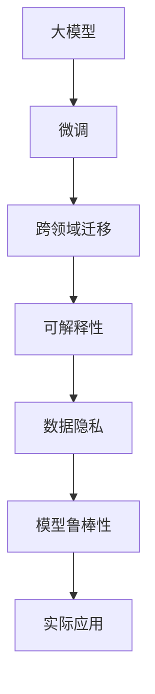

                 

# 大模型在企业级市场的应用挑战

## 1. 背景介绍

### 1.1 问题由来
近年来，随着深度学习技术的迅猛发展，大模型在自然语言处理（NLP）、计算机视觉（CV）、语音识别（ASR）等多个领域取得了显著进展。以GPT-3、BERT、ResNet等代表性大模型为例，这些模型在特定任务上已经超越了人类的表现，展现出了强大的泛化能力。

然而，尽管大模型在学术界和工业界均取得了突破性进展，但在企业级市场应用中仍面临诸多挑战。这些挑战不仅包括技术实现层面的问题，还有商业化运营、数据安全和合规等方面的考量。因此，本文章将详细分析大模型在企业级市场应用时所面临的各种挑战，并探讨相应的解决方案。

## 2. 核心概念与联系

### 2.1 核心概念概述

为更好地理解大模型在企业级市场的应用挑战，我们首先介绍几个关键概念：

- **大模型(Large Model)**：指的是具有亿级参数规模的神经网络模型，如GPT-3、BERT等，能够在特定任务上获得超越人类的表现。
- **微调(Fine-tuning)**：在大模型上进行有监督训练，使其适应特定任务的过程，通常使用少量标注数据。
- **迁移学习(Transfer Learning)**：将在大规模数据上预训练的模型知识迁移到特定任务上的过程，旨在利用已有的预训练模型加速新任务的学习。
- **跨领域迁移(Cross-domain Transfer)**：将在一个领域学到的知识迁移到另一个领域的过程，如从医疗领域迁移到教育领域。
- **可解释性(Explainability)**：大模型应用的模型如何做出决策的可解释性，对于企业级市场尤为重要，以确保结果的透明度和可信度。
- **数据隐私(Privacy)**：企业在应用大模型时，必须遵守数据保护法规，如GDPR、CCPA等，确保用户数据的隐私和安全性。
- **模型鲁棒性(Robustness)**：模型应对各种输入扰动（如噪声、对抗样本等）的能力，对企业级应用至关重要。

这些概念相互关联，共同构成大模型在企业级市场应用的理论基础。

### 2.2 核心概念原理和架构的 Mermaid 流程图



以上流程图展示了大模型在企业级市场应用的核心概念及其相互关系。大模型通过微调获得特定任务的能力，进而通过跨领域迁移扩展应用范围。同时，可解释性、数据隐私和模型鲁棒性是大模型在实际应用中需要重点关注的关键要素。

## 3. 核心算法原理 & 具体操作步骤

### 3.1 算法原理概述

大模型在企业级市场的应用挑战主要体现在以下几个方面：

- **技术实现**：大模型的部署和优化需要强大的计算资源和专业的技术支持。
- **数据获取和处理**：企业级市场需要大量高质量标注数据，且数据获取和处理过程复杂。
- **模型鲁棒性**：大模型在特定任务上可能出现过拟合或鲁棒性不足的问题。
- **可解释性**：企业级市场对模型决策过程的可解释性有较高的要求，以保证透明度和可信度。
- **数据隐私**：企业级市场需要严格遵守数据隐私法规，确保用户数据的隐私和安全。

### 3.2 算法步骤详解

为解决上述挑战，我们可以从以下几个步骤入手：

**Step 1: 选择合适的预训练模型**
根据企业级市场的需求，选择合适的预训练模型。例如，对于NLP任务，可以选择BERT、GPT-3等模型；对于计算机视觉任务，可以选择ResNet、VGG等模型。

**Step 2: 数据准备和处理**
收集和预处理企业级市场所需的标注数据。数据准备包括数据清洗、标准化、归一化等步骤，以保证数据质量和一致性。

**Step 3: 模型微调和优化**
对预训练模型进行微调，以适应企业级市场特定任务的需求。优化过程包括超参数调优、正则化技术应用、模型压缩和加速等。

**Step 4: 可解释性和透明性**
通过可视化、模型分析和业务解释等手段，提升模型的可解释性，确保决策过程的透明性和可信度。

**Step 5: 数据隐私和安全**
在数据处理和模型训练过程中，严格遵守数据隐私法规，采用数据加密、差分隐私等技术手段，确保数据隐私和安全。

**Step 6: 模型鲁棒性增强**
通过对抗训练、数据增强等技术，提升模型对各种输入扰动的鲁棒性，确保模型在实际应用中的稳定性。

### 3.3 算法优缺点

大模型在企业级市场应用的优势包括：

- **性能优异**：大模型在特定任务上能够超越人类表现，具有强大的泛化能力。
- **可迁移性**：通过微调和跨领域迁移，大模型能够快速适应新任务，加速应用开发。

然而，大模型在企业级市场应用也存在以下缺点：

- **资源消耗高**：大模型需要强大的计算资源，且部署和优化成本较高。
- **数据依赖强**：企业级市场需要大量高质量标注数据，数据获取和处理复杂。
- **模型复杂**：大模型参数众多，结构复杂，难以解释和调试。
- **隐私风险**：大模型在处理敏感数据时，存在隐私泄露的风险。

### 3.4 算法应用领域

大模型在企业级市场的应用领域非常广泛，包括但不限于以下几个方面：

- **智能客服**：利用大模型进行自然语言处理和理解，提供智能客服解决方案。
- **个性化推荐**：通过大模型进行用户行为分析和推荐，提升用户体验和满意度。
- **医疗诊断**：利用大模型进行疾病诊断和患者信息分析，辅助医疗决策。
- **金融风险管理**：利用大模型进行信用评分、欺诈检测和风险评估，提升金融机构的业务能力。
- **自动驾驶**：利用大模型进行环境感知和决策，推动自动驾驶技术的发展。

## 4. 数学模型和公式 & 详细讲解 & 举例说明

### 4.1 数学模型构建

假设预训练模型为 $M_{\theta}$，其中 $\theta$ 为模型参数。企业级市场需要处理的特定任务为 $T$，其训练数据集为 $D=\{(x_i,y_i)\}_{i=1}^N$，其中 $x_i$ 为输入，$y_i$ 为标签。微调的目标是最小化经验风险 $\mathcal{L}(\theta)$：

$$
\mathcal{L}(\theta) = \frac{1}{N}\sum_{i=1}^N \ell(M_{\theta}(x_i),y_i)
$$

其中 $\ell$ 为损失函数，$\ell(M_{\theta}(x_i),y_i)$ 表示模型在输入 $x_i$ 上的预测结果与真实标签 $y_i$ 之间的差距。

### 4.2 公式推导过程

以二分类任务为例，假设模型 $M_{\theta}$ 在输入 $x$ 上的输出为 $\hat{y}=M_{\theta}(x) \in [0,1]$，表示样本属于正类的概率。真实标签 $y \in \{0,1\}$。则二分类交叉熵损失函数定义为：

$$
\ell(M_{\theta}(x),y) = -[y\log \hat{y} + (1-y)\log (1-\hat{y})]
$$

将其代入经验风险公式，得：

$$
\mathcal{L}(\theta) = -\frac{1}{N}\sum_{i=1}^N [y_i\log M_{\theta}(x_i)+(1-y_i)\log(1-M_{\theta}(x_i))]
$$

根据链式法则，损失函数对参数 $\theta_k$ 的梯度为：

$$
\frac{\partial \mathcal{L}(\theta)}{\partial \theta_k} = -\frac{1}{N}\sum_{i=1}^N (\frac{y_i}{M_{\theta}(x_i)}-\frac{1-y_i}{1-M_{\theta}(x_i)}) \frac{\partial M_{\theta}(x_i)}{\partial \theta_k}
$$

其中 $\frac{\partial M_{\theta}(x_i)}{\partial \theta_k}$ 可进一步递归展开，利用自动微分技术完成计算。

### 4.3 案例分析与讲解

假设在企业级市场应用的大模型为GPT-3，任务为情感分析。具体步骤包括：

1. **数据准备**：收集包含情感标签的企业级市场数据，如客户评价、社交媒体评论等。数据清洗、标准化、归一化等步骤。
2. **模型微调**：使用GPT-3作为预训练模型，对其进行微调。微调过程中，选择合适的损失函数、学习率、正则化技术等超参数，并逐步更新模型参数，最小化经验风险。
3. **结果评估**：在验证集和测试集上评估微调后的模型性能，如准确率、召回率、F1-score等指标，确保模型在企业级市场任务上的表现。
4. **部署和优化**：将微调后的模型部署到企业级市场应用系统中，并根据实际使用情况进行模型优化，如模型裁剪、量化加速等。

## 5. 项目实践：代码实例和详细解释说明

### 5.1 开发环境搭建

在使用Python进行微调时，需要以下开发环境：

- **Anaconda**：从官网下载并安装Anaconda，用于创建独立的Python环境。
- **PyTorch**：安装PyTorch深度学习框架，兼容GPT-3等模型。
- **TensorBoard**：用于可视化训练过程和模型性能，确保训练过程透明和可解释。
- **Weights & Biases**：实验跟踪工具，记录和可视化模型训练过程中的各项指标。

### 5.2 源代码详细实现

以下是一个使用PyTorch进行GPT-3微调的示例代码：

```python
import torch
from transformers import GPT3Tokenizer, GPT3ForSequenceClassification
from torch.utils.data import DataLoader, Dataset
from torch.optim import AdamW
from sklearn.metrics import classification_report

# 数据准备
class MyDataset(Dataset):
    def __init__(self, data, labels, tokenizer):
        self.data = data
        self.labels = labels
        self.tokenizer = tokenizer
        
    def __len__(self):
        return len(self.data)
    
    def __getitem__(self, idx):
        text = self.data[idx]
        label = self.labels[idx]
        encoding = self.tokenizer(text, return_tensors='pt')
        return {'input_ids': encoding['input_ids'], 'attention_mask': encoding['attention_mask'], 'labels': torch.tensor(label, dtype=torch.long)}

# 模型微调
tokenizer = GPT3Tokenizer.from_pretrained('gpt3-medium')
model = GPT3ForSequenceClassification.from_pretrained('gpt3-medium', num_labels=2)
optimizer = AdamW(model.parameters(), lr=1e-5)

device = torch.device('cuda') if torch.cuda.is_available() else torch.device('cpu')
model.to(device)

def train_epoch(model, data_loader, optimizer):
    model.train()
    losses = []
    for batch in data_loader:
        input_ids = batch['input_ids'].to(device)
        attention_mask = batch['attention_mask'].to(device)
        labels = batch['labels'].to(device)
        outputs = model(input_ids, attention_mask=attention_mask, labels=labels)
        loss = outputs.loss
        losses.append(loss.item())
        optimizer.zero_grad()
        loss.backward()
        optimizer.step()
    return sum(losses) / len(data_loader)

def evaluate(model, data_loader):
    model.eval()
    preds, labels = [], []
    with torch.no_grad():
        for batch in data_loader:
            input_ids = batch['input_ids'].to(device)
            attention_mask = batch['attention_mask'].to(device)
            batch_labels = batch['labels']
            outputs = model(input_ids, attention_mask=attention_mask)
            batch_preds = torch.argmax(outputs.logits, dim=1).to('cpu').tolist()
            batch_labels = batch_labels.to('cpu').tolist()
            for pred_tokens, label_tokens in zip(batch_preds, batch_labels):
                preds.append(pred_tokens[:len(label_tokens)])
                labels.append(label_tokens)
    return classification_report(labels, preds)

# 训练和评估
data = [...] # 企业级市场数据
labels = [...] # 企业级市场标签
train_dataset = MyDataset(data[:800], labels[:800], tokenizer)
val_dataset = MyDataset(data[800:1200], labels[800:1200], tokenizer)
test_dataset = MyDataset(data[1200:], labels[1200:], tokenizer)

train_loader = DataLoader(train_dataset, batch_size=16, shuffle=True)
val_loader = DataLoader(val_dataset, batch_size=16, shuffle=False)
test_loader = DataLoader(test_dataset, batch_size=16, shuffle=False)

for epoch in range(10):
    train_loss = train_epoch(model, train_loader, optimizer)
    val_loss = evaluate(model, val_loader)
    print(f"Epoch {epoch+1}, train loss: {train_loss:.4f}, val loss: {val_loss}")

val_report = evaluate(model, val_loader)
test_report = evaluate(model, test_loader)
print(f"Val report: {val_report}")
print(f"Test report: {test_report}")
```

### 5.3 代码解读与分析

**MyDataset类**：
- `__init__`方法：初始化数据、标签和分词器等关键组件。
- `__len__`方法：返回数据集的样本数量。
- `__getitem__`方法：对单个样本进行处理，将文本输入编码为token ids，将标签编码为数字，并对其进行定长padding。

**GPT3ForSequenceClassification模型**：
- 使用GPT-3进行情感分析任务的微调，模型顶层添加线性分类器。

**train_epoch函数**：
- 对数据以批为单位进行迭代，在每个批次上前向传播计算loss并反向传播更新模型参数。

**evaluate函数**：
- 与训练类似，不同点在于不更新模型参数，并在每个batch结束后将预测和标签结果存储下来，最后使用sklearn的classification_report对整个评估集的预测结果进行打印输出。

**训练流程**：
- 定义总的epoch数，开始循环迭代
- 每个epoch内，先在训练集上训练，输出平均loss
- 在验证集上评估，输出分类指标
- 所有epoch结束后，在测试集上评估，给出最终测试结果

## 6. 实际应用场景

### 6.1 智能客服系统

在智能客服系统中，大模型可以用于对话生成和意图识别。通过微调大模型，系统可以理解客户意图，匹配最合适的答案模板进行回复。例如，利用GPT-3模型对客服对话进行微调，可以在客户提出问题时，快速生成合适的回复，提升客户咨询体验。

### 6.2 个性化推荐系统

个性化推荐系统可以利用大模型进行用户行为分析和推荐。通过对用户浏览、点击、评论等行为数据进行微调，系统可以预测用户可能感兴趣的商品或服务，提高推荐精准度和用户满意度。

### 6.3 医疗诊断

医疗诊断是大模型在企业级市场的重要应用场景。通过微调大模型，系统可以辅助医生进行疾病诊断和治疗方案推荐。例如，利用BERT模型对电子病历进行微调，可以在患者就诊时，提供初步的疾病诊断结果，帮助医生进行后续治疗决策。

### 6.4 金融风险管理

金融风险管理领域利用大模型进行信用评分、欺诈检测和风险评估。通过对历史金融数据进行微调，系统可以实时分析客户信用风险，评估交易欺诈的可能性，提升金融机构的业务能力。

## 7. 工具和资源推荐

### 7.1 学习资源推荐

为了帮助开发者系统掌握大模型微调的理论基础和实践技巧，这里推荐一些优质的学习资源：

1. **《深度学习与自然语言处理》**：斯坦福大学开设的NLP课程，涵盖深度学习基础和NLP任务，适合入门和进阶学习。
2. **《Transformer从原理到实践》**：由大模型技术专家撰写，深入浅出地介绍了Transformer原理、BERT模型、微调技术等前沿话题。
3. **HuggingFace官方文档**：提供大量预训练模型和微调样例，适合快速上手实践。

### 7.2 开发工具推荐

高效的开发离不开优秀的工具支持。以下是几款用于大模型微调开发的常用工具：

1. **PyTorch**：基于Python的开源深度学习框架，灵活动态的计算图，适合快速迭代研究。
2. **TensorFlow**：由Google主导开发的开源深度学习框架，生产部署方便，适合大规模工程应用。
3. **Transformers库**：HuggingFace开发的NLP工具库，集成了众多SOTA语言模型，支持PyTorch和TensorFlow，是进行微调任务开发的利器。
4. **Weights & Biases**：模型训练的实验跟踪工具，可以记录和可视化模型训练过程中的各项指标，方便对比和调优。
5. **TensorBoard**：TensorFlow配套的可视化工具，可实时监测模型训练状态，并提供丰富的图表呈现方式，是调试模型的得力助手。

### 7.3 相关论文推荐

大模型和微调技术的发展源于学界的持续研究。以下是几篇奠基性的相关论文，推荐阅读：

1. **Attention is All You Need**：提出Transformer结构，开启了NLP领域的预训练大模型时代。
2. **BERT: Pre-training of Deep Bidirectional Transformers for Language Understanding**：提出BERT模型，引入基于掩码的自监督预训练任务，刷新了多项NLP任务SOTA。
3. **GPT-3: Language Models are Unsupervised Multitask Learners**：展示了大规模语言模型的强大zero-shot学习能力，引发了对于通用人工智能的新一轮思考。

## 8. 总结：未来发展趋势与挑战

### 8.1 研究成果总结

本文对大模型在企业级市场应用挑战进行了全面系统的介绍。首先阐述了大模型在企业级市场应用的理论基础和具体挑战，明确了微调在拓展预训练模型应用、提升下游任务性能方面的独特价值。其次，从原理到实践，详细讲解了监督微调的数学原理和关键步骤，给出了微调任务开发的完整代码实例。同时，本文还广泛探讨了微调方法在智能客服、个性化推荐、医疗诊断等多个行业领域的应用前景，展示了微调范式的巨大潜力。

通过本文的系统梳理，可以看到，大模型微调技术在企业级市场的应用前景广阔，但同时也面临着技术实现、数据获取、模型鲁棒性、可解释性、数据隐私等多方面的挑战。只有从数据、算法、工程、业务等多个维度协同发力，才能真正实现人工智能技术在垂直行业的规模化落地。

### 8.2 未来发展趋势

展望未来，大模型在企业级市场应用将呈现以下几个发展趋势：

1. **模型规模持续增大**：随着算力成本的下降和数据规模的扩张，预训练语言模型的参数量还将持续增长。超大规模语言模型蕴含的丰富语言知识，有望支撑更加复杂多变的下游任务微调。
2. **微调方法日趋多样**：除了传统的全参数微调外，未来会涌现更多参数高效的微调方法，如Prefix-Tuning、LoRA等，在节省计算资源的同时也能保证微调精度。
3. **持续学习成为常态**：随着数据分布的不断变化，微调模型也需要持续学习新知识以保持性能。如何在不遗忘原有知识的同时，高效吸收新样本信息，将成为重要的研究课题。
4. **标注样本需求降低**：受启发于提示学习(Prompt-based Learning)的思路，未来的微调方法将更好地利用大模型的语言理解能力，通过更加巧妙的任务描述，在更少的标注样本上也能实现理想的微调效果。
5. **多模态微调崛起**：当前的微调主要聚焦于纯文本数据，未来会进一步拓展到图像、视频、语音等多模态数据微调。多模态信息的融合，将显著提升语言模型对现实世界的理解和建模能力。
6. **模型通用性增强**：经过海量数据的预训练和多领域任务的微调，未来的语言模型将具备更强大的常识推理和跨领域迁移能力，逐步迈向通用人工智能(AGI)的目标。

以上趋势凸显了大模型微调技术的广阔前景。这些方向的探索发展，必将进一步提升NLP系统的性能和应用范围，为人类认知智能的进化带来深远影响。

### 8.3 面临的挑战

尽管大模型微调技术已经取得了瞩目成就，但在迈向更加智能化、普适化应用的过程中，它仍面临着诸多挑战：

1. **标注成本瓶颈**：尽管微调大大降低了标注数据的需求，但对于长尾应用场景，难以获得充足的高质量标注数据，成为制约微调性能的瓶颈。如何进一步降低微调对标注样本的依赖，将是一大难题。
2. **模型鲁棒性不足**：当前微调模型面对域外数据时，泛化性能往往大打折扣。对于测试样本的微小扰动，微调模型的预测也容易发生波动。如何提高微调模型的鲁棒性，避免灾难性遗忘，还需要更多理论和实践的积累。
3. **推理效率有待提高**：大规模语言模型虽然精度高，但在实际部署时往往面临推理速度慢、内存占用大等效率问题。如何在保证性能的同时，简化模型结构，提升推理速度，优化资源占用，将是重要的优化方向。
4. **可解释性亟需加强**：当前微调模型更像是"黑盒"系统，难以解释其内部工作机制和决策逻辑。对于医疗、金融等高风险应用，算法的可解释性和可审计性尤为重要。如何赋予微调模型更强的可解释性，将是亟待攻克的难题。
5. **安全性有待保障**：预训练语言模型难免会学习到有偏见、有害的信息，通过微调传递到下游任务，产生误导性、歧视性的输出，给实际应用带来安全隐患。如何从数据和算法层面消除模型偏见，避免恶意用途，确保输出的安全性，也将是重要的研究课题。
6. **知识整合能力不足**：现有的微调模型往往局限于任务内数据，难以灵活吸收和运用更广泛的先验知识。如何让微调过程更好地与外部知识库、规则库等专家知识结合，形成更加全面、准确的信息整合能力，还有很大的想象空间。

正视微调面临的这些挑战，积极应对并寻求突破，将是大语言模型微调走向成熟的必由之路。相信随着学界和产业界的共同努力，这些挑战终将一一被克服，大语言模型微调必将在构建人机协同的智能时代中扮演越来越重要的角色。

### 8.4 研究展望

面向未来，大语言模型微调技术需要在以下几个方面寻求新的突破：

1. **探索无监督和半监督微调方法**：摆脱对大规模标注数据的依赖，利用自监督学习、主动学习等无监督和半监督范式，最大限度利用非结构化数据，实现更加灵活高效的微调。
2. **研究参数高效和计算高效的微调范式**：开发更加参数高效的微调方法，在固定大部分预训练参数的同时，只更新极少量的任务相关参数。同时优化微调模型的计算图，减少前向传播和反向传播的资源消耗，实现更加轻量级、实时性的部署。
3. **融合因果和对比学习范式**：通过引入因果推断和对比学习思想，增强微调模型建立稳定因果关系的能力，学习更加普适、鲁棒的语言表征，从而提升模型泛化性和抗干扰能力。
4. **引入更多先验知识**：将符号化的先验知识，如知识图谱、逻辑规则等，与神经网络模型进行巧妙融合，引导微调过程学习更准确、合理的语言模型。同时加强不同模态数据的整合，实现视觉、语音等多模态信息与文本信息的协同建模。
5. **结合因果分析和博弈论工具**：将因果分析方法引入微调模型，识别出模型决策的关键特征，增强输出解释的因果性和逻辑性。借助博弈论工具刻画人机交互过程，主动探索并规避模型的脆弱点，提高系统稳定性。
6. **纳入伦理道德约束**：在模型训练目标中引入伦理导向的评估指标，过滤和惩罚有偏见、有害的输出倾向。同时加强人工干预和审核，建立模型行为的监管机制，确保输出符合人类价值观和伦理道德。

这些研究方向的探索，必将引领大语言模型微调技术迈向更高的台阶，为构建安全、可靠、可解释、可控的智能系统铺平道路。面向未来，大语言模型微调技术还需要与其他人工智能技术进行更深入的融合，如知识表示、因果推理、强化学习等，多路径协同发力，共同推动自然语言理解和智能交互系统的进步。只有勇于创新、敢于突破，才能不断拓展语言模型的边界，让智能技术更好地造福人类社会。

## 9. 附录：常见问题与解答

**Q1: 大模型在企业级市场应用时，如何选择合适的预训练模型？**

A: 选择合适的预训练模型需考虑以下因素：

1. **任务需求**：根据企业级市场的需求，选择适合的预训练模型。例如，对于NLP任务，可以选择BERT、GPT-3等模型；对于计算机视觉任务，可以选择ResNet、VGG等模型。
2. **模型规模**：考虑模型参数规模、计算资源消耗等，选择符合企业实际条件的模型。
3. **模型性能**：评估模型在类似任务上的表现，选择性能最佳的模型。

**Q2: 微调过程中如何避免过拟合？**

A: 避免过拟合的方法包括：

1. **数据增强**：通过回译、近义替换等方式扩充训练集。
2. **正则化**：使用L2正则、Dropout、Early Stopping等技术防止模型过度适应小规模训练集。
3. **模型裁剪**：去除不必要的层和参数，减小模型尺寸，提高推理速度。
4. **对抗训练**：引入对抗样本，提高模型鲁棒性。
5. **多模型集成**：训练多个微调模型，取平均输出，抑制过拟合。

**Q3: 大模型在企业级市场应用时，如何确保数据隐私和安全？**

A: 确保数据隐私和安全的方法包括：

1. **数据加密**：在数据传输和存储过程中，使用加密技术保护数据隐私。
2. **差分隐私**：在数据处理过程中，采用差分隐私技术，防止模型泄露用户隐私。
3. **模型脱敏**：对敏感数据进行脱敏处理，减少数据泄露的风险。
4. **访问控制**：设置严格的访问控制机制，确保只有授权用户才能访问敏感数据。
5. **审计和监控**：定期进行安全审计和监控，及时发现和修复安全漏洞。

**Q4: 大模型在企业级市场应用时，如何提升模型的可解释性？**

A: 提升模型可解释性的方法包括：

1. **可视化**：通过可视化工具展示模型输入和输出的关系，帮助理解模型决策过程。
2. **特征重要性分析**：通过特征重要性分析，找出影响模型决策的关键特征。
3. **业务解释**：结合业务知识，对模型输出进行解释，确保结果的透明性和可信度。
4. **模型优化**：通过优化模型结构，减少复杂性，提升可解释性。

**Q5: 大模型在企业级市场应用时，如何处理模型鲁棒性不足的问题？**

A: 处理模型鲁棒性不足的方法包括：

1. **对抗训练**：引入对抗样本，提高模型鲁棒性。
2. **数据增强**：通过回译、近义替换等方式扩充训练集，增加数据多样性。
3. **模型优化**：通过优化模型结构，提升模型的鲁棒性。
4. **正则化**：使用L2正则、Dropout等技术，防止模型过拟合，提升鲁棒性。
5. **迁移学习**：通过跨领域迁移学习，提升模型的泛化能力和鲁棒性。

**Q6: 大模型在企业级市场应用时，如何处理模型推理效率低的问题？**

A: 处理模型推理效率低的方法包括：

1. **模型裁剪**：去除不必要的层和参数，减小模型尺寸，提高推理速度。
2. **量化加速**：将浮点模型转为定点模型，压缩存储空间，提高计算效率。
3. **模型并行**：采用模型并行技术，将大模型拆分为多个小模型，并行计算，提升推理速度。
4. **硬件优化**：使用GPU、TPU等高性能硬件，提升模型推理效率。

---

作者：禅与计算机程序设计艺术 / Zen and the Art of Computer Programming

