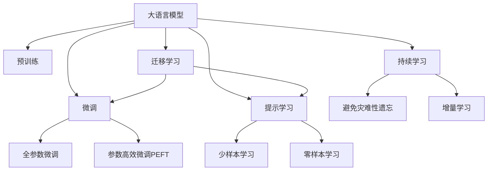

                 

## 1. 背景介绍

### 1.1 问题由来
新闻媒体行业长期以来一直依赖专业记者和编辑的深度报道。但随着数字化和网络化的不断深入，新闻生产模式正在发生深刻变革。自动化新闻系统、智能推荐引擎等新技术的涌现，使得传统媒体面临前所未有的挑战。如何利用人工智能技术提升新闻生产效率，降低成本，增强报道深度，成为新闻媒体领域亟需解决的难题。

在众多人工智能技术中，大模型（Large Language Model, LLM）以其强大的语言理解和生成能力，展示了巨大的应用潜力。尤其在新闻媒体领域，大模型能够自动进行新闻摘要、自动生成、个性化推荐等任务，大幅提升新闻业的生产力。但与此同时，大模型在实际应用中仍面临诸多挑战，需要通过算法优化和系统设计，才能真正融入新闻业的生产流程。

### 1.2 问题核心关键点
大模型在新闻媒体领域的应用挑战主要体现在以下几个方面：

1. **数据质量与标注成本**：新闻数据往往需要高质量的标注数据进行微调，而获取大规模高质量标注数据的成本较高，数据源的多样性和时效性也难以保证。

2. **文本多样性与复杂性**：新闻文本往往具有高度多样性和复杂性，涉及时事政治、经济文化、社会热点等多个领域，传统通用大模型可能难以在特定领域内取得良好效果。

3. **信息真实性与客观性**：新闻报道对信息真实性和客观性要求极高，大模型需要在处理海量信息的同时，保持严谨的逻辑性和准确性。

4. **模型鲁棒性与泛化能力**：新闻业对模型鲁棒性和泛化能力有较高要求，模型需要具备对新数据、新语境的适应能力，避免过拟合和泛化不足。

5. **交互性与用户体验**：新闻消费模式的变革使得用户体验成为重要考量，大模型需要具备高度的交互性，能够理解用户需求，进行个性化推荐。

6. **伦理与安全**：新闻报道对伦理与安全有严格要求，大模型需要避免偏见、歧视、有害信息等问题，同时保障数据安全。

### 1.3 问题研究意义
研究大模型在新闻媒体领域的应用挑战，对于提升新闻业智能化水平，推动媒体融合发展，具有重要意义：

1. **降低生产成本**：利用大模型自动化处理新闻内容，减少人力投入，降低生产成本。

2. **提升报道质量**：通过自然语言处理技术，提升新闻的准确性、及时性和深度。

3. **优化用户体验**：个性化推荐系统可以根据用户兴趣，提供定制化新闻内容，增强用户粘性。

4. **推动技术创新**：在新闻业中应用大模型，可以推动NLP技术的持续进步，促进相关领域的创新与发展。

5. **促进社会进步**：高质量的新闻报道能够促进公众认知水平提升，助力社会进步。

6. **提升媒体公信力**：通过人工智能技术的辅助，提升新闻报道的公信力和权威性。

## 2. 核心概念与联系

### 2.1 核心概念概述

为更好地理解大模型在新闻媒体领域的应用挑战，本节将介绍几个关键概念及其之间的联系：

- **大语言模型 (Large Language Model, LLM)**：以自回归（如GPT）或自编码（如BERT）模型为代表的大规模预训练语言模型。通过在大规模无标签文本语料上进行预训练，学习到丰富的语言知识和常识，具备强大的语言理解和生成能力。

- **预训练 (Pre-training)**：指在大规模无标签文本语料上，通过自监督学习任务训练通用语言模型的过程。常见的预训练任务包括言语建模、遮挡语言模型等。预训练使得模型学习到语言的通用表示。

- **微调 (Fine-tuning)**：指在预训练模型的基础上，使用下游任务的少量标注数据，通过有监督学习优化模型在该任务上的性能。通常只需要调整顶层分类器或解码器，并以较小的学习率更新全部或部分的模型参数。

- **迁移学习 (Transfer Learning)**：指将一个领域学习到的知识，迁移应用到另一个不同但相关的领域的学习范式。大模型的预训练-微调过程即是一种典型的迁移学习方式。

- **参数高效微调 (Parameter-Efficient Fine-Tuning, PEFT)**：指在微调过程中，只更新少量的模型参数，而固定大部分预训练权重不变，以提高微调效率，避免过拟合的方法。

- **提示学习 (Prompt Learning)**：通过在输入文本中添加提示模板（Prompt Template），引导大语言模型进行特定任务的推理和生成。可以在不更新模型参数的情况下，实现零样本或少样本学习。

- **少样本学习 (Few-shot Learning)**：指在只有少量标注样本的情况下，模型能够快速适应新任务的学习方法。在大语言模型中，通常通过在输入中提供少量示例来实现，无需更新模型参数。

- **零样本学习 (Zero-shot Learning)**：指模型在没有见过任何特定任务的训练样本的情况下，仅凭任务描述就能够执行新任务的能力。大语言模型通过预训练获得的广泛知识，使其能够理解任务指令并生成相应输出。

- **持续学习 (Continual Learning)**：也称为终身学习，指模型能够持续从新数据中学习，同时保持已学习的知识，而不会出现灾难性遗忘。这对于保持大语言模型的时效性和适应性至关重要。

这些核心概念之间的逻辑关系可以通过以下Mermaid流程图来展示：



这个流程图展示了大语言模型的核心概念及其之间的关系：

1. 大语言模型通过预训练获得基础能力。
2. 微调是对预训练模型进行任务特定的优化，可以分为全参数微调和参数高效微调（PEFT）。
3. 提示学习是一种不更新模型参数的方法，可以实现少样本学习和零样本学习。
4. 迁移学习是连接预训练模型与下游任务的桥梁，可以通过微调或提示学习来实现。
5. 持续学习旨在使模型能够不断学习新知识，同时避免遗忘旧知识。

这些概念共同构成了大语言模型的学习和应用框架，使其能够在各种场景下发挥强大的语言理解和生成能力。通过理解这些核心概念，我们可以更好地把握大语言模型的工作原理和优化方向。

## 3. 核心算法原理 & 具体操作步骤
### 3.1 算法原理概述

大模型在新闻媒体领域的应用，本质上是一个有监督的细粒度迁移学习过程。其核心思想是：将预训练的大模型视作一个强大的"特征提取器"，通过在新闻媒体领域的相关任务上进行有监督的微调，使得模型能够理解并生成与新闻相关的内容。

形式化地，假设预训练模型为 $M_{\theta}$，其中 $\theta$ 为预训练得到的模型参数。给定新闻媒体领域的相关任务 $T$ 的标注数据集 $D=\{(x_i, y_i)\}_{i=1}^N$，微调的目标是找到新的模型参数 $\hat{\theta}$，使得：

$$
\hat{\theta}=\mathop{\arg\min}_{\theta} \mathcal{L}(M_{\theta},D)
$$

其中 $\mathcal{L}$ 为针对任务 $T$ 设计的损失函数，用于衡量模型预测输出与真实标签之间的差异。常见的损失函数包括交叉熵损失、均方误差损失等。

通过梯度下降等优化算法，微调过程不断更新模型参数 $\theta$，最小化损失函数 $\mathcal{L}$，使得模型输出逼近真实标签。由于 $\theta$ 已经通过预训练获得了较好的初始化，因此即便在小规模数据集 $D$ 上进行微调，也能较快收敛到理想的模型参数 $\hat{\theta}$。

### 3.2 算法步骤详解

大模型在新闻媒体领域的应用流程一般包括以下几个关键步骤：

**Step 1: 准备预训练模型和数据集**
- 选择合适的预训练语言模型 $M_{\theta}$ 作为初始化参数，如 BERT、GPT等。
- 准备新闻媒体领域的相关任务 $T$ 的标注数据集 $D$，划分为训练集、验证集和测试集。一般要求标注数据与预训练数据的分布不要差异过大。

**Step 2: 添加任务适配层**
- 根据任务类型，在预训练模型顶层设计合适的输出层和损失函数。
- 对于分类任务，通常在顶层添加线性分类器和交叉熵损失函数。
- 对于生成任务，通常使用语言模型的解码器输出概率分布，并以负对数似然为损失函数。

**Step 3: 设置微调超参数**
- 选择合适的优化算法及其参数，如 AdamW、SGD 等，设置学习率、批大小、迭代轮数等。
- 设置正则化技术及强度，包括权重衰减、Dropout、Early Stopping 等。
- 确定冻结预训练参数的策略，如仅微调顶层，或全部参数都参与微调。

**Step 4: 执行梯度训练**
- 将训练集数据分批次输入模型，前向传播计算损失函数。
- 反向传播计算参数梯度，根据设定的优化算法和学习率更新模型参数。
- 周期性在验证集上评估模型性能，根据性能指标决定是否触发 Early Stopping。
- 重复上述步骤直到满足预设的迭代轮数或 Early Stopping 条件。

**Step 5: 测试和部署**
- 在测试集上评估微调后模型 $M_{\hat{\theta}}$ 的性能，对比微调前后的精度提升。
- 使用微调后的模型对新样本进行推理预测，集成到实际的新闻媒体应用系统中。
- 持续收集新的数据，定期重新微调模型，以适应数据分布的变化。

以上是使用有监督学习的微调方法在大模型中应用的一般流程。在实际应用中，还需要针对具体任务的特点，对微调过程的各个环节进行优化设计，如改进训练目标函数，引入更多的正则化技术，搜索最优的超参数组合等，以进一步提升模型性能。

### 3.3 算法优缺点

大模型在新闻媒体领域的应用具有以下优点：

1. **快速提升生产效率**：利用大模型自动化处理新闻内容，大幅减少人力投入，缩短生产周期。

2. **增强报道深度**：通过NLP技术，提升新闻报道的深度和广度，挖掘潜在新闻线索。

3. **优化用户体验**：个性化推荐系统可以根据用户兴趣，提供定制化新闻内容，提升用户体验。

4. **推动技术创新**：在新闻业中应用大模型，可以推动NLP技术的持续进步，促进相关领域的创新与发展。

5. **促进媒体融合**：大模型可以在不同媒体平台上进行内容生成和推送，促进媒体融合发展。

6. **提升新闻公信力**：通过人工智能技术的辅助，提升新闻报道的公信力和权威性。

但同时，该方法也存在一定的局限性：

1. **依赖标注数据**：微调效果很大程度上取决于标注数据的质量和数量，获取高质量标注数据的成本较高。

2. **数据多样性挑战**：新闻文本往往具有高度多样性和复杂性，涉及多个领域，传统通用大模型可能难以在特定领域内取得良好效果。

3. **信息真实性问题**：新闻报道对信息真实性和客观性要求极高，大模型需要在处理海量信息的同时，保持严谨的逻辑性和准确性。

4. **过拟合风险**：新闻业对模型鲁棒性和泛化能力有较高要求，模型需要具备对新数据、新语境的适应能力，避免过拟合和泛化不足。

5. **交互性不足**：新闻消费模式的变革使得用户体验成为重要考量，大模型需要具备高度的交互性，能够理解用户需求，进行个性化推荐。

6. **伦理与安全**：新闻报道对伦理与安全有严格要求，大模型需要避免偏见、歧视、有害信息等问题，同时保障数据安全。

### 3.4 算法应用领域

大模型在新闻媒体领域的应用范围非常广泛，涵盖了以下主要方面：

- **新闻摘要与自动生成**：利用大模型对新闻文本进行摘要或自动生成，提升报道效率。

- **主题识别与分类**：通过分类任务，自动识别新闻文本的主题，进行内容归类和检索。

- **情感分析与舆情监测**：利用情感分析技术，监测舆情变化，分析公众情绪，为决策提供参考。

- **个性化推荐与互动**：通过个性化推荐系统，根据用户兴趣，提供定制化新闻内容，增强用户粘性。

- **事件检测与追踪**：利用大模型进行事件检测和追踪，自动生成相关新闻，提升报道的时效性。

- **内容优化与广告投放**：通过内容优化和广告投放，提升新闻内容的曝光度和用户转化率。

- **数据分析与可视化**：利用大模型进行数据处理和分析，生成可视化报告，支持新闻决策。

以上应用场景展示了大模型在新闻媒体领域的多样化应用，其强大的语言理解和生成能力，为新闻业注入了新的活力。未来，随着预训练模型和微调方法的不断进步，相信大模型在新闻业中的应用将更加广泛，进一步推动新闻业的智能化发展。

## 4. 数学模型和公式 & 详细讲解 & 举例说明
### 4.1 数学模型构建

大模型在新闻媒体领域的应用涉及文本分类、文本生成等多个任务。这里以新闻文本分类为例，构建相关的数学模型。

记预训练语言模型为 $M_{\theta}$，其中 $\theta$ 为预训练得到的模型参数。假设新闻文本分类任务为二分类，即判断新闻属于正面或负面两类。给定训练集 $D=\{(x_i, y_i)\}_{i=1}^N, x_i \in \mathcal{X}, y_i \in \{0,1\}$。

定义模型 $M_{\theta}$ 在输入 $x$ 上的输出为 $\hat{y}=M_{\theta}(x) \in [0,1]$，表示样本属于正类的概率。真实标签 $y \in \{0,1\}$。则二分类交叉熵损失函数定义为：

$$
\ell(M_{\theta}(x),y) = -[y\log \hat{y} + (1-y)\log (1-\hat{y})]
$$

将其代入经验风险公式，得：

$$
\mathcal{L}(\theta) = -\frac{1}{N}\sum_{i=1}^N [y_i\log M_{\theta}(x_i)+(1-y_i)\log(1-M_{\theta}(x_i))]
$$

在得到损失函数的梯度后，即可带入参数更新公式，完成模型的迭代优化。重复上述过程直至收敛，最终得到适应新闻文本分类任务的最优模型参数 $\theta^*$。

### 4.2 公式推导过程

以下我们以二分类任务为例，推导交叉熵损失函数及其梯度的计算公式。

假设模型 $M_{\theta}$ 在输入 $x$ 上的输出为 $\hat{y}=M_{\theta}(x) \in [0,1]$，表示样本属于正类的概率。真实标签 $y \in \{0,1\}$。则二分类交叉熵损失函数定义为：

$$
\ell(M_{\theta}(x),y) = -[y\log \hat{y} + (1-y)\log (1-\hat{y})]
$$

将其代入经验风险公式，得：

$$
\mathcal{L}(\theta) = -\frac{1}{N}\sum_{i=1}^N [y_i\log M_{\theta}(x_i)+(1-y_i)\log(1-M_{\theta}(x_i))]
$$

根据链式法则，损失函数对参数 $\theta_k$ 的梯度为：

$$
\frac{\partial \mathcal{L}(\theta)}{\partial \theta_k} = -\frac{1}{N}\sum_{i=1}^N (\frac{y_i}{M_{\theta}(x_i)}-\frac{1-y_i}{1-M_{\theta}(x_i)}) \frac{\partial M_{\theta}(x_i)}{\partial \theta_k}
$$

其中 $\frac{\partial M_{\theta}(x_i)}{\partial \theta_k}$ 可进一步递归展开，利用自动微分技术完成计算。

在得到损失函数的梯度后，即可带入参数更新公式，完成模型的迭代优化。重复上述过程直至收敛，最终得到适应新闻文本分类任务的最优模型参数 $\theta^*$。

### 4.3 案例分析与讲解

以BERT模型为例，其在新闻媒体领域的应用主要体现在新闻文本分类任务上。下面以BERT模型的新闻文本分类为例，分析其应用过程。

**Step 1: 准备预训练模型和数据集**

选择BERT模型作为预训练语言模型，并准备新闻文本分类任务的数据集。数据集包含新闻文本和对应的分类标签，划分为训练集、验证集和测试集。

**Step 2: 添加任务适配层**

在BERT模型顶层添加线性分类器，输出一个实数值，表示新闻属于正类的概率。损失函数使用二分类交叉熵损失。

**Step 3: 设置微调超参数**

选择合适的优化算法（如AdamW）及其参数，设置学习率、批大小、迭代轮数等。

**Step 4: 执行梯度训练**

将训练集数据分批次输入模型，前向传播计算损失函数。反向传播计算参数梯度，根据设定的优化算法和学习率更新模型参数。周期性在验证集上评估模型性能，根据性能指标决定是否触发 Early Stopping。重复上述步骤直到满足预设的迭代轮数或 Early Stopping 条件。

**Step 5: 测试和部署**

在测试集上评估微调后模型 $M_{\hat{\theta}}$ 的性能，对比微调前后的精度提升。使用微调后的模型对新样本进行推理预测，集成到实际的新闻媒体应用系统中。

在实践中，还可以通过参数高效微调等方法进一步优化微调过程，减少参数更新量，提高效率。

## 5. 项目实践：代码实例和详细解释说明
### 5.1 开发环境搭建

在进行大模型在新闻媒体领域的微调实践前，我们需要准备好开发环境。以下是使用Python进行PyTorch开发的环境配置流程：

1. 安装Anaconda：从官网下载并安装Anaconda，用于创建独立的Python环境。

2. 创建并激活虚拟环境：
```bash
conda create -n pytorch-env python=3.8 
conda activate pytorch-env
```

3. 安装PyTorch：根据CUDA版本，从官网获取对应的安装命令。例如：
```bash
conda install pytorch torchvision torchaudio cudatoolkit=11.1 -c pytorch -c conda-forge
```

4. 安装Transformers库：
```bash
pip install transformers
```

5. 安装各类工具包：
```bash
pip install numpy pandas scikit-learn matplotlib tqdm jupyter notebook ipython
```

完成上述步骤后，即可在`pytorch-env`环境中开始微调实践。

### 5.2 源代码详细实现

下面以新闻文本分类为例，给出使用Transformers库对BERT模型进行微调的PyTorch代码实现。

首先，定义新闻文本分类任务的数据处理函数：

```python
from transformers import BertTokenizer
from torch.utils.data import Dataset
import torch

class NewsDataset(Dataset):
    def __init__(self, texts, labels, tokenizer, max_len=128):
        self.texts = texts
        self.labels = labels
        self.tokenizer = tokenizer
        self.max_len = max_len
        
    def __len__(self):
        return len(self.texts)
    
    def __getitem__(self, item):
        text = self.texts[item]
        label = self.labels[item]
        
        encoding = self.tokenizer(text, return_tensors='pt', max_length=self.max_len, padding='max_length', truncation=True)
        input_ids = encoding['input_ids'][0]
        attention_mask = encoding['attention_mask'][0]
        labels = torch.tensor(label, dtype=torch.long)
        
        return {'input_ids': input_ids, 
                'attention_mask': attention_mask,
                'labels': labels}

# 标签与id的映射
label2id = {'positive': 1, 'negative': 0}
id2label = {v: k for k, v in label2id.items()}

# 创建dataset
tokenizer = BertTokenizer.from_pretrained('bert-base-uncased')

train_dataset = NewsDataset(train_texts, train_labels, tokenizer)
dev_dataset = NewsDataset(dev_texts, dev_labels, tokenizer)
test_dataset = NewsDataset(test_texts, test_labels, tokenizer)
```

然后，定义模型和优化器：

```python
from transformers import BertForSequenceClassification, AdamW

model = BertForSequenceClassification.from_pretrained('bert-base-uncased', num_labels=2)

optimizer = AdamW(model.parameters(), lr=2e-5)
```

接着，定义训练和评估函数：

```python
from torch.utils.data import DataLoader
from tqdm import tqdm
from sklearn.metrics import classification_report

device = torch.device('cuda') if torch.cuda.is_available() else torch.device('cpu')
model.to(device)

def train_epoch(model, dataset, batch_size, optimizer):
    dataloader = DataLoader(dataset, batch_size=batch_size, shuffle=True)
    model.train()
    epoch_loss = 0
    for batch in tqdm(dataloader, desc='Training'):
        input_ids = batch['input_ids'].to(device)
        attention_mask = batch['attention_mask'].to(device)
        labels = batch['labels'].to(device)
        model.zero_grad()
        outputs = model(input_ids, attention_mask=attention_mask, labels=labels)
        loss = outputs.loss
        epoch_loss += loss.item()
        loss.backward()
        optimizer.step()
    return epoch_loss / len(dataloader)

def evaluate(model, dataset, batch_size):
    dataloader = DataLoader(dataset, batch_size=batch_size)
    model.eval()
    preds, labels = [], []
    with torch.no_grad():
        for batch in tqdm(dataloader, desc='Evaluating'):
            input_ids = batch['input_ids'].to(device)
            attention_mask = batch['attention_mask'].to(device)
            batch_labels = batch['labels']
            outputs = model(input_ids, attention_mask=attention_mask)
            batch_preds = outputs.logits.argmax(dim=2).to('cpu').tolist()
            batch_labels = batch_labels.to('cpu').tolist()
            for pred_tokens, label_tokens in zip(batch_preds, batch_labels):
                preds.append(pred_tokens)
                labels.append(label_tokens)
                
    print(classification_report(labels, preds))
```

最后，启动训练流程并在测试集上评估：

```python
epochs = 5
batch_size = 16

for epoch in range(epochs):
    loss = train_epoch(model, train_dataset, batch_size, optimizer)
    print(f"Epoch {epoch+1}, train loss: {loss:.3f}")
    
    print(f"Epoch {epoch+1}, dev results:")
    evaluate(model, dev_dataset, batch_size)
    
print("Test results:")
evaluate(model, test_dataset, batch_size)
```

以上就是使用PyTorch对BERT进行新闻文本分类任务微调的完整代码实现。可以看到，得益于Transformers库的强大封装，我们可以用相对简洁的代码完成BERT模型的加载和微调。

### 5.3 代码解读与分析

让我们再详细解读一下关键代码的实现细节：

**NewsDataset类**：
- `__init__`方法：初始化文本、标签、分词器等关键组件。
- `__len__`方法：返回数据集的样本数量。
- `__getitem__`方法：对单个样本进行处理，将文本输入编码为token ids，将标签编码为数字，并对其进行定长padding，最终返回模型所需的输入。

**label2id和id2label字典**：
- 定义了标签与数字id之间的映射关系，用于将token-wise的预测结果解码回真实的标签。

**训练和评估函数**：
- 使用PyTorch的DataLoader对数据集进行批次化加载，供模型训练和推理使用。
- 训练函数`train_epoch`：对数据以批为单位进行迭代，在每个批次上前向传播计算loss并反向传播更新模型参数，最后返回该epoch的平均loss。
- 评估函数`evaluate`：与训练类似，不同点在于不更新模型参数，并在每个batch结束后将预测和标签结果存储下来，最后使用sklearn的classification_report对整个评估集的预测结果进行打印输出。

**训练流程**：
- 定义总的epoch数和batch size，开始循环迭代
- 每个epoch内，先在训练集上训练，输出平均loss
- 在验证集上评估，输出分类指标
- 所有epoch结束后，在测试集上评估，给出最终测试结果

可以看到，PyTorch配合Transformers库使得BERT微调的代码实现变得简洁高效。开发者可以将更多精力放在数据处理、模型改进等高层逻辑上，而不必过多关注底层的实现细节。

当然，工业级的系统实现还需考虑更多因素，如模型的保存和部署、超参数的自动搜索、更灵活的任务适配层等。但核心的微调范式基本与此类似。

## 6. 实际应用场景
### 6.1 智能推荐系统

新闻媒体行业中的智能推荐系统，可以通过大模型微调实现个性化内容推荐。传统推荐系统往往只依赖用户的历史行为数据进行物品推荐，难以处理新闻媒体中的海量和多变信息。利用大模型微调，可以实现更加智能和精准的推荐效果。

具体而言，可以收集用户浏览、点击、评论等行为数据，提取和新闻内容相关的特征，如关键词、主题、情感倾向等。将文本内容作为模型输入，用户的行为数据作为监督信号，在此基础上微调预训练语言模型。微调后的模型能够根据用户兴趣，生成个性化的新闻内容推荐列表，提升用户体验和平台粘性。

### 6.2 舆情监测系统

新闻媒体行业中的舆情监测系统，是大模型在新闻媒体领域的重要应用之一。通过大模型微调，可以实现对新闻内容的实时监测和分析，帮助新闻机构及时把握舆情变化，做出决策。

具体而言，可以实时抓取互联网上的新闻报道和社交媒体信息，通过文本分类任务判断新闻内容的主题和情感倾向。使用情感分析等NLP技术，监测公众情绪变化，预测舆情发展趋势，为新闻决策提供依据。大模型微调技术可以显著提高舆情监测的效率和准确性，帮助新闻机构在竞争激烈的市场中保持领先。

### 6.3 内容生产系统

传统的新闻媒体生产过程中，记者需要花费大量时间进行素材筛选、文字编辑等工作。通过大模型微调，可以实现自动新闻摘要、自动生成等任务，大幅提升内容生产效率。

具体而言，可以基于预训练语言模型，对大量新闻报道进行自动摘要和关键词抽取。在文本生成任务上，大模型能够根据给定的提示词，自动生成高质量的新闻报道。这些功能可以大大减轻记者的工作负担，提升新闻报道的时效性和质量。

### 6.4 未来应用展望

随着大语言模型微调技术的不断进步，其在新闻媒体领域的应用前景将更加广阔。未来，大模型将在以下方面发挥更大的作用：

- **全域新闻覆盖**：大模型可以处理不同语言和地区的新闻内容，实现全球新闻报道的全面覆盖。

- **多模态内容生产**：大模型可以融合文本、图像、视频等多种模态信息，生成更丰富、更具吸引力的新闻内容。

- **智能采访系统**：通过大模型进行智能采访，提高采访效率和质量，增强新闻报道的深度和广度。

- **新闻业态创新**：大模型可以推动新闻业态的创新，如虚拟现实(VR)新闻、增强现实(AR)新闻等，提升用户体验。

- **数据驱动决策**：大模型可以处理海量数据，提供科学决策支持，帮助新闻机构做出更明智的决策。

- **社会价值实现**：大模型可以用于公共事务报道，推动社会进步和公共利益，实现新闻业的公共价值。

未来，新闻业将越来越多地依赖人工智能技术，大模型微调技术将为新闻业的数字化、智能化、全球化提供新的动力，帮助新闻机构更好地服务公众，推动社会进步。

## 7. 工具和资源推荐
### 7.1 学习资源推荐

为了帮助开发者系统掌握大语言模型在新闻媒体领域的应用，这里推荐一些优质的学习资源：

1. 《Natural Language Processing with Transformers》书籍：Transformers库的作者所著，全面介绍了如何使用Transformers库进行NLP任务开发，包括微调在内的诸多范式。

2. 《Deep Learning for NLP》课程：由Coursera推出的深度学习课程，系统讲解了NLP领域的经典算法和模型，涵盖微调技术等内容。

3. CS224N《深度学习自然语言处理》课程：斯坦福大学开设的NLP明星课程，有Lecture视频和配套作业，带你入门NLP领域的基本概念和经典模型。

4. 《Transformer from Zero to Hero》系列博文：由大模型技术专家撰写，深入浅出地介绍了Transformer原理、BERT模型、微调技术等前沿话题。

5. Weights & Biases：模型训练的实验跟踪工具，可以记录和可视化模型训练过程中的各项指标，方便对比和调优。与主流深度学习框架无缝集成。

6. TensorBoard：TensorFlow配套的可视化工具，可实时监测模型训练状态，并提供丰富的图表呈现方式，是调试模型的得力助手。

通过对这些资源的学习实践，相信你一定能够快速掌握大语言模型在新闻媒体领域的应用技巧，并用于解决实际的NLP问题。

### 7.2 开发工具推荐

高效的开发离不开优秀的工具支持。以下是几款用于大语言模型在新闻媒体领域微调开发的常用工具：

1. PyTorch：基于Python的开源深度学习框架，灵活动态的计算图，适合快速迭代研究。大部分预训练语言模型都有PyTorch版本的实现。

2. TensorFlow：由Google主导开发的开源深度学习框架，生产部署方便，适合大规模工程应用。同样有丰富的预训练语言模型资源。

3. Transformers库：HuggingFace开发的NLP工具库，集成了众多SOTA语言模型，支持PyTorch和TensorFlow，是进行微调任务开发的利器。

4. Weights & Biases：模型训练的实验跟踪工具，可以记录和可视化模型训练过程中的各项指标，方便对比和调优。与主流深度学习框架无缝集成。

5. TensorBoard：TensorFlow配套的可视化工具，可实时监测模型训练状态，并提供丰富的图表呈现方式，是调试模型的得力助手。

6. Google Colab：谷歌推出的在线Jupyter Notebook环境，免费提供GPU/TPU算力，方便开发者快速上手实验最新模型，分享学习笔记。

合理利用这些工具，可以显著提升大语言模型在新闻媒体领域微调任务的开发效率，加快创新迭代的步伐。

### 7.3 相关论文推荐

大语言模型在新闻媒体领域的应用研究源于学界的持续研究。以下是几篇奠基性的相关论文，推荐阅读：

1. Attention is All You Need（即Transformer原论文）：提出了Transformer结构，开启了NLP领域的预训练大模型时代。

2. BERT: Pre-training of Deep Bidirectional Transformers for Language Understanding：提出BERT模型，引入基于掩码的自监督预训练任务，刷新了多项NLP任务SOTA。

3. Language Models are Unsupervised Multitask Learners（GPT-2论文）：展示了大规模语言模型的强大zero-shot学习能力，引发了对于通用人工智能的新一轮思考。

4. Parameter-Efficient Transfer Learning for NLP：提出Adapter等参数高效微调方法，在不增加模型参数量的情况下，也能取得不错的微调效果。

5. Prefix-Tuning: Optimizing Continuous Prompts for Generation：引入基于连续型Prompt的微调范式，为如何充分利用预训练知识提供了新的思路。

6. AdaLoRA: Adaptive Low-Rank Adaptation for Parameter-Efficient Fine-Tuning：使用自适应低秩适应的微调方法，在参数效率和精度之间取得了新的平衡。

这些论文代表了大语言模型在新闻媒体领域微调技术的发展脉络。通过学习这些前沿成果，可以帮助研究者把握学科前进方向，激发更多的创新灵感。

## 8. 总结：未来发展趋势与挑战
### 8.1 研究成果总结

大模型在新闻媒体领域的应用研究取得了显著进展，以下是几个主要的研究成果：

1. **高效新闻生成**：通过大模型微调，可以实现高效的新闻自动生成，提升新闻生产效率。

2. **新闻情感分析**：利用大模型进行情感分析，能够实时监测舆情变化，分析公众情绪。

3. **个性化新闻推荐**：通过大模型微调，可以实现个性化内容推荐，提升用户体验和平台粘性。

4. **全域新闻覆盖**：大模型可以处理不同语言和地区的新闻内容，实现全球新闻报道的全面覆盖。

5. **多模态内容生产**：大模型可以融合文本、图像、视频等多种模态信息，生成更丰富、更具吸引力的新闻内容。

6. **智能采访系统**：通过大模型进行智能采访，提高采访效率和质量，增强新闻报道的深度和广度。

7. **数据驱动决策**：大模型可以处理海量数据，提供科学决策支持，帮助新闻机构做出更明智的决策。

### 8.2 未来发展趋势

展望未来，大模型在新闻媒体领域的应用将呈现以下几个发展趋势：

1. **智能化生产**：新闻生产流程将越来越依赖人工智能技术，大模型将深入新闻报道的各个环节，提升生产效率和报道质量。

2. **全媒体融合**：大模型可以在不同媒体平台上进行内容生成和推送，促进媒体融合发展。

3. **全域新闻覆盖**：大模型可以处理不同语言和地区的新闻内容，实现全球新闻报道的全面覆盖。

4. **多模态内容生产**：大模型可以融合文本、图像、视频等多种模态信息，生成更丰富、更具吸引力的新闻内容。

5. **智能采访系统**：通过大模型进行智能采访，提高采访效率和质量，增强新闻报道的深度和广度。

6. **数据驱动决策**：大模型可以处理海量数据，提供科学决策支持，帮助新闻机构做出更明智的决策。

7. **伦理与安全**：大模型在应用过程中需要严格遵守伦理与安全规范，避免偏见、歧视、有害信息等问题，保障数据安全。

### 8.3 面临的挑战

尽管大模型在新闻媒体领域的应用研究取得了显著进展，但在实际应用中仍面临诸多挑战：

1. **数据质量与标注成本**：新闻数据往往需要高质量的标注数据进行微调，而获取大规模高质量标注数据的成本较高。

2. **文本多样性与复杂性**：新闻文本往往具有高度多样性和复杂性，涉及多个领域，传统通用大模型可能难以在特定领域内取得良好效果。

3. **信息真实性问题**：新闻报道对信息真实性和客观性要求极高，大模型需要在处理海量信息的同时，保持严谨的逻辑性和准确性。

4. **过拟合风险**：新闻业对模型鲁棒性和泛化能力有较高要求，模型需要具备对新数据、新语境的适应能力，避免过拟合和泛化不足。

5. **交互性不足**：新闻消费模式的变革使得用户体验成为重要考量，大模型需要具备高度的交互性，能够理解用户需求，进行个性化推荐。

6. **伦理与安全**：新闻报道对伦理与安全有严格要求，大模型需要避免偏见、歧视、有害信息等问题，同时保障数据安全。

### 8.4 研究展望

面对大模型在新闻媒体领域的应用挑战，未来的研究需要在以下几个方面寻求新的突破：

1. **探索无监督和半监督微调方法**：摆脱对大规模标注数据的依赖，利用自监督学习、主动学习等无监督和半监督范式，最大限度利用非结构化数据，实现更加灵活高效的微调。

2. **研究参数高效和计算高效的微调范式**：开发更加参数高效的微调方法，在固定大部分预训练参数的同时，只更新极少量的任务相关参数。同时优化微调模型的计算图，减少前向传播和反向传播的资源消耗，实现更加轻量级、实时性的部署。

3. **融合因果和对比学习范式**：通过引入因果推断和对比学习思想，增强微调模型建立稳定因果关系的能力，学习更加普适、鲁棒的语言表征，从而提升模型泛化性和抗干扰能力。

4. **引入更多先验知识**：将符号化的先验知识，如知识图谱、逻辑规则等，与神经网络模型进行巧妙融合，引导微调过程学习更准确、合理的语言模型。同时加强不同模态数据的整合，实现视觉、语音等多模态信息与文本信息的协同建模。

5. **结合因果分析和博弈论工具**：将因果分析方法引入微调模型，识别出模型决策的关键特征，增强输出解释的因果性和逻辑性。借助博弈论工具刻画人机交互过程，主动探索并规避模型的脆弱点，提高系统稳定性。

6. **纳入伦理道德约束**：在模型训练目标中引入伦理导向的评估指标，过滤和惩罚有偏见、有害的输出倾向。同时加强人工干预和审核，建立模型行为的监管机制，确保输出符合人类价值观和伦理道德。

这些研究方向的探索，必将引领大模型在新闻媒体领域的应用走向更高的台阶，为新闻业的智能化、全球化、多模态化提供新的动力。未来，大模型微调技术还需要与其他人工智能技术进行更深入的融合，如知识表示、因果推理、强化学习等，多路径协同发力，共同推动新闻业的持续创新和发展。

## 9. 附录：常见问题与解答
**Q1: 大模型在新闻媒体领域的应用效果如何？**

A: 大模型在新闻媒体领域的应用效果显著。通过微调，可以大幅提升新闻报道的自动化水平和报道质量，实现个性化内容推荐，监测舆情变化，提升数据驱动决策的科学性。

**Q2: 大模型在新闻媒体领域的应用有哪些挑战？**

A: 大模型在新闻媒体领域的应用面临数据质量与标注成本高、文本多样性与复杂性、信息真实性问题、过拟合风险、交互性不足、伦理与安全等挑战。

**Q3: 如何应对大模型在新闻媒体领域的应用挑战？**

A: 通过探索无监督和半监督微调方法、研究参数高效和计算高效的微调范式、融合因果和对比学习范式、引入更多先验知识、结合因果分析和博弈论工具、纳入伦理道德约束等措施，可以有效应对大模型在新闻媒体领域的应用挑战。

**Q4: 大模型在新闻媒体领域的应用前景如何？**

A: 大模型在新闻媒体领域的应用前景广阔。未来，大模型将进一步推动新闻业的智能化、全球化、多模态化发展，助力新闻业的数字化转型。

---

作者：禅与计算机程序设计艺术 / Zen and the Art of Computer Programming

