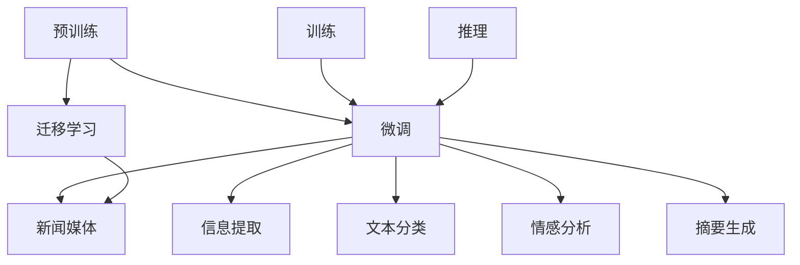

                 

## 1. 背景介绍

在当今信息爆炸的时代，新闻媒体作为信息传播的重要渠道，面临着如何高效准确地处理海量信息的挑战。大语言模型，特别是基于Transformer架构的预训练语言模型，如BERT、GPT系列等，通过在庞大的语料库上进行无监督学习，已经展示了其在新闻媒体领域的巨大潜力。本文将探讨大模型在新闻媒体领域应用所面临的挑战，并分析克服这些挑战的策略和实践。

## 2. 核心概念与联系

### 2.1 核心概念概述

1. **大语言模型(Large Language Models, LLMs)**：基于自回归或自编码结构的深度神经网络，通过在大型语料库上进行预训练，能够生成高质量的自然语言文本。
2. **预训练(Pre-training)**：在无标签数据集上进行的无监督学习，学习语言的基本规律和表征。
3. **微调(Fine-tuning)**：在有标签数据集上进行的监督学习，将预训练模型适配到特定任务，提升模型在特定任务上的表现。
4. **迁移学习(Transfer Learning)**：将一个任务上学习到的知识迁移到另一个任务上，以提高后者的性能。
5. **新闻媒体**：涵盖报纸、杂志、网站、社交媒体等多个渠道，是信息传播的重要平台。
6. **信息提取**：从文本中提取出关键信息，如事件、人物、地点等，以辅助新闻写作、摘要生成等。
7. **文本分类**：将文本分为不同的类别，如新闻、评论、广告等。
8. **情感分析**：判断文本的情感倾向，如正面、负面、中性等。
9. **摘要生成**：生成新闻文本的简洁摘要，便于读者快速了解内容。

### 2.2 核心概念原理和架构的 Mermaid 流程图



## 3. 核心算法原理 & 具体操作步骤

### 3.1 算法原理概述

大语言模型在新闻媒体领域的应用，主要基于以下步骤：

1. **数据收集与预处理**：收集新闻媒体相关的数据，如新闻报道、评论、用户反馈等，并进行预处理，如去除停用词、词性标注、分句等。
2. **预训练**：在大型语料库上进行无监督学习，学习语言的通用规律。
3. **微调**：在有标签的新闻媒体数据集上进行监督学习，适配到新闻分类、情感分析、摘要生成等特定任务。
4. **迁移学习**：将预训练模型迁移到新闻媒体领域，提升模型的泛化能力。
5. **推理与部署**：将微调后的模型部署到实际的新闻媒体应用中，进行文本分类、情感分析、摘要生成等推理任务。

### 3.2 算法步骤详解

#### 3.2.1 数据收集与预处理

数据收集和预处理是应用大模型的第一步，涉及以下几个步骤：

1. **数据收集**：从新闻网站、报纸、社交媒体等渠道收集相关文本数据。确保数据的多样性和代表性，涵盖不同的主题、风格和语境。
2. **文本清洗**：去除无关的噪音数据，如HTML标签、特殊字符、无关的停用词等。
3. **分句和词性标注**：将文本切分为句子，并对每个句子进行词性标注，以方便后续的模型训练和推理。
4. **标准化**：将文本转换为标准格式，如统一字符编码、统一句子分隔符等。

#### 3.2.2 预训练

预训练是利用无标签数据学习语言的基本规律和表征的过程，通常使用自监督任务，如掩码语言模型、下一句预测等。以BERT模型为例，其预训练过程如下：

1. **模型架构**：BERT模型采用Transformer架构，包含多个自注意力层和全连接层。
2. **训练数据**：使用大规模无标签语料库，如维基百科、新闻文章等。
3. **训练目标**：通过掩码语言模型和下一句预测任务，学习单词的上下文关系和句子的序列关系。
4. **参数更新**：使用反向传播算法，优化模型参数，使其能够准确预测掩码单词或判断两个句子是否相邻。

#### 3.2.3 微调

微调是将预训练模型适配到特定任务的过程，通常使用有标签的数据集进行训练。以新闻分类为例，其微调过程如下：

1. **模型选择**：选择合适的预训练模型，如BERT、GPT等。
2. **任务适配层**：在预训练模型的顶部添加任务特定的输出层和损失函数，如分类层的交叉熵损失函数。
3. **数据集划分**：将数据集划分为训练集、验证集和测试集。
4. **学习率设置**：选择合适的学习率，通常比从头训练时更小。
5. **训练与验证**：在训练集上进行梯度下降优化，在验证集上评估模型性能，调整学习率和模型参数。
6. **测试与部署**：在测试集上评估模型性能，将模型部署到实际应用中，进行文本分类、情感分析等推理任务。

#### 3.2.4 迁移学习

迁移学习是将预训练模型的知识迁移到特定任务的过程，通常使用少量有标签数据进行微调。以情感分析为例，其迁移学习过程如下：

1. **数据收集**：收集情感标注的数据集，如电影评论、产品评价等。
2. **模型微调**：在有标签的情感数据集上进行微调，学习情感分类器。
3. **知识迁移**：将情感分析器的知识迁移到新闻情感分析中，提升模型的泛化能力。

### 3.3 算法优缺点

#### 3.3.1 优点

1. **高效准确**：大语言模型通过预训练学习语言的基本规律，微调后能够高效准确地处理新闻媒体相关的文本。
2. **灵活性高**：能够灵活适应不同的新闻媒体应用，如新闻分类、情感分析、摘要生成等。
3. **可解释性**：相比于传统机器学习模型，大语言模型能够提供更丰富的上下文信息，便于解释和调试。
4. **扩展性强**：能够随着新数据的到来，不断更新和优化模型，提升其性能。

#### 3.3.2 缺点

1. **数据依赖**：微调模型的性能高度依赖于有标签数据的质量和数量，获取高质量标注数据的成本较高。
2. **计算资源消耗大**：大语言模型参数量大，需要大量的计算资源进行训练和推理。
3. **对抗性差**：大语言模型对抗性差，容易受到对抗样本的攻击。
4. **模型复杂度高**：大语言模型的复杂度高，推理速度较慢，部署成本高。

### 3.4 算法应用领域

大语言模型在新闻媒体领域的应用非常广泛，主要涉及以下几个方面：

1. **新闻分类**：将新闻文本分为不同的类别，如政治、体育、娱乐等，便于新闻聚合和个性化推荐。
2. **情感分析**：判断新闻文本的情感倾向，如正面、负面、中性等，帮助用户快速了解新闻情绪。
3. **摘要生成**：自动生成新闻文本的简洁摘要，便于用户快速阅读新闻。
4. **信息提取**：从新闻文本中提取关键信息，如事件、人物、地点等，辅助新闻写作和信息检索。
5. **事件监测**：实时监测新闻事件的发展趋势，帮助媒体机构及时报道。

## 4. 数学模型和公式 & 详细讲解 & 举例说明

### 4.1 数学模型构建

大语言模型在新闻媒体领域的应用，通常使用分类任务作为目标，以BERT模型为例，其数学模型构建如下：

1. **输入表示**：将新闻文本转换为模型的输入表示，如Token Embedding。
2. **自注意力层**：使用Transformer的自注意力机制，学习单词之间的上下文关系。
3. **全连接层**：将自注意力层的输出通过全连接层映射到分类层的输入。
4. **分类层**：使用Softmax层输出每个类别的概率分布，如新闻分类任务中的多个类别。

### 4.2 公式推导过程

#### 4.2.1 输入表示

输入表示是将新闻文本转换为模型的输入格式，如BERT模型使用Token Embedding表示输入。假设新闻文本为 $x = (x_1, x_2, ..., x_n)$，其中 $x_i$ 为单词，其Token Embedding表示为 $e_i$，则输入表示为：

$$
X = [e_1, e_2, ..., e_n]
$$

#### 4.2.2 自注意力层

自注意力层使用Transformer的自注意力机制，学习单词之间的上下文关系。假设输入表示为 $X$，自注意力层的输出为 $H$，则自注意力层的计算过程如下：

1. **查询表示**：使用前一时刻的隐状态 $h_{i-1}$ 作为查询表示 $q_i$，计算查询向量 $q_i \in \mathbb{R}^{d}$。
2. **键值表示**：使用当前时刻的隐状态 $h_i$ 作为键值表示 $k_i, v_i \in \mathbb{R}^{d}$。
3. **注意力计算**：计算每个单词对当前单词的注意力权重 $a_i$，计算加权和 $o_i$。
4. **隐状态更新**：将当前隐状态 $h_i$ 和 $o_i$ 进行线性变换，更新当前隐状态 $h_i$。

#### 4.2.3 全连接层

全连接层将自注意力层的输出通过线性变换映射到分类层的输入。假设自注意力层的输出为 $H$，全连接层的输出为 $F$，则全连接层的计算过程如下：

1. **线性变换**：使用全连接层 $W \in \mathbb{R}^{d \times d_{\text{class}}}$ 和偏置 $b \in \mathbb{R}^{d_{\text{class}}}$，计算全连接层的输出 $F$。
2. **Softmax层**：使用Softmax层输出每个类别的概率分布。

### 4.3 案例分析与讲解

以新闻分类任务为例，假设新闻文本为 $x = (x_1, x_2, ..., x_n)$，分类标签为 $y = (y_1, y_2, ..., y_n)$，则微调过程如下：

1. **输入表示**：将新闻文本转换为Token Embedding表示。
2. **自注意力层**：使用Transformer的自注意力机制，学习单词之间的上下文关系。
3. **全连接层**：将自注意力层的输出通过全连接层映射到分类层的输入。
4. **分类层**：使用Softmax层输出每个类别的概率分布。
5. **损失函数**：使用交叉熵损失函数，计算预测标签与真实标签之间的差异。
6. **优化器**：使用AdamW等优化器，最小化损失函数，更新模型参数。

## 5. 项目实践：代码实例和详细解释说明

### 5.1 开发环境搭建

在进行新闻媒体相关的大语言模型应用开发前，需要准备好开发环境。以下是使用Python进行PyTorch开发的环境配置流程：

1. 安装Anaconda：从官网下载并安装Anaconda，用于创建独立的Python环境。

2. 创建并激活虚拟环境：
```bash
conda create -n pytorch-env python=3.8 
conda activate pytorch-env
```

3. 安装PyTorch：根据CUDA版本，从官网获取对应的安装命令。例如：
```bash
conda install pytorch torchvision torchaudio cudatoolkit=11.1 -c pytorch -c conda-forge
```

4. 安装Transformers库：
```bash
pip install transformers
```

5. 安装各类工具包：
```bash
pip install numpy pandas scikit-learn matplotlib tqdm jupyter notebook ipython
```

完成上述步骤后，即可在`pytorch-env`环境中开始开发实践。

### 5.2 源代码详细实现

这里我们以BERT模型进行新闻分类任务的微调为例，给出使用Transformers库的PyTorch代码实现。

首先，定义新闻分类任务的数据处理函数：

```python
from transformers import BertTokenizer
from torch.utils.data import Dataset, DataLoader
import torch

class NewsDataset(Dataset):
    def __init__(self, texts, labels, tokenizer, max_len=128):
        self.texts = texts
        self.labels = labels
        self.tokenizer = tokenizer
        self.max_len = max_len
        
    def __len__(self):
        return len(self.texts)
    
    def __getitem__(self, item):
        text = self.texts[item]
        label = self.labels[item]
        
        encoding = self.tokenizer(text, return_tensors='pt', max_length=self.max_len, padding='max_length', truncation=True)
        input_ids = encoding['input_ids'][0]
        attention_mask = encoding['attention_mask'][0]
        
        # 将标签转换为数字id
        label = label2id[label]
        return {'input_ids': input_ids, 
                'attention_mask': attention_mask,
                'labels': torch.tensor(label, dtype=torch.long)}
```

然后，定义模型和优化器：

```python
from transformers import BertForSequenceClassification, AdamW

model = BertForSequenceClassification.from_pretrained('bert-base-cased', num_labels=num_labels)

optimizer = AdamW(model.parameters(), lr=2e-5)
```

接着，定义训练和评估函数：

```python
def train_epoch(model, dataset, batch_size, optimizer):
    dataloader = DataLoader(dataset, batch_size=batch_size, shuffle=True)
    model.train()
    epoch_loss = 0
    for batch in dataloader:
        input_ids = batch['input_ids'].to(device)
        attention_mask = batch['attention_mask'].to(device)
        labels = batch['labels'].to(device)
        model.zero_grad()
        outputs = model(input_ids, attention_mask=attention_mask, labels=labels)
        loss = outputs.loss
        epoch_loss += loss.item()
        loss.backward()
        optimizer.step()
    return epoch_loss / len(dataloader)

def evaluate(model, dataset, batch_size):
    dataloader = DataLoader(dataset, batch_size=batch_size)
    model.eval()
    preds, labels = [], []
    with torch.no_grad():
        for batch in dataloader:
            input_ids = batch['input_ids'].to(device)
            attention_mask = batch['attention_mask'].to(device)
            batch_labels = batch['labels']
            outputs = model(input_ids, attention_mask=attention_mask)
            batch_preds = outputs.logits.argmax(dim=2).to('cpu').tolist()
            batch_labels = batch_labels.to('cpu').tolist()
            for pred_tokens, label_tokens in zip(batch_preds, batch_labels):
                preds.append(pred_tokens[:len(label_tokens)])
                labels.append(label_tokens)
                
    print(classification_report(labels, preds))
```

最后，启动训练流程并在测试集上评估：

```python
epochs = 5
batch_size = 16

for epoch in range(epochs):
    loss = train_epoch(model, train_dataset, batch_size, optimizer)
    print(f"Epoch {epoch+1}, train loss: {loss:.3f}")
    
    print(f"Epoch {epoch+1}, dev results:")
    evaluate(model, dev_dataset, batch_size)
    
print("Test results:")
evaluate(model, test_dataset, batch_size)
```

以上就是使用PyTorch对BERT进行新闻分类任务微调的完整代码实现。可以看到，得益于Transformers库的强大封装，我们可以用相对简洁的代码完成BERT模型的加载和微调。

### 5.3 代码解读与分析

让我们再详细解读一下关键代码的实现细节：

**NewsDataset类**：
- `__init__`方法：初始化文本、标签、分词器等关键组件。
- `__len__`方法：返回数据集的样本数量。
- `__getitem__`方法：对单个样本进行处理，将文本输入编码为token ids，将标签转换为数字id，并对其进行定长padding，最终返回模型所需的输入。

**模型选择与优化器设置**：
- `bert-base-cased`：选择合适的预训练模型，BERT的base版本，用于新闻分类任务。
- `AdamW`：选择合适的优化器，设置学习率。

**训练和评估函数**：
- 使用PyTorch的DataLoader对数据集进行批次化加载，供模型训练和推理使用。
- `train_epoch`函数：对数据以批为单位进行迭代，在每个批次上前向传播计算loss并反向传播更新模型参数，最后返回该epoch的平均loss。
- `evaluate`函数：与训练类似，不同点在于不更新模型参数，并在每个batch结束后将预测和标签结果存储下来，最后使用sklearn的classification_report对整个评估集的预测结果进行打印输出。

**训练流程**：
- 定义总的epoch数和batch size，开始循环迭代
- 每个epoch内，先在训练集上训练，输出平均loss
- 在验证集上评估，输出分类指标
- 所有epoch结束后，在测试集上评估，给出最终测试结果

可以看到，PyTorch配合Transformers库使得BERT微调的代码实现变得简洁高效。开发者可以将更多精力放在数据处理、模型改进等高层逻辑上，而不必过多关注底层的实现细节。

当然，工业级的系统实现还需考虑更多因素，如模型的保存和部署、超参数的自动搜索、更灵活的任务适配层等。但核心的微调范式基本与此类似。

## 6. 实际应用场景

### 6.1 智能推荐系统

新闻媒体平台可以基于用户的历史阅读行为，利用大语言模型进行智能推荐，帮助用户发现感兴趣的新闻内容。以BERT模型为例，其应用流程如下：

1. **用户行为数据收集**：收集用户的新闻阅读历史，包括新闻标题、分类、评论等。
2. **用户兴趣建模**：利用BERT模型，将用户行为数据转换为兴趣表示，捕捉用户对新闻的偏好。
3. **新闻内容表示**：利用BERT模型，将新闻文本转换为特征表示。
4. **推荐计算**：通过余弦相似度、协同过滤等方法，计算用户和新闻之间的相似度，推荐相似的新闻内容。

### 6.2 自动摘要生成

新闻媒体平台可以自动生成新闻的摘要，便于用户快速了解新闻内容。以BERT模型为例，其应用流程如下：

1. **新闻文本预处理**：将新闻文本进行分句、分词等预处理，转换为BERT模型的输入格式。
2. **摘要生成**：利用BERT模型，对新闻文本进行编码，输出摘要表示。
3. **摘要生成**：通过注意力机制和解码器，生成新闻摘要。

### 6.3 情感分析

新闻媒体平台可以自动分析新闻文本的情感倾向，判断新闻的情感是正面、负面还是中性。以BERT模型为例，其应用流程如下：

1. **新闻文本预处理**：将新闻文本进行分句、分词等预处理，转换为BERT模型的输入格式。
2. **情感分类**：利用BERT模型，对新闻文本进行编码，输出情感表示。
3. **情感分类**：通过分类器，对情感表示进行分类，得到情感分类结果。

### 6.4 未来应用展望

未来，随着大语言模型的进一步发展和优化，其在新闻媒体领域的应用将更加广泛和深入。以下是一些可能的应用方向：

1. **多模态信息融合**：将视觉、听觉等多模态信息与文本信息进行融合，提升新闻内容的丰富性和生动性。
2. **个性化新闻推荐**：利用大语言模型，结合用户行为数据和兴趣模型，进行个性化新闻推荐。
3. **智能新闻写作**：利用大语言模型，自动生成新闻标题、开头、结尾等，提升新闻写作的效率和质量。
4. **事件监测与预警**：利用大语言模型，实时监测新闻事件的发展趋势，提前预警潜在风险。

## 7. 工具和资源推荐

### 7.1 学习资源推荐

为了帮助开发者系统掌握大语言模型在新闻媒体领域的应用，这里推荐一些优质的学习资源：

1. 《自然语言处理》课程（CS224N）：斯坦福大学开设的NLP明星课程，涵盖BERT、GPT等模型的详细介绍。
2. 《BERT: Pre-training of Deep Bidirectional Transformers for Language Understanding》论文：BERT模型的原论文，详细介绍了BERT模型的训练和应用。
3. 《Transformers: From Models to Applications》书籍：Transformer架构和应用领域的详细指南。
4. HuggingFace官方文档：Transformer库的官方文档，提供了海量预训练模型和完整的微调样例代码。
5. Kaggle新闻分类竞赛：参与Kaggle的新闻分类竞赛，了解实际应用中的数据处理和模型微调策略。

通过对这些资源的学习实践，相信你一定能够快速掌握大语言模型在新闻媒体领域的应用，并用于解决实际的NLP问题。

### 7.2 开发工具推荐

高效的开发离不开优秀的工具支持。以下是几款用于大语言模型微调开发的常用工具：

1. PyTorch：基于Python的开源深度学习框架，灵活动态的计算图，适合快速迭代研究。大部分预训练语言模型都有PyTorch版本的实现。
2. TensorFlow：由Google主导开发的开源深度学习框架，生产部署方便，适合大规模工程应用。同样有丰富的预训练语言模型资源。
3. Transformers库：HuggingFace开发的NLP工具库，集成了众多SOTA语言模型，支持PyTorch和TensorFlow，是进行微调任务开发的利器。
4. Weights & Biases：模型训练的实验跟踪工具，可以记录和可视化模型训练过程中的各项指标，方便对比和调优。与主流深度学习框架无缝集成。
5. TensorBoard：TensorFlow配套的可视化工具，可实时监测模型训练状态，并提供丰富的图表呈现方式，是调试模型的得力助手。
6. Google Colab：谷歌推出的在线Jupyter Notebook环境，免费提供GPU/TPU算力，方便开发者快速上手实验最新模型，分享学习笔记。

合理利用这些工具，可以显著提升大语言模型在新闻媒体领域的应用开发效率，加快创新迭代的步伐。

### 7.3 相关论文推荐

大语言模型在新闻媒体领域的应用研究也吸引了众多学者的关注，以下是几篇奠基性的相关论文，推荐阅读：

1. Attention is All You Need：提出了Transformer结构，开启了NLP领域的预训练大模型时代。
2. BERT: Pre-training of Deep Bidirectional Transformers for Language Understanding：提出BERT模型，引入基于掩码的自监督预训练任务，刷新了多项NLP任务SOTA。
3. Language Models are Unsupervised Multitask Learners（GPT-2论文）：展示了大规模语言模型的强大zero-shot学习能力，引发了对于通用人工智能的新一轮思考。
4. Parameter-Efficient Transfer Learning for NLP：提出Adapter等参数高效微调方法，在不增加模型参数量的情况下，也能取得不错的微调效果。
5. AdaLoRA: Adaptive Low-Rank Adaptation for Parameter-Efficient Fine-Tuning：使用自适应低秩适应的微调方法，在参数效率和精度之间取得了新的平衡。
6. Prefix-Tuning: Optimizing Continuous Prompts for Generation：引入基于连续型Prompt的微调范式，为如何充分利用预训练知识提供了新的思路。

这些论文代表了大语言模型在新闻媒体领域的应用研究的发展脉络。通过学习这些前沿成果，可以帮助研究者把握学科前进方向，激发更多的创新灵感。

## 8. 总结：未来发展趋势与挑战

### 8.1 总结

本文对大语言模型在新闻媒体领域的应用进行了全面系统的介绍。首先阐述了大语言模型和微调技术的研究背景和意义，明确了微调在拓展预训练模型应用、提升下游任务性能方面的独特价值。其次，从原理到实践，详细讲解了微调的数学原理和关键步骤，给出了微调任务开发的完整代码实例。同时，本文还探讨了大语言模型在新闻分类、情感分析、摘要生成等多个新闻媒体相关任务中的应用场景，展示了微调范式的巨大潜力。

### 8.2 未来发展趋势

展望未来，大语言模型在新闻媒体领域的应用将呈现以下几个发展趋势：

1. **模型规模持续增大**：随着算力成本的下降和数据规模的扩张，预训练语言模型的参数量还将持续增长。超大规模语言模型蕴含的丰富语言知识，有望支撑更加复杂多变的下游任务微调。
2. **微调方法日趋多样**：开发更加参数高效的微调方法，在固定大部分预训练参数的同时，只更新极少量的任务相关参数。同时优化微调模型的计算图，减少前向传播和反向传播的资源消耗，实现更加轻量级、实时性的部署。
3. **持续学习成为常态**：随着数据分布的不断变化，微调模型也需要持续学习新知识以保持性能。如何在不遗忘原有知识的同时，高效吸收新样本信息，将成为重要的研究课题。
4. **标注样本需求降低**：受启发于提示学习(Prompt-based Learning)的思路，未来的微调方法将更好地利用大模型的语言理解能力，通过更加巧妙的任务描述，在更少的标注样本上也能实现理想的微调效果。
5. **多模态微调崛起**：将视觉、听觉等多模态信息与文本信息进行融合，提升新闻内容的丰富性和生动性。
6. **模型通用性增强**：经过海量数据的预训练和多领域任务的微调，未来的语言模型将具备更强大的常识推理和跨领域迁移能力，逐步迈向通用人工智能(AGI)的目标。

### 8.3 面临的挑战

尽管大语言模型在新闻媒体领域的应用取得了显著进展，但在迈向更加智能化、普适化应用的过程中，仍面临诸多挑战：

1. **数据依赖**：微调模型的性能高度依赖于有标签数据的质量和数量，获取高质量标注数据的成本较高。
2. **计算资源消耗大**：大语言模型参数量大，需要大量的计算资源进行训练和推理。
3. **对抗性差**：大语言模型对抗性差，容易受到对抗样本的攻击。
4. **模型复杂度高**：大语言模型的复杂度高，推理速度较慢，部署成本高。
5. **可解释性不足**：当前微调模型更像是"黑盒"系统，难以解释其内部工作机制和决策逻辑。
6. **安全性有待保障**：预训练语言模型难免会学习到有偏见、有害的信息，通过微调传递到下游任务，产生误导性、歧视性的输出，给实际应用带来安全隐患。
7. **知识整合能力不足**：现有的微调模型往往局限于任务内数据，难以灵活吸收和运用更广泛的先验知识。

### 8.4 研究展望

面向未来，大语言模型在新闻媒体领域的研究需要在以下几个方面寻求新的突破：

1. **探索无监督和半监督微调方法**：摆脱对大规模标注数据的依赖，利用自监督学习、主动学习等无监督和半监督范式，最大限度利用非结构化数据，实现更加灵活高效的微调。
2. **研究参数高效和计算高效的微调范式**：开发更加参数高效的微调方法，在固定大部分预训练参数的同时，只更新极少量的任务相关参数。同时优化微调模型的计算图，减少前向传播和反向传播的资源消耗，实现更加轻量级、实时性的部署。
3. **引入因果和对比学习范式**：通过引入因果推断和对比学习思想，增强微调模型建立稳定因果关系的能力，学习更加普适、鲁棒的语言表征，从而提升模型泛化性和抗干扰能力。
4. **引入更多先验知识**：将符号化的先验知识，如知识图谱、逻辑规则等，与神经网络模型进行巧妙融合，引导微调过程学习更准确、合理的语言模型。同时加强不同模态数据的整合，实现视觉、语音等多模态信息与文本信息的协同建模。
5. **结合因果分析和博弈论工具**：将因果分析方法引入微调模型，识别出模型决策的关键特征，增强输出解释的因果性和逻辑性。借助博弈论工具刻画人机交互过程，主动探索并规避模型的脆弱点，提高系统稳定性。
6. **纳入伦理道德约束**：在模型训练目标中引入伦理导向的评估指标，过滤和惩罚有偏见、有害的输出倾向。同时加强人工干预和审核，建立模型行为的监管机制，确保输出符合人类价值观和伦理道德。

这些研究方向的探索，必将引领大语言模型在新闻媒体领域的研究走向更高的台阶，为构建安全、可靠、可解释、可控的智能系统铺平道路。

## 9. 附录：常见问题与解答

**Q1: 大语言模型在新闻媒体领域的应用有哪些？**

A: 大语言模型在新闻媒体领域的应用主要涉及以下几个方面：

1. **新闻分类**：将新闻文本分为不同的类别，如政治、体育、娱乐等，便于新闻聚合和个性化推荐。
2. **情感分析**：判断新闻文本的情感倾向，如正面、负面、中性等，帮助用户快速了解新闻情绪。
3. **摘要生成**：自动生成新闻文本的简洁摘要，便于用户快速阅读新闻。
4. **信息提取**：从新闻文本中提取关键信息，如事件、人物、地点等，辅助新闻写作和信息检索。
5. **事件监测**：实时监测新闻事件的发展趋势，帮助媒体机构及时报道。

**Q2: 新闻媒体领域的大语言模型微调需要注意哪些问题？**

A: 新闻媒体领域的大语言模型微调需要注意以下问题：

1. **数据依赖**：微调模型的性能高度依赖于有标签数据的质量和数量，获取高质量标注数据的成本较高。
2. **计算资源消耗大**：大语言模型参数量大，需要大量的计算资源进行训练和推理。
3. **对抗性差**：大语言模型对抗性差，容易受到对抗样本的攻击。
4. **模型复杂度高**：大语言模型的复杂度高，推理速度较慢，部署成本高。
5. **可解释性不足**：当前微调模型更像是"黑盒"系统，难以解释其内部工作机制和决策逻辑。
6. **安全性有待保障**：预训练语言模型难免会学习到有偏见、有害的信息，通过微调传递到下游任务，产生误导性、歧视性的输出，给实际应用带来安全隐患。
7. **知识整合能力不足**：现有的微调模型往往局限于任务内数据，难以灵活吸收和运用更广泛的先验知识。

**Q3: 大语言模型在新闻媒体领域的未来发展方向是什么？**

A: 大语言模型在新闻媒体领域的未来发展方向主要包括以下几个方面：

1. **模型规模持续增大**：随着算力成本的下降和数据规模的扩张，预训练语言模型的参数量还将持续增长。超大规模语言模型蕴含的丰富语言知识，有望支撑更加复杂多变的下游任务微调。
2. **微调方法日趋多样**：开发更加参数高效的微调方法，在固定大部分预训练参数的同时，只更新极少量的任务相关参数。同时优化微调模型的计算图，减少前向传播和反向传播的资源消耗，实现更加轻量级、实时性的部署。
3. **持续学习成为常态**：随着数据分布的不断变化，微调模型也需要持续学习新知识以保持性能。如何在不遗忘原有知识的同时，高效吸收新样本信息，将成为重要的研究课题。
4. **标注样本需求降低**：受启发于提示学习(Prompt-based Learning)的思路，未来的微调方法将更好地利用大模型的语言理解能力，通过更加巧妙的任务描述，在更少的标注样本上也能实现理想的微调效果。
5. **多模态微调崛起**：将视觉、听觉等多模态信息与文本信息进行融合，提升新闻内容的丰富性和生动性。
6. **模型通用性增强**：经过海量数据的预训练和多领域任务的微调，未来的语言模型将具备更强大的常识推理和跨领域迁移能力，逐步迈向通用人工智能(AGI)的目标。

**Q4: 大语言模型在新闻媒体领域的应用面临哪些挑战？**

A: 大语言模型在新闻媒体领域的应用面临以下挑战：

1. **数据依赖**：微调模型的性能高度依赖于有标签数据的质量和数量，获取高质量标注数据的成本较高。
2. **计算资源消耗大**：大语言模型参数量大，需要大量的计算资源进行训练和推理。
3. **对抗性差**：大语言模型对抗性差，容易受到对抗样本的攻击。
4. **模型复杂度高**：大语言模型的复杂度高，推理速度较慢，部署成本高。
5. **可解释性不足**：当前微调模型更像是"黑盒"系统，难以解释其内部工作机制和决策逻辑。
6. **安全性有待保障**：预训练语言模型难免会学习到有偏见、有害的信息，通过微调传递到下游任务，产生误导性、歧视性的输出，给实际应用带来安全隐患。
7. **知识整合能力不足**：现有的微调模型往往局限于任务内数据，难以灵活吸收和运用更广泛的先验知识。

**Q5: 如何优化大语言模型在新闻媒体领域的应用？**

A: 优化大语言模型在新闻媒体领域的应用可以从以下几个方面入手：

1. **数据增强**：通过回译、近义替换等方式扩充训练集，提升模型的泛化能力。
2. **正则化技术**：使用L2正则、Dropout、Early Stopping等正则化技术，防止模型过度适应小规模训练集。
3. **参数高效微调**：开发参数高效微调方法，如Adapter、LoRA等，在固定大部分预训练参数的同时，只更新极少量的任务相关参数。
4. **对抗训练**：加入对抗样本，提高模型鲁棒性，避免对抗性攻击。
5. **提示学习**：通过精心设计输入文本的格式，引导模型按期望方式输出，减少微调参数。
6. **持续学习**：保持模型的时效性，不断学习新数据，提升模型的泛化能力。
7. **模型压缩**：采用模型压缩技术，减小模型尺寸，加快推理速度，降低部署成本。
8. **多模态融合**：将视觉、听觉等多模态信息与文本信息进行融合，提升新闻内容的丰富性和生动性。
9. **可解释性增强**：引入可解释性技术，如注意力机制、层级解释等，增强模型的可解释性。
10. **安全保障**：在模型训练目标中引入伦理导向的评估指标，过滤和惩罚有偏见、有害的输出倾向，确保模型的安全性。

通过上述优化措施，可以显著提升大语言模型在新闻媒体领域的应用效果，使其更加高效、可靠、可解释和可控。

---

作者：禅与计算机程序设计艺术 / Zen and the Art of Computer Programming

