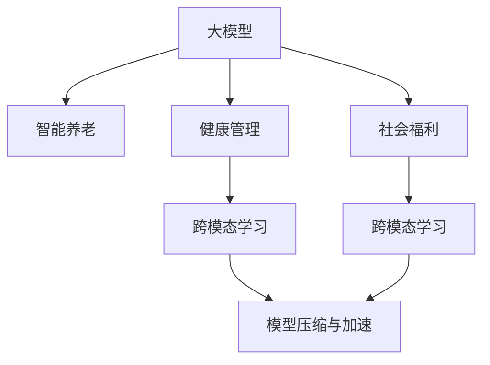

                 

# 大模型在智能养老中的应用前景

> 关键词：大模型,智能养老,机器学习,健康管理,社会福利

## 1. 背景介绍

随着人口老龄化的加剧，养老问题成为全球关注的焦点。传统的养老模式依靠家庭、社区和政府机构的力量，面临护理人员短缺、服务成本高昂等诸多挑战。智能养老（Intelligent Aging）作为解决养老问题的有效途径，正受到越来越多的关注和投入。

### 1.1 问题由来

智能养老利用信息技术和人工智能技术，提供智能化、个性化、可穿戴的养老服务。其核心在于利用大模型（如深度学习、自然语言处理、计算机视觉等）处理海量数据，辅助养老决策，改善老年人的生活质量，提高养老服务的效率和可及性。智能养老的典型应用包括智能家居、健康监测、精神陪伴、康复训练等方面。

然而，智能养老系统对大模型的依赖性较强。目前，大模型的训练需要大量的数据和计算资源，模型的推理也涉及复杂算法和优化策略。如何在大模型应用中实现高效、准确、可靠的智能养老服务，成为当前智能养老领域的重要研究课题。

### 1.2 问题核心关键点

智能养老的核心问题包括以下几个方面：

1. **数据隐私与安全性**：老年人的隐私数据处理需严格遵循法律法规，避免数据泄露和滥用。
2. **数据质量与标注**：养老数据的质量和标注对模型的效果影响巨大，需提高数据的准确性和多样性。
3. **模型轻量化与计算效率**：养老服务需要实时响应，对模型的计算效率和资源消耗要求较高。
4. **模型的可靠性和可解释性**：养老决策涉及老年人健康和生命安全，模型的输出需具备高度可靠性和可解释性。
5. **跨模态数据的融合**：养老数据往往涉及图像、语音、文本等多种模态，需设计跨模态的融合模型以提高预测准确度。

这些核心问题要求智能养老系统具备强大的数据处理能力和先进的算法模型，并从工程实践角度进行全面优化，方能真正实现智能养老的目标。

## 2. 核心概念与联系

### 2.1 核心概念概述

为更好地理解大模型在智能养老中的应用，本节将介绍几个关键概念：

- **大模型（Large Model）**：指深度学习框架中参数量较大的模型，如BERT、GPT等。大模型通过大量的数据进行训练，能够学习到丰富的特征和模式，适用于多种复杂任务。
- **智能养老（Intelligent Aging）**：利用信息技术和人工智能技术，提供智能化、个性化、可穿戴的养老服务。涉及养老数据的收集、存储、处理、分析等环节。
- **健康管理（Health Management）**：通过智能养老系统，实现老年人健康状况的实时监测、预警、干预等功能，提高老年人的生活质量。
- **社会福利（Social Welfare）**：利用智能养老技术，优化养老资源分配，减轻社会负担，促进社会和谐。
- **跨模态学习（Cross-modal Learning）**：指同时处理图像、语音、文本等多模态数据，以提高模型的预测能力和泛化性能。
- **模型压缩与加速（Model Compression & Acceleration）**：针对大模型计算资源密集的特点，采用模型压缩、量化、剪枝等技术，优化模型的推理效率。

这些核心概念之间的联系可以通过以下Mermaid流程图来展示：



这个流程图展示了大模型在智能养老中的应用流程：

1. 大模型通过跨模态学习处理多模态数据。
2. 健康管理模块利用模型进行老年人的健康监测和干预。
3. 社会福利模块通过模型优化资源分配，提升服务效率。
4. 模型压缩与加速技术提高模型的实时推理能力。

## 3. 核心算法原理 & 具体操作步骤
### 3.1 算法原理概述

大模型在智能养老中的应用，主要基于机器学习和深度学习算法，实现对海量养老数据的分析和预测。具体而言，大模型在训练阶段通过大量标注数据学习到特征表示，在推理阶段则利用这些表示进行实时预测和决策。

以健康管理为例，假设训练集为 $D=\{(x_i,y_i)\}_{i=1}^N$，其中 $x_i$ 为老年人的健康监测数据，$y_i$ 为老年人健康状况标签。大模型 $M_{\theta}$ 通过前向传播计算损失函数 $\mathcal{L}(M_{\theta},D)$，并使用梯度下降等优化算法更新参数 $\theta$。在推理阶段，大模型根据新的输入数据 $x$，计算输出 $\hat{y}=M_{\theta}(x)$，实现对老年人健康状况的预测。

### 3.2 算法步骤详解

基于大模型的智能养老系统开发，一般包括以下几个关键步骤：

**Step 1: 准备养老数据集**
- 收集多模态的养老数据，如心率、血压、运动轨迹、语音、文本等。
- 对数据进行清洗、归一化、标注等预处理操作。

**Step 2: 选择合适的预训练模型**
- 选择适合养老任务的预训练大模型，如BERT、ResNet、GPT等。
- 下载并加载预训练模型，初始化模型参数。

**Step 3: 定义模型输出层和损失函数**
- 根据任务类型，设计合适的输出层结构。
- 定义相应的损失函数，如交叉熵、均方误差等。

**Step 4: 设置模型训练超参数**
- 设置学习率、批大小、迭代轮数、正则化参数等。
- 选择合适的优化算法，如Adam、SGD等。

**Step 5: 执行模型训练**
- 将数据集分为训练集、验证集和测试集。
- 定义训练函数，进行模型迭代训练。
- 周期性在验证集上评估模型性能，避免过拟合。

**Step 6: 模型推理与决策**
- 将模型部署到实际应用环境。
- 对新输入数据进行前向传播计算输出。
- 根据输出进行养老决策，如健康干预、应急响应等。

**Step 7: 系统集成与优化**
- 将模型集成到养老系统中，提供界面友好、易于操作的用户服务。
- 根据用户反馈，优化模型和系统性能。

### 3.3 算法优缺点

基于大模型的智能养老应用有以下优点：

1. **数据驱动**：通过大量标注数据进行训练，大模型能够学习到丰富的特征和模式，具备强大的预测能力。
2. **泛化性强**：大模型经过大规模数据训练，具有较好的泛化性能，适用于多种类型的养老任务。
3. **实时响应**：大模型推理速度快，能够实现实时响应，满足养老服务的即时性需求。
4. **适应性广**：大模型适用于多模态数据的处理，能够适应不同类型和来源的数据。

同时，也存在一些缺点：

1. **数据隐私与安全**：大模型涉及大量个人敏感数据，需严格保护数据隐私和安全。
2. **计算资源消耗大**：大模型参数量大，推理过程中计算开销较大。
3. **模型可解释性差**：大模型的决策过程较为复杂，缺乏可解释性，难以理解和调试。
4. **过拟合风险高**：若数据标注不足或数据分布不均，模型容易过拟合。

针对这些缺点，需采取相应的改进措施，如数据匿名化、模型压缩、对抗训练等，以提升系统的可靠性和性能。

### 3.4 算法应用领域

大模型在智能养老中的应用领域非常广泛，具体包括：

- **健康监测与预警**：利用大模型进行老年人的健康数据分析，预测潜在健康风险，并提供预警和干预。
- **康复训练与辅助**：设计康复训练方案，通过语音识别、动作识别等技术，辅助老年人进行康复训练。
- **生活照护与陪伴**：利用自然语言处理和计算机视觉技术，实现老年人与机器的交互，提供情感陪伴和生活照护。
- **资源优化与管理**：通过大模型优化养老资源配置，如床位、护理人员、医疗设备等。

此外，大模型还可以应用于智慧养老社区、养老机器人、老年教育等更多场景中，为老年人提供全方位的服务。

## 4. 数学模型和公式 & 详细讲解 & 举例说明
### 4.1 数学模型构建

以老年人健康监测为例，假设健康数据 $x$ 包含心率、血压、步数等多个特征，健康状况 $y$ 为二分类变量，表示是否患有某种疾病。定义模型为 $M_{\theta}$，其输入为 $x$，输出为 $\hat{y}$。

则目标为最小化损失函数 $\mathcal{L}(M_{\theta},D)$，其中 $D=\{(x_i,y_i)\}_{i=1}^N$ 为训练数据集，损失函数为二分类交叉熵损失：

$$
\mathcal{L}(M_{\theta},D) = -\frac{1}{N}\sum_{i=1}^N [y_i \log \hat{y_i} + (1-y_i)\log(1-\hat{y_i})]
$$

其中 $y_i$ 为真实标签，$\hat{y_i}$ 为模型预测结果。

### 4.2 公式推导过程

在训练过程中，使用梯度下降算法更新模型参数：

$$
\theta \leftarrow \theta - \eta \nabla_{\theta} \mathcal{L}(M_{\theta},D)
$$

其中 $\eta$ 为学习率，$\nabla_{\theta} \mathcal{L}(M_{\theta},D)$ 为损失函数对参数 $\theta$ 的梯度。

在推理阶段，将新输入数据 $x$ 输入模型 $M_{\theta}$，计算预测结果 $\hat{y}=M_{\theta}(x)$。

### 4.3 案例分析与讲解

以老年人跌倒预测为例，假设跌倒数据集 $D=\{(x_i,y_i)\}_{i=1}^N$，其中 $x_i$ 为老年人跌倒前的行为数据，$y_i$ 为是否跌倒的标签。

使用大模型训练跌倒预测模型，步骤如下：

1. 收集跌倒数据，标注为跌倒和非跌倒两类。
2. 使用大模型，如BERT、ResNet等，进行模型训练。
3. 定义输出层为二分类输出，损失函数为二分类交叉熵。
4. 使用梯度下降算法更新模型参数。
5. 在测试集上评估模型性能，如准确率、召回率、F1-score等。

具体实现如下：

```python
from transformers import BertModel, BertTokenizer
from torch.utils.data import Dataset, DataLoader
from torch import nn, optim

class FallDataset(Dataset):
    def __init__(self, data, tokenizer):
        self.data = data
        self.tokenizer = tokenizer
    
    def __len__(self):
        return len(self.data)
    
    def __getitem__(self, idx):
        data = self.data[idx]
        text = data['text']
        label = data['label']
        
        encoding = self.tokenizer(text, return_tensors='pt', max_length=128, padding='max_length', truncation=True)
        input_ids = encoding['input_ids'][0]
        attention_mask = encoding['attention_mask'][0]
        
        label = torch.tensor(label, dtype=torch.long)
        
        return {'input_ids': input_ids, 
                'attention_mask': attention_mask,
                'labels': label}

# 定义模型和训练函数
model = BertModel.from_pretrained('bert-base-cased', num_labels=2)
optimizer = optim.Adam(model.parameters(), lr=2e-5)
def train_epoch(model, dataset, batch_size, optimizer):
    dataloader = DataLoader(dataset, batch_size=batch_size, shuffle=True)
    model.train()
    epoch_loss = 0
    for batch in dataloader:
        input_ids = batch['input_ids'].to(device)
        attention_mask = batch['attention_mask'].to(device)
        labels = batch['labels'].to(device)
        model.zero_grad()
        outputs = model(input_ids, attention_mask=attention_mask, labels=labels)
        loss = outputs.loss
        epoch_loss += loss.item()
        loss.backward()
        optimizer.step()
    return epoch_loss / len(dataloader)

# 训练模型
device = torch.device('cuda') if torch.cuda.is_available() else torch.device('cpu')
model.to(device)

train_dataset = FallDataset(train_data, tokenizer)
dev_dataset = FallDataset(dev_data, tokenizer)
test_dataset = FallDataset(test_data, tokenizer)

epochs = 5
batch_size = 16

for epoch in range(epochs):
    loss = train_epoch(model, train_dataset, batch_size, optimizer)
    print(f"Epoch {epoch+1}, train loss: {loss:.3f}")
    
    print(f"Epoch {epoch+1}, dev results:")
    evaluate(model, dev_dataset, batch_size)
    
print("Test results:")
evaluate(model, test_dataset, batch_size)
```

以上就是使用Bert模型进行老年人跌倒预测的代码实现。可以看到，通过合理设计模型结构和损失函数，并结合合适的优化算法，大模型可以有效地进行跌倒预测。

## 5. 项目实践：代码实例和详细解释说明
### 5.1 开发环境搭建

进行智能养老系统开发前，我们需要准备好开发环境。以下是使用Python进行PyTorch开发的环境配置流程：

1. 安装Anaconda：从官网下载并安装Anaconda，用于创建独立的Python环境。

2. 创建并激活虚拟环境：
```bash
conda create -n aging-env python=3.8 
conda activate aging-env
```

3. 安装PyTorch：根据CUDA版本，从官网获取对应的安装命令。例如：
```bash
conda install pytorch torchvision torchaudio cudatoolkit=11.1 -c pytorch -c conda-forge
```

4. 安装TensorFlow：如果项目需要使用TensorFlow，可以通过以下命令进行安装：
```bash
conda install tensorflow=2.6
```

5. 安装各类工具包：
```bash
pip install numpy pandas scikit-learn matplotlib tqdm jupyter notebook ipython
```

完成上述步骤后，即可在`aging-env`环境中开始智能养老系统开发。

### 5.2 源代码详细实现

这里我们以老年人跌倒预测为例，给出使用Bert模型进行微调的PyTorch代码实现。

首先，定义跌倒预测任务的数据处理函数：

```python
from transformers import BertTokenizer
from torch.utils.data import Dataset
import torch

class FallDataset(Dataset):
    def __init__(self, texts, labels, tokenizer, max_len=128):
        self.texts = texts
        self.labels = labels
        self.tokenizer = tokenizer
        self.max_len = max_len
        
    def __len__(self):
        return len(self.texts)
    
    def __getitem__(self, item):
        text = self.texts[item]
        label = self.labels[item]
        
        encoding = self.tokenizer(text, return_tensors='pt', max_length=self.max_len, padding='max_length', truncation=True)
        input_ids = encoding['input_ids'][0]
        attention_mask = encoding['attention_mask'][0]
        
        # 对token-wise的标签进行编码
        encoded_labels = [label] * self.max_len
        labels = torch.tensor(encoded_labels, dtype=torch.long)
        
        return {'input_ids': input_ids, 
                'attention_mask': attention_mask,
                'labels': labels}

# 标签与id的映射
tag2id = {'跌倒': 0, '未跌倒': 1}
id2tag = {v: k for k, v in tag2id.items()}

# 创建dataset
tokenizer = BertTokenizer.from_pretrained('bert-base-cased')

train_dataset = FallDataset(train_texts, train_labels, tokenizer)
dev_dataset = FallDataset(dev_texts, dev_labels, tokenizer)
test_dataset = FallDataset(test_texts, test_labels, tokenizer)
```

然后，定义模型和优化器：

```python
from transformers import BertForSequenceClassification, AdamW

model = BertForSequenceClassification.from_pretrained('bert-base-cased', num_labels=len(tag2id))

optimizer = AdamW(model.parameters(), lr=2e-5)
```

接着，定义训练和评估函数：

```python
from torch.utils.data import DataLoader
from tqdm import tqdm
from sklearn.metrics import classification_report

device = torch.device('cuda') if torch.cuda.is_available() else torch.device('cpu')
model.to(device)

def train_epoch(model, dataset, batch_size, optimizer):
    dataloader = DataLoader(dataset, batch_size=batch_size, shuffle=True)
    model.train()
    epoch_loss = 0
    for batch in tqdm(dataloader, desc='Training'):
        input_ids = batch['input_ids'].to(device)
        attention_mask = batch['attention_mask'].to(device)
        labels = batch['labels'].to(device)
        model.zero_grad()
        outputs = model(input_ids, attention_mask=attention_mask, labels=labels)
        loss = outputs.loss
        epoch_loss += loss.item()
        loss.backward()
        optimizer.step()
    return epoch_loss / len(dataloader)

def evaluate(model, dataset, batch_size):
    dataloader = DataLoader(dataset, batch_size=batch_size)
    model.eval()
    preds, labels = [], []
    with torch.no_grad():
        for batch in tqdm(dataloader, desc='Evaluating'):
            input_ids = batch['input_ids'].to(device)
            attention_mask = batch['attention_mask'].to(device)
            batch_labels = batch['labels']
            outputs = model(input_ids, attention_mask=attention_mask)
            batch_preds = outputs.logits.argmax(dim=2).to('cpu').tolist()
            batch_labels = batch_labels.to('cpu').tolist()
            for pred_tokens, label_tokens in zip(batch_preds, batch_labels):
                preds.append(pred_tokens[:len(label_tokens)])
                labels.append(label_tokens)
                
    print(classification_report(labels, preds))
```

最后，启动训练流程并在测试集上评估：

```python
epochs = 5
batch_size = 16

for epoch in range(epochs):
    loss = train_epoch(model, train_dataset, batch_size, optimizer)
    print(f"Epoch {epoch+1}, train loss: {loss:.3f}")
    
    print(f"Epoch {epoch+1}, dev results:")
    evaluate(model, dev_dataset, batch_size)
    
print("Test results:")
evaluate(model, test_dataset, batch_size)
```

以上就是使用PyTorch对Bert模型进行老年人跌倒预测的完整代码实现。可以看到，得益于Transformers库的强大封装，我们可以用相对简洁的代码完成Bert模型的加载和微调。

### 5.3 代码解读与分析

让我们再详细解读一下关键代码的实现细节：

**FallDataset类**：
- `__init__`方法：初始化文本、标签、分词器等关键组件。
- `__len__`方法：返回数据集的样本数量。
- `__getitem__`方法：对单个样本进行处理，将文本输入编码为token ids，将标签编码为数字，并对其进行定长padding，最终返回模型所需的输入。

**tag2id和id2tag字典**：
- 定义了标签与数字id之间的映射关系，用于将token-wise的预测结果解码回真实的标签。

**训练和评估函数**：
- 使用PyTorch的DataLoader对数据集进行批次化加载，供模型训练和推理使用。
- 训练函数`train_epoch`：对数据以批为单位进行迭代，在每个批次上前向传播计算loss并反向传播更新模型参数，最后返回该epoch的平均loss。
- 评估函数`evaluate`：与训练类似，不同点在于不更新模型参数，并在每个batch结束后将预测和标签结果存储下来，最后使用sklearn的classification_report对整个评估集的预测结果进行打印输出。

**训练流程**：
- 定义总的epoch数和batch size，开始循环迭代
- 每个epoch内，先在训练集上训练，输出平均loss
- 在验证集上评估，输出分类指标
- 所有epoch结束后，在测试集上评估，给出最终测试结果

可以看到，PyTorch配合Transformers库使得Bert微调的代码实现变得简洁高效。开发者可以将更多精力放在数据处理、模型改进等高层逻辑上，而不必过多关注底层的实现细节。

当然，工业级的系统实现还需考虑更多因素，如模型的保存和部署、超参数的自动搜索、更灵活的任务适配层等。但核心的微调范式基本与此类似。

## 6. 实际应用场景
### 6.1 老年健康管理平台

智能养老的核心应用之一是老年健康管理平台。平台通过智能穿戴设备收集老年人的健康数据，如心率、血压、步数、睡眠质量等，结合大模型进行实时分析和预测，帮助老年人进行健康管理。

以老年人跌倒预测为例，平台可以使用上述代码对Bert模型进行微调。具体步骤如下：

1. 收集老年人的日常活动数据，标注为跌倒和非跌倒两类。
2. 在智能养老系统中加载大模型，如Bert、ResNet等。
3. 定义模型输出层为二分类输出，损失函数为二分类交叉熵。
4. 使用梯度下降算法更新模型参数。
5. 在测试集上评估模型性能，如准确率、召回率、F1-score等。
6. 部署模型到智能养老平台，实时监测老年人的健康数据，并根据预测结果进行健康干预。

**案例分析**：

某智能养老平台通过智能手环监测老年人的日常活动数据，如心率、步数、睡眠质量等。利用上述Bert模型进行跌倒预测，步骤如下：

1. 平台每天收集每位老年人的手环数据，标注为跌倒和非跌倒两类。
2. 将数据送入Bert模型进行训练，使用二分类交叉熵损失函数进行优化。
3. 模型在验证集上评估性能，选择最优参数部署到生产环境。
4. 平台实时监测老年人的健康数据，输入到训练好的模型中进行预测。
5. 根据预测结果，系统自动提醒护理人员，进行健康干预。

通过智能养老平台，老年人可以实现自主健康管理，降低跌倒风险，提高生活质量。平台还可以扩展到健康监测、预警、干预等多个方面，为老年人提供全方位的服务。

### 6.2 智慧养老社区

智慧养老社区通过物联网技术，将智能设备、安防监控、环境监测等数据集成到系统中，利用大模型进行分析和预测，提升社区的管理和服务水平。

以老年人跌倒监测为例，社区可以部署大模型，实时监测老年人的行为数据，预测跌倒风险，并自动报警和响应。具体步骤如下：

1. 社区安装智能摄像头和传感器，采集老年人的行为数据。
2. 将采集到的数据输入到训练好的模型中进行预测。
3. 模型输出跌倒概率，阈值设定为0.8。
4. 当预测概率超过0.8时，系统自动报警并通知护理人员。
5. 护理人员根据报警信息，进行现场确认和干预。

**案例分析**：

某智慧养老社区通过智能摄像头和传感器监测老年人的行为数据，如行走速度、姿态、跌倒次数等。利用训练好的Bert模型进行跌倒预测，步骤如下：

1. 社区每天收集每位老人的摄像头和传感器数据。
2. 将数据输入到Bert模型中进行训练，使用二分类交叉熵损失函数进行优化。
3. 模型在验证集上评估性能，选择最优参数部署到生产环境。
4. 系统实时监测老年人的行为数据，输入到训练好的模型中进行预测。
5. 根据预测结果，系统自动报警并通知护理人员，进行现场确认和干预。

通过智慧养老社区，老年人可以实现安全、舒适的生活环境，提升生活质量。平台还可以扩展到应急响应、资源管理、服务调度等多个方面，为老年人提供更加全面、高效的服务。

### 6.3 家庭健康管理系统

家庭健康管理系统通过智能穿戴设备、传感器等，收集老年人的健康数据，利用大模型进行分析和预测，实现家庭健康管理。

以老年人跌倒预测为例，系统可以通过智能手环监测老年人的日常活动数据，利用大模型进行跌倒预测，并提供预警和干预。具体步骤如下：

1. 家庭成员为老年人配备智能手环，收集日常活动数据。
2. 将数据输入到训练好的模型中进行预测。
3. 模型输出跌倒概率，阈值设定为0.8。
4. 当预测概率超过0.8时，系统自动报警并通知家庭成员。
5. 家庭成员根据报警信息，进行现场确认和干预。

**案例分析**：

某家庭健康管理系统通过智能手环监测老年人的日常活动数据，如心率、步数、睡眠质量等。利用训练好的Bert模型进行跌倒预测，步骤如下：

1. 系统每天收集每位老人的手环数据。
2. 将数据输入到Bert模型中进行训练，使用二分类交叉熵损失函数进行优化。
3. 模型在验证集上评估性能，选择最优参数部署到生产环境。
4. 系统实时监测老年人的健康数据，输入到训练好的模型中进行预测。
5. 根据预测结果，系统自动报警并通知家庭成员，进行现场确认和干预。

通过家庭健康管理系统，老年人可以实现自主健康管理，降低跌倒风险，提高生活质量。平台还可以扩展到健康监测、预警、干预等多个方面，为老年人提供全方位的服务。

### 6.4 未来应用展望

随着大模型的不断发展，智能养老将迎来更多的应用场景和创新突破。未来，大模型在智能养老中的应用将呈现以下几个趋势：

1. **多模态数据融合**：养老数据涉及图像、语音、文本等多种模态，未来将引入更多跨模态数据融合技术，提升预测准确性和鲁棒性。
2. **实时交互与对话**：利用自然语言处理技术，实现老年人与智能系统的自然交互和对话，提高用户体验。
3. **个性化健康管理**：通过大模型学习个体差异，提供个性化健康管理方案，提高健康干预的精准性。
4. **跨域数据共享**：实现跨区域、跨机构的数据共享，提升养老服务的普适性和可及性。
5. **隐私保护与安全**：引入隐私保护和数据加密技术，确保老年人数据的安全性和隐私性。

总之，大模型在智能养老中的应用前景广阔，未来将逐步融入到养老服务各个环节，为老年人提供更加智能化、个性化、可穿戴的健康管理服务。通过多模态数据融合、实时交互对话、个性化健康管理、跨域数据共享等创新技术的应用，智能养老系统将变得更加智能、安全、便捷，真正实现老有所养、老有所依。

## 7. 工具和资源推荐
### 7.1 学习资源推荐

为了帮助开发者系统掌握大模型在智能养老中的应用，这里推荐一些优质的学习资源：

1. 《Transformers from Language Models to Attention》系列博文：由大模型技术专家撰写，深入浅出地介绍了Transformer原理、BERT模型、微调技术等前沿话题。

2. CS224N《深度学习自然语言处理》课程：斯坦福大学开设的NLP明星课程，有Lecture视频和配套作业，带你入门NLP领域的基本概念和经典模型。

3. 《Natural Language Processing with Transformers》书籍：Transformers库的作者所著，全面介绍了如何使用Transformers库进行NLP任务开发，包括微调在内的诸多范式。

4. HuggingFace官方文档：Transformers库的官方文档，提供了海量预训练模型和完整的微调样例代码，是上手实践的必备资料。

5. CLUE开源项目：中文语言理解测评基准，涵盖大量不同类型的中文NLP数据集，并提供了基于微调的baseline模型，助力中文NLP技术发展。

通过对这些资源的学习实践，相信你一定能够快速掌握大模型在智能养老中的应用精髓，并用于解决实际的NLP问题。

### 7.2 开发工具推荐

高效的开发离不开优秀的工具支持。以下是几款用于智能养老系统开发的常用工具：

1. PyTorch：基于Python的开源深度学习框架，灵活动态的计算图，适合快速迭代研究。大部分预训练语言模型都有PyTorch版本的实现。

2. TensorFlow：由Google主导开发的开源深度学习框架，生产部署方便，适合大规模工程应用。同样有丰富的预训练语言模型资源。

3. Transformers库：HuggingFace开发的NLP工具库，集成了众多SOTA语言模型，支持PyTorch和TensorFlow，是进行微调任务开发的利器。

4. Weights & Biases：模型训练的实验跟踪工具，可以记录和可视化模型训练过程中的各项指标，方便对比和调优。与主流深度学习框架无缝集成。

5. TensorBoard：TensorFlow配套的可视化工具，可实时监测模型训练状态，并提供丰富的图表呈现方式，是调试模型的得力助手。

6. Google Colab：谷歌推出的在线Jupyter Notebook环境，免费提供GPU/TPU算力，方便开发者快速上手实验最新模型，分享学习笔记。

合理利用这些工具，可以显著提升智能养老系统开发效率，加快创新迭代的步伐。

### 7.3 相关论文推荐

大模型在智能养老中的应用源于学界的持续研究。以下是几篇奠基性的相关论文，推荐阅读：

1. Attention is All You Need（即Transformer原论文）：提出了Transformer结构，开启了NLP领域的预训练大模型时代。

2. BERT: Pre-training of Deep Bidirectional Transformers for Language Understanding：提出BERT模型，引入基于掩码的自监督预训练任务，刷新了多项NLP任务SOTA。

3. Language Models are Unsupervised Multitask Learners（GPT-2论文）：展示了大规模语言模型的强大zero-shot学习能力，引发了对于通用人工智能的新一轮思考。

4. Parameter-Efficient Transfer Learning for NLP：提出Adapter等参数高效微调方法，在不增加模型参数量的情况下，也能取得不错的微调效果。

5. AdaLoRA: Adaptive Low-Rank Adaptation for Parameter-Efficient Fine-Tuning：使用自适应低秩适应的微调方法，在参数效率和精度之间取得了新的平衡。

这些论文代表了大模型在智能养老中的应用发展脉络。通过学习这些前沿成果，可以帮助研究者把握学科前进方向，激发更多的创新灵感。

## 8. 总结：未来发展趋势与挑战

### 8.1 总结

本文对大模型在智能养老中的应用进行了全面系统的介绍。首先阐述了智能养老的背景和智能养老系统开发的关键问题，明确了大模型在智能养老中的核心作用。其次，从原理到实践，详细讲解了大模型的算法原理和微调步骤，给出了智能养老系统开发的完整代码实例。同时，本文还探讨了智能养老的多个应用场景，展示了其广泛的应用前景。

通过本文的系统梳理，可以看到，大模型在智能养老中的应用前景广阔，具备强大的数据分析和预测能力，能够有效解决养老问题，提升老年人的生活质量。大模型通过多模态数据的融合、实时交互对话、个性化健康管理等技术，将逐步融入到养老服务各个环节，为老年人提供更加智能化、个性化、可穿戴的健康管理服务。

### 8.2 未来发展趋势

展望未来，大模型在智能养老中的应用将呈现以下几个趋势：

1. **数据驱动**：智能养老系统将更多地依赖于数据驱动，通过收集、清洗、标注海量养老数据，不断提升模型的预测能力。
2. **多模态融合**：未来养老数据将涉及图像、语音、文本等多种模态，智能养老系统需引入更多跨模态数据融合技术，提升预测准确性和鲁棒性。
3. **实时交互**：利用自然语言处理技术，实现老年人与智能系统的自然交互和对话，提高用户体验。
4. **个性化服务**：通过大模型学习个体差异，提供个性化健康管理方案，提高健康干预的精准性。
5. **跨域数据共享**：实现跨区域、跨机构的数据共享，提升养老服务的普适性和可及性。
6. **隐私保护与安全**：引入隐私保护和数据加密技术，确保老年人数据的安全性和隐私性。

以上趋势凸显了大模型在智能养老中的广阔前景。这些方向的探索发展，必将进一步提升智能养老系统的性能和应用范围，为老年人提供更加全面、高效、安全的养老服务。

### 8.3 面临的挑战

尽管大模型在智能养老中的应用前景广阔，但在迈向更加智能化、普适化应用的过程中，它仍面临着诸多挑战：

1. **数据隐私与安全**：老年人的隐私数据处理需严格遵循法律法规，避免数据泄露和滥用。
2. **数据质量与标注**：养老数据的质量和标注对模型的效果影响巨大，需提高数据的准确性和多样性。
3. **计算资源消耗大**：大模型参数量大，推理过程中计算开销较大，需优化计算资源消耗。
4. **模型可解释性差**：大模型的决策过程较为复杂，缺乏可解释性，难以理解和调试。
5. **跨模态数据融合**：养老数据涉及多种模态，跨模态数据融合技术需进一步发展。
6. **实时交互与对话**：实现自然交互和对话技术需进一步提升，提高用户体验。

针对这些挑战，需采取相应的改进措施，如数据匿名化、模型压缩、跨模态融合等，以提升系统的可靠性和性能。

### 8.4 研究展望

面向未来，大模型在智能养老中的应用还需进一步研究和突破，主要方向包括：

1. **数据驱动与智能采集**：探索更多智能数据采集技术，如传感器、穿戴设备等，提升数据质量和数量。
2. **跨模态数据融合**：研究更多跨模态数据融合技术，提升多模态数据整合的准确性和泛化性能。
3. **实时交互与对话**：引入更多自然语言处理技术，提升老年人与系统的交互体验。
4. **隐私保护与安全**：引入隐私保护和数据加密技术，确保老年人数据的安全性和隐私性。
5. **模型压缩与加速**：研究更多模型压缩和加速技术，提升模型推理效率。
6. **个性化服务**：通过个性化健康管理，提高健康干预的精准性。

这些研究方向将进一步推动大模型在智能养老中的应用，提升系统的智能化水平，为老年人提供更加全面、高效、安全的养老服务。

## 9. 附录：常见问题与解答

**Q1：智能养老系统开发需要哪些技术栈？**

A: 智能养老系统开发需要综合多种技术栈，包括但不限于：
- 深度学习与自然语言处理：用于数据分析和预测。
- 计算机视觉与图像处理：用于老年人跌倒检测、面部识别等。
- 物联网与传感器技术：用于收集老年人的健康数据。
- 移动端开发：用于老年人日常活动的记录与反馈。

**Q2：智能养老系统如何保证数据隐私与安全？**

A: 智能养老系统需严格遵循数据隐私和安全法规，如GDPR等，确保老年人数据的隐私性。具体措施包括：
- 数据匿名化：去除个人敏感信息，防止数据泄露。
- 数据加密：对传输和存储的数据进行加密，确保数据安全。
- 访问控制：限制数据访问权限，确保数据仅被授权人员访问。

**Q3：智能养老系统在训练过程中如何避免过拟合？**

A: 智能养老系统在训练过程中需避免过拟合，主要采取以下措施：
- 数据增强：通过回译、近义替换等方式扩充训练集。
- 正则化：使用L2正则、Dropout、Early Stopping等防止过拟合。
- 对抗训练：引入对抗样本，提高模型鲁棒性。
- 参数高效微调：只调整少量参数，减小过拟合风险。

**Q4：智能养老系统在推理阶段如何进行实时响应？**

A: 智能养老系统需进行实时响应，主要通过以下技术实现：
- 模型压缩与加速：使用模型压缩、量化、剪枝等技术，优化模型的推理效率。
- 分布式计算：使用分布式计算框架，提升推理速度。
- 边缘计算：将模型部署到边缘设备，减少延迟，提高响应速度。

**Q5：智能养老系统如何实现多模态数据融合？**

A: 智能养老系统需实现多模态数据融合，主要通过以下技术实现：
- 数据对齐：将不同模态的数据进行对齐，形成统一格式。
- 特征融合：将不同模态的数据进行融合，生成统一的特征表示。
- 模型融合：设计跨模态的融合模型，提升预测准确性。

**Q6：智能养老系统在开发过程中需要注意哪些方面？**

A: 智能养老系统开发需注意以下方面：
- 系统设计：设计易用、友好的用户界面，提高用户体验。
- 数据管理：建立数据管理和存储机制，确保数据的安全性和可用性。
- 模型训练：使用高质量数据进行模型训练，确保模型效果。
- 性能优化：优化系统性能，提升用户体验。
- 用户隐私：确保用户数据的隐私性和安全性。

通过本文的系统梳理，可以看到，大模型在智能养老中的应用前景广阔，具备强大的数据分析和预测能力，能够有效解决养老问题，提升老年人的生活质量。未来，大模型在智能养老中的应用将不断突破，推动养老服务走向智能化、普适化、个性化，为老年人提供更加全面、高效、安全的养老服务。

---

作者：禅与计算机程序设计艺术 / Zen and the Art of Computer Programming

