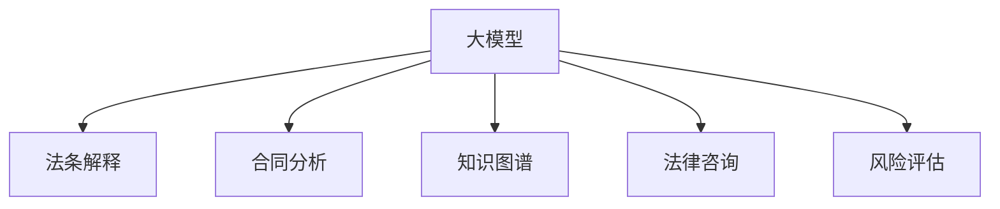

                 

# 大模型在法律服务领域的应用前景

> 关键词：大模型, 法律服务, 自然语言处理, 法条解释, 合同分析, 知识图谱, 法律咨询, 风险评估

## 1. 背景介绍

### 1.1 问题由来
随着人工智能技术的飞速发展，自然语言处理(Natural Language Processing, NLP)在各行各业的应用日益广泛。尤其是在法律服务领域，面对海量法律文书、案件卷宗和法律法规的查询与解读，传统的法律服务模式面临巨大挑战。

传统法律服务依赖于律师的专业知识和经验，成本高昂且效率低下。例如，律师在处理案件时需要翻阅大量法规、案例和判例，查找相关法条和文献，分析法律关系和依据，撰写法律文书，并进行风险评估。这些工作耗时费力，且容易出现错误。而大模型通过在大规模法律语料上进行预训练，具备了自动处理文本、提取关键信息、辅助法律分析和智能推理的能力，可以显著提升法律服务的效率和准确性。

### 1.2 问题核心关键点
大模型在法律服务领域的应用主要集中在以下几个方面：

- 法条解释：自动解释法律条文，提供准确的法律定义和适用范围。
- 合同分析：自动识别合同条款、提取关键信息，分析合同风险。
- 知识图谱构建：构建法律领域的知识图谱，辅助法律专家进行查询和推理。
- 法律咨询：根据用户输入的法律问题，提供智能化的法律咨询服务。
- 风险评估：分析案件风险，预测案件结果，辅助律师进行决策。

这些应用不仅能提升法律服务的效率，还能降低成本，减少人为错误，有助于普及法律知识，提高司法公正性和透明度。

## 2. 核心概念与联系

### 2.1 核心概念概述

为更好地理解大模型在法律服务领域的应用，本节将介绍几个密切相关的核心概念：

- 大模型(Large Model)：指基于深度学习技术，在大规模数据上进行预训练，具备强大语言处理能力的模型，如BERT、GPT等。
- 法条解释：自动理解法律条文，解释法律术语和概念，提供明确的法律解释。
- 合同分析：利用自然语言处理技术，自动识别合同内容、提取关键条款，分析合同风险，预测合同履行情况。
- 知识图谱：构建法律领域的知识图谱，将法律文本、案例、判例等转化为结构化知识，辅助法律专家进行高效查询和推理。
- 法律咨询：通过对话系统，根据用户输入的法律问题，自动提供智能化的法律咨询服务，解决用户法律难题。
- 风险评估：结合法律数据分析和机器学习技术，预测案件结果，评估案件风险，辅助律师进行决策。

这些核心概念之间的逻辑关系可以通过以下Mermaid流程图来展示：



这个流程图展示了大模型在法律服务领域的核心应用：

1. 大模型通过预训练获取基础能力。
2. 法条解释、合同分析、知识图谱、法律咨询、风险评估等应用，利用大模型的通用语言处理能力，提供更高效、准确的法律服务。

## 3. 核心算法原理 & 具体操作步骤
### 3.1 算法原理概述

大模型在法律服务领域的应用主要基于监督学习、序列到序列(Sequence-to-Sequence, Seq2Seq)、分类、生成等算法。其核心思想是：将大模型视作一个强大的语言理解和生成工具，通过对其输入的法律文本进行特定任务的处理，获得准确的法律解释、合同分析结果、知识图谱、法律咨询、风险评估等输出。

以法条解释为例，假设输入的法律文本为 $T$，大模型通过预训练获得的基础知识表示为 $\mathbf{Z}$，则法条解释的输出为 $\mathbf{Y}$，可通过以下过程实现：

1. 对输入文本 $T$ 进行分词和词向量表示，转化为模型可处理的输入形式。
2. 将输入文本 $T$ 送入大模型进行编码，得到语义表示 $\mathbf{Z}$。
3. 利用预训练得到的知识库或标签 $L$，对语义表示 $\mathbf{Z}$ 进行分类或解码，得到法条解释 $\mathbf{Y}$。

这一过程可以通过监督学习算法，如Attention机制、Transformer等模型来实现。监督学习算法通过大量标注数据进行训练，使得模型能够准确理解和处理输入文本，并输出期望的输出结果。

### 3.2 算法步骤详解

大模型在法律服务领域的典型应用步骤如下：

**Step 1: 准备预训练模型和数据集**
- 选择合适的预训练语言模型，如BERT、GPT等。
- 准备法律领域相关的训练数据集，包括法条、合同、案例、判例等。

**Step 2: 添加任务适配层**
- 根据具体任务，设计任务适配层，如分类层、解码器等。
- 利用已有的标签或知识库，对模型输出进行分类或解码。

**Step 3: 设置微调超参数**
- 选择合适的优化算法及其参数，如AdamW、SGD等。
- 设置正则化技术及强度，如L2正则、Dropout等。
- 确定冻结预训练参数的策略，如仅微调顶层，或全部参数都参与微调。

**Step 4: 执行梯度训练**
- 将训练集数据分批次输入模型，前向传播计算损失函数。
- 反向传播计算参数梯度，根据设定的优化算法和学习率更新模型参数。
- 周期性在验证集上评估模型性能，根据性能指标决定是否触发Early Stopping。
- 重复上述步骤直到满足预设的迭代轮数或Early Stopping条件。

**Step 5: 测试和部署**
- 在测试集上评估微调后模型的效果，对比微调前后的性能提升。
- 使用微调后的模型对新样本进行推理预测，集成到实际的应用系统中。
- 持续收集新的数据，定期重新微调模型，以适应数据分布的变化。

以上是基于监督学习的大模型在法律服务领域的应用一般流程。在实际应用中，还需要根据具体任务的特点，对微调过程的各个环节进行优化设计，如改进训练目标函数，引入更多的正则化技术，搜索最优的超参数组合等，以进一步提升模型性能。

### 3.3 算法优缺点

大模型在法律服务领域的应用具有以下优点：

- 处理速度快：大模型可以高效处理大量法律文本，减少律师的阅读和理解时间。
- 结果准确性高：利用深度学习模型进行自动分析，能够减少人为错误，提高法律咨询和决策的准确性。
- 扩展性强：大模型可以轻松处理多种法律任务，只需微调特定的任务适配层即可。
- 节省成本：减少了人工检索和分析工作，降低法律服务的成本。

同时，也存在一些局限性：

- 依赖数据：微调效果依赖于数据的质量和量，获取高质量的法律数据成本较高。
- 泛化能力有限：当法律领域与预训练数据差异较大时，微调的泛化能力可能受限。
- 可解释性不足：大模型通常是"黑盒"系统，难以解释其内部工作机制和决策逻辑。
- 安全风险：涉及隐私数据，法律信息的泄露可能带来法律风险。

尽管存在这些局限性，但大模型在法律服务领域仍具有巨大的应用前景，其处理效率和准确性优势显著。

### 3.4 算法应用领域

大模型在法律服务领域的应用覆盖了多个方面：

- 法条解释：自动解释法律条文，提供准确的法律定义和适用范围。
- 合同分析：自动识别合同内容、提取关键条款，分析合同风险，预测合同履行情况。
- 知识图谱构建：构建法律领域的知识图谱，将法律文本、案例、判例等转化为结构化知识，辅助法律专家进行高效查询和推理。
- 法律咨询：通过对话系统，根据用户输入的法律问题，自动提供智能化的法律咨询服务。
- 风险评估：结合法律数据分析和机器学习技术，预测案件结果，评估案件风险，辅助律师进行决策。

## 4. 数学模型和公式 & 详细讲解  
### 4.1 数学模型构建

本节将使用数学语言对大模型在法律服务领域的应用过程进行更加严格的刻画。

假设输入文本为 $T$，大模型的预训练语义表示为 $\mathbf{Z}$，法条解释的输出为 $\mathbf{Y}$。则法条解释的数学模型为：

$$
\mathbf{Y} = f(\mathbf{Z}, L)
$$

其中 $f$ 为法条解释的映射函数，$L$ 为法条解释的标签集合。

假设模型输入文本 $T$ 经过分词和词向量表示，得到输入序列 $\mathbf{X}$，大模型对 $\mathbf{X}$ 进行编码得到语义表示 $\mathbf{Z}$。则法条解释的目标函数为：

$$
\mathcal{L}(\theta) = -\frac{1}{N}\sum_{i=1}^N \log P(Y_i|\mathbf{Z}_i)
$$

其中 $P$ 为法条解释的概率分布，$\theta$ 为大模型的参数。目标函数旨在最大化模型输出 $\mathbf{Y}$ 与真实标签 $Y_i$ 的概率匹配程度。

### 4.2 公式推导过程

以下我们以法条解释为例，推导数学模型的详细推导过程。

假设模型对输入文本 $T$ 进行编码后，得到语义表示 $\mathbf{Z}$，法条解释的标签为 $Y$，则法条解释的数学模型可以表示为：

$$
P(Y|\mathbf{Z}) = \frac{e^{\mathbf{Z} \cdot \mathbf{W}_y + b_y}}{\sum_{y'=1}^M e^{\mathbf{Z} \cdot \mathbf{W}_{y'} + b_{y'}}}
$$

其中 $\mathbf{W}_y$ 和 $b_y$ 为法条解释的线性变换参数，$M$ 为法条解释的类别数。

将目标函数带入优化算法进行训练，得到模型参数 $\theta$：

$$
\theta = \mathop{\arg\min}_{\theta} \mathcal{L}(\theta) = \mathop{\arg\min}_{\theta} -\frac{1}{N}\sum_{i=1}^N \log P(Y_i|\mathbf{Z}_i)
$$

利用梯度下降等优化算法，最小化损失函数 $\mathcal{L}(\theta)$，得到最优参数 $\theta^*$。

### 4.3 案例分析与讲解

以法条解释为例，以下是实际案例的详细分析：

假设某法律问题为："以下合同是否有效？"，对应的输入文本为：

```
本合同为无效合同，原因如下：1. 合同内容违反了相关法律法规；2. 合同双方未达成合意；3. 合同签订日期早于生效日期。
```

输入文本首先经过分词和词向量表示，得到序列 $\mathbf{X}$，然后送入大模型进行编码，得到语义表示 $\mathbf{Z}$。

根据预训练得到的知识库或标签 $L$，对语义表示 $\mathbf{Z}$ 进行分类，得到法条解释 $\mathbf{Y}$。

例如，如果知识库或标签 $L$ 中包含"合同无效"的标签，则模型输出为：

$$
\mathbf{Y} = \begin{cases}
1, & \text{合同无效} \\
0, & \text{合同有效}
\end{cases}
$$

最终，法条解释 $\mathbf{Y}$ 作为法律咨询的输出，帮助用户了解合同的有效性。

## 5. 项目实践：代码实例和详细解释说明
### 5.1 开发环境搭建

在进行法律服务领域的大模型应用开发前，我们需要准备好开发环境。以下是使用Python进行PyTorch开发的环境配置流程：

1. 安装Anaconda：从官网下载并安装Anaconda，用于创建独立的Python环境。

2. 创建并激活虚拟环境：
```bash
conda create -n law-env python=3.8 
conda activate law-env
```

3. 安装PyTorch：根据CUDA版本，从官网获取对应的安装命令。例如：
```bash
conda install pytorch torchvision torchaudio cudatoolkit=11.1 -c pytorch -c conda-forge
```

4. 安装Transformers库：
```bash
pip install transformers
```

5. 安装各类工具包：
```bash
pip install numpy pandas scikit-learn matplotlib tqdm jupyter notebook ipython
```

完成上述步骤后，即可在`law-env`环境中开始法律服务领域的大模型应用开发。

### 5.2 源代码详细实现

这里我们以法条解释为例，给出使用Transformers库对BERT模型进行法律问题解答的PyTorch代码实现。

首先，定义法条解释的任务适配层：

```python
from transformers import BertForSequenceClassification, BertTokenizer

model = BertForSequenceClassification.from_pretrained('bert-base-cased', num_labels=2)
tokenizer = BertTokenizer.from_pretrained('bert-base-cased')
```

然后，定义训练和评估函数：

```python
from torch.utils.data import Dataset, DataLoader
import torch
import numpy as np

class LawQuestionDataset(Dataset):
    def __init__(self, texts, labels):
        self.texts = texts
        self.labels = labels
        self.tokenizer = tokenizer
        
    def __len__(self):
        return len(self.texts)
    
    def __getitem__(self, idx):
        text = self.texts[idx]
        label = self.labels[idx]
        
        encoding = self.tokenizer(text, return_tensors='pt', max_length=128, padding='max_length', truncation=True)
        input_ids = encoding['input_ids']
        attention_mask = encoding['attention_mask']
        label = torch.tensor([label], dtype=torch.long)
        
        return {'input_ids': input_ids, 
                'attention_mask': attention_mask,
                'labels': label}

# 训练数据集和标签
train_dataset = LawQuestionDataset(train_texts, train_labels)
dev_dataset = LawQuestionDataset(dev_texts, dev_labels)
test_dataset = LawQuestionDataset(test_texts, test_labels)

# 设置超参数
device = torch.device('cuda') if torch.cuda.is_available() else torch.device('cpu')
model.to(device)
optimizer = AdamW(model.parameters(), lr=2e-5)
epoch = 5
batch_size = 16

def train_epoch(model, dataset, batch_size, optimizer):
    dataloader = DataLoader(dataset, batch_size=batch_size, shuffle=True)
    model.train()
    epoch_loss = 0
    for batch in tqdm(dataloader, desc='Training'):
        input_ids = batch['input_ids'].to(device)
        attention_mask = batch['attention_mask'].to(device)
        labels = batch['labels'].to(device)
        model.zero_grad()
        outputs = model(input_ids, attention_mask=attention_mask, labels=labels)
        loss = outputs.loss
        epoch_loss += loss.item()
        loss.backward()
        optimizer.step()
    return epoch_loss / len(dataloader)

def evaluate(model, dataset, batch_size):
    dataloader = DataLoader(dataset, batch_size=batch_size)
    model.eval()
    preds, labels = [], []
    with torch.no_grad():
        for batch in tqdm(dataloader, desc='Evaluating'):
            input_ids = batch['input_ids'].to(device)
            attention_mask = batch['attention_mask'].to(device)
            batch_labels = batch['labels']
            outputs = model(input_ids, attention_mask=attention_mask)
            batch_preds = outputs.logits.argmax(dim=1).to('cpu').tolist()
            batch_labels = batch_labels.to('cpu').tolist()
            for pred, label in zip(batch_preds, batch_labels):
                preds.append(pred)
                labels.append(label)
                
    print(classification_report(labels, preds))
```

最后，启动训练流程并在测试集上评估：

```python
for i in range(epoch):
    loss = train_epoch(model, train_dataset, batch_size, optimizer)
    print(f'Epoch {i+1}, train loss: {loss:.3f}')
    
    print(f'Epoch {i+1}, dev results:')
    evaluate(model, dev_dataset, batch_size)
    
print('Test results:')
evaluate(model, test_dataset, batch_size)
```

以上就是使用PyTorch对BERT模型进行法律问题解答的完整代码实现。可以看到，利用Transformers库，我们可以高效地实现法律服务领域的大模型应用。

### 5.3 代码解读与分析

让我们再详细解读一下关键代码的实现细节：

**LawQuestionDataset类**：
- `__init__`方法：初始化文本、标签等关键组件，并定义分词器。
- `__len__`方法：返回数据集的样本数量。
- `__getitem__`方法：对单个样本进行处理，将文本输入编码为token ids，并将标签转换为Tensor格式。

**模型加载与训练函数**：
- 利用预训练的BERT模型，加载law-env环境下的模型参数。
- 在数据集上定义训练和评估函数，使用AdamW优化器进行训练，并在验证集上定期评估模型性能。

**训练流程**：
- 定义总的epoch数和batch size，开始循环迭代。
- 每个epoch内，先在训练集上训练，输出平均loss。
- 在验证集上评估，输出分类指标。
- 所有epoch结束后，在测试集上评估，给出最终测试结果。

可以看到，PyTorch配合Transformers库使得法律服务领域的大模型应用开发变得简洁高效。开发者可以将更多精力放在数据处理、模型改进等高层逻辑上，而不必过多关注底层的实现细节。

当然，工业级的系统实现还需考虑更多因素，如模型的保存和部署、超参数的自动搜索、更灵活的任务适配层等。但核心的应用范式基本与此类似。

## 6. 实际应用场景
### 6.1 智能法律咨询系统

智能法律咨询系统可以通过大模型在法律领域的知识表示和推理能力，提供全天候、高效的法律咨询服务。用户可以输入具体的法律问题，系统通过大模型进行分析，生成相应的法律建议和解答。

在技术实现上，可以构建一个法律问答系统，将用户输入的文本作为输入，通过大模型进行处理，输出法律解答。系统需要处理海量法律文本数据，可以通过微调大模型，提高模型对法律问题的理解和处理能力。

### 6.2 法律文书自动生成

法律文书生成是大模型在法律服务领域的另一重要应用。律师在处理法律案件时，需要撰写大量的法律文书，包括起诉状、答辩状、代理词等。传统的文书撰写依赖律师的经验和知识，耗时耗力且容易出错。利用大模型，可以自动生成法律文书，提高文书撰写效率和准确性。

系统可以通过对法律文本进行分词和词向量表示，利用大模型进行文本生成，输出符合法律规范和格式的法律文书。大模型可以基于先前的法律文书生成经验，生成新的类似文书，提高文书撰写速度和质量。

### 6.3 合同自动审核

合同自动审核是大模型在法律服务领域的重要应用之一。合同审核是法律工作中的一项繁琐且易出错的任务，传统的审核方法依赖人工审阅和检查，耗时耗力且容易遗漏。

利用大模型，可以自动审核合同内容，识别合同中的关键条款和风险点。系统可以将合同文本输入大模型，输出合同审核结果，标记合同中的关键条款、风险点和注意事项。

### 6.4 风险评估与预测

风险评估是大模型在法律服务领域的重要应用之一。大模型可以利用法律数据分析和机器学习技术，预测案件结果，评估案件风险。

系统可以通过对已有的法律数据进行训练，利用大模型对新案件进行预测。大模型可以基于先前的案例和判例，预测案件的胜诉率、执行难度、诉讼成本等关键指标，辅助律师进行案件决策。

## 7. 工具和资源推荐
### 7.1 学习资源推荐

为了帮助开发者系统掌握大模型在法律服务领域的应用理论基础和实践技巧，这里推荐一些优质的学习资源：

1. 《Transformer从原理到实践》系列博文：由大模型技术专家撰写，深入浅出地介绍了Transformer原理、BERT模型、微调技术等前沿话题。

2. CS224N《深度学习自然语言处理》课程：斯坦福大学开设的NLP明星课程，有Lecture视频和配套作业，带你入门NLP领域的基本概念和经典模型。

3. 《Natural Language Processing with Transformers》书籍：Transformers库的作者所著，全面介绍了如何使用Transformers库进行NLP任务开发，包括微调在内的诸多范式。

4. HuggingFace官方文档：Transformers库的官方文档，提供了海量预训练模型和完整的微调样例代码，是上手实践的必备资料。

5. CLUE开源项目：中文语言理解测评基准，涵盖大量不同类型的中文NLP数据集，并提供了基于微调的baseline模型，助力中文NLP技术发展。

通过对这些资源的学习实践，相信你一定能够快速掌握大模型在法律服务领域的应用精髓，并用于解决实际的法律问题。

### 7.2 开发工具推荐

高效的开发离不开优秀的工具支持。以下是几款用于大模型在法律服务领域开发的应用工具：

1. PyTorch：基于Python的开源深度学习框架，灵活动态的计算图，适合快速迭代研究。大部分预训练语言模型都有PyTorch版本的实现。

2. TensorFlow：由Google主导开发的开源深度学习框架，生产部署方便，适合大规模工程应用。同样有丰富的预训练语言模型资源。

3. Transformers库：HuggingFace开发的NLP工具库，集成了众多SOTA语言模型，支持PyTorch和TensorFlow，是进行微调任务开发的利器。

4. Weights & Biases：模型训练的实验跟踪工具，可以记录和可视化模型训练过程中的各项指标，方便对比和调优。与主流深度学习框架无缝集成。

5. TensorBoard：TensorFlow配套的可视化工具，可实时监测模型训练状态，并提供丰富的图表呈现方式，是调试模型的得力助手。

6. Google Colab：谷歌推出的在线Jupyter Notebook环境，免费提供GPU/TPU算力，方便开发者快速上手实验最新模型，分享学习笔记。

合理利用这些工具，可以显著提升大模型在法律服务领域的开发效率，加快创新迭代的步伐。

### 7.3 相关论文推荐

大模型在法律服务领域的发展源于学界的持续研究。以下是几篇奠基性的相关论文，推荐阅读：

1. Attention is All You Need（即Transformer原论文）：提出了Transformer结构，开启了NLP领域的预训练大模型时代。

2. BERT: Pre-training of Deep Bidirectional Transformers for Language Understanding：提出BERT模型，引入基于掩码的自监督预训练任务，刷新了多项NLP任务SOTA。

3. Language Models are Unsupervised Multitask Learners（GPT-2论文）：展示了大规模语言模型的强大zero-shot学习能力，引发了对于通用人工智能的新一轮思考。

4. Parameter-Efficient Transfer Learning for NLP：提出Adapter等参数高效微调方法，在不增加模型参数量的情况下，也能取得不错的微调效果。

5. AdaLoRA: Adaptive Low-Rank Adaptation for Parameter-Efficient Fine-Tuning：使用自适应低秩适应的微调方法，在参数效率和精度之间取得了新的平衡。

这些论文代表了大模型在法律服务领域的应用发展脉络。通过学习这些前沿成果，可以帮助研究者把握学科前进方向，激发更多的创新灵感。

## 8. 总结：未来发展趋势与挑战

### 8.1 总结

本文对大模型在法律服务领域的应用进行了全面系统的介绍。首先阐述了大模型在法律服务领域的应用背景和意义，明确了法律服务领域对大模型的需求和挑战。其次，从原理到实践，详细讲解了大模型在法律服务领域的核心算法和操作步骤，给出了完整的代码实现。同时，本文还广泛探讨了大模型在法律服务领域的多种应用场景，展示了其巨大的应用前景。最后，本文精选了大模型在法律服务领域的相关学习资源、开发工具和论文，力求为读者提供全方位的技术指引。

通过本文的系统梳理，可以看到，大模型在法律服务领域的应用前景广阔，其处理效率和准确性优势显著。大模型不仅能提升法律服务的效率和质量，还能降低成本，减少人为错误，有助于普及法律知识，提高司法公正性和透明度。

### 8.2 未来发展趋势

展望未来，大模型在法律服务领域的应用将呈现以下几个发展趋势：

1. 模型规模持续增大。随着算力成本的下降和数据规模的扩张，大模型的参数量还将持续增长。超大规模语言模型蕴含的丰富语言知识，有望支撑更加复杂多变的法律任务微调。

2. 微调方法日趋多样。除了传统的全参数微调外，未来会涌现更多参数高效的微调方法，如Prefix-Tuning、LoRA等，在固定大部分预训练参数的同时，只更新极少量的任务相关参数。

3. 持续学习成为常态。随着法律领域的快速变化，大模型需要不断学习新的法律条文、判例和案例，保持性能的及时更新。

4. 标注成本降低。利用自监督学习、主动学习等无监督和半监督范式，最大限度利用非结构化数据，实现更加灵活高效的微调。

5. 知识图谱构建。将法律文本、案例、判例等转化为结构化知识，构建法律领域的知识图谱，提升法律查询和推理的效率。

6. 多模态融合。结合法律领域的图像、视频、语音等多模态数据，进行多模态信息的整合，提升法律服务的综合能力。

以上趋势凸显了大模型在法律服务领域的应用潜力。这些方向的探索发展，必将进一步提升法律服务的效率和准确性，为社会法治建设注入新的动力。

### 8.3 面临的挑战

尽管大模型在法律服务领域的应用前景广阔，但在迈向更加智能化、普适化应用的过程中，它仍面临着诸多挑战：

1. 数据依赖性强。大模型的微调效果依赖于高质量的法律数据，获取高质量的法律数据成本较高。

2. 泛化能力有限。当法律领域与预训练数据差异较大时，大模型的泛化能力可能受限。

3. 知识表示不足。法律文本和案例的复杂性，使得大模型难以直接理解法律语义和逻辑。

4. 法律风险高。涉及隐私数据，法律信息的泄露可能带来法律风险。

尽管存在这些挑战，但大模型在法律服务领域仍具有巨大的应用前景，其处理效率和准确性优势显著。

### 8.4 研究展望

面对大模型在法律服务领域所面临的挑战，未来的研究需要在以下几个方面寻求新的突破：

1. 探索无监督和半监督微调方法。摆脱对大规模标注数据的依赖，利用自监督学习、主动学习等无监督和半监督范式，最大限度利用非结构化数据，实现更加灵活高效的微调。

2. 研究知识表示和图谱构建。将法律文本、案例、判例等转化为结构化知识，构建法律领域的知识图谱，提升法律查询和推理的效率。

3. 结合多模态数据。结合法律领域的图像、视频、语音等多模态数据，进行多模态信息的整合，提升法律服务的综合能力。

4. 引入因果推理。将因果推断方法引入大模型，增强法律推理的稳定性和逻辑性。

5. 加强法律风险控制。在模型训练和推理过程中引入法律风险控制机制，保障法律信息的隐私和安全。

这些研究方向将推动大模型在法律服务领域的应用不断突破，为构建安全、可靠、可解释、可控的智能系统铺平道路。

## 9. 附录：常见问题与解答

**Q1：大模型在法律服务领域的应用是否能够完全取代律师？**

A: 目前来看，大模型在法律服务领域的应用尚不能完全取代律师。虽然大模型具备强大的自动理解和推理能力，但在复杂的法律问题、纠纷调解、法律咨询等方面，仍需要律师的专业知识和经验进行辅助和解释。大模型可以作为一种工具，提升律师的工作效率和准确性，但无法替代律师的角色。

**Q2：如何确保大模型在法律服务领域的安全性和合规性？**

A: 确保大模型在法律服务领域的安全性和合规性，需要从多个方面进行保障：

1. 数据隐私保护：在训练和推理过程中，对法律数据进行加密和脱敏处理，防止数据泄露。

2. 法律合规审查：在模型开发过程中，引入法律合规审查机制，确保模型的输出符合法律规范和伦理标准。

3. 安全防护措施：对大模型进行安全防护，防止恶意攻击和数据篡改。

4. 法律责任明确：在使用大模型进行法律服务时，明确模型的法律责任和风险，保障用户的合法权益。

**Q3：大模型在法律服务领域的应用是否会带来职业风险？**

A: 大模型在法律服务领域的应用可能会带来一定的职业风险，主要体现在以下几个方面：

1. 替代效应：大模型的应用可能导致部分法律工作被自动化，对相关法律从业人员的就业产生影响。

2. 伦理问题：大模型在处理法律问题时，可能存在偏见和歧视，带来伦理风险。

3. 法律责任：在使用大模型进行法律服务时，需要明确模型的法律责任，防止模型错误导致的法律纠纷。

## 结论

大模型在法律服务领域的应用前景广阔，具备显著的处理效率和准确性优势。通过大模型的自动理解、自动推理和自动生成能力，能够显著提升法律服务的效率和质量，降低成本，减少人为错误，有助于普及法律知识，提高司法公正性和透明度。未来，随着大模型的不断发展和优化，其在法律服务领域的应用将更加广泛和深入，为社会法治建设注入新的动力。

作者：禅与计算机程序设计艺术 / Zen and the Art of Computer Programming

