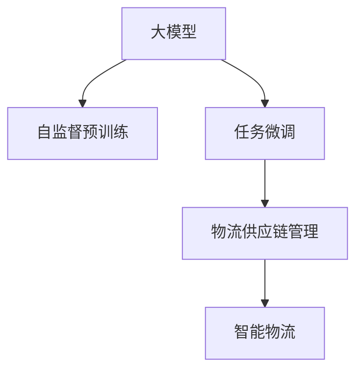

                 

## 1. 背景介绍

在数字化时代，物流供应链系统已成为企业核心竞争力的一个重要组成部分，尤其是在电商、制造、物流等行业。传统的物流供应链系统往往存在信息孤岛、流程复杂、效率低下等问题，给企业运营带来了极大的挑战。而基于大模型技术的智能物流供应链系统，能够通过分析海量数据，实时预测市场趋势，优化物流路径，提升供应链效率，带来颠覆性的变革。

### 1.1 问题由来
现代物流供应链系统主要面临以下几大挑战：

1. **信息孤岛问题**：不同业务环节、不同系统之间数据不互通，信息难以实时共享，导致决策效率低下。
2. **流程复杂问题**：物流环节繁多，流程繁琐，缺乏自动化和智能化，操作耗时长，误差率高。
3. **需求预测不准确**：受市场波动、季节变化等多种因素影响，传统的需求预测方法往往滞后于实际需求，导致库存过高或不足。
4. **资源分配不均衡**：供应链资源（如仓储、运输、配送）分配不均，无法实现最优配置。
5. **风险管理能力弱**：供应链风险预警和应急响应能力不足，无法有效应对突发事件。

### 1.2 问题核心关键点
大模型技术为解决以上问题提供了新的思路和方法。通过大模型的预测能力、决策能力和推理能力，可以实现实时化、智能化的物流供应链管理。大模型可以通过自监督预训练和任务微调，学习到大量的物流和供应链知识，从而提供强大的决策支持。

## 2. 核心概念与联系

### 2.1 核心概念概述

为更好地理解大模型在物流供应链领域的应用，本节将介绍几个关键概念：

- **大模型(Large Model)**：指具有海量参数和广泛知识的大型神经网络模型，如GPT-3、BERT、T5等。通过在大规模无标签数据上进行预训练，大模型具备强大的数据处理和推理能力。
- **自监督预训练(Automatic Pre-training)**：指在大规模无标签数据上进行预训练，通过自监督任务（如掩码语言建模、句子分类等）学习到通用的数据表示。
- **任务微调(Fine-tuning)**：指在大规模预训练模型的基础上，使用带有标签的任务数据进行微调，使其适应特定任务的特定需求。
- **供应链管理(Supply Chain Management, SCM)**：指对供应链中产品从采购、生产、库存、运输到配送的全过程进行规划、控制和优化，以实现成本最低、效率最高。
- **智能物流(Intelligent Logistics)**：指利用信息技术和智能算法，优化物流供应链的各个环节，提高运输效率、降低成本，提升客户满意度。

这些核心概念之间的逻辑关系可以通过以下Mermaid流程图来展示：



这个流程图展示了从大模型到智能物流的全过程：

1. 大模型通过大规模无标签数据进行自监督预训练，学习到通用的数据表示。
2. 基于预训练模型，使用物流供应链任务数据进行任务微调，使其具备特定领域的知识。
3. 微调后的模型应用于供应链管理的各个环节，实现智能物流的优化。

## 3. 核心算法原理 & 具体操作步骤
### 3.1 算法原理概述

基于大模型的供应链管理，本质上是通过预训练和微调两个步骤，将通用数据表示与特定任务的知识进行融合，从而实现高效的供应链决策。

形式化地，假设物流供应链数据为 $D=\{(x_i,y_i)\}_{i=1}^N$，其中 $x_i$ 表示供应链的一个决策节点，$y_i$ 表示节点的决策结果。模型 $M_{\theta}$ 在 $x_i$ 上的预测结果为 $\hat{y}_i$，通过定义损失函数 $\ell(M_{\theta}(x_i),y_i)$ 来衡量模型预测结果与真实结果之间的差距。

微调的目标是：

$$
\theta^* = \mathop{\arg\min}_{\theta} \mathcal{L}(M_{\theta},D)
$$

其中 $\mathcal{L}$ 为针对特定供应链任务设计的损失函数。常见的损失函数包括交叉熵损失、均方误差损失等。

### 3.2 算法步骤详解

基于大模型的供应链管理微调过程包括以下几个关键步骤：

**Step 1: 准备预训练模型和数据集**

- 选择合适的预训练语言模型 $M_{\theta}$，如BERT、GPT等，作为初始化参数。
- 准备供应链任务的数据集 $D$，划分为训练集、验证集和测试集。数据集应涵盖供应链的各个环节，如需求预测、库存管理、配送路径优化等。

**Step 2: 添加任务适配层**

- 根据具体供应链任务，设计合适的任务适配层，如预测层、优化层等。
- 对于预测任务，通常在顶层添加线性分类器或回归器。
- 对于优化任务，需要设计优化器，如线性规划、梯度下降等。

**Step 3: 设置微调超参数**

- 选择合适的优化算法及其参数，如Adam、SGD等，设置学习率、批大小、迭代轮数等。
- 设置正则化技术及强度，包括L2正则、Dropout、Early Stopping等。
- 确定冻结预训练参数的策略，如仅微调顶层，或全部参数都参与微调。

**Step 4: 执行梯度训练**

- 将训练集数据分批次输入模型，前向传播计算损失函数。
- 反向传播计算参数梯度，根据设定的优化算法和学习率更新模型参数。
- 周期性在验证集上评估模型性能，根据性能指标决定是否触发 Early Stopping。
- 重复上述步骤直到满足预设的迭代轮数或 Early Stopping 条件。

**Step 5: 测试和部署**

- 在测试集上评估微调后模型 $M_{\hat{\theta}}$ 的性能，对比微调前后的精度提升。
- 使用微调后的模型对供应链各个环节进行优化，集成到实际的应用系统中。
- 持续收集新的数据，定期重新微调模型，以适应供应链动态变化的需求。

以上是基于大模型的供应链管理微调的一般流程。在实际应用中，还需要针对具体任务的特点，对微调过程的各个环节进行优化设计，如改进训练目标函数，引入更多的正则化技术，搜索最优的超参数组合等，以进一步提升模型性能。

### 3.3 算法优缺点

基于大模型的供应链管理微调方法具有以下优点：

1. **决策高效**：通过学习到大量供应链知识，大模型能够快速决策和优化供应链各个环节。
2. **适应性强**：能够处理多种类型的供应链任务，具有较强的泛化能力。
3. **参数高效**：通过参数高效微调技术，在固定大部分预训练参数的情况下，仍可取得不错的微调效果。
4. **实时性高**：微调过程可以在实时数据上进行，提升供应链决策的时效性。

同时，该方法也存在一定的局限性：

1. **依赖高质量数据**：微调效果很大程度上取决于供应链任务的高质量标注数据，获取高质量数据成本较高。
2. **解释性不足**：微调模型的决策过程缺乏可解释性，难以对其推理逻辑进行分析和调试。
3. **过拟合风险**：在数据量不足的情况下，微调模型可能出现过拟合现象。

尽管存在这些局限性，但就目前而言，基于大模型的供应链管理微调方法仍是目前实现供应链智能化管理的主流范式。未来相关研究的重点在于如何进一步降低微调对高质量数据的依赖，提高模型的少样本学习和跨领域迁移能力，同时兼顾可解释性和伦理安全性等因素。

### 3.4 算法应用领域

基于大模型的供应链管理微调方法，在物流供应链领域已经得到了广泛的应用，涵盖了供应链的各个环节，例如：

- **需求预测**：预测客户订单需求，优化库存水平，减少缺货或过剩。
- **库存管理**：实时监控库存水平，预测补货需求，优化补货策略。
- **配送路径优化**：确定最优的配送路径，减少运输成本和时间。
- **风险管理**：实时监测供应链风险，预警异常情况，制定应急预案。
- **成本控制**：优化供应链各个环节的成本，提升整体效益。
- **客户满意度提升**：通过实时监控客户反馈，改进服务质量。

除了上述这些经典应用外，大模型还被创新性地应用到更多场景中，如供应链数字化转型、供应链自动化、供应链弹性化等，为物流供应链系统带来了全新的突破。随着大模型和微调方法的不断进步，相信供应链管理系统必将在更广阔的应用领域大放异彩。

## 4. 数学模型和公式 & 详细讲解  
### 4.1 数学模型构建

本节将使用数学语言对基于大模型的供应链管理微调过程进行更加严格的刻画。

记供应链数据为 $D=\{(x_i,y_i)\}_{i=1}^N$，其中 $x_i$ 表示供应链的一个决策节点，$y_i$ 表示节点的决策结果。假设模型 $M_{\theta}$ 在 $x_i$ 上的预测结果为 $\hat{y}_i$，则定义模型在数据集 $D$ 上的经验风险为：

$$
\mathcal{L}(\theta) = \frac{1}{N} \sum_{i=1}^N \ell(M_{\theta}(x_i),y_i)
$$

其中 $\ell$ 为损失函数，如交叉熵损失、均方误差损失等。微调的目标是最小化经验风险，即找到最优参数：

$$
\theta^* = \mathop{\arg\min}_{\theta} \mathcal{L}(\theta)
$$

在实践中，我们通常使用基于梯度的优化算法（如SGD、Adam等）来近似求解上述最优化问题。设 $\eta$ 为学习率，$\lambda$ 为正则化系数，则参数的更新公式为：

$$
\theta \leftarrow \theta - \eta \nabla_{\theta}\mathcal{L}(\theta) - \eta\lambda\theta
$$

其中 $\nabla_{\theta}\mathcal{L}(\theta)$ 为损失函数对参数 $\theta$ 的梯度，可通过反向传播算法高效计算。

### 4.2 公式推导过程

以下我们以需求预测任务为例，推导基于大模型的需求预测数学模型。

假设模型 $M_{\theta}$ 在输入 $x$ 上的预测结果为 $\hat{y}=M_{\theta}(x) \in [0,1]$，表示预测需求与实际需求之间的相似度。真实需求 $y \in [0,1]$。则定义交叉熵损失函数为：

$$
\ell(M_{\theta}(x),y) = -y\log \hat{y} - (1-y)\log (1-\hat{y})
$$

将其代入经验风险公式，得：

$$
\mathcal{L}(\theta) = -\frac{1}{N}\sum_{i=1}^N [y_i\log M_{\theta}(x_i)+(1-y_i)\log(1-M_{\theta}(x_i))]
$$

根据链式法则，损失函数对参数 $\theta_k$ 的梯度为：

$$
\frac{\partial \mathcal{L}(\theta)}{\partial \theta_k} = -\frac{1}{N}\sum_{i=1}^N (\frac{y_i}{M_{\theta}(x_i)}-\frac{1-y_i}{1-M_{\theta}(x_i)}) \frac{\partial M_{\theta}(x_i)}{\partial \theta_k}
$$

其中 $\frac{\partial M_{\theta}(x_i)}{\partial \theta_k}$ 可进一步递归展开，利用自动微分技术完成计算。

在得到损失函数的梯度后，即可带入参数更新公式，完成模型的迭代优化。重复上述过程直至收敛，最终得到适应供应链需求预测的最优模型参数 $\theta^*$。

## 5. 项目实践：代码实例和详细解释说明
### 5.1 开发环境搭建

在进行供应链管理微调实践前，我们需要准备好开发环境。以下是使用Python进行PyTorch开发的环境配置流程：

1. 安装Anaconda：从官网下载并安装Anaconda，用于创建独立的Python环境。

2. 创建并激活虚拟环境：
```bash
conda create -n pytorch-env python=3.8 
conda activate pytorch-env
```

3. 安装PyTorch：根据CUDA版本，从官网获取对应的安装命令。例如：
```bash
conda install pytorch torchvision torchaudio cudatoolkit=11.1 -c pytorch -c conda-forge
```

4. 安装Transformers库：
```bash
pip install transformers
```

5. 安装各类工具包：
```bash
pip install numpy pandas scikit-learn matplotlib tqdm jupyter notebook ipython
```

完成上述步骤后，即可在`pytorch-env`环境中开始微调实践。

### 5.2 源代码详细实现

下面我们以需求预测任务为例，给出使用Transformers库对BERT模型进行供应链管理微调的PyTorch代码实现。

首先，定义需求预测任务的数据处理函数：

```python
from transformers import BertTokenizer
from torch.utils.data import Dataset
import torch

class DemandPredictionDataset(Dataset):
    def __init__(self, texts, labels, tokenizer, max_len=128):
        self.texts = texts
        self.labels = labels
        self.tokenizer = tokenizer
        self.max_len = max_len
        
    def __len__(self):
        return len(self.texts)
    
    def __getitem__(self, item):
        text = self.texts[item]
        label = self.labels[item]
        
        encoding = self.tokenizer(text, return_tensors='pt', max_length=self.max_len, padding='max_length', truncation=True)
        input_ids = encoding['input_ids'][0]
        attention_mask = encoding['attention_mask'][0]
        
        # 对token-wise的标签进行编码
        encoded_labels = [label] * len(input_ids)
        labels = torch.tensor(encoded_labels, dtype=torch.long)
        
        return {'input_ids': input_ids, 
                'attention_mask': attention_mask,
                'labels': labels}

# 创建dataset
tokenizer = BertTokenizer.from_pretrained('bert-base-cased')

train_dataset = DemandPredictionDataset(train_texts, train_labels, tokenizer)
dev_dataset = DemandPredictionDataset(dev_texts, dev_labels, tokenizer)
test_dataset = DemandPredictionDataset(test_texts, test_labels, tokenizer)
```

然后，定义模型和优化器：

```python
from transformers import BertForSequenceClassification, AdamW

model = BertForSequenceClassification.from_pretrained('bert-base-cased', num_labels=2)

optimizer = AdamW(model.parameters(), lr=2e-5)
```

接着，定义训练和评估函数：

```python
from torch.utils.data import DataLoader
from tqdm import tqdm
from sklearn.metrics import accuracy_score

device = torch.device('cuda') if torch.cuda.is_available() else torch.device('cpu')
model.to(device)

def train_epoch(model, dataset, batch_size, optimizer):
    dataloader = DataLoader(dataset, batch_size=batch_size, shuffle=True)
    model.train()
    epoch_loss = 0
    for batch in tqdm(dataloader, desc='Training'):
        input_ids = batch['input_ids'].to(device)
        attention_mask = batch['attention_mask'].to(device)
        labels = batch['labels'].to(device)
        model.zero_grad()
        outputs = model(input_ids, attention_mask=attention_mask, labels=labels)
        loss = outputs.loss
        epoch_loss += loss.item()
        loss.backward()
        optimizer.step()
    return epoch_loss / len(dataloader)

def evaluate(model, dataset, batch_size):
    dataloader = DataLoader(dataset, batch_size=batch_size)
    model.eval()
    preds, labels = [], []
    with torch.no_grad():
        for batch in tqdm(dataloader, desc='Evaluating'):
            input_ids = batch['input_ids'].to(device)
            attention_mask = batch['attention_mask'].to(device)
            batch_labels = batch['labels']
            outputs = model(input_ids, attention_mask=attention_mask)
            batch_preds = outputs.logits.argmax(dim=2).to('cpu').tolist()
            batch_labels = batch_labels.to('cpu').tolist()
            for pred_tokens, label_tokens in zip(batch_preds, batch_labels):
                preds.append(pred_tokens)
                labels.append(label_tokens)
                
    print(f"Accuracy: {accuracy_score(labels, preds)}")
```

最后，启动训练流程并在测试集上评估：

```python
epochs = 5
batch_size = 16

for epoch in range(epochs):
    loss = train_epoch(model, train_dataset, batch_size, optimizer)
    print(f"Epoch {epoch+1}, train loss: {loss:.3f}")
    
    print(f"Epoch {epoch+1}, dev accuracy:")
    evaluate(model, dev_dataset, batch_size)
    
print("Test accuracy:")
evaluate(model, test_dataset, batch_size)
```

以上就是使用PyTorch对BERT进行供应链需求预测任务微调的完整代码实现。可以看到，得益于Transformers库的强大封装，我们可以用相对简洁的代码完成BERT模型的加载和微调。

### 5.3 代码解读与分析

让我们再详细解读一下关键代码的实现细节：

**DemandPredictionDataset类**：
- `__init__`方法：初始化文本、标签、分词器等关键组件。
- `__len__`方法：返回数据集的样本数量。
- `__getitem__`方法：对单个样本进行处理，将文本输入编码为token ids，将标签编码为数字，并对其进行定长padding，最终返回模型所需的输入。

**train_dataset, dev_dataset, test_dataset**：
- 定义训练集、验证集和测试集。
- 数据集中的每个样本包含一个预测节点和其对应的实际需求。
- 使用BertTokenizer将文本转换为token ids，并进行padding。

**model, optimizer**：
- 定义BERT模型和AdamW优化器。
- 模型采用二分类任务，预测需求是否大于阈值。
- 优化器设置学习率为2e-5。

**train_epoch函数**：
- 使用DataLoader对数据集进行批次化加载，供模型训练和推理使用。
- 在每个批次上前向传播计算loss并反向传播更新模型参数，最后返回该epoch的平均loss。
- 循环迭代所有epoch。

**evaluate函数**：
- 在验证集和测试集上进行模型评估，计算预测准确率。
- 对每个batch的预测结果进行列表存储，最后合并输出。

**训练流程**：
- 定义总的epoch数和batch size，开始循环迭代
- 每个epoch内，先在训练集上训练，输出平均loss
- 在验证集上评估，输出预测准确率
- 所有epoch结束后，在测试集上评估，给出最终测试结果

可以看到，PyTorch配合Transformers库使得BERT微调的代码实现变得简洁高效。开发者可以将更多精力放在数据处理、模型改进等高层逻辑上，而不必过多关注底层的实现细节。

当然，工业级的系统实现还需考虑更多因素，如模型的保存和部署、超参数的自动搜索、更灵活的任务适配层等。但核心的微调范式基本与此类似。

## 6. 实际应用场景
### 6.1 智能仓储管理

基于大模型技术的智能仓储管理系统，能够实时预测库存水平，优化补货策略，减少缺货和过剩。传统仓储管理往往依赖人力统计和人工调度，效率低下，且容易出错。而使用微调后的需求预测模型，可以自动化地对仓库进行库存管理，提升仓储效率。

在技术实现上，可以收集仓库历史库存数据，将库存水平与订单需求进行关联，在此基础上对预训练模型进行微调。微调后的模型能够自动预测未来需求，并根据需求量调整库存水平，实现实时动态管理。

### 6.2 运输路径优化

物流运输是供应链管理的核心环节，运输路径优化直接关系到成本和效率。传统路径优化方法往往依赖人工经验，费时费力，且容易忽略动态变化。基于大模型的路径优化技术，可以实时分析交通状况、需求分布等因素，生成最优路径，大幅提升运输效率。

在实践应用中，可以收集实时交通数据、客户订单需求、配送节点位置等数据，训练大模型进行路径规划。微调后的模型能够自动生成最优路径，并在配送过程中实时调整，确保运输效率和客户满意度。

### 6.3 库存风险管理

库存风险管理是供应链管理的难点之一，库存过高会增加存储成本，库存过低会影响客户满意度。基于大模型的库存风险管理技术，可以实时监测库存水平，预测库存需求，制定最优补货策略。

在实现上，可以使用历史销售数据和市场趋势数据，训练大模型进行需求预测。微调后的模型能够实时监测库存水平，预测未来需求，自动调整补货策略，避免库存过高或过低的问题。

### 6.4 客户服务优化

客户服务是供应链管理的另一大挑战，客户满意度直接影响企业品牌和市场口碑。传统客户服务依赖人工处理，响应时间长，效率低。基于大模型的客户服务技术，可以实时监测客户反馈，智能响应客户需求，提升客户服务质量。

在实践中，可以收集客户历史服务记录和实时反馈，训练大模型进行情感分析。微调后的模型能够自动分析客户情感，识别客户需求，智能响应客户，提升客户服务体验。

### 6.5 供应链可视化

供应链可视化是大模型在供应链管理中的重要应用场景，可以帮助企业实时监控供应链各个环节，及时发现问题并采取措施。通过可视化，企业可以更直观地了解供应链的运行情况，提升管理效率。

在实践中，可以使用实时监控数据、历史数据等，训练大模型进行供应链可视化。微调后的模型能够自动生成供应链可视化图表，展示供应链的运行状态，帮助企业及时发现并解决问题。

### 6.6 供应链智能决策

供应链智能决策是大模型在供应链管理中的核心应用。通过实时监测供应链各个环节的数据，大模型能够自动分析数据，提供决策支持，帮助企业制定最优策略。

在实现上，可以使用供应链数据、市场需求数据等，训练大模型进行供应链智能决策。微调后的模型能够自动分析数据，提供决策建议，帮助企业制定最优策略，提升供应链管理效率。

## 7. 工具和资源推荐
### 7.1 学习资源推荐

为了帮助开发者系统掌握大模型在供应链管理中的应用，这里推荐一些优质的学习资源：

1. 《深度学习与供应链管理》书籍：全面介绍了深度学习在供应链管理中的应用，包括需求预测、路径优化、风险管理等。

2. CS229《机器学习》课程：斯坦福大学开设的机器学习明星课程，有Lecture视频和配套作业，涵盖深度学习在供应链管理中的基本概念和算法。

3. 《Natural Language Processing with Transformers》书籍：Transformers库的作者所著，全面介绍了如何使用Transformers库进行供应链管理开发，包括微调在内的诸多范式。

4. Kaggle供应链数据集：收集了大量供应链相关的数据集，包括需求预测、库存管理、路径优化等，提供了基于微调的baseline模型，助力供应链管理技术发展。

5. CLUE开源项目：中文语言理解测评基准，涵盖大量不同类型的中文供应链数据集，并提供了基于微调的baseline模型，助力供应链管理技术发展。

通过对这些资源的学习实践，相信你一定能够快速掌握大模型在供应链管理中的应用，并用于解决实际的供应链问题。

### 7.2 开发工具推荐

高效的开发离不开优秀的工具支持。以下是几款用于大模型供应链管理微调开发的常用工具：

1. PyTorch：基于Python的开源深度学习框架，灵活动态的计算图，适合快速迭代研究。大部分预训练语言模型都有PyTorch版本的实现。

2. TensorFlow：由Google主导开发的开源深度学习框架，生产部署方便，适合大规模工程应用。同样有丰富的预训练语言模型资源。

3. Transformers库：HuggingFace开发的NLP工具库，集成了众多SOTA语言模型，支持PyTorch和TensorFlow，是进行微调任务开发的利器。

4. Weights & Biases：模型训练的实验跟踪工具，可以记录和可视化模型训练过程中的各项指标，方便对比和调优。与主流深度学习框架无缝集成。

5. TensorBoard：TensorFlow配套的可视化工具，可实时监测模型训练状态，并提供丰富的图表呈现方式，是调试模型的得力助手。

6. Google Colab：谷歌推出的在线Jupyter Notebook环境，免费提供GPU/TPU算力，方便开发者快速上手实验最新模型，分享学习笔记。

合理利用这些工具，可以显著提升大模型供应链管理微调任务的开发效率，加快创新迭代的步伐。

### 7.3 相关论文推荐

大模型和供应链管理微调技术的发展源于学界的持续研究。以下是几篇奠基性的相关论文，推荐阅读：

1. Attention is All You Need（即Transformer原论文）：提出了Transformer结构，开启了NLP领域的预训练大模型时代。

2. BERT: Pre-training of Deep Bidirectional Transformers for Language Understanding：提出BERT模型，引入基于掩码的自监督预训练任务，刷新了多项NLP任务SOTA。

3. Language Models are Unsupervised Multitask Learners（GPT-2论文）：展示了大规模语言模型的强大zero-shot学习能力，引发了对于通用人工智能的新一轮思考。

4. Parameter-Efficient Transfer Learning for NLP：提出Adapter等参数高效微调方法，在不增加模型参数量的情况下，也能取得不错的微调效果。

5. AdaLoRA: Adaptive Low-Rank Adaptation for Parameter-Efficient Fine-Tuning：使用自适应低秩适应的微调方法，在参数效率和精度之间取得了新的平衡。

6. Prompt Learning：引入基于连续型Prompt的微调范式，为如何充分利用预训练知识提供了新的思路。

这些论文代表了大模型供应链管理微调技术的发展脉络。通过学习这些前沿成果，可以帮助研究者把握学科前进方向，激发更多的创新灵感。

## 8. 总结：未来发展趋势与挑战
### 8.1 总结

本文对基于大模型的供应链管理微调方法进行了全面系统的介绍。首先阐述了大模型在物流供应链系统中的研究背景和应用前景，明确了微调在优化供应链管理、提升供应链效率方面的独特价值。其次，从原理到实践，详细讲解了基于大模型的供应链管理微调过程，给出了供应链管理微调的完整代码实例。同时，本文还广泛探讨了大模型在供应链管理中的实际应用场景，展示了其强大的应用潜力。最后，本文精选了供应链管理微调技术的各类学习资源，力求为读者提供全方位的技术指引。

通过本文的系统梳理，可以看到，基于大模型的供应链管理微调方法正在成为物流供应链系统智能化的重要范式，极大地提升了供应链管理的效率和灵活性。得益于大模型的强大数据处理和推理能力，供应链管理各个环节的决策过程变得更加智能化和自动化。未来，随着大模型和微调方法的持续演进，相信物流供应链系统必将在更多领域实现颠覆性变革。

### 8.2 未来发展趋势

展望未来，大模型在供应链管理中的应用前景十分广阔，将呈现以下几个发展趋势：

1. **实时化决策**：大模型能够在实时数据上进行微调，提供实时化决策支持，实现动态优化供应链各个环节。

2. **跨领域应用**：大模型能够跨领域学习，适应不同行业和场景的供应链管理需求，提升供应链管理系统的普适性。

3. **参数高效微调**：开发更多参数高效的微调方法，进一步提升微调的效率和效果，降低对标注数据和算力的依赖。

4. **智能监控与预警**：通过实时监测供应链数据，大模型能够自动发现异常情况并预警，提升供应链的风险管理能力。

5. **多模态融合**：大模型能够整合多种数据源（如传感器数据、物联网数据等），提升供应链管理的全面性和精准性。

6. **自适应学习**：大模型能够根据供应链动态变化自适应学习新知识，保持供应链管理的先进性和灵活性。

以上趋势凸显了大模型在供应链管理中的应用前景。这些方向的探索发展，必将进一步提升供应链管理系统的性能和应用范围，为物流行业带来颠覆性变革。

### 8.3 面临的挑战

尽管大模型在供应链管理中的应用已经取得了一定进展，但在迈向更加智能化、普适化应用的过程中，它仍面临诸多挑战：

1. **数据质量与标注成本**：高质量的供应链数据获取成本较高，且标注数据量庞大，影响了微调效果的提升。如何降低标注成本，提高数据质量，是亟待解决的问题。

2. **模型泛化能力**：大模型在不同行业和场景的供应链管理中，泛化能力仍有所欠缺。如何提高模型的泛化能力，使其具备跨领域适用性，需要进一步研究和优化。

3. **资源限制**：大规模供应链数据和实时数据流的处理对算力、存储等资源提出了较高的要求。如何优化资源配置，提升系统效率，仍需进一步探索。

4. **安全与隐私**：供应链数据涉及企业核心商业机密，如何保护数据安全与隐私，防止数据泄露，是供应链管理微调中需要重视的问题。

5. **模型解释性**：大模型在供应链管理中的决策过程缺乏可解释性，难以对其推理逻辑进行分析和调试。如何提高模型的可解释性，增强其可信度，是亟待解决的问题。

6. **伦理与合规**：供应链管理微调模型可能会学习到有偏见、有害的信息，如何确保模型的伦理合规性，避免负面影响，需要进一步研究和规范。

尽管存在这些挑战，但大模型在供应链管理中的应用前景仍然十分广阔。随着大模型和微调方法的持续演进，相信这些挑战终将逐步被克服，大模型在供应链管理中的应用将迈向新的高度。

### 8.4 研究展望

面对大模型在供应链管理中面临的诸多挑战，未来的研究需要在以下几个方面寻求新的突破：

1. **少样本与零样本学习**：探索大模型在供应链管理中的少样本和零样本学习能力，降低对标注数据的依赖，提升模型泛化能力。

2. **多模态融合学习**：将多种数据源（如传感器数据、物联网数据等）融合到大模型中，提升供应链管理的全面性和精准性。

3. **自适应与动态优化**：开发自适应与动态优化算法，使大模型能够根据供应链动态变化进行实时优化，提升系统灵活性和可靠性。

4. **跨领域迁移学习**：探索大模型在不同行业和场景的跨领域迁移学习能力，提升模型的普适性和可扩展性。

5. **伦理与隐私保护**：研究如何在大模型中引入伦理导向的评估指标，过滤和惩罚有害信息，保护数据隐私，提升模型伦理合规性。

6. **可解释性与可视化**：开发可解释性增强技术，增强大模型在供应链管理中的决策透明性和可视化能力，提升模型的可信度和可靠性。

通过这些研究方向的探索，相信大模型在供应链管理中的应用将进一步深化，推动供应链管理的智能化、自动化和可持续发展。面向未来，大模型必将在供应链管理中发挥更大的作用，为物流行业带来颠覆性变革。

## 9. 附录：常见问题与解答
### 9.1 常见问题与解答

**Q1: 供应链管理微调是否适用于所有供应链场景？**

A: 供应链管理微调在大多数供应链场景上都能取得不错的效果，特别是对于数据量较小的场景。但对于一些特定领域的供应链，如化工、能源等，大模型可能无法很好地适应。此时需要在特定领域语料上进一步预训练，再进行微调，才能获得理想效果。

**Q2: 微调过程中如何选择合适的学习率？**

A: 微调的学习率一般要比预训练时小1-2个数量级，如果使用过大的学习率，容易破坏预训练权重，导致过拟合。一般建议从1e-5开始调参，逐步减小学习率，直至收敛。也可以使用warmup策略，在开始阶段使用较小的学习率，再逐渐过渡到预设值。

**Q3: 采用大模型微调时会面临哪些资源瓶颈？**

A: 目前主流的预训练大模型动辄以亿计的参数规模，对算力、内存、存储都提出了很高的要求。GPU/TPU等高性能设备是必不可少的，但即便如此，超大批次的训练和推理也可能遇到显存不足的问题。因此需要采用一些资源优化技术，如梯度积累、混合精度训练、模型并行等，来突破硬件瓶颈。同时，模型的存储和读取也可能占用大量时间和空间，需要采用模型压缩、稀疏化存储等方法进行优化。

**Q4: 如何缓解微调过程中的过拟合问题？**

A: 过拟合是微调面临的主要挑战，尤其是在标注数据不足的情况下。常见的缓解策略包括：
1. 数据增强：通过回译、近义替换等方式扩充训练集
2. 正则化：使用L2正则、Dropout、Early Stopping等避免过拟合
3. 对抗训练：引入对抗样本，提高模型鲁棒性
4. 参数高效微调：只调整少量参数(如Adapter、Prefix等)，减小过拟合风险
5. 多模型集成：训练多个微调模型，取平均输出，抑制过拟合

这些策略往往需要根据具体任务和数据特点进行灵活组合。只有在数据、模型、训练、推理等各环节进行全面优化，才能最大限度地发挥大模型微调的威力。

**Q5: 如何保证供应链管理微调的鲁棒性？**

A: 鲁棒性是供应链管理微调的重要指标。为了提升模型的鲁棒性，可以采用以下方法：
1. 多模型集成：训练多个微调模型，取平均输出，降低单一模型风险。
2. 数据增强：在训练过程中加入噪声、对抗样本等，增强模型的泛化能力。
3. 参数共享：在微调过程中，共享预训练模型的部分参数，减少过拟合风险。
4. 迁移学习：在特定领域进行微调，提升模型的泛化能力。
5. 模型评估：在测试集中加入异常数据，评估模型鲁棒性。

通过这些方法，可以进一步提升供应链管理微调的鲁棒性，保证其在实际应用中的稳定性。

---

作者：禅与计算机程序设计艺术 / Zen and the Art of Computer Programming

