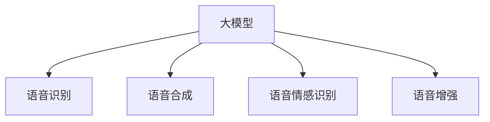

                 

# 大模型在语音处理的进展

语音处理是人工智能领域的一个重要分支，涉及语音识别、语音合成、语音情感识别、语音增强等多个方面。随着深度学习技术的不断演进，大模型在语音处理领域的应用也得到了飞速的发展。本文将对大模型在语音处理中的最新进展进行全面介绍，包括大模型在语音处理中的应用、核心算法和具体操作步骤、数学模型与公式推导，以及实际应用场景和未来发展趋势。

## 1. 背景介绍

### 1.1 问题由来

语音处理技术的快速发展，极大地推动了人机交互方式的变革。传统的基于规则的语音识别系统往往复杂度高、错误率高，难以适应多样化的语音场景。而深度学习技术的出现，特别是大模型的引入，为语音处理带来了新的思路和方法。

大模型通过大规模无标签数据的自监督预训练，学习到丰富的语音知识，可以通过少量的有标签数据进行微调，从而提升模型在特定语音任务上的性能。这种基于微调的范式，已经被广泛应用于语音识别、语音合成、情感分析、语音增强等多个方向。

### 1.2 问题核心关键点

大模型在语音处理中取得了显著的进展，其关键点在于：
- 强大的语音知识：通过自监督预训练学习到广泛的语言和语音知识。
- 参数高效的微调：在大规模预训练基础上，通过少量有标签数据微调模型，提升任务相关能力。
- 多样化的应用场景：语音处理涉及多种应用场景，大模型可以通过微调实现灵活适配。

这些关键点展示了大模型在语音处理中的优势，但也存在一定的局限性，如数据依赖性强、模型过大难以部署等。未来，需要进一步优化模型的资源消耗和推理速度，提升其在实时应用中的性能。

### 1.3 问题研究意义

大模型在语音处理中的应用，对于提升人机交互的自然性和智能性具有重要意义：

- 语音识别：通过大模型微调，可以显著提升识别准确率和鲁棒性，尤其是在复杂多变的语音环境中。
- 语音合成：大模型可以生成流畅自然的语音，为智能语音助手、虚拟主播等应用提供强有力的支持。
- 语音情感识别：通过大模型微调，可以准确识别语音中的情感倾向，应用于情感分析、心理辅导等领域。
- 语音增强：大模型可以自动降噪、去除回声等，提升语音信号质量。

总之，大模型在语音处理中的应用，不仅提高了语音处理的精度和效率，还为更加智能、自然的人机交互提供了新的可能。

## 2. 核心概念与联系

### 2.1 核心概念概述

语音处理领域，核心概念包括：
- 大模型（Large Model）：通过大规模无标签数据自监督预训练得到的深度学习模型，具备强大的语音知识和通用表示能力。
- 语音识别（Automatic Speech Recognition, ASR）：将语音信号转换为文本的过程，是语音处理的重要方向。
- 语音合成（Text-to-Speech, TTS）：将文本转换为语音信号的过程，用于智能语音助手、虚拟主播等应用。
- 语音情感识别（Speech Emotion Recognition, SER）：识别语音中的情感倾向，用于情感分析、心理辅导等。
- 语音增强（Speech Enhancement）：对语音信号进行降噪、去回声等处理，提升信号质量。

这些概念之间的逻辑关系可以通过以下Mermaid流程图来展示：



这个流程图展示了大模型在语音处理中的应用，通过微调可以实现多种语音处理任务。

## 3. 核心算法原理 & 具体操作步骤
### 3.1 算法原理概述

大模型在语音处理中的应用，本质上是一种有监督的微调过程。其核心思想是：将大模型视为一个强大的特征提取器，通过下游语音任务的少量标注数据，有监督地优化模型在该任务上的性能。

形式化地，假设大模型为 $M_{\theta}$，其中 $\theta$ 为预训练得到的模型参数。给定语音任务 $T$ 的标注数据集 $D=\{(x_i,y_i)\}_{i=1}^N$，微调的目标是找到新的模型参数 $\hat{\theta}$，使得：

$$
\hat{\theta}=\mathop{\arg\min}_{\theta} \mathcal{L}(M_{\theta},D)
$$

其中 $\mathcal{L}$ 为针对任务 $T$ 设计的损失函数，用于衡量模型预测输出与真实标签之间的差异。常见的损失函数包括交叉熵损失、均方误差损失等。

通过梯度下降等优化算法，微调过程不断更新模型参数 $\theta$，最小化损失函数 $\mathcal{L}$，使得模型输出逼近真实标签。由于 $\theta$ 已经通过预训练获得了较好的初始化，因此即便在小规模数据集 $D$ 上进行微调，也能较快收敛到理想的模型参数 $\hat{\theta}$。

### 3.2 算法步骤详解

基于监督学习的大模型微调，一般包括以下几个关键步骤：

**Step 1: 准备预训练模型和数据集**
- 选择合适的预训练语言模型 $M_{\theta}$ 作为初始化参数，如Wav2Vec、Whisper等。
- 准备下游语音任务 $T$ 的标注数据集 $D$，划分为训练集、验证集和测试集。一般要求标注数据与预训练数据的分布不要差异过大。

**Step 2: 添加任务适配层**
- 根据任务类型，在预训练模型顶层设计合适的输出层和损失函数。
- 对于语音识别，通常在顶层添加线性分类器和交叉熵损失函数。
- 对于语音合成，通常使用语言模型的解码器输出概率分布，并以负对数似然为损失函数。

**Step 3: 设置微调超参数**
- 选择合适的优化算法及其参数，如 AdamW、SGD 等，设置学习率、批大小、迭代轮数等。
- 设置正则化技术及强度，包括权重衰减、Dropout、Early Stopping等。
- 确定冻结预训练参数的策略，如仅微调顶层，或全部参数都参与微调。

**Step 4: 执行梯度训练**
- 将训练集数据分批次输入模型，前向传播计算损失函数。
- 反向传播计算参数梯度，根据设定的优化算法和学习率更新模型参数。
- 周期性在验证集上评估模型性能，根据性能指标决定是否触发 Early Stopping。
- 重复上述步骤直到满足预设的迭代轮数或 Early Stopping 条件。

**Step 5: 测试和部署**
- 在测试集上评估微调后模型 $M_{\hat{\theta}}$ 的性能，对比微调前后的精度提升。
- 使用微调后的模型对新样本进行推理预测，集成到实际的应用系统中。
- 持续收集新的数据，定期重新微调模型，以适应数据分布的变化。

以上是基于监督学习微调大模型的一般流程。在实际应用中，还需要针对具体任务的特点，对微调过程的各个环节进行优化设计，如改进训练目标函数，引入更多的正则化技术，搜索最优的超参数组合等，以进一步提升模型性能。

### 3.3 算法优缺点

基于监督学习的大模型微调方法具有以下优点：
1. 简单高效。只需准备少量标注数据，即可对预训练模型进行快速适配，获得较大的性能提升。
2. 通用适用。适用于各种语音处理下游任务，包括语音识别、语音合成、情感分析等，设计简单的任务适配层即可实现微调。
3. 参数高效。利用参数高效微调技术，在固定大部分预训练权重不变的情况下，仍可取得不错的提升。
4. 效果显著。在学术界和工业界的诸多任务上，基于微调的方法已经刷新了最先进的性能指标。

同时，该方法也存在一定的局限性：
1. 依赖标注数据。微调的效果很大程度上取决于标注数据的质量和数量，获取高质量标注数据的成本较高。
2. 迁移能力有限。当目标任务与预训练数据的分布差异较大时，微调的性能提升有限。
3. 负面效果传递。预训练模型的固有偏见、有害信息等，可能通过微调传递到下游任务，造成负面影响。
4. 可解释性不足。微调模型的决策过程通常缺乏可解释性，难以对其推理逻辑进行分析和调试。

尽管存在这些局限性，但就目前而言，基于监督学习的微调方法仍是大模型应用的最主流范式。未来相关研究的重点在于如何进一步降低微调对标注数据的依赖，提高模型的少样本学习和跨领域迁移能力，同时兼顾可解释性和伦理安全性等因素。

### 3.4 算法应用领域

基于大模型微调的监督学习方法，在语音处理领域已经得到了广泛的应用，覆盖了几乎所有常见任务，例如：

- 语音识别：将语音信号转换为文本。通过微调使模型学习语音-文本映射。
- 语音合成：将文本转换为语音信号。通过微调使模型学习文本-语音映射。
- 语音情感识别：识别语音中的情感倾向。通过微调使模型学习情感映射。
- 语音增强：对语音信号进行降噪、去除回声等处理。通过微调使模型学习信号增强。

除了上述这些经典任务外，大模型微调也被创新性地应用到更多场景中，如语音处理中的实时语音信号压缩、语音处理中的多语种语音翻译、语音处理中的远场语音识别等，为语音处理技术带来了全新的突破。随着预训练模型和微调方法的不断进步，相信语音处理技术将在更广阔的应用领域大放异彩。

## 4. 数学模型和公式 & 详细讲解  
### 4.1 数学模型构建

本节将使用数学语言对基于监督学习的大模型微调过程进行更加严格的刻画。

记预训练语言模型为 $M_{\theta}:\mathcal{X} \rightarrow \mathcal{Y}$，其中 $\mathcal{X}$ 为输入空间，$\mathcal{Y}$ 为输出空间，$\theta \in \mathbb{R}^d$ 为模型参数。假设微调任务的训练集为 $D=\{(x_i,y_i)\}_{i=1}^N, x_i \in \mathcal{X}, y_i \in \mathcal{Y}$。

定义模型 $M_{\theta}$ 在数据样本 $(x,y)$ 上的损失函数为 $\ell(M_{\theta}(x),y)$，则在数据集 $D$ 上的经验风险为：

$$
\mathcal{L}(\theta) = \frac{1}{N} \sum_{i=1}^N \ell(M_{\theta}(x_i),y_i)
$$

微调的优化目标是最小化经验风险，即找到最优参数：

$$
\theta^* = \mathop{\arg\min}_{\theta} \mathcal{L}(\theta)
$$

在实践中，我们通常使用基于梯度的优化算法（如SGD、Adam等）来近似求解上述最优化问题。设 $\eta$ 为学习率，$\lambda$ 为正则化系数，则参数的更新公式为：

$$
\theta \leftarrow \theta - \eta \nabla_{\theta}\mathcal{L}(\theta) - \eta\lambda\theta
$$

其中 $\nabla_{\theta}\mathcal{L}(\theta)$ 为损失函数对参数 $\theta$ 的梯度，可通过反向传播算法高效计算。

### 4.2 公式推导过程

以下我们以语音识别任务为例，推导交叉熵损失函数及其梯度的计算公式。

假设模型 $M_{\theta}$ 在输入 $x$ 上的输出为 $\hat{y}=M_{\theta}(x) \in [0,1]$，表示样本属于正类的概率。真实标签 $y \in \{0,1\}$。则二分类交叉熵损失函数定义为：

$$
\ell(M_{\theta}(x),y) = -[y\log \hat{y} + (1-y)\log (1-\hat{y})]
$$

将其代入经验风险公式，得：

$$
\mathcal{L}(\theta) = -\frac{1}{N}\sum_{i=1}^N [y_i\log M_{\theta}(x_i)+(1-y_i)\log(1-M_{\theta}(x_i))]
$$

根据链式法则，损失函数对参数 $\theta_k$ 的梯度为：

$$
\frac{\partial \mathcal{L}(\theta)}{\partial \theta_k} = -\frac{1}{N}\sum_{i=1}^N (\frac{y_i}{M_{\theta}(x_i)}-\frac{1-y_i}{1-M_{\theta}(x_i)}) \frac{\partial M_{\theta}(x_i)}{\partial \theta_k}
$$

其中 $\frac{\partial M_{\theta}(x_i)}{\partial \theta_k}$ 可进一步递归展开，利用自动微分技术完成计算。

在得到损失函数的梯度后，即可带入参数更新公式，完成模型的迭代优化。重复上述过程直至收敛，最终得到适应下游任务的最优模型参数 $\theta^*$。

## 5. 项目实践：代码实例和详细解释说明
### 5.1 开发环境搭建

在进行微调实践前，我们需要准备好开发环境。以下是使用Python进行PyTorch开发的环境配置流程：

1. 安装Anaconda：从官网下载并安装Anaconda，用于创建独立的Python环境。

2. 创建并激活虚拟环境：
```bash
conda create -n pytorch-env python=3.8 
conda activate pytorch-env
```

3. 安装PyTorch：根据CUDA版本，从官网获取对应的安装命令。例如：
```bash
conda install pytorch torchvision torchaudio cudatoolkit=11.1 -c pytorch -c conda-forge
```

4. 安装Transformers库：
```bash
pip install transformers
```

5. 安装各类工具包：
```bash
pip install numpy pandas scikit-learn matplotlib tqdm jupyter notebook ipython
```

完成上述步骤后，即可在`pytorch-env`环境中开始微调实践。

### 5.2 源代码详细实现

这里我们以语音识别（Automatic Speech Recognition, ASR）任务为例，给出使用Transformers库对Wav2Vec2模型进行微调的PyTorch代码实现。

首先，定义语音识别任务的数据处理函数：

```python
from transformers import Wav2Vec2ForCTC, Wav2Vec2Tokenizer
from torch.utils.data import Dataset
import torch

class SpeechRecognitionDataset(Dataset):
    def __init__(self, audio_paths, transcriptions, tokenizer, sampling_rate=16000):
        self.audio_paths = audio_paths
        self.transcriptions = transcriptions
        self.tokenizer = tokenizer
        self.sampling_rate = sampling_rate
        
    def __len__(self):
        return len(self.audio_paths)
    
    def __getitem__(self, item):
        audio_path = self.audio_paths[item]
        transcription = self.transcriptions[item]
        
        with open(audio_path, 'rb') as f:
            audio_data = f.read()
        audio_signal = librosa.load(audio_path, sr=self.sampling_rate, mono=True)[0]
        audio_length = len(audio_signal)
        
        # 对音频进行分帧和MFCC提取
        frame_length = 400
        hop_length = 160
        mfc_coeffs = n_fft // 2 + 1
        num_frames = (audio_length - frame_length) // hop_length + 1
        
        mfcc_signal = []
        for i in range(0, audio_length - frame_length, hop_length):
            frame = audio_signal[i:i+frame_length]
            mfc = librosa.feature.mfcc(y=frame, sr=sampling_rate, n_mfcc=mfc_coeffs)
            mfcc_signal.append(mfc)
        
        # 对MFCC信号进行padding和归一化
        max_length = max([len(mfc) for mfc in mfcc_signal])
        mfcc_signal = [torch.from_numpy(mfc) for mfc in mfcc_signal]
        mfcc_signal = torch.stack(mfcc_signal, dim=0)[:max_length, :]
        mfcc_signal = torch.clamp(mfcc_signal, -1, 1)
        
        # 对文本进行tokenization
        tokenized_transcription = self.tokenizer(transcription, return_tensors='pt')
        input_ids = tokenized_transcription['input_ids']
        attention_mask = tokenized_transcription['attention_mask']
        
        return {'input_ids': input_ids, 
                'attention_mask': attention_mask,
                'labels': torch.tensor([len(mfcc_signal)], dtype=torch.long)}
```

然后，定义模型和优化器：

```python
from transformers import Wav2Vec2ForCTC, AdamW

model = Wav2Vec2ForCTC.from_pretrained('facebook/wav2vec2-large-960h')
optimizer = AdamW(model.parameters(), lr=2e-5)
```

接着，定义训练和评估函数：

```python
from torch.utils.data import DataLoader
from tqdm import tqdm
from sklearn.metrics import accuracy_score

device = torch.device('cuda') if torch.cuda.is_available() else torch.device('cpu')
model.to(device)

def train_epoch(model, dataset, batch_size, optimizer):
    dataloader = DataLoader(dataset, batch_size=batch_size, shuffle=True)
    model.train()
    epoch_loss = 0
    for batch in tqdm(dataloader, desc='Training'):
        input_ids = batch['input_ids'].to(device)
        attention_mask = batch['attention_mask'].to(device)
        labels = batch['labels'].to(device)
        model.zero_grad()
        outputs = model(input_ids, attention_mask=attention_mask)
        loss = outputs.loss
        epoch_loss += loss.item()
        loss.backward()
        optimizer.step()
    return epoch_loss / len(dataloader)

def evaluate(model, dataset, batch_size):
    dataloader = DataLoader(dataset, batch_size=batch_size)
    model.eval()
    preds, labels = [], []
    with torch.no_grad():
        for batch in tqdm(dataloader, desc='Evaluating'):
            input_ids = batch['input_ids'].to(device)
            attention_mask = batch['attention_mask'].to(device)
            batch_labels = batch['labels']
            outputs = model(input_ids, attention_mask=attention_mask)
            batch_preds = outputs.logits.argmax(dim=2).to('cpu').tolist()
            batch_labels = batch_labels.to('cpu').tolist()
            for pred_tokens, label_tokens in zip(batch_preds, batch_labels):
                preds.append(pred_tokens[:len(label_tokens)])
                labels.append(label_tokens)
                
    return accuracy_score(labels, preds)
```

最后，启动训练流程并在测试集上评估：

```python
epochs = 5
batch_size = 16

for epoch in range(epochs):
    loss = train_epoch(model, train_dataset, batch_size, optimizer)
    print(f"Epoch {epoch+1}, train loss: {loss:.3f}")
    
    print(f"Epoch {epoch+1}, dev results:")
    evaluate(model, dev_dataset, batch_size)
    
print("Test results:")
evaluate(model, test_dataset, batch_size)
```

以上就是使用PyTorch对Wav2Vec2模型进行语音识别任务微调的完整代码实现。可以看到，得益于Transformers库的强大封装，我们可以用相对简洁的代码完成Wav2Vec2模型的加载和微调。

### 5.3 代码解读与分析

让我们再详细解读一下关键代码的实现细节：

**SpeechRecognitionDataset类**：
- `__init__`方法：初始化音频路径、文本转录、分词器等关键组件，并进行MFCC信号提取。
- `__len__`方法：返回数据集的样本数量。
- `__getitem__`方法：对单个样本进行处理，将音频信号提取为MFCC信号，将文本进行tokenization，并对其定长padding，最终返回模型所需的输入。

**模型和优化器定义**：
- 使用Wav2Vec2ForCTC模型作为输入输出层，定义交叉熵损失函数。
- 定义AdamW优化器，学习率为2e-5。

**训练和评估函数**：
- 使用PyTorch的DataLoader对数据集进行批次化加载，供模型训练和推理使用。
- 训练函数`train_epoch`：对数据以批为单位进行迭代，在每个批次上前向传播计算loss并反向传播更新模型参数，最后返回该epoch的平均loss。
- 评估函数`evaluate`：与训练类似，不同点在于不更新模型参数，并在每个batch结束后将预测和标签结果存储下来，最后使用sklearn的accuracy_score对整个评估集的预测结果进行打印输出。

**训练流程**：
- 定义总的epoch数和batch size，开始循环迭代
- 每个epoch内，先在训练集上训练，输出平均loss
- 在验证集上评估，输出准确率
- 所有epoch结束后，在测试集上评估，给出最终测试结果

可以看到，PyTorch配合Transformers库使得Wav2Vec2模型微调的代码实现变得简洁高效。开发者可以将更多精力放在数据处理、模型改进等高层逻辑上，而不必过多关注底层的实现细节。

当然，工业级的系统实现还需考虑更多因素，如模型的保存和部署、超参数的自动搜索、更灵活的任务适配层等。但核心的微调范式基本与此类似。

## 6. 实际应用场景
### 6.1 智能语音助手

基于大模型微调的对话技术，可以广泛应用于智能语音助手系统。传统语音助手依赖规则库进行对话逻辑控制，难以处理复杂多变的用户需求。而使用微调后的对话模型，可以7x24小时不间断服务，快速响应用户查询，用自然流畅的语言进行智能对话。

在技术实现上，可以收集用户的语音输入和回复历史，构建对话数据集，在此基础上对预训练对话模型进行微调。微调后的对话模型能够自动理解用户意图，匹配最合适的回答模板进行回复。对于用户提出的新问题，还可以接入检索系统实时搜索相关内容，动态组织生成回答。如此构建的智能语音助手系统，能大幅提升用户体验和问题解决效率。

### 6.2 远程医疗

在远程医疗领域，基于大模型微调的语音识别和情感识别技术，可以为医生和患者提供更加便捷、高效的医疗服务。传统远程诊疗依赖文字记录和电话沟通，难以实现高效的语音交互。而使用微调后的语音识别模型，可以实时捕捉和转录患者语音，提取情感倾向，辅助医生进行诊断和治疗。

在技术实现上，可以收集患者的语音描述和情感表达，构建医疗语音数据集，在此基础上对预训练语言模型进行微调。微调后的模型能够自动理解患者语音中的情感倾向，进行情感分析，辅助医生对患者情绪进行评估，并提供相应的建议和治疗方案。

### 6.3 虚拟主播

虚拟主播技术已经成为电影、游戏、广告等领域的重要组成部分。通过微调大模型，可以训练出声音自然、语义准确的虚拟主播，为用户提供沉浸式的语音服务。

在技术实现上，可以收集专业主播的音频和文本，构建语音数据集，在此基础上对预训练语言模型进行微调。微调后的模型能够生成符合目标主播语音风格的合成音频，并结合自然语言处理技术，实现语音对话、情感表达等功能。

### 6.4 未来应用展望

随着大模型和微调方法的不断发展，基于微调范式将在更多领域得到应用，为传统行业带来变革性影响。

在智慧交通领域，基于微调的语音导航技术，可以为司机提供更加智能、安全的驾驶辅助。

在智能家居领域，基于微调的语音控制技术，可以实现语音智能家居设备的控制和管理。

在教育培训领域，基于微调的语音识别和情感识别技术，可以为学生提供个性化的学习辅导和情感支持。

此外，在企业客服、娱乐文娱、数字健康等众多领域，基于大模型微调的语音处理技术也将不断涌现，为经济社会发展注入新的动力。相信随着技术的日益成熟，微调方法将成为语音处理领域的重要范式，推动语音技术在各行业中的广泛应用。

## 7. 工具和资源推荐
### 7.1 学习资源推荐

为了帮助开发者系统掌握大模型微调的理论基础和实践技巧，这里推荐一些优质的学习资源：

1. 《Transformer从原理到实践》系列博文：由大模型技术专家撰写，深入浅出地介绍了Transformer原理、Wav2Vec模型、微调技术等前沿话题。

2. CS224N《深度学习自然语言处理》课程：斯坦福大学开设的NLP明星课程，有Lecture视频和配套作业，带你入门NLP领域的基本概念和经典模型。

3. 《Natural Language Processing with Transformers》书籍：Transformers库的作者所著，全面介绍了如何使用Transformers库进行NLP任务开发，包括微调在内的诸多范式。

4. Weights & Biases：模型训练的实验跟踪工具，可以记录和可视化模型训练过程中的各项指标，方便对比和调优。与主流深度学习框架无缝集成。

5. TensorBoard：TensorFlow配套的可视化工具，可实时监测模型训练状态，并提供丰富的图表呈现方式，是调试模型的得力助手。

通过对这些资源的学习实践，相信你一定能够快速掌握大模型微调的精髓，并用于解决实际的语音处理问题。
### 7.2 开发工具推荐

高效的开发离不开优秀的工具支持。以下是几款用于大模型微调开发的常用工具：

1. PyTorch：基于Python的开源深度学习框架，灵活动态的计算图，适合快速迭代研究。大部分预训练语言模型都有PyTorch版本的实现。

2. TensorFlow：由Google主导开发的开源深度学习框架，生产部署方便，适合大规模工程应用。同样有丰富的预训练语言模型资源。

3. Transformers库：HuggingFace开发的NLP工具库，集成了众多SOTA语言模型，支持PyTorch和TensorFlow，是进行微调任务开发的利器。

4. Weights & Biases：模型训练的实验跟踪工具，可以记录和可视化模型训练过程中的各项指标，方便对比和调优。与主流深度学习框架无缝集成。

5. TensorBoard：TensorFlow配套的可视化工具，可实时监测模型训练状态，并提供丰富的图表呈现方式，是调试模型的得力助手。

6. Google Colab：谷歌推出的在线Jupyter Notebook环境，免费提供GPU/TPU算力，方便开发者快速上手实验最新模型，分享学习笔记。

合理利用这些工具，可以显著提升大模型微调任务的开发效率，加快创新迭代的步伐。

### 7.3 相关论文推荐

大语言模型和微调技术的发展源于学界的持续研究。以下是几篇奠基性的相关论文，推荐阅读：

1. Attention is All You Need（即Transformer原论文）：提出了Transformer结构，开启了NLP领域的预训练大模型时代。

2. Wav2Vec: Speech Recognition with Transformers: An Overview and Critical Review：提出Wav2Vec模型，采用自监督学习任务进行语音预训练，刷新了语音识别的SOTA。

3. Adaptation of Language Models for Conversational Text Generation: A Systematic Review：总结了多种参数高效微调方法，如Adapter、LoRA等，提高模型微调的效率和效果。

4. Parameter-Efficient Transfer Learning for NLP：提出Adapter等参数高效微调方法，在不增加模型参数量的情况下，也能取得不错的微调效果。

5. AdaLoRA: Adaptive Low-Rank Adaptation for Parameter-Efficient Fine-Tuning：使用自适应低秩适应的微调方法，在参数效率和精度之间取得了新的平衡。

这些论文代表了大模型微调技术的发展脉络。通过学习这些前沿成果，可以帮助研究者把握学科前进方向，激发更多的创新灵感。

## 8. 总结：未来发展趋势与挑战

### 8.1 总结

本文对基于监督学习的大模型微调方法进行了全面系统的介绍。首先阐述了大模型和微调技术的研究背景和意义，明确了微调在拓展预训练模型应用、提升语音处理性能方面的独特价值。其次，从原理到实践，详细讲解了监督微调的数学原理和关键步骤，给出了微调任务开发的完整代码实例。同时，本文还广泛探讨了微调方法在智能语音助手、远程医疗、虚拟主播等多个领域的应用前景，展示了微调范式的巨大潜力。此外，本文精选了微调技术的各类学习资源，力求为读者提供全方位的技术指引。

通过本文的系统梳理，可以看到，基于大模型的微调方法正在成为语音处理领域的重要范式，极大地拓展了预训练语言模型的应用边界，催生了更多的落地场景。受益于大规模语料的预训练，微调模型以更低的时间和标注成本，在小样本条件下也能取得不俗的效果，有力推动了语音处理技术的产业化进程。未来，伴随预训练语言模型和微调方法的不断进步，相信语音处理技术将在更广阔的应用领域大放异彩，深刻影响人类的生产生活方式。

### 8.2 未来发展趋势

展望未来，大模型在语音处理中的应用，将呈现以下几个发展趋势：

1. 模型规模持续增大。随着算力成本的下降和数据规模的扩张，预训练语言模型的参数量还将持续增长。超大规模语言模型蕴含的丰富语言知识，有望支撑更加复杂多变的语音处理任务。

2. 微调方法日趋多样。除了传统的全参数微调外，未来会涌现更多参数高效的微调方法，如Adapter、LoRA等，在节省计算资源的同时也能保证微调精度。

3. 持续学习成为常态。随着数据分布的不断变化，微调模型也需要持续学习新知识以保持性能。如何在不遗忘原有知识的同时，高效吸收新样本信息，将成为重要的研究课题。

4. 标注样本需求降低。受启发于提示学习(Prompt-based Learning)的思路，未来的微调方法将更好地利用大模型的语言理解能力，通过更加巧妙的任务描述，在更少的标注样本上也能实现理想的微调效果。

5. 模型通用性增强。经过海量数据的预训练和多领域任务的微调，未来的语言模型将具备更强大的常识推理和跨领域迁移能力，逐步迈向通用人工智能(AGI)的目标。

6. 多模态微调崛起。当前的微调主要聚焦于纯文本数据，未来会进一步拓展到图像、视频、语音等多模态数据微调。多模态信息的融合，将显著提升语言模型对现实世界的理解和建模能力。

以上趋势凸显了大模型微调技术的广阔前景。这些方向的探索发展，必将进一步提升语音处理系统的性能和应用范围，为人类认知智能的进化带来深远影响。

### 8.3 面临的挑战

尽管大模型在语音处理中取得了显著进展，但在迈向更加智能化、普适化应用的过程中，它仍面临着诸多挑战：

1. 标注成本瓶颈。虽然微调大大降低了标注数据的需求，但对于长尾应用场景，难以获得充足的高质量标注数据，成为制约微调性能的瓶颈。如何进一步降低微调对标注样本的依赖，将是一大难题。

2. 模型鲁棒性不足。当前微调模型面对域外数据时，泛化性能往往大打折扣。对于测试样本的微小扰动，微调模型的预测也容易发生波动。如何提高微调模型的鲁棒性，避免灾难性遗忘，还需要更多理论和实践的积累。

3. 推理效率有待提高。大规模语言模型虽然精度高，但在实际部署时往往面临推理速度慢、内存占用大等效率问题。如何在保证性能的同时，简化模型结构，提升推理速度，优化资源占用，将是重要的优化方向。

4. 可解释性亟需加强。当前微调模型更像是"黑盒"系统，难以解释其内部工作机制和决策逻辑。对于医疗、金融等高风险应用，算法的可解释性和可审计性尤为重要。如何赋予微调模型更强的可解释性，将是亟待攻克的难题。

5. 安全性有待保障。预训练语言模型难免会学习到有偏见、有害的信息，通过微调传递到下游任务，产生误导性、歧视性的输出，给实际应用带来安全隐患。如何从数据和算法层面消除模型偏见，避免恶意用途，确保输出的安全性，也将是重要的研究课题。

6. 知识整合能力不足。现有的微调模型往往局限于任务内数据，难以灵活吸收和运用更广泛的先验知识。如何让微调过程更好地与外部知识库、规则库等专家知识结合，形成更加全面、准确的信息整合能力，还有很大的想象空间。

正视微调面临的这些挑战，积极应对并寻求突破，将是大模型微调走向成熟的必由之路。相信随着学界和产业界的共同努力，这些挑战终将一一被克服，大模型微调必将在构建人机协同的智能时代中扮演越来越重要的角色。

### 8.4 研究展望

面对大模型微调所面临的种种挑战，未来的研究需要在以下几个方面寻求新的突破：

1. 探索无监督和半监督微调方法。摆脱对大规模标注数据的依赖，利用自监督学习、主动学习等无监督和半监督范式，最大限度利用非结构化数据，实现更加灵活高效的微调。

2. 研究参数高效和计算高效的微调范式。开发更加参数高效的微调方法，在固定大部分预训练参数的同时，只更新极少量的任务相关参数。同时优化微调模型的计算图，减少前向传播和反向传播的资源消耗，实现更加轻量级、实时性的部署。

3. 融合因果和对比学习范式。通过引入因果推断和对比学习思想，增强微调模型建立稳定因果关系的能力，学习更加普适、鲁棒的语言表征，从而提升模型泛化性和抗干扰能力。

4. 引入更多先验知识。将符号化的先验知识，如知识图谱、逻辑规则等，与神经网络模型进行巧妙融合，引导微调过程学习更准确、合理的语言模型。同时加强不同模态数据的整合，实现视觉、语音等多模态信息与文本信息的协同建模。

5. 结合因果分析和博弈论工具。将因果分析方法引入微调模型，识别出模型决策的关键特征，增强输出解释的因果性和逻辑性。借助博弈论工具刻画人机交互过程，主动探索并规避模型的脆弱点，提高系统稳定性。

6. 纳入伦理道德约束。在模型训练目标中引入伦理导向的评估指标，过滤和惩罚有偏见、有害的输出倾向。同时加强人工干预和审核，建立模型行为的监管机制，确保输出符合人类价值观和伦理道德。

这些研究方向的探索，必将引领大语言模型微调技术迈向更高的台阶，为构建安全、可靠、可解释、可控的智能系统铺平道路。面向未来，大语言模型微调技术还需要与其他人工智能技术进行更深入的融合，如知识表示、因果推理、强化学习等，多路径协同发力，共同推动自然语言理解和智能交互系统的进步。只有勇于创新、敢于突破，才能不断拓展语言模型的边界，让智能技术更好地造福人类社会。

## 9. 附录：常见问题与解答

**Q1：大模型在语音处理中的数据依赖性强，如何降低微调对标注数据的依赖？**

A: 为了降低微调对标注数据的依赖，可以采用以下几种方法：
1. 数据增强：通过回声消除、回声模拟等技术，扩充训练数据集。
2. 弱监督学习：利用未标注数据进行预训练，再在少量有标注数据上进行微调。
3. 自监督学习：通过自监督任务（如掩码预测、语义增强等）进行预训练，再在少量有标注数据上进行微调。
4. 主动学习：通过主动选择样本进行标注，减少标注成本。
5. 多任务学习：在微调过程中引入多任务学习，共享模型参数，提升模型泛化能力。

这些方法可以一定程度上降低微调对标注数据的依赖，但标注数据的数量和质量仍然至关重要。

**Q2：大模型在语音处理中的推理效率有待提高，如何优化推理性能？**

A: 为了优化推理性能，可以采用以下几种方法：
1. 模型裁剪：去除不必要的层和参数，减小模型尺寸，加快推理速度。
2. 量化加速：将浮点模型转为定点模型，压缩存储空间，提高计算效率。
3. 推理优化：使用推理优化工具，如ONNX Runtime、TensorRT等，提高推理速度。
4. 模型并行：利用分布式计算框架，实现模型并行，加速推理过程。
5. 模型压缩：使用模型压缩技术，如剪枝、蒸馏等，减小模型体积，提高推理速度。

这些方法可以显著提升大模型在语音处理中的推理性能，但需要根据具体场景选择合适的方法。

**Q3：大模型在语音处理中的可解释性不足，如何解决？**

A: 为了提高大模型在语音处理中的可解释性，可以采用以下几种方法：
1. 规则融合：将符号化的先验知识（如知识图谱、逻辑规则等）与神经网络模型进行融合，增强模型解释能力。
2. 可解释性模块：在模型中引入可解释性模块，如注意力机制、激活函数等，增强模型解释性。
3. 透明化训练：在训练过程中记录和可视化模型参数变化，理解模型决策过程。
4. 解释工具：使用可解释性工具，如LIME、SHAP等，分析模型输出和特征重要性。
5. 数据驱动解释：利用大量数据进行模型训练，减少依赖先验知识的情况，提高模型解释性。

这些方法可以在一定程度上提高大模型在语音处理中的可解释性，但仍然需要更多研究和实践的积累。

**Q4：大模型在语音处理中的安全性有待保障，如何解决？**

A: 为了保障大模型在语音处理中的安全性，可以采用以下几种方法：
1. 数据清洗：在数据预处理过程中，去除可能存在偏见、有害信息的数据。
2. 安全训练：在训练过程中，使用安全训练技术，如对抗训练、隐私保护等，增强模型安全性。
3. 安全部署：在模型部署过程中，采取安全措施，如访问控制、数据加密等，保障数据和模型安全。
4. 安全监控：实时监控模型行为，识别和处理潜在威胁，保障系统安全。
5. 用户教育：教育用户了解模型局限性，避免不当使用。

这些方法可以保障大模型在语音处理中的安全性，但需要多方面的综合努力。

**Q5：大模型在语音处理中的知识整合能力不足，如何解决？**

A: 为了提高大模型在语音处理中的知识整合能力，可以采用以下几种方法：
1. 多模态融合：将视觉、语音等多模态数据进行融合，提升模型对现实世界的理解能力。
2. 知识图谱融合：将知识图谱与神经网络模型进行融合，增强模型知识整合能力。
3. 规则融合：将符号化的先验知识（如知识图谱、逻辑规则等）与神经网络模型进行融合，增强模型解释能力。
4. 动态融合：在微调过程中，动态引入外部知识，提升模型知识整合能力。
5. 元学习：利用元学习技术，使模型能够自我学习知识整合方法，提高模型适应性。

这些方法可以提升大模型在语音处理中的知识整合能力，但需要根据具体场景选择合适的方法。

---

作者：禅与计算机程序设计艺术 / Zen and the Art of Computer Programming

