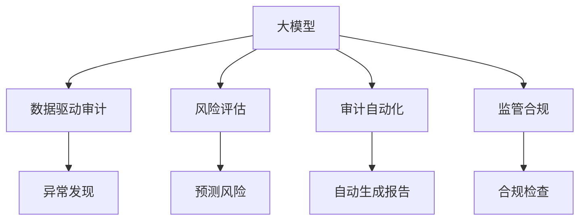

                 

# 大模型对会计审计的影响及应对

> 关键词：大模型,会计审计,数据驱动,风险评估,审计自动化,监管合规

## 1. 背景介绍

### 1.1 问题由来

随着人工智能技术的快速发展，特别是在大数据和深度学习领域取得的突破，大模型在各行各业中的应用日益广泛。在会计审计领域，大模型以其强大的数据处理能力和高效的自动化分析能力，逐渐成为推动审计技术进步的重要工具。然而，大模型的引入也带来了新的挑战和风险，如数据隐私保护、模型透明度和公平性等问题，如何有效利用大模型，同时规避其潜在的风险，成为会计审计领域需要认真思考的问题。

### 1.2 问题核心关键点

大模型对会计审计的影响主要体现在以下几个方面：

1. **数据驱动审计**：大模型可以处理海量数据，自动发现异常和规律，大幅提升审计效率和质量。
2. **风险评估**：通过分析历史数据，预测潜在风险，帮助审计人员识别高风险领域。
3. **审计自动化**：自动生成审计报告，减少手工操作，提高审计工作的效率和一致性。
4. **监管合规**：确保审计工作符合相关法规和标准，提升审计的合规性和透明度。

## 2. 核心概念与联系

### 2.1 核心概念概述

为更好地理解大模型在会计审计中的应用，本节将介绍几个关键概念：

- **大模型（Large Model）**：指在大型数据集上训练得到的大规模神经网络模型，如BERT、GPT、ResNet等。大模型能够处理复杂的非结构化数据，并从中提取有价值的特征。

- **会计审计（Accounting Audit）**：指对企业的财务报表、业务活动和内部控制等进行全面、系统的检查和评估，确保其符合会计准则和相关法规，提供真实、公正的财务信息。

- **数据驱动审计（Data-Driven Audit）**：指利用大数据和人工智能技术，对审计数据进行分析，自动发现审计线索和异常，辅助审计决策。

- **风险评估（Risk Assessment）**：指通过分析历史数据和相关因素，预测潜在风险，帮助审计人员确定审计的重点和范围。

- **审计自动化（Audit Automation）**：指利用自动化技术，如机器学习和自然语言处理，自动执行审计任务，减少手工操作，提高审计效率。

- **监管合规（Regulatory Compliance）**：指确保审计工作符合相关法规和标准，提升审计的合规性和透明度。

这些概念之间有着密切的联系，通过大模型，会计审计可以实现数据驱动、风险评估、审计自动化和监管合规等目标，从而提升审计的质量和效率。

### 2.2 核心概念原理和架构的 Mermaid 流程图



这个流程图展示了大模型在会计审计中的应用流程：

1. 大模型作为核心工具，通过分析审计数据，帮助识别异常和预测风险。
2. 数据驱动审计利用大模型分析审计数据，发现潜在的异常和违规行为。
3. 风险评估通过大模型分析历史数据，预测潜在的风险领域。
4. 审计自动化利用大模型自动执行审计任务，生成审计报告。
5. 监管合规通过大模型检查审计过程的合规性，确保审计工作符合法规和标准。

## 3. 核心算法原理 & 具体操作步骤

### 3.1 算法原理概述

大模型在会计审计中的应用，主要是通过其在处理大规模非结构化数据上的优势，进行数据驱动审计、风险评估、审计自动化和监管合规。其核心算法原理包括以下几个方面：

1. **数据预处理**：将原始审计数据转换为模型可处理的格式，包括文本清洗、实体识别等步骤。
2. **特征提取**：利用大模型自动提取审计数据的特征，发现数据中的规律和异常。
3. **风险预测**：通过分析历史数据，利用大模型预测潜在的风险，辅助审计人员识别高风险领域。
4. **审计自动化**：利用大模型自动生成审计报告，减少手工操作，提高审计效率和一致性。
5. **合规检查**：通过大模型检查审计过程的合规性，确保审计工作符合法规和标准。

### 3.2 算法步骤详解

基于大模型的会计审计步骤如下：

**Step 1: 数据收集与预处理**
- 收集审计相关的财务报表、业务文档、内部控制文件等数据。
- 对文本数据进行清洗、去噪、分词等预处理，转换为模型可接受的格式。

**Step 2: 特征提取与分析**
- 利用大模型对预处理后的文本数据进行特征提取，生成高维特征向量。
- 通过分析特征向量，识别数据中的异常和规律，生成异常报告。

**Step 3: 风险评估与预测**
- 使用大模型对历史审计数据进行分析，预测潜在的风险，确定审计的重点和范围。
- 根据风险评估结果，调整审计计划，优化审计资源分配。

**Step 4: 审计自动化与报告生成**
- 利用大模型自动执行审计任务，生成审计报告。
- 对审计报告进行格式化处理，确保报告符合法规和标准。

**Step 5: 合规检查与优化**
- 使用大模型对审计过程进行合规检查，确保审计工作符合法规和标准。
- 根据合规检查结果，优化审计方法和流程，提升审计质量。

### 3.3 算法优缺点

大模型在会计审计中的应用具有以下优点：

1. **高效性**：大模型可以处理海量数据，自动发现异常和规律，大幅提升审计效率和质量。
2. **准确性**：大模型能够从复杂的非结构化数据中提取有价值的特征，提高审计的准确性。
3. **自动化**：大模型可以自动执行审计任务，减少手工操作，提高审计工作的效率和一致性。
4. **合规性**：大模型可以检查审计过程的合规性，确保审计工作符合法规和标准。

同时，大模型在会计审计中也存在一些缺点：

1. **数据依赖**：大模型的效果很大程度上依赖于输入数据的质量和数量，高质量数据的获取成本较高。
2. **透明度不足**：大模型的内部机制和决策过程缺乏透明度，难以解释其输出结果。
3. **公平性问题**：大模型可能存在偏见，导致对某些领域的审计不够全面和公正。
4. **风险管理不足**：大模型的预测结果可能存在误判，对高风险领域的识别可能不够准确。

### 3.4 算法应用领域

大模型在会计审计中的应用主要涵盖以下几个领域：

1. **财务报表审计**：利用大模型分析财务报表中的数据，发现潜在的异常和违规行为。
2. **业务活动审计**：利用大模型分析业务文档和内部控制文件，识别潜在的风险和异常。
3. **风险管理审计**：利用大模型对历史数据进行分析，预测潜在的风险，帮助审计人员确定审计的重点和范围。
4. **审计自动化**：利用大模型自动生成审计报告，减少手工操作，提高审计效率和一致性。
5. **合规检查**：利用大模型检查审计过程的合规性，确保审计工作符合法规和标准。

这些领域的应用，极大地提升了会计审计的效率和质量，同时也为审计人员提供了新的工具和方法。

## 4. 数学模型和公式 & 详细讲解 & 举例说明

### 4.1 数学模型构建

大模型在会计审计中的应用，主要基于以下数学模型：

1. **数据预处理模型**：将原始审计数据转换为模型可处理的格式，包括文本清洗、去噪、分词等步骤。
2. **特征提取模型**：利用大模型对预处理后的文本数据进行特征提取，生成高维特征向量。
3. **风险评估模型**：通过分析历史审计数据，利用大模型预测潜在的风险，确定审计的重点和范围。
4. **审计自动化模型**：利用大模型自动执行审计任务，生成审计报告。
5. **合规检查模型**：通过大模型检查审计过程的合规性，确保审计工作符合法规和标准。

### 4.2 公式推导过程

以财务报表审计为例，大模型的应用主要包括以下步骤：

**Step 1: 数据预处理**
- 设原始审计数据为 $D=\{(x_i,y_i)\}_{i=1}^N$，其中 $x_i$ 为文本数据，$y_i$ 为标签（异常或正常）。
- 对文本数据进行清洗、去噪、分词等预处理，生成预处理后的数据集 $D'$。

**Step 2: 特征提取**
- 利用大模型 $M_{\theta}$ 对预处理后的数据集 $D'$ 进行特征提取，生成高维特征向量 $\mathbf{F}=\{f_i\}_{i=1}^N$。
- 特征提取公式为：
$$
f_i = M_{\theta}(x_i)
$$

**Step 3: 风险评估**
- 使用大模型 $M_{\phi}$ 对历史审计数据进行分析，预测潜在的风险，确定审计的重点和范围。
- 风险评估公式为：
$$
r_i = M_{\phi}(D_i)
$$
其中 $D_i$ 为历史审计数据集。

**Step 4: 审计自动化**
- 利用大模型 $M_{\omega}$ 自动执行审计任务，生成审计报告。
- 审计自动化公式为：
$$
r = M_{\omega}(D')
$$

**Step 5: 合规检查**
- 使用大模型 $M_{\eta}$ 检查审计过程的合规性，确保审计工作符合法规和标准。
- 合规检查公式为：
$$
c = M_{\eta}(D',r)
$$

### 4.3 案例分析与讲解

假设某公司需要对最近一个季度的财务报表进行审计。使用大模型进行审计的步骤如下：

1. **数据收集**：收集该季度的财务报表、业务文档、内部控制文件等数据。
2. **数据预处理**：对文本数据进行清洗、去噪、分词等预处理，转换为模型可接受的格式。
3. **特征提取**：利用大模型对预处理后的文本数据进行特征提取，生成高维特征向量。
4. **风险评估**：使用大模型对历史审计数据进行分析，预测潜在的风险，确定审计的重点和范围。
5. **审计自动化**：利用大模型自动执行审计任务，生成审计报告。
6. **合规检查**：使用大模型检查审计过程的合规性，确保审计工作符合法规和标准。

通过大模型进行审计，可以大幅提升审计效率和质量，同时也能减少人为操作带来的误差和风险。

## 5. 项目实践：代码实例和详细解释说明

### 5.1 开发环境搭建

在进行大模型在会计审计中的应用开发前，我们需要准备好开发环境。以下是使用Python进行PyTorch开发的环境配置流程：

1. 安装Anaconda：从官网下载并安装Anaconda，用于创建独立的Python环境。

2. 创建并激活虚拟环境：
```bash
conda create -n pytorch-env python=3.8 
conda activate pytorch-env
```

3. 安装PyTorch：根据CUDA版本，从官网获取对应的安装命令。例如：
```bash
conda install pytorch torchvision torchaudio cudatoolkit=11.1 -c pytorch -c conda-forge
```

4. 安装Transformers库：
```bash
pip install transformers
```

5. 安装各类工具包：
```bash
pip install numpy pandas scikit-learn matplotlib tqdm jupyter notebook ipython
```

完成上述步骤后，即可在`pytorch-env`环境中开始大模型在会计审计中的应用开发。

### 5.2 源代码详细实现

下面我们以利用BERT模型进行财务报表审计为例，给出使用Transformers库进行大模型应用的PyTorch代码实现。

首先，定义审计任务的数据处理函数：

```python
from transformers import BertTokenizer
from torch.utils.data import Dataset
import torch

class AuditDataset(Dataset):
    def __init__(self, texts, labels, tokenizer, max_len=128):
        self.texts = texts
        self.labels = labels
        self.tokenizer = tokenizer
        self.max_len = max_len
        
    def __len__(self):
        return len(self.texts)
    
    def __getitem__(self, item):
        text = self.texts[item]
        label = self.labels[item]
        
        encoding = self.tokenizer(text, return_tensors='pt', max_length=self.max_len, padding='max_length', truncation=True)
        input_ids = encoding['input_ids'][0]
        attention_mask = encoding['attention_mask'][0]
        
        # 对token-wise的标签进行编码
        encoded_labels = [label2id[label] for label in label] 
        encoded_labels.extend([label2id['O']] * (self.max_len - len(encoded_labels)))
        labels = torch.tensor(encoded_labels, dtype=torch.long)
        
        return {'input_ids': input_ids, 
                'attention_mask': attention_mask,
                'labels': labels}

# 标签与id的映射
label2id = {'O': 0, '异常': 1}
id2label = {v: k for k, v in label2id.items()}

# 创建dataset
tokenizer = BertTokenizer.from_pretrained('bert-base-cased')

train_dataset = AuditDataset(train_texts, train_labels, tokenizer)
dev_dataset = AuditDataset(dev_texts, dev_labels, tokenizer)
test_dataset = AuditDataset(test_texts, test_labels, tokenizer)
```

然后，定义模型和优化器：

```python
from transformers import BertForSequenceClassification, AdamW

model = BertForSequenceClassification.from_pretrained('bert-base-cased', num_labels=len(label2id))

optimizer = AdamW(model.parameters(), lr=2e-5)
```

接着，定义训练和评估函数：

```python
from torch.utils.data import DataLoader
from tqdm import tqdm
from sklearn.metrics import classification_report

device = torch.device('cuda') if torch.cuda.is_available() else torch.device('cpu')
model.to(device)

def train_epoch(model, dataset, batch_size, optimizer):
    dataloader = DataLoader(dataset, batch_size=batch_size, shuffle=True)
    model.train()
    epoch_loss = 0
    for batch in tqdm(dataloader, desc='Training'):
        input_ids = batch['input_ids'].to(device)
        attention_mask = batch['attention_mask'].to(device)
        labels = batch['labels'].to(device)
        model.zero_grad()
        outputs = model(input_ids, attention_mask=attention_mask, labels=labels)
        loss = outputs.loss
        epoch_loss += loss.item()
        loss.backward()
        optimizer.step()
    return epoch_loss / len(dataloader)

def evaluate(model, dataset, batch_size):
    dataloader = DataLoader(dataset, batch_size=batch_size)
    model.eval()
    preds, labels = [], []
    with torch.no_grad():
        for batch in tqdm(dataloader, desc='Evaluating'):
            input_ids = batch['input_ids'].to(device)
            attention_mask = batch['attention_mask'].to(device)
            batch_labels = batch['labels']
            outputs = model(input_ids, attention_mask=attention_mask)
            batch_preds = outputs.logits.argmax(dim=2).to('cpu').tolist()
            batch_labels = batch_labels.to('cpu').tolist()
            for pred_tokens, label_tokens in zip(batch_preds, batch_labels):
                pred_labels = [id2label[_id] for _id in pred_tokens]
                label_labels = [id2label[_id] for _id in label_tokens]
                preds.append(pred_labels[:len(label_labels)])
                labels.append(label_labels)
                
    print(classification_report(labels, preds))
```

最后，启动训练流程并在测试集上评估：

```python
epochs = 5
batch_size = 16

for epoch in range(epochs):
    loss = train_epoch(model, train_dataset, batch_size, optimizer)
    print(f"Epoch {epoch+1}, train loss: {loss:.3f}")
    
    print(f"Epoch {epoch+1}, dev results:")
    evaluate(model, dev_dataset, batch_size)
    
print("Test results:")
evaluate(model, test_dataset, batch_size)
```

以上就是利用BERT模型进行财务报表审计的完整代码实现。可以看到，得益于Transformers库的强大封装，我们可以用相对简洁的代码完成BERT模型的加载和应用。

### 5.3 代码解读与分析

让我们再详细解读一下关键代码的实现细节：

**AuditDataset类**：
- `__init__`方法：初始化文本、标签、分词器等关键组件。
- `__len__`方法：返回数据集的样本数量。
- `__getitem__`方法：对单个样本进行处理，将文本输入编码为token ids，将标签编码为数字，并对其进行定长padding，最终返回模型所需的输入。

**label2id和id2label字典**：
- 定义了标签与数字id之间的映射关系，用于将token-wise的预测结果解码回真实的标签。

**训练和评估函数**：
- 使用PyTorch的DataLoader对数据集进行批次化加载，供模型训练和推理使用。
- 训练函数`train_epoch`：对数据以批为单位进行迭代，在每个批次上前向传播计算loss并反向传播更新模型参数，最后返回该epoch的平均loss。
- 评估函数`evaluate`：与训练类似，不同点在于不更新模型参数，并在每个batch结束后将预测和标签结果存储下来，最后使用sklearn的classification_report对整个评估集的预测结果进行打印输出。

**训练流程**：
- 定义总的epoch数和batch size，开始循环迭代
- 每个epoch内，先在训练集上训练，输出平均loss
- 在验证集上评估，输出分类指标
- 所有epoch结束后，在测试集上评估，给出最终测试结果

可以看到，PyTorch配合Transformers库使得BERT模型在财务报表审计中的应用代码实现变得简洁高效。开发者可以将更多精力放在数据处理、模型改进等高层逻辑上，而不必过多关注底层的实现细节。

当然，工业级的系统实现还需考虑更多因素，如模型的保存和部署、超参数的自动搜索、更灵活的任务适配层等。但核心的微调范式基本与此类似。

## 6. 实际应用场景

### 6.1 智能审计平台

基于大模型的智能审计平台，可以显著提升审计工作的效率和质量。传统的审计工作往往依赖于人工审核，效率低下且容易出现人为错误。通过引入大模型，审计平台可以自动处理大量审计数据，发现异常和违规行为，辅助审计人员进行审核决策。

具体而言，审计平台可以收集公司内部的审计数据，包括财务报表、业务文档、内部控制文件等，利用大模型进行数据清洗、特征提取和风险评估，自动生成审计报告，并提供合规性检查，确保审计工作符合法规和标准。

### 6.2 财务数据分析

大模型可以应用于财务数据分析，帮助公司进行财务健康状况的评估和预测。通过分析历史财务数据，大模型可以发现潜在的财务风险和异常，提供财务预警和建议，帮助公司及时调整经营策略，规避风险。

具体而言，审计人员可以利用大模型对公司的财务报表进行分析，发现潜在的异常和违规行为，同时预测未来的财务风险，帮助公司制定更加合理的财务规划和决策。

### 6.3 内部控制审计

内部控制审计是大模型在会计审计中的重要应用场景。通过分析公司的内部控制文件，大模型可以发现潜在的内部控制缺陷和风险，辅助审计人员进行内部控制评估和优化。

具体而言，审计人员可以利用大模型对内部控制文件进行文本分析，发现潜在的控制缺陷和违规行为，同时评估内部控制的有效性，提供改进建议，帮助公司提升内部控制水平，降低风险。

### 6.4 未来应用展望

随着大模型和微调方法的不断发展，基于大模型的会计审计将呈现以下几个发展趋势：

1. **自动化程度提升**：大模型可以自动处理更多的审计任务，提高审计工作的自动化程度。
2. **数据驱动审计**：利用大模型分析海量数据，发现潜在的异常和违规行为，大幅提升审计效率和质量。
3. **风险评估精准化**：通过分析历史数据，利用大模型预测潜在的风险，帮助审计人员确定审计的重点和范围。
4. **合规性保障**：利用大模型检查审计过程的合规性，确保审计工作符合法规和标准。
5. **数据隐私保护**：利用大模型进行数据匿名化、去标识化等隐私保护技术，确保审计数据的隐私和安全。

这些趋势凸显了大模型在会计审计中的巨大潜力，未来的发展将为审计工作带来更多的创新和突破。

## 7. 工具和资源推荐

### 7.1 学习资源推荐

为了帮助开发者系统掌握大模型在会计审计中的应用，这里推荐一些优质的学习资源：

1. **《深度学习与会计审计》**：这本书系统介绍了深度学习在会计审计中的应用，涵盖了数据预处理、特征提取、风险评估等多个方面。
2. **CS246《机器学习与数据挖掘》**：斯坦福大学开设的机器学习课程，有Lecture视频和配套作业，深入讲解了机器学习的基本原理和经典模型。
3. **《自然语言处理与审计》**：这本书详细介绍了自然语言处理在审计中的应用，包括文本清洗、实体识别、情感分析等技术。
4. **Coursera《审计与数据科学》**：Coursera上的审计课程，结合数据科学和会计知识，讲解了如何使用大数据和机器学习技术进行审计。
5. **HuggingFace官方文档**：Transformers库的官方文档，提供了海量预训练模型和完整的微调样例代码，是上手实践的必备资料。

通过对这些资源的学习实践，相信你一定能够快速掌握大模型在会计审计中的应用精髓，并用于解决实际的审计问题。

### 7.2 开发工具推荐

高效的开发离不开优秀的工具支持。以下是几款用于大模型在会计审计中应用开发的常用工具：

1. PyTorch：基于Python的开源深度学习框架，灵活动态的计算图，适合快速迭代研究。大部分预训练语言模型都有PyTorch版本的实现。
2. TensorFlow：由Google主导开发的开源深度学习框架，生产部署方便，适合大规模工程应用。同样有丰富的预训练语言模型资源。
3. Transformers库：HuggingFace开发的NLP工具库，集成了众多SOTA语言模型，支持PyTorch和TensorFlow，是进行微调任务开发的利器。
4. Weights & Biases：模型训练的实验跟踪工具，可以记录和可视化模型训练过程中的各项指标，方便对比和调优。与主流深度学习框架无缝集成。
5. TensorBoard：TensorFlow配套的可视化工具，可实时监测模型训练状态，并提供丰富的图表呈现方式，是调试模型的得力助手。
6. Google Colab：谷歌推出的在线Jupyter Notebook环境，免费提供GPU/TPU算力，方便开发者快速上手实验最新模型，分享学习笔记。

合理利用这些工具，可以显著提升大模型在会计审计中的应用开发效率，加快创新迭代的步伐。

### 7.3 相关论文推荐

大模型在会计审计中的应用源于学界的持续研究。以下是几篇奠基性的相关论文，推荐阅读：

1. **A Survey of Machine Learning Techniques in Audit**：这篇综述论文详细介绍了机器学习在审计中的应用，包括数据预处理、特征提取、风险评估等多个方面。
2. **Auditing with Deep Learning**：这篇论文讨论了深度学习在审计中的应用，包括文本分类、情感分析、异常检测等多个任务。
3. **The Use of Natural Language Processing in Financial Audits**：这篇论文详细介绍了自然语言处理在财务审计中的应用，包括文本清洗、实体识别、情感分析等技术。
4. **Deep Learning in Compliance Auditing**：这篇论文讨论了深度学习在合规审计中的应用，包括内部控制评估、风险管理等多个任务。
5. **Machine Learning and Data Mining in Forensic Auditing**：这篇论文讨论了机器学习在法证审计中的应用，包括数据预处理、异常检测、分类等多个任务。

这些论文代表了大模型在会计审计中的应用方向，阅读这些前沿成果，可以帮助研究者把握学科前进方向，激发更多的创新灵感。

## 8. 总结：未来发展趋势与挑战

### 8.1 总结

本文对大模型在会计审计中的应用进行了全面系统的介绍。首先阐述了大模型和会计审计的研究背景和意义，明确了大模型在会计审计中的应用场景和价值。其次，从原理到实践，详细讲解了大模型在会计审计中的应用过程，包括数据预处理、特征提取、风险评估、审计自动化和合规检查等步骤。同时，本文还探讨了大模型在会计审计中面临的挑战和问题，提出了一些应对策略。

通过本文的系统梳理，可以看到，大模型在会计审计中的应用已经成为推动审计技术进步的重要工具。未来，随着大模型和微调方法的持续演进，基于大模型的会计审计必将在更多的行业领域中得到应用，为审计工作带来更多的创新和突破。

### 8.2 未来发展趋势

展望未来，大模型在会计审计中的应用将呈现以下几个发展趋势：

1. **自动化程度提升**：大模型可以自动处理更多的审计任务，提高审计工作的自动化程度。
2. **数据驱动审计**：利用大模型分析海量数据，发现潜在的异常和违规行为，大幅提升审计效率和质量。
3. **风险评估精准化**：通过分析历史数据，利用大模型预测潜在的风险，帮助审计人员确定审计的重点和范围。
4. **合规性保障**：利用大模型检查审计过程的合规性，确保审计工作符合法规和标准。
5. **数据隐私保护**：利用大模型进行数据匿名化、去标识化等隐私保护技术，确保审计数据的隐私和安全。

这些趋势凸显了大模型在会计审计中的巨大潜力，未来的发展将为审计工作带来更多的创新和突破。

### 8.3 面临的挑战

尽管大模型在会计审计中的应用取得了一定的进展，但在迈向更加智能化、普适化应用的过程中，仍面临诸多挑战：

1. **数据质量问题**：大模型的效果很大程度上依赖于输入数据的质量和数量，高质量数据的获取成本较高，且数据隐私和安全问题也需要关注。
2. **模型透明度不足**：大模型的内部机制和决策过程缺乏透明度，难以解释其输出结果，增加了审计工作的复杂性。
3. **公平性问题**：大模型可能存在偏见，导致对某些领域的审计不够全面和公正，需要进一步优化模型训练和数据处理策略。
4. **风险管理不足**：大模型的预测结果可能存在误判，对高风险领域的识别可能不够准确，需要进一步提升模型的鲁棒性和准确性。
5. **系统可扩展性问题**：大模型的应用需要大量的计算资源和存储空间，系统可扩展性问题需要进一步解决。

### 8.4 研究展望

面对大模型在会计审计中面临的挑战，未来的研究需要在以下几个方面寻求新的突破：

1. **数据质量提升**：提升数据质量，降低大模型对标注数据的依赖，利用自监督学习等技术进行数据增强。
2. **模型透明度提升**：引入可解释性技术，增强大模型的透明度，提供更好的审计支持。
3. **公平性优化**：优化模型训练和数据处理策略，确保大模型对各个领域的审计结果公正客观。
4. **风险管理优化**：引入更多先验知识，如知识图谱、逻辑规则等，引导大模型进行风险预测，提升模型的鲁棒性和准确性。
5. **系统可扩展性提升**：优化大模型结构，引入模型压缩、稀疏化存储等技术，提高系统的可扩展性和可维护性。

这些研究方向将推动大模型在会计审计中的应用更加成熟和稳定，为审计工作带来更多的创新和突破。

## 9. 附录：常见问题与解答

**Q1：大模型在会计审计中的应用是否存在隐私和安全问题？**

A: 大模型在会计审计中的应用存在一定的隐私和安全风险。由于大模型需要处理大量的审计数据，可能涉及公司的商业秘密和敏感信息，因此需要采取数据匿名化、去标识化等隐私保护措施。同时，大模型的内部机制和决策过程缺乏透明度，也可能存在模型偏见和误判的风险。

**Q2：如何选择适合会计审计任务的大模型？**

A: 选择适合会计审计任务的大模型需要考虑以下几个方面：
1. 模型大小：对于小型审计任务，可以使用较小的模型，以减少计算资源消耗。
2. 模型类型：不同的模型具有不同的优势，如BERT擅长文本分类和实体识别，GPT擅长生成和对话等。
3. 预训练数据：选择与会计审计任务相关的预训练数据，如财务报表、业务文档等。
4. 模型性能：评估模型的准确性、鲁棒性和泛化能力，选择效果最优的模型。

**Q3：大模型在会计审计中的应用是否需要人工干预？**

A: 大模型在会计审计中的应用需要一定的人工干预，以确保审计结果的准确性和合规性。审计人员需要对大模型的输出结果进行审核和确认，对异常和可疑情况进行进一步调查和分析。

**Q4：如何提高大模型在会计审计中的应用效率？**

A: 提高大模型在会计审计中的应用效率需要从以下几个方面入手：
1. 数据预处理：对原始数据进行清洗、去噪、分词等预处理，生成高质量的训练数据。
2. 模型选择：选择适合会计审计任务的模型，优化模型结构和参数设置。
3. 算法优化：引入更多先验知识，如知识图谱、逻辑规则等，引导大模型进行风险预测和审计决策。
4. 自动化处理：利用大模型自动执行审计任务，生成审计报告，减少手工操作。

这些措施可以有效提高大模型在会计审计中的应用效率和质量，帮助审计人员更好地完成审计工作。

---

作者：禅与计算机程序设计艺术 / Zen and the Art of Computer Programming

