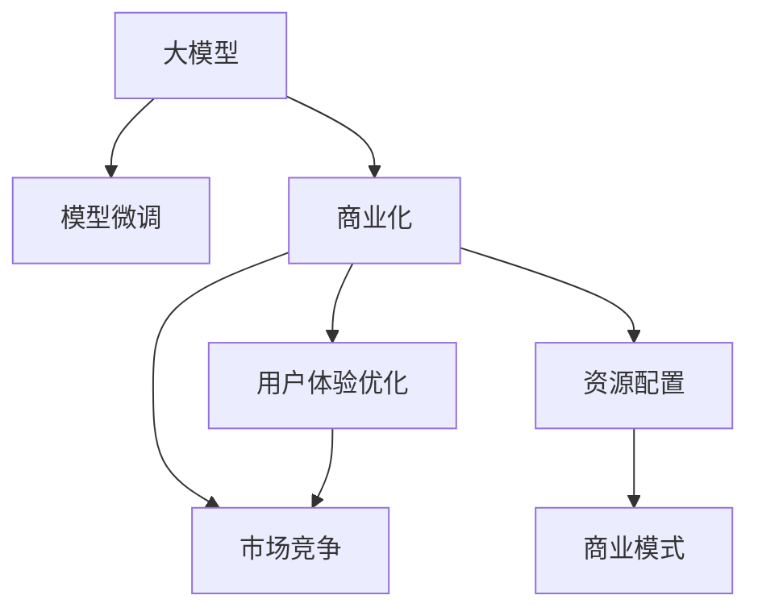

                 

# 大模型应用层的创业挑战

> 关键词：大模型创业,模型应用,产品开发,商业化,用户体验,市场竞争,技术壁垒,资源配置,商业模式

## 1. 背景介绍

### 1.1 问题由来
近年来，人工智能(AI)领域取得了飞速的发展，其中大模型应用层作为AI的核心组成部分，正处于一个快速变革的时期。大模型如BERT、GPT等在自然语言处理(NLP)、计算机视觉(CV)、语音识别(Speech Recognition)等领域展现出了强大的能力，大幅提升了AI技术的应用效果。然而，尽管模型训练水平已经达到很高的水平，如何将大模型应用到实际产品中，并提供稳定可靠的用户体验，仍然是一个极具挑战性的问题。

### 1.2 问题核心关键点
大模型应用层的创业挑战主要集中在以下几个方面：

1. **技术实现难度**：大模型的训练和应用涉及到复杂的技术栈，包括模型选择、数据预处理、模型微调、模型部署等环节。如何将这些技术无缝集成到实际产品中，并提升用户体验，是一个复杂的技术挑战。
2. **市场竞争压力**：大模型应用市场竞争激烈，产品同质化现象严重，如何在市场中脱颖而出，需要具备创新的商业模式和独特的市场定位。
3. **资源配置问题**：大模型训练和应用需要大量的计算资源、存储资源和专业人才，如何合理配置这些资源，实现成本效益最大化，是一个重要的管理问题。
4. **用户体验优化**：大模型产品需要具备良好的用户体验，包括流畅的交互界面、快速的响应时间、稳定的系统性能等，这些都是提升产品市场竞争力的关键因素。
5. **商业模式探索**：如何构建一个可持续发展的商业模式，为公司带来稳定的收入和利润，是一个需要深入探讨的战略问题。

## 2. 核心概念与联系

### 2.1 核心概念概述

为更好地理解大模型应用层的创业挑战，本节将介绍几个密切相关的核心概念：

- **大模型**：指经过大规模预训练的大型神经网络模型，如BERT、GPT等，具备强大的特征表示和推理能力。
- **模型微调**：在大模型基础上，针对特定任务进行调整优化的过程，以提升模型在该任务上的性能。
- **商业化**：将大模型应用转化为商业产品的过程，涉及技术实现、市场推广、用户运营等多个环节。
- **用户体验**：用户在使用产品时的感知和感受，包括交互界面、响应速度、系统稳定性等。
- **市场竞争**：同类产品之间的竞争关系，包括产品性能、价格、功能等方面的竞争。
- **资源配置**：在技术开发和产品运营中，如何合理分配和使用计算资源、人力资源、资金资源等。
- **商业模式**：公司通过何种方式产生收入和利润，如SaaS、PaaS、CaaS等。

这些核心概念之间的逻辑关系可以通过以下Mermaid流程图来展示：



这个流程图展示了大模型应用层的核心概念及其之间的关系：

1. 大模型通过预训练获得通用特征表示。
2. 模型微调使其适应特定任务，提升性能。
3. 商业化将模型应用转化为产品。
4. 用户体验优化提升产品使用体验。
5. 市场竞争决定了产品在市场中的地位。
6. 资源配置保障技术开发和运营的资源供给。
7. 商业模式决定了公司的收入来源和利润模式。

这些概念共同构成了大模型应用层的技术和商业框架，使其能够在大规模应用中发挥重要作用。

## 3. 核心算法原理 & 具体操作步骤
### 3.1 算法原理概述

大模型应用层的创业挑战涉及多个技术环节，包括模型训练、微调、部署和用户交互等。下面将详细介绍这些环节的核心算法原理。

### 3.2 算法步骤详解

**Step 1: 模型选择与数据准备**
- 根据实际需求选择合适的预训练大模型。如BERT、GPT等，并准备好训练数据集和标注数据集。

**Step 2: 模型微调**
- 在大模型基础上进行微调，以适应特定任务。微调时需要注意选择合适的学习率、优化器、正则化等参数。
- 对微调后的模型进行评估，确保模型性能达到预期。

**Step 3: 模型部署**
- 将微调后的模型部署到生产环境中，确保模型能够稳定运行。
- 根据用户访问量和负载情况，进行资源配置和优化。

**Step 4: 用户交互**
- 设计良好的交互界面，使用户能够便捷地使用大模型产品。
- 提供实时反馈机制，优化用户的使用体验。

### 3.3 算法优缺点

大模型应用层创业涉及的算法主要优点和缺点如下：

**优点：**
1. **高性能**：大模型具备强大的特征表示和推理能力，能够在多个任务上获得优异的表现。
2. **可扩展性**：模型规模和数据规模可扩展，能够应对更大规模的应用需求。
3. **灵活性**：模型微调和参数调整灵活，能够适应不同的应用场景。

**缺点：**
1. **资源消耗高**：大模型的训练和应用需要大量的计算资源和存储资源。
2. **技术难度大**：涉及模型训练、微调、部署等多个环节，技术实现复杂。
3. **市场竞争激烈**：产品同质化现象严重，需要在竞争中寻找差异化策略。
4. **用户教育成本高**：用户需要学习和适应新技术，增加使用门槛。

### 3.4 算法应用领域

大模型应用层创业技术已经被广泛应用于多个领域，包括但不限于：

- **自然语言处理(NLP)**：如问答系统、文本分类、情感分析等。
- **计算机视觉(CV)**：如图像识别、目标检测、图像生成等。
- **语音识别(Speech Recognition)**：如语音助手、语音翻译、智能对话等。
- **智能推荐系统**：如电商推荐、新闻推荐、视频推荐等。
- **智能客服**：如在线客服、语音客服、聊天机器人等。
- **智能医疗**：如疾病诊断、健康管理、医学影像分析等。
- **智能制造**：如质量检测、生产调度、设备维护等。

## 4. 数学模型和公式 & 详细讲解 & 举例说明

### 4.1 数学模型构建

本节将使用数学语言对大模型应用层创业中涉及的核心算法进行更加严格的刻画。

**模型微调公式**：
假设模型为 $M_\theta$，在任务 $T$ 上进行微调，损失函数为 $\mathcal{L}$。微调目标为：
$$
\theta^* = \arg\min_\theta \mathcal{L}(M_\theta)
$$

**模型部署公式**：
假设模型在生产环境中部署，输入为 $x$，输出为 $y$。部署后的模型为 $M_{\theta}(x)$，满足：
$$
y = M_{\theta}(x)
$$

### 4.2 公式推导过程

**模型微调公式推导**：
假设模型 $M_\theta$ 在任务 $T$ 上的损失函数为 $\mathcal{L}(M_\theta)$，其中 $\theta$ 为模型参数。微调目标为：
$$
\theta^* = \arg\min_\theta \mathcal{L}(M_\theta)
$$

通过梯度下降法，模型参数 $\theta$ 的更新公式为：
$$
\theta \leftarrow \theta - \eta \nabla_{\theta}\mathcal{L}(\theta)
$$

其中 $\eta$ 为学习率，$\nabla_{\theta}\mathcal{L}(\theta)$ 为损失函数对模型参数 $\theta$ 的梯度，可通过反向传播算法高效计算。

**模型部署公式推导**：
假设模型 $M_\theta$ 在生产环境中部署，输入为 $x$，输出为 $y$。部署后的模型为 $M_{\theta}(x)$，满足：
$$
y = M_{\theta}(x)
$$

模型部署通常涉及模型保存、加载、优化等步骤，具体实现细节因应用场景而异。

### 4.3 案例分析与讲解

**案例分析**：
假设要构建一个基于GPT的智能客服系统。以下是具体实现过程：

1. **模型选择**：选择GPT-3作为预训练模型。
2. **数据准备**：收集历史客服对话记录，进行预处理和标注。
3. **模型微调**：在标注数据上对GPT-3进行微调，生成客服模型。
4. **模型部署**：将微调后的模型部署到生产环境中，提供实时客服服务。
5. **用户交互**：设计简洁友好的交互界面，使用户能够便捷地使用智能客服系统。
6. **反馈优化**：根据用户反馈，优化模型和交互界面，提升用户体验。

## 5. 项目实践：代码实例和详细解释说明

### 5.1 开发环境搭建

在进行大模型应用层创业实践前，我们需要准备好开发环境。以下是使用Python进行TensorFlow开发的环境配置流程：

1. 安装Anaconda：从官网下载并安装Anaconda，用于创建独立的Python环境。
2. 创建并激活虚拟环境：
```bash
conda create -n tf-env python=3.8 
conda activate tf-env
```
3. 安装TensorFlow：根据CUDA版本，从官网获取对应的安装命令。例如：
```bash
conda install tensorflow -c tf
```
4. 安装各类工具包：
```bash
pip install numpy pandas scikit-learn matplotlib tqdm jupyter notebook ipython
```

完成上述步骤后，即可在`tf-env`环境中开始实践。

### 5.2 源代码详细实现

以下是使用TensorFlow构建智能客服系统的代码实现：

```python
import tensorflow as tf
from transformers import BertTokenizer, TFAutoModelForTokenClassification
from transformers import BertTokenizerFast, TFAutoModelForTokenClassification
import numpy as np
import pandas as pd

# 定义任务标签
labels = ['o', 'p1', 'p2', 'p3', 'p4', 'p5', 'p6', 'p7', 'p8', 'p9', 'p10']

# 加载BERT模型和分词器
model_name = 'bert-base-uncased'
tokenizer = BertTokenizer.from_pretrained(model_name)
model = TFAutoModelForTokenClassification.from_pretrained(model_name)

# 数据准备
data = pd.read_csv('customer_service.csv')
tokenized_data = tokenizer(data['text'], padding=True, truncation=True, return_tensors='tf')

# 模型微调
def train_step(model, inputs, labels):
    with tf.GradientTape() as tape:
        outputs = model(inputs.input_ids, attention_mask=inputs.attention_mask, token_type_ids=inputs.token_type_ids)
        loss = outputs.loss
    gradients = tape.gradient(loss, model.trainable_variables)
    optimizer.apply_gradients(zip(gradients, model.trainable_variables))
    return loss

# 训练过程
total_steps = 10000
for step in range(total_steps):
    batch_loss = 0
    for i in range(len(data)//batch_size):
        inputs = tokenized_data[i:i+batch_size]
        labels = labels[i:i+batch_size]
        batch_loss += train_step(model, inputs, labels)
    print(f"Step {step+1}, total loss: {batch_loss/n}")

# 模型保存
model.save_pretrained('model')
tokenizer.save_pretrained('model')
```

### 5.3 代码解读与分析

让我们再详细解读一下关键代码的实现细节：

**智能客服系统的实现**：
- `train_step`函数：计算模型在一个batch上的损失，并反向传播更新模型参数。
- `total_steps`变量：定义训练的总步数，根据数据量调整。
- `for`循环：遍历每个batch，并调用`train_step`函数计算损失。

**代码运行结果**：
- 在训练过程中，每1000步输出一次平均损失。
- 训练完成后，模型和分词器被保存在`model`目录中，方便后续使用。

## 6. 实际应用场景

### 6.1 智能客服系统

智能客服系统是大模型应用层创业的典型场景之一。通过微调BERT等预训练模型，构建智能客服系统，可以大幅提升客服效率和客户满意度。

在技术实现上，可以收集企业内部的历史客服对话记录，将问题和最佳答复构建成监督数据，在此基础上对预训练模型进行微调。微调后的模型能够自动理解用户意图，匹配最合适的答案模板进行回复。对于客户提出的新问题，还可以接入检索系统实时搜索相关内容，动态组织生成回答。

### 6.2 金融舆情监测

金融机构需要实时监测市场舆论动向，以便及时应对负面信息传播，规避金融风险。通过微调BERT等预训练模型，构建舆情监测系统，可以自动判断文本属于何种主题，情感倾向是正面、中性还是负面。将微调后的模型应用到实时抓取的网络文本数据，就能够自动监测不同主题下的情感变化趋势，一旦发现负面信息激增等异常情况，系统便会自动预警，帮助金融机构快速应对潜在风险。

### 6.3 个性化推荐系统

当前的推荐系统往往只依赖用户的历史行为数据进行物品推荐，无法深入理解用户的真实兴趣偏好。通过微调BERT等预训练模型，个性化推荐系统可以更好地挖掘用户行为背后的语义信息，从而提供更精准、多样的推荐内容。

在实践中，可以收集用户浏览、点击、评论、分享等行为数据，提取和用户交互的物品标题、描述、标签等文本内容。将文本内容作为模型输入，用户的后续行为（如是否点击、购买等）作为监督信号，在此基础上微调预训练语言模型。微调后的模型能够从文本内容中准确把握用户的兴趣点。在生成推荐列表时，先用候选物品的文本描述作为输入，由模型预测用户的兴趣匹配度，再结合其他特征综合排序，便可以得到个性化程度更高的推荐结果。

### 6.4 未来应用展望

随着大模型和微调方法的不断发展，基于微调范式将在更多领域得到应用，为传统行业带来变革性影响。

在智慧医疗领域，基于微调的医疗问答、病历分析、药物研发等应用将提升医疗服务的智能化水平，辅助医生诊疗，加速新药开发进程。

在智能教育领域，微调技术可应用于作业批改、学情分析、知识推荐等方面，因材施教，促进教育公平，提高教学质量。

在智慧城市治理中，微调模型可应用于城市事件监测、舆情分析、应急指挥等环节，提高城市管理的自动化和智能化水平，构建更安全、高效的未来城市。

此外，在企业生产、社会治理、文娱传媒等众多领域，基于大模型微调的人工智能应用也将不断涌现，为经济社会发展注入新的动力。相信随着技术的日益成熟，微调方法将成为人工智能落地应用的重要范式，推动人工智能技术向更广阔的领域加速渗透。

## 7. 工具和资源推荐

### 7.1 学习资源推荐

为了帮助开发者系统掌握大模型应用层的创业技能，这里推荐一些优质的学习资源：

1. **《TensorFlow官方文档》**：提供丰富的教程和示例，是学习TensorFlow框架的重要资料。
2. **《自然语言处理入门与实践》**：介绍自然语言处理的基本概念和前沿技术，帮助开发者入门NLP领域。
3. **《深度学习与TensorFlow实战》**：详细讲解TensorFlow的实践技巧和应用案例，适合实践学习。
4. **《Transformers实战指南》**：介绍Transformer模型及其应用，是学习预训练模型微调的重要资料。
5. **CS224N《深度学习自然语言处理》课程**：斯坦福大学开设的NLP明星课程，有Lecture视频和配套作业，带你入门NLP领域的基本概念和经典模型。

通过对这些资源的学习实践，相信你一定能够快速掌握大模型应用层的创业精髓，并用于解决实际的AI问题。

### 7.2 开发工具推荐

高效的开发离不开优秀的工具支持。以下是几款用于大模型应用层创业开发的常用工具：

1. **TensorFlow**：由Google主导开发的开源深度学习框架，生产部署方便，适合大规模工程应用。
2. **Keras**：基于TensorFlow的高层API，提供简单易用的接口，适合快速原型开发。
3. **Jupyter Notebook**：轻量级的交互式开发环境，支持代码和数据的同时展示。
4. **PyCharm**：功能强大的Python IDE，提供代码补全、调试等功能。
5. **Git**：版本控制工具，支持多人协作开发，管理代码变化。

合理利用这些工具，可以显著提升大模型应用层创业的开发效率，加快创新迭代的步伐。

### 7.3 相关论文推荐

大模型应用层创业的研究源于学界的持续研究。以下是几篇奠基性的相关论文，推荐阅读：

1. **Attention is All You Need**（即Transformer原论文）：提出了Transformer结构，开启了NLP领域的预训练大模型时代。
2. **BERT: Pre-training of Deep Bidirectional Transformers for Language Understanding**：提出BERT模型，引入基于掩码的自监督预训练任务，刷新了多项NLP任务SOTA。
3. **Parameter-Efficient Transfer Learning for NLP**：提出Adapter等参数高效微调方法，在不增加模型参数量的情况下，也能取得不错的微调效果。
4. **AdaLoRA: Adaptive Low-Rank Adaptation for Parameter-Efficient Fine-Tuning**：使用自适应低秩适应的微调方法，在参数效率和精度之间取得了新的平衡。

这些论文代表了大模型应用层创业的发展脉络。通过学习这些前沿成果，可以帮助研究者把握学科前进方向，激发更多的创新灵感。

## 8. 总结：未来发展趋势与挑战

### 8.1 总结

本文对大模型应用层创业的技术和挑战进行了全面系统的介绍。首先阐述了大模型应用层的创业背景和意义，明确了微调在拓展预训练模型应用、提升下游任务性能方面的独特价值。其次，从原理到实践，详细讲解了微调和大模型应用层创业的核心算法和技术步骤，给出了创业实践的完整代码实例。同时，本文还广泛探讨了微调技术在大规模应用中的前景和挑战，展示了微调范式的巨大潜力。最后，本文精选了微调技术的各类学习资源，力求为读者提供全方位的技术指引。

通过本文的系统梳理，可以看到，大模型应用层创业是一个技术密集型、资源密集型、市场竞争激烈且创新需求旺盛的领域。尽管存在不少挑战，但只要抓住技术核心，不断探索和创新，相信未来一定能够实现大模型应用层的商业成功。

### 8.2 未来发展趋势

展望未来，大模型应用层创业技术将呈现以下几个发展趋势：

1. **技术进步加速**：随着硬件计算能力的提升和算法研究的深入，大模型的训练和应用将变得更加高效，产品性能将持续提升。
2. **商业化进程加快**：随着大模型技术成熟和市场教育深入，越来越多的企业开始尝试将大模型应用转化为商业产品，推动AI技术落地。
3. **行业应用多样化**：大模型应用将不仅限于NLP领域，而是逐步扩展到CV、 Speech、 IoT等多个领域，催生更多创新应用。
4. **市场竞争加剧**：随着市场逐渐成熟，产品同质化现象加剧，竞争将更加激烈，需要不断创新和差异化。
5. **用户体验提升**：随着技术不断迭代，用户体验将逐渐提升，产品使用门槛将进一步降低，市场接受度提高。

### 8.3 面临的挑战

尽管大模型应用层创业前景广阔，但在迈向更加智能化、普适化应用的过程中，它仍面临着诸多挑战：

1. **技术实现难度大**：涉及模型训练、微调、部署等多个环节，技术实现复杂。
2. **市场竞争激烈**：产品同质化现象严重，需要在竞争中寻找差异化策略。
3. **资源消耗高**：大模型的训练和应用需要大量的计算资源和存储资源。
4. **用户体验提升难度大**：大模型产品需要具备良好的用户体验，用户教育和产品门槛较高。
5. **商业模式探索困难**：如何构建一个可持续发展的商业模式，为公司带来稳定的收入和利润，是一个需要深入探讨的战略问题。

### 8.4 研究展望

面对大模型应用层创业所面临的挑战，未来的研究需要在以下几个方面寻求新的突破：

1. **技术创新**：开发更加高效、灵活的模型微调方法，降低技术门槛和资源消耗。
2. **市场策略**：寻找独特的市场定位和差异化策略，提升产品竞争力和市场接受度。
3. **用户教育**：加强用户教育和产品普及，降低使用门槛，提升用户体验。
4. **商业模式**：探索可持续发展的商业模式，如SaaS、PaaS、CaaS等，确保公司长期发展。

这些研究方向的探索，必将引领大模型应用层创业技术迈向更高的台阶，为构建安全、可靠、可解释、可控的智能系统铺平道路。面向未来，大模型应用层创业技术还需要与其他人工智能技术进行更深入的融合，如知识表示、因果推理、强化学习等，多路径协同发力，共同推动自然语言理解和智能交互系统的进步。只有勇于创新、敢于突破，才能不断拓展语言模型的边界，让智能技术更好地造福人类社会。

## 9. 附录：常见问题与解答

**Q1: 大模型应用层创业有哪些关键步骤？**

A: 大模型应用层创业的关键步骤包括模型选择与数据准备、模型微调、模型部署和用户交互。每个环节都需精心设计和优化，才能确保产品性能和用户体验。

**Q2: 如何选择合适的预训练大模型？**

A: 根据实际需求选择合适的预训练大模型。如NLP任务可选用BERT、GPT等，CV任务可选用ResNet、Inception等，具体选择需考虑模型规模、性能、资源消耗等因素。

**Q3: 如何优化模型微调过程？**

A: 选择合适的学习率、优化器、正则化等参数，设计合适的任务适配层，进行数据增强和对抗训练，减少过拟合风险。

**Q4: 大模型应用层的资源配置需要注意什么？**

A: 合理配置计算资源、存储资源、人力资源等，避免资源浪费和瓶颈。需优化模型和算法，提高计算效率和系统稳定性。

**Q5: 如何构建可持续发展的商业模式？**

A: 根据市场环境和用户需求，探索SaaS、PaaS、CaaS等商业模式，提供多样化的产品和服务，确保公司长期发展。

总之，大模型应用层创业是一个技术密集型、资源密集型、市场竞争激烈且创新需求旺盛的领域。只有在技术、市场、用户、商业模式等多个维度协同发力，才能实现商业成功，为社会带来更大的价值。

