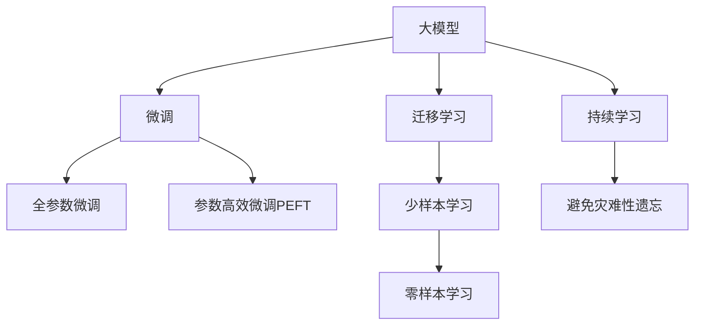

                 

## 1. 背景介绍

### 1.1 问题由来
随着人工智能技术的快速发展，尤其是大模型的崛起，越来越多的创业者看到了在人工智能领域实现突破和创新的机会。然而，与技术挑战并存的，是商业化道路上的重重难关。如何在复杂多变的市场环境中，保持乐观、进取与坚韧的心态，不断突破自我，是所有创业者需要深思的问题。

### 1.2 问题核心关键点
大模型时代的创业者面临的核心挑战包括：
- **技术突破与商业落地**：如何将前沿的技术转化为商业价值，真正解决用户需求。
- **市场竞争与策略布局**：在激烈的市场竞争中，如何制定有效的竞争策略，占领市场先机。
- **团队管理与人才建设**：如何组建和管理一支高效、创新的技术团队，持续吸引和留住优秀人才。
- **产品迭代与用户体验**：如何快速迭代产品，提升用户体验，增强市场竞争力。
- **品牌建设与客户关系**：如何打造具有竞争力的品牌，构建稳定的客户关系，实现长期发展。

这些关键点构成了大模型时代创业者在技术创新和市场竞争中需要应对的核心问题，也正是本文将重点讨论的内容。

## 2. 核心概念与联系

### 2.1 核心概念概述

大模型时代的创业者需要理解的核心概念包括：

- **大模型（Large Model）**：指基于大规模深度学习模型的技术，如Transformer、BERT等，具有强大的学习和推理能力。
- **微调（Fine-Tuning）**：通过小规模数据集对大模型进行优化，使其适应特定任务，提高模型在特定领域的表现。
- **迁移学习（Transfer Learning）**：利用已有模型在特定领域的知识，快速在新任务上取得较好的性能。
- **参数高效微调（Parameter-Efficient Fine-Tuning, PEFT）**：在不增加模型参数量的情况下，优化模型性能，减少资源消耗。
- **持续学习（Continual Learning）**：模型能够不断从新数据中学习，避免遗忘已有知识，保持长期性能。

这些概念之间的联系可通过以下Mermaid流程图来展示：



这个流程图展示了不同微调方法之间的联系，以及这些方法在大模型应用中的普遍性。

## 3. 核心算法原理 & 具体操作步骤
### 3.1 算法原理概述

大模型时代的创业者在技术上需要理解和应用的核心算法原理包括：

- **监督学习（Supervised Learning）**：通过标注数据，训练模型预测新数据。
- **迁移学习**：利用已有模型在新任务上取得更好的性能。
- **微调**：通过小规模数据集，对大模型进行优化，提高特定任务的表现。
- **参数高效微调**：在不增加模型参数量的情况下，优化模型性能。
- **持续学习**：模型能够不断从新数据中学习，避免遗忘已有知识。

### 3.2 算法步骤详解

创业者需要理解和操作的核心算法步骤包括：

1. **数据准备**：收集和标注数据，准备用于模型微调的训练集、验证集和测试集。
2. **模型加载**：选择合适的预训练模型，如BERT、GPT等，将其加载到系统中。
3. **模型微调**：根据具体任务，选择微调方法（全参数微调、参数高效微调、迁移学习等），调整模型参数以适应特定任务。
4. **性能评估**：在验证集和测试集上评估模型性能，确保模型在新数据上的泛化能力。
5. **部署上线**：将微调后的模型部署到生产环境中，进行实时推理。

### 3.3 算法优缺点

大模型微调具有以下优点：
- **快速迭代**：利用已有的大模型，可以快速在小规模数据集上取得较好的性能提升。
- **资源利用**：微调方法可以避免从头训练，节省计算资源和训练时间。
- **泛化能力**：通过迁移学习，模型能够更好地适应不同领域和任务。

但同时也存在以下缺点：
- **数据依赖**：微调的性能很大程度上依赖于标注数据的质量和数量。
- **模型复杂性**：大模型通常包含大量参数，对硬件资源要求较高。
- **过拟合风险**：小规模数据集可能使模型过拟合，影响模型泛化性能。

### 3.4 算法应用领域

大模型微调在众多领域得到了广泛应用，如：

- **自然语言处理（NLP）**：微调BERT、GPT等模型进行文本分类、情感分析、机器翻译等任务。
- **计算机视觉（CV）**：微调ResNet、VGG等模型进行图像分类、目标检测、图像生成等任务。
- **语音识别（ASR）**：微调Wav2Vec等模型进行语音识别、语音合成等任务。
- **推荐系统**：微调神经协同过滤等模型进行个性化推荐、商品推荐等任务。

## 4. 数学模型和公式 & 详细讲解  
### 4.1 数学模型构建

大模型微调的核心数学模型包括：

- **损失函数**：如交叉熵损失、均方误差损失等，用于衡量模型预测与真实标签之间的差异。
- **优化器**：如SGD、Adam等，用于更新模型参数以最小化损失函数。
- **正则化**：如L2正则、Dropout等，防止过拟合。

### 4.2 公式推导过程

以二分类任务为例，公式推导过程如下：

设模型 $M_{\theta}$ 在输入 $x$ 上的输出为 $\hat{y}=M_{\theta}(x)$，表示样本属于正类的概率。真实标签 $y \in \{0,1\}$。则二分类交叉熵损失函数定义为：

$$
\ell(M_{\theta}(x),y) = -[y\log \hat{y} + (1-y)\log (1-\hat{y})]
$$

将其代入经验风险公式，得：

$$
\mathcal{L}(\theta) = -\frac{1}{N}\sum_{i=1}^N [y_i\log M_{\theta}(x_i)+(1-y_i)\log(1-M_{\theta}(x_i))]
$$

根据链式法则，损失函数对参数 $\theta_k$ 的梯度为：

$$
\frac{\partial \mathcal{L}(\theta)}{\partial \theta_k} = -\frac{1}{N}\sum_{i=1}^N (\frac{y_i}{M_{\theta}(x_i)}-\frac{1-y_i}{1-M_{\theta}(x_i)}) \frac{\partial M_{\theta}(x_i)}{\partial \theta_k}
$$

在得到损失函数的梯度后，即可带入参数更新公式，完成模型的迭代优化。

### 4.3 案例分析与讲解

以下是一个具体的案例：

假设一个电商网站的推荐系统，使用微调后的神经协同过滤模型进行推荐。具体步骤如下：

1. **数据准备**：收集用户浏览、点击、购买等行为数据，提取物品描述、价格、类别等特征，标注用户的兴趣标签。
2. **模型加载**：加载预训练的神经协同过滤模型，如BiLSTM+DNN等。
3. **模型微调**：使用标注数据，调整模型参数以适应推荐任务。
4. **性能评估**：在验证集上评估模型的推荐效果，如召回率、准确率等指标。
5. **部署上线**：将微调后的模型部署到生产环境中，实时进行物品推荐。

## 5. 项目实践：代码实例和详细解释说明
### 5.1 开发环境搭建

进行大模型微调项目的开发，需要配置好开发环境。以下是Python环境搭建的步骤：

1. **安装Python**：从官网下载并安装Python，建议使用3.8及以上版本。
2. **安装Anaconda**：从官网下载并安装Anaconda，用于创建独立的Python环境。
3. **创建虚拟环境**：
```bash
conda create -n model-tuning python=3.8 
conda activate model-tuning
```
4. **安装必要的工具包**：
```bash
pip install torch torchvision torchaudio transformers sklearn pandas numpy matplotlib
```

### 5.2 源代码详细实现

以电商推荐系统为例，下面是一个使用PyTorch和Transformers库进行微调的代码实现：

```python
import torch
from transformers import BertForTokenClassification, AdamW
from torch.utils.data import DataLoader
from sklearn.metrics import precision_recall_fscore_support

# 定义模型
model = BertForTokenClassification.from_pretrained('bert-base-cased')

# 定义优化器
optimizer = AdamW(model.parameters(), lr=2e-5)

# 定义数据集
train_dataset = ...
val_dataset = ...

# 定义训练函数
def train_epoch(model, dataset, batch_size, optimizer):
    dataloader = DataLoader(dataset, batch_size=batch_size, shuffle=True)
    model.train()
    epoch_loss = 0
    for batch in dataloader:
        input_ids = batch['input_ids'].to(device)
        attention_mask = batch['attention_mask'].to(device)
        labels = batch['labels'].to(device)
        model.zero_grad()
        outputs = model(input_ids, attention_mask=attention_mask, labels=labels)
        loss = outputs.loss
        epoch_loss += loss.item()
        loss.backward()
        optimizer.step()
    return epoch_loss / len(dataloader)

# 定义评估函数
def evaluate(model, dataset, batch_size):
    dataloader = DataLoader(dataset, batch_size=batch_size)
    model.eval()
    preds, labels = [], []
    with torch.no_grad():
        for batch in dataloader:
            input_ids = batch['input_ids'].to(device)
            attention_mask = batch['attention_mask'].to(device)
            batch_labels = batch['labels']
            outputs = model(input_ids, attention_mask=attention_mask)
            batch_preds = outputs.logits.argmax(dim=2).to('cpu').tolist()
            batch_labels = batch_labels.to('cpu').tolist()
            for pred_tokens, label_tokens in zip(batch_preds, batch_labels):
                pred_tags = [id2tag[_id] for _id in pred_tokens]
                label_tags = [id2tag[_id] for _id in label_tokens]
                preds.append(pred_tags[:len(label_tags)])
                labels.append(label_tags)
    precision, recall, f1, _ = precision_recall_fscore_support(labels, preds, average='micro')
    return precision, recall, f1

# 训练模型
device = torch.device('cuda') if torch.cuda.is_available() else torch.device('cpu')
model.to(device)

for epoch in range(5):
    loss = train_epoch(model, train_dataset, batch_size=16, optimizer=optimizer)
    print(f'Epoch {epoch+1}, train loss: {loss:.3f}')
    
    precision, recall, f1 = evaluate(model, val_dataset, batch_size=16)
    print(f'Epoch {epoch+1}, dev results: precision={precision:.2f}, recall={recall:.2f}, f1={f1:.2f}')

print('Test results:')
precision, recall, f1 = evaluate(model, test_dataset, batch_size=16)
print(f'Test precision={precision:.2f}, recall={recall:.2f}, f1={f1:.2f}')
```

### 5.3 代码解读与分析

- **数据处理**：定义了数据集类 `NERDataset`，处理文本和标签数据，并进行定长padding。
- **模型定义**：使用 `BertForTokenClassification` 类定义模型，并加载预训练模型。
- **优化器定义**：使用 `AdamW` 优化器进行模型参数优化。
- **训练函数**：定义 `train_epoch` 函数，进行模型训练和损失计算。
- **评估函数**：定义 `evaluate` 函数，进行模型评估和指标计算。
- **模型训练和评估**：在 `for` 循环中，进行多轮模型训练和评估，并在测试集上输出最终结果。

## 6. 实际应用场景
### 6.1 智能客服系统

智能客服系统可以充分利用大模型微调技术，提供7x24小时不间断服务，快速响应客户咨询，用自然流畅的语言解答各类常见问题。具体应用场景如下：

1. **数据收集**：收集企业内部的历史客服对话记录，将问题和最佳答复构建成监督数据。
2. **模型微调**：使用BERT、GPT等预训练模型，对客服对话进行微调，使其能够理解用户意图，匹配最合适的答案模板。
3. **实时对话**：将微调后的模型部署到生产环境中，实时处理客户的对话请求，生成智能回复。

### 6.2 金融舆情监测

金融舆情监测可以通过大模型微调技术，实时监测市场舆论动向，规避金融风险。具体应用场景如下：

1. **数据收集**：收集金融领域相关的新闻、报道、评论等文本数据，并对其进行主题标注和情感标注。
2. **模型微调**：使用BERT、GPT等预训练模型，对文本进行微调，使其能够自动判断文本属于何种主题，情感倾向是正面、中性还是负面。
3. **风险预警**：将微调后的模型应用于实时抓取的网络文本数据，自动监测不同主题下的情感变化趋势，一旦发现负面信息激增等异常情况，系统便会自动预警，帮助金融机构快速应对潜在风险。

### 6.3 个性化推荐系统

个性化推荐系统可以充分利用大模型微调技术，提供精准的个性化推荐内容。具体应用场景如下：

1. **数据收集**：收集用户浏览、点击、评论、分享等行为数据，提取和用户交互的物品标题、描述、标签等文本内容。
2. **模型微调**：使用BERT、GPT等预训练模型，对用户行为数据进行微调，使其能够从文本内容中准确把握用户的兴趣点。
3. **推荐生成**：在生成推荐列表时，先用候选物品的文本描述作为输入，由模型预测用户的兴趣匹配度，再结合其他特征综合排序，便可以得到个性化程度更高的推荐结果。

### 6.4 未来应用展望

随着大模型和微调方法的不断发展，基于微调范式将在更多领域得到应用，为传统行业带来变革性影响。未来，大模型微调技术将呈现以下几个发展趋势：

1. **模型规模持续增大**：随着算力成本的下降和数据规模的扩张，预训练语言模型的参数量还将持续增长。超大规模语言模型蕴含的丰富语言知识，有望支撑更加复杂多变的下游任务微调。
2. **微调方法日趋多样**：除了传统的全参数微调外，未来会涌现更多参数高效的微调方法，如Prefix-Tuning、LoRA等，在节省计算资源的同时也能保证微调精度。
3. **持续学习成为常态**：随着数据分布的不断变化，微调模型也需要持续学习新知识以保持性能。如何在不遗忘原有知识的同时，高效吸收新样本信息，将成为重要的研究课题。
4. **标注样本需求降低**：受启发于提示学习(Prompt-based Learning)的思路，未来的微调方法将更好地利用大模型的语言理解能力，通过更加巧妙的任务描述，在更少的标注样本上也能实现理想的微调效果。
5. **多模态微调崛起**：当前的微调主要聚焦于纯文本数据，未来会进一步拓展到图像、视频、语音等多模态数据微调。多模态信息的融合，将显著提升语言模型对现实世界的理解和建模能力。
6. **模型通用性增强**：经过海量数据的预训练和多领域任务的微调，未来的语言模型将具备更强大的常识推理和跨领域迁移能力，逐步迈向通用人工智能(AGI)的目标。

## 7. 工具和资源推荐
### 7.1 学习资源推荐

为了帮助创业者系统掌握大模型微调的理论基础和实践技巧，这里推荐一些优质的学习资源：

1. **《Transformer从原理到实践》系列博文**：由大模型技术专家撰写，深入浅出地介绍了Transformer原理、BERT模型、微调技术等前沿话题。
2. **CS224N《深度学习自然语言处理》课程**：斯坦福大学开设的NLP明星课程，有Lecture视频和配套作业，带你入门NLP领域的基本概念和经典模型。
3. **《Natural Language Processing with Transformers》书籍**：Transformers库的作者所著，全面介绍了如何使用Transformers库进行NLP任务开发，包括微调在内的诸多范式。
4. **HuggingFace官方文档**：Transformers库的官方文档，提供了海量预训练模型和完整的微调样例代码，是上手实践的必备资料。
5. **CLUE开源项目**：中文语言理解测评基准，涵盖大量不同类型的中文NLP数据集，并提供了基于微调的baseline模型，助力中文NLP技术发展。

### 7.2 开发工具推荐

高效的开发离不开优秀的工具支持。以下是几款用于大模型微调开发的常用工具：

1. **PyTorch**：基于Python的开源深度学习框架，灵活动态的计算图，适合快速迭代研究。大部分预训练语言模型都有PyTorch版本的实现。
2. **TensorFlow**：由Google主导开发的开源深度学习框架，生产部署方便，适合大规模工程应用。同样有丰富的预训练语言模型资源。
3. **Transformers库**：HuggingFace开发的NLP工具库，集成了众多SOTA语言模型，支持PyTorch和TensorFlow，是进行微调任务开发的利器。
4. **Weights & Biases**：模型训练的实验跟踪工具，可以记录和可视化模型训练过程中的各项指标，方便对比和调优。与主流深度学习框架无缝集成。
5. **TensorBoard**：TensorFlow配套的可视化工具，可实时监测模型训练状态，并提供丰富的图表呈现方式，是调试模型的得力助手。
6. **Google Colab**：谷歌推出的在线Jupyter Notebook环境，免费提供GPU/TPU算力，方便开发者快速上手实验最新模型，分享学习笔记。

合理利用这些工具，可以显著提升大模型微调任务的开发效率，加快创新迭代的步伐。

### 7.3 相关论文推荐

大语言模型和微调技术的发展源于学界的持续研究。以下是几篇奠基性的相关论文，推荐阅读：

1. **Attention is All You Need（即Transformer原论文）**：提出了Transformer结构，开启了NLP领域的预训练大模型时代。
2. **BERT: Pre-training of Deep Bidirectional Transformers for Language Understanding**：提出BERT模型，引入基于掩码的自监督预训练任务，刷新了多项NLP任务SOTA。
3. **Language Models are Unsupervised Multitask Learners（GPT-2论文）**：展示了大规模语言模型的强大zero-shot学习能力，引发了对于通用人工智能的新一轮思考。
4. **Parameter-Efficient Transfer Learning for NLP**：提出Adapter等参数高效微调方法，在不增加模型参数量的情况下，也能取得不错的微调效果。
5. **Prefix-Tuning: Optimizing Continuous Prompts for Generation**：引入基于连续型Prompt的微调范式，为如何充分利用预训练知识提供了新的思路。
6. **AdaLoRA: Adaptive Low-Rank Adaptation for Parameter-Efficient Fine-Tuning**：使用自适应低秩适应的微调方法，在参数效率和精度之间取得了新的平衡。

这些论文代表了大语言模型微调技术的发展脉络。通过学习这些前沿成果，可以帮助研究者把握学科前进方向，激发更多的创新灵感。

## 8. 总结：未来发展趋势与挑战
### 8.1 总结

本文对大模型时代的创业者创业心态进行了全面系统的介绍。首先阐述了创业者在大模型微调中所面临的核心挑战，明确了技术突破与商业落地、市场竞争与策略布局、团队管理与人才建设、产品迭代与用户体验、品牌建设与客户关系等关键问题。其次，从原理到实践，详细讲解了大模型微调的数学原理和关键步骤，给出了微调任务开发的完整代码实例。同时，本文还广泛探讨了微调方法在智能客服、金融舆情、个性化推荐等多个行业领域的应用前景，展示了微调范式的巨大潜力。

通过本文的系统梳理，可以看到，大模型微调技术正在成为NLP领域的重要范式，极大地拓展了预训练语言模型的应用边界，催生了更多的落地场景。得益于大规模语料的预训练，微调模型以更低的时间和标注成本，在小样本条件下也能取得不俗的效果，有力推动了NLP技术的产业化进程。未来，伴随预训练语言模型和微调方法的持续演进，相信NLP技术将在更广阔的应用领域大放异彩，深刻影响人类的生产生活方式。

### 8.2 未来发展趋势

展望未来，大模型微调技术将呈现以下几个发展趋势：

1. **模型规模持续增大**：随着算力成本的下降和数据规模的扩张，预训练语言模型的参数量还将持续增长。超大规模语言模型蕴含的丰富语言知识，有望支撑更加复杂多变的下游任务微调。
2. **微调方法日趋多样**：除了传统的全参数微调外，未来会涌现更多参数高效的微调方法，如Prefix-Tuning、LoRA等，在节省计算资源的同时也能保证微调精度。
3. **持续学习成为常态**：随着数据分布的不断变化，微调模型也需要持续学习新知识以保持性能。如何在不遗忘原有知识的同时，高效吸收新样本信息，将成为重要的研究课题。
4. **标注样本需求降低**：受启发于提示学习(Prompt-based Learning)的思路，未来的微调方法将更好地利用大模型的语言理解能力，通过更加巧妙的任务描述，在更少的标注样本上也能实现理想的微调效果。
5. **多模态微调崛起**：当前的微调主要聚焦于纯文本数据，未来会进一步拓展到图像、视频、语音等多模态数据微调。多模态信息的融合，将显著提升语言模型对现实世界的理解和建模能力。
6. **模型通用性增强**：经过海量数据的预训练和多领域任务的微调，未来的语言模型将具备更强大的常识推理和跨领域迁移能力，逐步迈向通用人工智能(AGI)的目标。

以上趋势凸显了大模型微调技术的广阔前景。这些方向的探索发展，必将进一步提升NLP系统的性能和应用范围，为人类认知智能的进化带来深远影响。

### 8.3 面临的挑战

尽管大模型微调技术已经取得了瞩目成就，但在迈向更加智能化、普适化应用的过程中，它仍面临着诸多挑战：

1. **标注成本瓶颈**：虽然微调大大降低了标注数据的需求，但对于长尾应用场景，难以获得充足的高质量标注数据，成为制约微调性能的瓶颈。如何进一步降低微调对标注样本的依赖，将是一大难题。
2. **模型鲁棒性不足**：当前微调模型面对域外数据时，泛化性能往往大打折扣。对于测试样本的微小扰动，微调模型的预测也容易发生波动。如何提高微调模型的鲁棒性，避免灾难性遗忘，还需要更多理论和实践的积累。
3. **推理效率有待提高**：大规模语言模型虽然精度高，但在实际部署时往往面临推理速度慢、内存占用大等效率问题。如何在保证性能的同时，简化模型结构，提升推理速度，优化资源占用，将是重要的优化方向。
4. **可解释性亟需加强**：当前微调模型更像是"黑盒"系统，难以解释其内部工作机制和决策逻辑。对于医疗、金融等高风险应用，算法的可解释性和可审计性尤为重要。如何赋予微调模型更强的可解释性，将是亟待攻克的难题。
5. **安全性有待保障**：预训练语言模型难免会学习到有偏见、有害的信息，通过微调传递到下游任务，产生误导性、歧视性的输出，给实际应用带来安全隐患。如何从数据和算法层面消除模型偏见，避免恶意用途，确保输出的安全性，也将是重要的研究课题。
6. **知识整合能力不足**：现有的微调模型往往局限于任务内数据，难以灵活吸收和运用更广泛的先验知识。如何让微调过程更好地与外部知识库、规则库等专家知识结合，形成更加全面、准确的信息整合能力，还有很大的想象空间。

正视微调面临的这些挑战，积极应对并寻求突破，将是大模型微调走向成熟的必由之路。相信随着学界和产业界的共同努力，这些挑战终将一一被克服，大模型微调必将在构建人机协同的智能时代中扮演越来越重要的角色。

### 8.4 未来突破

面对大模型微调所面临的种种挑战，未来的研究需要在以下几个方面寻求新的突破：

1. **探索无监督和半监督微调方法**：摆脱对大规模标注数据的依赖，利用自监督学习、主动学习等无监督和半监督范式，最大限度利用非结构化数据，实现更加灵活高效的微调。
2. **研究参数高效和计算高效的微调范式**：开发更加参数高效的微调方法，在固定大部分预训练参数的同时，只更新极少量的任务相关参数。同时优化微调模型的计算图，减少前向传播和反向传播的资源消耗，实现更加轻量级、实时性的部署。
3. **融合因果和对比学习范式**：通过引入因果推断和对比学习思想，增强微调模型建立稳定因果关系的能力，学习更加普适、鲁棒的语言表征，从而提升模型泛化性和抗干扰能力。
4. **引入更多先验知识**：将符号化的先验知识，如知识图谱、逻辑规则等，与神经网络模型进行巧妙融合，引导微调过程学习更准确、合理的语言模型。同时加强不同模态数据的整合，实现视觉、语音等多模态信息与文本信息的协同建模。
5. **结合因果分析和博弈论工具**：将因果分析方法引入微调模型，识别出模型决策的关键特征，增强输出解释的因果性和逻辑性。借助博弈论工具刻画人机交互过程，主动探索并规避模型的脆弱点，提高系统稳定性。
6. **纳入伦理道德约束**：在模型训练目标中引入伦理导向的评估指标，过滤和惩罚有偏见、有害的输出倾向。同时加强人工干预和审核，建立模型行为的监管机制，确保输出符合人类价值观和伦理道德。

这些研究方向的探索，必将引领大语言模型微调技术迈向更高的台阶，为构建安全、可靠、可解释、可控的智能系统铺平道路。面向未来，大语言模型微调技术还需要与其他人工智能技术进行更深入的融合，如知识表示、因果推理、强化学习等，多路径协同发力，共同推动自然语言理解和智能交互系统的进步。只有勇于创新、敢于突破，才能不断拓展语言模型的边界，让智能技术更好地造福人类社会。

## 9. 附录：常见问题与解答

**Q1：大模型微调是否适用于所有NLP任务？**

A: 大模型微调在大多数NLP任务上都能取得不错的效果，特别是对于数据量较小的任务。但对于一些特定领域的任务，如医学、法律等，仅仅依靠通用语料预训练的模型可能难以很好地适应。此时需要在特定领域语料上进一步预训练，再进行微调，才能获得理想效果。此外，对于一些需要时效性、个性化很强的任务，如对话、推荐等，微调方法也需要针对性的改进优化。

**Q2：微调过程中如何选择合适的学习率？**

A: 微调的学习率一般要比预训练时小1-2个数量级，如果使用过大的学习率，容易破坏预训练权重，导致过拟合。一般建议从1e-5开始调参，逐步减小学习率，直至收敛。也可以使用warmup策略，在开始阶段使用较小的学习率，再逐渐过渡到预设值。需要注意的是，不同的优化器(如AdamW、Adafactor等)以及不同的学习率调度策略，可能需要设置不同的学习率阈值。

**Q3：采用大模型微调时会面临哪些资源瓶颈？**

A: 目前主流的预训练大模型动辄以亿计的参数规模，对算力、内存、存储都提出了很高的要求。GPU/TPU等高性能设备是必不可少的，但即便如此，超大批次的训练和推理也可能遇到显存不足的问题。因此需要采用一些资源优化技术，如梯度积累、混合精度训练、模型并行等，来突破硬件瓶颈。同时，模型的存储和读取也可能占用大量时间和空间，需要采用模型压缩、稀疏化存储等方法进行优化。

**Q4：如何缓解微调过程中的过拟合问题？**

A: 过拟合是微调面临的主要挑战，尤其是在标注数据不足的情况下。常见的缓解策略包括：
1. **数据增强**：通过回译、近义替换等方式扩充训练集。
2. **正则化**：使用L2正则、Dropout、Early Stopping等避免过拟合。
3. **对抗训练**：引入对抗样本，提高模型鲁棒性。
4. **参数高效微调**：只调整少量参数(如Adapter、Prefix等)，减小过拟合风险。
5. **多模型集成**：训练多个微调模型，取平均输出，抑制过拟合。

这些策略往往需要根据具体任务和数据特点进行灵活组合。只有在数据、模型、训练、推理等各环节进行全面优化，才能最大限度地发挥大模型微调的威力。

**Q5：微调模型在落地部署时需要注意哪些问题？**

A: 将微调模型转化为实际应用，还需要考虑以下因素：
1. **模型裁剪**：去除不必要的层和参数，减小模型尺寸，加快推理速度。
2. **量化加速**：将浮点模型转为定点模型，压缩存储空间，提高计算效率。
3. **服务化封装**：将模型封装为标准化服务接口，便于集成调用。
4. **弹性伸缩**：根据请求流量动态调整资源配置，平衡服务质量和成本。
5. **监控告警**：实时采集系统指标，设置异常告警阈值，确保服务稳定性。
6. **安全防护**：采用访问鉴权、数据脱敏等措施，保障数据和模型安全。

大模型微调为NLP应用开启了广阔的想象空间，但如何将强大的性能转化为稳定、高效、安全的业务价值，还需要工程实践的不断打磨。唯有从数据、算法、工程、业务等多个维度协同发力，才能真正实现人工智能技术在垂直行业的规模化落地。总之，微调需要开发者根据具体任务，不断迭代和优化模型、数据和算法，方能得到理想的效果。

---

作者：禅与计算机程序设计艺术 / Zen and the Art of Computer Programming

