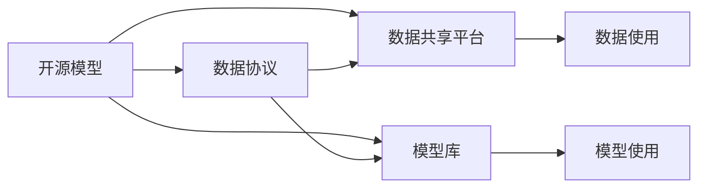

                 

# 大模型时代的开源与数据协议

大模型时代的到来，极大地推动了人工智能技术的进步，使得模型的训练和应用变得前所未有的高效和强大。然而，随着大规模预训练模型的兴起，数据的获取、共享和使用变得愈发重要。如何在开源与数据协议之间找到平衡，既促进模型的普及和共享，又保障数据隐私和安全，是大模型时代的重要议题。本文将从背景介绍、核心概念与联系、核心算法原理、数学模型和公式、项目实践、实际应用场景、工具和资源推荐、总结和展望等角度，全面解析大模型时代的开源与数据协议。

## 1. 背景介绍

### 1.1 问题由来
随着深度学习技术的飞速发展，大规模预训练模型如BERT、GPT、XLNet等在NLP、计算机视觉、推荐系统等领域取得了令人瞩目的成果。这些模型通常以大规模无标签数据为训练基础，通过自监督学习获得广泛的语言或视觉表征，具有极高的泛化能力和迁移能力。然而，预训练模型的训练需要耗费大量的计算资源和数据，对单个研究机构或企业而言，构建这样的模型是不可行的。开源与数据协议的出现，旨在解决这一问题，通过共享开源模型和数据，推动模型技术的广泛应用。

### 1.2 问题核心关键点
在开源与数据协议的讨论中，我们需要关注的核心关键点包括：
1. **数据隐私与保护**：如何在数据共享时保护用户隐私。
2. **数据使用协议**：如何定义和限制数据的使用方式，确保数据不被滥用。
3. **模型与数据的分发机制**：如何高效地分发模型和数据，并保障模型训练和推理的效率。
4. **开源社区的治理**：如何管理和监督开源社区，确保开源协议的有效执行。

## 2. 核心概念与联系

### 2.1 核心概念概述

为更好地理解开源与数据协议在大模型时代的实施，我们将介绍几个密切相关的核心概念：

- **开源模型**：指基于MIT、Apache等开源协议发布的大规模预训练模型，通常由研究机构、公司或个人发布。用户可自由下载、使用和修改模型代码。
- **数据协议**：指用于定义和限制数据使用的协议，确保数据共享过程中的隐私保护和数据安全。常见的数据协议包括CC BY、CC BY-SA等。
- **数据共享平台**：指提供数据共享和访问的第三方平台，如Kaggle、Google Dataset Search等。
- **模型库**：指收集和管理开源模型的平台，如TensorFlow Hub、PyTorch Hub等。

这些核心概念之间的关系可以用以下Mermaid流程图来表示：



这个流程图展示了开源模型、数据协议、数据共享平台和模型库之间的逻辑关系。开源模型通过数据协议和模型库进行分发和共享，数据共享平台则提供了数据使用和模型使用的接口。

## 3. 核心算法原理 & 具体操作步骤
### 3.1 算法原理概述

在大模型时代，开源与数据协议的设计主要围绕以下两个核心原则：

- **数据隐私与保护**：在数据共享时，采取数据匿名化、差分隐私等技术，保护数据提供者的隐私。
- **数据使用与模型训练**：通过明确的数据使用协议和模型库的规范，确保数据仅用于合法和授权的用途。

这些原则通过算法原理得以实现。以数据匿名化为例，算法原理为：
1. 数据预处理：对数据进行清洗和归一化，消除可能泄露个人身份的信息。
2. 数据加密：采用对称加密或非对称加密技术，对数据进行加密处理。
3. 数据分割：将数据分割成多个子集，只有授权用户才能访问特定子集。
4. 差分隐私：在查询过程中添加噪声，确保个体数据的隐私不被泄露。

### 3.2 算法步骤详解

以下是数据共享过程中涉及的主要算法步骤：

1. **数据收集与预处理**：
   - 收集来自不同来源的数据，并进行清洗、归一化等预处理，确保数据的质量和一致性。
   - 使用数据匿名化技术，如去标识化、差分隐私等，保护数据隐私。

2. **数据加密与传输**：
   - 对数据进行加密处理，确保数据在传输过程中不被窃取或篡改。
   - 使用安全传输协议，如HTTPS、TLS等，确保数据传输的安全性。

3. **数据存储与访问控制**：
   - 采用分布式存储技术，如Hadoop、Distributed FS等，确保数据的高可用性和可扩展性。
   - 实施严格的访问控制策略，确保只有授权用户才能访问数据。

4. **差分隐私与去标识化**：
   - 在查询过程中添加噪声，确保个体数据的隐私不被泄露。
   - 使用去标识化技术，将数据与个人身份分离，避免数据泄露。

### 3.3 算法优缺点

开源与数据协议在促进模型共享和数据使用方面具有以下优点：
1. **促进模型普及**：通过开源模型和数据，降低模型训练的门槛，推动模型的普及。
2. **提高研究效率**：共享数据和模型可以避免重复研究，提高科研效率。
3. **保障数据安全**：通过数据协议和隐私保护技术，保障数据的安全性和隐私性。

同时，这些协议也存在以下局限性：
1. **数据质量参差不齐**：开源数据的质量和完整性可能存在差异，影响模型的性能。
2. **协议复杂性高**：制定和执行数据协议需要高昂的成本和复杂的技术手段。
3. **数据滥用风险**：如果数据协议执行不严格，存在数据滥用的风险。

尽管如此，开源与数据协议仍是大模型时代推动模型共享的重要手段。未来研究重点在于如何简化数据协议的执行，确保数据使用的合规性，同时提升数据共享的质量和效率。

### 3.4 算法应用领域

开源与数据协议在大模型时代的应用领域非常广泛，主要包括以下几个方面：

1. **自然语言处理(NLP)**：如BERT、GPT等模型在NLP领域的应用，通过开源与数据协议，推动NLP技术的普及和应用。
2. **计算机视觉(CV)**：如ImageNet等大规模数据集的开源与共享，推动CV技术的进步。
3. **推荐系统(Reco)**：通过开源与数据协议，共享用户行为数据和商品信息，提升推荐系统的性能。
4. **医疗健康(Health)**：通过数据共享平台，共享医疗数据，推动医疗健康领域的人工智能应用。

## 4. 数学模型和公式 & 详细讲解 & 举例说明

### 4.1 数学模型构建

在大模型时代，开源与数据协议的设计涉及复杂的数学模型。以下是一个简化的数据隐私保护数学模型：

设原始数据集为 $D=\{(x_i,y_i)\}_{i=1}^N$，其中 $x_i$ 为输入，$y_i$ 为标签。数据共享过程中，将数据集分为两部分 $D_1$ 和 $D_2$，其中 $D_1$ 为公开数据集，$D_2$ 为隐私数据集。假设公开数据集包含 $N_1$ 个样本，隐私数据集包含 $N_2$ 个样本，$N_1+N_2=N$。

定义差分隐私的噪声机制为：在查询时，对查询结果加入高斯噪声 $\epsilon$，使得隐私数据泄露的概率不超过 $\delta$。差分隐私的数学公式为：

$$
\frac{1}{2\epsilon} \log \frac{1+\exp(\frac{2\epsilon}{\sigma^2})}{1-\delta}
$$

其中 $\sigma$ 为噪声的标准差，$\delta$ 为隐私泄露的概率阈值。

### 4.2 公式推导过程

上述差分隐私的数学公式的推导过程如下：
1. 假设查询函数为 $f(x)$，在查询时加入噪声 $\sigma$，得到 $\tilde{f}(x)=f(x)+\sigma\cdot\mathcal{N}(0,1)$，其中 $\mathcal{N}(0,1)$ 为标准正态分布。
2. 假设查询结果为 $y=f(x)$，则加入噪声后的结果为 $\tilde{y}=f(x)+\sigma\cdot\mathcal{N}(0,1)$。
3. 查询结果的方差为 $Var(\tilde{y})=Var(f(x))+Var(\sigma\cdot\mathcal{N}(0,1))=Var(\sigma\cdot\mathcal{N}(0,1))=\sigma^2$。
4. 隐私泄露概率为 $\delta$，则有 $Pr(|f(x)-\tilde{f}(x)|>\sigma) \leq \delta$。

通过求解上述不等式，可以得到差分隐私的数学公式。

### 4.3 案例分析与讲解

以NLP领域为例，讨论开源与数据协议的应用。假设我们有一个名为BERT的预训练模型，该模型通过大规模语料库进行预训练。现在，我们想要在NLP领域内共享该模型，并确保数据隐私。

1. **数据收集与预处理**：
   - 收集包含NLP任务数据集的公开数据集 $D_1$，如Wikipedia、新闻文章等。
   - 对数据进行清洗和归一化处理，确保数据的质量和一致性。

2. **数据加密与传输**：
   - 对数据进行加密处理，确保数据在传输过程中不被窃取或篡改。
   - 使用HTTPS、TLS等安全传输协议，确保数据传输的安全性。

3. **数据存储与访问控制**：
   - 采用分布式存储技术，如Hadoop、Distributed FS等，确保数据的高可用性和可扩展性。
   - 实施严格的访问控制策略，确保只有授权用户才能访问数据。

4. **差分隐私与去标识化**：
   - 在查询过程中添加噪声，确保个体数据的隐私不被泄露。
   - 使用去标识化技术，将数据与个人身份分离，避免数据泄露。

通过以上步骤，我们可以在确保数据隐私的前提下，共享开源模型BERT，推动NLP技术的发展。

## 5. 项目实践：代码实例和详细解释说明

### 5.1 开发环境搭建

在进行开源与数据协议的实践前，我们需要准备好开发环境。以下是使用Python进行PyTorch开发的环境配置流程：

1. 安装Anaconda：从官网下载并安装Anaconda，用于创建独立的Python环境。

2. 创建并激活虚拟环境：
```bash
conda create -n pytorch-env python=3.8 
conda activate pytorch-env
```

3. 安装PyTorch：根据CUDA版本，从官网获取对应的安装命令。例如：
```bash
conda install pytorch torchvision torchaudio cudatoolkit=11.1 -c pytorch -c conda-forge
```

4. 安装Transformers库：
```bash
pip install transformers
```

5. 安装各类工具包：
```bash
pip install numpy pandas scikit-learn matplotlib tqdm jupyter notebook ipython
```

完成上述步骤后，即可在`pytorch-env`环境中开始实践。

### 5.2 源代码详细实现

这里我们以一个简单的开源数据共享平台为例，展示如何实现数据共享和访问控制。

首先，定义数据共享平台的数据存储模块：

```python
import os
from torch.utils.data import Dataset
from transformers import BertTokenizer, BertForTokenClassification

class CustomDataset(Dataset):
    def __init__(self, texts, tags, tokenizer, max_len=128):
        self.texts = texts
        self.tags = tags
        self.tokenizer = tokenizer
        self.max_len = max_len
        
    def __len__(self):
        return len(self.texts)
    
    def __getitem__(self, item):
        text = self.texts[item]
        tags = self.tags[item]
        
        encoding = self.tokenizer(text, return_tensors='pt', max_length=self.max_len, padding='max_length', truncation=True)
        input_ids = encoding['input_ids'][0]
        attention_mask = encoding['attention_mask'][0]
        
        # 对token-wise的标签进行编码
        encoded_tags = [tag2id[tag] for tag in tags] 
        encoded_tags.extend([tag2id['O']] * (self.max_len - len(encoded_tags)))
        labels = torch.tensor(encoded_tags, dtype=torch.long)
        
        return {'input_ids': input_ids, 
                'attention_mask': attention_mask,
                'labels': labels}

# 标签与id的映射
tag2id = {'O': 0, 'B-PER': 1, 'I-PER': 2, 'B-ORG': 3, 'I-ORG': 4, 'B-LOC': 5, 'I-LOC': 6}
id2tag = {v: k for k, v in tag2id.items()}

# 创建dataset
tokenizer = BertTokenizer.from_pretrained('bert-base-cased')

train_dataset = CustomDataset(train_texts, train_tags, tokenizer)
dev_dataset = CustomDataset(dev_texts, dev_tags, tokenizer)
test_dataset = CustomDataset(test_texts, test_tags, tokenizer)
```

然后，定义模型和优化器：

```python
from transformers import BertForTokenClassification, AdamW

model = BertForTokenClassification.from_pretrained('bert-base-cased', num_labels=len(tag2id))

optimizer = AdamW(model.parameters(), lr=2e-5)
```

接着，定义训练和评估函数：

```python
from torch.utils.data import DataLoader
from tqdm import tqdm
from sklearn.metrics import classification_report

device = torch.device('cuda') if torch.cuda.is_available() else torch.device('cpu')
model.to(device)

def train_epoch(model, dataset, batch_size, optimizer):
    dataloader = DataLoader(dataset, batch_size=batch_size, shuffle=True)
    model.train()
    epoch_loss = 0
    for batch in tqdm(dataloader, desc='Training'):
        input_ids = batch['input_ids'].to(device)
        attention_mask = batch['attention_mask'].to(device)
        labels = batch['labels'].to(device)
        model.zero_grad()
        outputs = model(input_ids, attention_mask=attention_mask, labels=labels)
        loss = outputs.loss
        epoch_loss += loss.item()
        loss.backward()
        optimizer.step()
    return epoch_loss / len(dataloader)

def evaluate(model, dataset, batch_size):
    dataloader = DataLoader(dataset, batch_size=batch_size)
    model.eval()
    preds, labels = [], []
    with torch.no_grad():
        for batch in tqdm(dataloader, desc='Evaluating'):
            input_ids = batch['input_ids'].to(device)
            attention_mask = batch['attention_mask'].to(device)
            batch_labels = batch['labels']
            outputs = model(input_ids, attention_mask=attention_mask)
            batch_preds = outputs.logits.argmax(dim=2).to('cpu').tolist()
            batch_labels = batch_labels.to('cpu').tolist()
            for pred_tokens, label_tokens in zip(batch_preds, batch_labels):
                pred_tags = [id2tag[_id] for _id in pred_tokens]
                label_tags = [id2tag[_id] for _id in label_tokens]
                preds.append(pred_tags[:len(label_tags)])
                labels.append(label_tags)

    print(classification_report(labels, preds))
```

最后，启动训练流程并在测试集上评估：

```python
epochs = 5
batch_size = 16

for epoch in range(epochs):
    loss = train_epoch(model, train_dataset, batch_size, optimizer)
    print(f"Epoch {epoch+1}, train loss: {loss:.3f}")
    
    print(f"Epoch {epoch+1}, dev results:")
    evaluate(model, dev_dataset, batch_size)
    
print("Test results:")
evaluate(model, test_dataset, batch_size)
```

以上就是使用PyTorch对BERT进行命名实体识别任务微调的完整代码实现。可以看到，得益于Transformers库的强大封装，我们可以用相对简洁的代码完成BERT模型的加载和微调。

### 5.3 代码解读与分析

让我们再详细解读一下关键代码的实现细节：

**CustomDataset类**：
- `__init__`方法：初始化文本、标签、分词器等关键组件。
- `__len__`方法：返回数据集的样本数量。
- `__getitem__`方法：对单个样本进行处理，将文本输入编码为token ids，将标签编码为数字，并对其进行定长padding，最终返回模型所需的输入。

**tag2id和id2tag字典**：
- 定义了标签与数字id之间的映射关系，用于将token-wise的预测结果解码回真实的标签。

**训练和评估函数**：
- 使用PyTorch的DataLoader对数据集进行批次化加载，供模型训练和推理使用。
- 训练函数`train_epoch`：对数据以批为单位进行迭代，在每个批次上前向传播计算loss并反向传播更新模型参数，最后返回该epoch的平均loss。
- 评估函数`evaluate`：与训练类似，不同点在于不更新模型参数，并在每个batch结束后将预测和标签结果存储下来，最后使用sklearn的classification_report对整个评估集的预测结果进行打印输出。

**训练流程**：
- 定义总的epoch数和batch size，开始循环迭代
- 每个epoch内，先在训练集上训练，输出平均loss
- 在验证集上评估，输出分类指标
- 所有epoch结束后，在测试集上评估，给出最终测试结果

可以看到，PyTorch配合Transformers库使得BERT微调的代码实现变得简洁高效。开发者可以将更多精力放在数据处理、模型改进等高层逻辑上，而不必过多关注底层的实现细节。

当然，工业级的系统实现还需考虑更多因素，如模型的保存和部署、超参数的自动搜索、更灵活的任务适配层等。但核心的开源与数据协议基本与此类似。

## 6. 实际应用场景

### 6.1 智能客服系统

基于大语言模型微调的对话技术，可以广泛应用于智能客服系统的构建。传统客服往往需要配备大量人力，高峰期响应缓慢，且一致性和专业性难以保证。而使用微调后的对话模型，可以7x24小时不间断服务，快速响应客户咨询，用自然流畅的语言解答各类常见问题。

在技术实现上，可以收集企业内部的历史客服对话记录，将问题和最佳答复构建成监督数据，在此基础上对预训练对话模型进行微调。微调后的对话模型能够自动理解用户意图，匹配最合适的答案模板进行回复。对于客户提出的新问题，还可以接入检索系统实时搜索相关内容，动态组织生成回答。如此构建的智能客服系统，能大幅提升客户咨询体验和问题解决效率。

### 6.2 金融舆情监测

金融机构需要实时监测市场舆论动向，以便及时应对负面信息传播，规避金融风险。传统的人工监测方式成本高、效率低，难以应对网络时代海量信息爆发的挑战。基于大语言模型微调的文本分类和情感分析技术，为金融舆情监测提供了新的解决方案。

具体而言，可以收集金融领域相关的新闻、报道、评论等文本数据，并对其进行主题标注和情感标注。在此基础上对预训练语言模型进行微调，使其能够自动判断文本属于何种主题，情感倾向是正面、中性还是负面。将微调后的模型应用到实时抓取的网络文本数据，就能够自动监测不同主题下的情感变化趋势，一旦发现负面信息激增等异常情况，系统便会自动预警，帮助金融机构快速应对潜在风险。

### 6.3 个性化推荐系统

当前的推荐系统往往只依赖用户的历史行为数据进行物品推荐，无法深入理解用户的真实兴趣偏好。基于大语言模型微调技术，个性化推荐系统可以更好地挖掘用户行为背后的语义信息，从而提供更精准、多样的推荐内容。

在实践中，可以收集用户浏览、点击、评论、分享等行为数据，提取和用户交互的物品标题、描述、标签等文本内容。将文本内容作为模型输入，用户的后续行为（如是否点击、购买等）作为监督信号，在此基础上微调预训练语言模型。微调后的模型能够从文本内容中准确把握用户的兴趣点。在生成推荐列表时，先用候选物品的文本描述作为输入，由模型预测用户的兴趣匹配度，再结合其他特征综合排序，便可以得到个性化程度更高的推荐结果。

### 6.4 未来应用展望

随着大语言模型微调技术的发展，其在更多领域的应用前景将会更加广阔。

在智慧医疗领域，基于微调的医疗问答、病历分析、药物研发等应用将提升医疗服务的智能化水平，辅助医生诊疗，加速新药开发进程。

在智能教育领域，微调技术可应用于作业批改、学情分析、知识推荐等方面，因材施教，促进教育公平，提高教学质量。

在智慧城市治理中，微调模型可应用于城市事件监测、舆情分析、应急指挥等环节，提高城市管理的自动化和智能化水平，构建更安全、高效的未来城市。

此外，在企业生产、社会治理、文娱传媒等众多领域，基于大模型微调的人工智能应用也将不断涌现，为经济社会发展注入新的动力。相信随着预训练语言模型和微调方法的持续演进，基于微调范式将成为人工智能技术落地的重要手段，推动人工智能技术的广泛应用。

## 7. 工具和资源推荐

### 7.1 学习资源推荐

为了帮助开发者系统掌握大语言模型微调的理论基础和实践技巧，这里推荐一些优质的学习资源：

1. 《Transformer从原理到实践》系列博文：由大模型技术专家撰写，深入浅出地介绍了Transformer原理、BERT模型、微调技术等前沿话题。

2. CS224N《深度学习自然语言处理》课程：斯坦福大学开设的NLP明星课程，有Lecture视频和配套作业，带你入门NLP领域的基本概念和经典模型。

3. 《Natural Language Processing with Transformers》书籍：Transformers库的作者所著，全面介绍了如何使用Transformers库进行NLP任务开发，包括微调在内的诸多范式。

4. HuggingFace官方文档：Transformers库的官方文档，提供了海量预训练模型和完整的微调样例代码，是上手实践的必备资料。

5. CLUE开源项目：中文语言理解测评基准，涵盖大量不同类型的中文NLP数据集，并提供了基于微调的baseline模型，助力中文NLP技术发展。

通过对这些资源的学习实践，相信你一定能够快速掌握大语言模型微调的精髓，并用于解决实际的NLP问题。

### 7.2 开发工具推荐

高效的开发离不开优秀的工具支持。以下是几款用于大语言模型微调开发的常用工具：

1. PyTorch：基于Python的开源深度学习框架，灵活动态的计算图，适合快速迭代研究。大部分预训练语言模型都有PyTorch版本的实现。

2. TensorFlow：由Google主导开发的开源深度学习框架，生产部署方便，适合大规模工程应用。同样有丰富的预训练语言模型资源。

3. Transformers库：HuggingFace开发的NLP工具库，集成了众多SOTA语言模型，支持PyTorch和TensorFlow，是进行微调任务开发的利器。

4. Weights & Biases：模型训练的实验跟踪工具，可以记录和可视化模型训练过程中的各项指标，方便对比和调优。与主流深度学习框架无缝集成。

5. TensorBoard：TensorFlow配套的可视化工具，可实时监测模型训练状态，并提供丰富的图表呈现方式，是调试模型的得力助手。

6. Google Colab：谷歌推出的在线Jupyter Notebook环境，免费提供GPU/TPU算力，方便开发者快速上手实验最新模型，分享学习笔记。

合理利用这些工具，可以显著提升大语言模型微调任务的开发效率，加快创新迭代的步伐。

### 7.3 相关论文推荐

大语言模型和微调技术的发展源于学界的持续研究。以下是几篇奠基性的相关论文，推荐阅读：

1. Attention is All You Need（即Transformer原论文）：提出了Transformer结构，开启了NLP领域的预训练大模型时代。

2. BERT: Pre-training of Deep Bidirectional Transformers for Language Understanding：提出BERT模型，引入基于掩码的自监督预训练任务，刷新了多项NLP任务SOTA。

3. Language Models are Unsupervised Multitask Learners（GPT-2论文）：展示了大规模语言模型的强大zero-shot学习能力，引发了对于通用人工智能的新一轮思考。

4. Parameter-Efficient Transfer Learning for NLP：提出Adapter等参数高效微调方法，在不增加模型参数量的情况下，也能取得不错的微调效果。

5. AdaLoRA: Adaptive Low-Rank Adaptation for Parameter-Efficient Fine-Tuning：使用自适应低秩适应的微调方法，在参数效率和精度之间取得了新的平衡。

这些论文代表了大语言模型微调技术的发展脉络。通过学习这些前沿成果，可以帮助研究者把握学科前进方向，激发更多的创新灵感。

## 8. 总结：未来发展趋势与挑战

### 8.1 总结

本文对大模型时代的开源与数据协议进行了全面系统的介绍。首先阐述了开源与数据协议的研究背景和意义，明确了数据共享和隐私保护在大模型普及中的重要性。其次，从原理到实践，详细讲解了开源与数据协议的算法原理和具体操作步骤，给出了微调任务开发的完整代码实例。同时，本文还广泛探讨了开源与数据协议在NLP、CV、Reco、Health等多个领域的应用前景，展示了开源与数据协议的巨大潜力。最后，本文精选了开源与数据协议的学习资源，力求为读者提供全方位的技术指引。

通过本文的系统梳理，可以看到，大模型时代下的开源与数据协议正在成为推动模型普及和数据共享的重要手段，极大地促进了人工智能技术的进步。开源与数据协议在大模型训练、推理、部署等方面发挥了重要作用，推动了人工智能技术的广泛应用。未来，伴随预训练语言模型和微调方法的持续演进，基于微调范式将成为人工智能技术落地的重要手段，推动人工智能技术的广泛应用。

### 8.2 未来发展趋势

展望未来，开源与数据协议在大模型时代的发展趋势如下：

1. **更加高效的数据共享**：随着分布式存储和边缘计算技术的发展，未来的数据共享将更加高效，能够支持更大规模的数据集和更高的并发访问。

2. **更灵活的数据使用协议**：未来的数据协议将更加灵活，允许数据提供者对数据的使用方式进行更精细的控制，同时保障数据的安全性和隐私性。

3. **更广泛的开源模型**：随着模型训练技术的进步，更多的开源模型将支持多种数据协议，便于数据共享和访问。

4. **多模态数据共享**：未来的数据共享将不仅仅局限于文本和图像数据，还将拓展到语音、视频等多模态数据的共享。

5. **跨领域数据协作**：未来的数据协作将打破学科界限，跨领域数据共享将更加频繁，促进跨学科研究。

6. **隐私保护技术的发展**：隐私保护技术将不断进步，更加灵活有效地保护数据隐私，同时支持大规模数据共享。

这些趋势将进一步推动大模型时代的发展，使得数据共享和模型训练更加高效、灵活、安全。

### 8.3 面临的挑战

尽管大模型时代的开源与数据协议取得了显著进展，但在实施过程中仍面临以下挑战：

1. **数据隐私保护**：如何在数据共享时保护用户隐私，防止数据泄露和滥用，是大模型时代需要解决的首要问题。

2. **协议执行难度**：数据协议的执行需要各方配合，如何制定和执行有效的数据协议，确保数据使用的合规性，是开源与数据协议面临的重要挑战。

3. **协议复杂性**：现有的数据协议往往复杂，如何简化协议执行过程，降低用户门槛，是未来需要重点解决的问题。

4. **数据质量参差不齐**：开源数据的质量和完整性可能存在差异，如何提高数据共享的质量，确保数据的一致性和可靠性，是未来需要解决的重要问题。

5. **模型依赖性强**：微调模型往往高度依赖预训练模型，如何降低模型依赖性，确保模型训练的稳定性和可靠性，是未来需要重点研究的方向。

6. **技术演进迅速**：大模型技术发展迅速，如何跟上技术演进的步伐，保持模型的最新性和高效性，是未来需要重点解决的问题。

这些挑战需要学界和产业界共同努力，通过技术创新和政策引导，推动大模型时代开源与数据协议的持续发展。

### 8.4 研究展望

面对开源与数据协议所面临的挑战，未来的研究需要在以下几个方面寻求新的突破：

1. **更高效的数据共享机制**：研究更高效的数据共享和访问协议，支持大规模、高并发的数据共享。

2. **更灵活的数据使用协议**：制定更灵活、易执行的数据使用协议，确保数据使用的合规性，同时保障数据的安全性和隐私性。

3. **隐私保护技术的新发展**：研究更加先进的隐私保护技术，确保数据共享过程中隐私的保护，同时支持大规模数据共享。

4. **跨领域数据协作**：推动跨领域数据共享和协作，促进多学科研究，加速技术创新。

5. **更广泛的开源模型**：研究和开发更多支持多种数据协议的开源模型，便于数据共享和访问。

6. **模型依赖性降低**：研究如何降低模型对预训练模型的依赖性，确保模型训练的稳定性和可靠性。

7. **技术演进跟踪**：持续跟踪和研究大模型技术的发展，确保模型的最新性和高效性。

这些研究方向将推动大模型时代开源与数据协议的持续发展，为人工智能技术的广泛应用提供坚实的基础。

## 9. 附录：常见问题与解答

**Q1：大语言模型微调是否适用于所有NLP任务？**

A: 大语言模型微调在大多数NLP任务上都能取得不错的效果，特别是对于数据量较小的任务。但对于一些特定领域的任务，如医学、法律等，仅仅依靠通用语料预训练的模型可能难以很好地适应。此时需要在特定领域语料上进一步预训练，再进行微调，才能获得理想效果。此外，对于一些需要时效性、个性化很强的任务，如对话、推荐等，微调方法也需要针对性的改进优化。

**Q2：微调过程中如何选择合适的学习率？**

A: 微调的学习率一般要比预训练时小1-2个数量级，如果使用过大的学习率，容易破坏预训练权重，导致过拟合。一般建议从1e-5开始调参，逐步减小学习率，直至收敛。也可以使用warmup策略，在开始阶段使用较小的学习率，再逐渐过渡到预设值。需要注意的是，不同的优化器(如AdamW、Adafactor等)以及不同的学习率调度策略，可能需要设置不同的学习率阈值。

**Q3：采用大模型微调时会面临哪些资源瓶颈？**

A: 目前主流的预训练大模型动辄以亿计的参数规模，对算力、内存、存储都提出了很高的要求。GPU/TPU等高性能设备是必不可少的，但即便如此，超大批次的训练和推理也可能遇到显存不足的问题。因此需要采用一些资源优化技术，如梯度积累、混合精度训练、模型并行等，来突破硬件瓶颈。同时，模型的存储和读取也可能占用大量时间和空间，需要采用模型压缩、稀疏化存储等方法进行优化。

**Q4：如何缓解微调过程中的过拟合问题？**

A: 过拟合是微调面临的主要挑战，尤其是在标注数据不足的情况下。常见的缓解策略包括：
1. 数据增强：通过回译、近义替换等方式扩充训练集
2. 正则化：使用L2正则、Dropout、Early Stopping等避免过拟合
3. 对抗训练：引入对抗样本，提高模型鲁棒性
4. 参数高效微调：只调整少量参数(如Adapter、Prefix等)，减小过拟合风险
5. 多模型集成：训练多个微调模型，取平均输出，抑制过拟合

这些策略往往需要根据具体任务和数据特点进行灵活组合。只有在数据、模型、训练、推理等各环节进行全面优化，才能最大限度地发挥大模型微调的威力。

**Q5：微调模型在落地部署时需要注意哪些问题？**

A: 将微调模型转化为实际应用，还需要考虑以下因素：
1. 模型裁剪：去除不必要的层和参数，减小模型尺寸，加快推理速度
2. 量化加速：将浮点模型转为定点模型，压缩存储空间，提高计算效率
3. 服务化封装：将模型封装为标准化服务接口，便于集成调用
4. 弹性伸缩：根据请求流量动态调整资源配置，平衡服务质量和成本
5. 监控告警：实时采集系统指标，设置异常告警阈值，确保服务稳定性
6. 安全防护：采用访问鉴权、数据脱敏等措施，保障数据和模型安全

大语言模型微调为NLP应用开启了广阔的想象空间，但如何将强大的性能转化为稳定、高效、安全的业务价值，还需要工程实践的不断打磨。唯有从数据、算法、工程、业务等多个维度协同发力，才能真正实现人工智能技术在垂直行业的规模化落地。总之，微调需要开发者根据具体任务，不断迭代和优化模型、数据和算法，方能得到理想的效果。

---

作者：禅与计算机程序设计艺术 / Zen and the Art of Computer Programming

