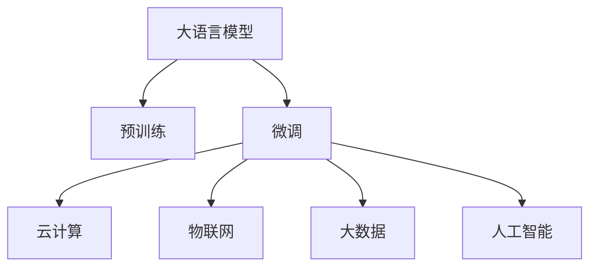

                 

# 大模型赋能智慧园区，创业者如何优化园区空间规划与资源调度？

## 1. 背景介绍

随着城市化进程的加快，智慧园区（Smart Campus）的建设成为了越来越多城市转型升级的重要方向。智慧园区通过整合云计算、物联网、大数据、人工智能等现代信息技术，优化园区空间规划与资源调度，提升管理效率，增强环境可持续性，打造面向未来的智慧城市新形态。在这场城市数字化转型的大潮中，大语言模型作为人工智能领域的明星技术，展现出广阔的应用前景。

### 1.1 大语言模型的概念与优势

大语言模型，如BERT、GPT、T5等，是由深度学习技术训练得到的、能够处理自然语言的大型神经网络模型。大语言模型具备强大的语言理解和生成能力，通过大规模语料库的预训练，能够在各种自然语言处理任务上取得优异性能。相比于传统的规则驱动系统，大语言模型可以灵活处理非结构化数据，实现更加智能化、人性化的业务应用。

大语言模型的优势主要体现在以下几个方面：

1. **泛化能力强**：经过大规模语料库的预训练，大语言模型能够学习到通用语言知识，具备跨领域的泛化能力。
2. **处理效率高**：通过高度并行化的计算，大语言模型能够实现高效的语言处理，提高业务响应速度。
3. **灵活适应性强**：大语言模型可以通过微调等方式，灵活适配各种具体的业务场景，增强系统适应性。

### 1.2 智慧园区建设需求

智慧园区的建设目标是实现园区管理数字化、智能化、人性化，主要涉及以下几个方面：

1. **园区管理**：通过智能监控、智能巡检、智能调度等方式，提升园区安防、环境、设备等管理效率。
2. **资源优化**：对园区资源进行精准分析和优化，如能耗、设施、人员等，实现资源配置的最优化。
3. **用户体验**：通过智能导引、智能预约、智能服务等方式，提升用户在使用园区时的便利性和体验。

## 2. 核心概念与联系

### 2.1 核心概念概述

为更好地理解大语言模型在智慧园区中的应用，本节将介绍几个密切相关的核心概念：

- **大语言模型**：以BERT、GPT等模型为代表的深度学习神经网络，通过大规模语料库预训练，能够处理复杂的自然语言处理任务。
- **预训练**：通过大规模无标签数据进行自监督学习，大语言模型学习到语言的基本规律和知识，为后续任务微调打下基础。
- **微调**：在大语言模型的基础上，根据具体的业务需求进行有监督学习，以微调的方式优化模型。
- **云计算**：提供计算资源、存储资源、网络资源等基础能力，支持大规模数据处理和复杂任务计算。
- **物联网(IoT)**：通过传感器、标签、RFID等技术实现物与物的连接，收集园区内的实时数据。
- **大数据**：集成、处理、分析园区内的海量数据，支持实时决策和预测分析。
- **人工智能**：融合云计算、大数据、物联网等多源数据，通过深度学习等技术实现智能化应用。

这些核心概念之间的逻辑关系可以通过以下Mermaid流程图来展示：



这个流程图展示了大语言模型与其他核心概念的关系：

1. 大语言模型通过预训练获得基础能力。
2. 微调在大语言模型的基础上，根据具体的业务需求进行优化。
3. 微调过程中需要依赖云计算、物联网、大数据等技术获取数据和计算资源。
4. 最终形成的人工智能应用，支持智慧园区的建设和管理。

## 3. 核心算法原理 & 具体操作步骤

### 3.1 算法原理概述

大语言模型在智慧园区中的应用，主要体现在通过微调实现具体的业务需求。微调过程主要包括以下几个步骤：

1. **数据收集与预处理**：收集园区内的人流、能耗、设备运行状态等数据，并进行清洗和预处理，确保数据质量。
2. **模型训练**：使用大语言模型对收集到的数据进行训练，得到适应园区需求的模型。
3. **模型评估**：在训练过程中进行性能评估，确保模型能够满足实际需求。
4. **模型部署**：将训练好的模型部署到园区内的各个应用场景中，实现业务功能。
5. **持续优化**：根据反馈数据和业务需求的变化，持续优化模型，提高其适应性。

### 3.2 算法步骤详解

**Step 1: 数据收集与预处理**

智慧园区建设的关键在于数据。通过园区内传感器、摄像头、标签等设备，可以收集到大量实时数据，包括但不限于：

- 园区内人员流动情况
- 设施设备运行状态
- 能源消耗数据
- 环境参数（温度、湿度等）

这些数据需要进行清洗和预处理，以确保其可用性。具体步骤如下：

1. **数据清洗**：去除数据中的噪声、异常值和不完整数据，确保数据的一致性和完整性。
2. **数据标注**：对部分数据进行人工标注，为模型的训练提供监督信号。
3. **数据增强**：通过数据增强技术，扩充训练集的多样性，防止模型过拟合。

**Step 2: 模型训练**

在数据准备完成后，可以进行模型的训练。训练过程主要包括以下几个步骤：

1. **选择模型架构**：根据具体的业务需求，选择合适的模型架构。大语言模型通常包括Transformer、BERT等。
2. **设置训练参数**：包括学习率、批量大小、训练轮数等，确保模型训练的效果和效率。
3. **选择损失函数**：根据具体的业务需求，选择合适的损失函数。例如，回归任务可以使用均方误差损失，分类任务可以使用交叉熵损失。
4. **训练模型**：使用训练数据对模型进行训练，最小化损失函数，得到适应业务需求的模型。

**Step 3: 模型评估**

模型训练完成后，需要对模型进行评估，确保其性能满足业务需求。评估过程主要包括以下几个步骤：

1. **划分数据集**：将数据集划分为训练集、验证集和测试集，用于模型的训练、验证和测试。
2. **评估指标**：根据具体的业务需求，选择合适的评估指标，如准确率、召回率、F1值等。
3. **模型优化**：根据评估结果，对模型进行优化，如调整训练参数、增加训练轮数等。

**Step 4: 模型部署**

模型训练完成后，可以将其部署到园区内的各个应用场景中，实现具体的业务功能。部署过程主要包括以下几个步骤：

1. **部署环境搭建**：搭建部署环境，包括服务器、数据库、网络等，确保模型的正常运行。
2. **模型加载**：将训练好的模型加载到部署环境中，进行实时处理。
3. **接口开发**：开发与模型交互的接口，实现业务功能的调用。

**Step 5: 持续优化**

模型部署后，需要根据反馈数据和业务需求的变化，持续优化模型。优化过程主要包括以下几个步骤：

1. **收集反馈数据**：通过园区内传感器、摄像头等设备，收集反馈数据，用于模型的优化。
2. **模型更新**：根据反馈数据，对模型进行更新，提高其适应性。
3. **性能评估**：对更新后的模型进行性能评估，确保其性能满足业务需求。

### 3.3 算法优缺点

大语言模型在智慧园区中的应用具有以下优点：

1. **智能化水平高**：大语言模型具备强大的自然语言处理能力，能够处理非结构化数据，提升园区的智能化水平。
2. **通用性强**：大语言模型可以通过微调适配各种具体的业务场景，提高模型的泛化能力。
3. **计算效率高**：大语言模型通过高度并行化的计算，实现高效的语言处理，提高业务响应速度。

同时，大语言模型也存在一些缺点：

1. **数据需求大**：大语言模型的训练需要大量的数据，且数据质量直接影响模型的性能。
2. **计算资源要求高**：大语言模型通常需要高性能的计算资源，如GPU、TPU等。
3. **模型复杂度高**：大语言模型的复杂度较高，需要大量的计算资源和训练时间。

### 3.4 算法应用领域

大语言模型在智慧园区中的应用，主要体现在以下几个方面：

1. **智能安防**：通过智能监控和智能巡检，提升园区安防能力，保障园区安全。
2. **智能调度**：通过智能调度系统，优化园区内的人流、设备等资源的配置，提高管理效率。
3. **智能导引**：通过智能导引系统，提升园区内的导航和导引体验，提高用户满意度。
4. **智能服务**：通过智能客服、智能预约等应用，提升园区内的服务水平，增强用户体验。

## 4. 数学模型和公式 & 详细讲解 & 举例说明

### 4.1 数学模型构建

大语言模型在智慧园区中的应用，主要基于机器学习框架进行模型的构建和训练。以BERT为例，其数学模型构建过程如下：

1. **输入表示**：将输入数据进行分词和编码，得到输入表示 $x$。
2. **模型输入**：将输入表示 $x$ 输入BERT模型，得到模型输出 $h$。
3. **任务适配**：根据具体的任务需求，将模型输出 $h$ 映射到目标输出 $y$。
4. **损失函数**：使用交叉熵等损失函数计算模型输出与真实标签之间的差异。
5. **优化算法**：使用梯度下降等优化算法，最小化损失函数，得到最优模型参数。

### 4.2 公式推导过程

以智能调度系统为例，其公式推导过程如下：

设园区内有 $N$ 个设备，每个设备的状态为 $s_i \in \{0, 1\}$，其中 $s_i=0$ 表示设备处于空闲状态，$s_i=1$ 表示设备处于工作状态。设备调度任务为将设备的状态从初始状态 $s_0$ 调度到目标状态 $s_T$，使得总成本最小。设设备 $i$ 的调度费用为 $c_i$，总费用为 $C$，则调度问题的数学模型为：

$$
\min_{s_i} C = \sum_{i=1}^N c_i s_i
$$

在求解调度问题时，可以使用动态规划等算法进行优化。但在大语言模型微调中，通常使用监督学习方法进行优化，公式推导如下：

设训练集为 $D=\{(x_i, y_i)\}_{i=1}^M$，其中 $x_i$ 为设备状态的历史数据，$y_i$ 为设备状态的目标状态。模型的输出为 $h_i = f(x_i; \theta)$，其中 $f$ 为模型的非线性映射，$\theta$ 为模型参数。模型的损失函数为交叉熵损失：

$$
\ell = -\frac{1}{M} \sum_{i=1}^M y_i \log h_i
$$

最小化损失函数，得到最优模型参数 $\theta^*$：

$$
\theta^* = \mathop{\arg\min}_{\theta} \ell
$$

### 4.3 案例分析与讲解

以智能导引系统为例，其案例分析如下：

假设园区内有多条路线，每条路线包含多个地点。游客可以通过语音或文字描述请求从起点 $A$ 到达终点 $B$ 的路线。通过微调BERT模型，可以实现在输入中解析游客的路线请求，并自动生成最优路线推荐。

具体步骤如下：

1. **数据准备**：收集园区内各个地点的坐标和路线信息，构建训练数据集。
2. **模型训练**：使用BERT模型对训练数据进行训练，得到路线推荐的模型。
3. **路线推荐**：将游客的路线请求输入训练好的模型，得到最优路线推荐。

## 5. 项目实践：代码实例和详细解释说明

### 5.1 开发环境搭建

在进行项目实践前，我们需要准备好开发环境。以下是使用Python进行PyTorch开发的环境配置流程：

1. 安装Anaconda：从官网下载并安装Anaconda，用于创建独立的Python环境。

2. 创建并激活虚拟环境：
```bash
conda create -n pytorch-env python=3.8 
conda activate pytorch-env
```

3. 安装PyTorch：根据CUDA版本，从官网获取对应的安装命令。例如：
```bash
conda install pytorch torchvision torchaudio cudatoolkit=11.1 -c pytorch -c conda-forge
```

4. 安装TensorFlow：
```bash
pip install tensorflow
```

5. 安装各类工具包：
```bash
pip install numpy pandas scikit-learn matplotlib tqdm jupyter notebook ipython
```

完成上述步骤后，即可在`pytorch-env`环境中开始项目实践。

### 5.2 源代码详细实现

这里我们以智能导引系统为例，给出使用Transformers库对BERT模型进行微调的PyTorch代码实现。

首先，定义智能导引系统所需的数据处理函数：

```python
from transformers import BertTokenizer
from torch.utils.data import Dataset
import torch

class RouteDataset(Dataset):
    def __init__(self, data, tokenizer, max_len=128):
        self.data = data
        self.tokenizer = tokenizer
        self.max_len = max_len
        
    def __len__(self):
        return len(self.data)
    
    def __getitem__(self, item):
        text = self.data[item]
        encoding = self.tokenizer(text, return_tensors='pt', max_length=self.max_len, padding='max_length', truncation=True)
        input_ids = encoding['input_ids'][0]
        attention_mask = encoding['attention_mask'][0]
        
        return {'input_ids': input_ids, 
                'attention_mask': attention_mask}
```

然后，定义模型和优化器：

```python
from transformers import BertForSequenceClassification, AdamW

model = BertForSequenceClassification.from_pretrained('bert-base-cased', num_labels=3)

optimizer = AdamW(model.parameters(), lr=2e-5)
```

接着，定义训练和评估函数：

```python
from torch.utils.data import DataLoader
from tqdm import tqdm
from sklearn.metrics import accuracy_score

device = torch.device('cuda') if torch.cuda.is_available() else torch.device('cpu')
model.to(device)

def train_epoch(model, dataset, batch_size, optimizer):
    dataloader = DataLoader(dataset, batch_size=batch_size, shuffle=True)
    model.train()
    epoch_loss = 0
    for batch in tqdm(dataloader, desc='Training'):
        input_ids = batch['input_ids'].to(device)
        attention_mask = batch['attention_mask'].to(device)
        model.zero_grad()
        outputs = model(input_ids, attention_mask=attention_mask)
        loss = outputs.loss
        epoch_loss += loss.item()
        loss.backward()
        optimizer.step()
    return epoch_loss / len(dataloader)

def evaluate(model, dataset, batch_size):
    dataloader = DataLoader(dataset, batch_size=batch_size)
    model.eval()
    preds, labels = [], []
    with torch.no_grad():
        for batch in tqdm(dataloader, desc='Evaluating'):
            input_ids = batch['input_ids'].to(device)
            attention_mask = batch['attention_mask'].to(device)
            outputs = model(input_ids, attention_mask=attention_mask)
            preds.append(outputs.logits.argmax(dim=1).to('cpu').tolist())
            labels.append(batch['labels'].to('cpu').tolist())
            
    return accuracy_score(labels, preds)
```

最后，启动训练流程并在测试集上评估：

```python
epochs = 5
batch_size = 16

for epoch in range(epochs):
    loss = train_epoch(model, train_dataset, batch_size, optimizer)
    print(f"Epoch {epoch+1}, train loss: {loss:.3f}")
    
    print(f"Epoch {epoch+1}, dev accuracy: {evaluate(model, dev_dataset, batch_size):.3f}")
    
print("Test accuracy:")
print(evaluate(model, test_dataset, batch_size))
```

以上就是使用PyTorch对BERT进行智能导引系统微调的完整代码实现。可以看到，得益于Transformers库的强大封装，我们可以用相对简洁的代码完成BERT模型的加载和微调。

### 5.3 代码解读与分析

让我们再详细解读一下关键代码的实现细节：

**RouteDataset类**：
- `__init__`方法：初始化训练数据和分词器等关键组件。
- `__len__`方法：返回数据集的样本数量。
- `__getitem__`方法：对单个样本进行处理，将文本输入编码为token ids，并对其进行定长padding，最终返回模型所需的输入。

**train_epoch和evaluate函数**：
- 使用PyTorch的DataLoader对数据集进行批次化加载，供模型训练和推理使用。
- 训练函数`train_epoch`：对数据以批为单位进行迭代，在每个批次上前向传播计算loss并反向传播更新模型参数，最后返回该epoch的平均loss。
- 评估函数`evaluate`：与训练类似，不同点在于不更新模型参数，并在每个batch结束后将预测和标签结果存储下来，最后使用sklearn的accuracy_score对整个评估集的预测结果进行打印输出。

**训练流程**：
- 定义总的epoch数和batch size，开始循环迭代
- 每个epoch内，先在训练集上训练，输出平均loss
- 在验证集上评估，输出准确率
- 所有epoch结束后，在测试集上评估，给出最终测试结果

可以看到，PyTorch配合Transformers库使得BERT微调的代码实现变得简洁高效。开发者可以将更多精力放在数据处理、模型改进等高层逻辑上，而不必过多关注底层的实现细节。

当然，工业级的系统实现还需考虑更多因素，如模型的保存和部署、超参数的自动搜索、更灵活的任务适配层等。但核心的微调范式基本与此类似。

## 6. 实际应用场景

### 6.1 智能安防

智能安防是智慧园区建设的重要组成部分，通过部署智能监控、智能巡检等系统，可以实时监测园区内的异常情况，保障园区安全。

在大语言模型微调中，可以使用自然语言处理技术，对园区内的监控视频进行分析和识别，自动识别异常行为和事件，并进行预警和报警。具体步骤如下：

1. **数据收集**：收集园区内的监控视频和标注数据，构建训练数据集。
2. **模型训练**：使用BERT等大语言模型对训练数据进行训练，得到视频识别的模型。
3. **视频分析**：将园区内的监控视频输入训练好的模型，自动分析和识别异常行为和事件。
4. **预警和报警**：根据识别结果，自动进行预警和报警，提高园区安防能力。

### 6.2 智能调度

智能调度系统能够优化园区内的人流、设备等资源的配置，提高管理效率。

在大语言模型微调中，可以使用自然语言处理技术，解析用户请求和任务描述，自动生成最优调度方案。具体步骤如下：

1. **数据收集**：收集园区内各个设备的状态和调度需求，构建训练数据集。
2. **模型训练**：使用BERT等大语言模型对训练数据进行训练，得到调度模型的最优参数。
3. **调度生成**：将调度需求输入训练好的模型，自动生成最优调度方案。
4. **资源配置**：根据调度方案，优化园区内的人流、设备等资源的配置，提高管理效率。

### 6.3 智能导引

智能导引系统能够提升园区内的导航和导引体验，帮助游客快速找到目的地。

在大语言模型微调中，可以使用自然语言处理技术，解析游客的导航请求，自动生成最优导引方案。具体步骤如下：

1. **数据收集**：收集园区内各个地点的坐标和导引需求，构建训练数据集。
2. **模型训练**：使用BERT等大语言模型对训练数据进行训练，得到导引模型的最优参数。
3. **导引生成**：将导引请求输入训练好的模型，自动生成最优导引方案。
4. **导引显示**：根据导引方案，实时显示导引路线和信息，帮助游客快速找到目的地。

### 6.4 未来应用展望

随着大语言模型和微调方法的不断发展，基于微调范式将在更多领域得到应用，为智慧园区建设和管理带来新的动力。

在智慧城市治理中，大语言模型微调技术可以广泛应用于城市事件监测、舆情分析、应急指挥等环节，提高城市管理的自动化和智能化水平，构建更安全、高效的未来城市。

在智能制造、智能交通、智能农业等众多领域，大语言模型微调方法也将不断涌现，为各行各业带来变革性影响。相信随着技术的日益成熟，微调方法将成为智慧园区建设的重要技术支撑，推动智慧城市的快速发展。

## 7. 工具和资源推荐

### 7.1 学习资源推荐

为了帮助开发者系统掌握大语言模型微调的理论基础和实践技巧，这里推荐一些优质的学习资源：

1. 《Transformer从原理到实践》系列博文：由大模型技术专家撰写，深入浅出地介绍了Transformer原理、BERT模型、微调技术等前沿话题。

2. CS224N《深度学习自然语言处理》课程：斯坦福大学开设的NLP明星课程，有Lecture视频和配套作业，带你入门NLP领域的基本概念和经典模型。

3. 《Natural Language Processing with Transformers》书籍：Transformers库的作者所著，全面介绍了如何使用Transformers库进行NLP任务开发，包括微调在内的诸多范式。

4. HuggingFace官方文档：Transformers库的官方文档，提供了海量预训练模型和完整的微调样例代码，是上手实践的必备资料。

5. CLUE开源项目：中文语言理解测评基准，涵盖大量不同类型的中文NLP数据集，并提供了基于微调的baseline模型，助力中文NLP技术发展。

通过对这些资源的学习实践，相信你一定能够快速掌握大语言模型微调的精髓，并用于解决实际的NLP问题。

### 7.2 开发工具推荐

高效的开发离不开优秀的工具支持。以下是几款用于大语言模型微调开发的常用工具：

1. PyTorch：基于Python的开源深度学习框架，灵活动态的计算图，适合快速迭代研究。大部分预训练语言模型都有PyTorch版本的实现。

2. TensorFlow：由Google主导开发的开源深度学习框架，生产部署方便，适合大规模工程应用。同样有丰富的预训练语言模型资源。

3. Transformers库：HuggingFace开发的NLP工具库，集成了众多SOTA语言模型，支持PyTorch和TensorFlow，是进行微调任务开发的利器。

4. Weights & Biases：模型训练的实验跟踪工具，可以记录和可视化模型训练过程中的各项指标，方便对比和调优。与主流深度学习框架无缝集成。

5. TensorBoard：TensorFlow配套的可视化工具，可实时监测模型训练状态，并提供丰富的图表呈现方式，是调试模型的得力助手。

6. Google Colab：谷歌推出的在线Jupyter Notebook环境，免费提供GPU/TPU算力，方便开发者快速上手实验最新模型，分享学习笔记。

合理利用这些工具，可以显著提升大语言模型微调任务的开发效率，加快创新迭代的步伐。

### 7.3 相关论文推荐

大语言模型和微调技术的发展源于学界的持续研究。以下是几篇奠基性的相关论文，推荐阅读：

1. Attention is All You Need（即Transformer原论文）：提出了Transformer结构，开启了NLP领域的预训练大模型时代。

2. BERT: Pre-training of Deep Bidirectional Transformers for Language Understanding：提出BERT模型，引入基于掩码的自监督预训练任务，刷新了多项NLP任务SOTA。

3. Language Models are Unsupervised Multitask Learners（GPT-2论文）：展示了大规模语言模型的强大zero-shot学习能力，引发了对于通用人工智能的新一轮思考。

4. Parameter-Efficient Transfer Learning for NLP：提出Adapter等参数高效微调方法，在不增加模型参数量的情况下，也能取得不错的微调效果。

5. Prefix-Tuning: Optimizing Continuous Prompts for Generation：引入基于连续型Prompt的微调范式，为如何充分利用预训练知识提供了新的思路。

6. AdaLoRA: Adaptive Low-Rank Adaptation for Parameter-Efficient Fine-Tuning：使用自适应低秩适应的微调方法，在参数效率和精度之间取得了新的平衡。

这些论文代表了大语言模型微调技术的发展脉络。通过学习这些前沿成果，可以帮助研究者把握学科前进方向，激发更多的创新灵感。

## 8. 总结：未来发展趋势与挑战

### 8.1 总结

本文对大语言模型在智慧园区中的应用进行了全面系统的介绍。首先阐述了大语言模型和微调技术的研究背景和意义，明确了微调在拓展预训练模型应用、提升园区管理效率方面的独特价值。其次，从原理到实践，详细讲解了微调的数学原理和关键步骤，给出了微调任务开发的完整代码实例。同时，本文还广泛探讨了微调方法在智能安防、智能调度、智能导引等多个智慧园区应用场景中的具体应用，展示了微调范式的巨大潜力。此外，本文精选了微调技术的各类学习资源，力求为读者提供全方位的技术指引。

通过本文的系统梳理，可以看到，大语言模型微调技术在智慧园区中的应用前景广阔，通过微调能够显著提升园区管理的智能化水平，实现高效、智能、安全的园区建设和管理。

### 8.2 未来发展趋势

展望未来，大语言模型微调技术将呈现以下几个发展趋势：

1. **技术融合深化**：随着技术的发展，大语言模型微调将与其他人工智能技术进行更深入的融合，如知识表示、因果推理、强化学习等，多路径协同发力，共同推动智慧园区的发展。
2. **智能化水平提升**：未来的微调模型将具备更强的智能化水平，能够处理更加复杂、多变的任务需求。
3. **个性化需求满足**：随着数据的积累和算法的优化，微调模型将能够更好地满足个性化的园区需求，实现更精准、高效的管理。
4. **多模态数据整合**：未来的智慧园区将更多地融合多模态数据，如视觉、语音、文本等，通过微调技术实现跨模态的智能应用。
5. **社会效益提升**：通过智能化、精准化的管理，大语言模型微调技术将进一步提升园区的人文关怀和社会效益。

以上趋势凸显了大语言模型微调技术在智慧园区建设中的巨大潜力。这些方向的探索发展，必将进一步推动智慧园区的智能化进程，为城市数字化转型提供新的动力。

### 8.3 面临的挑战

尽管大语言模型微调技术已经取得了显著进展，但在迈向更加智能化、普适化应用的过程中，它仍面临着诸多挑战：

1. **数据质量**：微调模型的性能很大程度上依赖于数据的质量和多样性，如何获取高质量、多样性的训练数据是一个关键问题。
2. **计算资源需求**：大语言模型通常需要高性能的计算资源，如GPU、TPU等，如何合理分配和使用计算资源是一个重要课题。
3. **模型泛化能力**：微调模型在特定任务上的性能虽然显著，但在未见过的新场景下，泛化能力可能不足，如何提升模型的泛化能力是一个挑战。
4. **模型可解释性**：微调模型通常是一个"黑盒"系统，难以解释其内部工作机制和决策逻辑，如何增强模型的可解释性是一个重要研究方向。
5. **隐私与安全**：在处理园区内的人流、设备等数据时，如何保护数据的隐私和安全，避免数据泄露和滥用，是一个重要的课题。

### 8.4 研究展望

面对大语言模型微调所面临的种种挑战，未来的研究需要在以下几个方面寻求新的突破：

1. **数据增强与生成**：通过数据增强和生成技术，扩充训练数据的多样性，提升模型的泛化能力。
2. **多模态融合**：通过多模态融合技术，实现视觉、语音、文本等数据的协同处理，提升模型的智能水平。
3. **可解释性增强**：通过可解释性技术，增强模型的可解释性，使其能够更好地满足用户需求。
4. **隐私与安全保护**：通过隐私保护技术，保障数据的安全性，提升模型的可信度。

这些研究方向将进一步推动大语言模型微调技术的发展，为智慧园区的建设和管理提供更加智能、高效、安全的解决方案。

## 9. 附录：常见问题与解答

**Q1：大语言模型微调是否适用于所有智慧园区应用？**

A: 大语言模型微调在大多数智慧园区应用上都能取得不错的效果，特别是在数据量较小的任务中。但对于一些特定领域的任务，如医学、法律等，仅仅依靠通用语料预训练的模型可能难以很好地适应。此时需要在特定领域语料上进一步预训练，再进行微调，才能获得理想效果。此外，对于一些需要时效性、个性化很强的任务，如对话、推荐等，微调方法也需要针对性的改进优化。

**Q2：微调过程中如何选择合适的学习率？**

A: 微调的学习率一般要比预训练时小1-2个数量级，如果使用过大的学习率，容易破坏预训练权重，导致过拟合。一般建议从1e-5开始调参，逐步减小学习率，直至收敛。也可以使用warmup策略，在开始阶段使用较小的学习率，再逐渐过渡到预设值。需要注意的是，不同的优化器(如AdamW、Adafactor等)以及不同的学习率调度策略，可能需要设置不同的学习率阈值。

**Q3：采用大语言模型微调时会面临哪些资源瓶颈？**

A: 目前主流的预训练大模型动辄以亿计的参数规模，对算力、内存、存储都提出了很高的要求。GPU/TPU等高性能设备是必不可少的，但即便如此，超大批次的训练和推理也可能遇到显存不足的问题。因此需要采用一些资源优化技术，如梯度积累、混合精度训练、模型并行等，来突破硬件瓶颈。同时，模型的存储和读取也可能占用大量时间和空间，需要采用模型压缩、稀疏化存储等方法进行优化。

**Q4：如何缓解微调过程中的过拟合问题？**

A: 过拟合是微调面临的主要挑战，尤其是在标注数据不足的情况下。常见的缓解策略包括：
1. 数据增强：通过回译、近义替换等方式扩充训练集
2. 正则化：使用L2正则、Dropout、Early Stopping等避免过拟合
3. 对抗训练：引入对抗样本，提高模型鲁棒性
4. 参数高效微调：只调整少量参数(如Adapter、Prefix等)，减小过拟合风险
5. 多模型集成：训练多个微调模型，取平均输出，抑制过拟合

这些策略往往需要根据具体任务和数据特点进行灵活组合。只有在数据、模型、训练、推理等各环节进行全面优化，才能最大限度地发挥大模型微调的威力。

**Q5：微调模型在落地部署时需要注意哪些问题？**

A: 将微调模型转化为实际应用，还需要考虑以下因素：
1. 模型裁剪：去除不必要的层和参数，减小模型尺寸，加快推理速度
2. 量化加速：将浮点模型转为定点模型，压缩存储空间，提高计算效率
3. 服务化封装：将模型封装为标准化服务接口，便于集成调用
4. 弹性伸缩：根据请求流量动态调整资源配置，平衡服务质量和成本
5. 监控告警：实时采集系统指标，设置异常告警阈值，确保服务稳定性
6. 安全防护：采用访问鉴权、数据脱敏等措施，保障数据和模型安全

大语言模型微调为智慧园区建设提供了强大的技术支撑，但如何将强大的性能转化为稳定、高效、安全的业务价值，还需要工程实践的不断打磨。唯有从数据、算法、工程、业务等多个维度协同发力，才能真正实现人工智能技术在垂直行业的规模化落地。总之，微调需要开发者根据具体任务，不断迭代和优化模型、数据和算法，方能得到理想的效果。

---

作者：禅与计算机程序设计艺术 / Zen and the Art of Computer Programming

