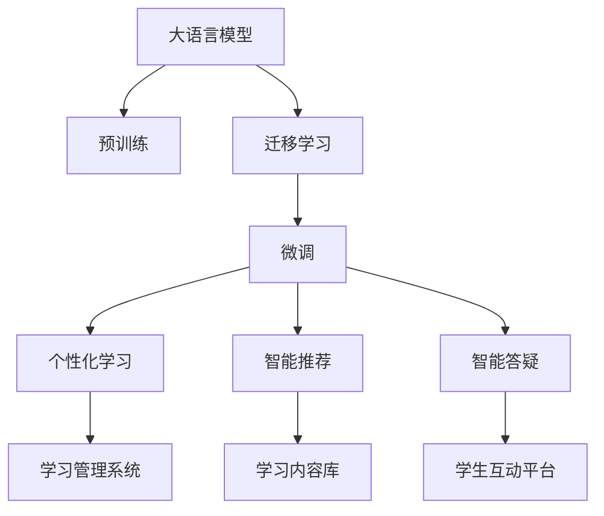

                 

# 大模型赋能智慧教育，创业者如何推动教育个性化与智能化？

## 1. 背景介绍

### 1.1 问题由来

在人类文明演进的历史长河中，教育始终是推动社会进步、培养人才的重要基石。随着科技的发展，尤其是人工智能（AI）和大数据技术的应用，教育技术（EdTech）领域迎来了前所未有的变革机遇。现代教育逐渐从传统的知识传授转向以学生为中心的个性化学习模式，以期在有限的教育资源下，最大限度地发挥每个学生的潜能。

当前，全球疫情的肆虐加剧了教育的数字化转型进程，越来越多的教育机构开始借助AI技术，特别是大语言模型（LLM）和自然语言处理（NLP）技术，以实现教学内容的智能化、个性化、动态化。然而，尽管教育科技产品层出不穷，如何高效、稳定地将大模型融入教育应用，仍是一大挑战。本文旨在为有意涉足这一领域的创业者提供一些深入见解与实用指南。

### 1.2 问题核心关键点

- **教育个性化**：根据每个学生的认知水平、兴趣和学习风格，定制个性化的教学内容。
- **教育智能化**：利用大数据和AI技术，实现学习分析、智能推荐、智能答疑等功能。
- **大语言模型（LLM）**：通过预训练-微调的方式，将通用语言模型适配于特定的教育任务。
- **深度学习与迁移学习**：在预训练模型基础上，通过有监督学习进行微调，实现领域特定任务的优化。
- **教育数据与隐私保护**：在教育应用中，如何处理学生数据，确保数据的隐私和安全。
- **技术落地与实践应用**：将大模型技术应用于教育产品开发和实际教学场景中的具体实践。

### 1.3 问题研究意义

教育大模型技术的应用，将显著提升教育质量、优化教育资源配置、推动教育公平。特别是在资源匮乏地区，通过大模型驱动的教育科技产品，可以让更多学生享受到优质教育资源。此外，教育个性化能够更好地因材施教，满足不同学生的多样化学习需求，促进学习效果和学习动力。

## 2. 核心概念与联系

### 2.1 核心概念概述

本节将介绍几个与教育大模型技术相关的核心概念及其相互联系。

- **大语言模型（LLM）**：如BERT、GPT等，通过在大规模文本数据上进行预训练，学习语言知识和语义信息。
- **迁移学习**：利用预训练模型在不同任务间的知识迁移能力，通过微调适配特定任务。
- **个性化学习**：根据学生特点和学习情境，定制个性化学习路径和教学内容。
- **智能推荐**：通过分析学生历史学习数据和行为，推荐适合的学习内容和资源。
- **智能答疑**：利用自然语言理解和生成技术，自动回答学生的提问，提升学习效率。

通过这些概念的结合，教育大模型能够在教育应用中发挥巨大作用。

### 2.2 核心概念原理和架构的 Mermaid 流程图



该图展示了大语言模型在教育领域的主要应用流程：

1. 通过预训练获取通用语言知识。
2. 利用迁移学习将模型适配到特定的教育任务。
3. 通过微调，提升模型在特定教育任务上的性能。
4. 根据学生个性化特征，定制个性化学习路径和内容。
5. 基于历史学习数据，进行智能推荐，辅助学习。
6. 自动回答学生问题，提升互动效率。
7. 整合到教育管理系统中，实现全面的教育智能化。

## 3. 核心算法原理 & 具体操作步骤

### 3.1 算法原理概述

教育大模型的核心算法原理是基于监督学习的迁移学习与微调。其核心思想是利用预训练模型在通用领域的知识，通过微调适配特定教育任务，实现个性化学习与智能化推荐。

具体而言，教育大模型通常包含两个阶段：

1. **预训练**：在大规模文本数据（如在线教材、论文、新闻等）上进行自监督学习，学习语言模型和语义知识。
2. **微调**：在教育任务（如课程内容、测评题等）上进行有监督学习，优化模型以适应特定任务需求。

### 3.2 算法步骤详解

#### 3.2.1 数据准备

- **收集教育数据**：包括各类教育文本、学生学习数据、测评题等。
- **数据预处理**：清洗、标注数据，构建训练集、验证集和测试集。

#### 3.2.2 模型选择与初始化

- **选择预训练模型**：根据教育任务的特点，选择合适的预训练模型，如BERT、GPT等。
- **模型初始化**：将预训练模型加载到系统中，进行后续的微调操作。

#### 3.2.3 微调模型

- **定义损失函数**：根据教育任务类型，设计合适的损失函数，如交叉熵损失等。
- **设置优化器与超参数**：选择合适的优化算法（如AdamW）和超参数（如学习率、批大小等）。
- **训练过程**：在训练集上迭代训练，通过反向传播更新模型参数，验证集上进行模型评估，防止过拟合。
- **测试与部署**：在测试集上评估模型性能，进行最终调优，部署到实际教育应用中。

#### 3.2.4 教育任务适配

- **定义任务层**：根据教育任务的类型，设计合适的输出层和损失函数。
- **任务训练**：在微调后的模型上，进行特定教育任务的训练。
- **模型评估与优化**：通过验证集评估模型性能，根据性能调整训练参数。

### 3.3 算法优缺点

#### 3.3.1 优点

- **高效性**：利用预训练模型的知识，减少从头训练的时间和计算资源。
- **适应性强**：能够快速适应特定教育任务，提升教学质量和个性化学习体验。
- **可扩展性**：支持多任务微调，能够覆盖多种教育场景。
- **性能提升明显**：在教育任务上，微调后的模型性能通常优于从头训练的模型。

#### 3.3.2 缺点

- **依赖标注数据**：教育微调需要大量标注数据，数据获取成本高，且标注质量直接影响微调效果。
- **模型泛化能力**：微调模型可能对标注数据过于拟合，泛化能力有限。
- **隐私与安全问题**：在处理学生数据时，需要重视数据隐私保护和模型安全。
- **高技术门槛**：教育微调需要较高技术门槛，对开发者要求高。

### 3.4 算法应用领域

教育大模型的应用领域极为广泛，涵盖了课堂教学、在线教育、学习辅助等多个方面。具体应用场景包括：

- **智能测评**：自动批改学生作业，实时反馈学习成果。
- **智能推荐系统**：根据学生历史学习数据，推荐学习资源。
- **智能答疑系统**：自动解答学生问题，提升学习效率。
- **个性化学习路径**：根据学生学习行为和成绩，定制个性化学习路径。
- **教学内容生成**：自动生成教材、习题等教学资源。

## 4. 数学模型和公式 & 详细讲解 & 举例说明

### 4.1 数学模型构建

在教育领域，大模型的应用通常涉及个性化推荐、智能测评等任务。这里以智能推荐系统为例，构建数学模型。

假设模型输入为 $x = (x_1, x_2, ..., x_n)$，表示学生的历史学习数据，输出为 $y$，表示推荐的资源。根据任务特点，可以定义不同的损失函数，这里以交叉熵损失函数为例：

$$
\mathcal{L}(y, \hat{y}) = -\sum_{i=1}^{n} y_i \log \hat{y}_i
$$

其中，$y_i$ 为真实推荐结果，$\hat{y}_i$ 为模型预测推荐结果。

### 4.2 公式推导过程

利用微调模型的预测结果 $\hat{y}$，可以计算预测错误率 $\epsilon$：

$$
\epsilon = \sum_{i=1}^{n} y_i(1 - \hat{y}_i)
$$

通过反向传播算法，计算模型参数的梯度，使用优化算法（如AdamW）更新参数，最小化损失函数。

### 4.3 案例分析与讲解

以某教育平台上的智能推荐系统为例，介绍模型的构建和应用。

1. **数据准备**：收集学生的历史学习数据，构建训练集和测试集。
2. **模型选择**：选择预训练模型，如BERT。
3. **微调**：在学生学习数据上进行有监督学习，优化模型。
4. **应用**：将微调后的模型部署到智能推荐系统，根据学生历史行为，推荐学习资源。

## 5. 项目实践：代码实例和详细解释说明

### 5.1 开发环境搭建

- **Python环境**：安装Python 3.7及以上版本。
- **深度学习框架**：安装PyTorch或TensorFlow。
- **预训练模型库**：安装HuggingFace的Transformers库，加载预训练模型。
- **教育数据集**：获取教育数据集，并进行预处理。
- **开发工具**：安装Jupyter Notebook，进行模型开发和调试。

### 5.2 源代码详细实现

```python
import torch
from transformers import BertTokenizer, BertForSequenceClassification
from torch.utils.data import Dataset, DataLoader
from sklearn.metrics import accuracy_score
import pandas as pd

# 加载预训练模型和分词器
model_name = 'bert-base-uncased'
tokenizer = BertTokenizer.from_pretrained(model_name)
model = BertForSequenceClassification.from_pretrained(model_name, num_labels=2)

# 定义数据集类
class EducationalDataset(Dataset):
    def __init__(self, data, tokenizer, max_len):
        self.data = data
        self.tokenizer = tokenizer
        self.max_len = max_len
        
    def __len__(self):
        return len(self.data)
    
    def __getitem__(self, item):
        text = self.data.iloc[item]['text']
        label = self.data.iloc[item]['label']
        encoding = self.tokenizer(text, return_tensors='pt', max_length=self.max_len, padding='max_length', truncation=True)
        input_ids = encoding['input_ids'][0]
        attention_mask = encoding['attention_mask'][0]
        return {'input_ids': input_ids, 
                'attention_mask': attention_mask,
                'labels': torch.tensor(label, dtype=torch.long)}
```

### 5.3 代码解读与分析

**EducationalDataset类**：
- `__init__`方法：初始化文本数据、分词器和模型最大长度。
- `__len__`方法：返回数据集长度。
- `__getitem__`方法：对单个样本进行处理，将文本编码成token ids，进行padding处理，返回模型所需的输入。

### 5.4 运行结果展示

```python
import torch.nn as nn
from transformers import AdamW

# 定义损失函数和优化器
criterion = nn.CrossEntropyLoss()
optimizer = AdamW(model.parameters(), lr=1e-5)

# 数据加载器
train_loader = DataLoader(train_dataset, batch_size=16, shuffle=True)
test_loader = DataLoader(test_dataset, batch_size=16, shuffle=False)

# 训练过程
device = torch.device('cuda' if torch.cuda.is_available() else 'cpu')
model.to(device)

for epoch in range(10):
    model.train()
    train_loss = 0
    for batch in train_loader:
        inputs = {k: v.to(device) for k, v in batch.items()}
        outputs = model(**inputs)
        loss = criterion(outputs, inputs['labels'])
        optimizer.zero_grad()
        loss.backward()
        optimizer.step()
        train_loss += loss.item()

    model.eval()
    test_loss = 0
    test_corrects = 0
    with torch.no_grad():
        for batch in test_loader:
            inputs = {k: v.to(device) for k, v in batch.items()}
            outputs = model(**inputs)
            loss = criterion(outputs, inputs['labels'])
            test_loss += loss.item()
            test_corrects += torch.argmax(outputs, dim=1) == inputs['labels'].sum().item()
    
    print(f"Epoch {epoch+1}, train loss: {train_loss/len(train_loader):.4f}, test loss: {test_loss/len(test_loader):.4f}, test accuracy: {test_corrects/len(test_loader):.4f}")
```

## 6. 实际应用场景

### 6.1 智能测评系统

智能测评系统能够自动批改学生作业，给出精确的分数和反馈。该系统可以部署在学校的服务器上，也可以作为在线教育的工具。

#### 6.1.1 需求分析

- **需求描述**：自动批改各类书面作业，包括选择题、填空题、问答题等。
- **设计思路**：使用微调后的BERT模型，对学生作业进行自然语言理解，并自动判别答案是否正确。
- **实现方法**：将作业文本输入模型，输出预测结果，结合人工标注，优化模型。

#### 6.1.2 技术实现

- **模型微调**：在已标注的作业数据上，对BERT模型进行微调。
- **结果输出**：将学生作业的预测结果与真实答案进行对比，输出分数和反馈。

### 6.2 智能推荐系统

智能推荐系统通过分析学生的历史学习数据，推荐适合的学习资源，提升学习效果。

#### 6.2.1 需求分析

- **需求描述**：根据学生兴趣和历史行为，推荐适合的学习资源，如在线课程、习题集、阅读材料等。
- **设计思路**：使用微调后的BERT模型，对学生的学习数据进行分析，生成个性化推荐列表。
- **实现方法**：将学生历史学习数据输入模型，输出推荐列表，供学生选择。

#### 6.2.2 技术实现

- **模型微调**：在学生历史学习数据上，对BERT模型进行微调。
- **结果输出**：根据学生历史数据，生成个性化推荐列表，供学生选择。

### 6.3 智能答疑系统

智能答疑系统能够自动回答学生的问题，提升学习效率。

#### 6.3.1 需求分析

- **需求描述**：自动回答学生在学习过程中遇到的各类问题。
- **设计思路**：使用微调后的BERT模型，对学生提出的问题进行自然语言理解，生成相应的回答。
- **实现方法**：将学生问题输入模型，输出预测回答。

#### 6.3.2 技术实现

- **模型微调**：在常见问题和答案数据上，对BERT模型进行微调。
- **结果输出**：将学生问题输入模型，输出预测回答。

### 6.4 未来应用展望

随着教育科技的不断发展，教育大模型将在更多教育场景中得到应用，带来更高效的个性化教育服务。

- **智慧教室**：通过教育大模型，实现自适应教学和个性化学习路径。
- **在线教育**：结合虚拟现实（VR）和增强现实（AR）技术，提供沉浸式学习体验。
- **学习管理系统**：集成教育大模型，提供个性化推荐、智能测评、智能答疑等服务。

## 7. 工具和资源推荐

### 7.1 学习资源推荐

为了帮助开发者系统掌握教育大模型的理论和实践，这里推荐一些优质的学习资源：

- **《深度学习与自然语言处理》**：讲解深度学习与NLP的基础知识和常用算法，适合入门学习。
- **Kaggle教育数据集**：提供各类教育数据集，供开发者进行实验和训练。
- **HuggingFace文档**：详细介绍了BERT等预训练模型的使用方法和微调范式。
- **Coursera教育技术课程**：提供系统化的教育科技知识学习，涵盖数据科学、教育心理学等多个领域。

### 7.2 开发工具推荐

- **PyTorch**：基于Python的开源深度学习框架，适合进行教育大模型的开发和实验。
- **TensorFlow**：由Google主导开发的深度学习框架，支持分布式训练和大规模模型。
- **HuggingFace Transformers库**：提供了多种预训练语言模型的封装，方便进行微调。
- **Jupyter Notebook**：免费在线的Python编程环境，适合进行模型训练和调试。
- **TensorBoard**：TensorFlow配套的可视化工具，帮助调试和监控模型训练过程。

### 7.3 相关论文推荐

- **《A Survey on Deep Learning for Educational Applications》**：综述了深度学习在教育领域的各类应用，包括智能推荐、智能测评等。
- **《The Effectiveness of Transfer Learning in Educational Data Mining》**：研究了迁移学习在教育数据分析中的应用效果。
- **《Training and Testing Deep Learning Models for Educational Data》**：介绍了在教育数据上训练和测试深度学习模型的常用方法。

## 8. 总结：未来发展趋势与挑战

### 8.1 研究成果总结

教育大模型的发展在近年来取得了显著进展，主要用于个性化推荐、智能测评、智能答疑等教育应用。通过预训练-微调的方式，大模型能够迅速适应教育任务，提升教育质量和学习效率。

### 8.2 未来发展趋势

- **技术进步**：深度学习算法和模型的不断进步，将使教育大模型在教育应用中发挥更大的作用。
- **数据开放**：教育数据集的开放共享将推动教育大模型的研究和应用。
- **跨领域融合**：教育大模型将与其他领域的技术进行融合，提升教育应用的多样性和创新性。

### 8.3 面临的挑战

- **数据获取与处理**：教育大模型的应用需要大量标注数据，数据获取和处理成本较高。
- **模型泛化能力**：微调模型可能对标注数据过于拟合，泛化能力有限。
- **隐私与安全问题**：在处理学生数据时，需要重视数据隐私和安全。
- **技术门槛高**：教育大模型的开发和应用需要较高的技术门槛。

### 8.4 研究展望

未来，教育大模型将朝着更加智能化、个性化、安全化的方向发展。结合AI、大数据、区块链等技术，构建更加公平、普惠、高效的教育系统。

## 9. 附录：常见问题与解答

**Q1：如何高效地获取教育大模型的标注数据？**

A: 教育大模型的标注数据通常需要依赖教育领域的专业知识，可以通过以下途径获取：
- **公开数据集**：利用公开的教育数据集，如Kaggle上的教育数据集。
- **教育机构合作**：与学校、教育机构合作，收集学生学习数据。
- **在线平台**：利用在线教育平台收集学生数据，如Coursera、Udacity等。

**Q2：如何优化教育大模型的泛化能力？**

A: 泛化能力的提升可以通过以下方法实现：
- **数据增强**：通过数据扩充和改写，增加训练集的样本多样性。
- **正则化**：使用L2正则、Dropout等技术，防止模型过拟合。
- **迁移学习**：利用领域外的数据进行迁移学习，增加模型泛化能力。
- **多任务学习**：利用多个任务的数据，提高模型泛化能力。

**Q3：如何保证教育大模型的隐私与安全？**

A: 数据隐私和安全是教育大模型应用中必须重视的问题，可以通过以下方法保障：
- **数据脱敏**：对敏感数据进行匿名化处理，保护学生隐私。
- **加密传输**：通过加密技术保护数据传输过程中的安全。
- **访问控制**：限制对学生数据的访问权限，确保数据安全。

**Q4：如何降低教育大模型的技术门槛？**

A: 降低技术门槛可以通过以下方法实现：
- **开源工具**：使用开源的深度学习框架和预训练模型库，降低开发门槛。
- **模型压缩**：采用模型压缩技术，减小模型规模，提高可部署性。
- **自动化工具**：使用自动化工具进行模型训练和调参，降低技术门槛。

通过上述方法的综合应用，可以显著降低教育大模型的技术门槛，推动其在更多教育场景中的落地应用。

---

作者：禅与计算机程序设计艺术 / Zen and the Art of Computer Programming

