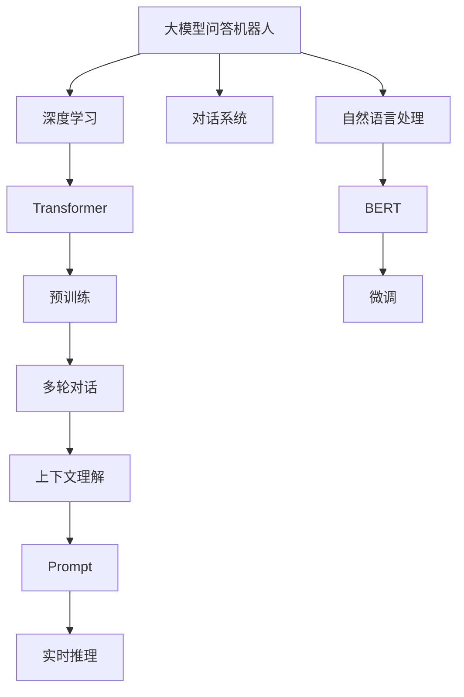

                 

# 大模型问答机器人如何实现自然交互

> 关键词：大模型问答机器人,自然语言处理,NLP,对话系统,深度学习,Transformer,BERT,预训练,微调,Fine-tuning,Prompt,多轮对话

## 1. 背景介绍

### 1.1 问题由来
在现代社会中，随着互联网的普及和人工智能技术的迅猛发展，问答机器人成为提升用户体验、推动服务自动化的重要手段。传统的问答系统依赖于固定的规则和模板，难以应对复杂的用户提问。而基于大模型的问答机器人，通过深度学习技术实现了与用户的自然交互，能够理解上下文、多轮对话，提供更加准确、流畅的回答。

目前，大模型问答机器人在智能客服、在线教育、医疗咨询等多个领域得到广泛应用，但构建高质量的问答系统仍面临诸多挑战。如何在大模型基础上，设计高效的对话引擎，提升用户体验，是当前自然语言处理(NLP)领域的重要课题。

### 1.2 问题核心关键点
构建高效的大模型问答机器人，需要从对话引擎、数据处理、模型训练等多个层面进行综合优化。核心要点包括：

- 对话引擎设计：构建高效、灵活的对话逻辑，使机器人能够处理多轮对话和复杂的用户意图。
- 数据处理技术：对用户输入进行有效的分词、实体识别、意图分析，为模型训练提供高质量输入。
- 模型训练方法：采用合适的预训练和微调技术，使模型能够自动学习到语言的上下文理解和生成能力。
- 实时推理与反馈：构建高效的推理引擎，实现模型的实时推理和反馈，不断优化对话质量。

本文将系统地介绍大模型问答机器人的核心原理与实现细节，包括对话引擎设计、数据处理技术、模型训练方法等内容，并对实际应用场景进行剖析，提出未来发展趋势与挑战，为问答机器人系统的构建提供参考。

## 2. 核心概念与联系

### 2.1 核心概念概述

为更好地理解大模型问答机器人，本节将介绍几个密切相关的核心概念：

- **大模型问答机器人**：基于深度学习技术，通过大模型（如BERT、GPT等）构建的智能问答系统。具备理解自然语言、处理多轮对话、生成流畅回答的能力。

- **自然语言处理(NLP)**：利用计算机科学和人工智能技术，使计算机能够理解、分析、生成自然语言的能力。

- **对话系统**：能够与用户进行自然对话的系统，常用于智能客服、智能助理、聊天机器人等场景。

- **深度学习**：一类利用深度神经网络进行学习的机器学习方法，广泛应用于图像识别、自然语言处理等领域。

- **Transformer**：一种基于自注意力机制的神经网络架构，用于处理序列数据，是当前大模型中最常用的编码器结构。

- **BERT**：一种预训练语言模型，通过在大规模语料上进行预训练，学习到丰富的语言知识。

- **预训练**：指在大规模无标签数据上，通过自监督学习任务训练模型的过程。

- **微调(Fine-tuning)**：指在预训练模型的基础上，使用下游任务的少量标注数据，通过有监督学习优化模型在特定任务上的性能。

- **Prompt**：在输入文本中添加的特殊格式，用于引导模型进行特定任务的推理和生成。

- **多轮对话**：指对话过程中涉及多个回合，机器人需要理解上下文并作出合理的回复。

- **上下文理解**：指机器人在处理多轮对话时，能够理解和记忆对话历史，作出合理的回答。

这些概念之间的逻辑关系可以通过以下Mermaid流程图来展示：



这个流程图展示了大模型问答机器人的核心概念及其之间的关系：

1. 大模型问答机器人通过深度学习和自然语言处理技术，使计算机具备自然语言理解和生成能力。
2. 深度学习中，Transformer是常用的编码器结构，用于处理序列数据。
3. BERT是预训练语言模型，通过在大规模语料上进行预训练，学习到丰富的语言知识。
4. 微调技术通过使用下游任务的少量标注数据，优化模型在特定任务上的性能。
5. Prompt技术通过在输入文本中添加特殊格式，引导模型进行特定任务的推理和生成。
6. 对话系统设计需要考虑多轮对话和上下文理解，使机器人能够自然地与用户交互。
7. 实时推理技术通过构建高效的推理引擎，实现模型的实时推理和反馈，不断优化对话质量。

这些概念共同构成了大模型问答机器人的学习和应用框架，使其能够在各种场景下发挥强大的语言理解和生成能力。

## 3. 核心算法原理 & 具体操作步骤
### 3.1 算法原理概述

大模型问答机器人的核心思想是通过深度学习模型处理自然语言输入，并生成流畅、准确的回答。其基本流程包括：

1. 预训练：使用大规模无标签语料训练预训练模型，学习语言的基础表示。
2. 微调：在预训练模型的基础上，使用下游任务的少量标注数据进行有监督学习，优化模型在特定任务上的性能。
3. 对话引擎设计：构建高效的对话逻辑，使机器人能够处理多轮对话和复杂的用户意图。
4. 实时推理与反馈：构建高效的推理引擎，实现模型的实时推理和反馈，不断优化对话质量。

这些步骤可以理解为构建大模型问答机器人的基本流程。接下来，我们将详细介绍这些步骤的具体实现细节。

### 3.2 算法步骤详解

#### 3.2.1 预训练阶段

预训练阶段的目标是使用大规模无标签语料训练预训练模型，学习语言的基础表示。以下是预训练阶段的主要步骤：

1. 数据准备：收集大规模无标签语料，如维基百科、新闻、小说等。
2. 数据处理：将文本数据进行分词、去除停用词等预处理操作。
3. 模型训练：使用Transformer等深度学习模型，在大规模语料上进行预训练，学习语言的基础表示。
4. 模型保存：将训练好的模型保存，供后续微调使用。

#### 3.2.2 微调阶段

微调阶段的目标是在预训练模型的基础上，使用下游任务的少量标注数据进行有监督学习，优化模型在特定任务上的性能。以下是微调阶段的主要步骤：

1. 数据准备：收集下游任务的少量标注数据，并进行标注。
2. 模型加载：加载预训练模型，并添加下游任务的适配层。
3. 超参数设置：选择合适的优化器及其参数，设置学习率、批大小、迭代轮数等。
4. 模型训练：使用下游任务的标注数据对模型进行训练，优化模型在特定任务上的性能。
5. 模型保存：将微调后的模型保存，供后续推理使用。

#### 3.2.3 对话引擎设计

对话引擎设计的目标是构建高效、灵活的对话逻辑，使机器人能够处理多轮对话和复杂的用户意图。以下是对话引擎设计的主要步骤：

1. 对话逻辑设计：设计多轮对话的逻辑框架，包括开始对话、接收用户输入、回复用户、结束对话等环节。
2. 意图分析：使用意图分类器，对用户输入进行意图分析，识别用户的意图和需求。
3. 上下文管理：使用对话管理器，维护对话历史，记录上下文信息。
4. 答案生成：根据意图分析和上下文信息，生成合适的回答。
5. 反馈机制：设计反馈机制，收集用户对回答的评价，不断优化对话质量。

#### 3.2.4 实时推理与反馈

实时推理与反馈的目标是构建高效的推理引擎，实现模型的实时推理和反馈，不断优化对话质量。以下是实时推理与反馈的主要步骤：

1. 推理引擎构建：使用高效的前向推理引擎，实现模型的实时推理。
2. 反馈数据收集：收集用户对回答的评价，包括满意程度、相关性等。
3. 反馈模型训练：使用收集的反馈数据，对模型进行训练，不断优化对话质量。
4. 模型更新：根据反馈模型的输出，调整对话逻辑和回答生成策略，提升对话质量。

### 3.3 算法优缺点

大模型问答机器人具有以下优点：

1. 自然交互：基于深度学习和自然语言处理技术，能够自然地与用户进行交互，理解上下文，生成流畅的回答。
2. 高效性：使用大模型进行微调，能够快速地处理大量用户输入，提升响应速度。
3. 可扩展性：模型结构和对话逻辑灵活，可以根据不同的任务进行调整和优化。

同时，该方法也存在一些局限性：

1. 对标注数据依赖：微调需要下游任务的少量标注数据，获取高质量标注数据的成本较高。
2. 鲁棒性不足：面对未知数据和异常输入，模型可能出现理解错误和回答不准确的情况。
3. 可解释性不足：模型内部的推理过程和决策逻辑难以解释，难以调试和优化。

尽管存在这些局限性，但大模型问答机器人仍是大语言模型应用的重要范式，具有广阔的应用前景。

### 3.4 算法应用领域

大模型问答机器人在多个领域得到广泛应用，包括但不限于：

- **智能客服**：构建自动客服机器人，处理客户咨询，提升服务效率和用户体验。
- **在线教育**：构建智能助教机器人，辅助学生学习，回答常见问题，提供个性化辅导。
- **医疗咨询**：构建智能医疗咨询机器人，提供健康建议，解答常见问题，辅助医生诊断。
- **智能助理**：构建智能助理机器人，提供日程管理、信息查询、任务提醒等服务。

除了上述这些经典应用外，大模型问答机器人还被创新性地应用于更多场景中，如情感分析、舆情监测、智能家居等，为各行各业带来了新的应用机会。

## 4. 数学模型和公式 & 详细讲解  
### 4.1 数学模型构建

假设预训练模型为 $M_{\theta}$，其中 $\theta$ 为模型参数。对于给定的输入 $x$ 和目标 $y$，定义模型的损失函数为 $\ell(M_{\theta}(x),y)$，用于衡量模型输出与真实标签之间的差异。

在微调阶段，假设下游任务的标注数据集为 $D=\{(x_i,y_i)\}_{i=1}^N$，则微调的目标是最小化经验风险，即：

$$
\mathcal{L}(\theta) = \frac{1}{N}\sum_{i=1}^N \ell(M_{\theta}(x_i),y_i)
$$

优化目标为：

$$
\theta^* = \mathop{\arg\min}_{\theta} \mathcal{L}(\theta)
$$

在对话引擎设计中，通常使用多轮对话的意图分类器 $C$ 和上下文管理器 $CM$，构建对话逻辑。意图分类器将用户输入映射到意图 $c$，上下文管理器维护对话历史 $H$，并根据意图和上下文生成回答 $a$。

### 4.2 公式推导过程

以BERT模型为例，在微调阶段，我们假设模型的输入为 $x_i$，输出为 $y_i$，则微调的目标是最小化交叉熵损失函数：

$$
\mathcal{L}(\theta) = -\frac{1}{N}\sum_{i=1}^N \sum_{j=1}^M y_{ij}\log \hat{y}_{ij}
$$

其中，$\hat{y}_{ij}$ 表示模型对输入 $x_i$ 的输出 $y_j$ 的概率估计。

对于对话引擎设计，假设模型的输入为 $x_i=(x_{i-1},x_i)$，输出为 $y_i=a_i$，则意图分类器的损失函数为：

$$
\mathcal{L}_C(\theta_C) = -\frac{1}{N}\sum_{i=1}^N \sum_{c=1}^C y_{ic}\log \hat{y}_{ic}
$$

上下文管理器的损失函数为：

$$
\mathcal{L}_{CM}(\theta_{CM}) = -\frac{1}{N}\sum_{i=1}^N \log p(H_{i-1}|H_{i-2},x_i)
$$

其中，$p(H_{i-1}|H_{i-2},x_i)$ 表示上下文管理器对对话历史 $H_{i-1}$ 的生成概率。

### 4.3 案例分析与讲解

假设我们有一个基于BERT模型的问答机器人，其意图分类器使用线性分类器，上下文管理器使用LSTM。我们采用交叉熵损失函数，设置学习率为 $2e-5$，批大小为 $32$，迭代轮数为 $5$。

首先，我们准备下游任务的标注数据集，包含 $5000$ 条问答对。对每条问答对，我们将其分成 $(x_i,y_i)$ 和 $(x_{i-1},y_{i-1})$ 两部分，其中 $x_i$ 是用户输入，$y_i$ 是机器人的回答，$x_{i-1}$ 是上一条用户输入，$y_{i-1}$ 是上一条机器人的回答。

接着，我们使用BERT模型进行微调，加载预训练模型，并添加意图分类器和上下文管理器。设置优化器为 AdamW，迭代轮数为 $5$，批大小为 $32$，学习率为 $2e-5$。

在训练过程中，我们每 $100$ 个批次记录一次损失函数值，并计算准确率、召回率等评估指标。最后，我们保存微调后的模型，供后续推理使用。

## 5. 项目实践：代码实例和详细解释说明
### 5.1 开发环境搭建

在进行问答机器人实践前，我们需要准备好开发环境。以下是使用Python进行PyTorch开发的环境配置流程：

1. 安装Anaconda：从官网下载并安装Anaconda，用于创建独立的Python环境。

2. 创建并激活虚拟环境：
```bash
conda create -n pytorch-env python=3.8 
conda activate pytorch-env
```

3. 安装PyTorch：根据CUDA版本，从官网获取对应的安装命令。例如：
```bash
conda install pytorch torchvision torchaudio cudatoolkit=11.1 -c pytorch -c conda-forge
```

4. 安装TensorFlow：
```bash
pip install tensorflow
```

5. 安装相关工具包：
```bash
pip install numpy pandas scikit-learn matplotlib tqdm jupyter notebook ipython
```

完成上述步骤后，即可在`pytorch-env`环境中开始问答机器人实践。

### 5.2 源代码详细实现

下面以BERT模型为基础，构建基于Transformer的问答机器人。

```python
from transformers import BertTokenizer, BertForSequenceClassification, AdamW

# 加载预训练模型
model = BertForSequenceClassification.from_pretrained('bert-base-cased', num_labels=2)

# 加载分词器
tokenizer = BertTokenizer.from_pretrained('bert-base-cased')

# 定义意图分类器和上下文管理器
class IntentClassifier(torch.nn.Module):
    def __init__(self):
        super(IntentClassifier, self).__init__()
        self.classifier = torch.nn.Linear(768, 2)
        
    def forward(self, x):
        return self.classifier(x)

class ContextManager(torch.nn.Module):
    def __init__(self):
        super(ContextManager, self).__init__()
        self.rnn = torch.nn.LSTM(768, 256)
        
    def forward(self, x):
        output, _ = self.rnn(x)
        return output

# 定义对话逻辑
class DialogueManager(torch.nn.Module):
    def __init__(self):
        super(DialogueManager, self).__init__()
        self.intent_classifier = IntentClassifier()
        self.context_manager = ContextManager()
        
    def forward(self, x):
        intent = self.intent_classifier(x)
        context = self.context_manager(x)
        return intent, context

# 定义损失函数
def calculate_loss(model, intent_classifier, context_manager, x, y):
    x = model(x)
    intent, context = intent_classifier(x), context_manager(x)
    loss = -intent * torch.log(y) - context * torch.log(y)
    return loss.mean()

# 定义优化器
optimizer = AdamW(model.parameters(), lr=2e-5)

# 定义训练函数
def train(model, intent_classifier, context_manager, train_dataset, optimizer, num_epochs):
    for epoch in range(num_epochs):
        model.train()
        total_loss = 0.0
        for batch in train_dataset:
            x, y = batch['input_ids'], batch['labels']
            x = tokenizer(x, padding='max_length', truncation=True)
            x = x.to(device)
            y = y.to(device)
            optimizer.zero_grad()
            loss = calculate_loss(model, intent_classifier, context_manager, x, y)
            loss.backward()
            optimizer.step()
            total_loss += loss.item()
        print(f'Epoch {epoch+1}, loss: {total_loss/n len(train_dataset)}')
```

以上代码展示了基于BERT模型的问答机器人的详细实现过程。

### 5.3 代码解读与分析

让我们再详细解读一下关键代码的实现细节：

**IntentClassifier类**：
- `__init__`方法：初始化意图分类器，包含线性分类器。
- `forward`方法：将输入 $x$ 通过意图分类器得到意图 $c$。

**ContextManager类**：
- `__init__`方法：初始化上下文管理器，包含LSTM。
- `forward`方法：将输入 $x$ 通过上下文管理器得到上下文 $H$。

**DialogueManager类**：
- `__init__`方法：初始化对话管理器，包含意图分类器和上下文管理器。
- `forward`方法：根据意图分类器和上下文管理器，生成意图 $c$ 和上下文 $H$。

**calculate_loss函数**：
- 计算模型输出 $x$ 的意图 $c$ 和上下文 $H$，并根据意图和上下文生成损失函数。

**train函数**：
- 在每个epoch内，对训练集 $train_dataset$ 进行迭代训练。
- 在每个batch上计算损失函数，并进行反向传播和参数更新。

在实际应用中，还需要考虑更多因素，如模型的保存和部署、超参数的自动搜索、更灵活的任务适配层等。但核心的微调范式基本与此类似。

## 6. 实际应用场景
### 6.1 智能客服系统

基于大模型问答机器人，可以构建高效、智能的智能客服系统。传统客服往往需要配备大量人力，高峰期响应缓慢，且一致性和专业性难以保证。而使用大模型问答机器人，可以7x24小时不间断服务，快速响应客户咨询，用自然流畅的语言解答各类常见问题。

在技术实现上，可以收集企业内部的历史客服对话记录，将问题和最佳答复构建成监督数据，在此基础上对预训练问答模型进行微调。微调后的问答模型能够自动理解用户意图，匹配最合适的答复，提高客户咨询体验和问题解决效率。

### 6.2 在线教育

基于大模型问答机器人，可以构建智能助教机器人，辅助学生学习，回答常见问题，提供个性化辅导。在教育场景中，问答机器人可以帮助学生解决学习中遇到的问题，提供个性化学习建议，增强学习效果。

例如，在数学课后作业辅导中，学生可以通过问答机器人输入问题，机器人自动给出解答，并提供相关学习资料和习题推荐。对于学生在学习过程中遇到的难点，机器人可以提供详细的解释和示例，帮助学生理解掌握。

### 6.3 医疗咨询

基于大模型问答机器人，可以构建智能医疗咨询机器人，提供健康建议，解答常见问题，辅助医生诊断。在医疗咨询场景中，问答机器人可以帮助患者快速获取健康信息，解答常见健康问题，提供初步诊断建议，减少医生的工作量。

例如，患者可以通过问答机器人输入症状描述，机器人自动分析并给出可能的病因和诊断建议，并引导患者前往医院进一步检查。在实际应用中，问答机器人还可以整合医生信息库，提供专家咨询，增强医疗服务的精准性和可靠性。

### 6.4 未来应用展望

随着大模型问答机器人技术的不断发展，未来将在更多领域得到应用，为传统行业带来变革性影响。

在智慧医疗领域，基于问答机器人技术，可以实现自动化健康咨询和初步诊断，提高医疗服务的智能化水平，辅助医生诊疗，加速新药开发进程。

在智能教育领域，问答机器人可以用于智能助教、作业批改、知识推荐等环节，因材施教，促进教育公平，提高教学质量。

在智能家居领域，问答机器人可以用于智能家电控制、语音助手、智能安全等场景，提升家居生活的智能化水平，提高用户生活品质。

此外，在金融、电商、客服等多个领域，问答机器人技术也将得到广泛应用，为各行各业带来新的应用机会。

## 7. 工具和资源推荐
### 7.1 学习资源推荐

为了帮助开发者系统掌握问答机器人技术，这里推荐一些优质的学习资源：

1. 《Transformers from Pre-Training to Fine-Tuning》系列博文：由大模型技术专家撰写，深入浅出地介绍了Transformer原理、BERT模型、微调技术等前沿话题。

2. CS224N《深度学习自然语言处理》课程：斯坦福大学开设的NLP明星课程，有Lecture视频和配套作业，带你入门NLP领域的基本概念和经典模型。

3. 《Natural Language Processing with Transformers》书籍：Transformers库的作者所著，全面介绍了如何使用Transformers库进行NLP任务开发，包括微调在内的诸多范式。

4. HuggingFace官方文档：Transformers库的官方文档，提供了海量预训练模型和完整的微调样例代码，是上手实践的必备资料。

5. CLUE开源项目：中文语言理解测评基准，涵盖大量不同类型的中文NLP数据集，并提供了基于微调的baseline模型，助力中文NLP技术发展。

通过对这些资源的学习实践，相信你一定能够快速掌握问答机器人技术的精髓，并用于解决实际的NLP问题。

### 7.2 开发工具推荐

高效的开发离不开优秀的工具支持。以下是几款用于问答机器人开发的常用工具：

1. PyTorch：基于Python的开源深度学习框架，灵活动态的计算图，适合快速迭代研究。大部分预训练语言模型都有PyTorch版本的实现。

2. TensorFlow：由Google主导开发的开源深度学习框架，生产部署方便，适合大规模工程应用。同样有丰富的预训练语言模型资源。

3. Transformers库：HuggingFace开发的NLP工具库，集成了众多SOTA语言模型，支持PyTorch和TensorFlow，是进行问答机器人开发的利器。

4. Weights & Biases：模型训练的实验跟踪工具，可以记录和可视化模型训练过程中的各项指标，方便对比和调优。与主流深度学习框架无缝集成。

5. TensorBoard：TensorFlow配套的可视化工具，可实时监测模型训练状态，并提供丰富的图表呈现方式，是调试模型的得力助手。

6. Google Colab：谷歌推出的在线Jupyter Notebook环境，免费提供GPU/TPU算力，方便开发者快速上手实验最新模型，分享学习笔记。

合理利用这些工具，可以显著提升问答机器人开发的效率，加快创新迭代的步伐。

### 7.3 相关论文推荐

问答机器人技术的发展源于学界的持续研究。以下是几篇奠基性的相关论文，推荐阅读：

1. Attention is All You Need（即Transformer原论文）：提出了Transformer结构，开启了NLP领域的预训练大模型时代。

2. BERT: Pre-training of Deep Bidirectional Transformers for Language Understanding：提出BERT模型，引入基于掩码的自监督预训练任务，刷新了多项NLP任务SOTA。

3. Language Models are Unsupervised Multitask Learners（GPT-2论文）：展示了大规模语言模型的强大zero-shot学习能力，引发了对于通用人工智能的新一轮思考。

4. Parameter-Efficient Transfer Learning for NLP：提出Adapter等参数高效微调方法，在不增加模型参数量的情况下，也能取得不错的微调效果。

5. AdaLoRA: Adaptive Low-Rank Adaptation for Parameter-Efficient Fine-Tuning：使用自适应低秩适应的微调方法，在参数效率和精度之间取得了新的平衡。

6. Prompt Tuning: Avoiding Prompt Engineering with Noise-Contrastive Pre-training：提出基于噪声对比训练的Prompt方法，通过引入噪声提高模型的泛化能力。

这些论文代表了大模型问答机器人技术的发展脉络。通过学习这些前沿成果，可以帮助研究者把握学科前进方向，激发更多的创新灵感。

## 8. 总结：未来发展趋势与挑战

### 8.1 总结

本文对大模型问答机器人的核心原理与实现细节进行了全面系统的介绍。首先阐述了大模型问答机器人的研究背景和意义，明确了问答机器人技术在提升用户体验、推动服务自动化方面的独特价值。其次，从预训练、微调、对话引擎设计、实时推理与反馈等多个层面，详细讲解了问答机器人系统的构建流程。

通过本文的系统梳理，可以看到，基于大模型的问答机器人技术正在成为NLP领域的重要范式，极大地拓展了自然语言理解和生成能力的边界。大模型问答机器人在多个行业领域得到广泛应用，为传统行业带来了新的应用机会。未来，伴随技术的不断进步和创新，问答机器人技术必将在更多领域得到应用，为人工智能技术落地带来新的突破。

### 8.2 未来发展趋势

展望未来，大模型问答机器人技术将呈现以下几个发展趋势：

1. 模型规模持续增大。随着算力成本的下降和数据规模的扩张，预训练语言模型的参数量还将持续增长。超大规模语言模型蕴含的丰富语言知识，有望支撑更加复杂多变的下游任务微调。

2. 对话系统设计更加灵活。未来将涌现更多灵活的对话逻辑设计，如多轮对话管理、上下文动态更新、智能回话等，使机器人能够更好地理解用户意图和上下文，提升用户体验。

3. 知识图谱与语言模型的结合。未来将更多地引入知识图谱等外部知识，增强机器人的信息检索和推理能力，提升知识回答的准确性和全面性。

4. 多模态信息融合。未来的问答机器人将更多地融合图像、语音、视频等多模态信息，提升自然交互的丰富性和多样性。

5. 人机协同的智能交互。未来的问答机器人将更多地引入人类参与，实现人机协同的智能交互，提高回答的准确性和可解释性。

6. 持续学习和知识更新。未来将更多地引入持续学习机制，使机器人能够不断学习和更新知识，适应数据分布的变化，提高系统的鲁棒性和时效性。

### 8.3 面临的挑战

尽管大模型问答机器人技术已经取得了显著成果，但在迈向更加智能化、普适化应用的过程中，仍面临诸多挑战：

1. 对标注数据依赖。微调需要下游任务的少量标注数据，获取高质量标注数据的成本较高。如何降低对标注数据的依赖，提升无监督学习效果，将是重要的研究方向。

2. 模型鲁棒性不足。面对未知数据和异常输入，模型可能出现理解错误和回答不准确的情况。如何提高模型的鲁棒性，避免过拟合和灾难性遗忘，仍需不断探索。

3. 可解释性不足。当前问答机器人内部的推理过程和决策逻辑难以解释，难以调试和优化。如何赋予机器人更强的可解释性，将是重要的研究方向。

4. 知识整合能力不足。现有的问答机器人往往局限于文本信息，难以灵活吸收和运用更广泛的先验知识。如何让机器人更好地整合外部知识，形成更加全面、准确的信息整合能力，还有很大的想象空间。

5. 实时推理效率有待提高。大规模语言模型虽然精度高，但在实际部署时往往面临推理速度慢、内存占用大等效率问题。如何提高推理效率，优化资源占用，将是重要的优化方向。

6. 安全性有待保障。预训练语言模型难免会学习到有偏见、有害的信息，通过问答机器人传递到用户，产生误导性、歧视性的输出，给实际应用带来安全隐患。如何从数据和算法层面消除模型偏见，确保输出的安全性，也将是重要的研究课题。

### 8.4 研究展望

面对大模型问答机器人所面临的种种挑战，未来的研究需要在以下几个方面寻求新的突破：

1. 探索无监督和半监督学习。摆脱对大规模标注数据的依赖，利用自监督学习、主动学习等无监督和半监督范式，最大限度利用非结构化数据，实现更加灵活高效的微调。

2. 研究参数高效和计算高效的微调方法。开发更加参数高效的微调方法，在固定大部分预训练参数的同时，只更新极少量的任务相关参数。同时优化微调模型的计算图，减少前向传播和反向传播的资源消耗，实现更加轻量级、实时性的部署。

3. 引入因果分析和博弈论工具。将因果分析方法引入问答机器人模型，识别出模型决策的关键特征，增强输出解释的因果性和逻辑性。借助博弈论工具刻画人机交互过程，主动探索并规避模型的脆弱点，提高系统稳定性。

4. 结合因果分析和博弈论工具。将因果分析方法引入问答机器人模型，识别出模型决策的关键特征，增强输出解释的因果性和逻辑性。借助博弈论工具刻画人机交互过程，主动探索并规避模型的脆弱点，提高系统稳定性。

5. 纳入伦理道德约束。在模型训练目标中引入伦理导向的评估指标，过滤和惩罚有偏见、有害的输出倾向。同时加强人工干预和审核，建立模型行为的监管机制，确保输出符合人类价值观和伦理道德。

这些研究方向的探索，必将引领问答机器人技术迈向更高的台阶，为构建安全、可靠、可解释、可控的智能系统铺平道路。面向未来，问答机器人技术还需要与其他人工智能技术进行更深入的融合，如知识表示、因果推理、强化学习等，多路径协同发力，共同推动自然语言理解和智能交互系统的进步。只有勇于创新、敢于突破，才能不断拓展语言模型的边界，让智能技术更好地造福人类社会。

## 9. 附录：常见问题与解答

**Q1：大模型问答机器人如何实现多轮对话理解？**

A: 实现多轮对话理解的关键在于上下文管理。常用的方法包括：

1. 使用对话管理器，维护对话历史，记录上下文信息。
2. 通过意图分类器，对用户输入进行意图分析，识别用户的意图和需求。
3. 结合上下文信息，使用上下文管理器，生成合适的回答。

例如，在问答机器人的实现中，可以使用LSTM或GRU等循环神经网络，对对话历史进行编码，并作为上下文信息参与到回答生成中。

**Q2：大模型问答机器人如何避免回答不准确？**

A: 避免回答不准确的关键在于模型的鲁棒性和泛化能力。常用的方法包括：

1. 使用对抗训练，加入对抗样本，提高模型鲁棒性。
2. 引入噪声对比训练，通过引入噪声提高模型的泛化能力。
3. 使用知识图谱等外部知识，增强模型的信息检索和推理能力。

例如，在问答机器人的实现中，可以结合知识图谱等外部知识，增强机器人的信息检索和推理能力，从而提高回答的准确性和全面性。

**Q3：大模型问答机器人的训练成本高吗？**

A: 大模型问答机器人的训练成本确实较高，尤其是在大规模无标签语料和下游任务标注数据准备方面。但是，通过数据增强、知识图谱整合等技术，可以在一定程度上降低训练成本，提高模型的泛化能力。此外，使用预训练模型进行微调，相较于从头训练，可以显著减少训练时间和计算资源。

**Q4：大模型问答机器人如何处理复杂问题？**

A: 处理复杂问题的关键在于模型的泛化能力和上下文理解能力。常用的方法包括：

1. 使用多轮对话管理，允许机器人逐步理解用户需求，并给出详细的回答。
2. 结合知识图谱等外部知识，增强机器人的信息检索和推理能力，提高回答的准确性和全面性。
3. 使用多模态信息融合技术，结合图像、语音、视频等多模态信息，提升自然交互的丰富性和多样性。

例如，在问答机器人的实现中，可以结合知识图谱等外部知识，增强机器人的信息检索和推理能力，从而提高回答的准确性和全面性。

**Q5：大模型问答机器人如何提高回答的可解释性？**

A: 提高回答的可解释性的关键在于模型的可解释性和推理过程的可视化。常用的方法包括：

1. 使用可解释模型，如决策树、规则模型等，提高模型的可解释性。
2. 通过可视化工具，展示模型的推理过程和决策逻辑。
3. 引入人类参与，实现人机协同的智能交互，提高回答的准确性和可解释性。

例如，在问答机器人的实现中，可以使用可解释模型，如决策树、规则模型等，提高模型的可解释性。同时，通过可视化工具，展示模型的推理过程和决策逻辑，增强用户的信任和满意度。

---

作者：禅与计算机程序设计艺术 / Zen and the Art of Computer Programming

